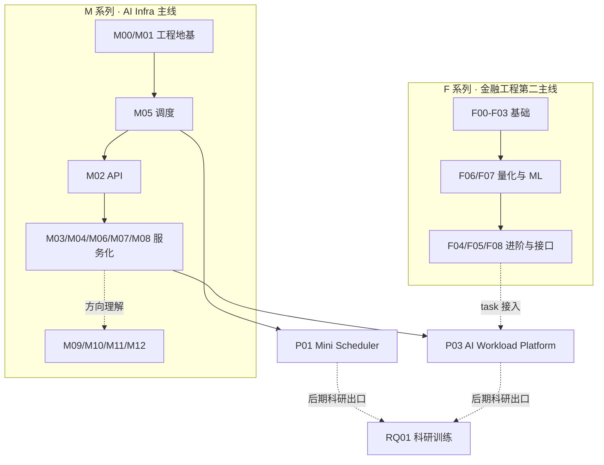

# 学习模块阅读指南

## 这份指南解决什么

学习库里每个模块都有学习地图、适配教材、资料索引、实验和项目出口。直接当清单看，很容易陷入“东西很多，但不知道先抓什么”。

这份指南只给你三样东西：一张全局地图、一套读每个模块的方法、一份避坑清单。先看地图建立空间感，再用方法读模块，遇到卡点查避坑清单。

## 先看一张全局地图



两件事先记住：

- 横向有两条主线（M / F），纵向都汇到项目（P01 / P03），RQ01 是更后期的科研出口，第一轮不用管。
- 你任何时候只在一条线、一个模块上动手，其他先作为方向理解。

## 两条主线怎么分

```text
M 系列：AI Infra / AI Workload Platform 主线
F 系列：金融工程与量化金融第二主线
```

M 系列解决：系统如何承载、调度、监控和交付 AI workload。

F 系列解决：金融任务本身如何定义、计算、评估和控制风险。

交叉线不是第三套学习模块，而是把 F 系列任务接到 M 系列项目里：

```text
F02/F03/F06/F07/F08
-> P03 risk_metric_task / backtest_task / pricing_task / evaluation_task
```

## 先避开五个坑

开始读之前先记住不要做什么，比记住要做什么更省时间：

- 不要把资料索引当阅读任务清单（教材或实验需要时再查）。
- 不要为了“完整”提前学 K8s / vLLM / 多 Agent。
- 不要在没做实验前写项目结论。
- 不要把 AI 生成代码当成自己已经完成的成果。
- 不要同时推进太多模块。

## 看不懂时怎么降级

不要马上去搜十篇文章。按下面顺序降级：

1. 回到本模块学习地图，看“要解决的问题”。
2. 找教材里的最小例子或伪代码。
3. 看对应实验页的记录表和验收标准。
4. 只查资料索引里对应的官方文档小节。
5. 把不懂的问题写进项目或实验的问题记录。

## 读每个模块只抓四件事

打开任意学习地图时，先只看四块：

1. `在总路线中的位置`：知道它为什么存在。
2. `要解决的问题`：知道你学完要能回答什么。
3. `学习目标 / 检查标准`：知道什么叫学会。
4. `对应实验 / 对应项目`：知道学完要做什么。

资料索引先不要逐条点开。整条阅读动线是：

```text
我为什么要学这个
-> 它解决项目里的什么问题
-> 最小概念是什么
-> 最小代码/流程是什么
-> 我做一个什么练习
-> 我用什么标准判断学会了
-> 它如何进入 P01 / P03
```

## 读教材每章的顺序

每章按这个顺序读：

```text
本章目标
-> 为什么要学
-> 核心概念
-> 最小例子
-> 常见错误
-> 小练习
-> 检查标准
```

读完一章后，不要求你能背概念，只要求做到三件事：

- 用自己的话解释这一章解决什么问题。
- 写出或复述一个最小例子。
- 知道这一章会落到哪个实验或项目字段里。

## 第一阶段读什么（唯一激活顺序）

第一轮只激活这条线，不要分心：

```text
M00 工具链
-> M01 Python 工程能力
-> task_sorter 练习
-> M05 任务队列与调度（R0/R1）
-> P01 Mini Scheduler v0.1 复现
```

其余模块的进入时机：

| 模块 | 什么时候进入 |
|---|---|
| M02 后端 API | P01 调度核心能跑起来后，作为服务化过渡 |
| M03/M04/M06/M07/M08 | 开始 P03 v0.1 时，逐个激活 |
| M09/M10/M11/M12 | 先作为方向理解，不抢第一轮主线 |
| F 系列 | Python 工程地基稳定后再正式动手（见下） |

## F 系列怎么读

F 系列已作为第二主线补齐“学习地图 + 适配教材 + GF 实验入口”，但不要一次性从 F00 读到 F08，也不要在 Python 地基稳定前就动手——这样不是冷落金融工程，而是让 F02/F06/F07/F08 能真正写代码、跑实验、做记录，而不是只看教材。

推荐分三轮进入：

```text
第一轮：F00 市场基础 -> F01 概率统计 -> F02 Python 金融数据 -> F03 投资组合与风险
第二轮：F06 量化研究与回测 -> F07 金融机器学习与模型风险
第三轮：F04 衍生品定价 -> F05 固定收益 -> F08 金融工程任务与 AI Workload 接口
```

读 F 系列也只抓四件事：

1. 它解决哪个金融能力缺口。
2. 它需要哪些数学 / Python 前置能力。
3. 它对应哪个 GF 实验候选。
4. 它未来如何连接 P03 task。

F 系列的章节口径在 M 系列标准上多一层金融工程要求：

```text
金融直觉
-> 数学/统计口径
-> 数据来源和字段口径
-> 最小 Python 计算流程
-> GF 实验记录
-> P03 task
-> 风险提示和非投资建议边界
```

判断 F 系列教材是否合格的硬标准：如果某章只在列术语、列资料、列公式，读完不能做一个小计算或填一张实验记录表，它就还不算合格教材。F 系列教材必须让你能学、能算、能记录、能解释，而不是看起来很完整。
