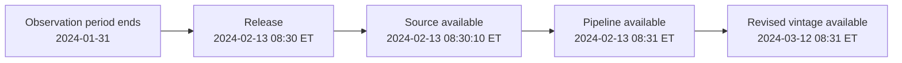

# F02 Python 金融数据与时间序列适配教材

<!-- textbook-content: default=instructional -->

> 2026-07-10 校订：多资产长表的唯一键必须是 `(symbol, date)`。不得仅按 DatetimeIndex 去重，也不得对混合资产整列直接 `pct_change()`；否则会删除同日其他资产或在资产切换处生成假收益率。

## 编写说明

这份教材是 F 系列第一份适配教材样板。它不是 pandas 手册，也不是金融数据百科，而是为了让你能亲手完成一个最小金融时间序列处理流程：

```text
读取价格数据
-> 建立日期索引
-> 检查字段和缺失
-> 计算收益率、滚动波动率、回撤
-> 记录数据口径
-> 输出给 F03 风险指标、Q01 项目和 P03 task
```

第一轮使用公开数据或自造测试数据，不做股价预测、不做实盘交易、不把图表走势解释成投资建议。

对应入口：

- [[10_学习模块/F02_Python金融数据与时间序列/F02_Python金融数据与时间序列_学习地图|F02 学习地图]]
- [[20_资料库/模块资料索引/F02_Python金融数据与时间序列_资料索引|F02 资料索引]]
- [[40_实验练习/GF00_金融工程第一阶段实验/GF00_金融工程第一阶段实验_索引|GF00 第一阶段实验索引]]
- [[40_实验练习/GF10_金融工程全阶段实验候选/GF10_金融工程全阶段实验候选_索引|GF10 全阶段实验候选索引]]

## 开始之前

| 项目 | 要求 |
|---|---|
| 目标读者 | 会写基础 Python、准备第一次可靠处理多资产价格时间序列的学习者 |
| 先修知识 | 完成 F00 的字段口径和 F01 的均值/标准差；会函数、列表、字典、CSV 和异常阅读 |
| 前置诊断 | 运行 `py -3.13 --version`，并解释为什么 `(symbol, date)` 而不是只有 `date` 才能作为多资产长表唯一键 |
| 环境与版本 | Python 3.13；pandas/NumPy 的实际版本必须随实验记录保存。公开数据 schema、复权算法和历史可见性以下载时供应商文档为准 |
| 学习产物 | 原始 fixture、清洗后长表、数据字典、质量报告、收益/rolling/drawdown 输出和处理日志 |
| 完成口径 | 可从固定输入重建输出，唯一键/排序/分组不变量通过，且记录来源、时区、频率、复权和 point-in-time 限制 |
| 学习顺序与建议节奏 | 第 1-4.5 章完成数据契约，第 5-7 章完成指标与 lineage 链路；第 8 章只读当前未实现的任务接口 |
| 建议用时 | 作者侧初步估计 10-14 小时，包含固定 fixture 练习，不含外部数据下载与 GF 实验独立复现 |

## 第一轮学习边界

本模块第一轮只学到“能可靠处理小样本金融时间序列”的程度。

要学：

- 日期索引、排序、重复日期和频率。
- UTC 存储、交易所时区展示、DST 异常和 market session date。
- 缺失值、字段口径和复权字段。
- 简单收益率、对数收益率。
- 跨资产比较前的持有期、币种、总收益、现金流、复权和期货换月检查。
- 日频到周频/月频时的价格、收益率、成交量聚合规则。
- rolling window、rolling volatility。
- drawdown 和 max drawdown。
- observation、release、availability、vintage 和下载时间的 point-in-time 限制。
- 如何把处理结果设计成 P03 的 `data_quality_task` 或 `risk_metric_task` 输入。

暂时不学：

- 股价预测。
- 高频 tick 数据。
- 生产级交易所日历和跨市场全天候会话引擎。
- 期货连续合约构造、复权算法和真实换月执行。
- 组合资金流的时间加权/资金加权收益实现。
- 完整回测框架。
- 深度学习时间序列模型。
- 商业数据源接入。
- 投资建议或策略结论。

## 本模块最值得理解的难点

F02 看起来像 pandas 入门，但真正的难点不在 `read_csv()` 或 `pct_change()`，而在“数据口径一旦错了，后面所有风险指标和模型都会跟着错”。

| 难点 | 为什么难 | 工程痛点 | 后续影响 |
|---|---|---|---|
| 日期索引 | 金融数据不是连续自然日 | 周末、节假日、停牌、缺失会混在一起 | rolling、回撤、回测切分都会受影响 |
| 时区与交易日 | UTC 日期不一定等于交易所交易日 | DST、夜盘和跨午夜会改变日期归属 | 日聚合和跨市场对齐可能错位 |
| 复权字段 | `close` 和 `adjusted_close` 含义不同 | 分红、拆股会让原始价格断裂 | 收益率、波动率和回测结果失真 |
| 缺失处理 | 缺失不一定都是坏数据 | 删除、填充、保留都会改变样本 | 指标可比性和模型训练受影响 |
| 数据对齐 | 多资产日期范围不同 | inner join 会丢数据，outer join 会制造缺失 | 组合风险和协方差矩阵受影响 |
| 收益口径 | 同名 return 可能持有期、币种和现金流处理不同 | 数字能放进一列但不能直接比较 | 跨资产结论失真 |
| point-in-time | 今天看到的数据未必是当时可见数据 | 免费数据源很少保证历史可见性 | 回测和 ML 可能发生未来信息泄漏 |
| 数据血缘 | 结果表常常脱离原始来源 | 过几周后无法复现实验 | 项目、科研和简历表达都缺证据 |
| 指标口径 | 同名指标可能有多种算法 | rolling 窗口、年化、频率选择不一致 | 不同实验结果无法比较 |

本模块的学习重点是把这些难点变成记录习惯：

```text
每一次计算前，先问数据从哪里来、字段是什么意思、时间口径是什么、处理步骤能不能复现。
```

## 一条贯通学习线

F02 不按 pandas API 清单来学，而按“一张原始价格表如何变成可用实验输入”来学：

```text
原始数据
-> 日期索引
-> 字段口径
-> 缺失/重复/对齐
-> 收益率和 rolling 指标
-> 清洗记录
-> F03 风险指标 / P03 data_quality_task
```

这条线的重点是：代码函数只是工具，真正的能力是让数据可解释、可复现、可交给后续模块。只要 F02 的数据口径不清，F03 的 VaR、F06 的回测、F07 的模型评估都会变成不可靠数字。

## 可迁移的原则

1. 时间索引是金融数据的骨架。缺失、节假日、停牌、复权和时区问题如果不处理清楚，后面的 rolling、return、回测切分都会变成不可信结果。
2. 清洗规则本身就是实验的一部分。删除缺失、前向填充、重采样、对齐多资产数据都不是中性动作，必须记录为什么这样做。
3. 数据血缘要从第一天开始保留。来源、下载时间、字段说明、处理脚本和输出文件版本，决定后续 Q 项目、P03 task 和简历表达能不能解释。
4. 收益率只有在持有期、币种、总收益/价格收益、现金流、复权和合约规则一致时才适合横向比较。

## 踩坑现场

> 你把两只资产按日期 inner join 后计算相关性，结果样本只剩下共同交易日。相关性数字很好看，但其实你已经丢掉了大量缺失日期。正确做法是先记录合并前后的行数、缺失比例和对齐方式，再决定这个样本是否适合进入 F03 风险计算。

## 第 1 章：为什么金融时间序列不能当普通表格处理

### 1.1 本章解决什么问题

普通表格只关心“行”和“列”。金融时间序列还必须关心“时间顺序”和“数据当时是否可见”。

同一列价格，如果日期顺序错了，收益率会错；如果混用了复权和未复权价格，波动率会错；如果用到了事后修订数据，回测和模型可能看起来很好，但实际上用了未来信息。

### 1.2 金融直觉

金融数据的核心不是某一天的价格，而是价格如何随时间变化。你关心的是：

- 今天和昨天相比涨跌多少。
- 最近 20 天波动大不大。
- 从历史最高点到当前最多跌了多少。
- 某段时间的数据是否缺失、修订或口径不一致。

所以 F02 的第一目标不是“画出漂亮曲线”，而是让数据变得可解释、可计算、可复现。

### 1.3 数据口径

第一轮最常见的数据表可以长这样：

| date | symbol | close | adjusted_close | volume |
|---|---|---:|---:|---:|
| 2024-01-02 | TEST | 100.00 | 98.50 | 1200000 |
| 2024-01-03 | TEST | 101.20 | 99.70 | 1350000 |
| 2024-01-04 | TEST | 99.80 | 98.35 | 1500000 |

必须记录：

| 字段 | 为什么重要 |
|---|---|
| `date` | 决定时间顺序、收益率和窗口计算 |
| `symbol` | 决定资产标识 |
| `close` | 原始收盘价，可能受分红、拆股影响 |
| `adjusted_close` | 复权价格，更适合收益率和长期比较 |
| `volume` | 交易量，第一轮只记录，不深入流动性分析 |

### 1.4 最小流程

```python
import pandas as pd

df = pd.DataFrame(
    {
        "date": ["2024-01-02", "2024-01-03", "2024-01-04"],
        "symbol": ["TEST", "TEST", "TEST"],
        "adjusted_close": [98.50, 99.70, 98.35],
    }
)

df["date"] = pd.to_datetime(df["date"])
df = df.sort_values(["symbol", "date"]).reset_index(drop=True)

# 跨章 canonical form 始终保留 symbol/date 两列。
assert not df.duplicated(subset=["symbol", "date"]).any()

# 只有在处理单一资产的时间序列操作时才建立 DatetimeIndex 视图。
single_asset = df.loc[df["symbol"] == "TEST"].set_index("date")
```

这里最重要的不是代码多复杂，而是三件事：

1. 日期列变成真正的 datetime。
2. 数据按日期排序。
3. 多资产跨章数据保持 `(symbol, date)` 列式长表；单资产 rolling、resample 或时间切片时，
   再创建以 `date` 为 DatetimeIndex 的视图。

后续章节都继续使用列式 `df`。不要让第 1 章把 `date` 移入索引、第 2 章又假定它仍是列。

### 1.5 工程场景

在 Q01 里，这一步会变成数据处理脚本的第一段。在 P03 里，它会进入 `data_quality_task`：

```text
input:
  data_source
  symbol
  date_range
  fields

output:
  final_rows
  missing_ratio
  duplicate_dates
  date_min
  date_max
```

### 1.6 工程痛点

真实项目里，最常见的问题不是不会写 pandas，而是拿到一个 CSV 后不知道它是否可信：

- 文件名叫 `prices.csv`，但不知道是原始价格还是复权价格。
- 日期列有时区、有字符串、有缺失，代码运行不报错，但计算结果已经错了。
- 同一资产多次下载，字段含义或数据范围变了，却没有版本记录。
- notebook 里中间处理步骤太多，最后输出表已经看不出来源。

所以 F02 的第一条工程原则是：

```text
任何输出指标，都必须能追溯到原始字段、清洗步骤和计算口径。
```

### 1.7 常见错误

- 日期还是字符串，却直接做时间切片。
- 没有排序就计算 `pct_change()`。
- 同一 symbol 有重复日期，但没有检查。
- 不记录使用的是 `close` 还是 `adjusted_close`。
- 图画出来就当实验完成，没有记录数据来源和字段口径。

### 1.8 小练习

用 5 行自造价格数据完成：

1. 把 `date` 转成 datetime。
2. 按日期排序。
3. 设置 DatetimeIndex。
4. 记录最早日期、最晚日期和总行数。

### 1.9 检查标准

- [ ] 能解释为什么日期索引比普通整数索引更适合金融数据。
- [ ] 能说明 `close` 和 `adjusted_close` 不能混用。
- [ ] 能写出最小的 `to_datetime -> sort_values -> set_index` 流程。

## 第 2 章：DatetimeIndex、频率和交易日

### 2.1 本章解决什么问题

金融时间序列通常不是每天都有数据。周末、节假日、停牌、数据源缺失都会让日期不连续。

如果你不知道数据频率，就很难判断：

- 缺失是正常非交易日，还是数据问题。
- rolling 20 是 20 个交易日，还是 20 个自然日。
- 月频、日频、季度频数据能不能直接合并。

### 2.2 金融直觉

“过去 20 天波动率”在股票里通常意味着过去 20 个交易日，不是自然日。宏观数据可能是月度或季度，债券收益率可能是每日发布但遇到节假日缺失。

所以频率不是小细节，而是风险指标的口径。

### 2.3 数据口径

记录频率时至少写：

```text
frequency: daily trading days / calendar daily / monthly / quarterly
calendar_note: 是否跳过周末和节假日
missing_date_policy: 保留缺口 / 前向填充 / 删除 / 标记
```

第一轮建议：对股票价格数据，不随便补周末；对缺失交易日，先记录，再决定是否处理。

### 2.4 最小代码

```python
df = df.sort_values(["symbol", "date"]).reset_index(drop=True)

duplicate_keys = df.duplicated(subset=["symbol", "date"]).sum()
dates = df["date"]
date_min = dates.min()
date_max = dates.max()

# MultiIndex 只作为需要标签索引时的派生视图，不覆盖 canonical long table。
indexed = df.set_index(["symbol", "date"]).sort_index()

print(date_min, date_max, duplicate_keys)
```

如果要把某一个资产补成连续自然日，必须先选出单一 symbol，再用 `asfreq("D")`；不能直接对多资产 MultiIndex 调用：

```python
single_asset = df.loc[df["symbol"] == "TEST"].set_index("date")
calendar_df = single_asset.asfreq("D")
```

这会制造周末空值。它不是错，但必须记录原因。

### 2.5 工程场景

GF02-01 的重点之一就是判断数据是否具备稳定的日期索引。P03 里可以记录：

```text
quality_flags:
  - duplicate_dates
  - non_monotonic_index
  - unexpected_missing_dates
```

### 2.6 工程痛点

日期问题很容易“沉默失败”：代码能跑，图也能画，但指标是错的。

例如：

- 数据是倒序排列，`pct_change()` 变成“今天相对明天”的变化。
- 两个资产的交易日不同，直接拼接后出现大量 NaN。
- 把宏观月频数据前向填充到日频，然后和股票收益率一起建模，却没有记录这个假设。
- 把自然日窗口当成交易日窗口，导致 rolling 指标解释错误。

处理方式不是记住所有 pandas 参数，而是形成固定检查：

```text
日期类型 -> 排序 -> 重复日期 -> 频率说明 -> 缺失解释 -> 处理记录
```

### 2.7 常见错误

- 把非交易日缺失误认为数据错误。
- 为了图表连续，对价格做前向填充，却不记录。
- 把月频宏观数据和日频价格数据直接拼接。
- 忽略重复日期。

### 2.8 小练习

构造一组日期不连续的数据，检查：

1. 索引是否单调递增。
2. 是否有重复日期。
3. 日期范围是多少。
4. 缺失日期是否需要处理。

### 2.9 推荐资料

- pandas time series user guide：DatetimeIndex、frequency、date offsets。

## 第 2.5 章：时区、DST 和 market session date

### 2.5.1 本章解决什么问题

带时刻的数据至少有三种不同含义：

| 字段 | 回答的问题 | 推荐表示 |
|---|---|---|
| `timestamp_utc` | 事件在全球时间线上何时发生？ | 带 UTC 时区的 timestamp |
| `timestamp_exchange` | 交易所当地钟表显示几点？ | 从 UTC 转到交易所 IANA 时区 |
| `market_session_date` | 该事件属于交易所哪个交易日或会话？ | 由交易所日历或数据源 session 标签确定 |

它们不能互相替代。`2024-01-03 00:30 UTC` 在纽约是前一天晚上；对有夜盘的期货，交易所还可能把前一晚的成交归到下一个 session。简单取 UTC 日期或本地 `.date()` 都不一定得到官方交易日。

第一轮只建立正确字段和检查习惯，不实现生产级多交易所日历。

### 2.5.2 UTC 存储，交易所时区展示

对代表真实瞬间的事件时间，推荐保存 UTC；分析开收盘、公告发生时段或面向用户展示时，再转换到交易所时区：

```python
import pandas as pd

events = pd.DataFrame(
    {
        "timestamp": [
            "2024-03-08T14:30:00Z",
            "2024-03-11T13:30:00Z",
        ]
    }
)

events["timestamp_utc"] = pd.to_datetime(
    events["timestamp"], utc=True, errors="raise"
)
events["timestamp_exchange"] = events["timestamp_utc"].dt.tz_convert(
    "America/New_York"
)
events["exchange_calendar_date"] = events["timestamp_exchange"].dt.date
```

这两个 UTC 时刻都对应纽约 09:30，但一个处于标准时间，一个处于夏令时。代码不应手工减 5 小时，因为 UTC offset 会随 DST 改变。

`exchange_calendar_date` 只是当地日历日期。只有确认数据属于规则明确的常规交易时段后，它才可以作为简化的 `market_session_date`。夜盘、半日市、跨午夜和特殊休市必须使用交易所日历或数据源提供的 session 标签。

日线数据里的 `date` 通常已经是供应商给出的 session label，不一定代表“UTC 午夜发生的一笔事件”。不要为了统一格式把所有日线日期先解释成 UTC 午夜。

### 2.5.3 `tz_localize` 和 `tz_convert` 不能混用

- `tz_localize`：给**没有时区但已知是当地钟表时间**的值附上时区；墙上显示的小时和分钟不变。
- `tz_convert`：把**已经有时区的同一瞬间**换成另一时区显示；墙上时间会改变，瞬间不变。

```python
local_clock = pd.DatetimeIndex(["2024-03-08 09:30:00"])
new_york_time = local_clock.tz_localize(
    "America/New_York",
    ambiguous="raise",
    nonexistent="raise",
)
utc_time = new_york_time.tz_convert("UTC")

print(new_york_time[0])  # 2024-03-08 09:30:00-05:00
print(utc_time[0])       # 2024-03-08 14:30:00+00:00
```

如果原字符串明确是纽约当地时间，却直接 `tz_localize("UTC")`，会把 09:30 错当成 UTC 09:30，整个时间线偏移数小时。

### 2.5.4 DST 的 ambiguous 和 nonexistent

夏令时切换会产生两类当地时间：

| 类型 | 含义 | 纽约示例 |
|---|---|---|
| `nonexistent` | 春季跳时后，某段墙上时间根本没有发生 | `2024-03-10 02:30` |
| `ambiguous` | 秋季回拨后，同一墙上时间发生两次 | `2024-11-03 01:30` |

第一轮默认使用 `ambiguous="raise"`、`nonexistent="raise"`，让问题显式失败后再核对数据源。不要为了让代码运行就随意 `shift_forward`、`infer` 或填 `NaT`。

```python
spring_gap = pd.DatetimeIndex(["2024-03-10 02:30:00"])
fall_fold = pd.DatetimeIndex(["2024-11-03 01:30:00"])

# 两行都应要求人工确认，而不是静默猜测。
spring_gap.tz_localize(
    "America/New_York", ambiguous="raise", nonexistent="raise"
)
fall_fold.tz_localize(
    "America/New_York", ambiguous="raise", nonexistent="raise"
)
```

### 2.5.5 market session date 的最小记录

至少保存：

```yaml
timestamp_source_timezone: UTC
storage_timezone: UTC
exchange_timezone: America/New_York
exchange_calendar: XNYS
session_date_source: provider_session_label
session_filter: regular_session_only
dst_policy:
  ambiguous: raise
  nonexistent: raise
```

如果没有可靠交易所日历，只能写 `session_date_source: local_date_approximation`，并把它列为限制，不能宣称已准确处理夜盘和特殊交易日。

### 2.5.6 可判定练习

1. 把 `2024-03-08T14:30:00Z` 和 `2024-03-11T13:30:00Z` 转成 `America/New_York`。
2. 对 `2024-03-10 02:30:00` 执行 `tz_localize(..., nonexistent="raise")`。
3. 对 `2024-11-03 01:30:00` 执行 `tz_localize(..., ambiguous="raise")`。
4. 判断 `2024-01-03T00:30:00Z` 能否只取 UTC 日期作为纽约股票的 `market_session_date`。

判定标准：

- [ ] 前两个 UTC 时刻都显示纽约 09:30，offset 分别为 `-05:00` 和 `-04:00`。
- [ ] 春季 02:30 被识别为 nonexistent，秋季 01:30 被识别为 ambiguous；没有静默修正。
- [ ] `2024-01-03T00:30:00Z` 转成纽约为 `2024-01-02 19:30:00-05:00`，且不在常规股票交易时段，不能直接用 UTC 日期归属 session。
- [ ] 输出记录包含 storage timezone、exchange timezone、calendar/session 来源和 DST policy。

### 2.5.7 本章依据

- [pandas Time series：Time zone handling](https://pandas.pydata.org/docs/user_guide/timeseries.html#time-zone-handling)
- [pandas `DatetimeIndex.tz_localize`](https://pandas.pydata.org/docs/reference/api/pandas.DatetimeIndex.tz_localize.html)
- [pandas `DatetimeIndex.tz_convert`](https://pandas.pydata.org/docs/reference/api/pandas.DatetimeIndex.tz_convert.html)
- [Python `zoneinfo`](https://docs.python.org/3/library/zoneinfo.html)
- [NYSE Hours and Calendars](https://www.nyse.com/trade/hours-calendars)

## 第 3 章：缺失值、重复值和字段对齐

### 3.1 本章解决什么问题

金融数据的脏数据很常见。字段缺失、重复日期、某个资产短暂停牌、数据源字段名变化，都可能让后续收益率、波动率和回测结果失真。

### 3.2 金融直觉

数据清洗不是“把空值删掉”这么简单。你要先判断空值代表什么：

- 没有交易？
- 数据源漏了？
- 该字段对这个资产不适用？
- API 权限不够？
- 合并多个资产时日期不对齐？

不同原因对应不同处理方式。

### 3.3 数据口径

记录缺失值时至少包含：

```text
missing_count
missing_ratio
affected_fields
handling_method
reason_if_known
```

第一轮推荐处理策略：

| 问题 | 第一轮处理 |
|---|---|
| 少量价格缺失 | 标记并删除相关行 |
| 重复日期 | 保留前先人工检查，不直接平均 |
| volume 缺失 | 可保留，但记录不用于第一轮指标 |
| 多资产日期不齐 | 先做 inner join 或明确缺失策略 |

### 3.4 最小代码

```python
required_fields = ["adjusted_close"]

missing_report = df[required_fields].isna().mean().to_dict()
df_clean = df.dropna(subset=required_fields)

duplicate_count = df_clean.duplicated(subset=["symbol", "date"]).sum()
duplicate_rows = df_clean.loc[
    df_clean.duplicated(subset=["symbol", "date"], keep=False)
]
if not duplicate_rows.empty:
    raise ValueError(
        "duplicate (symbol, date) rows require a documented source/version resolution rule"
    )
```

不能用无条件 `keep="last"` 代替判断，因为“文件里的最后一行”不等于“来源更可信或版本更新”。
若数据源确实提供 `source_available_time`、`revision_id` 或下载批次，先按该字段建立明确规则，
保存被舍弃行和原因，再执行去重。

### 3.5 工程场景

这章直接对应 GF02-01 的记录表。未来进入 P03 时，可以作为 `data_quality_task` 的输出：

```json
{
  "missing_ratio": {"adjusted_close": 0.0},
  "duplicate_dates": 0,
  "final_rows": 5,
  "quality_flags": []
}
```

### 3.6 工程痛点

缺失处理最大的难点是：不同处理方式都会“创造一种假设”。

| 处理方式 | 隐含假设 | 风险 |
|---|---|---|
| 删除缺失行 | 缺失行不重要 | 样本可能被系统性改变 |
| 前向填充 | 缺失期间价格不变 | 可能低估波动 |
| 线性插值 | 中间变化平滑 | 金融跳变会被抹平 |
| 保留缺失 | 下游能处理 NaN | 很多指标会变成 NaN |

所以教材和实验都要求写 `cleaning_steps`。不是为了形式，而是为了让未来的你知道当时做了什么取舍。

### 3.7 常见错误

- 不看缺失比例就直接 `dropna()`。
- 对价格缺失做随意填充。
- 多资产合并时没有说明使用 inner join 还是 outer join。
- 删除异常数据后没有记录。

### 3.8 小练习

用包含一个缺失价格和一个重复日期的小表，写出：

1. 缺失比例。
2. 重复日期数量。
3. 清洗前后行数。
4. 清洗策略说明。

### 3.9 检查标准

- [ ] 能解释为什么清洗策略必须写入实验记录。
- [ ] 能计算字段缺失比例。
- [ ] 能处理重复日期并说明保留规则。

## 第 4 章：收益率和对数收益率

### 4.1 本章解决什么问题

风险分析通常不直接用价格，而是用收益率。因为价格水平不同的资产不能直接比较，收益率才能表达“相对变化”。

### 4.2 金融直觉

从 100 到 101 是上涨 1%，从 10 到 11 是上涨 10%。两个资产都涨了 1 元，但风险和收益完全不同。

收益率回答的是：

```text
这段时间相对前一期变化了多少？
```

### 4.3 数学口径

简单收益率：

```text
r_t = P_t / P_{t-1} - 1
```

对数收益率：

```text
log_return_t = log(P_t / P_{t-1})
```

第一轮重点会算、会解释，不展开连续复利理论。

### 4.4 数据口径

计算收益率前要确认：

- 使用 `adjusted_close` 还是 `close`。
- 数据是否按时间升序。
- 是否存在 0 或负价格。
- 第一行收益率为空是正常现象。

### 4.5 最小代码

```python
import numpy as np

df_clean = df_clean.sort_values(["symbol", "date"])
prices_by_asset = df_clean.groupby("symbol", group_keys=False)["adjusted_close"]
df_clean["return"] = prices_by_asset.pct_change(fill_method=None)
df_clean["log_return"] = prices_by_asset.transform(
    lambda prices: np.log(prices / prices.shift(1))
)
```

每个 symbol 的第一行都会是空值，因为该资产没有前一期价格。资产切换边界绝不能继承上一资产的价格。

### 4.6 工程场景

F03 的波动率、VaR、组合风险都依赖收益率。P03 的 `risk_metric_task` 也不应该只接价格，它至少要知道：

```text
price_field
return_method
date_range
frequency
```

### 4.7 工程痛点

收益率计算最容易出现“口径看起来小，结果差很多”的问题：

- 用 `close` 计算，遇到拆股会出现异常大跌。
- 用 `adjusted_close` 计算，适合长期收益比较，但必须说明是复权口径。
- 多资产收益率对齐时，如果日期范围不同，协方差和组合风险会变。
- 日收益率、周收益率、月收益率不能直接混在一起比较。

第一轮不要求你掌握所有收益率理论，但必须养成习惯：每个 return 列都要能回答“由哪个价格字段、哪个频率、哪个时间范围算出来”。

### 4.8 常见错误

- 用未排序数据计算收益率。
- 混用不同复权口径。
- 把第一行 NaN 当异常填成 0，却不记录。
- 用价格差替代收益率。

### 4.9 小练习

给定 5 天 adjusted_close，计算：

1. 简单收益率。
2. 对数收益率。
3. 第一行为什么为空。
4. 使用哪一个字段作为价格来源。

### 4.10 检查标准

- [ ] 能手写简单收益率公式。
- [ ] 能用 pandas 计算 `pct_change()`。
- [ ] 能解释为什么收益率比价格更适合比较风险。

## 第 4.5 章：跨资产收益口径与周月聚合

### 4.5.1 收益率不是天然可比

“都是 2%”不代表两个 return 可以直接横向比较。比较前至少通过下面的口径门：

| 检查项 | 必须回答 | 不一致时的风险 |
|---|---|---|
| 持有期 | 1 日、1 周、1 月还是不规则区间？ | 把不同时间暴露放在一起排名 |
| 时间边界 | 哪个 session close 到哪个 session close？ | 跨时区或节假日错位 |
| 币种 | 本币收益还是统一基准币种收益？ | 把资产变化和汇率变化混在一起 |
| return 类型 | price return 还是 total return？ | 漏掉股息、票息或其他分配 |
| 现金流 | 分红、票息、申赎、存取款怎么处理？ | 把外部资金流当资产表现 |
| 复权 | raw、split-adjusted 还是 total-return adjusted？ | 公司行动制造假跳变或口径混用 |
| 期货合约 | 哪个 contract、何时 roll、如何 adjustment？ | 换月价差被误算成资产收益 |
| gross/net | 是否扣除费用、税费或交易成本？ | 毛收益和净收益直接比较 |

第一轮不实现完整跨资产业绩系统，只做两件事：发现不可比，保存口径。推荐记录：

```yaml
return_method: simple
holding_period: 1_market_session
period_start: 2024-01-02
period_end: 2024-01-03
market_calendar: XNYS
currency: USD
base_currency: USD
fx_conversion: none
return_type: price_return
price_field: close
cashflow_treatment: excluded
external_cashflow_treatment: not_applicable_single_asset
contract_id: null
roll_rule: null
adjustment_method: raw
gross_or_net: gross
```

字段值必须来自数据源文档或处理脚本，不能因为列名叫 `adjusted_close` 就自行假设已经包含所有分红、拆股和税费。

### 4.5.2 Price return、total return 和现金流

- price return 只描述选定价格字段的相对变化。
- total return 还要把持有期间属于投资者的分配纳入，例如股票现金分红或债券票息。
- 组合层面的申购、赎回、存款和取款是外部现金流，不能直接当作资产收益；时间加权和资金加权收益留到后续模块。

`adjusted_close` 的具体含义由供应商决定。有的字段调整拆股和现金分红，有的只处理部分公司行动，也可能在事后重算全部历史值。第一轮必须保存供应商、字段说明、下载时间和 adjustment 口径。

跨币种比较时，最稳妥的第一轮做法是先把期初和期末价值按有记录的同一 FX 口径换算到基准币种，再计算基准币种收益。若直接使用“本币资产收益 + 汇率收益”的公式，必须先定义货币报价方向和复合项，不能只把两个百分数相加。

### 4.5.3 日频到周频/月频的聚合规则

重采样不是“每列都取平均”。常见教学规则是：

| 字段 | 周/月聚合 | 原因 |
|---|---|---|
| `open` | 第一个有效 session 的 open | 区间起点 |
| `high` | max | 区间内最高值 |
| `low` | min | 区间内最低值 |
| `close` / `adjusted_close` | 最后一个有效 session 的值 | 区间终点快照 |
| `volume` | sum | 区间活动量；仍需确认供应商单位 |
| simple return | `prod(1 + r) - 1` | 简单收益需要复合，不能求和或平均 |
| log return | sum | 同一资产、同一连续区间的对数收益可加 |
| dividend/coupon cash flow | sum，并保留支付日期 | 现金流是区间内发生额 |

单一资产最小代码：

```python
import numpy as np
import pandas as pd


def compound_simple_return(values: pd.Series) -> float:
    clean = values.dropna()
    if clean.empty:
        return np.nan
    return float((1.0 + clean).prod() - 1.0)


asset = one_symbol.copy()
asset["session_date"] = pd.to_datetime(asset["session_date"], errors="raise")
asset = asset.set_index("session_date").sort_index()

weekly = asset.resample(
    "W-FRI", label="right", closed="right"
).agg(
    {
        "open": "first",
        "high": "max",
        "low": "min",
        "close": "last",
        "adjusted_close": "last",
        "volume": "sum",
    }
)
weekly["period_return"] = asset["return"].resample(
    "W-FRI", label="right", closed="right"
).apply(compound_simple_return)
weekly["last_session_date"] = asset.index.to_series().resample(
    "W-FRI", label="right", closed="right"
).max()

monthly_return = asset["return"].resample(
    "ME", label="right", closed="right"
).apply(compound_simple_return)
```

`W-FRI` 或 `ME` 的结果索引是 period label。遇到周五休市或月末非交易日，label 可能不是实际最后交易日，因此同时保存 `last_session_date`。若本项目固定的 pandas 版本不接受 `ME`，先检查版本文档再选择等价月末 offset，不能在不同实验里静默换规则。

多资产数据必须先按 `symbol` 分组，再对每个资产独立重采样。不能把不同资产放进同一个 resample bin 后取 first/last。

### 4.5.4 期货换月边界

期货每个到期月是不同合约。把近月合约最后价格 100 和次月合约第一价格 105 直接拼接后做 `pct_change()`，得到的 5% 可能主要是合约间价差，不是持有同一合约获得的经济收益。

第一轮只要求保存并检查：

```text
contract_id
expiry
roll_date
roll_from
roll_to
roll_rule
continuous_series_provider
back_adjustment_method
```

只要这些字段缺失，就把连续期货 return 标记为 `not_comparable`，不进入股票、债券或其他期货序列的横向收益排名。本模块不自行设计 back-adjustment，也不模拟真实换月交易。

### 4.5.5 可判定练习

1. 两天简单收益分别为 `+10%`、`-10%`。计算两日累计收益，并解释为什么不能相加。
2. A 是 1 日 USD、含供应商复权的股票 return；B 是 1 月 CNY、未含票息的债券 price return。判断能否直接说 A 优于 B，并列出不一致口径。
3. 近月最后价 100、次月第一价 105，但没有 roll rule。判断能否报告“期货上涨 5%”。
4. 周开始前一个 session 的 close 为 100；本周两个 session 的 OHLCV 分别为 `(100,103,99,102,1000)` 和 `(102,104,100,101,1500)`。聚合成一周 OHLCV，并计算 close-to-close 区间 price return。

判定标准：

- [ ] 两日累计收益为 `(1.10 * 0.90) - 1 = -1%`，不是 0%。
- [ ] A/B 至少存在持有期、币种、return 类型和现金流处理四项不一致，不能直接排名。
- [ ] 100 到 105 跨越两个 contract；没有换月和调整规则时不能解释成 5% 经济收益。
- [ ] 周 OHLCV 为 `(100,104,99,101,2500)`，区间 price return 为 `1%`。
- [ ] 输出记录包含 period label 和 actual last session date。

### 4.5.6 本章依据

- [pandas `DataFrame.resample`](https://pandas.pydata.org/docs/reference/api/pandas.DataFrame.resample.html)
- [Alpha Vantage `TIME_SERIES_DAILY_ADJUSTED` 字段说明](https://www.alphavantage.co/documentation/#dailyadj)
- [Nasdaq：Total Return 定义](https://www.nasdaq.com/glossary/t/total-return)
- [CFTC：Futures Market Basics](https://www.cftc.gov/LearnAndProtect/AdvisoriesAndArticles/FuturesMarketBasics/index.htm)
- [QuantConnect：Continuous Futures Contracts](https://www.quantconnect.com/docs/v2/writing-algorithms/universes/futures#06-Continuous-Contracts)

## 第 5 章：rolling window 和滚动波动率

### 5.1 本章解决什么问题

金融风险不是固定不变的。一个资产在平稳时期波动很小，在市场剧烈变化时波动会突然变大。

rolling window 可以让你观察风险随时间变化。

### 5.2 金融直觉

如果你只算全样本标准差，会得到一个平均风险。但这个平均值会掩盖时间变化。rolling volatility 像一扇移动窗口，每次只看最近一段时间。

### 5.3 数学/统计口径

滚动波动率通常是收益率在窗口内的标准差：

```text
rolling_volatility_t = std(r_{t-window+1}, ..., r_t)
```

第一轮不年化，或者只在明确说明后年化：

```text
annualized_vol = daily_vol * sqrt(252)
```

### 5.4 数据口径

记录：

```text
window_size
return_field
annualized_or_not
min_periods
```

窗口大小会显著影响结果。20 日窗口和 60 日窗口不是谁更正确，而是观察尺度不同。

### 5.5 最小代码

```python
window = 3
df_clean = df_clean.sort_values(["symbol", "date"]).copy()
df_clean["rolling_volatility"] = df_clean.groupby(
    "symbol", sort=False
)["return"].transform(
    lambda values: values.rolling(window=window, min_periods=window).std()
)
```

小样本教学里可以用 3 日窗口，真实日频数据里常见 20、60、252 等窗口。窗口状态不得从一个
symbol 泄漏到下一个 symbol；即使长表已经排序，整列 `rolling()` 也不满足这个不变量。

### 5.6 工程场景

GF02-02 会深入 rolling volatility 和 drawdown。GF02-01 只需要确保数据已经清洗到可以滚动计算。

P03 里可以记录：

```text
metrics:
  rolling_volatility
p03_metrics:
  runtime_ms
  rows_processed
```

### 5.7 工程痛点

rolling 指标的难点不是公式，而是解释。

同一组收益率，用 5 日窗口、20 日窗口、60 日窗口，曲线形态可能完全不同。窗口越短越敏感，窗口越长越平滑。没有绝对正确的窗口，只有和问题匹配的窗口。

工程上必须记录：

```text
window_size
min_periods
frequency
annualized_or_not
```

否则你后面看到一张波动率图，会不知道它到底表示什么。

### 5.8 常见错误

- 不说明窗口大小。
- 不说明是否年化。
- 用价格计算标准差，却写成收益率波动。
- 对缺失收益率直接 rolling，没有检查结果。

### 5.9 小练习

用两个 symbol、每个 6 天且交错排列的价格计算 3 日 rolling volatility。验收时分别和“拆成
两个单资产表后计算”的结果比较，并说明每个 symbol 的前几行为什么为空。

### 5.10 推荐资料

- pandas window operations：rolling mean、rolling std。

## 第 6 章：drawdown 和 max drawdown

### 6.1 本章解决什么问题

波动率描述收益率上下波动的大小，但很多时候你还关心“从高点跌下来多少”。这就是 drawdown。

### 6.2 金融直觉

如果一个资产先从 100 涨到 120，再跌到 90，那么从最高点 120 到 90 的跌幅就是回撤。它反映的是持有过程中可能经历的下跌压力。

### 6.3 数学口径

先计算累计净值：

```text
wealth_t = product(1 + r_t)
```

再计算历史峰值：

```text
peak_t = max(wealth_0, ..., wealth_t)
```

回撤：

```text
drawdown_t = wealth_t / peak_t - 1
```

最大回撤是 drawdown 的最小值。

### 6.4 最小代码

```python
df_clean = df_clean.sort_values(["symbol", "date"]).copy()
returns = df_clean["return"].fillna(0.0)

# wealth_0=1 必须进入峰值集合；clip(lower=1) 保留这个初始基准。
df_clean["wealth"] = (1 + returns).groupby(df_clean["symbol"]).cumprod()
df_clean["peak"] = (
    df_clean["wealth"].groupby(df_clean["symbol"]).cummax().clip(lower=1.0)
)
df_clean["drawdown"] = df_clean["wealth"] / df_clean["peak"] - 1
max_drawdown_by_symbol = df_clean.groupby("symbol")["drawdown"].min()
```

若某个 symbol 的第一条有效收益为 `-0.10`，对应 wealth 是 `0.90`，peak 仍为初始值 `1.00`，
所以 drawdown 必须是 `-0.10`，不能因为样本内尚无更早一行而报告为 0。

### 6.5 工程场景

F03 会把 max drawdown 作为基础风险指标。Q01 的风险指标表至少可以包含：

```text
mean_return
volatility
max_drawdown
date_range
```

### 6.6 工程痛点

drawdown 很容易被误读成“未来最多会亏多少”。这是错误的。它只是历史样本内从峰值下跌的最大幅度。

工程记录里必须写清：

```text
sample_date_range
return_method
price_field
max_drawdown
limitations
```

如果样本只覆盖一段平稳时期，max drawdown 可能很小；如果样本包含危机时期，max drawdown 可能很大。指标本身不脱离样本范围独立存在。

### 6.7 常见错误

- 用价格直接算 drawdown 时没有说明口径。
- 忘记收益率第一行为空。
- 把 max drawdown 解释成未来最大亏损。
- 不说明样本时间范围。

### 6.8 小练习

用两个 symbol 各 5 个收益率计算 wealth、peak、drawdown 和 max drawdown，其中一个 symbol
的第一条有效收益固定为 `-0.10`。验收要求该行 drawdown 等于 `-0.10`，并且分组结果等于
逐资产单独计算结果。

### 6.9 检查标准

- [ ] 能解释 drawdown 和 volatility 的区别。
- [ ] 能用 pandas 算 cumulative wealth 和 cummax。
- [ ] 能说明 max drawdown 只描述历史样本。

## 第 7 章：数据版本、point-in-time 和 lineage

### 7.1 本章解决什么问题

金融数据可能被修订、复权、更新、清洗或替换。你今天下载到的历史数据，不一定等于历史上当时能看到的数据。

这就是 point-in-time 问题。只保存一个 `date` 无法回答“该值描述哪个时期、何时发布、何时真正可用、属于哪个修订版本”。

### 7.2 金融直觉

如果你用今天修订后的财务数据去模拟三年前的决策，就可能用了三年前并不存在的信息。模型或回测会显得更好，但实际不可复现。

第一轮不要求你获得完美 point-in-time 数据，但必须知道并记录限制。

### 7.3 Observation、release、availability、vintage 和 download

| 时间字段 | 含义 | 示例 |
|---|---|---|
| `observation_time` / `observation_period_end` | 这个值描述何时发生的现象 | 1 月 CPI 描述 1 月；日线 close 描述某个 session |
| `release_time` | 发布者宣布或首次发布该值的时间 | 统计机构在 2 月某日 08:30 发布 |
| `source_available_time` | API、文件或页面实际可取得该值的时间 | 发布后若干秒或若干分钟可下载 |
| `pipeline_available_time` | 你的系统完成抓取、校验并允许特征使用的时间 | ETL 在 08:31 完成 |
| `vintage_date` / realtime period | 该记录属于哪个初值或修订版本 | 初值、第一次修订、最终值 |
| `download_time` | 本次实验何时抓取文件 | 2026 年重新下载 |

`observation_time <= prediction_time` 远远不够。一个值即使描述上个月，也不能在正式发布和管道可用之前进入特征。

推荐的第一轮可用性门：

```text
source_available_time <= prediction_time
and pipeline_available_time <= prediction_time
and selected vintage 当时已经存在
```

`release_time` 和 `source_available_time` 可能相同，也可能不同；必须由数据源或抓取日志决定。只有日期、没有时刻的来源，不要自行补成“00:00 已可用”。

### 7.4 时间线：描述期不等于可用期

下面是**教学用虚构时间线**，不是某个真实指标的发布日期：



在 2 月 13 日 08:30:30 做预测时，指标虽然已经 release，甚至源站可能已经可读，但你的管道还没完成，因此不能使用。3 月修订值更不能回填到 2 月模型输入。

### 7.5 Vintage 和修订

宏观数据、财务数据、指数成分和复权价格都可能修订。`vintage_date` 用来标识某个历史快照或实时期，但精确定义依赖数据源：

- ALFRED/FRED 使用 realtime period 和 vintage dates 表示历史时点可见版本。
- 财务报表可能有原始申报、修订申报和后续重述。
- 调整后价格可能在分红、拆股或供应商算法更新后重算整段历史。

如果数据源只返回“当前最新历史值”，即使你保存了今天的 `download_time`，也不能证明三年前能看到相同数值。合格写法是明确：

```text
latest-revised data downloaded in 2026;
historical point-in-time availability is not guaranteed;
not suitable for claims about tradable historical performance
```

### 7.6 最小记录块

真实数据记录：

```yaml
data_source: FRED or another documented provider
source_url: exact endpoint or file URL
source_timezone: America/New_York
observation_field: observation_date
release_time_field: documented_or_unavailable
source_available_time_field: captured_by_fetch_log
pipeline_available_time_field: ingested_at
vintage_field: realtime_start_or_provider_version
download_time: 2026-07-11T02:00:00Z
data_version: raw_file_sha256
adjusted_or_raw: provider_defined
point_in_time_policy: use only rows available by prediction_time
limitations:
  - historical source availability may be incomplete
license_or_access_note: recorded
```

自造测试数据记录：

```yaml
data_source: self-made test data
source_url: none
observation_period: synthetic
release_time: not_applicable
source_available_time: not_applicable
pipeline_available_time: test_fixture_load_time
vintage_date: not_applicable
point_in_time_note: synthetic data for workflow practice only
not_investment_advice: true
```

不要给自造数据虚构 release 或 vintage。`not_applicable` 比伪造一个看似真实的时间更可信。

### 7.7 P03 工程场景

P03 的金融 task 不能只保存结果，还要保存可用性口径：

```text
input_json:
  data_source
  source_url
  observation_range
  release_time_policy
  source_available_time_policy
  pipeline_available_time_policy
  vintage_policy
  prediction_time
  fields
result_json:
  rows_rejected_as_not_yet_available
  metrics
  limitations
  disclaimer
```

不同数据类型的最小映射：

| 数据 | observation | release/availability | vintage 风险 |
|---|---|---|---|
| 日线价格 | market session | 收盘后由供应商生成并可取 | 复权历史可能重算 |
| 财务报表 | 报告期末 | 正式申报/公告及系统入库时间 | 修订申报、重述 |
| 宏观指标 | 统计观察期 | 机构发布日期和 API 可用时间 | 初值、修订值、最终值 |
| 指数成分 | 生效区间 | 公告和数据许可可用时间 | 当前成分误当历史成分 |

### 7.8 常见错误

- 只保存 observation date，不保存发布和可用时间。
- 把 release time 当成自己的 pipeline available time。
- 用 2026 年下载的最新修订历史值回填 2024 年模型输入。
- 只保存文件名，不保存 URL、哈希和下载时间。
- 不区分原始价格和复权价格的 vintage。
- 用自造数据却写得像真实市场结论。
- 把历史样本指标写成未来预测。

### 7.9 可判定练习

下面是一个**虚构宏观指标**的时间记录：

| 字段 | 时间 |
|---|---|
| observation period end | 2024-01-31 |
| initial release | 2024-02-13 08:30:00 ET |
| initial source available | 2024-02-13 08:30:10 ET |
| initial pipeline available | 2024-02-13 08:31:00 ET |
| revised release | 2024-03-12 08:30:00 ET |
| revised source available | 2024-03-12 08:30:10 ET |
| revised pipeline available | 2024-03-12 08:31:00 ET |

判断以下预测时点可使用哪个版本：

1. `2024-02-13 08:30:05 ET`。
2. `2024-02-13 08:30:30 ET`。
3. `2024-02-13 08:31:00 ET`。
4. `2024-03-01 12:00:00 ET`。
5. `2024-03-12 08:31:00 ET`。

判定标准：

- [ ] 08:30:05 时源站尚不可用，不能使用。
- [ ] 08:30:30 时源站已有初值，但 pipeline 尚不可用，当前系统仍不能使用。
- [ ] 08:31:00 起可以使用初值。
- [ ] 3 月 1 日只能使用初值，不能使用未来修订值。
- [ ] 3 月 12 日 08:31 起才可以使用修订版本。
- [ ] 能解释为什么只保存 observation date 或 2026 download time 都不能完成上述判断。

再给 GF02-01 写数据说明，必须包含来源、时间范围、字段、缺失处理、四类时间字段或其 `not_applicable` 原因、vintage 限制和非投资建议声明。

### 7.10 检查标准

- [ ] 能区分 observation、release、source/pipeline availability、vintage 和 download time。
- [ ] 能用 `availability_time <= prediction_time` 检查未来信息。
- [ ] 能说明 latest-revised 数据不能自动代表历史当时可见数据。
- [ ] 能写出带来源 URL、文件哈希、时间和限制的数据版本记录块。
- [ ] 能说明自造测试数据不能产生真实金融结论。

### 7.11 本章依据

- [FRED API：Series Observations 与 realtime 参数](https://fred.stlouisfed.org/docs/api/fred/series_observations.html)
- [FRED API：Series Vintage Dates](https://fred.stlouisfed.org/docs/api/fred/series_vintagedates.html)
- [ALFRED：Archival Federal Reserve Economic Data](https://alfred.stlouisfed.org/)

## 第 8 章：把 F02 输出接到 Q01 和 P03

<!-- textbook-content: type=design-note -->

### 8.1 本章解决什么问题

F02 不是为了做孤立 notebook。它要把金融数据处理成后续模块能用的输入：

```text
F02 清洗后的价格和收益率
-> F03 风险指标
-> Q01 数据分析实验
-> P03 risk_metric_task / data_quality_task
```

### 8.2 最小输出表

F02 第一轮输出可以是：

| symbol | market_session_date | adjusted_close | return | holding_period | currency | rolling_volatility | drawdown |
|---|---|---:|---:|---|---|---:|---:|
| TEST | 2024-01-03 | 99.70 | 0.012183 | 1 session | USD |  | 0.000000 |
| TEST | 2024-01-04 | 98.35 | -0.013541 | 1 session | USD |  | -0.013541 |

同时必须有数据说明、return basis、时区/session 规则、point-in-time policy 和限制说明。分钟或事件级输出还要保存 `timestamp_utc`；日线表不能用一个无说明的 `date` 同时承担 observation time、release time 和 session label。

### 8.3 P03 task 草图

`data_quality_task`：

```json
{
  "task_type": "data_quality_task",
  "input_json": {
    "data_source": "self-made test data",
    "source_url": null,
    "asset_list": ["TEST"],
    "date_range": ["2024-01-02", "2024-01-10"],
    "fields": ["adjusted_close"],
    "timestamp_storage_timezone": "not_applicable_daily_session",
    "exchange_timezone": "America/New_York",
    "session_date_source": "synthetic_fixture",
    "frequency": "daily_session",
    "point_in_time_policy": "synthetic_not_applicable"
  }
}
```

`risk_metric_task`：

```json
{
  "task_type": "risk_metric_task",
  "input_json": {
    "asset_list": ["TEST"],
    "date_range": ["2024-01-02", "2024-01-10"],
    "price_field": "adjusted_close",
    "return_basis": {
      "method": "simple",
      "holding_period": "1_session",
      "currency": "USD",
      "return_type": "provider_adjusted_return",
      "cashflow_treatment": "documented_by_provider",
      "roll_rule": null
    },
    "metrics": ["return", "rolling_volatility", "max_drawdown"]
  }
}
```

### 8.4 项目连接

Q01 激活前，F02 只产生实验记录，不创建项目成果。只有当你亲手完成 GF02-01、GF02-02、GF03-03 中至少两个实验，并能解释字段口径和指标，才适合创建 Q01 工作台。

### 8.5 常见错误

- 做完一张图就创建项目。
- 没有实验记录就写简历表达。
- 把 P03 task 草图写成已经实现的平台功能。
- 不记录错误和限制。
- 只写 `date`，不说明它是 UTC date、local calendar date 还是 market session date。
- 把持有期、币种或 cashflow treatment 不同的 return 放进同一排名。
- 只有 observation date，没有 release/availability/vintage policy。

### 8.6 本章检查标准

- [ ] 能说明 F02 输出如何进入 F03。
- [ ] 能写出 `data_quality_task` 的输入输出。
- [ ] 能写出 `risk_metric_task` 的最小输入。
- [ ] task 字段能保留时区/session、return basis 和 point-in-time policy。
- [ ] 能说明当前只是候选项目，不是已完成成果。

## 项目贯通案例：GF02 到 Q01/P03 的最小闭环

### 贯通流程

```text
自造测试数据
-> GF02-01 清洗日期、字段、缺失
-> 输出 cleaned_price_series
-> GF02-02 计算 rolling volatility 和 drawdown
-> F03 计算风险指标
-> Q01 候选项目
-> P03 data_quality_task / risk_metric_task
```

### 最小验收

- 有测试数据表。
- 有清洗步骤。
- 有缺失比例和重复日期检查。
- 有 UTC/交易所时区和 market session date 说明。
- 有清洗后输出。
- 有持有期、币种、总收益/价格收益、现金流、复权和期货换月检查。
- 有日到周/月聚合规则和 actual last session date。
- 有 observation/release/availability/vintage 记录或明确的 `not_applicable`。
- 有数据口径说明和可判定练习答案。
- 有非投资建议声明。
- 有 P03 task 字段草图。

## 学习顺序

第一轮建议：

1. 第 1-2 章：数据表、日期索引和频率。
2. 第 2.5 章：UTC/交易所时区、DST 和 market session date；先完成可判定练习。
3. 第 3 章并完成 [[40_实验练习/GF00_金融工程第一阶段实验/GF02-01 金融时间序列清洗|GF02-01 金融时间序列清洗]]。
4. 第 4、4.5 章：收益率、跨资产口径和周/月聚合；先通过复合收益与换月判断题。
5. 第 5-6 章并完成 [[40_实验练习/GF00_金融工程第一阶段实验/GF02-02 rolling volatility 与最大回撤|GF02-02 rolling volatility 与最大回撤]]。
6. 第 7 章：完成 point-in-time 时间门练习。
7. 第 8 章：把时区、return basis 和 availability policy 写入 P03 task 草图。

## 学习检查

- [ ] 能独立整理一个带日期的价格表。
- [ ] 能检查重复日期和缺失比例。
- [ ] 能说明数据频率和字段口径。
- [ ] 能区分 UTC instant、交易所当地时间和 market session date，并显式处理 DST 异常。
- [ ] 能计算收益率、rolling volatility 和 max drawdown。
- [ ] 能在跨资产比较前检查持有期、币种、总收益/现金流、复权和期货换月。
- [ ] 能把日简单收益复合成周/月收益，并说明 OHLCV 聚合规则。
- [ ] 能区分 observation、release、availability、vintage 和 download time。
- [ ] 能写出数据版本和 point-in-time 限制说明。
- [ ] 能把结果映射到 `data_quality_task` 或 `risk_metric_task`。
- [ ] 能明确说明结果不构成投资建议。

## 外部资料索引

第一轮只用：

- [pandas Time series user guide](https://pandas.pydata.org/docs/user_guide/timeseries.html)：DatetimeIndex、frequency、resample、asfreq 和时区。
- [pandas Windowing operations](https://pandas.pydata.org/docs/user_guide/window.html)：rolling mean、rolling std。
- [NYSE Hours and Calendars](https://www.nyse.com/trade/hours-calendars)：确认交易时段与特殊交易日，不自行硬编码。
- [Alpha Vantage Documentation](https://www.alphavantage.co/documentation/)：核对 adjusted、dividend、split 字段和 API 限制。
- [FRED API Documentation](https://fred.stlouisfed.org/docs/api/fred/) 与 [ALFRED](https://alfred.stlouisfed.org/)：理解 observation、realtime/vintage 和修订。
- [CFTC Futures Market Basics](https://www.cftc.gov/LearnAndProtect/AdvisoriesAndArticles/FuturesMarketBasics/index.htm)：只建立合约和到期边界。

暂缓：

- statsmodels 预测模型。
- 深度学习时间序列教程。
- 完整回测框架文档。
- 高频数据处理资料。

## 暂时不要深入

- 不预测未来价格。
- 不优化交易策略。
- 不接商业数据源。
- 不构建生产级交易所 calendar/session engine。
- 不自行生成可用于交易结论的连续期货或 total-return 指数。
- 不用真实数据写投资结论。
- 不创建 Q01 项目工作台。
- 不把 F02 实验包装成简历成果。
