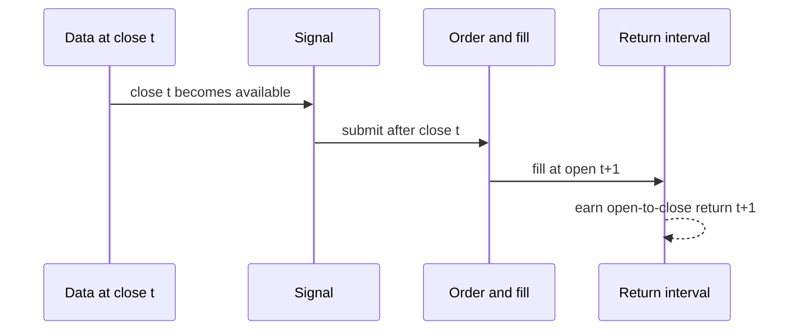

# F06 量化研究与回测工程适配教材

<!-- textbook-content: default=instructional -->

## 编写说明

F06 是金融工程第二主线里最接近岗位能力和工程项目的模块。它不教你“找赚钱策略”，也不把回测曲线包装成投资能力，而是训练一套可复现、可检查、可解释的研究流程：

```text
金融时间序列
-> signal
-> position
-> strategy_return
-> transaction_cost
-> risk_metrics
-> leakage_check
-> backtest_report
-> P03 backtest_task
```

如果 F02/F03 解决的是“会处理数据、会算风险指标”，F06 解决的是“能不能把一个研究想法变成有边界、有记录、有失败分析的工程实验”。

对应入口：

- [[10_学习模块/F06_量化研究与回测工程/F06_量化研究与回测工程_学习地图|F06 学习地图]]
- [[20_资料库/模块资料索引/F06_量化研究与回测工程_资料索引|F06 资料索引]]
- [[40_实验练习/GF10_金融工程全阶段实验候选/GF10_金融工程全阶段实验候选_索引|GF10 金融工程全阶段实验候选索引]]
- [[10_学习模块/F02_Python金融数据与时间序列/F02_Python金融数据与时间序列_适配教材|F02 适配教材]]
- [[10_学习模块/F03_投资组合与风险管理/F03_投资组合与风险管理_适配教材|F03 适配教材]]

## 开始之前

| 项目 | 要求 |
|---|---|
| 目标读者 | 已能清洗收益率并计算基础风险指标，希望把研究想法变成可复查回测实验的学习者 |
| 先修知识 | 完成 F02 的时间/数据契约和 F03 的收益、回撤、波动与 Sharpe 边界；会 pandas 分组、`shift` 和测试断言 |
| 前置诊断 | 执行 `py -3.13 -c "import pandas as pd; print(pd.__version__)"`，再说明信号生成、成交和收益归属分别发生在哪个时间点 |
| 环境与版本 | Python 3.13；pandas 实际版本、输入数据哈希、代码版本和执行时钟必须随实验保存。供应商历史数据不自动满足 point-in-time 要求 |
| 学习产物 | 固定 fixture、逐期 signal/position/return/cost 账本、偏差检查、风险表和带限制的回测报告 |
| 完成口径 | 逐期现金流与成交时钟自洽，成本/turnover 可重算，未来信息检查通过；作者侧 reference 不替代学习者复现 |
| 建议用时 | 作者侧初步估计 8-12 小时；第 1-4 章后可暂停，第 7 章只作 `backtest_task` 设计阅读 |

## 第一轮学习边界

要学：

- signal、position、return 的区别。
- 为什么信号必须避免使用未来信息。
- 最小 moving average signal。
- signal 如何转成 position。
- strategy return 如何由 position 和 asset return 得到。
- transaction cost、turnover、slippage、spread 的最小含义。
- max drawdown、volatility、Sharpe 雏形等报告指标。
- look-ahead bias、survivorship bias、data snooping。
- 回测参数、数据版本、失败原因如何记录。
- 如何把回测抽象成 P03 `backtest_task`。

暂时不学：

- 实盘交易。
- 高频交易和撮合系统。
- 复杂多因子平台。
- 生产级组合管理系统。
- 策略收益宣传。
- 商业数据源和交易接口。

## 本模块最值得理解的难点

F06 最容易偏的地方，是把“回测”误解成“做出一条好看的收益曲线”。真正的难点在于：一条曲线是否可信，取决于数据、时间顺序、成本、假设和记录。

| 难点 | 为什么难 | 工程痛点 | 后续影响 |
|---|---|---|---|
| signal 不等于 position | 信号只是判断，仓位才影响收益 | 信号当天生成还是次日执行，结果差很多 | look-ahead bias |
| 未来信息很隐蔽 | rolling、shift、label 对齐都可能出错 | 代码能跑，但用了未来价格 | 回测失真 |
| 成本会吞掉收益 | 交易越频繁，成本越重要 | 不记录成本模型，结果不可比较 | Q04 不能成立 |
| turnover 反映交易频率 | 换手高不一定错误，但必须解释 | 没有 turnover 就看不出成本敏感性 | 报告缺关键证据 |
| 回测指标依赖样本 | 样本区间不同，结果可能完全不同 | 只贴总收益没有说服力 | 简历和面试容易被追问 |
| 数据偏差很常见 | 幸存者偏差、数据修订、重复调参 | 实验看起来漂亮但不可复现 | M11 科研训练失真 |

学习 F06 的核心习惯是：

```text
任何回测结果都必须和数据范围、信号规则、执行假设、成本模型、风险指标、失败分析一起出现。
```

## 一条贯通学习线

F06 不按“策略技巧”来学，而按“一个研究想法如何变成可复查实验”来学：

```text
研究假设
-> 数据样本
-> signal
-> position
-> strategy_return
-> transaction_cost
-> leakage_check
-> backtest_report
-> P03 backtest_task
```

这条线的重点是：收益曲线只是结果之一，不能替代过程记录。合格的 F06 学习要能解释信号何时生成、仓位何时生效、成本如何扣除、哪里可能泄漏、失败原因如何记录，以及为什么不构成投资建议。

## 可迁移的原则

1. signal 不是 position。信号只是判断，仓位才决定收益；从信号到仓位必须明确延迟、执行时间和是否允许空仓。
2. 回测先防泄漏，再谈收益。rolling、shift、label、标准化和参数选择都可能偷偷使用未来信息。
3. 报告必须包含失败分析。成本吞噬收益、样本外失效、参数敏感、换手过高，都比单条收益曲线更能体现工程能力。

## 踩坑现场

> 你用当天收盘价计算 moving average，又用当天收盘价执行交易。曲线可能很好看，但这等于在收盘前知道了收盘价。正确做法是用 `shift(1)` 明确下一期执行，并在实验记录里写清信号生成和仓位生效的时间关系。

## 第 1 章：量化研究流程不是收益曲线

### 1.1 本章解决什么问题

量化研究的最小闭环不是“画一条策略净值曲线”，而是：

```text
提出规则
-> 生成信号
-> 转成仓位
-> 计算收益
-> 加入成本
-> 检查风险和偏差
-> 写记录
```

收益曲线只是输出之一，不是研究本身。

### 1.2 金融直觉

一个策略想法可能很简单，例如：

```text
如果价格高于过去 3 日均线，就持有；否则空仓。
```

但这个想法真正进入回测时，要回答很多工程问题：

- 均线用到当天收盘价了吗？
- 信号什么时候生成？
- 仓位什么时候生效？
- 换仓是否有交易成本？
- 数据缺失怎么办？
- 用了多少样本？
- 结果失败时怎么记录？

### 1.3 工程场景

F06 的结果未来可以进入 Q04，也可以进入 P03：

```text
backtest_task:
  input_json:
    data_source
    date_range
    signal_rule
    execution_assumption
    cost_model
  result_json:
    strategy_returns
    equity_curve
    turnover
    max_drawdown
    leakage_check
    limitations
```

### 1.4 常见错误

- 只看收益，不看回撤。
- 只保留图，不保留参数。
- 信号当天生成、当天用当天收益，造成未来信息泄漏。
- 不写交易成本。
- 把学习回测写成投资建议。

## 第 2 章：数据、信号、仓位和收益

### 2.1 本章解决什么问题

F06 最基础的四个对象是：

| 对象 | 含义 |
|---|---|
| data | 价格、收益率、日期、字段口径 |
| signal | 根据历史数据生成的规则判断 |
| position | 实际持有多少仓位 |
| strategy_return | 仓位作用在资产收益上得到的策略收益 |

这四个对象必须分开，否则很容易泄漏未来信息。

### 2.2 金融直觉

信号是“我想怎么做”，仓位是“我实际持有什么”。今天收盘后才知道今天的收盘价，所以基于
今天收盘价生成的信号，通常不能用来赚今天开盘到收盘的收益，也不能假设自己能按刚刚看到的
同一收盘价无摩擦成交。

这就是为什么经常需要：

```text
signal_at_close_t -> order -> fill_at_open_t+1 -> open_to_close_return_t+1
```

`shift(1)` 只负责数组对齐，不能单独证明成交时钟正确。还必须同时声明决策时点、成交时点和
收益区间。本章第一轮采用**日内平仓**简化时钟：收盘决策、次日开盘建仓、同日收盘强制
平仓，隔夜仓位为 0。它只赚取或损失 open-to-close 区间，不包含 close-to-next-open 跳空。

### 2.3 最小代码

```python
import pandas as pd

df = pd.DataFrame(
    {
        "date": [
            "2024-01-02", "2024-01-03", "2024-01-04",
            "2024-01-05", "2024-01-08", "2024-01-09",
        ],
        "adjusted_open": [100, 100.5, 100, 100.5, 102, 102],
        "adjusted_close": [100, 101, 99, 102, 103, 101],
    }
)

df["date"] = pd.to_datetime(df["date"])
df = df.sort_values("date").set_index("date")
df["open_to_close_return"] = (
    df["adjusted_close"] / df["adjusted_open"] - 1
)

df["ma_3"] = df["adjusted_close"].rolling(window=3).mean()
df["signal_at_close"] = (df["adjusted_close"] > df["ma_3"]).astype(int)
df["position_at_open"] = df["signal_at_close"].shift(1).fillna(0)
df["strategy_return"] = (
    df["position_at_open"] * df["open_to_close_return"]
)
df["position_after_close"] = 0.0
```

注意这里的 `shift(1)`：日期 `t` 开盘时的仓位只来自日期 `t-1` 收盘后已经确定的信号。
真实数据还必须保证 open/close 使用同一复权口径。若数据只有收盘价，可以保留
close-to-close 版本作为数组对齐练习，但必须标为忽略成交微观时序的教学近似。

`position_at_open` 只表示本交易 session 内持有的名义仓位，不是跨日持仓。若要改成隔夜持有
模型，必须重新定义收益为完整持有区间，并同时修改 turnover；不能继续沿用本章代码。

### 2.4 工程痛点

很多回测错误都发生在这一行：

```python
df["strategy_return"] = df["signal_at_close"] * df["open_to_close_return"]
```

如果 `signal_at_close` 用到了当天收盘价，而收益区间从当天开盘就开始，就等于用当天结束后
才知道的信息回到当天开盘下注。代码不会报错，但时间因果关系已经错了。

### 2.5 记录字段

```text
price_field
return_method
signal_rule
decision_time
fill_time
return_interval
position_shift
```

### 2.6 检查标准

- [ ] 能区分 signal 和 position。
- [ ] 能解释为什么常用 `shift(1)`。
- [ ] 能说明 strategy_return 的计算口径。

## 第 3 章：moving average signal 的最小回测

### 3.1 本章解决什么问题

第一轮只用均线规则学习回测流程。它不是推荐策略，只是最小可解释样例。

### 3.2 最小流程

```text
读取价格
-> 计算 open_to_close_return
-> 计算 rolling mean
-> 收盘生成 signal_at_close
-> signal_at_close.shift(1) 得到次日 position_at_open
-> 计算 strategy_return
-> 计算 equity_curve
```

### 3.3 最小代码

```python
window = 3

df["open_to_close_return"] = df["adjusted_close"] / df["adjusted_open"] - 1
df["ma"] = df["adjusted_close"].rolling(window=window).mean()
df["signal_at_close"] = (df["adjusted_close"] > df["ma"]).astype(int)
df["position_at_open"] = df["signal_at_close"].shift(1).fillna(0)
df["strategy_return"] = df["position_at_open"] * df["open_to_close_return"]
df["equity_curve"] = (1 + df["strategy_return"].fillna(0)).cumprod()
```

### 3.4 工程场景

这个流程对应 GF06-01。未来进入 P03 时，`signal_rule` 可以记录成：

```yaml
signal_rule:
  type: moving_average
  window: 3
  condition: adjusted_close > ma
execution_assumption:
  decision_time: close
  fill_time: next_open
  return_interval: same_day_open_to_close
  exit_time: same_day_close
  overnight_position: 0
  position_shift: 1
```

### 3.5 常见错误

- 不记录 window。
- 不说明仓位何时生效。
- 第一个 rolling 窗口不足时没有处理说明。
- 把均线策略结果写成有效投资策略。

### 3.6 检查标准

- [ ] 能跑通最小均线回测。
- [ ] 能说明 signal_rule。
- [ ] 能保存 equity_curve 和 strategy_return。

## 第 4 章：交易成本、换手率和市场摩擦

### 4.1 本章解决什么问题

无成本回测通常过于理想。现实中交易会有成本，回测至少要能观察成本对结果的影响。

第一轮只学与本章**日内平仓**时钟一致的成本模型：

```text
round_trip_turnover_t = entry_turnover_t + exit_turnover_t
entry_turnover_t = abs(position_at_open_t)
exit_turnover_t = abs(position_at_open_t)
cost_t = round_trip_turnover_t * cost_rate_per_side
net_strategy_return = gross_strategy_return - cost
```

### 4.2 金融直觉

如果策略频繁买入卖出，即使每次信号都看起来不错，交易成本也可能吞掉收益。

换手率 turnover 用来观察交易频率。因为每天收盘平仓，即使连续两天信号都为 1，第二天也
需要重新开仓和离场。第一轮定义为双边名义换手：

```text
turnover_t = 2 * abs(position_at_open_t)
```

`abs(position_t - position_{t-1})` 只适用于跨期持仓、按仓位变化交易的另一种模型；它和本章
只计算 open-to-close 收益、收盘归零的时钟不兼容。

### 4.3 最小代码

```python
cost_rate_per_side = 0.001

df["entry_turnover"] = df["position_at_open"].abs()
df["exit_turnover"] = df["position_at_open"].abs()
df["turnover"] = df["entry_turnover"] + df["exit_turnover"]
df["transaction_cost"] = df["turnover"] * cost_rate_per_side
df["net_strategy_return"] = df["strategy_return"] - df["transaction_cost"]
df["net_equity_curve"] = (1 + df["net_strategy_return"].fillna(0)).cumprod()

assert (df.loc[df["position_at_open"] == 0, "turnover"] == 0).all()
assert (df.loc[df["position_at_open"] == 1, "turnover"] == 2).all()
```

若 `cost_rate_per_side=0.001`，满仓日的 round-trip cost 是 `0.002`。这个固定断言同时验证
“连续信号仍需每日进出”，避免以后又误改成跨日 `position.diff()`。

### 4.4 spread、slippage 和 cost 的关系

第一轮不模拟真实订单簿，只理解三个词：

| 概念 | 第一轮理解 |
|---|---|
| spread | 买价和卖价之间的差 |
| slippage | 预期成交价和实际成交价之间的差 |
| transaction cost | 手续费、价差、滑点等成本的简化合计 |

在学习项目里，可以先用一个固定的单边费率 `cost_rate_per_side` 表示综合成本，并在限制里写清楚：

```text
成本模型是教学简化，不代表真实交易成本。
```

### 4.5 工程痛点

成本模型的难点不是公式，而是不要假装它真实。不同市场、资产、频率、成交量的成本差异很大。第一轮只做敏感性观察：

```text
cost_rate_per_side = 0
cost_rate_per_side = 0.001
cost_rate_per_side = 0.003
```

观察净值曲线和指标如何变化。

### 4.6 记录字段

```text
cost_model
cost_rate_per_side
cost_basis: per_side_notional
exit_policy: same_day_close_to_flat
turnover
gross_return
net_return
slippage_note
spread_note
```

### 4.7 检查标准

- [ ] 能加入固定交易成本。
- [ ] 能区分开仓与平仓，并按 `turnover = 2 * abs(position_at_open)` 计算当日双边换手。
- [ ] 能说明成本模型是教学简化。

## 第 5 章：回测风险指标和报告

### 5.1 本章解决什么问题

回测报告不能只写最终收益。第一轮至少记录：

- cumulative_return。
- volatility。
- max_drawdown。
- turnover。
- Sharpe 雏形。
- sample_date_range。
- limitations。

### 5.2 最小代码

```python
returns = df["net_strategy_return"].dropna()

cumulative_return = (1 + returns).prod() - 1
volatility = returns.std()

wealth = (1 + returns).cumprod()
peak = wealth.cummax().clip(lower=1.0)  # 包含初始净值 wealth_0=1
drawdown = wealth / peak - 1
max_drawdown = drawdown.min()

sharpe_simple = returns.mean() / returns.std() if returns.std() != 0 else None
avg_turnover = df["turnover"].mean()
```

回归夹具必须包含首期净收益 `-0.10`，并断言首期 drawdown 为 `-0.10`。`sharpe_simple` 只是
未扣无风险利率、未年化的样本均值/样本标准差；报告必须显式保存频率和这一简化。

### 5.3 工程痛点

报告指标必须带上下文：

- 日频还是月频。
- 是否年化。
- 成本是否扣除。
- 使用什么样本区间。
- 数据是自造、公开还是商业来源。
- 是否做了泄漏检查。

没有上下文的指标容易变成装饰。

### 5.4 报告模板

```yaml
experiment_id: GF06-01
data_source: self-made test data
date_range: 2024-01-02 to 2024-01-15
signal_rule: moving_average
window: 3
decision_time: close
fill_time: next_open
return_interval: same_day_open_to_close
position_shift: 1
cost_model: fixed_cost_rate_per_side
cost_rate_per_side: 0.001
cost_basis: per_side_notional
metrics:
  cumulative_return: calculated
  volatility: calculated
  max_drawdown: calculated
  avg_turnover: calculated
limitations:
  - synthetic data
  - simplified execution
  - no investment advice
```

### 5.5 检查标准

- [ ] 报告里有参数，不只有图。
- [ ] 报告里有风险指标，不只有收益。
- [ ] 报告里有失败和限制说明。

## 第 6 章：数据泄漏和回测偏差

### 6.1 本章解决什么问题

回测最危险的问题是结果看起来很好，但用了不该用的信息。

第一轮重点检查：

| 偏差 | 含义 |
|---|---|
| look-ahead bias | 使用未来信息生成当前决策 |
| survivorship bias | 只看幸存下来的资产 |
| data snooping | 反复调参直到结果好看 |
| selection bias | 只挑表现好的样本展示 |
| rebalancing assumption | 调仓频率和执行价格假设不清 |

### 6.2 look-ahead bias 最小例子与时间线

危险写法：

```python
df["strategy_return"] = df["signal_at_close"] * df["open_to_close_return"]
```

更合理的教学写法：

```python
df["position_at_open"] = df["signal_at_close"].shift(1).fillna(0)
df["strategy_return"] = df["position_at_open"] * df["open_to_close_return"]
```



图中的四个时间戳必须进入实验记录。只看到 `shift(1)` 而没有这些字段，仍然不能证明
回测没有前视偏差。

### 6.3 TimeSeriesSplit 的位置

如果后续进入 F07 金融机器学习，时间切分必须保持时间顺序。`TimeSeriesSplit` 的价值不是让你立刻做复杂 ML，而是提醒你：

```text
训练集必须早于验证集，不能随机打乱金融时间序列。
```

### 6.4 survivorship bias 可执行反例

下面是一个故意极小的固定样例。`FAILED` 在最后一期出现完整退市损失；如果今天回头只取
仍存在的 `SURVIVOR`，就会把失败资产从历史资产池抹掉。

<!-- textbook-code: role=runnable env=python-3.13 network=off -->
```python
from math import prod


def cumulative_return(period_returns: list[float]) -> float:
    return prod(1 + value for value in period_returns) - 1


survivor = [0.01, 0.01, 0.01]
failed = [0.01, -0.50, -1.00]
point_in_time_universe = [
    0.5 * (left + right) for left, right in zip(survivor, failed)
]

survivor_only_result = cumulative_return(survivor)
point_in_time_result = cumulative_return(point_in_time_universe)

assert round(survivor_only_result, 4) == 0.0303
assert round(point_in_time_result, 4) == -0.6149
```

这里的等权、三期和 `-100%` 都只是测试夹具。真实实验必须保存每个时点的成分表、加入/
移除时间、退市收益处理和缺失原因；不能把这两个数值外推成一般市场结论。

### 6.5 data snooping 的 best-of-many 反例

200 个候选都由零均值噪声生成。若用同一训练样本反复挑最大 Sharpe，总能挑出一个看起来
漂亮的候选；冻结候选后，它在独立测试集上的结果不必继续漂亮。

<!-- textbook-code: role=runnable env=python-3.13 network=off -->
```python
from math import sqrt
from random import Random
from statistics import mean, pstdev


def annualized_sharpe(values: list[float]) -> float:
    return sqrt(252) * mean(values) / pstdev(values)


rng = Random(20260719)
train_sharpes = []
test_sharpes = []
for _ in range(200):
    train = [rng.gauss(0.0, 0.01) for _ in range(252)]
    test = [rng.gauss(0.0, 0.01) for _ in range(252)]
    train_sharpes.append(annualized_sharpe(train))
    test_sharpes.append(annualized_sharpe(test))

selected = max(range(200), key=train_sharpes.__getitem__)
assert selected == 148
assert round(train_sharpes[selected], 3) == 2.218
assert round(test_sharpes[selected], 3) == -0.145
```

测试 Sharpe 可能为正也可能为负；关键不是这次恰好为 `-0.145`，而是测试集没有参与
候选生成和选择。必须保存全部候选、选择指标、尝试次数和 `test_access_count`，不能只保存
赢家。

### 6.6 工程痛点

数据泄漏经常不是故意的，而是由对齐错误造成：

- rolling 指标没 shift。
- label 用了未来收益，但特征也包含了未来字段。
- 数据清洗时用全样本信息做标准化。
- 多次调参后只保存最好结果。

### 6.7 泄漏和偏差检查清单

- [ ] 信号是否只使用当时可见数据？
- [ ] position 是否晚于 signal 生效？
- [ ] 是否记录了调参次数？
- [ ] 是否记录了样本选择原因？
- [ ] 是否区分训练期、验证期、测试期？
- [ ] 是否记录了数据来源和下载时间？
- [ ] 是否使用 point-in-time 资产池并保留退市收益处理？
- [ ] 是否保存全部候选和调参次数，而不是只保存赢家？
- [ ] final test 是否在方案冻结前保持不可见，且记录访问次数？
- [ ] 是否写明不构成投资建议？

### 6.8 本章主张与来源映射

| 正文主张 | 权威依据 | 本教材采用的简化 | 不能推出什么 |
|---|---|---|---|
| 只保留存续对象会产生存活偏差 | [Brown et al., Survivorship Bias in Performance Studies](https://doi.org/10.1093/rfs/5.4.553) | 三期等权固定样例 | 不能估计真实市场偏差大小 |
| 反复搜索会使常规显著性失真 | [White, A Reality Check for Data Snooping](https://doi.org/10.1111/1468-0262.00152) | 200 个零均值候选 | 单次样例不能替代正式多重检验 |
| 回测过拟合需要独立评测和完整搜索记录 | [Bailey et al., Probability of Backtest Overfitting](https://doi.org/10.21314/JCF.2016.322) | 冻结一个 final test | 不声称已实现论文全部方法 |
| 因子/策略发现要考虑多重尝试 | [Harvey, Liu and Zhu, ... and the Cross-Section of Expected Returns](https://doi.org/10.1093/rfs/hhv059) | 记录 candidate count 和选择规则 | 不把固定阈值套到所有研究 |
| `TimeSeriesSplit` 保持索引顺序 | [scikit-learn TimeSeriesSplit](https://scikit-learn.org/stable/modules/generated/sklearn.model_selection.TimeSeriesSplit.html) | 只作扩展窗口切分入口 | 不自动处理重叠标签、资产池变化或全样本预处理 |

## 第 7 章：把 F06 接入 P03

<!-- textbook-content: type=design-note -->

### 7.1 本章解决什么问题

F06 的工程出口是 `backtest_task`。它不是 notebook 截图，而是可提交、可排队、可记录、可失败复盘的任务。

### 7.2 backtest_task 草图

```json
{
  "task_type": "backtest_task",
  "input_json": {
    "data_source": "self-made test data",
    "asset_list": ["TEST"],
    "date_range": ["2024-01-02", "2024-01-15"],
    "price_fields": ["adjusted_open", "adjusted_close"],
    "signal_rule": {
      "type": "moving_average",
      "window": 3
    },
    "execution_assumption": {
      "decision_time": "close",
      "fill_time": "next_open",
      "return_interval": "same_day_open_to_close",
      "exit_time": "same_day_close",
      "overnight_position": 0,
      "position_shift": 1,
      "rebalancing_frequency": "daily sample"
    },
    "cost_model": {
      "type": "fixed_per_side_notional_rate",
      "cost_rate_per_side": 0.001,
      "turnover_definition": "entry_abs_position_plus_exit_abs_position"
    }
  },
  "result_json": {
    "metrics": {
      "cumulative_return": "calculated",
      "volatility": "calculated",
      "max_drawdown": "calculated",
      "turnover": "calculated"
    },
    "leakage_check": {
      "position_shift": {"status": "pass|fail|not_run", "evidence": "artifact-or-test-id"},
      "universe_policy": {"status": "recorded|missing", "value": "point_in_time|other"},
      "candidate_count": 1,
      "test_access_count": 0,
      "evidence_artifact": "artifact://<actual-run>/leakage-report.json",
      "future_data_note": "no future data claim in synthetic sample"
    },
    "runtime_ms": "recorded by worker",
    "error_type": null,
    "limitations": ["synthetic data", "simplified execution", "no investment advice"]
  }
}
```

### 7.3 和 M05/M06/M08 的连接

```text
F06 backtest_task
-> M05 调度：回测任务可能耗时，需要排队和优先级
-> M06 异步任务：任务状态 pending/running/succeeded/failed
-> M08 监控：runtime_ms、error_rate、queue_wait、data_rows
-> P03 平台：统一提交、查询和记录结果
```

### 7.4 常见错误

- 把 backtest_task 写成已经实现的平台功能。
- 不保存 input_json，导致结果不可复现。
- 没有 error_type。
- 不记录 runtime_ms。

### 7.5 检查标准

- [ ] 能写出 `backtest_task` 的输入字段。
- [ ] 能说明它为什么适合异步执行。
- [ ] 能说明 runtime_ms、error_type 和 limitations 的作用。

## 项目贯通案例：F02/F03 到 F06/P03

```text
F02 清洗价格序列
-> F02 计算收益率
-> F03 计算基础风险指标
-> F06 生成 signal 和 position
-> F06 加入成本和泄漏检查
-> Q04 候选项目
-> P03 backtest_task
```

当前阶段不创建 Q04 工作台。只有当 GF06-01、GF06-02、GF06-03 被亲手运行，且记录表、代码、失败分析和限制说明完整后，才适合创建 Q04。

## 推荐学习顺序

1. 复习 F02 的日期索引、收益率和 rolling。
2. 复习 F03 的 max drawdown、volatility 和 Sharpe 边界。
3. 学第 1-3 章，完成 GF06-01 均线策略最小回测。
4. 学第 4-5 章，完成 GF06-02 加入交易成本后的回测对比。
5. 学第 6 章，完成 GF06-03 数据泄漏检查。
6. 学第 7 章，把结果映射成 P03 `backtest_task` 草图。

## 学习检查

- [ ] 能解释 signal、position、strategy_return 的区别。
- [ ] 能说明为什么 position 需要 shift。
- [ ] 能加入 transaction cost。
- [ ] 能计算 turnover 和 max drawdown。
- [ ] 能列出至少四种回测偏差。
- [ ] 能写一份带参数、指标、限制的回测记录。
- [ ] 能把回测抽象为 P03 `backtest_task`。
- [ ] 能明确回测结果不构成投资建议。

## 外部资料索引

第一轮只用：

- pandas time series user guide：日期索引、对齐和时间序列处理。
- pandas window operations：rolling signal 和 moving average。
- scikit-learn TimeSeriesSplit：理解时间顺序切分，主要为 F07 做准备。
- 第 6.8 节的论文：用于存活偏差、数据窥探和回测过拟合的正文主张映射。
- Jane Street Quantitative Researcher 岗位资料：只校准概率、编程、研究表达能力，不当作策略学习材料。
- Columbia MSFE Curriculum：只校准路线边界，不逐课硬学。

暂缓：

- 高频交易资料。
- 商业回测平台宣传。
- 策略收益文章。
- 未说明数据来源的 notebook。
- 复杂机器学习策略。

## 暂时不要深入

- 不做实盘交易。
- 不做收益承诺。
- 不把回测图写成投资能力。
- 不创建 Q04 工作台。
- 不做高频交易和低延迟系统。
- 不购买商业数据源。
