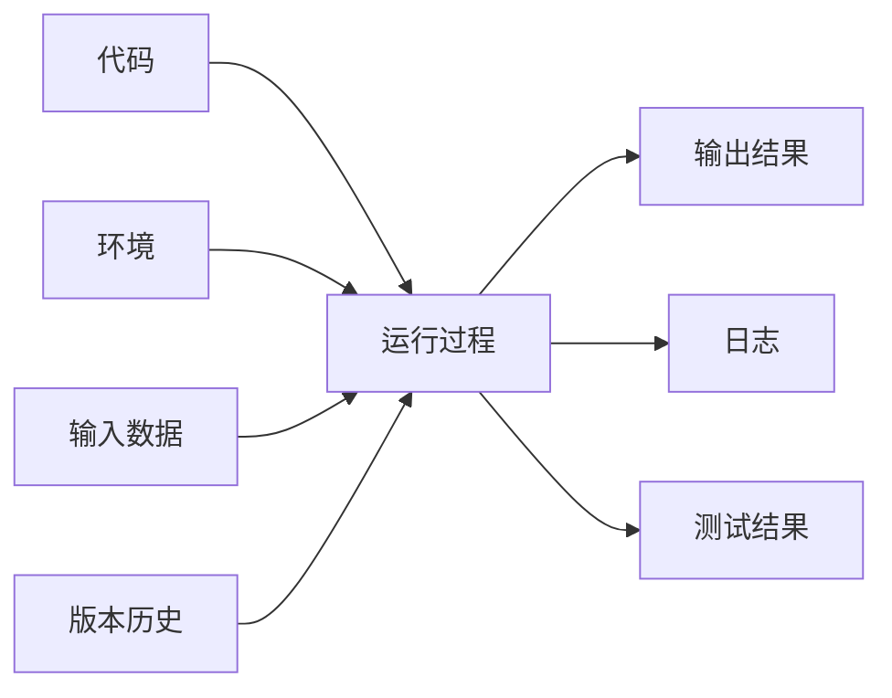
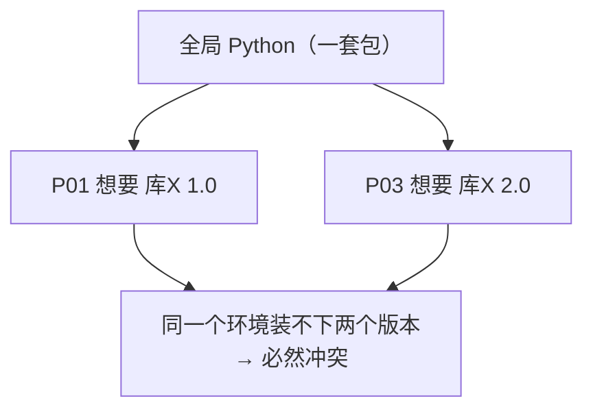
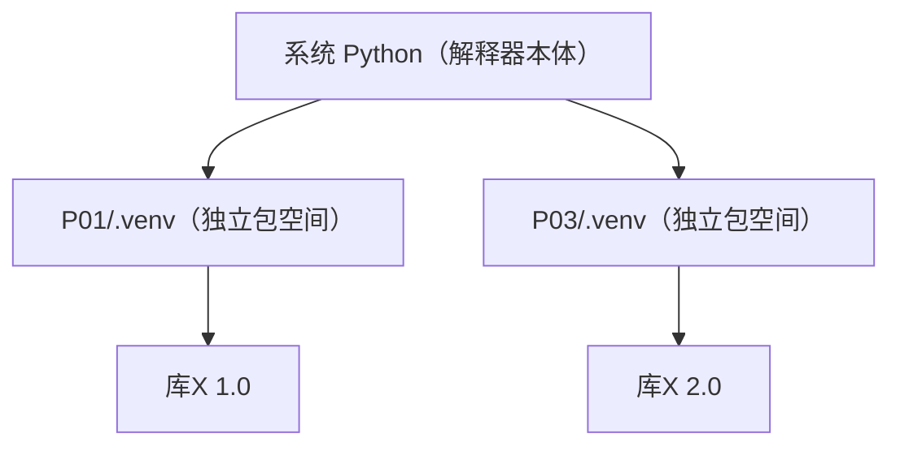
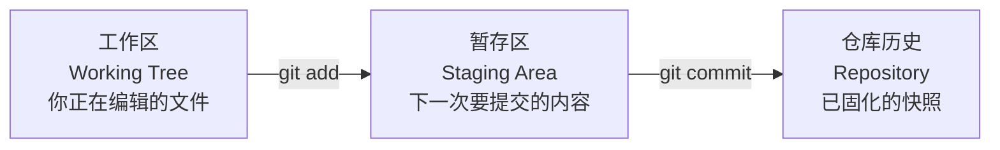
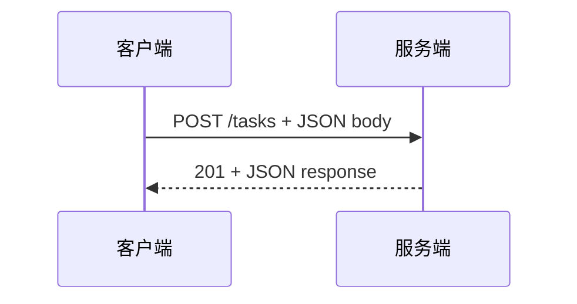

# M00 工具链与计算机基础适配教材

<!-- textbook-content: default=instructional -->

## 编写说明

这份文档是给当前学习路线定制的教材，不是资料台账，也不是单纯路线说明。

它基于以下权威资料进行改写、重组和项目化适配：

- MIT Missing Semester：Shell、Git、工具链思维
- Python 官方文档：`venv`、`logging`
- pytest 官方文档：测试发现、最小测试、工程实践
- HTTPX 官方文档：Python HTTP 客户端
- MDN HTTP 文档：HTTP 请求、响应、方法和状态码

注意：这里不会大段复制外部原文。外部资料负责权威性，本教材负责把概念讲清楚，并把它们转成你能在 P01 Mini Scheduler 里用的能力。

## 模块入口

| 项目 | 要求 |
|---|---|
| 目标读者 | 第一次系统搭建 Python 工程环境、需要建立命令行与调试模型的自学者 |
| 先修知识 | 能在 Windows 打开 PowerShell、创建文件并识别绝对路径；不要求已有 Git、pytest 或 HTTP 经验 |
| 环境检查 | 运行 `py -3.13 --version`、`git --version` 和 `Get-Location`；缺少任一命令时先完成第 0 章准备 |
| 学习产物 | 一个含 `.venv`、日志、3 个排序函数、pytest 测试和 Git 提交的 `task_sorter` 小工程及实验记录 |
| 完成口径 | 以第 9 章命令、测试输出和提交记录判定；另保存第 6A 章进程/权限证据与第 7 章四层故障矩阵；教材中的示范输出不代表学习者已经复现 |
| 学习顺序 | 第 0-6 章建立本地工具链，第 6A 章补服务所需 OS 生命周期，第 7 章建立 HTTP 与四层请求路径，第 8 章组装项目，第 9 章验收；第 10-11 章按需查阅 |
| 建议用时 | 作者侧初步估计 12-16 小时，包含 `task_sorter` 最小练习，不含长时间环境排错 |

### 版本与平台边界

主学习基线是 Windows PowerShell 与 Python 3.13。命令示例不承诺可原样用于 Bash、zsh 或旧版
Python；pytest、HTTPX 和 Git 的实际版本应在实验记录中保存。Python 3.8/3.9 只用于阅读历史
材料，不是本路线的运行或验收目标。

### 内容类型

| 范围 | 类型 | 阅读承诺 |
|---|---|---|
| 第 0-9 章（含第 6A 章） | `instructional` | 建立环境、路径、版本控制、调试、测试、进程生命周期、HTTP 和贯通项目能力 |
| 第 10 章 | `reference` | 提供权威资料入口，供学习中按需查阅 |
| 第 11 章 | `appendix` | 限定第一轮范围，不承担新概念教学或完成证明 |

---

## 第 0 章：开始前的环境要求

在写第一行代码前，先确认 Python 版本。这一步看似多余，却能避免后面一类很难自己看懂的报错。

### 0.1 本路线的 Python 版本

Windows 主学习环境固定使用 **Python 3.13**。当前机器同时存在 Python 3.8.6 和 3.13，因此不能依赖含义不明确的全局 `python` 命令。

先检查你的版本：

```powershell
py -3.13 --version
py -3.13 -m venv .venv
.\.venv\Scripts\Activate.ps1
python --version
python -m pip --version
```

验收时必须看到虚拟环境内的 Python 3.13。`python -m pip` 可以保证 pip 与当前解释器一致。

### 0.2 旧版本迁移说明

Python 3.8 和 3.9 已结束官方安全支持，不再作为本路线的运行或验收目标。旧资料中关于 `Optional[...]`、`List[...]` 或 `from __future__ import annotations` 的内容只用于阅读历史代码，不用于继续维持旧环境。

如果终端中的 `python --version` 仍显示 3.8.6，说明虚拟环境没有激活。不要继续安装依赖，先重新执行：

```powershell
.\.venv\Scripts\Activate.ps1
python --version
```

### 0.3 一个简单的自检

新建 `env_check.py`，内容如下：

```python
import sys

def first_ids(tasks: list[dict]) -> list[str]:
    return [t["id"] for t in tasks]

print("python", sys.version.split()[0])
print(first_ids([{"id": "t1"}, {"id": "t2"}]))
```

运行：

```powershell
python env_check.py
```

如果能打印出版本号和 `['t1', 't2']`，说明你的环境已经可以开始本路线的实验了。

---

## 第 1 章：为什么工程学习必须先学工具链

### 1.1 工具链不是“杂项”

很多人学习编程时，会把命令行、Git、虚拟环境、日志、测试看成“附属技能”。这种理解会导致一个问题：你以为自己在学 Python、RAG、Docker，但真正卡住你的往往不是算法，而是环境和工程流程。

例如你后面做 P01 Mini Scheduler 时，最早会遇到的问题不是“调度算法多难”，而是：

- 项目目录在哪里？相对路径为什么老是找不到文件？（→ 第 2 章）
- 同一台电脑明明装了包，运行时却 `ModuleNotFoundError`？（→ 第 3 章）
- 今天改坏了代码，昨天能跑的版本怎么找回来？（→ 第 4 章）
- 排序结果错了，怎么知道错在输入、逻辑还是输出？（→ 第 5 章）
- 改了一处，怎么确认没把别处弄坏？（→ 第 6 章）
- 这个脚本以后怎么变成别人能通过网络调用的服务？（→ 第 7 章）

这些问题都属于工具链和工程基础——它们卡住你的次数，远比算法多。

### 1.2 工程项目的本质：代码 + 环境 + 数据 + 历史

一个工程项目不是一个孤立的 `.py` 文件。至少包含四类东西：



如果你只看代码，不看环境、输入和历史，就很难定位问题。

所以 M00 的核心目标是：

> 让你能控制一个小工程从创建、运行、调试、测试到保存进度的全过程。

### 1.3 这一章怎么读，以及它想给你什么

本模块主线对应上面那条“项目生命周期”，建议按顺序读：

```text
第 2 章 Shell/路径   → 让程序"在对的位置"运行
第 3 章 venv/pip     → 让程序"在对的环境"运行
第 4 章 Git          → 让每一步进度"可保存、可回退"
第 5 章 日志与调试    → 让出错时"看得见原因"
第 6 章 pytest       → 让正确性"能被反复自动验证"
第 6A 章 OS 生命周期 → 让服务能被观察、终止、清理并处理权限失败
第 7 章 HTTP/JSON    → 让脚本"能升级成服务"
第 8 章 贯通案例      → 把以上全部串成一个能跑的小工程
```

每一章都不是只教命令，而是按同一个节奏带你走：

- **从一个你真会遇到的报错或痛点切入**，让你知道这章在解决什么真实问题；
- **讲清背后的机制**，让你理解了之后，命令能自己推出来、陌生报错也能自己判断，而不是死记；
- **挑一两处点出"工程判断"**——一个真实的设计权衡，和一条能迁移到别处的原则。这些原则会一路贯穿到后面的 M07 Docker、M08 监控、P03 平台。你在 M00 学的不只是几个工具，而是一套"遇到问题怎么想"的工程思维底座。

读每章时，比起"记住了哪些命令"，更要问自己：**这章的机制我能用自己的话讲出来吗？遇到一个没见过的相关报错，我能顺着机制推到原因吗？** 能，才算真的学会。

---

## 第 2 章：Shell、目录和路径

### 2.1 从一个真实报错开始

你写好了第一个脚本，信心满满地运行，结果蹦出来一行：

```text
FileNotFoundError: [Errno 2] No such file or directory: 'data/tasks.json'
```

你打开文件管理器一看——`data/tasks.json` 明明就在那儿啊，文件确实存在，为什么程序说找不到？

这是几乎每个初学者都会卡住、而且**靠改代码改不出来**的一类问题。它的根源不在代码，而在你对"shell 当前在哪、相对路径从哪算起"没有清晰的模型。这一章就是来建立这个模型的。等你读完，回头再看这个报错，你会一眼看出问题、而且知道该先查什么。

### 2.2 Shell 是什么：你和操作系统的对话入口

Shell 可以理解成你和操作系统之间的**对话窗口**：你输入一条命令，shell 把它交给操作系统执行，再把结果返回给你。在 Windows 上你主要用 PowerShell。

最常用的几个动作：

| 你想做什么 | PowerShell 命令 |
|---|---|
| 我现在在哪个目录？ | `Get-Location`（别名 `pwd`） |
| 这个目录里有什么？ | `Get-ChildItem`（别名 `ls`） |
| 进入某个目录 | `Set-Location 路径`（别名 `cd`） |
| 创建目录 | `New-Item -ItemType Directory 名称` |
| 运行一个 Python 文件 | `python main.py` |

这些命令本身不难。真正需要理解的是它们都默默依赖的一个东西——**当前工作目录**。

### 2.3 核心机制：当前工作目录决定一切相对路径

shell 在任意时刻，都"站在"某一个目录里，这就是**当前工作目录（current working directory，简称 cwd）**。它不是一个摆设，而是一个**会影响程序行为的隐藏状态**：

> 当你的代码写一个**相对路径**时，操作系统不是从"代码文件所在的位置"去找，而是从"**运行这个程序时 shell 所站的那个目录**"去找。

这句话是 2.1 那个报错的全部答案。我们把它拆开看。假设项目结构是：

```text
task_sorter/
  main.py
  data/
    tasks.json
```

`main.py` 里写：

```python
open("data/tasks.json", encoding="utf-8")
```

`"data/tasks.json"` 是相对路径。它实际找的是：

```text
（当前工作目录） / data / tasks.json
```

**而不是**很多人以为的：

```text
（main.py 所在目录） / data / tasks.json
```

这两者在一种情况下恰好相同——你正好站在 `task_sorter/` 里运行 `python main.py`，cwd 就是 `task_sorter/`，于是 `data/tasks.json` 找得到。但只要你换个地方运行，比如你站在 `task_sorter` 的**上一级**目录，敲：

```powershell
python task_sorter/main.py
```

这时 cwd 是上一级，程序去上一级找 `data/tasks.json`——那里没有，于是 `FileNotFoundError`。**代码一个字没变，仅仅因为你"站的位置"变了，就报错了。** 这就是 2.1 的真相。

随时确认自己站在哪，是排查这类问题的第一动作：

```powershell
Get-Location     # 我现在站在哪
Get-ChildItem    # 这个位置下有什么
```

### 2.4 绝对路径 vs 相对路径：一个真实的工程权衡

知道了 cwd 怎么影响相对路径，自然引出两种写路径的方式：

- **绝对路径**：从磁盘根部开始的完整地址，不依赖你站在哪。
  ```text
  <repo-root>\50_项目产出\P01_Mini_Scheduler\data\tasks.json
  ```
- **相对路径**：从当前工作目录出发的地址。
  ```text
  .\data\tasks.json
  ```

PowerShell 里几个路径符号：

| 写法 | 含义 |
|---|---|
| `.` | 当前目录 |
| `..` | 上一级目录 |
| `.\data` | 当前目录下的 `data` |
| `..\notes` | 上一级目录下的 `notes` |

你可能会想：相对路径这么容易出错，那我代码里**全用绝对路径**不就一劳永逸了？

这正是一个值得想清楚的权衡，因为两边都有代价：

- **绝对路径**：不受 cwd 影响，看起来"稳"。但它把"这个项目必须放在某个特定绝对位置"焊死进了代码。你换台电脑、改个目录名、或者把项目发给别人，路径立刻全失效。**它用"可移植性"换"确定性"。**
- **相对路径**：可移植——只要项目内部结构不变，整个项目搬到哪都能跑。代价就是你必须管好"从哪里运行"，也就是 cwd。

> **工程界的实际选择，以及背后的原则**：成熟项目几乎都用相对路径，并且约定**统一从项目根目录运行**，从而既拿到可移植性、又把 cwd 这个变量固定下来。更进一步的做法（你以后会见到）是：让程序在启动时**以"代码文件自身的位置"为基准**去推算其他文件路径（Python 里是 `__file__`），这样连"从哪运行"都不依赖了。
>
> 抽象成一句可迁移的原则：**不要把"环境的偶然状态"（此刻恰好在哪个目录、此刻装在哪台机器）写死进代码；让代码依赖稳定的、自己能掌控的基准。** 你后面在 M07 Docker 里会再遇到它的升级版——容器干脆把"环境"整个打包固定下来，从根上消灭"在我机器上能跑"的问题。

### 2.5 工程习惯与踩坑现场

把上面的机制变成三条肌肉记忆：

1. 运行项目前，先 `Get-Location` 确认 cwd。
2. 尽量**从项目根目录**运行命令，让 cwd 稳定。
3. 遇到"找不到文件"，**先怀疑 cwd，别急着改代码**。

第 3 条尤其重要，我们把它演成一个踩坑现场——这是你迟早会经历的一幕：

> 你的 `main.py` 昨天好好的，今天报 `FileNotFoundError: 'data/tasks.json'`。
>
> **只会改代码的人**：开始怀疑文件路径写错了，把 `"data/tasks.json"` 改成各种写法挨个试，越改越乱。
>
> **理解了 cwd 的人**会这样推理：
> 1. 报错是相对路径找不到，而相对路径是从 cwd 算的（2.3 学过）。
> 2. 文件确实存在（我亲眼看到了），那大概率不是文件没了，而是**我现在站的位置不对**。
> 3. 先验证猜想：敲 `Get-Location`——啊，我现在站在项目的上一级，难怪。
> 4. 对策不用搜：要么 `cd` 进项目根目录再运行，要么以后让代码用 `__file__` 定位、不依赖 cwd。
>
> 注意全过程**没有改一行代码**就定位了问题。这就是有正确机制模型的价值：报错可以是新的，但你能从机制推回根因。

### 2.6 在 P01 里的使用场景

P01 Mini Scheduler 的结构会是：

```text
P01_Mini_Scheduler/
  scheduler.py
  data/
    tasks.json
  tests/
    test_scheduler.py
```

你需要能稳定地做这几件事，而它们全都建立在"先站对目录"之上：

```powershell
cd .\50_项目产出\P01_Mini_Scheduler
python scheduler.py        # cwd 是项目根，data/tasks.json 才找得到
python -m pytest           # 同理，pytest 也按 cwd 发现测试（第 6 章会细讲）
```

记住：先 `cd` 到项目根、再运行，是贯穿整个学习路线的默认姿势。

### 2.7 推荐资料

本章正文已覆盖你现在需要的 shell 与路径模型。下面资料供将来深入，**不是必读**：

- MIT Missing Semester · Shell 讲义：https://missing.csail.mit.edu/2020/course-shell/
- 同上 · 视频：https://www.youtube.com/watch?v=Z56Jmr9Z34Q

现在**不要**深入：shell 脚本编程、管道与重定向的复杂用法、Linux 权限细节。它们以后有用，但和"能稳定运行一个小项目"这个当前目标无关。

---

## 第 3 章：Python 解释器、pip 和虚拟环境

### 3.1 从一个把人逼疯的报错开始

你昨天明明用 `pip install pytest` 装好了 pytest，今天运行测试却报：

```text
ModuleNotFoundError: No module named 'pytest'
```

它就在那儿——你甚至能再跑一次 `pip install`，它会告诉你 `Requirement already satisfied`（已经装了）。装了，又找不到。这是 Python 新手最经典、最容易归咎于"玄学"的一类问题。

它一点都不玄。根因只有一句话：**你的电脑上不止一个 Python，"装包的那个"和"运行代码的那个"不是同一个。** 这一章就是要让你彻底看清"哪个 Python、包装到哪去了"，从此这类问题对你透明。

### 3.2 核心机制一：`python` 是一个具体程序，而且你有好几个

当你敲：

```powershell
python main.py
```

操作系统做的事是：在一串预设的查找路径里，找到**第一个**叫 `python` 的可执行程序，用它来跑 `main.py`。关键在于——**你机器上往往有多个 Python**，来源五花八门：

- 你从官网装的 Python
- Anaconda / Miniconda 自带的 Python
- 某个项目目录下的 `.venv`
- 其他软件（如某些 IDE、工具）附带的 Python

到底哪个会被选中，取决于系统的查找顺序，这件事**你不该靠猜**。永远可以这样问个明白：

```powershell
python -c "import sys; print(sys.executable)"
```

它会打印出当前 `python` 这个名字**真正指向的那个程序的完整路径**，比如 `C:\Python311\python.exe` 还是某个 `.venv\Scripts\python.exe`。养成习惯：环境一出怪事，先问这一句。

### 3.3 核心机制二：pip 把包装到"调用它的那个 Python"身上

理解了"有多个 Python"，3.1 的报错就只差最后一块拼图了。关键认识是：

> **pip 不是一个全局的、独立的装包工具。每一个 Python 都自带一个 pip，pip 把包装进的，就是"调用它的那个 Python"的环境。**

于是 `ModuleNotFoundError` 的真相浮出水面：你昨天的 `pip install pytest` 用的是 A 这个 Python 的 pip，包装进了 A；今天 `python main.py` 系统选中的却是 B——B 里当然没有 pytest。**两个 Python，各管各的包。**

这直接给出一个能根治问题的写法。不要直接敲 `pip`：

```powershell
pip install pytest          # 含糊：到底是哪个 pip？装给哪个 Python？
```

而要让"装包的 Python"和"跑代码的 Python"**显式绑定成同一个**：

```powershell
python -m pip install pytest
```

`python -m pip` 的含义是：**"用当前这个 `python` 去运行它自带的 pip 模块"**。这样一来，"运行 main.py 的 python"和"装 pytest 的 pip"必然是同一个，包装哪去、代码从哪找，完全对齐，3.1 那类问题从源头消失。

> 这是一个很小但很能体现工程素养的习惯：`python -m pip`、`python -m pytest`、`python -m venv` 都遵循同一个道理——**让工具显式地挂在你指定的那个 Python 上，而不是赌系统帮你选对。** 后面所有命令我们都用这种写法。

### 3.4 核心机制三：虚拟环境隔离的到底是什么

现在升级问题。就算你管好了"用哪个 Python"，还有一个更大的麻烦在等着：**不同项目需要的包版本会打架。**

设想没有虚拟环境、所有项目共用一个全局 Python：



库 X 在全局只能存在一个版本，P01 和 P03 的需求直接对撞。装了 2.0，P01 可能跑挂；退回 1.0，P03 又用不了。项目一多，这种"依赖地狱"无解。

虚拟环境（venv）就是解法：**给每个项目一个独立的、互不干扰的包空间。**



这里要精确理解 venv **到底隔离了什么、没隔离什么**，否则你会对它有不切实际的期待：

> venv 隔离的是 **Python 解释器的选择 + 这套环境里装的包**。它本质上就是一个目录（`.venv/`），里面放了一个指向某个 Python 的链接和一份独立的 `site-packages`（包安装目录）。"激活" venv，无非是临时把你的 `python` / `pip` 指向这个目录里的那一套。
>
> 它**不**隔离：操作系统、系统级的库、端口、数据库、Redis、Docker、GPU 驱动……这些都还是全机器共享的。

### 3.5 创建并使用 venv：每条命令对应一个机制

理解了机制，命令就是机制的自然落地。在**项目根目录**下：

```powershell
py -3.13 -m venv .venv    # 显式使用 Python 3.13 创建 .venv
```

激活它（让本终端的 python/pip 临时指向 .venv 里那一套）：

```powershell
.\.venv\Scripts\Activate.ps1
```

激活后，**立刻验证你确实站进了这个环境**——这一步呼应 3.2 的习惯：

```powershell
python -c "import sys; print(sys.executable)"
# 应当打印出 ...\你的项目\.venv\Scripts\python.exe，而不是全局的那个
```

然后装包、查包，全程用 `python -m`（呼应 3.3）：

```powershell
python -m pip install pytest
python -m pip list
```

你看，3.5 没有一条新命令需要"硬背"——它们全是前面三个机制的直接结果：`venv` 造隔离空间、激活=切换指向、`python -m pip`=绑定到这个空间装包。

### 3.5b 一个真实权衡，和一个踩坑现场

**权衡：为什么不嫌麻烦、每个项目都建 venv？直接全局装包不省事吗？**

省事是真省事——一开始。但代价会在项目变多后集中爆发：

- **全局装包**：前期零成本，敲 `pip install` 就完事。代价是 3.4 那张图里的依赖地狱：项目一多、版本一撞，全局环境变成一锅谁也理不清的浆糊，而且"在我机器上能跑、换台机器全挂"，因为没人说得清到底依赖了哪些版本。
- **每项目 venv**：前期多两条命令（建、激活）。换来的是每个项目依赖**干净、隔离、可复现**——你能随时 `pip freeze` 导出这个项目精确的依赖清单，别人照着就能重建出一模一样的环境。

> **可迁移的原则**：**用一点前期的"显式约束"，换后期的"可复现性"。** 这条原则会一路升级贯穿你的学习路线——
> - venv 隔离了**包**；
> - M07 的 Docker 把**整个操作系统环境**也打包隔离，彻底终结"在我机器上能跑"；
> - M09 的 Kubernetes 再把"环境怎么在多台机器上一致地跑起来"也固定下来。
>
> 它们是同一个工程思想在不同尺度上的展开：**别让能跑的环境停留在"碰巧"，要让它"可被精确重建"。** 你现在养成"一个项目一个 venv"的习惯，就是在为后面这套思想打地基。

**踩坑现场：激活了 venv，还是 `ModuleNotFoundError`**

> 你建好 venv、激活了、也 `python -m pip install pytest` 了，换个终端窗口跑 `python -m pytest`，又报找不到 pytest。
>
> **只会试命令的人**：重装 pytest、重启电脑、上网搜玄学帖。
>
> **理解了机制的人**会推理：
> 1. "激活"只对**当前这个终端窗口**生效（它改的是本窗口的临时指向）。我换了个新窗口，新窗口没激活，`python` 又指回全局了（3.2）。
> 2. 验证：在出问题的窗口敲 `python -c "import sys; print(sys.executable)"`——果然指向全局，不是 `.venv`。
> 3. 对策不用搜：在这个窗口先 `.\.venv\Scripts\Activate.ps1` 激活，再跑。
>
> 同样是没改一行代码，靠"激活=临时切换本窗口指向"这个机制就定位了。

### 3.6 在 P01 里的使用场景

P01 第一轮最小依赖可能只有：

```text
pytest
```

随着项目长大（接 API 时）会加上：

```text
fastapi
uvicorn
pydantic
```

所以从 P01 第一天起就养成这套默认姿势（它把本章三个机制全用上了）：

```text
进项目根目录 → python -m venv .venv → 激活 → 验证 sys.executable
一个项目一个 .venv
一律用 python -m pip 装依赖、python -m pytest 跑测试
```

### 3.7 推荐资料

本章正文已覆盖你现在需要的解释器、pip 与虚拟环境模型。下面资料供将来深入，**不是必读**：

- Python `venv` 官方文档：https://docs.python.org/3/library/venv.html

现在**不要**深入：`pyvenv.cfg` 细节、`ensurepip`、virtualenv 与 venv 的实现差异、Poetry / Hatch / uv 的生态比较。等你已经能用"哪个 Python、包装到哪、venv 隔离了什么"解释清楚环境问题之后，再去看这些更高级的依赖管理工具，会事半功倍。

---

## 第 4 章：Git 的真正作用

### 4.1 从一个你一定会遇到的场景开始

设想这个情况：周一你的调度脚本能正常跑；周二、周三你陆续改了几处，想加个新策略；周三晚上发现整个程序崩了，而且你已经记不清这三天具体动过哪些地方。你现在想做的事很简单——**回到周一那个能跑的版本**，然后看看到底是哪一步改坏的。

如果你只用"另存为 `scheduler_v1.py`、`scheduler_v2.py`、`scheduler_final.py`、`scheduler_final_真的final.py`"这种土办法，你很快会发现：版本一多就乱、不知道每个版本到底改了什么、更不知道为什么改。

Git 就是为这件事造的。所以先纠正一个常见误解：

> Git 不是"备份代码的网盘"，而是**记录项目演化历史的工具**。网盘只关心"文件现在长什么样"，Git 关心的是"项目怎么一步步变成现在这样，以及如何回到任意一步"。

理解 Git 的正确顺序，不是先背命令，而是**先搞清楚它在硬盘里到底存了什么**。一旦你理解了它的数据模型，绝大多数命令的行为都能自己推出来，遇到陌生报错也能自己判断。下面我们就从这里入手。

### 4.2 核心机制：Git 到底存了什么

很多人以为 Git 每次提交存的是"这次改了哪几行"（差异 / diff）。**这是错的，而且这个误解会让你后面很多地方想不通。**

Git 每次提交（commit）存的是：**那一刻整个项目所有文件的完整快照**——可以理解成给整个项目目录拍了一张完整的照片。

你大概马上会担心一个问题：

> 每次提交都存全量？那我提交一百次，仓库岂不是要爆炸？

不会。这里有一个很聪明的设计：**如果某个文件这次没改，Git 不会再存一份，而是让新快照直接指向上一次那份一模一样的内容**。Git 靠"对文件内容算出的指纹"（一段由内容决定的哈希值）来判断两份内容是不是相同——内容一样，指纹就一样，就可以共享同一份存储。所以一次提交，只为**真正发生变化的文件**付出存储成本。

画出来是这样：

```text
commit C3 ── 快照 ── scheduler.py (第2版)
   │                 README.md    (第1版) ← 没改，指回 C2 里那一份
   ▼
commit C2 ── 快照 ── scheduler.py (第1版)
   │                 README.md    (第1版)
   ▼
commit C1 (初始提交)
```

理解了"每次存的是完整快照、未变文件靠指纹共享"，很多 Git 的行为就一下子说得通了：

- 为什么 `git checkout` 切到某个旧提交，能**瞬间**让整个项目回到那一刻的样子？因为那一刻的完整快照本来就完整地存着，Git 直接把它取出来铺到工作区即可，**不需要"倒着一步步撤销"**。
- 为什么 Git 建分支几乎不花空间、也几乎不花时间？因为一个分支本质上只是**一个指向某次提交的指针**（几十个字节），它不复制任何文件。
- 为什么你能轻松比较任意两个版本的差异？因为两边都是完整快照，Git 当场对比即可，diff 是"现算"出来给你看的，而不是它存储的形式。

> **这里藏着一个能迁移到任何系统的设计判断，值得你停下来想一下。**
>
> 存差异 vs 存快照，是一个真实的权衡。早期工具（如 SVN、CVS）存差异，直觉上更省空间。Git 反过来存快照，代价是写入时看起来更"重"，但换来了一个巨大的好处：**任何一次提交都是自包含的完整状态，不依赖前面的差异链**。于是"取任意版本""建分支""比较""合并"全都变得简单又快。
>
> 抽象成一句话：**当"读取 / 恢复 / 切换"远比"写入"频繁时，宁可在写入时多花一点，换取读取时的简单和快速。**
>
> 记住这句话——你在 P03 设计任务状态存储时会原样再遇到它：任务状态应该存"每一次状态变更的事件流"（差异），还是"每次都存一份完整状态"（快照）？Git 已经替你把这个权衡演示了一遍。这不是 Git 知识，是工程判断力。

### 4.3 三个区：改动从"草稿"变成"历史"的流水线

知道了 Git 存快照，下一个问题是：一次提交并不是凭空产生的，它要经过几个阶段。Git 把你的改动分成三个区：



| 区 | 它是什么 | 类比 |
|---|---|---|
| 工作区 | 你硬盘上正在编辑的真实文件 | 草稿纸，随便改 |
| 暂存区 | 你"挑选好、准备写进下一张快照"的内容 | 把草稿里要交的几页挑出来放进信封 |
| 仓库历史 | 已经拍成快照、永久记录的版本 | 信封封口寄出，进了档案库 |

**为什么要多一个"暂存区"？不能改完直接存吗？**

这是初学者最容易嫌麻烦、却恰恰最有价值的设计。暂存区的意义是：**它让你能挑选"这一次快照里到底放哪些改动"，而不是被迫把工作区里所有改动一锅端。**

举个你真会遇到的例子：你在一次编码里同时干了两件不相关的事——

- 实现了 FIFO 调度算法（`scheduler.py`）
- 顺手改了 README 的用法说明（`README.md`）

如果一次性全提交，这次提交的历史记录就是"又改算法又改文档"，含义混杂。半年后你想找"FIFO 是哪次加的"，会很难定位。有了暂存区，你可以分两次提交，让历史清清楚楚：

```text
commit 1: implement fifo scheduler     （只放 scheduler.py）
commit 2: update README usage          （只放 README.md）
```

> **可迁移的原则**：好的历史不是"发生了什么就记什么"，而是**每条记录只讲一件完整、独立的事**。这和你后面写日志（M00 第 5 章）、设计任务事件（P03）时追求的"一条记录对应一个清晰语义"是同一种工程审美。

### 4.4 最小工作流：命令是机制的自然结果

现在回头看命令，你会发现它们不是要背的咒语，而是上面三个区之间的搬运动作：

```powershell
git init     # 在当前目录创建一个空仓库（多出一个 .git 文件夹，历史就存在那里）
git status   # 我现在工作区/暂存区各有什么变化？（最常用，随时看）
git diff     # 工作区相比上次，具体改了哪几行？
git add scheduler.py        # 把这个文件的当前状态放进暂存区（信封）
git commit -m "implement fifo scheduler"   # 把暂存区拍成一张快照，写进历史
git log --oneline           # 看历史上有哪些快照
```

把它和 4.3 的流水线对上：`add` 是"工作区 → 暂存区"，`commit` 是"暂存区 → 历史"，`status` / `diff` 是随时检查"东西现在在哪个区、变了什么"。**你不需要记命令的拼写，你只需要记住改动要流过这三个区——命令名自然就对上了。**

养成一个习惯：任何时候不确定状态，先 `git status`。它会明确告诉你哪些文件改了还没 add、哪些已经在暂存区等着 commit。

### 4.5 踩坑现场：一条让新手懵掉的报错

机制讲完了，来看它怎么帮你解决真实问题。这是你迟早会撞上的一幕：

你正在 `main` 分支改 `scheduler.py`，改到一半想切到另一个分支看看，敲了 `git checkout other-branch`，结果 Git 拒绝你：

```text
error: Your local changes to 'scheduler.py' would be overwritten by checkout.
Please commit your changes or stash them before you switch branches.
```

**只会背命令的人**：复制这句报错去搜，找到一条命令照抄，但下次还是懵。

**理解了机制的人**会这样推理：

1. 切分支，本质是"把工作区还原成目标分支那张快照的样子"（4.2 学过：checkout = 把某个快照铺到工作区）。
2. 但我工作区里 `scheduler.py` 有改动**还没存进任何快照**——它既不在历史里，也没 commit。
3. 如果 Git 真去切，就得用目标分支的旧版本覆盖我的文件，**我这半小时的活就没了**。
4. 所以 Git 不是在刁难我，是在**保护我没保存的工作**。

一旦这样想通，对策不用搜就能自己得出，而且你会**明白每个对策在干什么**：

- **要么先存进历史**：`git add scheduler.py && git commit -m "wip: ..."` —— 改动进了快照，切分支就安全了。
- **要么临时收起来**：`git stash`（把当前改动暂存进一个"抽屉"，工作区变干净）→ 切分支办事 → 回来 `git stash pop` 把改动倒回来。

> 这就是从"会用 Git"到"懂 Git"的那一步：**你遇到的报错可以是教材从没演示过的，但只要你手里有正确的心智模型，对策是能推出来的，而不是搜出来的。** 这条学习路线后面每个工具，我们都希望你达到这个程度。

### 4.5b 在 P01 里怎么用：有节奏地提交

回到你的项目。提交不是写完一大堆才存一次，而是**每完成一个清晰的小成果就提交一次**，让历史能讲出项目是怎么长出来的：

| 里程碑 | commit message |
|---|---|
| 创建项目结构 | `create scheduler project skeleton` |
| 实现任务模型 | `add task and worker models` |
| 实现 FIFO | `implement fifo scheduler` |
| 添加测试 | `add tests for fifo scheduler` |
| 添加日志 | `add scheduler logging` |
| 修复排序 bug | `fix priority sort order` |

好的 commit message 是一句"做了什么"的祈使句（`implement fifo scheduler`），不是 `update`、`fix`、`改了一下` 这种事后看不懂的词。回到本章开头那个"周三崩了想回周一"的场景——如果你一直这样有节奏地提交，`git log --oneline` 会直接告诉你哪一次提交引入了问题，你也就能干净地回到那之前的快照。这，就是 Git 在替你做的事。

### 4.6 推荐资料

本章正文已经覆盖了你现阶段需要的 Git 心智模型和工作流。下面的资料用于将来想深入时再看，**不是必读**：

- Pro Git Book（中文版有官方翻译）：https://git-scm.com/book/en/v2 —— 想真正吃透 Git 对象模型时，读第 10 章 "Git Internals"。
- Missing Semester 版本控制：https://missing.csail.mit.edu/2020/version-control/
- Missing Semester Git 视频：https://www.youtube.com/watch?v=2sjqTHE0zok

现在**不要**深入：rebase、cherry-pick、submodule、复杂多人协作流。它们都很有用，但要等你已经能稳定地用快照模型解释 Git 行为之后再学，否则只是又一堆要背的命令。

---

## 第 5 章：日志和调试

### 5.1 从"盲改循环"说起

你的调度器输出了错误的排序结果。你盯着代码，凭直觉改一行，运行；还错；再改一行，运行；这次报了个新错误。一小时过去，你已经记不清自己改过哪些地方，代码比开始时更乱了。

这就是**盲改循环**——新手最常陷入、也最耗时间的状态。它的根本问题不是"不够努力"，而是**你在没有信息的情况下猜**：你不知道函数收到的输入到底长什么样、中间算成了什么、哪一步开始偏离预期。

工程化的调试是反过来的——**先获取信息，再动手**：

```text
观察现象 → 看清输入 → 看清中间状态 → 看清输出 → 把范围缩小到某一步 → 才修 → 用测试验证修对了
```

这一章给你两样获取信息的核心工具：**读 traceback**（让程序自己告诉你哪错了）和 **logging**（让程序持续报告它在干什么）。

### 5.2 核心技能一：traceback 不是天书，是案发现场报告

程序崩溃时 Python 吐出的那一大段红字（traceback），新手的本能是别过头去。但它其实是**最诚实、信息最密的线索**——它告诉你：错误类型是什么、错误信息是什么、以及出事时代码正走到哪一行。

读 traceback 的正确顺序是**从下往上**：

1. **最后一行**：错误类型 + 错误信息。这是结论，先看它。
2. **倒数往上找**：第一个**指向你自己代码文件**的行号（traceback 里常常还混着库的代码，跳过它们，锁定你自己的文件）。

举个例子，最后一行是：

```text
KeyError: 'duration'
```

把它**翻译成人话**：代码试图用 `'duration'` 这个键去访问一个字典，但那个字典里压根没有这个键。如果定位到的你的代码是：

```python
task["duration"]
```

那么你该查的**不是这行代码写错没有**，而是**喂进来的 task 数据里到底有没有 `duration` 这个字段**：

```text
{"id": "t1", "priority": 1}   ← 看，根本没有 duration，难怪 KeyError
```

> 这就是读 traceback 的价值：它让你**从"猜哪里错了"变成"知道哪里错了"**。`KeyError: 'duration'` 不是在骂你，它在精确地告诉你"有人找一个不存在的字段"——顺着这条线索走，几秒就能定位，根本不用进盲改循环。

### 5.3 核心技能二：logging —— 以及它和 print 的真实权衡

traceback 只在**崩溃时**出现。但很多 bug 不崩溃——程序跑完了，结果就是不对。这种情况你需要让程序在运行过程中**主动报告它在干什么**。

新手的第一反应是到处插 `print`。`print` 能用，但当你要做的不止是"临时看一眼"时，它和 `logging` 之间有一个真实的权衡：

| | `print` | `logging` |
|---|---|---|
| 上手 | 零成本，随手就用 | 要先配置一次 |
| 能否标注重要性 | 不能，所有输出一个样 | 能分级：DEBUG / INFO / WARNING / ERROR / CRITICAL |
| 能否带时间、来源 | 要自己手动拼 | 自动带 |
| 上线后想关掉调试输出 | 得逐个删 `print` | 改一个级别开关即可 |
| 能否输出到文件/接监控 | 难 | 天然支持 |

权衡很清楚：**`print` 用前期的零成本，换来了后期的不可管理**；`logging` 用一次性的配置成本，换来了**输出可分级、可定位、可开关、可对接系统**。

日志级别就是这套"可管理性"的核心——它让你给每条信息标上重要性：

| 级别 | 适合记录什么 |
|---|---|
| DEBUG | 开发时才关心的细节 |
| INFO | 正常流程走到哪了 |
| WARNING | 有点不对劲，但还能继续 |
| ERROR | 某个操作失败了 |
| CRITICAL | 系统级严重故障 |

> **可迁移的原则，以及它通向哪里**：`print` vs `logging` 表面是选 API，本质是一个工程观念——**可观测性（observability）要前置设计，不是出事了才补。** 还有一层关键区分藏在里面：**"记录什么"和"展示什么"应该分离**——你可以全程记录 DEBUG 到 CRITICAL 的所有信息，但通过级别开关控制此刻只**展示**哪些。
>
> 这正是你在 **M08 监控压测**里会系统学的东西的种子：那时你会把日志升级成**结构化日志**（每条日志是一个带字段的 JSON，而不是一句话），再进一步变成**指标（metrics）**——比如把"每个任务的等待时间"持续记录下来，才能算出 P95/P99 延迟。**今天你在 P01 里养成"用 logging 记录关键状态"的习惯，就是在为 M08 的可观测性打地基。**

### 5.4 最小 logging 模板

配置一次（程序入口处），之后全程用 `logging.info(...)` 等：

```python
import logging

logging.basicConfig(
    level=logging.INFO,                                  # 此刻只展示 INFO 及以上
    format="%(asctime)s %(levelname)s %(message)s",      # 自动带时间和级别
)


def sort_by_duration(tasks):
    logging.info("sort_by_duration input_count=%s", len(tasks))
    result = sorted(tasks, key=lambda task: task["duration"])
    logging.info("sort_by_duration output_order=%s", [task["id"] for task in result])
    return result
```

两个细节体现了 5.3 的权衡落地：

- `level=logging.INFO` 就是那个"展示开关"——你写的 DEBUG 日志依然在代码里，但此刻不显示；想调试时把它改成 `logging.DEBUG`，无需删改任何一条日志语句。
- 用 `logging.info("... %s", x)` 而不是 `logging.info("... " + str(x))`：让 logging 自己去格式化，既清晰，又能在该级别不展示时**连字符串都不拼**（省那一点开销）。

### 5.5 在 P01 里记录什么：顺着调度流程记

日志不是随便撒，而是**沿着数据流动的关键节点**记，这样出问题时你能一眼看出断在哪一环：


| 阶段 | 该记录什么 |
|---|---|
| 输入任务 | 任务数量、字段是否完整 |
| 调度策略 | 这次用的是 FIFO / Priority / SJF |
| 排序结果 | 排序后的 task id 顺序 |
| worker 分配 | 哪个 worker 执行哪个任务 |
| 指标统计 | 等待时间、完成时间 |

### 调试现场：结果不对，但程序不崩

> 你的 Priority 调度输出的顺序看着不对，但没有任何报错——traceback 帮不了你，因为根本没崩。
>
> **盲改的人**：开始怀疑排序算法写错了，反复改 `sorted` 的 key。
>
> **会用 logging 的人**：先在"输入"和"排序结果"两处各记一条日志，再跑一次，看到：
> ```text
> INFO sort_by_priority input_count=3
> INFO sort_by_priority input_first_task={'id': 't1', 'priority': '2'}   ← priority 是字符串 "2"，不是数字 2！
> ```
> 一下看清：问题不在排序逻辑，在**输入数据的 priority 是字符串**，字符串比较和数字比较规则不同，所以顺序乱了。根因在数据，不在算法。
>
> 这正是 5.1 那条原则的实践：**先用日志看清输入和中间状态，把范围缩小到"数据"这一环，再动手——而不是对着算法瞎改。**

### 5.6 推荐资料

本章正文已覆盖你现在需要的 traceback 阅读与 logging 用法。下面资料供将来深入，**不是必读**：

- Python Logging HOWTO：https://docs.python.org/3/howto/logging.html

现在**不要**深入：logger 层级、handler/filter/formatter 的复杂配置、YAML 日志配置、分布式 tracing。其中"结构化日志"和"分布式 tracing"会在 **M08 监控压测**里专门学——那时你已经有了本章打下的 logging 基础，再升级会很顺。

---

## 第 6 章：pytest 和最小质量保障

### 6.1 一个你迟早会问自己的问题

你写好了 FIFO、Priority、SJF 三个排序函数，跑了一下，输出看着对，就继续往下做了。一周后你为了加新功能改动了排序逻辑——**现在你怎么确认那三个函数还和以前一样正确？**

靠肉眼重看一遍输出吗？三个函数还行。等 P01 长到十几个函数、P03 几十个接口时，每次改动都肉眼重验一遍，是不可能的。而且肉眼最容易漏掉的恰恰是"我以为没动到的地方其实被影响了"。

测试就是来解决这件事的。先纠正一个心态：

> 写测试**不是**为了"显得专业"或"应付规范"。它是为了把"这段代码应该满足什么规则"**从你脑子里、从一次性的肉眼检查，变成一段能被机器反复自动执行的代码**。

P01 的规则其实非常清楚、非常适合被测试钉住：

- FIFO：先到的任务先执行
- Priority：优先级高的先执行
- SJF：耗时短的先执行

这些规则一旦写成测试，就变成了**任何时候一键就能验证的东西**。

### 6.2 核心机制：pytest 靠"约定"自动发现测试

pytest 的设计哲学是**约定优于配置**——你不需要到处注册"这是一个测试"，只要按约定命名，pytest 自己就能找到并运行它们。约定就三条：

| 约定 | 规则 |
|---|---|
| 测试文件 | 命名为 `test_*.py`（或 `*_test.py`） |
| 测试函数 | 命名为 `test_` 开头 |
| 判断对错 | 用 Python 原生的 `assert` 语句 |

所以一个典型结构是：

```text
task_sorter/
  task_sorter.py
  tests/
    test_task_sorter.py
```

在项目根目录运行：

```powershell
python -m pytest
```

pytest 会**自动**：从当前目录往下扫，找到所有 `test_*.py`，再找到里面所有 `test_` 开头的函数，逐个运行，把每个 `assert` 的通过/失败汇总报告给你。

> 注意这里又一次用到了第 2 章和第 3 章的机制：pytest "从当前目录往下扫"——所以**你站在哪个目录运行（cwd）会影响它找到哪些测试**；而 `python -m pytest` 而非直接 `pytest`，是为了保证用的是**当前这个 venv 里**的 pytest、且能正确地把你的项目目录纳入导入路径。第 2、3 章的两个机制在这里同时发挥作用——这就是为什么前面要先把它们讲透。

### 6.3 一个完整的、能跑的最小测试

被测函数（`task_sorter.py`）：

```python
def sort_by_priority(tasks):
    return sorted(tasks, key=lambda task: task["priority"])
```

测试（`tests/test_task_sorter.py`）：

```python
from task_sorter import sort_by_priority


def test_sort_by_priority_orders_low_number_first():
    # Arrange：准备输入（故意打乱顺序）
    tasks = [
        {"id": "t1", "priority": 3},
        {"id": "t2", "priority": 1},
        {"id": "t3", "priority": 2},
    ]

    # Act：调用被测函数
    result = sort_by_priority(tasks)

    # Assert：断言结果符合规则（priority 小的排前面）
    assert [task["id"] for task in result] == ["t2", "t3", "t1"]
```

每个测试都是同一个三段式骨架，记住它你就会写测试了：

```text
Arrange  准备输入
Act      调用被测对象
Assert   断言结果符合预期
```

最后这个 `assert` 是关键：它把"priority 小的应该排前面"这条**原本只在你脑子里的规则**，变成了一行机器能判定真假的代码。以后任何人（包括一周后的你）改了 `sort_by_priority`，只要破坏了这条规则，`python -m pytest` 立刻就会红给你看。

### 6.4 P01 的第一批测试 —— 以及一个真实权衡

P01 第一轮值得钉住的测试：

| 测试名 | 钉住的规则 |
|---|---|
| `test_fifo_keeps_arrival_order` | FIFO 保持到达顺序 |
| `test_priority_orders_high_priority_first` | Priority 按优先级排序 |
| `test_sjf_orders_short_duration_first` | SJF 按任务时长排序 |
| `test_empty_tasks_returns_empty_list` | 空列表不报错（边界情况） |
| `test_missing_duration_raises_error` | 缺必要字段时能明确报错，而不是悄悄算错 |

注意后两个——它们测的不是"正常情况"，而是**边界和异常**。这恰恰是测试最值钱的地方：正常情况你肉眼也能验，但"空输入""字段缺失"这种边角，正是 bug 最爱藏的地方，也是你最容易忘记手动去试的地方。

> **一个你心里会打鼓的权衡**：写测试要花时间，功能还没做完就先写一堆测试，值得吗？
>
> 诚实地说，测试有**前期成本**：你得多写一份测试代码。但对比的另一边是肉眼检查的**隐性成本**——它不可扩展（函数一多就验不过来）、不可靠（人会漏）、且**不可复用**（这次验完，下次改动还得从头再验一遍）。测试的本质是**用一次性的编写成本，换取无限次的、自动的、可靠的复验**。代码改得越多、活得越久，这笔交易越划算。
>
> 抽象成一条可迁移的原则：**把"正确的标准"从人脑里搬出来、编码成机器可以反复执行的检查。** 这条原则会一路放大——
> - 你后面会把这些测试接入 **CI**（每次提交自动跑全部测试，红了就拦住）；
> - 在 **P03** 里，你会用同样的思路写"契约测试"，钉住 API 的请求/响应格式，保证前后端、各个服务之间的约定不被悄悄改坏。
>
> 今天你给三个排序函数写下第一个 `assert`，学的不是 pytest 的语法，是这套"把正确性自动化"的工程思维。

### 6.5 推荐资料

本章正文已覆盖你现在需要的 pytest 发现机制与三段式写法。下面资料供将来深入，**不是必读**：

- pytest 官方 Getting Started：https://docs.pytest.org/en/stable/getting-started.html

现在**不要**深入：fixture 复杂用法、mock、parametrize、plugin、coverage。等你能稳定写出"Arrange-Act-Assert"三段式测试、并理解 pytest 怎么发现它们之后，再学这些进阶特性才有意义。

---

## 第 6A 章：进程、信号、环境变量与文件权限

### 6A.1 本章目标与边界

脚本输出正确，只证明一次函数路径成功；服务还必须能被启动器观察、被操作系统终止、在退出前释放
资源，并在权限不足时给出可定位的失败。学完本章，你应该能够：

- 用 PID、PPID、stdout/stderr 和退出码描述一次真实进程运行；
- 解释环境变量由父进程复制到子进程，但不应把全部环境写入日志；
- 说明 `SIGTERM` 是“请求优雅终止”，不是“保证立刻退出”；
- 在写入前检查目标或父目录权限，修复后复用同一命令回归；
- 运行 E00-06 的标准库 reference，并指出 Windows 与 POSIX 信号证据的差异。

本章不讲线程调度、CPU 并行或 `asyncio`；这些选择在 M01 并发章完成。本章也不把一次本机测试
外推成容器 PID 1 已正确处理信号，Linux/容器环境仍需独立复验。

### 6A.2 进程不是“正在运行的代码”这么简单

操作系统为每个进程维护独立身份和运行边界。最小观察模型如下：

| 状态 | 作用 | 常见误判 |
|---|---|---|
| PID / PPID | 当前进程及启动它的父进程 | 把任务 ID 或监听端口当成 PID |
| cwd | 相对路径的解析起点 | 以为总从 `.py` 所在目录解析 |
| environment | 父进程传入的运行配置快照 | 修改父进程变量后，已启动子进程会自动变化 |
| stdout / stderr | 正常输出与诊断输出通道 | 只要 stderr 为空就算成功 |
| exit code | 进程结束后的机器判定结果 | 没有 traceback 就默认退出码为 0 |

`subprocess.Popen` 返回的是父进程手里的控制对象。`communicate()` 等待子进程并同时收集两个输出
通道；`returncode` 只有在进程结束后才有最终含义。下面片段刻意返回 7，证明调用方必须检查退出码：

<!-- textbook-code: role=fragment env=python-3.13 network=off -->
```python
process = subprocess.Popen(
    [sys.executable, "service_worker.py", "--exit-code", "7"],
    stdout=subprocess.PIPE,
    stderr=subprocess.PIPE,
    text=True,
)
try:
    stdout, stderr = process.communicate(timeout=5)
except subprocess.TimeoutExpired:
    process.kill()
    process.communicate()  # 排空管道并回收，避免超时后留下后台进程
    raise
assert process.returncode == 7
```

环境变量适合传递会随部署变化的配置，但“适合传入”不等于“适合打印”。数据库密码、bearer token
和云凭据都可能在环境中；日志只记录允许名单中的非秘密配置名或脱敏摘要。

### 6A.3 信号是协作协议，清理在主控制流完成

POSIX 服务常在启动时注册 `SIGTERM` handler。handler 的职责应尽量小：设置停止事件、唤醒主循环，
然后由正常控制流停止接收新工作、等待有限时间、释放资源并退出。

<!-- textbook-code: role=fragment env=python-3.13 network=off -->
```python
shutdown_requested = Event()


def request_shutdown(_signum, _frame):
    shutdown_requested.set()


signal.signal(signal.SIGTERM, request_shutdown)
```

反例是在 handler 内执行数据库写入、长时间 sleep 或复杂日志格式化。信号可能在任意时点到达，这些
工作可能重入、阻塞或超过服务管理器的终止预算。另一个反例是把 `kill -9` 当成正常停止：强制终止
不给应用执行 `finally` 的机会，只适合优雅退出已经失败后的最后手段。

平台边界必须说准：POSIX 父进程可以向子进程发送 `SIGTERM` 并观察 handler；Windows
`os.kill(pid, SIGTERM)` 会直接终止目标，不会按 POSIX 方式调用 Python handler。E00-06 在 Windows
子进程内部触发 SIGTERM，只证明 handler/cleanup 代码；容器目标必须在 Linux 中重跑外部投递。

### 6A.4 权限检查的是访问边界，不是文件是否存在

若文件已经存在，写权限取决于该目标；若文件尚不存在，创建能力取决于父目录。reference 的
`ensure_writable()` 因此选择实际检查目标：

<!-- textbook-code: role=fragment env=python-3.13 network=off -->
```python
target = path if path.exists() else path.parent
if not os.access(target, os.W_OK):
    raise PermissionError(f"write permission denied for {target}")
```

`os.access()` 只能做前置诊断，不能消除检查与实际写入之间状态变化的竞态；真正写文件仍要捕获
`PermissionError`。不要用“始终以管理员运行”修复权限，这会扩大破坏范围并掩盖部署用户配置错误。
练习只修改自己创建的临时目录，记录原 ACL/mode，实验后恢复并清理。

### 6A.5 Worked example：可执行 reference

进入 E00-06 reference：

```powershell
cd ".\40_实验练习\E00_工具链基础实验\os_network_reference"
py -3.13 -m unittest discover -s tests -v
```

11 项测试中，6 项覆盖进程/权限/超时，5 项覆盖下一章的四层请求路径。进程测试断言非零退出码、
PID/PPID 和允许名单环境值；执行超时必须 `kill + communicate`，signal 的 ready 与 shutdown 共用一个
总 deadline。测试同时证明 silent/late-ready worker 被有界回收且不会留下延迟 marker。

### 6A.6 独立练习、反例与验收

独立练习不要改 reference 的固定输入：

1. 新增一个返回 23 的 worker 变式，断言父进程看到 23 而不是只检查输出文字。
2. 用临时目录制造一次权限拒绝，保存原权限、失败证据、恢复命令和成功回归；不得操作仓库根目录。
3. 画出 `PowerShell -> Python test -> service_worker` 的 PID/PPID 树并标出环境变量复制方向。
4. 写出“收到终止后还应停止接收新请求”的原因，为 M07 readiness/drain 留下前置解释。

验收条件：命令重复运行两次均通过；退出码和清理事件有机器断言；权限实验恢复原状态；能解释
Windows fixture 不等于 POSIX 外部 SIGTERM。只截一张任务管理器图片，或只调用 `terminate()` 后
看到进程消失，都不足以证明 handler、cleanup 和退出码闭环。

### 6A.7 本章来源

- [Python 3.13 `subprocess`](https://docs.python.org/3.13/library/subprocess.html)：进程创建、管道、
  timeout 和 return code。
- [Python 3.13 `signal`](https://docs.python.org/3.13/library/signal.html)：主线程 handler、平台差异
  和信号常量。
- [Python 3.13 `os`](https://docs.python.org/3.13/library/os.html#os.access)：访问检查及 TOCTOU
  注意事项。
- [Linux `signal(7)`](https://man7.org/linux/man-pages/man7/signal.7.html)：POSIX/Linux 信号语义。

---

## 第 7 章：HTTP、JSON 和服务交互

### 7.1 本章目标、前置与学习边界

学完本章，你应该能够：

- 从一段客户端代码中指出 method、URL、header、JSON body、status code 和响应 body；
- 解释 Python `dict`、JSON 字节和响应解码结果之间的三次状态变化；
- 用 HTTPX 的 `MockTransport` 在**不启动服务、不访问公网**的条件下复现一次请求/响应；
- 对一个固定的 `422` 响应先检查状态，再进入明确的错误恢复分支。

前置：已经完成第 2 章的路径练习、第 3 章的 Python 3.13 虚拟环境，并能解释第 6 章
`Arrange -> Act -> Assert` 的基本结构。先在该环境检查 HTTPX；输出具体版本号即可，不要求和
下面示例完全相同：

<!-- textbook-code: role=runnable env=python-3.13 network=off -->
```powershell
python -c "import httpx; print(httpx.__version__)"
```

若导入失败，先按第 3 章在当前虚拟环境安装项目锁定的 HTTPX 版本。本章正文约 45-60 分钟，
只建立 HTTP/JSON 客户端心智模型；不实现 FastAPI 服务，不测试真实网络，也不能据此声称 E02
或 P03 已由学习者完成。下面的 `/tasks` 是教学夹具契约，不是对现有 P01 reference 状态的声明。

进入正文前先预测：如果服务端返回 `422` 和错误 JSON，而客户端仍直接读取成功响应里的 `id`，
你预计会在“网络层”“HTTP 状态层”还是“业务字段层”看到第一个明显错误？把答案记下，7.7 节复核。

### 7.2 核心机制：HTTP 是一问一答

HTTP 的最小模型是：**客户端发送一个请求，服务端返回一个与该请求对应的响应。**

<!-- textbook-code: role=pseudocode -->


等价的有序文字说明是：客户端先确定请求方法和目标 URL，再把 Python 对象序列化为 JSON
字节并发送；服务端处理后返回状态码和响应字节；客户端最后检查状态并解码响应。图中的两个
箭头是一对，不应把“请求发送成功”误当成“业务处理成功”。

| 位置 | 要素 | 本章固定例子 | 回答的问题 |
|---|---|---|---|
| 请求 | method | `POST` | 想执行什么语义 |
| 请求 | URL | `/tasks` | 操作哪个资源 |
| 请求 | header | `Content-Type: application/json` | body 按什么格式解释 |
| 请求 | body | `{"id":"t1",...}` | 传递什么数据 |
| 响应 | status code | `201` 或 `422` | 请求结果属于成功还是错误 |
| 响应 | body | JSON 对象 | 返回的结果或错误细节是什么 |

`POST` 表示按目标资源自己的语义处理所附表示，并不自动等于“创建”；本章夹具把成功创建约定
为 `201 Created`。`422 Unprocessable Content` 表示服务端理解内容类型和语法，但无法处理其中
的指令。本章只使用一个 422 条件：`priority < 0`。

### 7.3 本地函数调用与 HTTP 调用的权衡

同样是创建任务，本地调用可以直接传 Python 对象：

<!-- textbook-code: role=fragment env=python-3.13 network=off -->
```python
task = create_task(task_id="t1", priority=1)
```

跨进程调用则需要显式契约：

<!-- textbook-code: role=fragment -->
```http
POST /tasks
Content-Type: application/json

{"id": "t1", "priority": 1, "duration": 5}
```

HTTP 的代价是真实的：序列化、延迟、超时、部分失败和状态处理都比函数调用复杂。它换来的
是跨语言、跨进程和独立部署，以及一条明确的输入输出边界。因此只有在组件确实需要跨边界
协作或独立演化时才值得付出这笔成本；同一进程里的纯计算函数不应为了“像微服务”而强行走 HTTP。

### 7.4 JSON 与 Python `dict`：外观相似，状态不同

Python `dict` 是当前进程内的对象：

<!-- textbook-code: role=fragment env=python-3.13 network=off -->
```python
task = {"id": "t1", "priority": 1, "duration": 5}
```

JSON 是可传输的文本表示；在 HTTPX 请求内部最终会编码成字节：

<!-- textbook-code: role=fragment -->
```json
{"id": "t1", "priority": 1, "duration": 5}
```

`json=task` 会让 HTTPX 序列化对象、设置 JSON content type 并写入请求 body；`response.json()`
则把响应字节解码成 Python 对象。外观看起来相同，不代表运行时类型相同，也不代表字段已经
通过业务校验。

### 7.5 Worked example：用 `MockTransport` 离线走完整链路

下面代码有两个固定输入：正常任务 `t1`，以及唯一无效条件 `t2.priority=-1`。handler 是一个
进程内的最小服务替身；`MockTransport` 把请求直接交给它，域名不会被解析，也不会打开 socket。
`timeout=2.0` 仍保留在客户端配置中，因为迁移到真实 transport 后超时仍是必要边界。

<!-- textbook-code: role=runnable env=python-3.13 network=off -->
```python
import json

import httpx


def handle_request(request: httpx.Request) -> httpx.Response:
    payload = json.loads(request.content)
    if payload["priority"] < 0:
        return httpx.Response(
            422,
            json={"detail": "priority must be non-negative"},
        )
    return httpx.Response(
        201,
        json={"id": payload["id"], "status": "pending"},
    )


transport = httpx.MockTransport(handle_request)
with httpx.Client(
    transport=transport,
    base_url="https://scheduler.test",
    timeout=2.0,
) as client:
    payload = {"id": "t1", "priority": 1, "duration": 5}
    response = client.post("/tasks", json=payload)
    decoded_body = json.loads(response.request.content)

    assert decoded_body == payload
    assert response.status_code == 201
    assert response.json() == {"id": "t1", "status": "pending"}
    print(f"request={response.request.method} {response.request.url.path}")
    print(f"decoded-body={json.dumps(decoded_body, sort_keys=True)}")
    print(
        f"response={response.status_code} "
        f"{json.dumps(response.json(), sort_keys=True)}"
    )
    response.raise_for_status()

    invalid = {"id": "t2", "priority": -1, "duration": 3}
    error_response = client.post("/tasks", json=invalid)
    assert error_response.status_code == 422
    assert error_response.json() == {
        "detail": "priority must be non-negative"
    }
    print(
        f"error={error_response.status_code} "
        f"{error_response.json()['detail']}"
    )
    try:
        error_response.raise_for_status()
    except httpx.HTTPStatusError:
        print("recovery=HTTPStatusError")
```

### 7.6 中间状态与实际输出

正常路径依次产生四个可观察状态：

1. `payload` 是客户端内存里的 `dict`。
2. `response.request.content` 是 HTTPX 序列化后的 JSON 字节；示例再解码为 `decoded_body` 观察它。
3. handler 返回 `201` 和 JSON 响应字节。
4. `response.json()` 得到新的 Python `dict`，它和请求对象不是同一个对象。

在 Python 3.13 与当前 HTTPX 环境中，实际输出为：

<!-- textbook-code: role=output -->
```text
request=POST /tasks
decoded-body={"duration": 5, "id": "t1", "priority": 1}
response=201 {"id": "t1", "status": "pending"}
error=422 priority must be non-negative
recovery=HTTPStatusError
```

### 7.7 单一错误反例与恢复：不要把错误 JSON 当成功 JSON

如果忽略状态码，直接按成功响应结构读取 `id`：

<!-- textbook-code: role=counterexample env=python-3.13 network=off -->
```python
result = error_response.json()
print(result["id"])
```

现象是 `KeyError: 'id'`，但根因不是“响应偶尔少字段”，而是客户端把 `422` 错误 body
`{"detail": ...}` 当成了 `201` 成功 body。修复顺序是先根据状态进入成功或错误分支；当调用方
只接受 2xx 时，用 `raise_for_status()` 快速失败，再解析成功结构。回归检查就是 worked example
中的三个事实：状态等于 `422`、错误 detail 固定、`raise_for_status()` 必须抛出
`HTTPStatusError`。本章不要再叠加缺字段、错误 path 等条件，否则无法判断是哪一个变量导致失败。

这也回答了 7.1 的预测题：请求已经进入 handler，HTTP 层明确返回错误；若客户端跳过状态检查，
才会把本来清楚的 HTTP 错误拖成更晚、更含糊的业务字段错误。

### 7.8 独立变式练习

不要复制一个新 handler。只在自己的练习脚本中替换输入为
`{"id": "task-variant", "priority": 0, "duration": 1}`，先写下预测，再完成以下任务：

- 断言序列化后仍等于原 `dict`，响应为 `201`，响应 ID 为 `task-variant`；
- 再把同一个输入的 priority 改成 `-2`，只复用现有错误分支，断言 `422` 和固定 detail；
- 把三次状态变化和一次恢复记录到个人学习产物 `notes/M00-07-http-json.md`；不要修改 reference
  输出来冒充自己的练习证据；
- 迁移题：说明把 `MockTransport` 换成真实 transport 后，哪三类新增风险不由本例覆盖。至少应
  涉及 DNS/连接、超时以及远端契约变化，而不是只回答“可能失败”。

### 7.9 验收与清理

把 7.5 的代码放进个人练习文件后运行：

<!-- textbook-code: role=fragment env=python-3.13 network=off -->
```powershell
python m00_http_mock.py
```

验收条件：

- 原始固定输入产生与 7.6 完全一致的五行输出，进程退出码为 0；
- 变式输入 `task-variant` 的请求 body、201 响应 ID 和原输入一致；
- 唯一错误输入只改变 priority，稳定得到 `422`、固定 detail 和 `HTTPStatusError`；
- 代码中客户端显式接收 `transport=transport` 和有限 `timeout`，运行时不依赖公网或本地服务；
- 能口头指出 `dict -> JSON bytes -> response bytes -> dict`，并解释为何状态检查早于成功字段读取。

示例只使用进程内 transport，不会留下服务进程。删除一次性练习文件前，先保留命令、输出和
变式断言；作者侧运行示例只证明本章 reference 可执行，不能代替学习者亲手运行与解释。

### 7.10 本章来源

- [RFC 9110, HTTP Semantics, Section 9](https://www.rfc-editor.org/rfc/rfc9110.html#name-methods)：
  核对 HTTP method 语义；Section 15 核对状态码类别、201 与 422。
- [RFC 8259, JSON, Section 1 and Section 3](https://www.rfc-editor.org/rfc/rfc8259.html)：核对 JSON
  的文本交换格式定位与序列化定义。
- [HTTPX Transports, Mock transports](https://www.python-httpx.org/advanced/transports/#mock-transports)：
  核对 `MockTransport(handler)` 的请求转发方式和测试用途。
- [HTTPX QuickStart, Sending JSON encoded data](https://www.python-httpx.org/quickstart/#sending-json-encoded-data)：
  核对 `json=`、响应 JSON 与 `raise_for_status()` 的客户端用法。

### 7.11 从 URL 到响应：DNS、TCP、TLS、HTTP 不是一种失败

7.5 的 `MockTransport` 故意跳过真实网络。换成真实 `https://` URL 后，请求至少依次越过四个
边界；后一层出现证据，意味着前面的必要步骤已经成功到达：

```text
hostname --DNS--> address --TCP--> connection --TLS--> secure channel --HTTP--> response
```

| 层 | 典型证据 | 下一层是否已发生 | 首个检查 |
|---|---|---|---|
| DNS | `gaierror`、NXDOMAIN、解析超时 | 否 | 主机名、resolver、代理/搜索域 |
| TCP | connection refused/timeout/reset | TLS 否 | 目标 IP/端口、监听、路由、防火墙 |
| TLS | certificate verify/hostname/handshake error | HTTP 否 | SNI、证书链、有效期、信任库 |
| HTTP | 合法 4xx/5xx、headers/body | 是 | method/path/auth/服务端日志与 request ID |

最重要的反例是“看到 500 就说网络不通”。500 已经是一条 HTTP 响应：DNS 找到地址、TCP 建立
连接、TLS（若为 HTTPS）完成到足以交换 HTTP。反过来，TCP refused 没有 HTTP status，不能解析
错误 body，也不能靠修改 JSON 字段修复。

E00-06 reference 用注入函数固定每层输入，使测试不依赖公网：

<!-- textbook-code: role=fragment env=python-3.13 network=off -->
```python
diagnosis = trace_request_path(
    resolve=resolve,
    connect=connect,
    handshake=handshake,
    exchange_http=exchange_http,
)
assert diagnosis.failed_layer in {None, "dns", "tcp", "tls", "http"}
```

这种 fixture 证明“观察证据如何分类”和“失败后不得继续下一层”，不证明真实 DNS 缓存、socket、
证书链或代理配置正确。真实故障要使用系统工具补证：Windows 可从 `Resolve-DnsName`、
`Test-NetConnection` 和应用 TLS/HTTP 输出开始；Linux 可从 `getent`/`dig`、`ss`/`nc`、
`openssl s_client` 与 `curl -v` 开始。抓包只在授权范围内进行，并移除 token、cookie 和主体数据。

### 7.12 分层故障实验与验收

运行完整实验：

```powershell
cd ".\40_实验练习\E00_工具链基础实验\os_network_reference"
py -3.13 -m unittest discover -s tests -v
```

独立变式使用与 reference 不同的状态码：

1. 让 HTTP fixture 返回 429，断言 DNS/TCP/TLS 都是 `ok`，失败层为 `http`。
2. 让 connect fixture 抛 `TimeoutError`，并让 TLS/HTTP fixture 一旦执行就使测试失败。
3. 为每个 case 输出一行 JSON：`failed_layer`、异常类型或 status、已完成层；不要记录完整 URL query。
4. 对一个你有权访问的本地服务做真实诊断，保存命令和原始错误；说明它与注入测试证据的差异。

验收不是“四种请求都失败”，而是每次只改变一个变量、分类结果唯一、后续层未被执行。至少能回答：
为什么证书错误说明 TCP 已建立；为什么 404 和 500 都不能叫网络不可达；为什么 MockTransport 永远
无法帮你发现 DNS/TCP/TLS 配置错误。

权威来源补充：

- [MDN HTTP overview](https://developer.mozilla.org/en-US/docs/Web/HTTP/Overview)：HTTP 位于传输层之上
  的请求/响应模型。
- [RFC 9110 HTTP Semantics](https://www.rfc-editor.org/rfc/rfc9110)：HTTP status 的协议语义。
- [Python 3.13 `socket`](https://docs.python.org/3.13/library/socket.html) 与
  [`ssl`](https://docs.python.org/3.13/library/ssl.html)：解析、连接和 TLS 异常边界。

### 7.13 本章小结与下一步

HTTP 客户端闭环不是“发出请求就结束”，而是构造契约、序列化、接收状态、选择分支、再解码
对应结构。`MockTransport` 让你先把这些可控部分练成确定性技能；四层矩阵再告诉你真实 transport
新增了哪些失败边界。下一步
先完成变式练习，再进入第 8 章把路径、环境、Git、日志和 pytest 串起来；真正的 FastAPI 路由、
422 输入矩阵与 OpenAPI 契约留到 M02/E02。

---

## 第 8 章：P01 贯通案例：task_sorter

这一章把前面所有内容串成一个最小工程。它叫"贯通"，是因为你会发现前面每一章解决的问题，在这里全部同时出现、各就各位：

- 你要先 `cd` 到项目目录再运行（第 2 章：cwd / 路径）
- 你要在项目里建 `.venv`、用 `python -m pip` 装依赖（第 3 章：环境隔离）
- 你会用 `git` 把每一步进度提交成快照（第 4 章：版本历史）
- 你会用 `logging` 记录函数收到了什么、算出了什么（第 5 章：可观测）
- 你会用 `pytest` 把"排序规则"钉成自动化测试（第 6 章：质量保障）

换句话说，task_sorter 不是又一个新知识点，而是**前七章的机制在一个真实小项目里的合体演练**。
只有按本章检查项完成并保留输出，才能说明走过一次 reference 路径；阅读现成代码不等于学习者
已经完成“创建 → 运行 → 调试 → 测试 → 保存进度”。

### 8.1 项目目标与前置

前置：完成第 0-6 章的环境、路径、Git、日志和 pytest 最小检查；`py -3.13 --version` 与
`git --version` 均能执行。本章不要求先会 FastAPI。

做一个最小任务排序器，支持：

- 按创建时间排序：接近 FIFO
- 按优先级排序：接近 Priority
- 按任务时长排序：接近 SJF

### 8.2 项目结构

```text
task_sorter/
  .gitignore
  .venv/
  task_sorter.py
  tests/
    test_task_sorter.py
  README.md
```

### 8.3 业务代码

<!-- textbook-code: role=runnable env=python-3.13 network=off -->
```python
import logging

logging.basicConfig(
    level=logging.INFO,
    format="%(asctime)s %(levelname)s %(message)s",
)


def sort_by_created_at(tasks):
    logging.info("sort_by_created_at input_count=%s", len(tasks))
    return sorted(tasks, key=lambda task: task["created_at"])


def sort_by_priority(tasks):
    logging.info("sort_by_priority input_count=%s", len(tasks))
    return sorted(tasks, key=lambda task: task["priority"])


def sort_by_duration(tasks):
    logging.info("sort_by_duration input_count=%s", len(tasks))
    return sorted(tasks, key=lambda task: task["duration"])
```

### 8.4 测试代码

<!-- textbook-code: role=fragment env=python-3.13 network=off -->
```python
from task_sorter import sort_by_created_at, sort_by_duration, sort_by_priority


def test_sort_by_created_at():
    tasks = [
        {"id": "t2", "created_at": 2, "priority": 1, "duration": 5},
        {"id": "t1", "created_at": 1, "priority": 3, "duration": 1},
    ]

    result = sort_by_created_at(tasks)

    assert [task["id"] for task in result] == ["t1", "t2"]


def test_sort_by_priority():
    tasks = [
        {"id": "t1", "created_at": 1, "priority": 3, "duration": 1},
        {"id": "t2", "created_at": 2, "priority": 1, "duration": 5},
    ]

    result = sort_by_priority(tasks)

    assert [task["id"] for task in result] == ["t2", "t1"]


def test_sort_by_duration():
    tasks = [
        {"id": "t1", "created_at": 1, "priority": 3, "duration": 10},
        {"id": "t2", "created_at": 2, "priority": 1, "duration": 2},
    ]

    result = sort_by_duration(tasks)

    assert [task["id"] for task in result] == ["t2", "t1"]
```

### 8.5 完整执行流程

先创建仓库和忽略规则，再创建体积较大的虚拟环境；这样后续 `git add` 不会把 `.venv` 放入索引。

1. 创建项目目录、初始化 Git，并在产生虚拟环境前写 `.gitignore`。
2. 用 Python 3.13 创建环境并安装 pytest。
3. 运行测试，先确认业务代码正确。
4. 只暂存源码、测试和说明，检查索引中没有 `.venv`。
5. 核对本人 Git 身份后提交，再检查工作树为空。

<!-- textbook-code: role=runnable env=windows-powershell network=required -->
```powershell
mkdir task_sorter
cd task_sorter                              # 第 2 章：先站进项目目录
git init                                    # 第 4 章：先建立仓库
@(".venv/", "__pycache__/", ".pytest_cache/") | Set-Content -Encoding utf8 .gitignore
py -3.13 -m venv .venv                      # 第 3 章：显式使用 3.13
.\.venv\Scripts\Activate.ps1                # 激活
python -c "import sys; print(sys.executable)"  # 验证确实站进了 .venv（第 3 章的习惯）
python -m pip install pytest                # 用当前 python 的 pip 装
python -m pytest -q                         # 第 6 章：预期 3 passed
git check-ignore -v .venv\pyvenv.cfg        # 必须命中 .gitignore
git add .gitignore task_sorter.py tests
git diff --cached --check
git diff --cached --name-only
git ls-files .venv                          # 必须无输出
git commit -m "create task sorter with tests"
git status --short                          # 提交后必须无输出
```

安装 pytest 需要网络或已配置的本地包缓存；其他步骤可离线执行。`git commit` 前先运行
`git config --get user.name` 和 `git config --get user.email`。若为空，使用你自己的身份做
仓库级配置；不要照抄虚构姓名或邮箱。

固定测试输入的可判定结果为：

| 规则 | 预期 ID 顺序 |
|---|---|
| `sort_by_created_at` | `t1, t2` |
| `sort_by_priority` | `t2, t1` |
| `sort_by_duration` | `t2, t1` |

每条命令旁边标的章号，就是它对应的机制。如果 `pytest` 报 `ModuleNotFoundError`，先回到
第 3 章检查解释器和激活状态；如果 staged 文件出现 `.venv`，不要提交，先修 `.gitignore`，
再执行 `git restore --staged .venv` 并重复索引检查。

### 8.6 独立变式与验收

新增三个任务：`t3(priority=1, created_at=3)`、`t1(priority=1, created_at=1)`、
`t2(priority=2, created_at=2)`。为 priority 并列显式定义 `(priority, created_at, id)`
tie-breaker，不依赖输入列表的偶然顺序。

验收标准：

- 新测试预期顺序为 `t1, t3, t2`，并断言原列表未被原地修改。
- 全套测试至少显示 `4 passed`；将 tie-breaker 删除后，新测试必须失败。
- `git ls-files .venv`、`git status --short` 在提交后均无输出，提交文件中只有源码、测试、
  `.gitignore` 和学习记录。

### 8.7 故障恢复与环境收束

| 现象 | 先检查 | 修复后证据 |
|---|---|---|
| `ModuleNotFoundError` | `python -c "import sys; print(sys.executable)"` | 路径位于项目 `.venv`，测试通过 |
| Git 拒绝提交身份 | `git config --get user.name/user.email` | 使用本人仓库级身份，commit 成功 |
| `.venv` 已进入索引 | `git ls-files .venv` | 取消暂存、修忽略规则后无输出 |
| 并列任务顺序漂移 | 排序 key 是否含 tie-breaker | 不同输入排列仍得到同一 ID 顺序 |

结束当前终端练习时执行 `deactivate`。项目、测试和 Git 历史是学习证据，应保留；不要为了
“清理”删除它们。只有确认当前目录是一次性 scratch 副本时，才另行删除该副本。

### 8.8 这个小项目和 AI Infra 的关系

这个项目看起来很小，但它已经包含调度系统的雏形：


后面你会把排序规则升级成调度策略：

| 当前 task_sorter | 后续 P01 |
|---|---|
| `sort_by_created_at` | FIFO Scheduler |
| `sort_by_priority` | Priority Scheduler |
| `sort_by_duration` | SJF Scheduler |
| pytest | 调度策略测试 |
| logging | 调度过程观测 |

### 8.9 本章来源

- [Python 3.13 `venv`](https://docs.python.org/3.13/library/venv.html)：核对虚拟环境创建、激活与
  非可移植边界。
- [pytest Getting Started](https://docs.pytest.org/en/stable/getting-started.html)：核对测试发现、
  断言和 `pytest -q` 运行方式。
- [Pro Git：Recording Changes](https://git-scm.com/book/en/v2/Git-Basics-Recording-Changes-to-the-Repository)：
  核对 ignore、staging 与 commit 的关系；`.gitignore` 不会自动移除已经跟踪的文件。

### 8.10 本章小结与下一步

本章的完成证据是可重复测试、受控 Git 索引和清晰失败恢复，不是“代码看起来完整”。第 9 章
将这些证据汇总为模块检查清单，之后再进入 M01 的数据模型和模块拆分。

---

## 第 9 章：学习检查

完成本模块后，你应该能解释：

- Shell 为什么是工程入口？
- 当前工作目录为什么会影响文件读取？
- 绝对路径和相对路径有什么区别？
- 为什么同一台电脑会有多个 Python？
- `python -m pip` 比直接 `pip` 稳在哪里？
- `.venv` 解决了什么问题？
- Git 的 working tree、staging area、repository 分别是什么？
- logging 为什么比 print 更适合工程项目？
- pytest 是怎么发现测试的？
- PID、PPID、退出码和环境变量分别能证明什么，哪些信息不能直接写入日志？
- 为什么优雅终止必须观察 cleanup，而不能只观察进程消失？
- 新文件写入失败时，为什么要同时检查父目录权限？
- HTTP 请求和响应分别包含什么？
- JSON 和 Python dict 有什么关系？
- DNS、TCP、TLS、HTTP 四层分别有哪些证据？为什么 HTTP 500 不等于网络不可达？

你应该能独立完成：

- [ ] 创建 `task_sorter` 项目
- [ ] 创建 `.venv`
- [ ] 安装 pytest
- [ ] 写 3 个排序函数
- [ ] 写 3 个测试
- [ ] 加 logging
- [ ] 运行 `python -m pytest`
- [ ] 运行 E00-06 的 11 项测试，保存 PID/退出码、超时回收、信号清理和权限恢复记录
- [ ] 完成 DNS/TCP/TLS/HTTP 单变量故障矩阵，并解释 MockTransport 的证据边界
- [ ] 做一次 Git 提交
- [ ] 写一篇实验记录

---

## 第 10 章：本模块外部资料索引

<!-- textbook-content: type=reference -->

### 必读

- MIT Missing Semester Shell：https://missing.csail.mit.edu/2020/course-shell/
- Missing Semester Git：https://missing.csail.mit.edu/2020/version-control/
- Python venv：https://docs.python.org/3/library/venv.html
- Python Logging HOWTO：https://docs.python.org/3/howto/logging.html
- pytest Getting Started：https://docs.pytest.org/en/stable/getting-started.html

### 查阅

- pytest Good Practices：https://docs.pytest.org/en/stable/explanation/goodpractices.html
- HTTPX QuickStart：https://www.python-httpx.org/quickstart/
- MDN HTTP Overview：https://developer.mozilla.org/en-US/docs/Web/HTTP/Guides/Overview
- Pro Git Book：https://git-scm.com/book/en/v2

### 视频

- MIT Missing Semester Shell 视频：https://www.youtube.com/watch?v=Z56Jmr9Z34Q
- MIT Missing Semester Git 视频：https://www.youtube.com/watch?v=2sjqTHE0zok

---

## 第 11 章：暂时不要深入

<!-- textbook-content: type=appendix -->

现在不要投入太多时间到：

- Shell 脚本自动化
- Linux 权限系统
- Git rebase / cherry-pick / submodule
- Python 包发布
- Poetry / Hatch / uv 对比
- pytest fixture 高级用法
- HTTP 缓存、Cookie、认证

这些以后都有用，但当前目标只有一个：

```text
你能独立创建、运行、调试、测试、保存一个 Python 小工程。
```

这就是 M00 的教材目标。

但如果你认真走完了前面每一章的"机制"和"工程判断"，你拿到的其实不止这个操作能力，还有一套**遇到问题怎么想**的底座：

- 报错时，先回到机制问"它为什么这样"，而不是盲目试命令；
- 做技术选择时，能看到背后的**权衡**（相对 vs 绝对路径、print vs logging、本地调用 vs HTTP），而不是只会一种写法；
- 并且你已经见过几条会反复出现的原则——"别把环境的偶然状态写死""用前期约束换可复现""把正确性自动化""用稳定契约换独立演化"。

这些原则不会停在 M00。你在 M05 调度、M07 Docker、M08 监控、P03 平台里会一次次撞见它们的升级版。所以 M00 真正的目标是两层：**上层**是会用这套工具链跑通一个小工程；**底层**是开始用工程师的方式思考。带着这个底座，进入 M01 和 P01。
