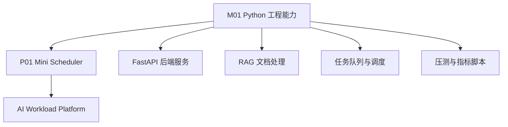
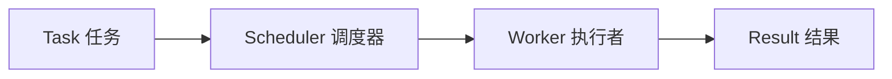
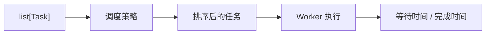

# M01 Python 工程能力适配教材

## 编写说明

这份教材服务于当前路线的第一个真实工程目标：把 `task_sorter` 和 P01 Mini Scheduler 做成一个结构清楚、可测试、可维护的小型 Python 项目。

它基于以下权威资料进行改写、重组和项目化适配：

- Python Tutorial：数据结构、函数、模块、类、异常
- Python `dataclasses`、`typing`、`pathlib`、`json`、`argparse` 官方文档
- pytest 官方文档：测试发现、断言、fixture、工程实践
- Pydantic 官方文档：后续 FastAPI 数据模型的前置理解

这不是 Python 语法大全。当前阶段不追求“知道所有语法”，而是追求：

```text
能把一个小需求拆成清楚的数据模型、函数、模块和测试。
```

对应入口：

- 学习地图：[[10_学习模块/M01_Python工程能力/M01_Python工程能力_学习地图]]
- 资料索引：[[20_资料库/模块资料索引/M01_Python工程能力_资料索引]]
- 当前实验：[[40_实验练习/E01_Python基础练习/E01_Python基础练习_索引]]
- 当前项目：[[50_项目产出/P01_Mini_Scheduler/P01_Mini_Scheduler 项目主页]]

## 模块入口

| 入口项 | 本模块口径 |
|---|---|
| 目标读者 | 已完成 M00，或已经会在 PowerShell 中定位目录、运行 `.py` 文件、创建虚拟环境并阅读基本报错；同时应认识 `if / for / list / dict / function`。本模块不从变量和循环重新讲起。 |
| 第一轮产物 | E01 要求的排序脚本、`Task/Worker` 数据模型、pytest 回归测试、JSON 输入输出和 CLI；学习者产物与 P01 reference 分开保存。 |
| 核心路径 | 第 1-10 章建立模型、函数、模块、异常、IO、OOP 和测试能力，第 12 章组装 CLI；第 11 章用于变式诊断。 |
| 查阅支线 | 第 13 章安排顺序，第 14 章集中验收，第 15 章提供外部资料；它们不替代第 1-12 章的教学正文。 |
| 证据边界 | P01 reference 测试只证明仓库参考实现可执行；学习者是否完成另看本人代码、测试输出和问题记录。 |
| 建议用时 | 作者侧初步估计 18-24 小时，包含章内练习和 CLI 组装，不含 P01 的扩展功能。 |

在仓库根目录先运行下面的诊断；这一步不要求先执行 P01 reference 测试：

```powershell
py -3.13 --version
git --version
py -3.13 -c "from dataclasses import dataclass; from pathlib import Path; import json; print('M01 prerequisite ok')"
Test-Path ".\50_项目产出\P01_Mini_Scheduler\mini_scheduler\requirements-dev.lock"
```

第一行应显示 Python 3.13，第三行应输出 `M01 prerequisite ok`，最后一行应为 `True`。解释器或 Git 命令不可用时，先返回 M00 修复环境；不要用系统中的 Python 3.8/3.9 继续本模块。

版本边界以 P01 `mini_scheduler/pyproject.toml` 和锁文件为准：Python 为 `>=3.13,<3.14`，pytest 支持范围为 `>=8.4,<9`，当前 verified reference 锁定 pytest 8.4.2。主线代码只依赖 Python 标准库；本教材提到 Pydantic 是为 M02 建立概念前置，不表示 M01 reference 依赖它。锁定版本是当前复现基线，不等于断言其他版本一定不兼容。

本文件的章级内容类型如下：

| 章节 | 类型 | 阅读方式 |
|---|---|---|
| 第 1-12 章 | `instructional` | 概念、示例、反例与工程应用主线 |
| 第 13、15 章 | `appendix` | 学习导航与来源索引，按需查阅 |
| 第 14 章 | `workbook` | 固定输入、命令和验收证据，不作为新概念首讲 |

## 第一轮学习边界

第一轮要学：

- 用 `dict`、`dataclass` 和类型标注表达任务、worker、结果等核心数据结构。
- 用函数拆分 FIFO、Priority、SJF、metrics 等可测试规则。
- 用模块拆分把 `models`、`strategies`、`metrics`、`main` 分开。
- 用异常、日志、JSON、pytest 和 argparse 支撑 P01 最小工程。
- 能解释 AI 生成代码里哪些地方过度设计、吞错误或破坏可测试性。

暂时不深入：

- 元类、描述符、装饰器框架、复杂设计模式。
- 大型包发布、插件系统、复杂配置中心。
- 性能优化、并发编程、异步框架内部机制。
- 把 P01 包装成完整生产项目或成熟调度平台。

---

## Reference 与学习者完成口径

P01 `mini_scheduler/` 是已经验证的 reference implementation，用来证明路线中的调度、指标和测试可以执行。它不是学习者已经完成 M01 的证据。

| 类型 | 能证明什么 | 不能证明什么 |
|---|---|---|
| P01 reference 测试通过 | 仓库提供的参考实现可执行 | 学习者能独立建模、调试和测试 |
| learner reproduction | 学习者亲手完成 E01 任务、保留代码和测试记录 | reference 的高级功能也已掌握 |

学习者必须亲手走完“dict 排序 -> dataclass -> pytest -> JSON/CLI 工程化”并保留失败修复记录，才能把 M01 标记为本人完成。后文提出的 E01-04 目前只是待创建的学习者任务，不是仓库中已经存在或已经验证的实验。

---

<!-- textbook-content: default=instructional -->

## 第 1 章：Python 工程能力到底是什么

### 1.1 会写语法不等于会写工程

很多人学 Python 时会先学：

- 变量
- if / for
- list / dict
- 函数
- 类

这些当然要会，但它们还只是“语法材料”。真正的工程能力是：

- 能把需求转成数据结构
- 能把重复逻辑拆成函数
- 能把对象关系抽象成类
- 能把文件拆成模块
- 能把错误变成可理解的异常
- 能用测试验证规则
- 能让别人读懂你的代码

比如 P01 Mini Scheduler 的需求不是“写几个 Python 语法”，而是：

```text
输入一批任务
根据调度策略排序
分配给 worker
统计等待时间和完成时间
用测试证明规则正确
```

这已经是一个小工程。

### 1.2 Python 在本路线中的位置



Python 在你的路线里不是只用来刷题，而是承担四类工作：

| 用途 | 例子 |
|---|---|
| 工程服务 | FastAPI、RAG 服务、Agent 工作流 |
| 实验脚本 | 任务生成、调度策略对比、指标统计 |
| 数据处理 | JSON、日志、实验结果表 |
| 测试验证 | pytest 验证调度规则和 API 行为 |

### 1.3 本模块的合格线

学完 M01，你不需要成为 Python 专家，但应该能独立完成：

- 写一个 100-300 行的小项目
- 定义 `Task`、`Worker` 这样的数据对象
- 写 3-5 个清楚的函数
- 把代码拆成 2-4 个模块
- 用 pytest 验证核心规则
- 读懂 Python 报错并定位问题
- 解释 AI 生成代码里不合理的地方

### 1.4 这一章怎么读，以及它想给你什么

如果说 M00 让你能"跑通、调通、测通"一个小工程，M01 要让你能把它**写得干净、可维护、可扩展**。各章对应"驯服复杂度"的一个侧面，建议按顺序读：

```text
第 2 章 数据模型     → 用显式结构表达"系统里有什么"
第 3 章 函数         → 把规则封装成可测试单元、隔离副作用
第 4 章 类型标注     → 让结构和契约对人和工具可见
第 5 章 模块         → 按职责拆分，高内聚低耦合
第 6 章 异常         → 让错误响亮、可定位，而不是被吞掉
第 7 章 文件/JSON    → 规范地和外部数据打交道
第 8 章 面向对象     → 在该用时用，不过度设计
第 9 章 pytest       → 覆盖正常/边界/错误，钉住规则
第 10 章 贯通案例    → 从 task_sorter 演进到 Mini Scheduler
第 12 章 工具组合    → 用 argparse 等把脚本变成可交付的小工具
第 13 章 学习顺序    → 把章节映射到每天的动手任务
第 14 章 学习检查    → 用固定输入、命令和阈值验收
第 15 章 外部资料    → 完成主线后按需查阅
```

和 M00 一样，每章不只教语法，而是按"真实痛点 → 讲清机制 → 点出一个工程判断（设计权衡 + 可迁移原则，并指向后面的 M02/M06/P03 等）"的节奏走。M01 反复出现的主题是同一个词——**复杂度**：dataclass、纯函数、模块拆分、异常、克制的 OOP，全都是在回答"代码长大后怎么不失控"。你在这里学的不只是 Python 写法，而是一套能用到任何语言、任何规模系统上的工程直觉。

读每章时多问自己：**这个写法解决了什么复杂度问题？它的代价是什么？换个场景我还会这么选吗？**

---

## 第 2 章：从业务需求到数据模型

### 2.1 为什么工程从"数据"开始，而不是从"代码"开始

新手写程序习惯从"该写什么 for 循环"开始。但有经验的工程师拿到需求，第一个问题是：**这个系统处理的核心东西是什么？它长什么样？** 因为一旦数据结构定错，后面所有处理它的代码都会跟着别扭。

P01 处理的核心东西是任务（Task）和执行者（Worker）：



所以我们先把"Task 到底有哪些字段"定清楚——这决定了后面排序拿什么排、统计拿什么算。这一章的核心，是想清楚**用什么方式表达"一个任务"**，以及这个选择背后的工程权衡。

### 2.2 起点：用 dict 表达任务

最自然的起点是字典：

```python
task = {
    "id": "t1",
    "created_at": 1,
    "priority": 2,
    "duration": 5,
}
```

dict 的好处很实在：写起来快、和 JSON 几乎一样（从文件读进来直接就是 dict）、适合快速试想法。M00 和 E01-01 都先用它，是对的。

但当这个 dict 变成项目的**核心业务对象**、被几十处代码反复传递时，一个隐患会浮现。看这行：

```python
task["duraton"]      # duration 拼错成 duraton
```

Python **不会在你写错的那一刻报错**。它会一直跑到执行这行、真的去取 `duraton` 这个不存在的键时，才抛 `KeyError`。如果这行藏在一个不常走到的分支里，这个错误可能潜伏很久。

更深一层的问题是：**"一个 task 到底该有哪些字段"这个知识，在 dict 方案里是不存在于代码中的——它只存在于你的脑子里和散落各处的用法里。** 新人接手、或者三个月后的你回来，没有任何一处地方能一眼告诉你"task 的完整结构是什么"。

### 2.3 进阶：用 dataclass 把结构"显式"写出来

当任务结构稳定下来，更工程化的做法是 `dataclass`：

```python
from dataclasses import dataclass


@dataclass
class Task:
    id: str
    created_at: int
    priority: int
    duration: int
    status: str = "pending"   # 带默认值的字段写在最后；创建时不传就用默认值
```

创建任务（`status` 可以不传，自动是 `"pending"`）：

```python
task = Task(id="t1", created_at=1, priority=2, duration=5)
print(task.status)   # pending
```

> 本章的 `id / created_at / priority / duration / status` 是为了先讲清 dataclass 的**教学简化模型**，不是 E01/P01 的最终接口。后续章节在解释纯函数、类型标注和 OOP 时可能继续使用这组短字段；一旦进入 E01-02、E01-03 或 P01 代码，必须切换到下面的规范字段，不能把两套名称混在同一个函数里。

教学字段和规范字段的对应关系：

| 教学简化字段 | E01/P01 规范字段 | 差异为什么重要 |
|---|---|---|
| `id` | `id` | 含义一致 |
| `created_at` | `submit_time` | P01 使用模拟提交时刻，不是 API 的 UTC `created_at` |
| `duration` | `estimated_duration` | SJF 按预测时长排序，不应暗示已经知道真实执行时长 |
| `priority` | `priority` | 数字越小优先级越高 |
| `status: str` | `status: TaskStatus` | P01 用受约束的状态集合，避免任意字符串 |
| 无 | `task_type`、`token_count` 等 | 进入真实 workload 后才需要的扩展字段 |

推荐的学习节奏是：在本章用短字段理解机制；做 E01-01 时直接使用 `submit_time` 和 `estimated_duration`；从 E01-02 起以 P01 `scheduler/models.py` 的 `Task` 为规范接口。第 10 章再次出现短字段时，仍然只是概念演示。

**它到底比 dict 多做了什么？——`@dataclass` 帮你自动生成了几样东西。**

这不只是"换个写法"。你只写了五行字段声明，`@dataclass` 这个装饰器在背后**自动为你生成了三个方法**，否则你得手写一大堆样板代码：

- `__init__`：就是上面 `Task(id="t1", ...)` 能用的原因。没有 dataclass，你得自己写 `def __init__(self, id, created_at, ...): self.id = id; self.created_at = created_at; ...` 一长串。
- `__repr__`：`print(task)` 会显示成 `Task(id='t1', created_at=1, priority=2, duration=5, status='pending')`，而不是普通对象那种没法看的 `<Task object at 0x7f...>`。调试时这一点极其有用。
- `__eq__`：两个字段都相同的 Task 用 `==` 比较会得到 `True`。这让你在测试里能直接 `assert task1 == task2`，而普通对象默认是"是不是同一个内存地址"，几乎没法用。

换句话说，`@dataclass` 的价值是**用一行装饰器，换来本该手写几十行的 `__init__`/`__repr__`/`__eq__`**。它把"一个数据对象该有的标准行为"自动补齐了，你只需声明"有哪些字段"。

由此带来一串连锁好处：

- 拼错字段名 `task.duraton`，IDE 当场标红、运行也会立刻 `AttributeError`，而不是 dict 那种潜伏到很晚的 `KeyError`。
- 任何人想知道 task 长什么样，看 `class Task` 一眼即可，不用去翻用法猜。
- `__repr__` 让出错时一眼看清对象内容，`__eq__` 让测试能直接比较对象。
- 以后加字段（如已经加的 `status`），只改这一处定义。

### 2.4 dict vs dataclass：一个"隐式 vs 显式"的根本权衡

这不只是两种语法的选择，背后是一个会反复出现的工程权衡：

| | dict（隐式结构） | dataclass（显式结构） |
|---|---|---|
| "有哪些字段"写在哪 | 没写在任何地方，靠约定和记忆 | 写在 class 定义里，唯一且明确 |
| 写错字段名何时暴露 | 运行到那一行才 `KeyError`（可能很晚） | IDE 即时标红 / 立刻 `AttributeError`（很早） |
| 前期成本 | 零，随手就用 | 要先定义一个 class |
| 灵活性 | 高，随时塞任意键 | 受约束，字段固定 |
| 适合 | 临时数据、外部 JSON 原样接收 | 项目核心业务对象 |

权衡的实质是：**dict 用"放弃结构约束"换来了灵活和省事；dataclass 用"前期写一个定义"换来了结构显式、错误早暴露。** 项目越大、对象越核心、活得越久，后者越划算——因为"错误潜伏到很晚才爆发"的代价，会随项目规模指数级上升。

> **可迁移的原则**：**让隐式的约定变成显式的结构，让错误尽可能早地暴露。** 一个"任务有哪些字段"的约定，与其留在脑子里、等运行时才暴露问题，不如写成代码、让工具和类型系统在你敲键时就帮你挡住错误。
>
> 这条原则是你整条路线后半段的主轴之一：
>
> - **M02 的 Pydantic** 是它的强化版——不仅显式声明结构，还在数据**进入系统的边界**做运行时校验（dataclass 不做校验，2.x 后面会区分这点）。
> - **P03 的 `03_API与数据契约`** 把"请求/响应长什么样"显式写成契约，正是为了让前后端、各服务之间的约定不再靠口头和记忆，而是有一处明确定义、能被验证。
>
> 所以你现在为 Task 写下那个 `@dataclass`，学的不是 dataclass 语法，是"用显式结构驯服复杂度"的工程习惯。

### 2.5 dict 和 dataclass 在本路线怎么搭配用

理解了权衡，搭配策略就清楚了——不是非此即彼，而是各用其所长：

| 场景 | 推荐 | 为什么 |
|---|---|---|
| 快速验证排序逻辑 | dict | 还在试想法，结构没定，灵活优先 |
| 读取外部 JSON 原始数据 | dict | 外部数据天然是 dict，先接进来 |
| 项目核心业务对象 | dataclass | 反复传递、需要结构稳定和早报错 |
| 后续 FastAPI 请求模型 | Pydantic Model | 还需在边界做运行时校验（M02） |

当前阶段的推进节奏：

1. E01-01 先用 dict 做 `task_sorter`（快速跑通排序）
2. E01-02 再用 dataclass 做 `Task` 和 `Worker`（结构稳定下来）
3. M02 / FastAPI 阶段再引入 Pydantic（需要校验时）

### 2.6 Worker 应该怎么表示

最小 Worker：

```python
from dataclasses import dataclass


@dataclass
class Worker:
    id: str
    available_at: int = 0
```

含义：

- `id`：worker 名称
- `available_at`：什么时候空闲

后续可以扩展：

- worker 类型
- 最大并发
- 当前任务
- 失败次数
- 成本

### 2.7 学术和工程视角

从学术视角看，`Task` 和 `Worker` 是调度问题里的实体抽象。

从工程视角看，`Task` 和 `Worker` 是代码里的数据模型。

二者关系：


如果数据模型混乱，实验指标也会混乱。

### 2.8 推荐资料

本章正文已覆盖你现在需要的 dict / dataclass 选择与背后的权衡。下面资料供将来深入，**不是必读**：

- Python dataclasses：https://docs.python.org/3/library/dataclasses.html
- Python Tutorial · 数据结构：https://docs.python.org/3/tutorial/datastructures.html

现在**不要**深入：dataclass 的高级参数（`field`、`frozen`、`__post_init__` 等）、metaclass、descriptor、复杂泛型。等你已经能用"显式结构、早暴露错误"解释清楚为什么用 dataclass 之后，再按需了解这些。

---

## 第 3 章：函数：把规则变成可测试单元

### 3.1 函数的本质：给一段逻辑一个名字和一道边界

新手常把函数理解成"为了少写重复代码"。复用只是它的副产品。函数更本质的作用是两件事：**给一段逻辑起一个能说明意图的名字，并用参数和返回值划出一道清晰的边界**——外面只需知道"给它什么、它还什么"，不用关心里面怎么实现。

P01 里有几条明确的规则，每一条都该成为一个有名字、有边界的函数：

```text
按 created_at 排序   → sort_by_created_at
按 priority 排序     → sort_by_priority
按 duration 排序     → sort_by_duration
```

### 3.2 对比：规则散在脚本里 vs 封装成函数

先看规则散落的写法：

```python
tasks = [
    {"id": "t1", "created_at": 2, "priority": 3, "duration": 5},
    {"id": "t2", "created_at": 1, "priority": 1, "duration": 2},
]

tasks = sorted(tasks, key=lambda task: task["created_at"])
print(tasks)
tasks = sorted(tasks, key=lambda task: task["priority"])
print(tasks)
```

问题不在于它跑不出结果——它能跑。问题在于：排序规则和具体数据、打印混在一起，没有名字说明每一步的**意图**，更要命的是**没法单独测试**"按 priority 排序"这条规则对不对，因为它没有独立的边界。

封装成函数后：

```python
def sort_by_created_at(tasks):
    return sorted(tasks, key=lambda task: task["created_at"])


def sort_by_priority(tasks):
    return sorted(tasks, key=lambda task: task["priority"])


def sort_by_duration(tasks):
    return sorted(tasks, key=lambda task: task["duration"])
```

现在每条规则有了名字（意图清楚）、有了边界（输入 tasks、输出排好序的 tasks），于是**每条规则都能被一个测试单独钉住**（这正是 M00 第 6 章学的）。函数边界和可测试性是一回事。

### 3.3 函数设计的四条基本原则

当前阶段记住四条就够：

1. **一个函数做一件事**——名字能用一个动词短语说清。
2. **函数名表达业务含义**——`sort_by_priority` 而不是 `process` `handle`。
3. **输入和输出要清楚**——靠参数拿数据、靠返回值给结果，别依赖隐藏的全局状态。
4. **核心逻辑里不混 IO**——别在排序函数里读文件、打印、写日志。

第 4 条最容易被忽视，也最值得讲透，它牵出一个核心概念：副作用。

### 3.4 核心概念：纯函数与副作用

我们先不下定义，先做一件事——**给一个函数写测试**，看看会发生什么。

假设有这么个函数，它读文件、排序、打印、再写文件：

```python
import json

def sort_and_save(path):
    tasks = json.load(open(path))
    result = sorted(tasks, key=lambda t: t["duration"])
    print(result)
    json.dump(result, open("out.json", "w"))
    return result
```

现在你想测"它排序排对了吗"。试着写测试，你会发现自己被迫做这一串事：

```python
import json
import os

def test_sort_and_save():
    # 1. 先造一个真实的输入文件，因为函数只认 path、不认数据
    with open("test_input.json", "w") as f:
        json.dump([{"id": "t1", "duration": 5}, {"id": "t2", "duration": 2}], f)
    # 2. 调用（它还会顺手打印、还会写出一个 out.json 到你的磁盘上）
    result = sort_and_save("test_input.json")
    # 3. 断言
    assert [t["id"] for t in result] == ["t2", "t1"]
    # 4. 收拾现场：删掉刚才造的文件和它吐出来的 out.json
    os.remove("test_input.json")
    os.remove("out.json")
```

明明只想验证"排序对不对"这一件纯逻辑，却被迫和文件系统纠缠：造文件、清文件，还在磁盘上留下 `out.json`，控制台被 `print` 刷屏。如果两个测试同时跑、都写 `out.json`，还会互相干扰。**测试的痛，全部来自函数里那些"读写文件、打印"的动作，而不是排序逻辑本身。**

这就引出了那条分界线。按"会不会对函数外部的世界造成影响"，函数分两类：

- **纯函数**：结果只由输入参数决定，且不碰外部任何东西。同样的输入永远给同样的输出，运行它除了返回值之外不留下任何痕迹。

  ```python
  def sort_by_duration(tasks):
      return sorted(tasks, key=lambda task: task["duration"])   # 只读入参、只产出返回值
  ```

- **带副作用的函数**：除了返回值，还对外部世界做了事——读/写文件、打印、写日志、改全局变量、发网络请求。上面那个 `sort_and_save` 就是。

测纯函数 `sort_by_duration` 有多省心？对照上面那一大坨：

```python
def test_sort_by_duration():
    result = sort_by_duration([{"id": "t1", "duration": 5}, {"id": "t2", "duration": 2}])
    assert [t["id"] for t in result] == ["t2", "t1"]
```

给数据、断结果，一行搞定。不造文件、不清现场、不刷屏、测试之间也不会互相打架。**同一个"排序对不对"，纯函数让你只测逻辑，带副作用的函数逼你连带管理整个外部世界。**

**一个常见误解要先澄清：不纯 ≠ 一定有 IO。** "读写文件、打印"是最显眼的副作用，但还有一类更隐蔽的不纯——**依赖或修改外部可变状态**。看这两个例子，它们一行 IO 都没有，却同样不纯：

```python
import random, datetime

def pick_a_task(tasks):
    return random.choice(tasks)        # 不纯：同样输入，每次输出可能不同（依赖随机数）

def stamp(task):
    task["seen_at"] = datetime.datetime.now()   # 不纯：依赖当前时间，且改了入参
    return task
```

`pick_a_task` 同样的 `tasks` 每次给的结果不一样；`stamp` 既依赖"现在几点"又**改动了传进来的 task**。判断纯不纯，记住两条都要满足：**(1) 输出只由入参决定（不依赖时间、随机、全局变量等外部状态）；(2) 不改动任何外部东西（包括不偷偷修改传进来的参数）。**

第二条还藏着一个 P01 里的真实陷阱。对比这两种排序：

```python
def sort_pure(tasks):
    return sorted(tasks, key=lambda t: t["duration"])   # sorted() 返回新列表，不动原列表 → 纯

def sort_impure(tasks):
    tasks.sort(key=lambda t: t["duration"])             # list.sort() 原地改排原列表 → 不纯！
    return tasks
```

`sorted()` 和 `list.sort()` 看着只差一个词，纯不纯却天差地别：`sorted()` 造一个新列表返回、原列表不动；`list.sort()` **直接改排你传进来的那个列表**。后者的危险在于——调用方手里的原列表被你**偷偷重排了**，它后面如果还指望用原始顺序，就会拿到莫名其妙的结果，而且极难排查。这正是本模块全程用 `sorted()`、第 11 章专门把"函数偷偷修改输入"列为坏味道的原因。**纯函数的第二条（不改入参），落到排序上就是"用 `sorted` 不用 `.sort()`"。**

### 3.5 再追一层：纯函数的好处远不止"好测"

"好测"只是纯函数最先被你感受到的好处。再往下追一层，会发现"同样输入永远同样输出、且不留痕迹"这个性质，悄悄解锁了一串在大型系统里极其值钱的能力——而这正是它一路连到 M05/M06/P03 的原因：

- **可缓存（记忆化）**：既然同样输入永远同样输出，算过一次就能把结果存起来，同样输入再来直接返回、不必重算。Python 标准库的 `functools.lru_cache` 就是干这个的：

  ```python
  from functools import lru_cache

  @lru_cache
  def fib(n: int) -> int:        # 纯函数：结果只由 n 决定
      return n if n < 2 else fib(n - 1) + fib(n - 2)
  ```

  注意有个前提：`lru_cache` 要拿参数当"键"去查缓存，所以**参数必须可哈希**（int、str、tuple 这类不可变值可以；list、dict 不行）。这就是为什么 `sort_by_duration(tasks)`——参数是 list——**不能**直接套 `lru_cache`：list 不可哈希。要缓存它，得先把输入转成可哈希形式（如 tuple），属于以后真有性能需求时再做的优化。这里你只要记住因果：**纯，是可缓存的前提；但可缓存还额外要求参数可哈希。** 带副作用的函数则根本不敢缓存——万一它每次还要写日志、发请求，缓存就把这些副作用一起跳过了。（这正是 M06"对昂贵计算做缓存"敢成立的基础。）
- **可安全重试**：纯函数失败了直接再调一次，没有任何后遗症。但带副作用的函数重试很危险——想象一个"扣款 + 返回结果"的函数，第一次扣了款但返回时网络断了，重试就会**扣第二次款**。（这正是 M06 任务重试、M04 Agent 重试都必须先问"这步有没有副作用、能不能安全重试"的根本原因。）
- **可并行**：纯函数之间不共享状态，可以放心同时跑、不会互相踩。带副作用的函数并行时，可能同时写一个文件、改一个全局变量，产生时有时无、极难复现的 bug。

你看，"纯"不是一种洁癖，它是一种**让函数变得可预测**的性质，而可预测性在系统变大、要缓存、要重试、要并发时，会兑换成实打实的工程能力。

### 3.6 设计权衡：副作用躲不掉，但能"赶到边界"

读到这你大概会反驳：可程序总得读文件、总得输出结果啊，副作用根本不可能消除。这个反驳成立：**副作用不可消除，但可以被隔离。** 关键不在"有没有副作用"，而在"副作用待在哪"。这就是那个真实权衡：

- 把副作用**散在各处**（每个函数都顺手读个文件、打个日志、改个全局）：写的时候一时爽，但整个程序没有一处是 3.4 那样好测的，3.5 那些缓存/重试/并行的好处也一个都拿不到，改一处随时牵动文件、日志、全局状态。
- 把副作用**集中赶到程序最外层的边界**，让中间的核心逻辑保持纯净：代价是你每写一个函数要多问一句"这该是纯的吗、IO 是不是该挪出去"，换来的是核心逻辑可测、可缓存、可重试、可复用。

落到 P01 就是这个分层：

```text
外层（main / 入口）：读 JSON、打印结果、写日志、记录指标   ← 副作用全集中在这一圈
核心层（strategies / metrics）：排序、算指标             ← 全是纯函数，3.4/3.5 的好处全拿到
```

下面是这个分层的骨架（`load_tasks` 读文件的具体实现见第 7 章，`format_result` 是把结果转成字符串的小工具——这里只看职责怎么分，不必纠结它们的内部代码）：

```python
# 外层（边界）负责所有 IO
tasks = load_tasks("data/tasks.json")        # 读文件——副作用，待在边界（第 7 章实现）
sorted_tasks = sort_by_priority(tasks)       # 排序——纯函数，好测/可缓存/可并行
print(format_result(sorted_tasks))           # 打印——副作用，待在边界
```

关键是看 `sort_by_priority` 这一行：它夹在两个副作用（读文件、打印）中间，自己却是纯的——数据从参数来、结果从返回值走。IO 在它两头的边界发生，它只管算。

> **可迁移的原则**：**把"计算"和"与外部世界打交道（IO、副作用）"分开，让核心逻辑保持纯净，把副作用推到系统的边界。** 纯的部分好测、可缓存、可重试、可并行；不纯的部分集中在少数地方，便于管控。
>
> 这套结构业界叫"函数式核心，命令式外壳"（functional core, imperative shell），也是整洁架构的核心思想。它在你后面的路线里是同一件事的不断放大：
>
> - **P01**：strategies/metrics（纯核心）与 main（IO 外壳）分离；
> - **M02**：FastAPI 路由（处理 HTTP，不纯）与 service 层（业务逻辑，尽量纯）分开；
> - **M06**：正因为核心计算是纯的，"缓存结果""失败重试"才敢用——你现在就能理解那时为什么要先问"这步有没有副作用"；
> - **P03**：worker 执行尽量纯粹的计算，状态读写、队列、IO 交给专门的层。
>
> 所以"排序函数里不读文件"不是一条洁癖规则，是一个会一路兑现成可测试、可缓存、可重试、可扩展的架构决定。

### 3.7 P01 中的函数边界

推荐先拆成：

| 函数 | 责任 | 纯/不纯 |
|---|---|---|
| `load_tasks(path)` | 从 JSON 文件读任务 | 不纯（IO，放边界） |
| `sort_by_created_at(tasks)` | FIFO 排序 | 纯 |
| `sort_by_priority(tasks)` | Priority 排序 | 纯 |
| `sort_by_duration(tasks)` | SJF 排序 | 纯 |
| `calculate_wait_times(tasks)` | 统计等待时间 | 纯 |

注意这张表只有 `load_tasks` 是不纯的——IO 被压缩到了边界的一个函数里，核心的四个排序/统计函数全是纯的。不要一开始写一个巨大的 `main()` 把读文件、排序、统计、打印全搅在一起，那等于把副作用又撒回了各处。

---

## 第 4 章：类型标注：让代码更容易被读懂

### 4.1 类型标注是写给"人和工具"的说明，不是给运行时的命令

Python 是动态语言，运行时本身不看类型标注。那标注的意义是什么？它是**一份写在代码里的、关于"这个函数收什么、还什么"的契约说明**，主要服务于：

- 读代码的人——一眼看清输入输出，不用猜；
- IDE——据此自动补全、即时标红可疑用法；
- 类型检查工具（如 mypy）——在不运行程序的情况下静态查出一类错误；
- AI 辅助和后续框架（FastAPI/Pydantic）——据此生成更稳的代码、做数据校验。

例如：

```python
def sort_by_duration(tasks: list[dict]) -> list[dict]:
    return sorted(tasks, key=lambda task: task["duration"])
```

`tasks: list[dict]` 和 `-> list[dict]` 在说："给我一个字典列表，我还你一个字典列表。" 读的人不必跳进函数体就懂了它的边界。

> 环境要求：本模块统一使用 Python 3.13。若出现类型标注兼容错误，先检查虚拟环境和解释器路径，不再用旧版解释器兼容写法绕过环境问题。

### 4.2 配合 dataclass，标注从"类型"升级成"业务语义"

把第 2 章的 `Task` 接上来：

```python
from dataclasses import dataclass


@dataclass
class Task:
    id: str
    created_at: int
    priority: int
    duration: int
    status: str = "pending"


def sort_by_duration(tasks: list[Task]) -> list[Task]:
    return sorted(tasks, key=lambda task: task.duration)
```

`list[Task]` 比 `list[dict]` 多说了一层信息：不只是"一列字典"，而是"一列**任务**"。读的人立刻知道这些元素有 `id`、`priority`、`duration` 这些字段（因为 `Task` 定义在那儿）。这正是第 2 章"显式结构"的延续——**dataclass 让结构显式，类型标注让这个显式结构在函数签名里也能被看见**。

### 4.3 关键认识：标注不等于校验

这是最容易踩的误解，必须讲清。看这段：

```python
def add_one(x: int) -> int:
    return x + 1


add_one("abc")   # 你以为会被 x: int 拦住？
```

**不会。** Python 运行时根本不检查 `x: int`，它照样把 `"abc"` 传进去，然后在 `"abc" + 1` 时才抛 `TypeError`——而且报的是"字符串不能加整数"，不是"参数类型不对"。也就是说：

> 类型标注是**静态**的提示（给人、IDE、mypy 看），不是**运行时**的校验（程序执行时并不强制）。写了 `x: int`，不代表运行时就拦得住传进来的字符串。

这不是 Python 的缺陷，是它的设计选择：保持动态灵活，把"要不要静态检查"交给工具（mypy），把"要不要运行时校验"交给你自己或专门的库。

### 4.4 设计权衡：静态标注 vs 运行时校验，各管一段

理解了"标注≠校验"，就引出一个真实权衡：一个值的类型正确性，到底靠什么保证？两种手段，管的是不同阶段：

| | 静态类型标注（+ mypy） | 运行时校验（手写 if / Pydantic） |
|---|---|---|
| 何时起作用 | 写代码 / 检查时（程序没运行） | 程序运行、数据真的流进来时 |
| 能挡住什么 | 你自己代码里的类型误用 | **外部来的**脏数据（用户输入、JSON、网络） |
| 成本 | 几乎零（只是写标注） | 要写校验逻辑 / 引入库 |
| 挡不住什么 | 运行时才出现的外部脏数据 | 纯内部逻辑错误（那是静态检查的活） |

关键在于**数据从哪来**：

- 数据是你**内部代码**之间传递的——靠类型标注 + IDE/mypy 沟通就够了，不必在每个函数里运行时检查，那是徒增噪音。
- 数据是从**系统外部**进来的（用户填的表单、读进来的 JSON、收到的 HTTP 请求）——标注**挡不住**，必须有运行时校验，因为外部世界不遵守你的标注。

> **可迁移的原则**：**在系统边界做运行时校验，在系统内部靠类型标注沟通。** 不要指望类型标注挡住外部脏数据，也不要在内部到处写防御性的运行时检查。把校验集中在"数据进入系统"的那道门。
>
> 这恰好解释了你后面会遇到的一件事：**M02 为什么要专门引入 Pydantic？** 因为 FastAPI 接收的是外部 HTTP 请求——dataclass 的类型标注只是"说明",拦不住别人发来的非法数据；而 Pydantic 会在请求进入的边界**真正校验**每个字段（类型不对、缺字段、超范围都当场拒绝）。dataclass 管"内部结构显式"，Pydantic 管"边界运行时校验"，分工正好对应这条原则。（这也呼应了第 3 章"把副作用/不可信输入挡在边界"的思路。）

### 4.5 当前阶段怎么用类型标注

先做到三件事就够：

- 给函数参数加标注；
- 给函数返回值加标注；
- 给 dataclass 字段加标注。

**不要**深入：`Protocol`、`TypeVar`、`overload`、复杂泛型。这些在写库、写框架时才用得上，现在用会增加噪音、分散注意力。

推荐资料（供将来深入，不是必读）：

- Python typing：https://docs.python.org/3/library/typing.html

---

## 第 5 章：模块和项目结构

### 5.1 单文件的天花板

一个 `.py` 文件适合验证想法。但项目稍微长大，单文件会撞上一组真实问题：

- 函数几十个，找一段逻辑要上下翻半天；
- 排序、读写文件、命令行入口、测试全挤在一起，互相干扰；
- 改一处不知道会不会影响另一处，因为它们物理上挨在一起、心理上也纠缠在一起；
- AI 帮你改代码时，更容易把不该动的部分弄乱。

解决办法是拆模块。但"拆"不是随便切几刀——**怎么拆，背后有一条明确的判断标准**，这才是这章的重点。

### 5.2 拆分的演进：从单文件到分模块

第一版（验证期）：

```text
task_sorter/
  task_sorter.py
  tests/
    test_task_sorter.py
```

长大后（P01 阶段）：

```text
mini_scheduler/
  scheduler/
    __init__.py
    models.py        # Task、Worker 等数据模型
    strategies.py    # FIFO、Priority、SJF 排序策略
    metrics.py       # 等待时间、P95、吞吐等指标计算
  tests/
    test_strategies.py
    test_metrics.py
  README.md
```

### 5.3 核心标准：按"职责"拆，追求高内聚、低耦合

注意上面是怎么拆的——**不是按"文件大小"切，而是按"职责"分**：数据模型归 `models`，排序策略归 `strategies`，指标计算归 `metrics`。这背后是软件设计里最经典的一对概念：

- **内聚（cohesion）**：一个模块内部的东西，是不是都在干同一类事？`strategies.py` 里全是排序策略 → 高内聚。如果它里面还掺着读文件、算指标 → 低内聚。
- **耦合（coupling）**：模块之间的依赖有多紧？`strategies` 只依赖 `models`（要用 Task 类型），不关心指标怎么算、文件怎么读 → 低耦合。如果改一下 metrics 就得跟着改 strategies → 高耦合，糟糕。

| 文件 | 放什么（单一职责） |
|---|---|
| `models.py` | `Task`、`Worker`、状态——"系统里有什么东西" |
| `strategies.py` | FIFO、Priority、SJF——"任务怎么排序" |
| `metrics.py` | 等待时间、P95、吞吐——"怎么评价结果" |
| `main.py` | 命令行入口、串联流程——"怎么跑起来" |
| `tests/` | 测试 |

好处是直接的：找排序逻辑就去 `strategies.py`；改指标算法只动 `metrics.py`、不碰别的；测 strategies 时不用管文件读写。这正是第 3 章"副作用隔离"在**文件层面**的延续——那里是把 IO 和计算分到不同函数，这里是把不同职责分到不同模块。

> **可迁移的原则**：**按职责切分，让每个模块高内聚、模块之间低耦合。** 高内聚=一个模块只干一类事、改动有明确的落点；低耦合=模块间依赖少而清晰、改一处不会引发连锁反应。这是控制软件复杂度最基本、也最通用的杠杆。
>
> 它的尺度会一路放大，本质是同一件事：
>
> - 在 M01，是把 `models / strategies / metrics` 拆成不同**文件**；
> - 在 **M02**，是把 `router / service / repository` 拆成不同**层**（HTTP 处理、业务逻辑、数据访问各管一段）；
> - 在 **P03**，是把 API、worker、队列拆成不同**服务**——而服务之间靠第 M00 第 7 章讲的 HTTP 契约低耦合地连接。
>
> "高内聚低耦合"是从函数、到模块、到服务、到整个系统架构都通用的判断标准。你现在学会按职责拆三个文件，就是在用最小的尺度练这套贯穿始终的直觉。

### 5.4 import 的基本直觉

如果 `strategies.py` 里有：

```python
def sort_by_priority(tasks):
    ...
```

测试里可以：

```python
from scheduler.strategies import sort_by_priority
```

这要求你在项目根目录运行测试：

```powershell
python -m pytest
```

如果 import 报错，优先检查：

1. 当前目录是不是项目根目录
2. 包目录里有没有 `__init__.py`
3. 文件名和函数名是否拼对
4. 是否和标准库重名，比如不要把文件叫 `json.py`

### 5.5 P01 推荐结构

P01 第一阶段建议：

```text
p01_mini_scheduler/
  scheduler/
    __init__.py
    models.py
    strategies.py
  tests/
    test_strategies.py
  README.md
```

暂时不需要：

- 复杂配置系统
- 插件架构
- 多层抽象
- Docker
- FastAPI

先让核心调度逻辑干净。

推荐资料：

- Python Tutorial Modules：https://docs.python.org/3/tutorial/modules.html
- pytest Good Integration Practices：https://docs.pytest.org/en/stable/explanation/goodpractices.html

---

## 第 6 章：异常处理：让错误可理解

### 6.1 换个视角：异常是"程序在喊救命"，是好事

新手怕异常，觉得"报红 = 我写得烂"。换个视角：**异常是程序在明确地告诉你"我遇到了无法正常继续的情况，并且我告诉你具体是什么情况、在哪一行"。** 比起"不报错但悄悄算出错误结果"，一个响亮的异常其实是帮了你大忙——它把问题暴露在你面前，而不是藏起来。

所以真正的问题从来不是"有没有异常"，而是两件事：**异常够不够清楚（能不能据此定位）**，以及**你有没有把它响亮地暴露出来、而不是偷偷压下去**。

### 6.2 P01 里会撞到的常见异常

它们都对应一个具体、可查的原因——回顾 M00 第 5 章"读 traceback"，最后一行就是这些：

| 异常 | 它在告诉你 |
|---|---|
| `KeyError` | dict 里没有你要的那个键（字段拼错或数据缺字段） |
| `AttributeError` | 对象没有你访问的那个属性（dataclass 字段名错） |
| `TypeError` | 类型不对（比如拿字符串去做数字运算） |
| `ValueError` | 类型对但值不合法（比如负数时长） |
| `FileNotFoundError` | 文件路径不对（回顾 M00 第 2 章的 cwd） |
| `ModuleNotFoundError` | 包没装或 import 路径错（回顾 M00 第 3 章的环境） |

### 6.3 核心权衡：快速失败 vs 静默吞错

现在看一段**新手最常写、却最危险**的代码：

```python
try:
    duration = task["duration"]
except Exception:
    pass        # 出错就忽略，继续往下跑
```

它的动机可以理解——"我不想让程序崩"。但它造成的后果是灾难性的：`duration` 没拿到，程序却**假装没事继续跑**，用一个缺失/默认的值算出一个**错误但看起来正常**的结果。等你发现结果不对时，错误的源头早已被这句 `except: pass` 抹掉了，你完全不知道该去哪查。这就是"静默吞错"。

对立的做法是"快速失败"——一旦发现数据不对，**立刻、响亮地报错，并带上足够的上下文**：

```python
def get_duration(task):
    if "duration" not in task:
        raise ValueError(f"task missing duration: {task}")   # 带上是哪个 task
    return task["duration"]
```

两种做法是一个真实权衡：

| | 静默吞错（`except: pass`） | 快速失败（raise + 上下文） |
|---|---|---|
| 当下表现 | 程序不崩，看起来"稳" | 程序在出错点立刻停下、报错 |
| 真实后果 | 错误被掩盖，带病运行，结果不可信 | 问题在源头暴露，定位成本极低 |
| 排查难度 | 极难（错误源头被抹掉） | 极易（traceback 直接指到位置和原因） |

"不崩"是一种**虚假的稳健**。一个带着错误数据继续运行、产出错误结果的程序，比一个干脆停下来报错的程序危险得多。

**踩坑现场：被 `except: pass` 坑掉一整天。** 假设你的调度器要按时长算平均等待时间，有人这么写了"防御"代码：

```python
def total_duration(tasks):
    total = 0
    for task in tasks:
        try:
            total += task["duration"]
        except Exception:
            pass            # “万一某个 task 没 duration，别让它崩”
    return total
```

现在喂进 3 个 task，其中一个把字段拼成了 `"duraton"`：

```python
tasks = [{"duration": 5}, {"duraton": 10}, {"duration": 3}]   # 第二个拼错了
print(total_duration(tasks))   # 输出 8
```

> **只信"程序没报错"的人**：看到输出 8，程序也没崩，以为一切正常，继续往下用这个数做调度决策、写进报告。直到很久以后发现指标对不上，才回头查——但那个拼错的 task 早被 `except: pass` 无声跳过了，输出 8 看起来**完全正常**（它确实是 5+3），没有任何线索指向"其实漏算了一个 10"。这一天就耗在"数字为什么不对"上。
>
> **懂"快速失败"的人**：根本不会写那个 `try/except`。`task["duraton"]` 缺字段时直接抛 `KeyError`，程序当场停在第二个 task 上，traceback 明明白白告诉你"这个 task 没有 duration"——三秒定位，发现是拼写错误，改完收工。

差别不在能力，在**要不要让错误响亮**。`except: pass` 用"程序没崩"的假象，换来了"错误被静音、带病运行、事后无从查起"的真实代价。

> **可迁移的原则**：**让错误尽早、响亮地暴露，并带上足够定位的上下文；不要用 `except: pass` 把它压下去。** 只有当你**明确知道**某个异常该如何处理（比如重试、用默认值、降级）时才捕获它，否则就让它往上抛。
>
> 这条原则在你后面的系统里会升级成正式机制，但内核完全一样：
>
> - **M06** 里任务失败要记录 `error_type` 和 `last_error`、决定能不能重试——这正是"带上下文 + 想清楚怎么处理才捕获"的工程化版本；
> - **M08** 里 `error_rate`、按 `error_type` 分类统计失败——前提就是错误被响亮地记录下来、而不是被吞掉；
> - **M04 Agent** 里区分"可重试错误 / 不可重试错误"，也是同一个判断的延伸。
>
> 你现在拒绝写 `except: pass`、坚持给异常带上 `task` 上下文，学的不是 Python 异常语法，是"让系统的故障可被发现、可被诊断"的可观测性思维。

### 6.4 P01 中应该怎么处理错误

任务字段不完整时，不应该静默忽略。

例如：

```python
def validate_task(task):
    required_fields = ["id", "created_at", "priority", "duration"]
    for field in required_fields:
        if field not in task:
            raise ValueError(f"task missing required field: {field}")
```

这样测试可以写：

```python
import pytest


def test_validate_task_requires_duration():
    task = {"id": "t1", "created_at": 1, "priority": 1}

    with pytest.raises(ValueError):
        validate_task(task)
```

### 6.5 异常处理原则

当前阶段记住：

1. 不知道怎么处理，就不要乱 `except`。
2. 捕获异常时要记录上下文。
3. 数据不合法时用明确错误暴露出来。
4. 用测试覆盖错误输入。

推荐资料：

- Python Tutorial Errors and Exceptions：https://docs.python.org/3/tutorial/errors.html
- pytest raises：https://docs.pytest.org/en/stable/how-to/assert.html

---

## 第 7 章：文件、JSON 和 pathlib

### 7.1 本章目标、前置与学习边界

M00 第 7 章已经建立 `dict <-> JSON` 的通信模型。本章把它收紧为工程边界。学完后你应该能够：

- 根据 `scheduler/io.py` 与 `data/tasks.json` 的真实层级推导项目根，而不依赖当前工作目录；
- 区分“JSON 语法可解析”“字段契约有效”和“已经构造成内部 `Task`”这三个状态；
- 独立实现并验证一次 `Task -> JSON -> Task` 往返，证明写入结果可被同一边界读回；
- 为缺字段或损坏 JSON 补上文件与 `tasks[index]` 上下文，而不是泄漏含糊的底层异常。

前置：完成 M00 第 2、7 章，以及本模块第 2 章 dataclass、第 3 章函数边界和第 6 章异常链。
本章使用 Python 3.13 标准库，约 60-75 分钟，不需要网络。先回答一个预测题：若
`io.py` 位于 `scheduler/` 内，`Path(__file__).parent / "data"` 会指向项目根的 `data/`，还是
`scheduler/data/`？不要凭感觉，先画目录再看 7.3。

当前 P01 reference 尚未包含 `scheduler/io.py`、`data/tasks.json` 和 `tests/test_io.py`。下面目录是
学习者练习及未来 E01-04 的**目标结构**，不是已实现状态；作者侧跑通本章独立示例也不能替代
学习者创建这些产物。

### 7.2 文件 IO 是边界，不是排序规则

文件链路至少有五个阶段：

1. `Path` 确定要读哪个文件；
2. UTF-8 文本从磁盘进入内存；
3. `json.loads()` 只把合法 JSON 语法变成 `list`/`dict` 等原始对象；
4. `task_from_dict()` 校验字段、类型和值，再构造内部 `Task`；
5. `asdict()` 把内部对象显式转回可序列化数据，最后写出 JSON 文本。

排序函数只接收第 4 步之后的 `Task`，不应同时打开文件。否则 IO 失败、数据错误和排序错误混在
一次调用里，单元测试很难只改变一个变量。`encoding="utf-8"` 也要显式给出，避免结果依赖
操作系统默认编码。

### 7.3 修正 `project_root`：从文件位置推导真实层级

目标结构是：

<!-- textbook-code: role=fragment -->
```text
mini_scheduler/
|-- data/
|   `-- tasks.json
|-- scheduler/
|   |-- __init__.py
|   `-- io.py
`-- tests/
    `-- test_io.py
```

下面写法是本章要修复的反例：

<!-- textbook-code: role=counterexample env=python-3.13 network=off -->
```python
from pathlib import Path

PROJECT_ROOT = Path(__file__).resolve().parent
DEFAULT_TASKS_PATH = PROJECT_ROOT / "data" / "tasks.json"
```

假设 `__file__` 是 `.../mini_scheduler/scheduler/io.py`，中间状态如下：

| 表达式 | 实际位置 |
|---|---|
| `Path(__file__).resolve()` | `.../mini_scheduler/scheduler/io.py` |
| `.parent` 或 `.parents[0]` | `.../mini_scheduler/scheduler` |
| `.parents[1]` | `.../mini_scheduler` |

所以反例会错误寻找 `.../mini_scheduler/scheduler/data/tasks.json`，典型现象是文件明明位于项目
`data/`，程序仍抛 `FileNotFoundError`。按当前目录契约，正确写法是：

<!-- textbook-code: role=fragment env=python-3.13 network=off -->
```python
from pathlib import Path

PROJECT_ROOT = Path(__file__).resolve().parents[1]
DEFAULT_TASKS_PATH = PROJECT_ROOT / "data" / "tasks.json"
```

这解决的是“相对哪个文件定位”，不是让任意目录布局自动正确。如果未来把 `io.py` 再移一层，
`parents[1]` 也必须随结构契约调整。回归测试应直接断言默认路径等于项目根下的
`data/tasks.json`，而不是只在恰好正确的 cwd 下试一次。

### 7.4 Worked example：独立可运行的最小边界与往返

下面故意只使用 `id` 和 `priority` 两个教学字段，让边界本身可见；它不是完整 P01 `Task`，也不
导入尚未建立的 `scheduler.io`。示例在系统临时目录创建文件并自动清理，固定成功输入有两个任务，
固定错误输入只缺 `priority`。

<!-- textbook-code: role=runnable env=python-3.13 network=off -->
```python
from __future__ import annotations

import json
from dataclasses import asdict, dataclass
from pathlib import Path
from tempfile import TemporaryDirectory


class TaskDataError(ValueError):
    pass


@dataclass(frozen=True)
class Task:
    id: str
    priority: int


def task_from_dict(raw: object, *, index: int) -> Task:
    if not isinstance(raw, dict):
        raise TaskDataError(f"tasks[{index}] must be an object")

    expected = {"id", "priority"}
    missing = expected - raw.keys()
    if missing:
        raise TaskDataError(f"tasks[{index}] missing fields: {sorted(missing)}")

    unknown = raw.keys() - expected
    if unknown:
        raise TaskDataError(f"tasks[{index}] has unknown fields: {sorted(unknown)}")

    if not isinstance(raw["id"], str) or not raw["id"]:
        raise TaskDataError(f"tasks[{index}].id must be a non-empty string")
    if isinstance(raw["priority"], bool) or not isinstance(raw["priority"], int):
        raise TaskDataError(f"tasks[{index}].priority must be an integer")

    return Task(id=raw["id"], priority=raw["priority"])


def parse_tasks(payload: object) -> list[Task]:
    if not isinstance(payload, list):
        raise TaskDataError("top-level JSON value must be a list")
    return [task_from_dict(item, index=index) for index, item in enumerate(payload)]


def load_tasks(path: Path) -> list[Task]:
    try:
        payload = json.loads(path.read_text(encoding="utf-8"))
    except FileNotFoundError as exc:
        raise TaskDataError(f"task file not found: {path}") from exc
    except json.JSONDecodeError as exc:
        raise TaskDataError(
            f"invalid JSON in {path} at line {exc.lineno}, column {exc.colno}"
        ) from exc
    return parse_tasks(payload)


def save_tasks(path: Path, tasks: list[Task]) -> None:
    payload = [asdict(task) for task in tasks]
    path.write_text(
        json.dumps(payload, ensure_ascii=False, indent=2) + "\n",
        encoding="utf-8",
    )


with TemporaryDirectory() as temporary_directory:
    data_path = Path(temporary_directory) / "data" / "tasks.json"
    data_path.parent.mkdir()
    source = [
        Task(id="task-001", priority=2),
        Task(id="task-002", priority=1),
    ]

    save_tasks(data_path, source)
    raw_value = json.loads(data_path.read_text(encoding="utf-8"))
    loaded = load_tasks(data_path)

    assert raw_value == [asdict(task) for task in source]
    assert loaded == source
    print(
        "json-value="
        + json.dumps(raw_value, sort_keys=True, separators=(",", ":"))
    )
    print(f"loaded={[(task.id, task.priority) for task in loaded]}")
    print(f"roundtrip={loaded == source}")

    data_path.write_text('[{"id": "task-bad"}]', encoding="utf-8")
    try:
        load_tasks(data_path)
    except TaskDataError as exc:
        print(f"error={exc}")
```

### 7.5 中间状态与实际输出

成功路径中的 `raw_value` 是 `list[dict]`，还不是 `list[Task]`；只有逐项通过
`task_from_dict()` 后，`loaded` 才成为内部对象。往返判据不是“文件存在”，而是
`load_tasks(save_tasks(source)) == source`。本例先由调用方显式建立 `data/`，因此
`save_tasks()` 不会悄悄决定是否创建目录。

实际输出为：

<!-- textbook-code: role=output -->
```text
json-value=[{"id":"task-001","priority":2},{"id":"task-002","priority":1}]
loaded=[('task-001', 2), ('task-002', 1)]
roundtrip=True
error=tasks[0] missing fields: ['priority']
```

### 7.6 错误反例、根因与恢复

把外部 JSON 直接展开成 dataclass 看起来很短：

<!-- textbook-code: role=counterexample env=python-3.13 network=off -->
```python
payload = json.loads(path.read_text(encoding="utf-8"))
tasks = [Task(**item) for item in payload]
```

对于 7.4 的错误输入，它会暴露类似 `Task.__init__() missing ... 'priority'` 的构造细节，却没有
`tasks[0]`，也没有区分顶层不是列表、元素不是对象、缺字段、未知字段或布尔值冒充整数。根因是
把“语法解码”和“业务边界校验”合并了。修复方法是让 `json.loads()` 只负责语法，让
`parse_tasks()`/`task_from_dict()` 负责契约，再用 `raise ... from exc` 包装文件不存在和 JSON
语法错误。回归测试至少断言错误消息带 `tasks[index]`；损坏 JSON 则带行列位置。

路径反例和数据反例是两个不同边界：前者决定“读哪个文件”，后者决定“文件内容能否进入内部
模型”。排查时一次只修一个，不要用捕获所有 `Exception` 的方式把两者一起吞掉。

### 7.7 独立练习：从最小 Task 迁移到 E01/P01 字段

在自己的学习者项目中创建 `scheduler/io.py`、`data/tasks.json` 和 `tests/test_io.py`，不要直接
改 P01 reference 当作个人产物。先复现最小示例，再撤掉脚手架：

1. 给固定输入增加 `Task(id="task-003", priority=0)`，预测 JSON 数组顺序并完成往返；IO 层不得排序。
2. 独立把 `Task` 扩展为第 2 章映射表中的 `task_type`、`estimated_duration`、`submit_time`；自行完成
   TODO 校验，不从第 12 章目标结构倒抄完整实现。
3. 为第二个元素缺字段构造变式，错误必须定位到 `tasks[1]`；再用一份损坏 JSON 验证行列信息。
4. 将 `DEFAULT_TASKS_PATH` 放入真实的 `scheduler/io.py`，证明它指向项目根的 `data/tasks.json`，
   且核心排序函数仍只接收 `list[Task]`。
5. 迁移题：如果配置文件未来移动到 `config/fixtures/tasks.json`，写出应修改的唯一边界，并解释
   为什么不应在每个调用点手写新路径。

练习证据保存到个人实验记录：目录树、固定输入、测试命令、成功摘要以及一次故意失败到修复的
记录。现有 reference 测试通过不能自动勾选这些步骤。

### 7.8 验收

至少写五类测试：默认路径、不同输入往返、第二项缺字段、未知字段、损坏 JSON。默认路径测试的
核心不变量可以写成：

<!-- textbook-code: role=fragment env=python-3.13 network=off -->
```python
from pathlib import Path

from scheduler.io import DEFAULT_TASKS_PATH


def test_default_tasks_path_is_under_project_root():
    expected = Path(__file__).resolve().parents[1] / "data" / "tasks.json"
    assert DEFAULT_TASKS_PATH == expected
```

在学习者项目根运行：

<!-- textbook-code: role=fragment env=python-3.13 network=off -->
```powershell
python -m pytest -q tests/test_io.py
```

只有同时满足下面条件，才能把本章 learner reproduction 标为完成：

- 7.4 独立示例产生与 7.5 一致的四行输出，进程退出码为 0；
- 至少五类测试全部通过，且把 `parents[1]` 改回 `.parent` 后默认路径测试会失败；
- 往返断言比较的是对象值，不只是文件存在或任务数量；
- 缺字段错误精确到 `tasks[1]`，损坏 JSON 错误包含 line/column，未知字段被拒绝；
- `scheduler/io.py` 不导入排序策略，策略函数也不打开文件；
- 记录中明确区分作者侧示例可执行、P01 verified reference 与学习者自己的产物。

### 7.9 本章来源

- [Python 3.13 `pathlib`, Accessing individual parts](https://docs.python.org/3.13/library/pathlib.html#accessing-individual-parts)：
  核对 `parent`、`parents` 和路径组件语义；`Path.resolve()` 见同页方法说明。
- [Python 3.13 `pathlib`, Reading and writing files](https://docs.python.org/3.13/library/pathlib.html#reading-and-writing-files)：
  核对 `read_text()`、`write_text()` 与 encoding 参数。
- [Python 3.13 `json`](https://docs.python.org/3.13/library/json.html)：核对 `loads()`、`dumps()`、
  `JSONDecodeError.lineno/colno` 和 JSON/Python 类型映射。
- [Python 3.13 `dataclasses.asdict`](https://docs.python.org/3.13/library/dataclasses.html#dataclasses.asdict)：
  核对 dataclass 到字典的递归转换语义。
- [pytest `tmp_path`](https://docs.pytest.org/en/stable/how-to/tmp_path.html#the-tmp-path-fixture)：核对真实
  学习者测试中每个用例使用临时路径、避免污染仓库的方式。

### 7.10 本章小结与下一步

可靠的文件边界同时固定“从哪里读”和“什么数据能进入系统”。`__file__` 解决基准位置，
`parents[1]` 只在当前目录契约下找到项目根；JSON 解码只解决语法，显式校验才建立业务对象。
下一步先完成 7.7 的不同输入与错误变式，再进入第 8 章讨论何时把状态和行为绑定到类；第 12 章
才把文件边界、排序策略、日志和 CLI 入口组合起来。

---

## 第 8 章：面向对象不是为了复杂，而是为了表达关系

### 8.1 何时需要类：当"数据"和"操作数据的行为"该绑在一起时

到这里你已经有了 dataclass（第 2 章）和函数（第 3 章）。一个自然的问题是：那还要"类的方法"干嘛？什么时候该把函数变成类的方法？

判断标准是看**数据和行为的归属关系**：

- 如果只是"对一堆数据做一次性处理"——比如对任务列表排序——**函数就够了**，数据从参数进、结果从返回值出，没必要包成类。
- 如果某个对象**自带状态，而且有一组行为专门在操作这个对象自己的状态**——这时把状态和行为绑在一个类里，更能表达"它们本就属于一体"。

P01 里就有这种对象：

- Task 有状态：`pending` → `running` → `succeeded` / `failed`
- Worker 有状态：空闲时间、当前任务，并且有"接受一个任务、更新自己的可用时间"这种**专门操作自己状态**的行为

Worker 接任务这件事，操作的就是 Worker 自己的 `available_at`——数据和行为天然属于一体，这正是用类（方法）的时机。

### 8.2 Task：纯数据，dataclass 就够

```python
from dataclasses import dataclass


@dataclass
class Task:
    id: str
    created_at: int
    priority: int
    duration: int
    status: str = "pending"
```

Task 目前主要是"被处理的数据"，没有什么"只属于它自己的复杂行为"，所以一个带字段的 dataclass 刚好——不多不少。

### 8.3 Worker：数据 + 行为绑在一起

Worker 不一样，它有"接受任务并更新自身状态"的行为，把这个行为作为方法放进类里，最自然：

```python
from dataclasses import dataclass


@dataclass
class Worker:
    id: str
    available_at: int = 0

    def assign(self, task: Task, start_time: int) -> int:
        finish_time = start_time + task.duration
        self.available_at = finish_time   # 更新自己的状态
        task.status = "succeeded"
        return finish_time
```

`assign` 方法做的事——算完成时间、更新**自己的** `available_at`——都是在操作 Worker 自身的状态。把它写成 Worker 的方法，而不是一个外部的 `assign(worker, task, ...)` 函数，是因为这个行为和 Worker 的数据本就是一体的。这就是"类"相比"dataclass + 外部函数"多出来的表达力：**让"谁拥有这个行为"变得明确**。

### 8.4 关键纪律：按真实复杂度引入抽象，不要预先设计

学了类，新手常犯的下一个错误是**过度设计**——还没遇到复杂度，就先摆开架势：抽象基类、继承树、策略模式全套、工厂模式……

**这是比"不会用类"更常见、也更有害的毛病。** 过早引入抽象，代码会被一堆"为了将来可能用到"的间接层撑大，而那个"将来"往往不会来。结果是：现在就难读难改，预想的灵活性又没派上用场。

当前阶段的纪律很简单：

```text
对象能表达业务概念，方法能表达业务动作——到此为止。
```

**踩坑现场：同样是"按创建时间排序"，过度设计 vs 克制。** 任务很简单：把任务按 `created_at` 排序。看两个人怎么写。

刚学完设计模式、手痒的人，写出一套"可扩展架构"：

```python
from abc import ABC, abstractmethod

class SortStrategy(ABC):
    @abstractmethod
    def sort(self, tasks): ...

class FifoStrategy(SortStrategy):
    def sort(self, tasks):
        return sorted(tasks, key=lambda t: t.created_at)

class SchedulerContext:
    def __init__(self, strategy: SortStrategy):
        self._strategy = strategy
    def execute(self, tasks):
        return self._strategy.sort(tasks)

# 用的时候
ctx = SchedulerContext(FifoStrategy())
result = ctx.execute(tasks)
```

克制的人，写一行：

```python
def fifo(tasks):
    return sorted(tasks, key=lambda t: t.created_at)
```

> 两段代码**功能完全一样**。但第一段：要读懂得先理解抽象基类、策略模式、上下文类三层间接，光为了"排个序";想知道排序逻辑，得穿过三个类才找到那行 `sorted`;以后真要加策略，你还得先看懂这套框架才敢动。第二段：一眼就懂，要加 priority 策略？再写一个 `def priority(...)` 就行。
>
> 关键在于——**第一段那套"灵活架构"预设了"将来会有很多种可切换的策略、还要动态替换"。但 P01 第一阶段根本没这个需求。** 它为一个不存在的未来,让现在的每个人(包括三个月后的你)都付出"读懂三层抽象"的代价。这就是过度设计:**用真实的、当下的复杂度,去喂养想象的、未来的需求。**

那什么时候第一段才合理？当你**真的**有了五六种策略、需要运行时根据配置动态切换、还要支持插件式扩展时——那时策略模式才名副其实。在那之前，`def fifo(...)` 就是最好的设计。

### 8.5 例子：Scheduler 现在该是函数，不是类

体会一下"按需引入"。第一阶段策略很简单，函数就够：

```python
def fifo(tasks: list[Task]) -> list[Task]:
    return sorted(tasks, key=lambda task: task.created_at)
```

什么时候才升级成类？当策略**真的**长出了需要绑定的状态或共享配置时——比如调度器要记住历史、要带一组可调参数——那时再引入类才名正言顺：

```python
class Scheduler:
    def schedule(self, tasks: list[Task]) -> list[Task]:
        ...
```

> **可迁移的原则**：**让抽象的复杂度匹配问题的真实复杂度——在复杂度真实出现时才引入它，而不是预先为想象中的需求设计。** 类、继承、设计模式都是解决特定复杂度的工具；问题还简单时用它们，是用大炮打蚊子，徒增理解成本。
>
> 这条原则（业界叫 YAGNI——You Aren't Gonna Need It，"你不会需要它"）贯穿整条路线，而且这个库本身就是它的践行者：
>
> - 你会反复看到教材说"第一轮先用函数 / 先用 dict / 先用内存存储，等真需要时再升级"；
> - **P01** 从单 worker 起步、**P03** 从 mock RAG + 内存 store 起步，都是刻意不预先上复杂方案；
> - 这也是为什么整个库强调"不提前学 K8s / 多 Agent / 复杂框架"——同一条纪律。
>
> 你现在克制住"想把 Scheduler 设计得很灵活"的冲动、先用一个函数，学的不是 OOP 语法，是"用恰当的复杂度解决问题"的工程判断——这恰恰是高级工程师和"为复杂而复杂"的区别。

---

## 第 9 章：pytest 在 M01 中要学到什么程度

### 9.1 M00 和 M01 的区别：从"会跑"到"测什么"

M00 第 6 章已经讲透了 pytest 的**机制**——约定式发现、Arrange-Act-Assert 三段式、`assert` 把规则钉成机器可验证的检查。那套不再重复。

M01 这里只补一件事：**当核心逻辑（排序、校验）成型后，该测哪些情况才算覆盖到位。** 一个成熟的测试集，不只测"正常输入跑通"，而要覆盖四类：

- **正常输入**：规则在典型数据上对不对
- **边界输入**：空列表、单元素这种极端情况
- **错误输入**：缺字段、非法值时，是否按第 6 章说的"快速失败"
- **多策略对比**：FIFO/Priority/SJF 在同一组数据上是否各自正确

正常输入你自然会测；真正体现工程素养、也最容易漏的，是后三类——bug 最爱藏在边界和错误路径里。下面逐个看。

### 9.2 测试排序规则

```python
def test_sjf_orders_short_duration_first():
    tasks = [
        Task(id="long", created_at=1, priority=1, duration=10),
        Task(id="short", created_at=2, priority=2, duration=1),
    ]

    result = sjf(tasks)

    assert [task.id for task in result] == ["short", "long"]
```

### 9.3 测试边界情况

```python
def test_fifo_returns_empty_list_for_empty_tasks():
    assert fifo([]) == []
```

### 9.4 测试错误输入

```python
import pytest


def test_validate_task_rejects_missing_duration():
    task = {"id": "t1", "created_at": 1, "priority": 1}

    with pytest.raises(ValueError):
        validate_task(task)
```

### 9.5 什么时候用 fixture

当多个测试重复使用同一组任务时，可以用 fixture。

```python
import pytest


@pytest.fixture
def sample_tasks():
    return [
        Task(id="t1", created_at=1, priority=3, duration=10),
        Task(id="t2", created_at=2, priority=1, duration=2),
    ]


def test_priority(sample_tasks):
    result = priority(sample_tasks)
    assert [task.id for task in result] == ["t2", "t1"]
```

但当前阶段不要过度使用 fixture。判断标准是：**当同一组准备数据在多个测试里重复、且重复到"改一处要改好几处"时**，才提取成 fixture。如果只有一两个测试用、或每个测试需要的数据其实略有不同，强行抽 fixture 反而让测试变得难读——你得跳到别处才知道 `sample_tasks` 到底是什么。这又是第 8 章那条纪律的体现：**按真实出现的重复来提取，不要预先抽象。**

### 9.6 pytest 失败后的定位、最小复现和回归

测试失败时不要先改期望值，也不要一口气重跑整个项目几十次。按下面的漏斗逐步缩小范围。

先停止在第一个失败，并缩短 traceback：

```powershell
python -m pytest -q -x --tb=short
```

从输出里记下 pytest 给出的节点 ID，例如：

```text
tests/test_strategies.py::test_priority_uses_submit_time_as_tie_breaker
```

只重跑这一条规则：

```powershell
python -m pytest -vv tests/test_strategies.py::test_priority_uses_submit_time_as_tie_breaker
```

如果失败仍然不直观，把测试数据缩成刚好能暴露问题的两个任务：相同 priority、不同 `submit_time`。这就是最小复现；它排除了无关字段和第三个任务，让“缺少 tie-breaker”成为唯一变量。

定位时按顺序回答：

1. 失败的是导入、准备数据、函数执行，还是最后的断言？
2. 实际顺序和期望顺序分别是什么？
3. 业务契约是否明确规定同优先级按 `submit_time`？
4. 错的是实现还是测试预期？不要为了变绿而盲目修改断言。

修复后先重跑单个节点：

```powershell
python -m pytest -q tests/test_strategies.py::test_priority_uses_submit_time_as_tie_breaker
```

它通过后，再跑文件和全套回归：

```powershell
python -m pytest -q tests/test_strategies.py
python -m pytest -q
```

单个失败案例必须保留成回归测试。否则这次手工修好了，下次重构时同一个错误还会回来。pytest 退出码为 0 才表示本次命令全部通过；终端里“看起来顺序对”或 reference 的测试通过，都不能替代学习者项目自己的回归结果。

推荐资料（供将来深入，不是必读）：

- pytest Fixtures：https://docs.pytest.org/en/stable/how-to/fixtures.html

pytest 的机制和工程实践在 M00 第 6 章已覆盖，这里不再列必读。

---

## 第 10 章：贯通案例：从 task_sorter 到 Mini Scheduler

> 字段口径说明：本章为了循序渐进，`Task` 先用最少字段（`id`、`created_at`、`priority`、`duration`），策略函数也用最短名字（`fifo`、`priority`、`sjf`）。这是教学简化。P01 落地代码 `mini_scheduler/scheduler/models.py` 里的 `Task` 字段更完整（`id`、`task_type`、`priority`、`estimated_duration`、`submit_time`、`status` 等），策略函数也叫 `sort_by_fifo` / `sort_by_priority` / `sort_by_sjf`。做 E01-03 及之后的实验时，以 P01 真实代码为准；本章字段只用于先把概念跑通，不要当成最终接口。

### 10.1 第一阶段：dict + 函数

```python
def sort_by_priority(tasks):
    return sorted(tasks, key=lambda task: task["priority"])
```

适合：

- 快速验证排序规则
- 学习 list / dict / sorted
- 写第一批 pytest

### 10.2 第二阶段：dataclass + 函数

```python
from dataclasses import dataclass


@dataclass
class Task:
    id: str
    created_at: int
    priority: int
    duration: int
    status: str = "pending"


def priority(tasks: list[Task]) -> list[Task]:
    return sorted(tasks, key=lambda task: task.priority)
```

适合：

- 更清楚地表达业务对象
- 减少字符串 key 拼错
- 为 Worker 和 Scheduler 做准备

### 10.3 第三阶段：Task + Worker + 指标



你开始进入真正调度系统。

### 10.4 推荐项目结构

```text
p01_mini_scheduler/
  scheduler/
    __init__.py
    models.py
    strategies.py
    metrics.py
  tests/
    test_strategies.py
    test_metrics.py
  README.md
```

### 10.5 最小代码骨架

`models.py`：

```python
from dataclasses import dataclass


@dataclass
class Task:
    id: str
    created_at: int
    priority: int
    duration: int
    status: str = "pending"


@dataclass
class Worker:
    id: str
    available_at: int = 0
```

`strategies.py`：

```python
from scheduler.models import Task


def fifo(tasks: list[Task]) -> list[Task]:
    return sorted(tasks, key=lambda task: task.created_at)


def priority(tasks: list[Task]) -> list[Task]:
    return sorted(tasks, key=lambda task: task.priority)


def sjf(tasks: list[Task]) -> list[Task]:
    return sorted(tasks, key=lambda task: task.duration)
```

`test_strategies.py`：

```python
from scheduler.models import Task
from scheduler.strategies import fifo, priority, sjf


def test_fifo_orders_by_created_at():
    tasks = [
        Task(id="t2", created_at=2, priority=1, duration=1),
        Task(id="t1", created_at=1, priority=3, duration=5),
    ]

    result = fifo(tasks)

    assert [task.id for task in result] == ["t1", "t2"]


def test_priority_orders_by_priority():
    tasks = [
        Task(id="low", created_at=1, priority=5, duration=1),
        Task(id="high", created_at=2, priority=1, duration=5),
    ]

    result = priority(tasks)

    assert [task.id for task in result] == ["high", "low"]


def test_sjf_orders_by_duration():
    tasks = [
        Task(id="long", created_at=1, priority=1, duration=10),
        Task(id="short", created_at=2, priority=2, duration=1),
    ]

    result = sjf(tasks)

    assert [task.id for task in result] == ["short", "long"]
```

---

## 第 11 章：常见坏味道和改进方式

### 11.1 巨型 main 函数

坏味道：

```python
def main():
    # 读文件
    # 校验数据
    # 排序
    # 计算指标
    # 打印结果
    # 写文件
    pass
```

改进：

- 读文件：`io.py`
- 排序：`strategies.py`
- 指标：`metrics.py`
- 入口：`main.py`

### 11.2 魔法字符串到处飞

坏例子：

```python
if task["status"] == "pendding":
    ...
```

这里 `pending` 拼错了。

改进：

```python
PENDING = "pending"
RUNNING = "running"
SUCCEEDED = "succeeded"
FAILED = "failed"
```

或者后续使用 `Enum`。

### 11.3 函数偷偷修改输入

坏例子：

```python
def sort_tasks(tasks):
    tasks.sort(key=lambda task: task.priority)
    return tasks
```

这个函数会修改原列表。

当前阶段更推荐：

```python
def sort_tasks(tasks):
    return sorted(tasks, key=lambda task: task.priority)
```

它返回新列表，更容易测试和理解。

### 11.4 异常信息没有上下文

坏例子：

```python
raise ValueError("invalid task")
```

改进：

```python
raise ValueError(f"task missing duration: {task}")
```

错误信息应该帮助你定位数据问题。

---

## 第 12 章：把工具组合成一个小工程（argparse 为主）

### 12.1 本章目标、前置与定位

前置：已完成第 3 章纯函数、第 7 章 JSON/路径边界和 M00 的 logging；能在隔离环境运行
`py -3.13`。完成后应能解释 CLI 的参数、文件读取、排序和输出各自属于哪一层，并用退出码
验证错误边界。

logging 和 HTTP 的**机制**，M00 第 5、7 章已经讲透了，这里不重复。M01 这一章只做两件事：

1. 补一个 M00 没讲、但 P01 v0.1 真要用的新工具：`argparse`（命令行参数）。
2. 演示 logging、argparse、文件读取怎么在一个小工程里**配合**，把一次性脚本变成可交付的小工具。

如果你对 logging 的用法还不熟，回去看 M00 第 5 章；这里默认你已经会用 `logging.info(...)`。

### 12.2 核心新内容：argparse 解决“配置不该写死在代码里”

先看痛点。你的脚本一开始可能这样：

```python
tasks = load_tasks("data/tasks.json")   # 输入文件写死
sorted_tasks = sort_by_priority(tasks)  # 策略写死
```

每换一个输入文件、换一个策略，你都得改源代码。改代码就有改错的风险，而且别人不看源码就不知道脚本能接什么参数。

`argparse` 让这些可变配置从代码中分离出来，变成运行时参数：

```python
import argparse

parser = argparse.ArgumentParser()
parser.add_argument("--input", required=True)
parser.add_argument("--strategy", choices=["fifo", "priority", "sjf"], required=True)
args = parser.parse_args()
```

于是脚本变成命令行可配置的工具：

```powershell
python main.py --input data/tasks.json --strategy priority
```

`choices=[...]` 顺手在边界校验输入：传入 `--strategy xxx` 时，argparse 当场报错并返回非零退出码，不让非法策略名流进核心逻辑。

> **可迁移的原则**：**把会变的配置和不变的代码分离开。** 配置从命令行参数、环境变量或配置文件传入，而不是写死在源代码里。M07 Docker 会把同一原则扩展到环境变量；这里先用 `--input` 和 `--strategy` 练最小形态。

### 12.3 argparse 的使用边界

当前阶段只学最常用的几样：

- `ArgumentParser` / `add_argument`
- `required=True`（必填）
- `choices=[...]`（限定取值）
- `default=...`（默认值）

暂时不要深入子命令树、复杂互斥参数组或重型 CLI 框架。P01 v0.1 用上面几样足够。

### 12.4 HTTPX（选读）：边界处别忘了 timeout 和状态码

HTTPX 的基本用法 M00 第 7 章已讲。这里只补一个后续 smoke test 场景：

```python
import httpx

response = httpx.get("https://httpbin.org/json", timeout=10.0)
response.raise_for_status()
payload = response.json()
print(payload)
```

- **必须设 `timeout`**：网络边界可能迟迟不响应；不设超时会让程序长期卡住。
- **调用 `raise_for_status()`**：收到 4xx/5xx 时快速失败，不能把错误响应当正常 JSON 继续处理。

这部分是选读，P01 v0.1 和 E01-04 候选任务都不依赖外部网络。

### 12.5 Worked example：可独立运行的最小 CLI

先使用与 P01 不同的三条固定输入，保存为 `data/tasks.json`：

<!-- textbook-code: role=fragment env=json network=off -->
```json
[
  {"id": "t1", "submit_time": 0, "priority": 3, "estimated_duration": 4},
  {"id": "t2", "submit_time": 1, "priority": 1, "estimated_duration": 6},
  {"id": "t3", "submit_time": 2, "priority": 2, "estimated_duration": 2}
]
```

把下面文件保存为 `cli_demo.py`。它只演示 argparse、JSON 边界和策略分派，不冒充 P01 的
完整 `Task` 模型：

<!-- textbook-code: role=runnable env=python-3.13 network=off -->
```python
import argparse
import json
import logging
from pathlib import Path


SORT_KEYS = {
    "fifo": lambda task: (task["submit_time"], task["id"]),
    "priority": lambda task: (task["priority"], task["submit_time"], task["id"]),
    "sjf": lambda task: (
        task["estimated_duration"],
        task["submit_time"],
        task["id"],
    ),
}


def build_parser() -> argparse.ArgumentParser:
    parser = argparse.ArgumentParser()
    parser.add_argument("--input", type=Path, required=True)
    parser.add_argument("--strategy", choices=sorted(SORT_KEYS), required=True)
    return parser


def main() -> None:
    parser = build_parser()
    args = parser.parse_args()
    try:
        tasks = json.loads(args.input.read_text(encoding="utf-8"))
        ordered = sorted(tasks, key=SORT_KEYS[args.strategy])
    except (OSError, json.JSONDecodeError, KeyError, TypeError) as exc:
        parser.error(f"cannot load tasks: {exc}")

    logging.info("loaded=%s strategy=%s", len(tasks), args.strategy)
    print(" ".join(task["id"] for task in ordered))


if __name__ == "__main__":
    logging.basicConfig(level=logging.INFO, format="%(levelname)s:%(message)s")
    main()
```

运行三种策略：

```powershell
py -3.13 cli_demo.py --input data/tasks.json --strategy fifo
py -3.13 cli_demo.py --input data/tasks.json --strategy priority
py -3.13 cli_demo.py --input data/tasks.json --strategy sjf
```

稳定 stdout 分别为：

<!-- textbook-code: role=output -->
```text
t1 t2 t3
t2 t3 t1
t3 t1 t2
```

日志写到 stderr，排序 ID 写到 stdout；脚本调用者可以单独消费稳定输出。非法
`--strategy unknown` 和缺失文件都应返回退出码 2，并在 stderr 中包含 `error:`。

### 12.6 目标项目结构片段：当前不可直接运行

下面假定第 7 章的 `load_tasks` 已放进 `scheduler/io.py`，排序函数已放进 `scheduler/strategies.py`：

<!-- textbook-code: role=fragment env=python-3.13 network=off -->
```python
import argparse
import logging

from scheduler.io import load_tasks
from scheduler.strategies import sort_by_fifo, sort_by_priority, sort_by_sjf


SORTERS = {
    "fifo": sort_by_fifo,
    "priority": sort_by_priority,
    "sjf": sort_by_sjf,
}


def parse_args() -> argparse.Namespace:
    parser = argparse.ArgumentParser()
    parser.add_argument("--input", required=True)
    parser.add_argument("--strategy", choices=sorted(SORTERS), required=True)
    return parser.parse_args()


def main() -> None:
    args = parse_args()
    tasks = load_tasks(args.input)
    sorted_tasks = SORTERS[args.strategy](tasks)

    logging.info("loaded=%s strategy=%s", len(tasks), args.strategy)
    print(" ".join(task.id for task in sorted_tasks))


if __name__ == "__main__":
    logging.basicConfig(level=logging.INFO, format="%(levelname)s:%(message)s")
    main()
```

这段代码展示目标分层，但当前 P01 没有 `scheduler/io.py`，E01-04 也尚未创建，因此不能复制后
直接运行，更不能称为已验证 CLI。只有未来 workbook/reference 提供相应模块、fixture 和测试后，
它才可以升级为 runnable。核心排序函数仍应不读文件、不解析参数，副作用只留在入口。

### 12.7 在本路线里怎么用

- E01-01 保留最小 logging，先证明三种排序规则。
- E01-02 和 E01-03 切换到规范 `Task` 并补回归测试。
- **E01-04 把排序脚本工程化**：建议作为下一项学习者任务，覆盖模块拆分、JSON 边界、argparse、logging 和 CLI 回归；当前仓库尚未创建该实验，不能标成已完成。
- 以后确实需要 API smoke test 时，再使用 HTTPX。

### 12.8 常见错误

- 只用 print，不留关键日志。
- 参数或策略写死在代码里。
- `--strategy` 没有 `choices`，非法值到核心逻辑才报错。
- CLI 入口重新实现一遍排序，而不是调用 `strategies.py`。
- 网络请求不设 timeout，或收到 4xx/5xx 仍继续解析。
- 导入仓库中并不存在的模块，却把代码块标成可运行。
- 测试只看 stdout，不检查非法参数和缺文件的退出码。

### 12.9 独立练习与验收

使用不同文件 `tasks_variant.json`，至少包含一个 priority 并列和一个 duration 并列。自行定义
并记录 tie-breaker，然后完成：

- 三种合法策略各自输出确定 ID 顺序，输入列表不被改写。
- `--strategy unknown` 返回 2；缺少 `--input` 返回 2；文件不存在返回 2。
- 非 JSON 文件和缺少 `estimated_duration` 字段都失败，stderr 包含 `error:`，且不生成结果文件。

验收不固定 argparse 的整段错误文本，因为 Python 小版本可能调整 usage 排版；只断言退出码、
稳定错误片段和没有副作用。把 `choices=` 或异常转换删除后，相应负例必须失败。

### 12.10 本章来源

argparse 是本章唯一的新工具，下面供深入；logging/HTTP 的资料见 M00 第 5、7 章：

- [Python 3.13 `argparse`](https://docs.python.org/3.13/library/argparse.html)：核对 `required`、
  `choices`、`type` 和 `ArgumentParser.error()` 的退出语义。
- [Python 3.13 `json`](https://docs.python.org/3.13/library/json.html)：核对 `JSONDecodeError` 和
  JSON/Python 类型映射。
- [Python 3.13 `pathlib`](https://docs.python.org/3.13/library/pathlib.html)：核对 `Path.read_text()`
  的编码和文件错误边界。

### 12.11 本章检查

- [ ] 能说清配置与代码分离为什么重要
- [ ] 能用 argparse 加入 `--input` 和 `--strategy`
- [ ] 能解释 `choices=` 如何在边界拒绝错误输入
- [ ] 能把参数、JSON 解析、日志、策略调用和固定输出打通
- [ ] 能说出网络请求为什么必须设置 timeout
- [ ] 能区分 12.5 的 runnable worked example 与 12.6 的目标结构 fragment
- [ ] 能用退出码验证非法参数、坏 JSON、缺字段和缺文件

### 12.12 清理与证据保留

本章不会启动网络服务。结束后保留 `cli_demo.py`、两个 JSON fixture、运行命令、stdout/stderr
摘要和失败退出码，作为学习证据；删除任何临时输出文件，确认练习没有在源码目录生成未知
artifact。若只是在一次性临时目录验证示例，可在确认路径后删除该临时目录，不能删除 P01 或
学习者正式项目。

### 12.13 本章小结与下一步

CLI 的关键不是“多一个命令行界面”，而是把配置、IO、核心规则和副作用分层，并让正常输出与
错误退出都可判定。下一步先完成独立练习；E01-04 真正建立后，再把目标结构迁移成 workbook。

---

## 第 13 章：本模块学习顺序

<!-- textbook-content: type=appendix -->

### 第 1 天：dict、list、函数

目标：

- 写 `sort_by_fifo`，按 `submit_time` 排序
- 写 `sort_by_priority`
- 写 `sort_by_sjf`，按 `estimated_duration` 排序

实验：

- [[40_实验练习/E01_Python基础练习/E01-01 任务排序脚本]]

### 第 2 天：dataclass 和类型标注

目标：

- 定义 `Task`
- 定义 `Worker`
- 用 `list[Task]` 改写排序函数

实验：

- [[40_实验练习/E01_Python基础练习/E01-02 Python 类实现 Task 和 Worker]]

### 第 3 天：模块拆分

目标：

- 建立 `models.py`
- 建立 `strategies.py`
- 建立 `tests/`

### 第 4 天：pytest 测试调度策略

目标：

- 给 FIFO、Priority、SJF 各写一个测试
- 给空列表写一个测试
- 给相同 priority 的 tie-breaker 和错误输入写测试

实验：

- [[40_实验练习/E01_Python基础练习/E01-03 pytest 测试调度器]]

### 第 5 天：异常和 JSON

目标：

- 读取 `tasks.json`
- 完成 `dict -> Task -> asdict -> JSON` 往返
- 对缺字段、未知字段和非法类型写测试

### 第 6 天：日志、命令行参数和工程化入口

目标：

- 给 P01 demo 加入关键日志
- 用 `argparse` 接收输入文件和策略名
- 让 CLI 的三种策略产生固定、可断言的输出

建议做法：

- 先给 E01-01 的排序脚本补日志
- 再把硬编码输入改成 `--input data/tasks.json --strategy priority`
- 按第 14 章固定输入运行三种策略和非法策略

建议新增 **E01-04 把排序脚本工程化** 承接第 5、6 天：模块拆分、JSON 边界、argparse、logging、固定 CLI 输出和回归测试。该实验当前尚未创建，也没有 verified reference；现在只能作为 learner reproduction 的待办，不能在路线状态中标成已完成。HTTPX 继续保持选读，不属于 E01-04 验收条件。

## 第 14 章：学习检查

<!-- textbook-content: type=workbook -->

### 14.1 先解释清楚

你应该能解释：

- dict 和 dataclass 各适合什么场景？
- 教学字段 `created_at/duration` 为什么不能直接冒充 P01 的 `submit_time/estimated_duration`？
- 类型标注为什么不能校验 JSON 运行时输入？
- 为什么核心排序函数里不应该直接读文件？
- `sorted()` 和 `list.sort()` 的差别是什么？
- pytest 失败后如何缩成最小复现并保留回归测试？
- 为什么 P01 reference 全部通过仍不能证明 learner reproduction 已完成？

### 14.2 固定验收输入

将下面内容保存为学习者项目的 `data/tasks.json`：

```json
[
  {
    "id": "task-001",
    "task_type": "rag_query",
    "priority": 2,
    "estimated_duration": 5.0,
    "submit_time": 0.0
  },
  {
    "id": "task-002",
    "task_type": "agent_tool",
    "priority": 1,
    "estimated_duration": 2.0,
    "submit_time": 1.0
  },
  {
    "id": "task-003",
    "task_type": "embedding",
    "priority": 3,
    "estimated_duration": 1.0,
    "submit_time": 2.0
  }
]
```

三种策略的唯一预期顺序是：

| 策略 | 预期 stdout |
|---|---|
| FIFO | `task-001 task-002 task-003` |
| Priority | `task-002 task-001 task-003` |
| SJF | `task-003 task-002 task-001` |

### 14.3 Learner reproduction 的机器验收

先确认解释器和测试入口：

```powershell
python --version
python -m pytest -q
```

验收阈值：Python 必须是 3.13；至少 7 个测试且全部通过，摘要应为 `7 passed` 或更高。测试集必须明确覆盖：FIFO、Priority、SJF、空列表、相同 priority 按 `submit_time`、缺字段或非法值、JSON 往返。测试数量达到 7 但漏掉其中一类，仍不合格。

如果已经完成尚待创建的 E01-04 候选任务，再运行 CLI：

```powershell
python main.py --input data/tasks.json --strategy fifo
python main.py --input data/tasks.json --strategy priority
python main.py --input data/tasks.json --strategy sjf
```

三条命令退出码都应为 0，stdout 应分别与 14.2 表格完全一致。日志可以写到 stderr，但不能改变机器读取的 stdout 顺序。

非法策略必须在 argparse 边界失败：

```powershell
python main.py --input data/tasks.json --strategy unknown
$LASTEXITCODE
```

预期：argparse 输出非法选择错误，`$LASTEXITCODE` 非 0，核心排序函数没有开始执行。

再单独验证错误和往返边界：

```powershell
python -m pytest -q tests/test_io.py tests/test_strategies.py
```

预期：全部通过；测试至少证明损坏 JSON 会带文件行列信息、缺字段会带 `tasks[index]`、`save_tasks` 后可以 `load_tasks` 得到相等对象。

### 14.4 Reference 验证不是本人验收

P01 reference 可以单独验证：

```powershell
cd 50_项目产出\P01_Mini_Scheduler\mini_scheduler
python -m pytest -q
```

其预期是 reference 全套测试通过。这个结果只能证明参考工程健康；不能替代学习者在自己的 E01 产物中运行第 14.3 节命令，也不能自动勾选下面的完成项。

### 14.5 完成证据

- [ ] 亲手完成 E01-01、E01-02、E01-03，而不是只阅读 P01 代码
- [ ] 使用 E01/P01 规范字段实现三种策略
- [ ] 至少 7 个规定类别的 pytest 全部通过
- [ ] 保存一次故意制造失败、最小复现、修复和全量回归记录
- [ ] 完成 JSON 到 Task 的错误包装和往返测试
- [ ] 将 E01-04 明确记录为“待实现”或亲手完成，不把候选任务写成已有 reference
- [ ] 把代码位置、命令、测试摘要和问题记录沉淀到个人实验记录

---

## 第 15 章：外部资料索引

<!-- textbook-content: type=appendix -->

### 必读

- Python Tutorial：https://docs.python.org/3/tutorial/
- Python Data Structures：https://docs.python.org/3/tutorial/datastructures.html
- Python Modules：https://docs.python.org/3/tutorial/modules.html
- Python Errors and Exceptions：https://docs.python.org/3/tutorial/errors.html
- Python dataclasses：https://docs.python.org/3/library/dataclasses.html
- pytest Getting Started：https://docs.pytest.org/en/stable/getting-started.html

### 查阅

- Python typing：https://docs.python.org/3/library/typing.html
- Python json：https://docs.python.org/3/library/json.html
- Python pathlib：https://docs.python.org/3/library/pathlib.html
- Python argparse：https://docs.python.org/3/library/argparse.html
- pytest Fixtures：https://docs.pytest.org/en/stable/how-to/fixtures.html
- pytest Good Practices：https://docs.pytest.org/en/stable/explanation/goodpractices.html
- Pydantic Docs：https://docs.pydantic.dev/


- Python Logging HOWTO：https://docs.python.org/3/howto/logging.html
- HTTPX QuickStart：https://www.python-httpx.org/quickstart/

### 暂缓

- 高级元编程
- 异步 Python 深水区
- 包发布
- 复杂类型系统
- 大型框架源码

当前阶段只追求：

```text
能写出一个清楚、可测试、可维护的小型 Python 工程。
```

---

## 收尾：M01 真正给你的是什么

操作层面，M01 的目标是一句话：**能写出一个清楚、可测试、可维护的小型 Python 工程。**

但如果你认真走完了每一章的"机制 + 工程判断"，你拿到的是更深一层的东西——一套**驯服复杂度**的直觉。回看这一路，每章都在用不同手段回答同一个问题"代码长大后怎么不失控"，并留下了一条可迁移的原则：

- 数据模型 → **让隐式约定变成显式结构，让错误早暴露**（→ Pydantic / P03 契约）
- 函数 → **隔离副作用，核心逻辑保持纯净、IO 推到边界**（→ 整洁架构 / M02 分层）
- 类型标注 → **内部靠标注沟通，边界做运行时校验**（→ M02 为何要 Pydantic）
- 模块 → **按职责拆分，高内聚低耦合**（→ M02 分层 / P03 服务拆分）
- 异常 → **让错误响亮、带上下文，别静默吞掉**（→ M06 重试 / M08 可观测）
- 面向对象 → **按真实复杂度引入抽象，不预先设计**（→ 贯穿全库的 YAGNI 纪律）

这些原则没有一条是 Python 独有的——它们在任何语言、任何规模的系统里都成立。这才是 M01 的真正价值：你学的不是"Python 语法大全"，而是**用工程师的方式组织代码、控制复杂度**。带着这套直觉，去 P01 把 task_sorter 真正长成 Mini Scheduler。
