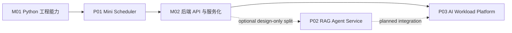
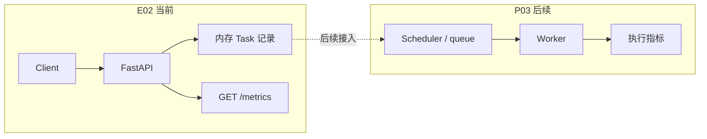
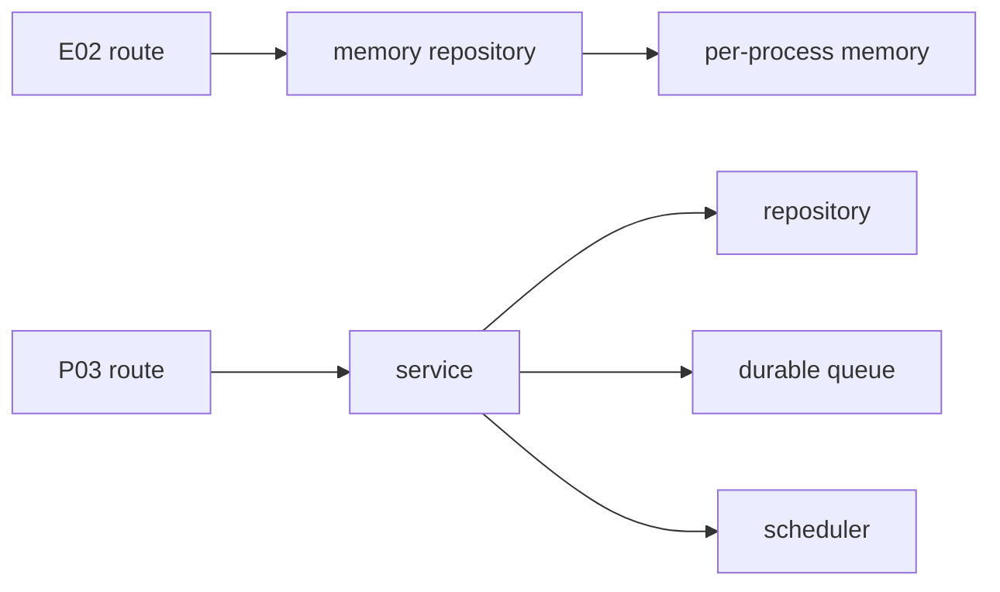
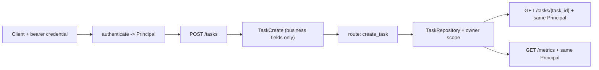

# M02 后端 API 与服务化适配教材

## 编写说明

这份教材服务于当前路线的第二个工程目标：把 P01 Mini Scheduler 的任务模型以及后续 RAG / Agent workload 变成可调用、可测试、可维护的 API 服务。当前工程出口是 P03；P02 保持 `planned/design-only`，只作为未来拆分独立 RAG/Agent 服务的备选设计。

它基于以下优质资料进行改写、重组和项目化适配：

- FastAPI 官方文档：路径操作、请求体、响应模型、状态码、自动文档、测试
- Pydantic 官方文档：BaseModel、字段类型、校验、序列化
- MDN HTTP 文档：请求、响应、方法、状态码的基础语义
- pytest / FastAPI TestClient：接口测试方式

这不是后端开发大全。当前阶段不追求一次学完数据库、完整 OAuth/JWT、消息队列、微服务和部署，
但对象所有权不能留到 RAG/Agent 章节才第一次出现。本模块先建立最小认证上下文和资源授权边界：

```text
能把一个 Python 调度器包装成清楚、可测试、按调用者隔离、可被其他服务调用的 API。
```

对应入口：

- 学习地图：[[10_学习模块/M02_后端API与服务化/M02_后端API与服务化_学习地图]]
- 资料索引：[[20_资料库/模块资料索引/M02_后端API与服务化_资料索引]]
- 当前实验：[[40_实验练习/E02_后端API实验/E02_后端API实验_索引]]
- 关联项目：[[50_项目产出/P02_RAG_Agent_Service/P02_RAG_Agent_Service 项目主页]]、[[50_项目产出/P03_AI_Workload_Platform/P03_AI_Workload_Platform 项目主页]]

## 模块入口

| 入口项 | 本模块口径 |
|---|---|
| 目标读者 | 已完成 M01，或已经能写带类型标注的函数、拆分小型 Python 模块并用 pytest 检查正常和错误路径；不要求已有 Web 后端经验。 |
| 先修知识 | 理解 Python 数据模型、异常和 pytest；能在虚拟环境中安装锁定依赖并阅读 HTTP 状态码。 |
| 第一轮产物 | E02 的 `POST /tasks`、`GET /tasks/{task_id}`、动态 `GET /metrics`，对应 Pydantic 模型、server-owned principal、owner-scoped repository 和 API 契约测试。 |
| 核心路径 | 第 1-7 章建立 HTTP、模型、错误契约、分层和测试能力，第 8-10 章完成文档观察、贯通案例与最小认证授权。 |
| 查阅支线 | 第 11 章安排顺序，第 12 章集中验收，第 13 章提供来源索引；完整 OAuth/JWT、持久队列和生产部署留给后续模块。 |
| 证据边界 | E02 verified reference 通过只证明锁定环境中的参考链路可执行；学习者是否完成另看本人实现、测试输出和失败定位记录。 |
| 建议用时 | 作者侧初步估计 14-18 小时，包含 E02 最小链路和契约测试，不含生产权限与部署。 |

在仓库根目录先检查解释器和 reference 入口是否存在：

```powershell
py -3.13 --version
py -3.13 -c "import json, uuid; print('M02 prerequisite ok')"
Test-Path ".\40_实验练习\E02_后端API实验\e02_service\requirements-dev.lock"
```

第一行应显示 Python 3.13，第二行应输出 `M02 prerequisite ok`，最后一行应为 `True`。随后在 E02 reference 目录创建隔离环境并核对主要依赖：

```powershell
cd ".\40_实验练习\E02_后端API实验\e02_service"
py -3.13 -m venv .venv
.\.venv\Scripts\python.exe -m pip install -r requirements-dev.lock
.\.venv\Scripts\python.exe -c "import fastapi, pydantic, httpx, pytest; print(fastapi.__version__, pydantic.__version__, httpx.__version__, pytest.__version__)"
```

当前锁定输出应为 FastAPI 0.116.1、Pydantic 2.13.4、HTTPX 0.28.1、pytest 8.4.2；Python 边界为 `>=3.13,<3.14`，同时锁定 Uvicorn 0.35.0 和 Starlette 0.47.3。正文按 Pydantic v2 契约编写。锁定版本是 verified reference 的可复现基线，不表示较新版本必然不兼容；升级任一框架后需要重新运行全部契约测试。

本文件的章级内容类型如下：

| 章节 | 类型 | 阅读方式 |
|---|---|---|
| 第 1-10 章 | `instructional` | HTTP/API 概念、worked example、反例、贯通实现与最小资源授权 |
| 第 11、13 章 | `appendix` | 学习导航与来源索引，按需查阅 |
| 第 12 章 | `workbook` | reference 检查与 learner reproduction 验收，二者证据分开记录 |

## 第一轮学习边界

第一轮要学：

- 用 FastAPI 写 `POST /tasks`、`GET /tasks/{task_id}`、`GET /metrics`。
- 用 Pydantic v2 区分请求模型和响应模型、拒绝未知字段，并为错误返回确定稳定口径。
- 用状态码表达创建成功、资源不存在、请求非法等基本语义。
- 用 TestClient 写 API 契约测试，保护字段、状态码和错误路径。
- 理解 route、service、repository 的职责边界；当前 E02 reference 只实现 route + repository，service 是下一步重构目标。
- 从测试用 bearer 凭据形成服务端 `Principal`，让创建、查询和 metrics 使用同一 owner/tenant 边界。
- 区分 401、403、404、422，并用负向测试证明客户端不能覆盖身份、scope 或资源所有权。

暂时不深入：

- 生产级身份提供方、完整 OAuth/JWT、密钥轮换和复杂用户系统。
- 微服务治理、网关、服务发现、限流熔断平台。
- ORM 深度优化、分布式事务、消息队列源码。
- 完整企业后端架构或生产部署安全加固。

---

## 版本、契约与完成口径

本模块以 Python 3.13 和 `40_实验练习/E02_后端API实验/e02_service/` 的锁定依赖为可复现基线。具体版本以该目录的 `pyproject.toml` 和 `requirements-dev.lock` 为准；当前 reference 使用 Pydantic v2，因此正文统一使用 `model_dump()`，不再用已经弃用的 v1 风格 `dict()`。

版本升级和教材学习是两件事。升级 FastAPI、Starlette 或测试客户端后，必须重跑 E02 全部测试，不能因为代码能导入就认定契约仍然成立。

还要区分两类“完成”：

| 类型 | 含义 | 能证明什么 |
|---|---|---|
| verified reference | 仓库提供的 E02 参考实现通过测试 | 教材给出的链路可执行 |
| learner reproduction | 学习者亲手重建或修改实现，并保留自己的测试输出和问题记录 | 学习者已经掌握这条链路 |

reference 通过不能替代 learner reproduction。学习者只有亲手完成“创建 -> 查询 -> 指标变化”和错误路径测试，才能把 M02 标记为本人完成。

---

<!-- textbook-content: default=instructional -->

## 第 1 章：为什么 M02 先学 API

### 1.1 从脚本到服务的差别

M01 里你已经能写一个小型 Python 项目，例如：

```text
输入一批任务 -> 排序 -> 模拟执行 -> 计算指标
```

但脚本有明显限制：

- 只能本地手动运行
- 输入方式不统一
- 别的系统很难调用
- 状态不容易追踪
- 很难让前端、RAG 服务、调度器和监控模块协作

API 的作用是把内部能力变成稳定入口。

例如 P01 的调度能力可以被包装成：

```text
POST /tasks       创建任务
GET /tasks/{task_id}   查询任务状态
GET /metrics      查询系统指标
```

这就是从“会写函数”到“会做服务”的过渡。

> **可迁移的原则**：**API 不是把函数搬到网上，而是在系统之间立一份稳定契约。** 函数调用时，调用者和被调用者通常在同一个进程里，出错了可以看堆栈、改参数、一起调试；API 调用时，客户端只看得到 URL、请求体、状态码和响应体。所以 API 层最重要的能力不是“会写一个路由”，而是让别人不用知道你的内部实现，也能稳定提交任务、查询状态、理解失败原因。
>
> 这条原则会直接迁移到 P03：`POST /tasks` 背后以后可能是内存 mock、数据库任务表、Redis 队列、真实 RAG worker，但客户端不应该跟着内部实现一起改。RAG 请求通过 `task_type=rag_retrieval` 和 `input_json` 表达。**API 的价值就是把内部复杂性包起来，只暴露稳定入口。**

### 1.2 M02 在总路线里的位置



M02 是服务层地基。后面的 RAG、Agent、任务队列、数据库、Docker、监控，都会依赖 API 层把能力暴露出来。

### 1.3 当前阶段的合格线

学完 M02，你不需要成为后端专家，但应该能独立完成：

- 跑起一个 FastAPI 应用
- 写 `POST /tasks`
- 写 `GET /tasks/{task_id}`
- 写 `GET /metrics`
- 用 Pydantic v2 定义请求和响应模型
- 解释为什么 `task_id` 和 UTC `created_at` 必须由服务端生成
- 用 pytest / TestClient 写接口测试
- 能解释 200、201、404、422 这些状态码的基本含义
- 能解释当前 route + repository reference 的边界，以及何时再提取 service

### 1.4 依赖安装后的 60 秒闭环

E02 当前没有 `/health`，因此不虚构一个并不存在的端点。依赖已经安装后，从 reference 目录启动真实应用：

```powershell
cd 40_实验练习\E02_后端API实验\e02_service
python -m uvicorn app.main:app --reload
```

另开一个 PowerShell，创建任务并保留服务端返回：

```powershell
$body = @{
  task_type = "rag_query"
  priority = 2
  estimated_duration_ms = 1500
} | ConvertTo-Json

$response = Invoke-WebRequest `
  -Method Post `
  -Uri "http://127.0.0.1:8000/tasks" `
  -ContentType "application/json" `
  -Body $body

$response.StatusCode
$created = $response.Content | ConvertFrom-Json
$created | ConvertTo-Json
```

第一行应为 `201`。返回体的固定结构是：

```json
{
  "task_id": "由服务端生成的 UUID",
  "task_type": "rag_query",
  "priority": 2,
  "estimated_duration_ms": 1500,
  "status": "pending",
  "created_at": "由服务端生成的带时区 UTC 时间"
}
```

`task_id` 和 `created_at` 每次都会变化，不能把示例值写成断言。继续查询刚创建的任务：

```powershell
$queried = Invoke-RestMethod `
  -Method Get `
  -Uri "http://127.0.0.1:8000/tasks/$($created.task_id)"

$queried | ConvertTo-Json
```

查询结果应与创建结果表达同一条任务记录。这个 POST 后紧接 GET 的链路，才是 M02 的最小服务闭环。

---

## 第 2 章：REST 和资源建模

### 2.0 本章目标与前置

完成本章后，给你一组业务需求，你应能先识别**资源集合、单个资源和动作边界**，再选择
method、path 与预期状态码，而不是从函数名直接拼 URL。

开始前请确认你已经能解释 M00 第 7 章中的 HTTP 请求四要素，并能区分 `GET` 与 `POST`。
本章只设计契约，不要求启动 FastAPI；当前可实现范围仍是 `task` 和 `metrics`。

先做一个预测：下面三个需求中，哪些是在“创建/读取资源”，哪个更像尚未实现的业务动作？

1. 提交一个新任务。
2. 查询编号为 `t-001` 的任务。
3. 取消编号为 `t-001` 的任务。

先写下你的 method + path，再继续读 2.1-2.5。第三项没有唯一的通用答案，它取决于系统把
取消建模为删除、状态更新还是显式动作；本章只要求你能说明选择及其副作用。

### 2.1 API 不是随便起 URL

API 设计的核心不是“URL 看起来像不像”，而是你有没有把系统里的对象抽象成资源。

P03 AI Workload Platform 里最重要的资源包括：

| 资源 | 含义 | 可能的 API |
|---|---|---|
| task | 用户提交的任务 | `POST /tasks`、`GET /tasks/{task_id}` |
| worker | 后续执行任务的主体 | 当前 E02 不公开 worker 集合；P03 另行定义受控操作端点 |
| metrics | 系统运行指标 | `GET /metrics` |
| document | RAG 文档 | `POST /documents`、`GET /documents/{id}` |
| run | 一次 RAG/Agent 执行 | `POST /runs`、`GET /runs/{id}` |

当前 M02 只实现 `task` 和 `metrics`。曾经存在的空 `GET /workers` stub 不属于教学合格线，
也不能说明 worker 资源已经建模，因此已从 E02 reference 删除。

### 2.2 方法的直觉

| HTTP 方法 | 当前理解 | P03 示例 |
|---|---|---|
| GET | 读取资源 | 查询任务状态 |
| POST | 创建资源或触发动作 | 创建任务 |
| PUT / PATCH | 更新资源 | 修改任务优先级 |
| DELETE | 删除资源 | 取消任务或删除文档 |

当前阶段先掌握 GET 和 POST。

### 2.3 为什么 `POST /tasks` 而不是 `POST /create_task`

`/tasks` 表示任务资源集合，`POST /tasks` 表示向任务集合里创建一个新任务。

这比 `/create_task` 更容易扩展：

```text
POST /tasks        创建任务
GET /tasks         列出任务
GET /tasks/{task_id}    查询单个任务
DELETE /tasks/{task_id} 取消任务
```

你不用一开始把 REST 学成宗教，但要养成资源建模的习惯。

### 2.3b 从需求到契约：固定案例

对本章开头的前两个需求，按四步推导：

| 步骤 | 提交任务 | 查询任务 |
|---|---|---|
| 找名词 | task | task |
| 判断集合/单项 | 向集合新增成员 | 读取一个已知成员 |
| 选择 method + path | `POST /tasks` | `GET /tasks/t-001` |
| 判定成功结果 | `201`，响应含服务端生成的 ID | `200`；不存在时 `404` |

这里最重要的中间状态是“集合还是单项”。它能阻止两个常见错误：把创建写成
`POST /tasks/t-001`，让客户端控制服务端 ID；或把查询写成 `GET /tasks` 却没有稳定的筛选契约。

`metrics` 是一个有意保留的语义例外。它是服务观测结果，不是 E02 中可创建、修改的普通实体，
因此只提供 `GET /metrics`。资源建模是让契约可预测的工具，不是要求每个端点都机械套用 CRUD。

### 2.3c 反例：URL 能工作，不等于契约清楚

下面的设计可能被框架接受，但会让调用方难以预测：

<!-- textbook-code: role=counterexample -->
```text
POST /create_task
GET  /get_task?task_id=t-001
POST /tasks/t-001/cancel_and_notify
```

问题不在“URL 里绝对不能出现动词”，而在于三个端点各自发明命名规则，并把取消与通知两个
副作用绑在同一个名字里。修复时先回到资源和状态：创建、查询仍用 `/tasks`；取消则在明确
幂等性、允许状态和返回体后，再选择 `DELETE /tasks/{id}`、`PATCH /tasks/{id}` 或受控动作端点。
回归检查是：只看 API 表，调用方能否推断集合/单项、成功状态码，以及重复请求的影响。

### 2.4 从 E02 当前边界到 P03 后续链路



实线部分是 E02 当前可执行范围；虚线只表示未来演进方向。API 层先接住外部请求，把请求转成
内部记录并返回稳定结果。调度、worker 和执行指标属于 P03/M06，不是这张图对 E02 的完成声明。

### 2.5 独立练习与验收

为“文档入库与查询”写一张契约表，至少包含下面三项，但不要写实现代码：

- 创建文档；
- 查询单个文档；
- 启动一次基于文档集合的 RAG run。

产物写到你的学习记录 `m02_ch02_resource_contract.md`，每行包含：业务需求、资源、集合/单项、
method、path、成功状态码、一个失败状态码、是否会产生副作用。然后再做迁移题：为“重试一次
失败的 run”提出两种设计，比较显式动作端点与创建新 attempt 资源的取舍。

验收时逐项检查：

1. path 使用稳定名词且集合名统一为复数；
2. 客户端没有在创建请求的 path 或 body 中控制服务端生成的资源 ID；
3. `GET` 不承担创建、取消或重试副作用；
4. 对取消/重试这类非 CRUD 动作，明确允许状态、重复调用语义和失败响应；
5. 没有把 E02 尚未实现的 document/run 端点写成“已可运行”。

### 本章来源

- [RFC 9110: HTTP Semantics, Methods](https://www.rfc-editor.org/rfc/rfc9110.html#name-methods)：
  method 语义、安全方法与幂等性的规范依据。
- [Azure REST API Guidelines: Uniform Resource Locators](https://github.com/microsoft/api-guidelines/blob/vNext/azure/Guidelines.md#uniform-resource-locators-urls)：
  资源 path 与集合命名的官方工程指南。
- [Azure REST API Guidelines: HTTP request/response pattern](https://github.com/microsoft/api-guidelines/blob/vNext/azure/Guidelines.md#http-request--response-pattern)：
  method、请求/响应与状态码的直接入口。
- [Azure REST API Guidelines: Performing an action](https://github.com/microsoft/api-guidelines/blob/vNext/azure/Guidelines.md#performing-an-action)：
  非 CRUD 动作的建模入口；用于比较取舍，不代表 E02 已实现动作端点。
- [MDN HTTP response status codes](https://developer.mozilla.org/en-US/docs/Web/HTTP/Reference/Status)：
  本章 `200`、`201`、`404` 等状态码的查阅入口。

### 本章小结与下一步

资源建模的主线是“需求 -> 名词 -> 集合/单项 -> method + path -> 状态码与副作用”。下一章会把
创建资源所需的外部输入与服务端生成字段拆成请求体和响应体；第 4 章再用 Pydantic 固化边界。

---

## 第 3 章：请求体和响应体

### 3.1 请求体是什么

当客户端创建任务时，需要把任务信息发给服务端：

```json
{
  "task_type": "rag_query",
  "priority": 2,
  "estimated_duration_ms": 1500
}
```

这就是请求体。客户端只能提交创建任务所需的业务输入，不能提交 `task_id`、`status` 或 `created_at`。

### 3.2 响应体是什么

服务端处理后返回：

```json
{
  "task_id": "550e8400-e29b-41d4-a716-446655440000",
  "task_type": "rag_query",
  "priority": 2,
  "estimated_duration_ms": 1500,
  "status": "pending",
  "created_at": "2026-07-11T08:30:00+00:00"
}
```

这就是响应体。示例中的 UUID 和时间只是格式展示，真实值必须由服务端每次生成。

关键区别：

| 类型 | 谁发送 | 作用 |
|---|---|---|
| 请求体 | 客户端 -> 服务端 | 告诉服务端要创建什么 |
| 响应体 | 服务端 -> 客户端 | 告诉客户端处理结果是什么 |

### 3.3 为什么请求模型和响应模型不要混用

创建任务时，客户端不应该自己传 `task_id`、`status` 和 `created_at`。否则客户端可以伪造资源身份、任务状态或服务端接收时间。

所以请求模型可以是：

```python
from pydantic import BaseModel, ConfigDict, Field


class TaskCreate(BaseModel):
    model_config = ConfigDict(extra="forbid")

    task_type: str = Field(min_length=1, max_length=64, pattern=r"^[a-z][a-z0-9_]*$")
    priority: int = Field(default=5, ge=1, le=10)
    estimated_duration_ms: int = Field(ge=0, le=86_400_000)
```

响应模型可以是：

```python
from datetime import datetime
from enum import StrEnum


class TaskStatus(StrEnum):
    PENDING = "pending"
    QUEUED = "queued"
    RUNNING = "running"
    SUCCEEDED = "succeeded"
    FAILED = "failed"
    RETRYING = "retrying"
    CANCELLED = "cancelled"


class TaskRecord(BaseModel):
    model_config = ConfigDict(extra="forbid")

    task_id: str
    task_type: str
    priority: int
    estimated_duration_ms: int
    status: TaskStatus
    created_at: datetime
```

### 3.4 在项目里的使用场景

E02 中，`TaskCreate` 是外部输入，`TaskRecord` 是系统保存并返回的记录。二者边界清楚，后面接数据库、队列、监控时才不容易混乱。

> **可迁移的原则**：**请求模型描述“客户端允许提出什么”，响应模型描述“系统承诺返回什么”，两者不能混成一个对象。** 如果你让客户端提交 `id/status/started_at/finished_at`，等于把系统内部状态的控制权交给外部；如果响应里缺少 `task_id/status/error_type/metrics`，客户端又无法追踪任务。
>
> P03 的契约会更明显：`POST /tasks` 的顶层只接受任务类型、优先级、预计耗时、幂等键和 `input_json`；RAG 的 `query/top_k` 位于 `input_json`，tenant、user、permission groups 由服务端 principal 注入。响应返回 task 与 `created_new`。后面的 M06 会负责状态流转，M08 会负责延迟指标，M03 会负责 RAG 结果。**M02 要先把输入和输出边界守住，后面的模块才不会互相污染。**

### 3.5 UTC 时间、模拟时间和时长单位不能混用

E02 API 与 P01 调度模拟器使用的时间不是同一种语义：

| 字段 | 所属边界 | 语义 |
|---|---|---|
| `created_at` | E02 API | 服务端收到请求时生成的带时区 UTC 墙上时间 |
| `submit_time` | P01 模拟器 | 实验时间轴上的模拟提交时刻，不由外部客户端控制 |
| `estimated_duration_ms` | E02 API | 对外契约中的整数毫秒 |
| `estimated_duration` | P01 模拟器 | 调度计算使用的秒数 |

当前 E02 只保存 API 记录，还没有接入 P01，因此不要在 route 中偷偷制造 `submit_time`。未来提取 service 并连接 P01 时，应在一个明确的转换函数里完成单位转换，例如 `estimated_duration = estimated_duration_ms / 1000`，同时由调度系统决定模拟时间口径。**字段名字相似不代表语义相同，时间和单位必须在系统边界显式转换。**

---

## 第 4 章：Pydantic 模型

### 4.0 本章目标与前置

完成本章后，你应能根据一张正负输入矩阵判断 `TaskCreate` 接受什么、拒绝什么，并能从
`ValidationError` 定位到具体字段和约束。开始前需要读完第 3 章，能区分客户端输入字段与
服务端生成字段；运行示例需要 Python 3.13 和 E02 锁定的 Pydantic 2.x 环境。

### 4.1 Pydantic 解决什么问题

Pydantic 负责把外部数据变成有结构、有类型、有约束的 Python 对象。

没有 Pydantic 时，你可能要自己写：

<!-- textbook-code: role=fragment env=python-3.13 network=off -->
```python
if "estimated_duration_ms" not in data:
    raise ValueError("missing estimated_duration_ms")
if data["priority"] < 1:
    raise ValueError("priority must be positive")
```

有 Pydantic 后，这些基础校验可以集中在模型里。

### 4.2 字段约束

<!-- textbook-code: role=fragment env=python-3.13 network=off -->
```python
from pydantic import BaseModel, ConfigDict, Field


class TaskCreate(BaseModel):
    model_config = ConfigDict(extra="forbid")

    task_type: str = Field(min_length=1, max_length=64, pattern=r"^[a-z][a-z0-9_]*$")
    priority: int = Field(default=5, ge=1, le=10)
    estimated_duration_ms: int = Field(ge=0, le=86_400_000)
```

含义：

| 字段 | 约束 | 作用 |
|---|---|---|
| `task_type` | 小写字母开头，只允许小写字母、数字和下划线，最长 64 | 拒绝空白、空字符串和不稳定命名 |
| `priority` | 1 到 10 | 控制优先级范围 |
| `estimated_duration_ms` | 0 到 86400000 毫秒 | 允许零耗时模拟，拒绝负数和异常大值 |

### 4.3 Pydantic v2：未知字段、类型转换和严格模式

`ConfigDict(extra="forbid")` 是 E02 契约的一部分。没有它时，Pydantic 默认会忽略未知字段；客户端误传 `submit_time`，请求可能仍然成功，调用方也不知道自己的字段根本没有生效。启用 `extra="forbid"` 后，未知字段会使 FastAPI 返回 422。

另一个容易误解的边界是类型转换。Pydantic 默认采用可转换模式，例如字符串 `"2"` 可能被转换为整数 `2`。这不等于类型检查失效，而是默认契约允许合理转换：

<!-- textbook-code: role=fragment env=python-3.13 network=off -->
```python
payload = TaskCreate.model_validate(
    {
        "task_type": "rag_query",
        "priority": "2",
        "estimated_duration_ms": 1500,
    }
)
assert payload.priority == 2
```

当前 E02 reference 保留这种默认行为，因此测试不能声称它会拒绝所有数字字符串。如果业务契约必须拒绝任何转换，应显式使用严格字段，并新增对应测试：

<!-- textbook-code: role=fragment env=python-3.13 network=off -->
```python
priority: int = Field(default=5, ge=1, le=10, strict=True)
```

最后，Pydantic v2 把模型转换为字典时使用 `model_dump()`：

<!-- textbook-code: role=fragment env=python-3.13 network=off -->
```python
data = payload.model_dump()
```

旧教程里的 `payload.dict()` 已弃用，不应继续作为本模块主写法。

### 4.3b 用正负输入矩阵验证真实契约

不要只盯着模型声明猜行为。下面固定八类输入，逐个执行模型校验，并检查成功值或失败字段：

| case | 相对基线的唯一变化 | 预期 |
|---|---|---|
| `valid` | 无 | 接受，priority 为 2 |
| `default_priority` | 删除 priority | 接受，priority 为 5 |
| `coerced_priority` | priority 改为字符串 `"2"` | 接受并转换为整数 2 |
| `extra_field` | 增加 `submit_time` | 拒绝，定位 `submit_time` |
| `bad_task_type` | task_type 改为 `RAG Query` | 拒绝，定位 `task_type` |
| `priority_zero` | priority 改为 0 | 拒绝，定位 `priority` |
| `negative_duration` | duration 改为 -1 | 拒绝，定位 `estimated_duration_ms` |
| `missing_duration` | 删除 duration | 拒绝，定位 `estimated_duration_ms` |

<!-- textbook-code: role=runnable env=python-3.13 network=off -->
```python
from copy import deepcopy

from pydantic import BaseModel, ConfigDict, Field, ValidationError


class TaskCreate(BaseModel):
    model_config = ConfigDict(extra="forbid")

    task_type: str = Field(min_length=1, max_length=64, pattern=r"^[a-z][a-z0-9_]*$")
    priority: int = Field(default=5, ge=1, le=10)
    estimated_duration_ms: int = Field(ge=0, le=86_400_000)


baseline = {
    "task_type": "rag_query",
    "priority": 2,
    "estimated_duration_ms": 1500,
}

cases: dict[str, tuple[dict[str, object], str | None]] = {}
cases["valid"] = (deepcopy(baseline), None)

default_priority = deepcopy(baseline)
del default_priority["priority"]
cases["default_priority"] = (default_priority, None)

coerced_priority = deepcopy(baseline)
coerced_priority["priority"] = "2"
cases["coerced_priority"] = (coerced_priority, None)

extra_field = deepcopy(baseline)
extra_field["submit_time"] = 0
cases["extra_field"] = (extra_field, "submit_time")

bad_task_type = deepcopy(baseline)
bad_task_type["task_type"] = "RAG Query"
cases["bad_task_type"] = (bad_task_type, "task_type")

priority_zero = deepcopy(baseline)
priority_zero["priority"] = 0
cases["priority_zero"] = (priority_zero, "priority")

negative_duration = deepcopy(baseline)
negative_duration["estimated_duration_ms"] = -1
cases["negative_duration"] = (negative_duration, "estimated_duration_ms")

missing_duration = deepcopy(baseline)
del missing_duration["estimated_duration_ms"]
cases["missing_duration"] = (missing_duration, "estimated_duration_ms")

for name, (data, expected_error_field) in cases.items():
    try:
        task = TaskCreate.model_validate(data)
    except ValidationError as exc:
        actual_field = str(exc.errors()[0]["loc"][0])
        assert actual_field == expected_error_field
        print(f"{name}: rejected at {actual_field}")
    else:
        assert expected_error_field is None
        assert isinstance(task.priority, int)
        print(f"{name}: accepted priority={task.priority}")
```

<!-- textbook-code: role=output -->
```text
valid: accepted priority=2
default_priority: accepted priority=5
coerced_priority: accepted priority=2
extra_field: rejected at submit_time
bad_task_type: rejected at task_type
priority_zero: rejected at priority
negative_duration: rejected at estimated_duration_ms
missing_duration: rejected at estimated_duration_ms
```

矩阵刻意让每个失败 case 只改变一个条件。否则一次同时传错三个字段，即使拿到 422，也无法
证明究竟是哪条约束生效。真实 HTTP 层会把这些模型错误转换为 422；模型层示例先隔离网络与
框架，专门验证输入契约。

### 4.4 Pydantic 不是业务逻辑的全部

Pydantic 适合做输入结构校验，但不应该承担全部业务规则。

例如：

- 字段是否存在：适合 Pydantic
- priority 是否在范围内：适合 Pydantic
- 当前用户是否有权限创建高优先级任务：未来更适合 service 层
- 当前队列是否已满：未来更适合 service 层

> **可迁移的原则**：**Pydantic 负责“形状正确”，service 层负责“业务上允许”。** `priority` 是不是整数、`top_k` 是否大于 0，这是输入形状；某个用户能不能访问某个 `collection_id`，当前队列是否还能接任务，某个任务能不能从 `running` 取消，这是业务判断。把业务判断塞进模型，会让模型越来越难复用，也会让错误原因变得模糊。
>
> 当前 E02 还没有 `service.py`，route 直接生成 ID 和时间并调用 repository。这是可执行的第一版，不是假装已经分层完成。到 P03 时再提取 service：Pydantic 拦住 `top_k=-1`、`query=""` 这类无效输入；service 判断权限、任务是否可以入队、状态流转是否合法。

### 4.5 当前阶段怎么用

先做到：

- 每个请求体都有模型
- 每个重要响应有模型
- 字段有最小约束
- 未知字段按契约拒绝
- 状态字段使用 `TaskStatus`，不接受任意字符串
- 需要字典时使用 `model_dump()`，不把无约束 dict 到处传

暂时不深入：

- 高级 validator
- 自定义序列化
- 复杂嵌套模型
- Pydantic Settings

### 4.6 反例、练习与验收

反例是把“能被转换”误写成“严格类型正确”。当前模型会接受字符串 `"2"`，所以测试若断言
它必须返回 422，会与实现契约冲突。修复有两条路：保留转换并把它写进矩阵；或把字段改为
`strict=True`，同时更新 API 测试和调用方。不能只改教材结论。

独立练习：复制上面的矩阵，但不要复制循环实现；把 `priority` 改为严格整数，并新增布尔值
`True`、浮点数 `2.0` 和字符串 `"2"` 三个变式。先预测，再运行。产物保存为
`m02_ch04_validation_matrix.py` 和一份实际输出。迁移题是给 `task_type` 增加你自己的两个边界
case，其中至少一个必须是 64/65 字符长度边界，而不是继续重复空字符串。

验收标准：所有 case 名唯一；每个负例只改变一个条件；成功 case 检查转换后的值与类型；
失败 case 检查 `errors()[0]["loc"]`，而不是只写“抛异常即可”；实际输出与预测不同时，在记录中
说明是修改模型还是修改契约。运行命令：

```powershell
python .\m02_ch04_validation_matrix.py
```

若出现 `ModuleNotFoundError: No module named 'pydantic'`，先确认已激活 E02 `.venv`，再按
E02 README 的锁定依赖命令重建环境；不要用全局随意升级来掩盖环境漂移。

### 本章来源

- [Pydantic Models](https://docs.pydantic.dev/latest/concepts/models/)：`model_validate()`、
  `model_dump()` 与模型配置。
- [Pydantic Fields](https://docs.pydantic.dev/latest/concepts/fields/)：字段约束与 strict 参数。
- [Pydantic Strict Mode](https://docs.pydantic.dev/latest/concepts/strict_mode/)：转换模式和严格模式边界。
- [FastAPI Request Body](https://fastapi.tiangolo.com/tutorial/body/)：Pydantic 模型如何进入 HTTP 请求体校验。

### 本章小结与下一步

模型声明只是契约的一半，正负输入矩阵才让接受、转换和拒绝行为可观察。下一章把模型失败映射
为 422，并区分客户端错误、资源不存在和未处理的服务端错误。

---

## 第 5 章：状态码和错误处理

### 5.1 状态码是接口契约的一部分

状态码告诉客户端请求结果是什么类型。

当前阶段先掌握：

| 状态码 | 含义 | 场景 |
|---|---|---|
| 200 | 成功 | 查询任务成功 |
| 201 | 已创建 | 创建任务成功 |
| 404 | 找不到资源 | 查询不存在的任务 |
| 422 | 请求数据不合法 | 字段类型或约束不满足 |
| 500 | 服务端错误 | 未处理异常 |

### 5.2 创建任务为什么用 201

`POST /tasks` 创建了一个新任务，所以更合适返回 201。

```python
from fastapi import status


@app.post("/tasks", response_model=TaskRecord, status_code=status.HTTP_201_CREATED)
def create_task(task: TaskCreate):
    ...
```

### 5.3 找不到任务为什么用 404

```python
from fastapi import HTTPException


@app.get("/tasks/{task_id}", response_model=TaskRecord)
def get_task(task_id: str):
    task = repository.get(task_id)
    if task is None:
        raise HTTPException(status_code=404, detail="task_not_found")
    return task
```

E02 当前把未知任务的错误口径固定为：

```json
{"detail": "task_not_found"}
```

测试应同时断言 404 和这个响应体，避免客户端被无意改变的错误格式破坏。

### 5.4 不要吞掉错误

坏例子：

```python
try:
    task = TASKS[task_id]
except Exception:
    return {}
```

这样客户端不知道发生了什么。

更好的做法是明确返回错误状态和说明。

> **可迁移的原则**：**错误也是 API 契约的一部分；失败时返回得越含糊，系统越难调试、越难监控。** `return {}` 看起来让接口“没崩”，实际上客户端不知道是任务不存在、输入错误、worker 失败，还是队列异常。一个成熟的任务 API 必须把失败分类说清楚。
>
> P03 里要逐步形成稳定错误口径：`invalid_input` 表示请求参数错，`empty_result` 表示 RAG 没检索到内容，`tool_timeout` 表示 Agent 工具超时，`worker_error` 表示 worker 执行失败。M06 会把这些错误写回任务状态，M08 会统计错误率；如果 M02 一开始就吞错误，后面的监控和实验记录都会失真。

### 5.5 踩坑现场：为什么 `return {}` 很危险

假设你写了一个查询任务接口：

```python
@app.get("/tasks/{task_id}")
def get_task(task_id: str):
    try:
        return TASKS[task_id]
    except Exception:
        return {}
```

手工点 `/docs` 时，它好像“能返回东西”，但真正的问题被盖住了：

| 真实情况 | 客户端看到 | 后果 |
|---|---|---|
| task_id 不存在 | `{}` | 前端不知道该显示“任务不存在”还是“还没完成” |
| TASKS 结构坏了 | `{}` | 服务端 bug 被伪装成空结果 |
| 后续接数据库失败 | `{}` | M08 统计不到错误率 |

理解机制的人会这样判断：HTTP 状态码本来就是给客户端区分结果类型的，不能用空对象代替错误类型。这个接口至少应该把“找不到任务”写成 404：

```python
@app.get("/tasks/{task_id}", response_model=TaskRecord)
def get_task(task_id: str):
    task = repository.get(task_id)
    if task is None:
        raise HTTPException(status_code=404, detail="task_not_found")
    return task
```

第一轮不要求你设计完整错误体系，但必须养成这个习惯：**已知的业务失败要变成明确状态码，未知异常要暴露给日志和测试，而不是被 `{}` 吃掉。**

---

## 第 6 章：项目分层

### 6.1 为什么不能把所有逻辑写在路由里

路由函数应该处理 HTTP 输入输出，不应该承担全部业务逻辑。

坏例子：

```python
@app.post("/tasks")
def create_task(task: TaskCreate):
    # 校验
    # 生成 id
    # 写入存储
    # 调度
    # 统计指标
    # 返回响应
    pass
```

这会让函数越来越大，测试也越来越难。

### 6.2 E02 reference 当前实际结构

```text
e02_service/
  app/
    __init__.py
    main.py          创建 app、声明 route、生成 ID 和 UTC 时间
    models.py        Pydantic 请求/响应模型和 TaskStatus
    repository.py    同一进程内线程安全的临时内存存储与 metrics 聚合
  tests/
    test_api.py
```

当前没有 `routes.py`、`schemas.py` 或 `services.py`。这不是文件缺失，而是第一版有意保持较小：route 只做少量编排，repository 封装存储。教材不能把未来设计图写成已经完成的实现。

### 6.3 每层职责

| 层 | 长期责任 | E02 当前状态 |
|---|---|---|
| route | 接收 HTTP 请求，返回 HTTP 响应 | 位于 `main.py` |
| API schema | 定义请求体和响应体 | 位于 `models.py` |
| service | 创建任务、授权、入队、状态流转 | 尚未提取 |
| repository | 保存和读取任务、聚合当前状态 | 已实现内存版本 |
| domain model | 调度系统内部业务对象 | 继续使用 P01 模型，尚未接入 E02 |

> **可迁移的原则**：**分层不是为了显得专业，而是为了让实现可以替换、测试可以隔离、复杂度可以长大。** 如果路由函数同时生成 id、写存储、跑调度、算指标，第一版确实省事；但一旦内存存储换数据库、同步执行换异步 worker、RAG mock 换真实检索，整个路由都会被迫重写。
>
> P03 v0.1 可以很克制：repository 先用内存实现，service 再模拟入队，worker 先 mock RAG/Agent。后面 M06 把内存换成数据库、M07 用 Docker 启动多个服务、M08 加 metrics 时，改的是某一层实现，不是把 API 从头拆开。

### 6.4 当前链路与下一步目标



只有在 route 开始承担下列规则时，才需要提取 service：

- 需要从认证上下文取得 `owner_id` / `tenant_id`。
- 需要判断队列容量、状态流转或重试资格。
- 需要把 API 毫秒转换成 P01 调度模型的秒。
- 需要同时协调 repository、队列和 worker。

因此 M02 第一轮的验收是“能解释并保持边界”，不是“必须为了分层而制造空文件”。

---

## 第 7 章：接口测试

### 7.1 本章目标与前置

前置：已完成第 3-5 章的请求/响应、Pydantic 和状态码；E02 reference 环境能够导入
`fastapi.testclient.TestClient`。完成后应能用单变量负例保护状态码、字段、边界和状态变化。

API 必须测试，因为它很容易出现这些问题：

- 状态码错了
- 返回字段变了
- 错误情况没处理
- 请求体校验失效
- 改了模型后忘记更新接口

接口测试的目标是保护契约。

> **可迁移的原则**：**API 测试不是测“函数有没有跑”，而是测“契约有没有被破坏”。** 你改了内部实现，只要 `POST /tasks` 仍然返回 201、响应里仍然有 `task_id/status`，客户端就不需要改；反过来，哪怕业务逻辑还能跑，只要字段名、状态码或错误格式悄悄变了，对外契约就坏了。
>
> 所以 M02 的测试要优先覆盖契约边界：成功创建任务、非法输入返回 422、找不到任务返回 404、`GET /metrics` 返回必要指标。到 P03 时，同一套思想会扩展成：`POST /tasks` 以 `task_type=rag_retrieval` 创建 RAG task，`GET /tasks/{task_id}` 能查到状态、错误和 metrics。测试守住这些入口，后面才能放心接 M06/M08。

### 7.2 踩坑现场：只测成功路径为什么不够

很多人第一版只写这个测试：

```python
def test_create_task():
    response = client.post("/tasks", json={
        "task_type": "rag_query",
        "priority": 2,
        "estimated_duration_ms": 1500,
    })
    assert response.status_code == 201
```

它能证明“正常输入能创建任务”，但保护不了 API 契约。因为下面这些改坏方式，它都发现不了：

- 少返回了 `status`
- 把 `task_id` 改名成 `id`
- 客户端伪造 `created_at` 时没有返回 422
- 非法 `estimated_duration_ms=-1` 没有返回 422
- 查询不存在任务没有返回 404

所以接口测试至少要覆盖三类路径：

| 路径 | 要验证什么 |
|---|---|
| 成功路径 | 状态码、关键字段、字段含义 |
| 输入错误 | Pydantic 是否拦住，是否返回 422 |
| 资源不存在 | 是否返回 404，而不是 `{}` 或 200 |

这也是为什么测试不是“多写几行麻烦代码”，而是在给后面的重构买保险。M06 把内存换数据库、M08 加 metrics、P03 接 RAG worker 时，你会频繁改内部实现；只要测试守住契约，你就知道外部入口没有被改坏。

### 7.3 最小 TestClient

```python
from fastapi.testclient import TestClient
from app.main import app

client = TestClient(app)
```

E02 当前没有 lifespan 初始化，所以模块级 client 可以工作。未来如果 app 增加启动/关闭逻辑，应使用上下文管理器，确保 lifespan 真正执行：

```python
with TestClient(app) as client:
    response = client.get("/metrics")
```

### 7.4 Worked example：测试创建任务

```python
from datetime import datetime, timedelta
from uuid import UUID


def test_create_task():
    response = client.post("/tasks", json={
        "task_type": "rag_query",
        "priority": 2,
        "estimated_duration_ms": 1500,
    })

    assert response.status_code == 201
    payload = response.json()
    assert payload["status"] == "pending"
    assert payload["task_type"] == "rag_query"
    assert payload["estimated_duration_ms"] == 1500
    UUID(payload["task_id"])

    created_at = datetime.fromisoformat(payload["created_at"])
    assert created_at.tzinfo is not None
    assert created_at.utcoffset() == timedelta(0)
```

### 7.5 测试错误输入

```python
def test_create_task_rejects_invalid_duration():
    response = client.post("/tasks", json={
        "task_type": "rag_query",
        "priority": 1,
        "estimated_duration_ms": -1,
    })

    assert response.status_code == 422
```

每个失败测试只放一个无效条件。下面这个测试专门证明未知字段被拒绝，不要同时再放非法 priority：

```python
def test_create_task_rejects_client_controlled_created_at():
    response = client.post("/tasks", json={
        "task_type": "rag_query",
        "priority": 2,
        "estimated_duration_ms": 1500,
        "created_at": "2020-01-01T00:00:00+00:00",
    })

    assert response.status_code == 422
```

### 7.6 当前阶段至少测什么

- 创建任务成功
- 服务端生成不同的 UUID 和带时区 UTC `created_at`
- 缺少 `estimated_duration_ms` 时返回 422
- 负 `estimated_duration_ms` 返回 422
- 客户端提交 `submit_time`、`created_at` 或其他未知字段时返回 422
- 查询不存在任务返回稳定的 `404 + {"detail": "task_not_found"}`
- 创建后能查询同一条任务
- 创建前后 metrics 的 `task_count` 和 `pending` 计数按预期变化

### 7.7 机器可判定的契约矩阵

| 契约 | 固定输入 | 必须断言 |
|---|---|---|
| 初始指标 | 空 repository 后 `GET /metrics` | 200，`task_count == 0` |
| 创建成功 | 合法 `TaskCreate` | 201、固定字段集合、`pending` |
| 服务端身份与时间 | 连续创建两次 | UUID 均合法且不同；时间有 UTC offset |
| 未知字段 | 只增加 `submit_time` | 422 |
| 数值边界 | 只把 priority 改为 0 | 422 |
| 时长边界 | 只把毫秒时长改为 -1 | 422；0 可以成功 |
| 创建后查询 | 用创建响应的 `task_id` GET | 200，响应记录一致 |
| 未知任务 | `GET /tasks/not-found` | 404，错误体完全一致 |
| 累计指标 | 创建一条 pending 任务后 GET metrics | `task_count == 1`、`pending == 1` |

reference 现在把每个失败请求限制为一个无效条件；参数化用例分别覆盖两个未知字段和两个
priority 边界。运行本章 reference：

```powershell
cd 40_实验练习\E02_后端API实验\e02_service
python -m pytest tests/test_api.py -q
```

当前预期摘要是 `11 passed`；加上下一章 OpenAPI 契约测试后，全套为 `12 passed`。其中新增
用例覆盖认证、scope、伪造身份字段、跨 owner 404 和 owner-scoped metrics。学习者
复现时应逐行覆盖上表并保存自己的测试输出；用例数量可以不同，但九行契约不能靠一次手工点
`/docs` 代替。

### 7.8 独立变式与验收

不要复制 reference 的输入。分别提交三个请求，每个请求只放一个新错误：

1. `task_type="RAG_Query"`，验证大写字母违反当前 canonical pattern。
2. `estimated_duration_ms=86_400_001`，验证时长上界。
3. 在合法请求中只增加未知字段 `owner_id`，验证客户端不能扩张 schema。

验收：三个响应都为 422；删除任一对应字段约束后，至少有一个测试必须失败。测试结束后
autouse fixture 应清空 repository，后续 `GET /metrics` 仍从 `task_count == 0` 开始。

### 7.9 本章来源

- [FastAPI：Testing](https://fastapi.tiangolo.com/tutorial/testing/)：核对 `TestClient`、普通
  pytest 测试函数和请求断言的官方用法。
- [pytest：How to parametrize](https://docs.pytest.org/en/stable/how-to/parametrize.html)：核对
  同一契约使用不同单变量输入的参数化方式。
- [Starlette TestClient](https://www.starlette.io/testclient/)：核对 lifespan 存在时应使用
  context manager；本章 E02 当前没有 lifespan。

### 7.10 本章小结与下一步

接口测试保护的是状态码、schema、错误体和状态变化，不是内部函数名。下一章直接读取
`/openapi.json`，确认自动文档与这些测试保护的是同一份契约。

---

## 第 8 章：OpenAPI 自动文档

### 8.1 本章目标与前置

前置：已完成第 7 章契约矩阵，并能运行 E02 `TestClient`。完成后应能从 `/openapi.json`
定位路径、响应、required 字段和数值约束，而不是只会打开 `/docs`。

FastAPI 自动文档有什么用：

FastAPI 会根据路径操作、Pydantic 模型和类型标注生成接口文档。

这对你很重要，因为：

- 可以直接在浏览器里调试接口
- 可以检查请求体和响应体结构
- 可以作为 README 的接口说明草稿
- 可以帮助你发现字段命名不一致

### 8.2 当前阶段怎么用

启动服务后，重点看：

```text
/docs
/openapi.json
```

你不需要深入 OpenAPI 规范，只需要会利用自动文档检查接口。

### 8.3 好的文档来自好的模型

如果 Pydantic 模型字段混乱，自动文档也会混乱。

所以文档质量不是额外工作，它来自你是否认真定义了请求和响应模型。

### 8.4 Worked example：不用浏览器检查 OpenAPI 契约

浏览器 `/docs` 适合观察，机器验收应直接读取 `/openapi.json`。下面的固定示例使用 E02
reference，不启动网络服务：

<!-- textbook-code: role=runnable env=python-3.13 network=off -->
```python
from fastapi.testclient import TestClient

from app.main import app


schema = TestClient(app).get("/openapi.json").json()
paths = sorted(schema["paths"])
post_responses = sorted(schema["paths"]["/tasks"]["post"]["responses"])
forbid_extra = schema["components"]["schemas"]["TaskCreate"][
    "additionalProperties"
]

print(schema["info"]["title"], schema["info"]["version"])
print(paths)
print(post_responses)
print(forbid_extra)
```

<!-- textbook-code: role=output -->
```text
E02 Task API 0.1.0
['/metrics', '/tasks', '/tasks/{task_id}']
['201', '422']
False
```

中间状态分别回答四个问题：服务是谁、当前公开哪些路径、创建接口声明哪些响应、请求模型是否
拒绝未知字段。路径集合故意采用精确断言；新增端点必须先进入教材范围和契约评审，不能静默
出现在自动文档中。

### 8.5 独立练习与验收

新建 `tests/test_openapi_contract.py`，在不复制上面完整实现的前提下验证：

- `TaskCreate.required == {"task_type", "estimated_duration_ms"}`，说明 priority 有默认值。
- `TaskRecord.required` 精确包含 `task_id/task_type/priority/estimated_duration_ms/status/created_at`。
- priority 的 JSON Schema 上下界是 1 和 10，时长上下界是 0 和 `86_400_000`。

验收：单独运行该文件得到 `1 passed`，全套 E02 得到 `12 passed`。任意删除
`extra="forbid"`、改变边界或重新加入未评审路径时，OpenAPI 契约测试必须失败。

### 8.6 失败恢复与清理

- `/docs` 页面空白时，先请求 `/openapi.json`；若 JSON 正常，问题在文档 UI/静态资源，而非 schema。
- schema 缺模型时，检查路径操作是否使用 `response_model` 和 Pydantic 类型标注。
- 路径集合多出项目未声明的端点时，先判定它是正式契约还是 stub；stub 应删除，不用更新测试掩盖漂移。

本示例只使用进程内 `TestClient`，不会创建外部服务或持久状态，不需要额外清理。

### 8.7 本章来源

- [FastAPI：Metadata and Docs URLs](https://fastapi.tiangolo.com/tutorial/metadata/)：核对应用 title、
  version、OpenAPI URL 和文档入口。
- [FastAPI：OpenAPI](https://fastapi.tiangolo.com/how-to/extending-openapi/)：核对 FastAPI 由路径操作
  和模型生成 OpenAPI schema 的机制；本章不自定义 schema。
- [Pydantic：JSON Schema](https://docs.pydantic.dev/latest/concepts/json_schema/)：核对字段约束、
  required 与 `additionalProperties` 如何进入 JSON Schema。

### 8.8 本章小结与下一步

自动文档不是截图，而是可以测试的契约产物。下一章把创建、查询和指标串成完整任务 API；
OpenAPI 测试继续防止实现范围悄悄漂移。

---

## 第 9 章：贯通案例：任务 API 服务

### 9.0 本章目标与前置

本章把前八章连成一条可观察链路。完成后你应能用固定请求证明：认证凭据先在服务端形成
`Principal`，repository 从空状态变为含一个属于该 principal 的 `pending` 任务，创建响应可被本人
查询，metrics 与本人任务状态一致，未知 ID、跨 owner ID 和无效输入走稳定失败路径，测试结束后
状态被清理。前置条件是完成第 7、8 章，并能在 E02 reference 目录运行 pytest。

### 9.1 最小目标

我们要做一个小服务：

```text
POST /tasks -> 创建任务
GET /tasks/{task_id} -> 查询任务
GET /metrics -> 查询指标
```

### 9.2 数据流



这张图描述的是 E02 当前真实链路，不包含尚未实现的 service 或队列。

### 9.3 推荐第一版结构

```text
e02_service/
  app/
    __init__.py
    main.py
    models.py
    repository.py
    security.py
  tests/
    test_api.py
    test_openapi.py
```

### 9.4 当前不要急着接数据库

第一版使用 `TaskRepository` 封装内存字典，并用锁保护同一进程内的并发访问。route 不应该到处直接操作一个裸 `TASKS` 全局变量。

理由是：

- 先学 API 边界
- 先学请求/响应模型
- 先学接口测试
- 数据库会在 M06 系统展开

但必须说清内存 repository 的边界：应用重启后数据丢失；启动多个 Uvicorn worker 时，每个进程有各自的数据副本；它不提供持久化、跨进程一致性或故障恢复。因此它只是 E02 的教学替身，不是生产存储。

### 9.5 最小可运行骨架

下面的 `main.py` 骨架把前面几章的机制合在一起。模型和 repository 的完整定义见 E02 reference：

<!-- textbook-code: role=fragment env=e02-reference network=off -->
```python
from datetime import datetime, timezone
from uuid import uuid4

from typing import Annotated

from fastapi import Depends, FastAPI, HTTPException, status

from .models import MetricsResponse, TaskCreate, TaskRecord, TaskStatus
from .repository import repository
from .security import Principal, get_principal, require_scope


app = FastAPI(title="E02 Task API", version="0.2.0")


@app.post("/tasks", response_model=TaskRecord, status_code=status.HTTP_201_CREATED)
def create_task(
    payload: TaskCreate,
    principal: Annotated[Principal, Depends(get_principal)],
) -> TaskRecord:
    require_scope(principal, "tasks:write")
    task = TaskRecord(
        task_id=str(uuid4()),
        status=TaskStatus.PENDING,
        created_at=datetime.now(timezone.utc),
        **payload.model_dump(),
    )
    return repository.create(task, principal)


@app.get("/tasks/{task_id}", response_model=TaskRecord)
def get_task(
    task_id: str,
    principal: Annotated[Principal, Depends(get_principal)],
) -> TaskRecord:
    require_scope(principal, "tasks:read")
    task = repository.get_for_principal(task_id, principal)
    if task is None:
        raise HTTPException(status_code=404, detail="task_not_found")
    return task


@app.get("/metrics", response_model=MetricsResponse)
def get_metrics(
    principal: Annotated[Principal, Depends(get_principal)],
) -> MetricsResponse:
    require_scope(principal, "metrics:read")
    task_count, status_counts = repository.metrics_for_principal(principal)
    return MetricsResponse(task_count=task_count, status_counts=status_counts)
```

这段代码把几个关键机制串起来：

- `TaskCreate` 控制客户端能提交什么。
- `TaskRecord` 控制系统承诺返回什么。
- `status_code=201` 表示创建了新任务。
- `uuid4()` 和 `datetime.now(timezone.utc)` 保证身份和接收时间由服务端控制。
- `get_principal` 只从经过认证的凭据建立 principal；请求体没有身份或权限字段。
- repository 的创建、查询和聚合都接收 principal，避免只保护 GET 或只保护单条资源。
- `HTTPException(404)` 使用稳定的 `task_not_found` 错误口径。
- `payload.model_dump()` 是 Pydantic v2 写法。
- repository 只是临时内存实现，M06 会把它替换成数据库。

### 9.5b 端到端状态观察：空 -> 创建 -> 查询 -> 指标 -> 清理

在 `40_实验练习/E02_后端API实验/e02_service` 中运行现有 reference 的单个链路测试：

```powershell
python -m pytest tests/test_api.py::test_create_then_query_task_and_observe_metrics -q
```

<!-- textbook-code: role=output -->
```text
1 passed
```

该测试不是只看一个 201。它按顺序观察以下中间状态：

| 时点 | 请求/动作 | 必须观察到的状态 |
|---|---|---|
| 测试开始 | fixture 调用 `repository.clear()` | `task_count == 0` |
| 创建后 | `POST /tasks` | 201；合法 UUID、带 UTC offset 的时间、状态为 `pending` |
| 查询后 | `GET /tasks/{generated_id}` | 200；响应与创建结果一致 |
| 指标读取 | `GET /metrics` | `task_count == 1` 且 `pending == 1` |
| 测试结束 | fixture 的 yield 后代码再次 clear | 防御性清理；该链路用例不直接观察 teardown 后状态 |

这里的“状态变化”是 **E02 内存 repository 的可观察状态**，不是 worker 把任务从 pending 执行到
succeeded。当前 reference 没有 worker，测试也不应该用 sleep 或直接篡改状态来伪造执行闭环。

清理是验收的一部分，但证据边界要说准：yield 前的 clear 保证每个用例从空状态开始；yield 后
的 clear 防止全局 repository 留给测试外的后续代码。当前链路用例不能在 teardown 之后继续断言，
所以重复运行只能检查整体确定性，不能单独证明“后置 clear 必然执行”。若隔离成为更高等级门禁，
应使用 app factory 或依赖注入，让每个测试获得独立 repository，而不是依赖全局对象。

下面两次运行都应通过，用来检查同一套 reference 可以重复执行：

```powershell
python -m pytest tests/test_api.py -q
python -m pytest tests/test_api.py -q
```

若导入 `app` 失败，先确认当前目录是 `e02_service` 且已经执行 `python -m pip install -e .`；
若 count 不是 0，先检查 fixture 的准备阶段和是否绕过了 fixture，而不是在断言里写死减一。

### 9.5c 失败路径不能混测

无效 priority、缺失 duration、未知字段和未知 task ID 是四种不同契约。每个 422 请求只改变一个
条件；404 则使用结构合法但不存在的 ID。这样失败时能直接定位模型约束或查询行为，不会得到
一个“确实失败了，但不知道为什么”的测试。

独立练习：新增一个 `task_type="embedding"`、duration 为 0 的成功 case，验证默认 priority 为 5，
随后用创建得到的 ID 查询并检查 metrics。不要复用 reference 中 `rag_query` 的固定输入。再新增
一个 65 字符 `task_type` 负例，只断言它因该字段返回 422。学习者产物放在自己的测试文件，
不要改写 reference 的通过记录来冒充本人完成。

验收时运行：

```powershell
python -m pytest -q
```

当前已验证 reference 的基线是 **12 项测试通过**（11 个运行时 API 契约测试 + 1 个 OpenAPI
schema 测试），其中包含认证、scope、跨 owner 隔离和 owner-scoped metrics。这个数字只证明
仓库 reference；你的完成证据还必须包含新增练习测试名、实际
输出和提交记录。

### 9.6 和 P02/P03 的关系

当前由 P03 直接把 RAG retrieval 与 mock workload 包装成通用任务并统一执行、查询和监控；P02
仍是 `planned/design-only` 的独立服务拆分，不是现行前置条件。真实 Agent 集成也尚未进入 P03。

M02 负责保证：任务能进来、状态能查、指标能看。

### 9.7 `pending`、BackgroundTasks 和持久队列的边界

E02 创建任务后返回 `pending`，只表示“任务记录已经保存”。它不表示 worker 已经开始执行，也不表示任务已经进入持久队列。当前 reference 没有 worker，不能把 `pending` 自动改成 `succeeded` 来假装闭环。

FastAPI 的 `BackgroundTasks` 可以在响应发出后继续执行同一进程里的小工作，但它不是持久队列：

- 进程崩溃或重启时，未完成工作可能丢失。
- 它没有独立 worker、持久化确认、重试、死信队列或跨主机调度。
- 重型 RAG、模型推理和长时间 Agent 任务会与 API 进程争用资源。

因此，发送少量通知或写轻量日志可以考虑 `BackgroundTasks`；需要可靠执行、重试、水平扩展和故障恢复的 AI 工作应交给 P03/M06 的持久队列与 worker。`async def` 也不会自动把 CPU 密集计算变成并行任务。

### 9.8 UUID 不是授权：owner / tenant 已进入查询约束

随机 UUID 只降低被猜中的概率，不证明调用者有权访问这条任务。E02 v0.2 使用短小、明确标成
fixture 的 bearer 字符串，把凭据在服务端映射成 `Principal(tenant_id, user_id, scopes)`；它用于
执行 owner/scope 负向实验，不是生产身份提供方，也不是可部署的 token 方案。

接入多用户或多租户后，应遵守以下规则：

- `user_id` / `tenant_id` 来自服务端 principal，不由请求体、查询参数或自定义身份 header 自由提交。
- repository 查询必须同时约束 `task_id` 和 `owner_id` / `tenant_id`，例如 `get_for_owner(task_id, owner_id)`。
- 创建、查询、取消和 metrics 都使用同一租户边界，不能只保护 GET 而泄露聚合指标。
- E02 对不存在和跨 owner 任务统一返回 404，避免用响应差异帮助枚举；缺少 endpoint scope 返回 403。
- 请求体出现 `tenant_id/user_id/owner_id/permission_group` 返回 422，不能静默忽略后继续执行。

fixture principal 只证明资源授权的最小执行顺序。生产 bearer/JWT 还必须验证签名、issuer、audience、
expiry、撤销状态和传输层保护；这些内容不能从固定字符串测试自动升级为“认证系统已完成”。

### 本章来源

- [FastAPI Testing](https://fastapi.tiangolo.com/tutorial/testing/)：`TestClient` 的官方测试方式。
- [FastAPI Response Status Code](https://fastapi.tiangolo.com/tutorial/response-status-code/)：
  创建接口声明 201 的依据。
- [pytest fixtures](https://docs.pytest.org/en/stable/how-to/fixtures.html)：yield fixture 的准备与清理语义。
- [FastAPI OpenAPI docs](https://fastapi.tiangolo.com/tutorial/metadata/)：应用元数据与生成 schema 的入口。
- [FastAPI Background Tasks caveat](https://fastapi.tiangolo.com/tutorial/background-tasks/#caveat)：
  同进程后台任务与多进程/多服务器任务工具的官方边界。
- [RabbitMQ Consumer Acknowledgements](https://www.rabbitmq.com/docs/confirms) 与
  [Dead Letter Exchanges](https://www.rabbitmq.com/docs/dlx)：持久队列中确认和死信机制的具体官方示例；
  用于说明 E02 `BackgroundTasks` 没有这些机制，不要求本模块采用 RabbitMQ。
- [OWASP API1:2023 Broken Object Level Authorization](https://owasp.org/API-Security/editions/2023/en/0xa1-broken-object-level-authorization/)：
  对象 ID 不能替代每次 owner/tenant 授权检查的安全依据。

### 本章小结与下一步

本章验收的是一个最小但真实的 API 闭环：同一 repository 上按 principal 隔离的创建、查询、
指标、负向契约和清理。它没有数据库、worker、可靠队列或生产身份提供方。第 10 章专门拆解
认证、授权和对象可见性；第 11 章再把学习顺序收束起来；
后续 E02 用于 API 边界练习，M06/P03 才承担持久执行链路。

---

## 第 10 章：认证 Principal 与资源授权

### 10.1 本章目标与边界

完成本章后，你应能把“谁在调用”“能做什么”“能看哪条资源”拆成三个不同问题，并用自动化负向
测试证明边界成立：

1. 认证层从凭据解析服务端 `Principal`；请求体不能声明自己是谁。
2. 路由或 service 检查 endpoint scope，例如 `tasks:write`。
3. repository 查询同时约束 `tenant_id + user_id + task_id`，而不是查出后再做展示层过滤。
4. 不存在与不可见对象统一对外 404；身份有效但缺少动作权限返回 403。
5. 日志只记录必要的主体标识摘要和错误码，不记录 bearer token。

E02 的 `alice-fixture`、`bob-fixture` 和 `reader-fixture` 是故意使用短字符串的非秘密测试凭据。
它们只让实验可确定复现，不讲授 token 签发。把固定凭据放进生产代码、把 HTTP 当作安全传输、
或仅解析 JWT 而不验证签名，都属于错误实现。

### 10.2 认证、授权和所有权不是同一件事

| 问题 | E02 最小机制 | 失败口径 |
|---|---|---|
| 调用者是否已认证 | bearer fixture 映射到服务端 principal | 401 |
| 调用者是否能执行动作 | `tasks:read/tasks:write/metrics:read` scope | 403 |
| 调用者是否能看到对象 | repository 按 tenant、user、task 联合约束 | 404 |
| 业务输入是否合法 | `TaskCreate(extra="forbid")` | 422 |

401 和 403 不能互换：没有有效身份时还不知道调用者是谁；有身份但缺少 `tasks:write` 时，才是
动作授权不足。404 也不是“认证失败”的别名，而是避免向已认证调用者确认另一 owner 的对象存在。

### 10.3 Worked example：从凭据到 owner-scoped 查询

服务端保存测试凭据到 principal 的映射；客户端只能提交 bearer credential 和业务字段：

<!-- textbook-code: role=fragment env=e02-reference network=off -->
```python
from dataclasses import dataclass


@dataclass(frozen=True)
class Principal:
    tenant_id: str
    user_id: str
    scopes: frozenset[str]


FIXTURE_PRINCIPALS = {
    "alice-fixture": Principal(
        tenant_id="tenant-demo",
        user_id="alice",
        scopes=frozenset({"tasks:read", "tasks:write", "metrics:read"}),
    )
}
```

真实请求的执行顺序是：

```text
Authorization: Bearer alice-fixture
-> get_principal() 在服务端找到 Alice 的 tenant/user/scopes
-> require_scope("tasks:write")
-> TaskCreate 严格解析业务字段
-> repository.create(task, principal)
```

查询不能先 `get(task_id)` 再把结果返回给路由判断。repository 自己承担对象边界：

<!-- textbook-code: role=fragment env=e02-reference network=off -->
```python
def get_for_principal(self, task_id: str, principal: Principal) -> TaskRecord | None:
    owned = self._tasks.get(task_id)
    if owned is None:
        return None
    if (owned.tenant_id, owned.user_id) != (
        principal.tenant_id,
        principal.user_id,
    ):
        return None
    return owned.record
```

这样 Alice 创建的任务即使 ID 被 Bob 得知，Bob 仍只能得到与未知 ID 相同的
`404 task_not_found`。metrics 也按相同 principal 聚合，避免单条资源不泄露、总数却泄露。

### 10.4 反例：把身份放进请求体

下面的 schema 看似方便测试，实际允许调用者扩大身份或缓存作用域：

<!-- textbook-code: role=anti-example env=python-3.13 network=off -->
```python
class UnsafeTaskCreate(BaseModel):
    task_type: str
    tenant_id: str
    user_id: str
    permission_group: str
```

攻击者不需要破解 UUID，只要把 `user_id` 换成另一个用户。更隐蔽的版本是在请求体同时接受
principal 和身份字段，然后“优先使用请求值”或静默忽略冲突。正确做法是业务 schema 完全不定义
这些字段，并通过 `extra="forbid"` 让伪造字段稳定返回 422。

另一个反例是只在 `GET /tasks/{id}` 检查 owner，却让 `/metrics` 返回整个租户或全局计数。资源
授权必须覆盖创建、读取、更新、删除、导出和聚合路径；保护一个端点不等于保护一种资源。

### 10.5 负向实验矩阵

在 E02 reference 中运行：

```powershell
python -m pytest tests/test_api.py -q
```

至少观察以下单变量负例：

| 输入或动作 | 预期 | 不变量 |
|---|---|---|
| 无 Authorization | `401 authentication_required` | repository 不变化 |
| 未知 fixture credential | `401 invalid_credentials` | 不暴露 principal 映射 |
| reader 创建任务 | `403 insufficient_scope` | 创建函数不执行 |
| 请求体伪造 tenant/user/owner/permission | 422 | 服务端 principal 不被覆盖 |
| Bob 读取 Alice 的 task ID | `404 task_not_found` | 响应与随机未知 ID 一致 |
| Bob 读取 metrics | 200，`task_count == 0` | Alice 的计数不可见 |

HTTP 状态码只是外部证据。验收时还要断言 repository 没有发生副作用，避免出现“返回了 403，
但任务已经创建”的先执行后授权错误。

### 10.6 从 fixture 到生产认证还缺什么

E02 reference 不应被直接部署。生产 bearer/JWT 至少还要处理：

- 只在 TLS 上传输凭据，禁止在 URL、日志或异常正文中记录 token。
- 验证签名算法、issuer、audience、expiry/not-before，并设计密钥轮换与撤销策略。
- 明确浏览器场景的 CORS 和 cookie/CSRF 边界；CORS 不是授权机制。
- 将 principal 作为请求作用域的不可变对象，不让模型、工具参数或下游 payload 重写。
- 用数据库行级 owner/tenant 条件替换内存筛选，并测试并发更新和审计事件。

这些是 M02 后续增强项。当前完成口径只是“最小 principal 与资源授权顺序可执行、负向路径可
验证”，不能写成“已完成生产认证系统”。

### 10.7 独立练习与验收

不要修改 fixture principal 的值来制造成功。新增一个只拥有 `metrics:read` 的 principal，并完成：

1. 读取本人空 metrics 成功。
2. 创建任务返回 403，repository 总数保持不变。
3. 在请求体加入 `scopes` 返回 422。
4. 日志捕获中不出现 Authorization 值。

验收产物包括测试名、失败时的响应、repository 前后计数和一次修复说明。仅在 Swagger UI 中切换
Authorization 并截图，不足以证明无副作用或跨 owner 隔离。

### 10.8 本章来源

- [FastAPI Security - First Steps](https://fastapi.tiangolo.com/tutorial/security/first-steps/)：认证依赖与 OpenAPI security scheme。
- [OWASP API1:2023 Broken Object Level Authorization](https://owasp.org/API-Security/editions/2023/en/0xa1-broken-object-level-authorization/)：每个使用对象 ID 的端点都要执行对象级授权。
- [OWASP API2:2023 Broken Authentication](https://owasp.org/API-Security/editions/2023/en/0xa2-broken-authentication/)：凭据验证、token 生命周期和认证失败边界。
- [RFC 6750 Bearer Token Usage](https://www.rfc-editor.org/rfc/rfc6750)：bearer token 的 TLS、header 和错误处理要求。

### 10.9 本章小结与下一步

API schema 决定客户端能声明什么，principal 决定服务端确认调用者是谁，scope 决定动作是否允许，
owner-scoped repository 决定对象是否可见。四层必须按顺序成立。第 11 章把这条安全链与前面的
HTTP、模型、测试和贯通案例排进学习日程。

---

## 第 11 章：学习顺序

<!-- textbook-content: type=appendix -->

### 第 1 天：FastAPI 最小服务

目标：

- 跑起 FastAPI
- 打开 `/docs`
- 请求初始 `GET /metrics` 并确认 `task_count == 0`
- 完成第 1.4 节的真实 POST -> GET 闭环

### 第 2 天：创建任务 API

目标：

- 写 `TaskCreate`
- 写 `TaskStatus` 和 `TaskRecord`
- 写 `POST /tasks`
- 确认 UUID 和 UTC `created_at` 由服务端生成

实验：

- [[40_实验练习/E02_后端API实验/E02-01 创建任务 API]]

### 第 3 天：查询任务状态

目标：

- 写 `GET /tasks/{task_id}`
- 处理稳定的 `task_not_found` 404
- 明确 pending / queued / running / succeeded / failed / retrying / cancelled

实验：

- [[40_实验练习/E02_后端API实验/E02-02 查询任务状态 API]]

### 第 4 天：接口测试

目标：

- 写 TestClient
- 测成功创建
- 把未知字段、非法 priority、负时长拆成独立错误测试
- 测查询不存在任务

### 第 5 天：metrics API

目标：

- 写 `GET /metrics`
- 返回结构化指标
- 衔接后续监控模块

实验：

- [[40_实验练习/E02_后端API实验/E02-03 metrics API]]

### 第 6 天：演进边界复盘

目标：

- 画出当前 route -> repository 链路和未来 route -> service -> repository / queue 链路
- 解释 `pending` 为什么不代表任务已经执行
- 说明 `BackgroundTasks` 为什么不能替代持久队列
- 说明内存 owner/tenant 约束迁移到数据库时必须保留哪些查询条件

### 第 7 天：Principal 与对象授权

目标：

- 区分 401、403、404 和 422
- 从 fixture bearer credential 形成 server-owned principal
- 验证请求体不能覆盖 tenant/user/scope
- 验证跨 owner task 和 metrics 隔离
- 说明 fixture credential 为什么不能当作生产 JWT 实现

---

## 第 12 章：学习检查

<!-- textbook-content: type=workbook -->

你应该能解释：

- API 层解决了什么问题？
- 请求体和响应体有什么区别？
- 为什么创建任务用 201？
- 404 和 422 分别适合什么情况？
- 为什么 `created_at` 由服务端生成，而 P01 的 `submit_time` 不能直接当作同一字段？
- Pydantic 的 `extra="forbid"`、默认类型转换和 strict 各解决什么问题？
- 当前 route / repository 已实现什么，service 为什么仍是下一步？
- 为什么接口测试比手工点文档更可靠？
- 为什么说 API 是契约，而不是“把函数搬到网上”？
- 为什么 `return {}` 会破坏错误契约？
- 为什么只测成功路径不够？
- 为什么 `BackgroundTasks` 不能承担可靠的长任务队列？
- 为什么 UUID 不能代替 owner / tenant 授权？

### 12.1 Reference 验证

在 reference 目录运行：

```powershell
python --version
python -m pytest -q
```

Python 应为 3.13，测试摘要应为 `12 passed`。其中 11 个用例覆盖运行时 API 契约，1 个用例
覆盖 OpenAPI schema；这一步只证明仓库参考实现可执行，不自动勾选 learner reproduction。

### 12.2 Learner reproduction 验收

只有同时满足下列条件，才能标记为本人完成：

- [ ] 跑起一个 FastAPI 服务
- [ ] 亲手实现 `POST /tasks`、`GET /tasks/{task_id}` 和动态 `GET /metrics`
- [ ] 请求模型拒绝 `submit_time`、`created_at` 和其他未知字段
- [ ] 任务 ID 是服务端生成的合法 UUID，连续创建两次时 ID 不同
- [ ] `created_at` 是服务端生成的带时区 UTC 时间
- [ ] `estimated_duration_ms=0` 成功，负数返回 422
- [ ] 未知任务严格返回 `404 + {"detail": "task_not_found"}`
- [ ] 创建后能查询同一条记录，metrics 的总数和 pending 计数同步变化
- [ ] bearer fixture 在服务端映射成 principal；请求体伪造 tenant/user/owner/permission 返回 422
- [ ] 缺凭据为 401、缺 scope 为 403，跨 owner 与不存在对象均为 404
- [ ] 任务查询和 metrics 使用同一 owner/tenant 约束，另一 owner 看不到记录或聚合计数
- [ ] 第 7.7 节九行契约都有自动断言，而不是只看终端或 `/docs`
- [ ] 能解释 `TaskCreate` 和 `TaskRecord` 为什么要分开
- [ ] 能说明内存 repository 会在重启和多进程下失效
- [ ] 能画出 service、持久队列和 owner / tenant 约束的下一步位置，但不把它们冒充成 E02 已实现功能
- [ ] 保存本人运行命令、测试摘要、一次失败定位过程和接口说明

验收关注契约覆盖，不机械要求测试函数数量。一个测试函数可以完成累计链路，但每种失败原因必须能被独立定位，不能把多个非法条件塞进同一个请求后笼统断言 422。

---

## 第 13 章：外部资料索引

<!-- textbook-content: type=appendix -->

### 必读

- FastAPI Request Body：https://fastapi.tiangolo.com/tutorial/body/
- FastAPI Response Model：https://fastapi.tiangolo.com/tutorial/response-model/
- FastAPI Testing：https://fastapi.tiangolo.com/tutorial/testing/
- Pydantic Models：https://docs.pydantic.dev/latest/concepts/models/
- Pydantic Configuration：https://docs.pydantic.dev/latest/api/config/
- Pydantic Migration Guide：https://docs.pydantic.dev/latest/migration/

### 查阅

- FastAPI TestClient Reference：https://fastapi.tiangolo.com/reference/testclient/
- FastAPI Testing Lifespan：https://fastapi.tiangolo.com/advanced/testing-events/
- FastAPI BackgroundTasks Caveat：https://fastapi.tiangolo.com/tutorial/background-tasks/#caveat
- Pydantic Strict Mode：https://docs.pydantic.dev/latest/concepts/strict_mode/
- Pydantic Validators：https://docs.pydantic.dev/latest/concepts/validators/
- MDN HTTP Status：https://developer.mozilla.org/en-US/docs/Web/HTTP/Status
- OWASP API1 Broken Object Level Authorization：https://owasp.org/API-Security/editions/2023/en/0xa1-broken-object-level-authorization/
- OWASP API2 Broken Authentication：https://owasp.org/API-Security/editions/2023/en/0xa2-broken-authentication/
- RFC 6750 Bearer Token Usage：https://www.rfc-editor.org/rfc/rfc6750

### 暂缓

- 完整 OAuth2 / JWT 权限体系
- 复杂数据库 ORM
- 微服务治理
- Service Mesh
- 异步框架深水区

当前阶段只追求：

```text
能把项目能力包装成清楚、可测试、可演示的 API。
```
