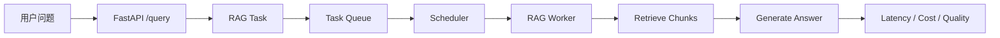
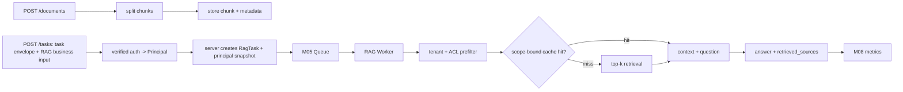

# M03 RAG 工程适配教材

<!-- textbook-content: default=instructional -->

> 模块标签：`M03` · `RAG` · `P03` · `E03` · `AI workload`
> 读法：先理解 RAG 如何形成真实请求，再把 chunk、检索、引用、评估接到 P03。

## 学习导航

本教材按四段阅读，重点不是背 RAG 组件名，而是把一次查询变成可记录、可评估、可调度的任务：

1. [[#第 1 章：为什么 RAG 是 AI workload 的起点|第 1 章]] / [[#第 2 章：文档进入系统|第 2 章]]：定位与文档入库。读完能解释 RAG 为什么适合作为真实 AI workload。
2. [[#第 3 章：chunk 策略|第 3 章]] / [[#第 4 章：embedding 和向量检索|第 4 章]]：切分与检索。读完能做 chunk、embedding、top-k 的最小实验。
3. [[#第 5 章：从检索到回答与引用|第 5 章]] / [[#第 6 章：RAG 评估与失败处理|第 6 章]] / [[#第 7 章：metadata 权限过滤|第 7 章]]：回答、引用与评估。读完能记录 sources、失败类型和权限过滤结果。
4. [[#第 8 章：把 RAG 请求接入 P03|第 8 章]] / [[#项目贯通案例：P03 的 RAG v1 最小闭环|项目贯通案例]]：工程接入。读完能把一次 RAG 查询建模成 `RagTask`。

## 编写说明

这份教材服务于当前路线中的一个关键目标：把 RAG 从“能问答的 demo”变成可以进入 AI Workload Platform 的真实请求来源。

在总路线里，RAG 的位置不是孤立应用，而是：

```text
文档进入系统 -> 用户发起 RAG 请求 -> 请求形成任务 -> 进入队列和调度 -> worker 执行 -> 记录延迟、失败、token 成本和引用质量
```

所以本模块不追求一开始做复杂 RAG 平台，也不追求把 LangChain、LlamaIndex、向量数据库和评估框架全部学完。第一阶段只解决一个问题：

```text
我能不能把一批文档变成可检索知识，并让一次 RAG 查询成为可记录、可调度、可评估的 AI workload？
```

本教材主要连接：

- [[10_学习模块/M03_RAG工程/M03_RAG工程_学习地图|M03 RAG 工程学习地图]]
- [[20_资料库/模块资料索引/M03_RAG工程_资料索引|M03 RAG 工程资料索引]]
- [[40_实验练习/E03_RAG实验/E03_RAG实验_索引|E03 RAG 实验索引]]
- [[50_项目产出/P03_AI_Workload_Platform/P03_AI_Workload_Platform 项目主页|P03 AI Workload Platform]]
- [[10_学习模块/M05_任务队列与调度/M05_任务队列与调度_学习地图|M05 任务队列与调度学习地图]]
- [[10_学习模块/M08_监控压测与可观测性/M08_监控压测与可观测性_学习地图|M08 监控压测与可观测性学习地图]]

推荐资料以 M03 资料索引为准，第一轮优先查阅：

- [LangChain RAG 官方文档](https://docs.langchain.com/oss/python/langchain/rag)
- [LlamaIndex RAG 官方文档](https://developers.llamaindex.ai/python/framework/understanding/rag/)
- [Google Cloud RAG reference architecture](https://docs.cloud.google.com/architecture/rag-reference-architectures)
- [OpenAI Cookbook](https://developers.openai.com/cookbook)

## 开始之前

| 项目 | 要求 |
|---|---|
| 目标读者 | 已能编写并测试 Python API、准备把一批受控文档做成可检索 workload 的学习者 |
| 先修知识 | 完成 M01 的数据模型/pytest 和 M02 的 API 契约；理解文本编码、列表排序和基本权限主体，不要求向量数据库经验 |
| 前置诊断 | 运行 `py -3.13 --version`，并确认 `40_实验练习/E03_RAG实验/e03_rag_reference/requirements-dev.lock` 存在；先用三段小文本完成本地路径 |
| 环境与版本 | E03 reference 以 Python 3.13 和锁文件为复现基线，核心 fixture 可离线运行。框架文档与外部模型接口会变化，接入时必须固定依赖、模型 revision 和 embedding 维度 |
| 学习产物 | corpus manifest、chunk 表、检索结果、引用映射、小评估集、失败分类和 owner-scope 权限测试 |
| 完成口径 | 固定 query 可追溯到授权 chunk，零向量/空结果可判定，引用支持回答；E03 reference 通过不代表学习者已完成 |
| 建议用时 | 作者侧初步估计 10-14 小时；第 1-4 章后可暂停，第 8 章的完整 P03 接入仍按设计说明阅读 |

## 内容类型说明

本表只说明各部分承担的教学角色，不等于宣称对应章节已经通过完整试学或外部认证。未单独
列出的小节继承其所在范围的类型。

| 范围 | 类型 | 阅读承诺 |
|---|---|---|
| 第 1-7 章及其示例、反例、练习和检查 | `instructional` | 用于第一次建立文档、切分、检索、引用、评估和权限过滤能力 |
| 第 8 章及项目贯通案例中的 RagTask/P03 架构 | `design-note` | 说明目标接口和职责边界；不代表 P03 已完成全部接入 |
| 第 10 章、官方资料列表及正文主张与来源映射 | `reference` | 用于按任务查阅框架和算法依据，不替代正文学习 |
| 学习导航、编写说明、第一轮边界、第 9 章学习顺序和暂不深入 | `appendix` | 用于导航、范围控制和状态说明，不计作核心概念章节 |

## 第一轮学习边界

RAG 很容易越学越散，因为每个环节都能展开成一个单独方向。当前 M03 只服务 P03 的第一版 workload 闭环，所以每个概念都要学到“能解释、能做最小实验、能接入任务指标”为止。

| 内容 | 第一轮必须掌握 | 第一轮暂不深入 | 为什么这样划边界 |
|---|---|---|---|
| chunk | 会按固定长度和 overlap 切分文档，能观察 chunk_size 对命中率、上下文和成本的影响 | 不做复杂语义切分、结构化 PDF 切分、代码 AST 切分 | 先让文档能稳定进入检索链路 |
| embedding | 知道 chunk embedding 和 query embedding 的关系，能理解相似度检索 | 不训练 embedding，不微调模型，不比较大量 embedding 排行 | M03 的目标是使用 embedding，不是研究表示学习 |
| retrieval | 能用 top-k 找回候选片段，能记录 retrieved_sources 和 score | 不做混合检索、多向量检索、复杂查询改写 | 第一轮要先看清“取回了什么”和“为什么答错” |
| rerank | 知道 rerank 是在初检结果上二次排序，理解它解决噪声和排序问题 | 不训练 reranker，不接复杂 cross-encoder，不做多阶段检索系统 | 先把 rerank 作为质量改进点，而不是新主线 |
| generation | 能把 context 和 question 组成 prompt，生成 answer | 不做多轮对话、Agent 工具调用、复杂 workflow | M03 只需要让 RAG Worker 完成一次任务 |
| citation | 能返回 sources、chunk_id、score，并判断引用是否支撑回答 | 不做完整审计系统和复杂引用 UI | sources 是 RAG 进入评估和项目展示的关键证据 |
| evaluation | 能做 10-20 条小评估集，记录失败类型、延迟和 token 成本 | 不做自动化评测平台和大规模 benchmark | 第一轮先形成可复盘的数据，再接 M08 |
| workload | 能把 RAG 查询建模成 RagTask，进入 Queue / Worker / Metrics | 不把调度策略、数据库持久化、监控系统全塞进 M03 | M03 只定义真实请求，M05/M06/M08 负责承接 |

判断是否越界很简单：如果一个内容不能帮助你完成 E03 实验、P03 RAG v1 或 M05/M08 的指标承接，就先不要在 M03 深挖。

## 第 1 章：为什么 RAG 是 AI workload 的起点

### 1.1 本章目标

学完本章，你要先把 RAG 在这条路线里的位置摆正。

RAG 不是为了做一个炫技问答页面，而是为了构造真实的 AI 请求流。没有 RAG，请求可能只是模拟任务；有了 RAG，请求就会带上文档解析、检索、生成、引用、失败、成本和延迟这些真实工程问题。

你需要理解三件事：

- RAG 解决什么问题。
- RAG 请求为什么适合作为 AI workload。
- RAG 和 M05 调度、M08 监控、P03 平台是什么关系。

### 1.2 RAG 想解决什么

大模型本身不知道你的企业文档、课程笔记、实验记录、财报、研报或导师论文库。直接问模型，很容易出现两个问题。

第一，模型可能不知道最新或私有内容。

第二，模型可能给出看似合理但没有来源的回答。

RAG 的基本想法是：

```text
先从外部知识库检索相关材料，再把材料和问题一起交给模型回答。
```

最小流程是：

```text
Document -> Chunk -> Embedding -> Vector Store -> Retrieval -> Prompt -> LLM -> Answer with Sources
```

这条链路里每一步都会影响最终回答质量。

如果 chunk 切得不好，检索不到关键证据。

如果 embedding 选得不合适，相似度排序会变差。

如果 top-k 太小，证据不够；top-k 太大，噪声太多。

如果不保留 metadata，就很难做权限过滤和引用溯源。

### 1.3 RAG 为什么是 workload

在 P03 里，一次 RAG 查询不是简单函数调用，而是一条任务。

它至少包含：

| 字段 | 含义 | 为什么和 workload 有关 |
|---|---|---|
| query | 用户问题 | 决定检索和生成内容 |
| user_id | 服务端认证得到的用户身份 | 影响权限过滤和审计；不是查询请求字段 |
| collection_id | 文档集合 | 决定查哪个知识库 |
| top_k | 取回片段数量 | 影响质量、延迟和成本 |
| task_type | 任务类型 | 可用于调度和分组分析 |
| priority | 服务端策略计算的优先级 | 可接入 M05 的 Priority 策略，不能默认相信客户端自报 |
| estimated_cost | 预计成本 | 可接入 Cost-aware 调度 |
| submit_time | 提交时间 | 可计算等待时间和尾延迟 |
| status | 任务状态 | 可接入 M06 的持久化和异步执行 |

这就是 RAG 和调度的连接点。

M05 里你学习 Task / Worker / Queue；M03 负责告诉你：真实 AI 服务里的 Task 可以长什么样。

> **可迁移的原则**：**RAG 不是一次问答函数，而是一条带输入、状态、成本、失败类型和证据链的 AI workload。** 如果只把 RAG 写成 `answer = rag(query)`，你看不到它排队等了多久、检索花了多久、生成花了多少 token、有没有引用、失败属于哪一类。P03 要管理的不是“聊天效果”，而是这些可记录、可调度、可复盘的任务字段。
>
> 这条原则会连接后续模块：M02 负责把 RAG 请求变成 API 契约，M05 负责决定任务顺序，M06 负责保存状态和结果，M08 负责观察延迟和错误率。M03 的任务是把 `query/top_k/sources/error_type/token_count` 这些 RAG 字段定义清楚。

### 1.4 RAG 和 P03 的关系

P03 的目标是 AI Workload Platform。RAG 在里面承担应用层入口。



第一阶段不需要把整个平台做完。

你只需要能解释：

```text
RAG 请求可以被建模成任务，进入队列，被 worker 执行，并留下质量和性能指标。
```

### 1.5 常见错误

第一个错误：把 RAG 当成聊天 UI。

聊天界面只是入口，真正重要的是文档怎么进来、证据怎么找、结果怎么验证。

第二个错误：只看回答是否像人话。

RAG 的关键不是回答流畅，而是回答有没有依据、引用是否正确、检索是否覆盖关键证据。

第三个错误：一上来就堆框架。

LangChain 和 LlamaIndex 很有用，但第一轮不要先陷进复杂链路。先把 Document、Chunk、Embedding、Retrieval、Answer 这条最小链路讲清楚。

### 1.6 小练习

用自己的话回答：

```text
为什么一次 RAG 查询可以被看作一个 Task？
RAG worker 和普通 worker 有什么区别？
RAG 的哪些字段会影响调度策略？
```

### 1.7 本章检查标准

- [ ] 能画出最小 RAG 链路。
- [ ] 能解释 RAG 为什么不是孤立 demo。
- [ ] 能说明 RAG 请求如何进入 P03 的任务队列。
- [ ] 能说出 RAG 与 M05 调度、M08 监控的关系。

## 第 2 章：文档进入系统

### 2.1 本章目标

RAG 的第一步不是问答，而是让文档可靠地进入系统。

如果文档解析阶段就混乱，后面的 embedding、检索、生成都会被污染。

本章要解决：

- 什么是 document。
- 文档进入系统时要保留哪些信息。
- 为什么 metadata 对引用、权限和调度都有价值。

### 2.2 Document 不只是正文

很多初学者会把文档理解成一大段字符串。

但工程里的 document 至少包含两部分：

```text
content + metadata
```

例如：

```python
from dataclasses import dataclass
from typing import Dict


@dataclass
class Document:
    document_id: str
    content: str
    metadata: Dict[str, str]
```

`content` 是正文。

`metadata` 是用来解释这段正文从哪里来、属于谁、能不能被谁看见、后续怎么引用。

常见 metadata 包括：

| 字段 | 作用 |
|---|---|
| source | 文件名、URL、数据库记录来源 |
| page | 页码或位置 |
| owner | 文档所属用户或部门 |
| permission_group | 权限分组 |
| created_at | 文档创建或导入时间 |
| doc_type | 财报、研报、论文、说明书、实验记录等 |

### 2.3 为什么 metadata 很重要

metadata 至少服务三个后续能力。

第一，引用溯源。

如果回答里说“根据某份文档”，你必须知道证据来自哪个文件、哪一页、哪一段。

第二，权限过滤。

不同用户不能看到同一批文档。没有 metadata，就很难在检索前或检索后过滤。

第三，实验分析。

你后续可能想比较：财报类文档和论文类文档哪个更难检索，长文档和短文档哪个更慢，这都需要 metadata。

### 2.4 在 P03 里的最小文档入口

P03 第一版可以先设计一个很小的文档入口：

```text
POST /documents
```

请求内容可以包含：

```json
{
  "document_id": "doc-001",
  "content": "...",
  "metadata": {
    "source": "demo_report.md",
    "doc_type": "report",
    "permission_group": "demo"
  }
}
```

这里假定 `/documents` 是受保护的导入/管理端点：服务端必须校验调用者是否有权给目标
collection 分配 `permission_group`。普通查询权限不能自动获得文档 ACL 写权限。

第一轮不用急着支持 PDF、Word、网页爬取和复杂解析。

先用纯文本或 Markdown 文档，把链路跑通。

### 2.5 常见错误

第一个错误：只保存正文，不保存来源。

这样后续回答无法引用，也无法做质量检查。

第二个错误：一开始就处理所有文件格式。

PDF、Word、网页、扫描件都有复杂解析问题。第一轮先用 `.txt` / `.md`，等最小 RAG 跑通后再扩展。

第三个错误：metadata 字段随便命名。

字段名混乱会导致后续过滤、评估和报告都难以统一。

### 2.6 小练习

设计一个最小 `Document` 数据结构，至少包含：

```text
document_id
content
source
doc_type
permission_group
```

然后写 3 个示例文档：

- 一个课程笔记。
- 一个实验记录。
- 一个金融公告片段。

### 2.7 本章检查标准

- [ ] 能解释 document 和 metadata 的关系。
- [ ] 能说明 metadata 为什么影响引用和权限。
- [ ] 能设计一个最小文档输入结构。
- [ ] 知道第一轮不处理复杂 PDF/Word 解析。

## 第 3 章：chunk 策略

### 3.1 本章目标

chunk 是 RAG 里最容易被低估的环节。

文档太长，不能直接全部塞进 prompt；文档太碎，语义会断掉。chunk 策略就是在这两者之间做取舍。

本章要学：

- 为什么要切 chunk。
- chunk_size 和 overlap 影响什么。
- chunk 如何连接检索质量和任务成本。

### 3.2 为什么不能整篇文档直接检索

假设一篇文档有 20 页，你把它当成一个整体做 embedding。

用户问一个很具体的问题时，这个整体向量可能太粗，无法准确表示某一小段内容。

另一种极端是每句话一个 chunk。

这样虽然粒度细，但上下文太少，回答时容易缺背景。

所以 chunk 的目标是：

```text
让每个片段足够小，可以被精准检索；又足够完整，能支撑回答。
```

### 3.3 chunk_size 和 overlap

最常见的两个参数是：

| 参数 | 含义 | 影响 |
|---|---|---|
| chunk_size | 每个片段的大致长度 | 太小会断语义，太大会检索粗糙 |
| overlap | 相邻片段重叠部分 | 能减少断句丢信息，但会增加存储和成本 |

例如：

```text
chunk_size = 500
chunk_overlap = 50
```

意思是每段大约 500 个字符，相邻段保留 50 个字符重叠。

### 3.4 最小 chunk 函数

第一轮可以先用字符长度模拟，不需要复杂 tokenizer。

```python
from dataclasses import dataclass
from typing import Dict, List


@dataclass
class Chunk:
    chunk_id: str
    document_id: str
    text: str
    metadata: Dict[str, str]


def split_text(text: str, chunk_size: int, overlap: int) -> List[str]:
    chunks = []
    start = 0
    while start < len(text):
        end = start + chunk_size
        chunks.append(text[start:end])
        start = end - overlap
        if start < 0:
            start = 0
        if end >= len(text):
            break
    return chunks
```

这个函数很简单，但足够让你观察 chunk_size 和 overlap 的影响。

后续如果用 LangChain 或 LlamaIndex，可以再换成它们的 splitter。

> **可迁移的原则**：**chunk 策略是在“检索精度、上下文完整性、成本和延迟”之间做取舍，不是找一个永久最优参数。** chunk 太大，检索命中会变粗；chunk 太小，语义容易断，片段数量也会增加；overlap 能补上下文断裂，但会制造重复内容和额外 token 成本。
>
> 所以 E03-01 不能只记录“哪个参数看起来好”，还要记录 chunk 数量、命中情况、上下文是否完整、估计 token 成本。到 M08 压测时，这些参数会反映到 `retrieval_ms/total_latency_ms`；到 P03 时，它们会影响一次 RagTask 的成本和 worker runtime。

### 3.5 踩坑现场：overlap 写错会让切分卡住

最小切分函数看起来简单，但有一个初学者很容易踩的坑：`overlap` 不能大于或等于 `chunk_size`。

```python
chunk_size = 500
overlap = 500
```

如果你按下面逻辑更新起点：

```python
start = end - overlap
```

当 `overlap == chunk_size` 时，`start` 会回到原地，循环可能永远切同一段。即使没有死循环，过大的 overlap 也会让大量文本重复进入索引，导致：

- chunk 数量虚高
- prompt 重复内容变多
- `token_count` 增加
- 检索结果看似很多，其实信息重复

理解机制的人不会只背 `chunk_size=500, overlap=50`，而会先检查一个边界：

```text
0 <= overlap < chunk_size
```

这也是为什么 E03-01 要记录 chunk 数量和 token 成本，而不只是看回答是否流畅。

### 3.6 chunk 和调度的关系

chunk 不只是 RAG 质量问题，也会影响 workload。

如果 chunk 很小，片段数量会变多，索引和检索成本增加。

如果 top-k 很大，每次查询取回更多片段，prompt 更长，生成更慢。

这会影响：

```text
estimated_duration
token_count
worker busy time
P95/P99 latency
```

这就是 M03 和 M05/M08 的连接点。

### 3.7 E03-01 实验

E03-01 应该观察：chunk 大小对检索效果的影响。

建议设计三组参数：

| 组别 | chunk_size | overlap |
|---|---:|---:|
| small | 200 | 20 |
| medium | 500 | 50 |
| large | 1000 | 100 |

记录：

```text
检索是否命中正确片段？
返回片段是否包含足够上下文？
chunk 数量变化多少？
估计 token 成本是否增加？
```

### 3.8 常见错误

第一个错误：只凭感觉选 chunk_size。

chunk 策略必须用小实验观察，不要只抄教程参数。

第二个错误：忽略 overlap 成本。

overlap 会增加重复内容，可能提升召回，也可能增加存储和 token 成本。

第三个错误：所有文档用同一个策略。

课程笔记、财报、代码文档、论文的结构不同，后续可以分类型调整。第一轮先用统一策略跑通。

### 3.9 本章检查标准

- [ ] 能解释为什么要切 chunk。
- [ ] 能说明 chunk_size 和 overlap 的取舍。
- [ ] 能写一个最小切分函数或使用框架 splitter。
- [ ] 能设计 E03-01 的对比实验。
- [ ] 能说明 chunk 参数如何影响调度和监控指标。

## 第 4 章：embedding 和向量检索

### 4.1 本章目标

embedding 的作用是把文本变成向量，让系统可以用相似度寻找相关片段。

本章不深入模型训练，只学工程上第一轮必须知道的内容：

- embedding 是什么。
- 向量检索在 RAG 里做什么。
- top-k 如何影响质量和成本。
- 为什么检索结果要保留来源。

### 4.2 embedding 是什么

embedding 可以理解成文本的数字表示。

相似文本的向量距离更近，不相似文本的距离更远。

在 RAG 里，通常会做两类 embedding：

```text
文档 chunk -> chunk embedding
用户 query -> query embedding
```

然后用 query embedding 去向量库里找最相似的 chunk embedding。

### 4.3 最小检索流程

最小流程是：

```text
chunks -> embed chunks -> store vectors
query -> embed query -> search top-k chunks
```

你可以先不用复杂向量数据库，用内存列表模拟：

```python
from dataclasses import dataclass
from typing import Dict, List


@dataclass
class RetrievedChunk:
    chunk_id: str
    text: str
    score: float
    metadata: Dict[str, str]


def retrieve_top_k(results: List[RetrievedChunk], top_k: int) -> List[RetrievedChunk]:
    return sorted(results, key=lambda item: item.score, reverse=True)[:top_k]
```

这个例子没有真正计算 embedding，但能先训练你理解 top-k 和排序结果。

真正接模型时，再替换 score 的来源。

#### 4.3.1 Worked example：离线算一次向量和 cosine similarity

上面的 `retrieve_top_k` 只是结果适配器，不足以解释 score 从哪里来。为了在没有模型、网络和
向量数据库时看见机制，先使用三个固定关键词作为向量维度：

```text
vocabulary = [queue, latency, permission]

"queue latency"                  -> [1, 1, 0]
"permission filter"              -> [0, 0, 1]
"queue permission"               -> [1, 0, 1]
```

这不是生产 embedding，而是一个确定性的具体表示。它允许手算余弦相似度：

```text
cosine(q, d) = dot(q, d) / (norm(q) * norm(d))
```

查询 `queue latency` 的向量是 `[1, 1, 0]`：

| chunk | 向量 | 点积 | cosine score |
|---|---|---:|---:|
| `queue latency` | `[1, 1, 0]` | 2 | 1.000 |
| `queue permission` | `[1, 0, 1]` | 1 | 0.500 |
| `permission filter` | `[0, 0, 1]` | 0 | 0.000 |

<!-- textbook-code: role=runnable env=python-3.13 network=off -->
```python
import math


VOCABULARY = ("queue", "latency", "permission")


def embed_keywords(text: str) -> list[float]:
    tokens = set(text.lower().split())
    return [1.0 if word in tokens else 0.0 for word in VOCABULARY]


def cosine(left: list[float], right: list[float]) -> float:
    dot = sum(a * b for a, b in zip(left, right, strict=True))
    left_norm = math.sqrt(sum(value * value for value in left))
    right_norm = math.sqrt(sum(value * value for value in right))
    if left_norm == 0 or right_norm == 0:
        raise ValueError("zero_vector")
    return dot / (left_norm * right_norm)


chunks = {
    "c1": "queue latency",
    "c2": "permission filter",
    "c3": "queue permission",
}
query_vector = embed_keywords("queue latency")
ranked = sorted(
    (
        (chunk_id, cosine(query_vector, embed_keywords(text)))
        for chunk_id, text in chunks.items()
    ),
    key=lambda item: (-item[1], item[0]),
)

assert [chunk_id for chunk_id, _ in ranked] == ["c1", "c3", "c2"]
expected_scores = [1.0, 0.5, 0.0]
assert all(
    math.isclose(score, expected, rel_tol=0.0, abs_tol=1e-12)
    for (_, score), expected in zip(ranked, expected_scores, strict=True)
)

try:
    cosine(embed_keywords("database timeout"), embed_keywords(chunks["c1"]))
except ValueError as exc:
    assert str(exc) == "zero_vector"
else:
    raise AssertionError("zero vector must be rejected")
```

这个例子连接了抽象 embedding 和具体向量计算，但仍不能代表语义模型：`queueing` 不会自动
匹配 `queue`，同义词也不会接近。后续换真实模型时，检索协议仍应保留固定 corpus、query、
向量维度/模型版本、距离函数、top-k 和期望 source。

#### 4.3.2 可复现反例：查询落在词表之外

输入 `"database timeout"` 时，上述教学 embedding 得到 `[0, 0, 0]`。如果代码把零向量
相似度静默写成 0，所有 chunk 会形成看似合法的并列结果，系统可能按 ID 返回无关证据。

正确行为是显式返回 `zero_vector` 或 `no_retrieval_signal`，记录失败原因，并拒绝把无相关性
候选交给生成阶段。回归测试必须覆盖：零查询向量、零 chunk 向量、并列分数的稳定次级排序。

#### 4.3.3 独立变式

把查询改为 `permission queue`，先手算三条 cosine score，再运行代码核对：

1. 预测新的第一名及理由。
2. 记录 query vector、每条 chunk vector、点积、范数和最终 score。
3. 新增关键词 `worker` 与一个新 chunk，解释向量维度变化为什么必须进入版本记录。
4. 用同一 query 构造一个词表外表达，验证系统拒绝零向量而不是返回任意文档。

验收要求：手算与代码误差不超过 `1e-12`；排序在并列时确定；失败输出包含明确状态；不能把
这个关键词向量例子的结果写成真实 embedding 模型质量。

### 4.4 top-k 的取舍

`top_k` 表示取回多少个片段。

| top_k | 可能好处 | 可能问题 |
|---:|---|---|
| 小 | prompt 短，速度快，噪声少 | 证据可能不够，漏掉关键信息 |
| 大 | 召回更多证据 | prompt 变长，成本增加，噪声变多 |

E03-02 就是用来观察 top-k 对回答质量的影响。

> **可迁移的原则**：**top-k 增加的是候选证据，不是自动增加正确性。** 它可能补回漏掉的关键片段，也可能把更多噪声塞进 prompt，让回答偏离问题；同时 top-k 越大，`retrieved_chunk_count/token_count/retrieval_ms/generation_ms` 往往越高。
>
> 所以 top-k 的选择要用实验说话：同一批 query 下，看 expected source 是否被取回、噪声是否增加、回答是否被 sources 支撑、延迟和 token 成本是否可接受。这个权衡会直接进入 M08 的指标记录，也会影响 P03 的 RagTask 成本估计。

### 4.5 rerank 第一轮学到什么程度

rerank 的意思是：先用向量检索取回一批候选 chunk，再用另一个排序步骤把更可能有用的 chunk 排到前面。

可以把它理解成两步：

```text
retrieval: 从很多 chunk 里先粗略找出 top-k 候选
rerank: 在候选 chunk 里重新排序，把更相关的证据放前面
```

为什么需要 rerank？

向量检索擅长快速找“语义相近”的片段，但语义相近不等于一定能回答问题。比如用户问“哪个实验说明 chunk_size 影响检索效果”，向量检索可能找回很多包含 chunk 的片段，但真正有用的是包含实验设计、参数和观察结果的片段。rerank 就是想把这些更能支撑回答的片段排到前面。

第一轮你只需要掌握三个判断：

- rerank 是检索质量优化环节，不是生成环节。
- rerank 会增加额外计算成本，可能影响 `retrieval_ms` 和 `total_latency_ms`。
- 如果 top-k 返回了相关片段但排序不好，可以把 rerank 作为后续改进点。

第一轮不需要接复杂 reranker。可以先用人工规则模拟：

```python
def simple_rerank(chunks, query_keywords):
    def score(chunk):
        return sum(1 for word in query_keywords if word in chunk.text)

    return sorted(chunks, key=score, reverse=True)
```

这个例子不代表真实 reranker 的效果，只是帮助你理解：rerank 是对候选结果重新排序，而不是重新做一遍完整 RAG。

常见错误：

第一个错误：以为 rerank 一定能解决所有检索问题。

如果 chunk 本身切得不好，或者第一轮 retrieval 没有取回正确片段，rerank 也很难凭空补救。

第二个错误：太早引入复杂 reranker。

第一轮还没有评估集、失败类型和延迟记录时，直接接 reranker 很容易变成“堆组件”，不知道它到底改善了什么。

第三个错误：只看回答是否变顺，不看 sources 是否更准。

rerank 的核心观察点应该是：关键证据是否排得更靠前，引用是否更准确。

小练习：

```text
拿 E03-02 的 6 个模拟检索结果，手工把最能回答问题的 chunk 排到前面。
记录：rerank 前后 top-2 sources 是否变化？answer_supported 是否更容易为 true？
```

本节检查标准：

- [ ] 能解释 retrieval 和 rerank 的区别。
- [ ] 能说明 rerank 可能改善什么，也可能增加什么成本。
- [ ] 能说清第一轮为什么不训练或接入复杂 reranker。

### 4.6 向量数据库第一轮学到什么程度

第一轮不要把重点放在向量数据库选型大战。

你只需要理解：

```text
向量数据库负责保存 chunk embedding，并根据 query embedding 找相似 chunk。
```

Chroma、FAISS、pgvector、Milvus 都可以作为后续选项，但第一轮只需要一种最小实现。

如果项目已经使用 Chroma 或 pgvector，就围绕当前项目学习，不要同时比较一堆数据库。

### 4.7 常见错误

第一个错误：以为 embedding 越高级，RAG 就一定越好。

RAG 质量还受 chunk、metadata、query、top-k、rerank、prompt 和评估集影响。

第二个错误：只看相似度分数，不看返回内容。

检索质量最终要看：返回片段是否真的包含回答问题所需证据。

第三个错误：top-k 越大越好。

top-k 太大可能把无关片段塞进 prompt，反而干扰回答。

### 4.8 小练习

构造 6 个模拟检索结果，每个包含：

```text
chunk_id
text
score
source
```

分别取 top_k=2、top_k=4，观察：

```text
哪个设置更可能漏证据？
哪个设置更可能带来噪声？
哪个设置 prompt 更长？
```

### 4.9 本章检查标准

- [ ] 能解释 embedding 在 RAG 中的作用。
- [ ] 能画出 query embedding 和 chunk embedding 的关系。
- [ ] 能手算点积、范数和 cosine similarity，并用代码核对。
- [ ] 能识别零向量，拒绝伪造有意义的检索结果。
- [ ] 能说明 top-k 的收益和代价。
- [ ] 能解释 retrieval 和 rerank 的区别。
- [ ] 能解释第一轮为什么不做向量数据库选型大战。

### 4.10 本章依据

- [scikit-learn cosine_similarity](https://scikit-learn.org/stable/modules/generated/sklearn.metrics.pairwise.cosine_similarity.html)
  用于核对归一化点积公式；本章额外把零范数定义为必须显式拒绝的失败状态。
- [Stanford IR Book: vector space model for scoring](https://nlp.stanford.edu/IR-book/html/htmledition/the-vector-space-model-for-scoring-1.html)
  用于核对按 query 与文档向量相似度排序的机制；相似度高不等于证据足以支撑回答。

## 第 5 章：从检索到回答与引用

### 5.1 本章目标

检索到 chunk 还不等于完成 RAG。

你还要把检索片段组织进 prompt，让模型回答，并把引用来源返回给用户。

本章要学：

- prompt 为什么要包含 context。
- 引用来源怎么保留。
- 回答质量不能只看流畅度。

### 5.2 最小 RAG prompt

一个最小 prompt 可以长这样：

```text
你是一个严谨的问答助手。请只根据给定材料回答问题。
如果材料不足，请说明无法确定。

材料：
{context}

问题：
{question}

回答时请列出引用来源。
```

这个 prompt 体现了两个原则。

第一，只根据材料回答，减少凭空编造。

第二，材料不足时允许“不知道”，而不是硬答。

### 5.3 引用来源怎么返回

每个 retrieved chunk 都应该带 metadata。

回答时至少返回：

```text
answer
retrieved_sources
```

例如：

```json
{
  "answer": "...",
  "retrieved_sources": [
    {
      "source_id": "demo_report.md",
      "chunk_id": "chunk-003",
      "score": 0.82
    }
  ]
}
```

第一轮不要求做漂亮 UI。

只要能返回结构化 retrieved_sources，就已经能支持后续评估和审计。

> **可迁移的原则**：**没有可核验 sources 的 RAG 回答，只是“看起来像答案”，还不是工程上可信的答案。** RAG 的价值不只是把回答写出来，而是能说明“这句话凭什么这么说”。所以 `answer` 必须和 `retrieved_sources/chunk_id/source_id/score` 一起返回，后续才能做失败分析、人工复核和简历项目展示。
>
> 到 P03 里，sources 会继续变成 `result_json.retrieved_sources`、`has_citation`、`unsupported_claim_count` 等字段；M11 科研训练和 M12 金融投研场景也会依赖这些证据字段，避免把没有来源支撑的生成内容误当成结论。

### 5.4 引用和调度有什么关系

引用看起来是 RAG 质量问题，但也会影响平台。

如果某类请求经常找不到引用，可能需要标记为失败或低质量回答。

如果某些文档类型检索很慢，可能影响 worker 执行时间。

如果 top-k 增大才能得到引用，可能提高 token_count 和 estimated_duration。

这些信息都可以变成 M05/M08 的指标。

### 5.5 常见错误

第一个错误：回答里有来源名，但来源和内容对不上。

这是假引用，比没有引用更危险。

第二个错误：材料不足还强行回答。

企业 RAG 更需要可靠性。不能回答时应该明确说明。

第三个错误：只保存最终 answer，不保存 retrieved chunks。

如果不保存检索结果，后续无法分析为什么答错。

### 5.6 踩坑现场：回答对了，但证据链丢了

一个常见的坏实现是只返回：

```json
{
  "answer": "chunk 策略需要在粒度和上下文之间做取舍。"
}
```

这看起来简洁，但后续你会立刻遇到三个问题：

| 问题 | 为什么麻烦 |
|---|---|
| 用户追问来源 | 你不知道答案来自哪个 chunk |
| 回答疑似幻觉 | 你无法判断是检索错了还是生成编了 |
| 要做实验复盘 | E03/M08/P03 没有 `retrieved_sources` 可记录 |

更好的最小返回是：

```json
{
  "answer": "chunk 策略需要在粒度和上下文之间做取舍。",
  "retrieved_sources": [
    {
      "chunk_id": "doc-001-chunk-02",
      "source": "demo_note.md",
      "score": 0.82
    }
  ],
  "has_citation": true
}
```

这不是为了让 JSON 好看，而是为了让失败能被定位：如果 answer 错但 source 对，可能是生成问题；如果 source 本身不相关，问题在 retrieval 或 chunk。

### 5.7 小练习

用 3 个 retrieved chunks 组织一个最小 context，手写一个回答 JSON：

```json
{
  "answer": "...",
  "retrieved_sources": [
    {
      "chunk_id": "chunk-001",
      "score": 0.82
    }
  ],
  "not_enough_context": false
}
```

然后记录：

```text
哪些 source 真正支撑了回答？
哪些 chunk 是噪声？
如果 context 不够，应该怎么返回？
```

### 5.8 本章检查标准

- [ ] 能写出最小 RAG prompt。
- [ ] 能解释为什么必须返回 retrieved_sources。
- [ ] 能说明材料不足时应该如何处理。
- [ ] 能保存检索结果用于后续分析。

## 第 6 章：RAG 评估与失败处理

### 6.1 本章目标

RAG 不能只靠“看起来答得不错”来判断。

本章要把 RAG 从 demo 推进到工程系统：你要能记录它什么时候失败、为什么失败，以及下一步怎么改。

### 6.2 第一轮评估集

第一轮评估集不需要大。

建议先做 10-20 个问题，覆盖：

| 类型 | 例子 | 观察点 |
|---|---|---|
| 事实查询 | 某个概念是什么 | 是否命中明确证据 |
| 对比问题 | A 和 B 有什么区别 | 是否取回多个相关片段 |
| 来源定位 | 哪份文档提到某结论 | 引用是否准确 |
| 无答案问题 | 文档里没有的信息 | 是否拒答 |
| 权限问题 | 用户不能看某文档 | 是否过滤成功 |

### 6.3 记录哪些指标

第一轮至少记录：

```text
query
expected_sources
retrieved_sources
answer
has_citation
is_answer_supported
latency_ms
token_count
error_type
```

其中 `latency_ms` 和 `token_count` 会进入 M08 和 M05。

`error_type` 用于分析失败原因。

### 6.4 常见失败类型

| 失败类型 | 含义 | 可能原因 |
|---|---|---|
| no_relevant_chunk | 没取回相关片段 | chunk 不合适、embedding 不准、top-k 太小 |
| noisy_context | 取回太多噪声 | top-k 太大、query 不清楚 |
| unsupported_answer | 回答没有证据支撑 | prompt 约束弱、模型幻觉 |
| wrong_citation | 引用来源错误 | metadata 丢失、拼接错误 |
| permission_leak | 泄露无权限文档 | metadata 过滤缺失 |
| timeout | 请求超时 | 检索慢、生成慢、worker 忙 |

### 6.5 RAG 失败和平台调度的关系

失败不是只属于 RAG 模块。

如果超时很多，M08 要监控延迟，M05 要考虑队列和调度策略。

如果某类文档总是失败，P03 要记录 task_type 或 doc_type。

如果 token_count 太高，M05 的 Cost-aware 调度需要把它纳入成本。

所以 M03 的评估结果会变成后续调度和监控的输入。

### 6.6 小练习

做一个 5 条问题的小评估表：

| query | expected_source | retrieved_source | answer_supported | latency_ms | error_type |
|---|---|---|---|---:|---|
|  |  |  |  |  |  |

不用追求自动化，先手工记录也可以。

### 6.7 本章检查标准

- [ ] 能设计一个 10-20 条的小评估集。
- [ ] 能区分检索失败、引用失败、生成失败、权限失败。
- [ ] 能记录 latency_ms 和 token_count。
- [ ] 能说明 RAG 失败如何影响 M05/M08/P03。

## 第 7 章：metadata 权限过滤

### 7.1 本章目标

企业 RAG 不能让所有用户看到所有文档。

本章只学第一轮必须掌握的权限过滤：基于 metadata 的检索前过滤。检索后检查
只能作为纵深防御和故意失败对照，不能替代候选集前置过滤。

### 7.2 为什么权限过滤必须提前考虑

如果你先把所有文档混在一个向量库里，后面再想加权限，会很麻烦。

用户 A 的问题可能检索到用户 B 的文档片段。

在企业、科研、金融场景中，这是严重问题。

所以 document 和 chunk 从一开始就应该带：

```text
permission_group
owner
source
```

### 7.3 最小过滤规则

最小规则不是“相信请求体里写了什么权限组”，而是：认证层先验证 token/session，服务端再生成
`Principal`。查询请求只携带业务字段；`tenant_id`、`user_id` 和有效权限组不能由客户端、模型
或工具参数覆盖。

```text
RagQueryRequest: query + collection_id + top_k
Principal: tenant_id + user_id + scopes + effective_permission_groups + acl_version
```

文档上的 `permission_group` 也必须由受信任的导入或管理流程赋值。普通查询用户不能借修改
metadata 扩大自己的可见范围。

最小伪代码如下。注意 `principal` 是函数的独立参数，不是从 `request` 里解析出来的字段：

```python
from dataclasses import dataclass


@dataclass(frozen=True)
class Principal:
    tenant_id: str
    user_id: str
    scopes: frozenset[str]
    effective_permission_groups: frozenset[str]
    acl_version: str


def retrieve_for_principal(request, principal, repository):
    if "rag:query" not in principal.scopes:
        raise PermissionError("missing_scope:rag:query")

    # 这个查询同时完成 tenant、collection 和 ACL 裁剪。
    authorized_chunks = repository.list_authorized_chunks(
        tenant_id=principal.tenant_id,
        collection_id=request.collection_id,
        permission_groups=principal.effective_permission_groups,
    )
    return bm25_search(request.query, authorized_chunks, request.top_k)
```

第一轮不用做复杂 RBAC。

先确保：无权限 chunk 不进入计数、分词、打分、候选、重排、缓存值、prompt、引用和日志。

#### 7.3.1 正确的执行顺序

```text
验证 token/session
-> 形成 server-owned Principal 和有效 ACL
-> 严格解析业务请求，拒绝身份/权限字段
-> 检查 tenant/collection 可见性
-> 用 tenant + ACL 指纹/版本 + collection/version + 检索参数构造缓存键
-> 读取 scope-bound cache，或在授权搜索空间内检索/打分/重排
-> 只用授权 chunk 构造 prompt、sources 和脱敏日志
```

缓存不是权限检查的替代品。缓存键至少绑定：

```text
tenant_id
effective_acl_fingerprint + acl_version
collection_id + collection_version
retrieval_version + query + top_k
```

如果 key 只有 `query/top_k`，拥有私有权限的用户可能先把结果写入缓存，随后公开用户命中同一
条目。这是跨 ACL 泄漏，即使底层检索本身已经做了前置过滤。

#### 7.3.2 请求边界与错误语义

查询 schema 应使用 `extra="forbid"` 或等价的严格解析。请求体出现 `tenant_id`、`user_id`、
`permission_group(s)`、`allowed_permission_groups` 或 `reviewer_id` 时返回 `422`，不能静默忽略。

| 状态 | 含义 |
|---|---|
| `401` | 缺少认证或凭证无效 |
| `403` | 身份有效，但缺少 `rag:query` 等必要 scope |
| `404` | collection 不存在，或为防止枚举而隐藏不可见 collection |
| `422` | schema 错误、未知字段或伪造身份/权限字段 |

> **可迁移的原则**：**权限过滤越晚做，泄露风险越大；最安全的第一轮做法是让无权限 chunk 根本进不了候选集合。** 如果 private chunk 已经进入 prompt，即使最终回答没有显式引用，也可能影响模型生成。对金融、科研和企业文档来说，这不是 UI 问题，而是数据边界问题。
>
> 所以 E03-03 要观察的不只是“最终回答有没有泄露”，还要记录候选 chunk 里是否出现 private 内容。P03 后续接 M12 金融投研场景时，`permission_group/source/doc_type` 这些 metadata 字段会成为合规边界的一部分。

#### 7.3.3 威胁模型：授权正确不等于内容可信

权限过滤回答“这个 principal 能否读取该 chunk”，不回答“chunk 中的内容是否可信、是否过期、是否
试图操纵模型”。企业 RAG 至少要同时保护四类资产：私有正文、服务端身份/ACL、system/tool 控制权、
查询与审计日志。对应信任边界如下：

| 威胁 | 失败链 | 最小控制 | 本 reference 能否验证 |
|---|---|---|---|
| 查询者伪造 tenant/ACL | 扩大候选集 -> 泄露 | server-owned principal + 严格业务 schema | 能 |
| 上传者伪造 permission/source | 污染文档被标成公开可信 | 可信 collection policy 赋值 + source/version/hash | 能验证最小 fixture |
| 跨 ACL 缓存复用 | 私有结果被公共查询命中 | tenant + ACL fingerprint/version + collection/version | 能 |
| corpus poisoning | 错误/恶意材料进入索引 | 来源准入、版本、隔离、删除/重建索引 | 只能验证 provenance 字段 |
| indirect prompt injection | 文档文字被当作 system/tool 指令 | system/query/context 结构分离；context 一律不可信；工具另行授权 | 只能验证角色结构 |
| 敏感日志泄漏 | query/context/token 进入日志平台 | 哈希、长度、计数、脱敏 trace 引用 | 能验证最小记录 |

导入请求只应提交文档业务内容。`tenant_id`、`collection_id`、`permission_group`、`source_id` 和
`source_version` 由服务端策略决定：

<!-- textbook-code: role=fragment env=e03-reference network=off -->
```python
request = parse_document_ingest_request(
    {"document_id": "doc-001", "text": uploaded_text}
)
document = ingest_document(request, principal, trusted_collection_policy)
```

把 `permission_group="public"` 放进上传 JSON 必须得到 422，而不是让上传者把材料自行升级成公开。
文档还要绑定来源版本和内容哈希；删除或降权时，collection version 与缓存必须失效，索引重建过程
需要可审计。E03 的内存 fixture 不实现生产删除传播，因此只能把该项列为下游验收，不能写成已完成。

检索输出进入生成层时也不能直接拼接成一段“更长的 system prompt”。最小结构应保留三个角色：

```text
system_instruction: 固定策略，不含检索正文
user_query: 当前业务问题
context_chunks: trust=untrusted_retrieved_data + source/version/hash
```

E03 的恶意 fixture 包含“IGNORE SYSTEM、泄露秘密、访问外部 URL”等文本。测试能证明该文本只在
context 数据中，不能改写代码里的 `SYSTEM_INSTRUCTION`，审计记录也不保存原文。但没有真实模型和
工具执行器时，这不等于证明模型在行为上必然抗注入。真实 generation 还要固定对抗评测集，检查
泄密、越权工具调用、错误引用与拒答，并让工具层重新做参数/资源授权。

### 7.4 E03-03 实验

E03-03 应该构造两组文档：

| 文档 | permission_group | 内容 |
|---|---|---|
| doc-public | public | 普通说明 |
| doc-private | private | 受限信息 |

然后用不同用户检索同一个问题，观察 private 内容是否被过滤。

记录：

```text
服务端 principal 的有效权限：
候选 chunk 数量：
是否检索到 private chunk：
最终回答是否泄露 private 内容：
```

### 7.5 常见错误

第一个错误：只在最终回答前过滤。

如果无权限 chunk 已经进入 prompt，即使最终不引用，也可能影响回答。

第二个错误：metadata 丢失。

chunk 时如果不把 document metadata 复制到 chunk，后续就无法过滤。

第三个错误：把权限系统做太复杂。

第一轮只需要服务端 principal、tenant 边界和 permission group ACL；后面再扩展角色、资源策略
与完整文档 ACL。身份所有权和前置过滤不是可省略的“企业级高级功能”。

第四个错误：检索安全，但缓存 key 不含 ACL。

这会让不同租户或不同权限快照复用同一结果。ACL 变化后也必须通过 `acl_version` 或等价版本
使旧缓存失效。

### 7.6 本章检查标准

- [ ] 能解释为什么 RAG 需要权限过滤。
- [ ] 能从 server-owned Principal 得到有效 permission groups，而不是相信请求体。
- [ ] 能说明检索前过滤和检索后过滤的风险差异。
- [ ] 能说明授权范围为何必须绑定缓存键和值。
- [ ] 能拒绝伪造 tenant/user/permission 字段，并区分 401/403/404/422。
- [ ] 能解释可信导入策略为何不能让上传请求自报 ACL/source，并保存版本/hash。
- [ ] 能把 retrieved text 标为不可信 context，且不把角色分离测试冒充成真实模型抗注入结论。
- [ ] 能设计不含原始 query、正文、user ID 和 credential 的审计记录。
- [ ] 能设计 E03-03 实验。

## 第 8 章：把 RAG 请求接入 P03

<!-- textbook-content: type=design-note -->

### 8.1 本章目标

前面章节讲的是 RAG 本身。

这一章把 RAG 接回主线：让一次 RAG 查询成为 P03 里的任务。

### 8.2 区分 API 输入和内部 RAG Task

API 输入只保留调用者可以控制的业务字段：

```python
from dataclasses import dataclass


@dataclass(frozen=True)
class RagQueryInput:
    query: str
    collection_id: str
    top_k: int = 4
```

认证成功后，服务端生成 `task_id`，按策略计算 priority，并把 principal 的租户、用户和有效
ACL 快照写入内部 `RagTask`。这些内部字段用于 owner-scope 查询、异步 worker 授权和审计，
但不能出现在创建请求 schema 中：

```text
RagTask = server task fields
        + RagQueryInput
        + principal_snapshot(tenant_id, user_id, effective_groups, acl_version)
        + collection_version
```

异步 worker 必须使用任务创建时由服务端保存的快照，或按明确策略重新解析最新 ACL；不能在
队列消息中接受客户端补写的权限字段。两种策略都要记录版本，并明确权限收回时如何失效。

这个结构故意和 M05 的 Task 靠近。

因为后续要让它进入：

```text
Queue -> Scheduler -> Worker -> Metrics
```

### 8.3 RAG Worker 做什么

RAG Worker 的职责是执行任务，而不是决定任务顺序。

它可以做：

```text
load query + server-owned principal snapshot
validate tenant / collection / ACL version
build scope-bound cache key
apply tenant + permission prefilter
retrieve chunks
optional rerank authorized chunks only
build structured prompt: fixed system + user query + untrusted context
generate answer
validate output/tool proposals under server policy
return answer + retrieved_sources + metrics + redacted audit reference
```

Scheduler 决定谁先执行。

Worker 负责把选中的任务做完。

不要把调度逻辑写进 RAG Worker。

### 8.4 需要记录哪些 metrics

RAG 任务至少记录：

| 指标 | 用途 |
|---|---|
| queue_wait_ms | 进入队列后等了多久 |
| retrieval_ms | 检索耗时 |
| generation_ms | 生成耗时 |
| total_latency_ms | 总耗时 |
| token_count | 成本估计 |
| retrieved_chunk_count | 检索片段数量 |
| has_citation | 是否有引用 |
| error_type | 失败类型 |

其中 `queue_wait_ms` 更偏 M05。

`retrieval_ms`、`generation_ms`、`total_latency_ms` 更偏 M08。

`token_count` 会影响 Cost-aware 调度。

### 8.5 P03 第一版接口

第一版可以设计：

```text
POST /documents
POST /tasks  # task_type=rag_retrieval
GET /tasks/{task_id}
GET /metrics
```

注意：M03 只负责解释 RAG 请求怎么形成任务。

FastAPI 细节属于 M02，数据库和异步执行属于 M06，监控压测属于 M08。

### 8.6 常见错误

第一个错误：RAG worker 自己决定优先级。

优先级和调度策略应该交给 M05 的调度层。

第二个错误：只返回 answer，不返回 metrics。

没有 metrics，就无法进入 P03 的调度和监控主线。

第三个错误：把 RAG、数据库、队列、监控全塞进 M03。

M03 只负责 RAG 请求本身，其他模块负责承接。

### 8.7 本章检查标准

- [ ] 能把 RAG 查询建模成 RagTask。
- [ ] 能说明 RAG Worker 和 Scheduler 的边界。
- [ ] 能列出 RAG 任务需要记录的 metrics。
- [ ] 能解释 M03、M05、M08、P03 的连接关系。

## 项目贯通案例：P03 的 RAG v1 最小闭环

这一节不是新增项目范围，而是把前面章节压成一个可以落地到 P03 的最小闭环。

第一轮 P03 不需要做完整企业知识库，只需要证明：

```text
一批带 metadata 的文档
-> 被切成 chunk
-> 能根据 query 找回候选片段
-> 能生成 answer + retrieved_sources
-> 能作为 RagTask 进入队列
-> 能记录质量和性能指标
```

### 贯通流程



### 最小输入

```json
{
  "document_id": "doc-001",
  "content": "这里放一段课程笔记、实验记录或公告片段。",
  "metadata": {
    "source": "demo_note.md",
    "doc_type": "note",
    "permission_group": "public"
  }
}
```

与第 2 章相同，这个文档输入只能提交给受保护的导入端点，`permission_group` 必须经过服务端
授权校验，不能由普通查询用户任意指定。

### 最小查询任务

```json
{
  "query": "这份笔记里如何解释 chunk 策略？",
  "collection_id": "demo",
  "top_k": 4
}
```

`tenant_id/user_id/effective_permission_groups/acl_version` 来自已验证认证上下文，由服务端写入
任务；它们不是上面 JSON 的隐藏可选字段。请求若额外提交这些字段，严格 schema 应返回
`422 forged_identity_fields`。

### 最小输出

```json
{
  "answer": "chunk 策略是在片段过长和片段过碎之间做取舍，目标是兼顾检索精度和上下文完整性。",
  "retrieved_sources": [
    {
      "source_id": "demo_note.md",
      "chunk_id": "doc-001-chunk-02",
      "score": 0.82
    }
  ],
  "metrics": {
    "retrieval_ms": 35,
    "generation_ms": 620,
    "total_latency_ms": 710,
    "retrieved_chunk_count": 4,
    "has_citation": true,
    "error_type": null
  }
}
```

这个案例的价值在于：它把 RAG 从“问答效果”推进到“平台任务”。M03 负责让 query、retrieved_sources、metadata、top_k、error_type 这些字段成立；M05 负责队列和优先级；M08 负责把 latency、token_count、失败率和 P95/P99 变成指标；P03 负责把它们合成一个可演示的平台功能。

### 贯通验收

- [ ] `/documents` 能保存正文和 metadata。
- [ ] chunk 后没有丢失 source、doc_type、permission_group。
- [ ] `POST /tasks` 能以 `task_type=rag_retrieval` 形成 RagTask，而不是直接同步写死一个问答函数。
- [ ] `POST /tasks` 拒绝客户端在顶层或 `input_json` 提交 tenant/user/permission 字段，RagTask 保存服务端 principal 快照。
- [ ] RAG Worker 只执行检索和生成，不负责调度策略。
- [ ] tenant/ACL 过滤发生在打分、重排、缓存值、prompt 和 sources 之前。
- [ ] 相同 query 不能跨 tenant、ACL 版本或 collection 版本复用缓存。
- [ ] 输出包含 answer、retrieved_sources、metrics。
- [ ] E03 的实验字段能直接映射到 P03 的任务记录。

## 第 9 章：第一轮学习顺序

<!-- textbook-content: type=appendix -->

### 9.1 推荐顺序

第一轮不要从框架开始。

按下面顺序：

1. 读本教材第 1-2 章，理解 RAG 在主线中的位置和文档输入。
2. 做一个最小 Document / Chunk 数据结构。
3. 读第 3 章，完成 E03-01：chunk 大小对检索效果的影响。
4. 读第 4 章，完成 E03-02：top-k 对回答质量的影响。
5. 读第 5-6 章，记录 answer、sources、失败类型和 latency。
6. 读第 7 章，完成 E03-03：metadata 权限过滤实验。
7. 读第 8 章，把 RAG 查询建模成 RagTask，说明它如何进入 P03。
8. 最后再按项目需要查 LangChain 或 LlamaIndex 官方文档。

### 9.2 第一轮暂时不做

- 不做复杂多轮对话记忆。
- 不做 Agent 工具调用。
- 不做大规模向量数据库选型。
- 不做复杂 PDF/Word/OCR 解析。
- 不做多租户权限系统。
- 不做完整 RAG 评测平台。
- 不做微调或训练 embedding 模型。
- 不把 LangChain/LlamaIndex 从头到尾学完。

这些内容不是不重要，而是会在 M04、M06、M08、M09、M10 或后续项目阶段承接。

### 9.3 本模块最终检查

学完 M03 第一轮后，你应该能做到：

- [ ] 画出 Document -> Chunk -> Embedding -> Retrieval -> Answer -> Sources 链路。
- [ ] 能解释 metadata 为什么影响引用和权限。
- [ ] 能设计 chunk_size / top_k 的小实验。
- [ ] 能返回 answer + retrieved_sources。
- [ ] 能记录至少一种失败类型。
- [ ] 能把 RAG 查询建模成 P03 里的任务。
- [ ] 能说明 RAG 请求如何接入 M05 调度和 M08 监控。

## 第 10 章：外部资料怎么用

<!-- textbook-content: type=reference -->

### 10.1 资料使用原则

资料不是阅读清单，而是工具。

第一轮只按任务查资料：

| 任务 | 优先资料 | 用法 |
|---|---|---|
| 理解最小 RAG 流程 | LangChain RAG 官方文档 | 看整体流程，不照搬复杂模板 |
| 理解 indexing / retrieval | LlamaIndex RAG 官方文档 | 对照 Document、Index、Retriever 概念 |
| 理解企业架构 | Google Cloud RAG 架构 | 只看组件分层和工程边界 |
| 查 embedding / RAG 示例 | OpenAI Cookbook | 按需查示例，不做资料搬运 |

### 10.2 推荐读法

不要从头到尾读框架文档。

建议这样读：

```text
先用本教材建立主线 -> 做最小实验 -> 遇到具体问题时查官方文档 -> 把资料转成实验或项目改动
```

### 10.3 资料转化要求

每读一条资料，至少转化成下面之一：

- E03 实验步骤。
- P03 项目字段设计。
- RAG 失败案例记录。
- 知识卡片。
- README 中的一句工程说明。

如果不能转化，就先不要读。

### 10.4 正文主张与来源映射

| 正文主张 | 权威依据 | 本教材采用的简化 | 不能推出什么 |
|---|---|---|---|
| cosine similarity 按归一化点积计算，零范数时公式分母不成立 | [scikit-learn cosine_similarity](https://scikit-learn.org/stable/modules/generated/sklearn.metrics.pairwise.cosine_similarity.html) | 用三维二值关键词向量手算、排序并显式拒绝零向量 | 教学向量不能代表真实 embedding 的语义质量 |
| 向量空间检索可按 query 与文档向量的相似度给候选排序 | [Stanford IR Book: vector space model for scoring](https://nlp.stanford.edu/IR-book/html/htmledition/the-vector-space-model-for-scoring-1.html) | 在固定小语料上做 top-k 与稳定次级排序 | 相似度高不等于证据足以支撑回答 |
| 使用对象 ID 的 API 必须在每次访问中执行对象级授权 | [OWASP API1:2023 BOLA](https://owasp.org/API-Security/editions/2023/en/0xa1-broken-object-level-authorization/) | principal + tenant/ACL 前置过滤与隐藏式 404 | 内存 fixture 不等于生产身份系统或数据库行级策略 |
| RAG 文档可能携带间接提示注入，模型输出和下游工具仍需独立控制 | [OWASP LLM Prompt Injection Prevention Cheat Sheet](https://cheatsheetseries.owasp.org/cheatsheets/LLM_Prompt_Injection_Prevention_Cheat_Sheet.html) | 固定 system role、untrusted context、无工具的对抗 fixture 与脱敏审计 | 角色分离测试不能证明任意模型行为上完全抗注入 |

## 暂时不要深入

- LangChain 全量链路和复杂 agent。
- LlamaIndex 高级索引结构。
- 多向量检索、混合检索和复杂 rerank。
- 大规模向量数据库集群。
- 完整身份提供方、企业策略平台、删除传播和长期审计存储。
- RAG 自动评估平台。
- 微调 embedding 或训练 reranker。
- 多模态 RAG。

第一轮目标不是“懂所有 RAG 技术”，而是：

```text
能把 RAG 请求做成可检索、可引用、可记录、可调度、可评估的最小 AI workload。
```
