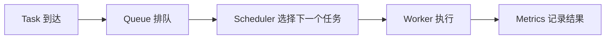

# M05 任务队列与调度适配教材

## 编写说明
状态说明：这份文档现在定位为 M05 的旧版总览导读，已归档，不再作为正式学习主教材。正式学习请以 [[10_学习模块/M05_任务队列与调度/M05_任务队列与调度_章节教材|M05 章节教材]] 和 [[10_学习模块/M05_任务队列与调度/M05_任务队列与调度_复现推进表|M05 复现推进表]] 为准。

保留它的原因是：它能快速说明 M05 与 P01/P03、调度直觉、项目映射之间的关系。但如果它和章节教材出现重复，以章节教材为准。

这份旧导读原先关联的教材化改造计划已经移入归档：[[10_学习模块/M05_任务队列与调度/99_归档/M05_任务队列与调度_教材化改造计划|M05 教材化改造计划]]。

## 第 1 章：为什么调度是这条路线的心脏

### 1.1 你真正要解决的不是“排序”

很多人第一次看调度，会把它理解成“把任务排个序”。那太轻了。

你真正要解决的是：

- 任务来了以后，系统先做谁？
- 多个任务同时竞争资源时，谁等，谁先跑？
- 任务短、长、急、贵、重要这些差异，怎么体现在决策里？
- 资源只有这么多，如何尽量少让用户感到慢？

这就是调度。

在 AI workload 场景里，这个问题更明显：

- 一个 RAG 请求可能很短。
- 一个长上下文 Agent 任务可能很长。
- 一个批处理 embedding 任务可能更适合晚点跑。
- 一个高优先级在线请求可能不该排在队尾。

如果没有调度，系统就只是“把任务收进来”，不是“把任务做起来”。

### 1.2 一条最小数据流



这条链路就是 M05 的主骨架。

### 1.3 M05 在整条路线里的位置

- M00 / M01：让你能写项目、跑测试、看日志。
- M02：让你能把功能包装成 API。
- M05：让你能把任务合理安排，开始体现“平台感”。
- M06 / M07 / M08：让这个平台变得可持久化、可部署、可观测。

所以 M05 不是旁支，它是从“能用”到“有调度能力”的那一步。

---

## 第 2 章：先建立最小调度模型

### 2.1 先把对象说清楚

最小调度系统里，只需要四类对象：

| 对象 | 作用 | 典型字段 |
|---|---|---|
| Task | 被调度的工作单元 | `id`、`created_at`、`estimated_duration`、`priority`、`status` |
| Queue | 等待执行的任务集合 | 任务列表、入队时间 |
| Worker | 真正执行任务的资源 | `id`、`available_at`、`current_task` |
| Metrics | 统计调度效果 | 等待时间、完成时间、吞吐、利用率 |

### 2.2 先别急着追求“完整平台”

第一版只要能回答三个问题就够了：

1. 谁先执行？
2. 执行多久？
3. 执行结果怎么衡量？

这已经足够支撑实验。

### 2.3 最重要的时间概念

调度里最容易混淆的是这些时间：

| 概念 | 含义 |
|---|---|
| 到达时间 | 任务进入系统的时间 |
| 开始时间 | worker 真正开始执行的时间 |
| 完成时间 | 任务执行结束的时间 |
| 等待时间 | 开始时间 - 到达时间 |
| 响应时间 | 第一次被系统响应的时间差，视建模而定 |
| 周转时间 | 完成时间 - 到达时间 |

你后面做实验时，所有策略都应该用同一套定义。

### 2.4 为什么要有状态

最小状态一般够用了：

- `pending`
- `running`
- `done`
- `failed`

状态不是装饰，它是你判断任务流是否健康的基础。

---

## 第 3 章：Python 里怎么把队列做对
### 3.1 三种常见选择

| 结构 | 适合什么 | 不适合什么 |
|---|---|---|
| `list` | 小规模、简单遍历 | 频繁头部出队 |
| `deque` | FIFO 队列 | 需要复杂排序 |
| `heapq` | Priority / SJF / 成本排序 | 需要完整排序后的全部遍历 |

### 3.2 FIFO 的基础实现思路

FIFO 最朴素：谁先来，谁先做。

这类策略适合先做 baseline，因为它简单、直观、容易验证。FIFO 可以先用 `deque` 表示，它的关键动作是：从队尾入队，从队头出队。

```python
from collections import deque

queue = deque()
queue.append(task)
next_task = queue.popleft()
```

如果实验任务不是按到达顺序生成的，先按 `created_at` 排序，再入队：

```python
queue = deque(sorted(tasks, key=lambda task: task.created_at))
```

### 3.3 Priority 和 SJF 为什么常用 `heapq`

Priority 和 SJF 的共同点是：

- 每次都要选“最该先做”的那个。
- 这类问题不适合每轮都完整排序。
- `heapq` 可以让你在插入和取最小值之间取得平衡。

Python 的 `heapq` 默认是最小堆，所以“排在前面”的键要更小。

如果你的业务规则是“数字越小优先级越高”，可以直接这样写：

```python
import heapq

heap = []
heapq.heappush(heap, (task.priority, task.created_at, task))
priority, created_at, next_task = heapq.heappop(heap)
```

如果你的业务规则是“数字越大优先级越高”，就把优先级取负数：

```python
heapq.heappush(heap, (-task.priority, task.created_at, task))
```

SJF 的键通常是预计耗时：

```python
heapq.heappush(heap, (task.estimated_duration, task.created_at, task))
```

### 3.4 排序键要固定

这里真正重要的不是语法，而是三个约定：

- 堆顶永远是“当前最值得执行”的任务。
- 如果主排序键相同，再用到达时间做稳定的次级比较。
- 同一组实验里必须固定优先级规则，不能一会儿数字大优先，一会儿数字小优先。

### 3.5 什么时候不要过度设计

当前阶段不需要：

- 复杂的并发安全容器
- 分布式队列
- 过早引入消息中间件

先把单机内存模型做稳，实验才会干净。

## 第 4 章：三种最重要的 baseline

### 4.1 FIFO

FIFO 是最容易理解的策略。

优点：

- 实现简单
- 行为稳定
- 适合作为基线

缺点：

- 长任务会拖慢后面所有任务
- 尾延迟可能很差
- 对急任务不友好

### 4.2 Priority

Priority 会优先处理高优先级任务。

优点：

- 能照顾关键任务
- 对在线请求更友好

缺点：

- 低优先级任务可能长期等不到
- 可能出现饥饿问题

### 4.3 SJF

SJF 是“预计短任务先执行”。

优点：

- 平均等待时间通常不错
- 对短任务很友好

缺点：

- 需要估计任务长度
- 长任务可能被不断推后
- 估计不准时效果会变差

### 4.4 为什么这三种要一起学

因为它们分别代表三种核心取舍：

- FIFO：公平感和简单性
- Priority：重要性优先
- SJF：平均效率优先

你后续看 Kueue、Volcano、Kubernetes Scheduler 时，会反复遇到这些取舍。

---

## 第 5 章：指标不是附属品

### 5.1 先看平均值，再看尾部

很多系统看起来“平均很快”，但用户体验却很糟。原因往往在尾部。

常用指标：

| 指标 | 说明 |
|---|---|
| 平均等待时间 | 最基础的总体表现 |
| 最大等待时间 | 最坏情况 |
| P95 / P99 | 反映尾部体验 |
| 吞吐 | 单位时间处理任务数 |
| 队列长度 | 拥塞程度 |
| worker 利用率 | 资源是否被浪费 |

### 5.2 为什么 P95 有价值

P95 不只是“一个统计学概念”。它在工程里代表：

```text
大多数用户感受到的慢，通常不会体现在平均值里，而会体现在尾部。
```

如果一个策略平均值不错，但 P95 很差，那它未必适合在线服务。

### 5.3 指标要统一口径

不同策略必须用同样的：

- 任务集合
- 到达顺序
- worker 数量
- 统计方法

否则对比没有意义。

---

## 第 6 章：实验应该怎么做

### 6.1 先有 baseline，再谈改进

M05 的实验不是“随便跑一下代码”，而是要回答问题。

建议顺序：

1. 跑 FIFO，得到 baseline。
2. 跑 Priority，观察收益和代价。
3. 跑 SJF，观察短任务优势和长任务风险。
4. 把高峰负载加进去，看尾延迟怎么变化。
5. 再尝试成本感知调度。

### 6.2 变量设计

实验里最值得变化的变量是：

- 任务到达密度
- 短任务/长任务比例
- 高优先级任务比例
- worker 数量
- 是否出现突发高峰

### 6.3 一个好的实验记录应该包含什么

至少要有：

- 输入任务分布
- 使用的策略
- 指标结果
- 现象解释
- 局限
- 下一步假设

### 6.4 你不是在做“演示”，是在做“比较”

实验的价值不是“跑通了”，而是“能比较并解释差异”。

这点很重要。

---

## 第 7 章：公平性、饥饿和成本

### 7.1 优化一个目标，往往会伤到另一个目标

这是调度的老问题。

| 策略 | 常见收益 | 常见副作用 |
|---|---|---|
| FIFO | 简单、公平感强 | 长任务拖慢全局 |
| Priority | 重要任务更快 | 低优先级任务可能饥饿 |
| SJF | 平均等待时间更好 | 长任务更吃亏 |

### 7.2 什么是饥饿

饥饿不是“慢一点”，而是某些任务长期得不到执行机会。

这在多租户系统里尤其要小心，因为工程上不只要快，还要可持续。

### 7.3 成本感知调度为什么值得做

AI workload 很少只有一个维度。

一个任务的“成本”可能由这些东西共同决定：

- 预计耗时
- token 数
- worker 占用
- 优先级
- 是否在线请求

这就是为什么 E05-04 要你先做一个简单成本分数。它不是为了造复杂模型，而是为了让你开始思考：

```text
任务到底应该按什么排？
```

---

## 第 8 章：把小调度器映射到真实系统

### 8.1 Kubernetes Scheduler 是什么类比

你现在的小模型可以粗略类比为：

- Task -> Pod / Job
- Worker -> Node
- Scheduler -> Kubernetes Scheduler
- Queue -> workload 队列

当然这不是一一对应，但足够帮助你建立概念位置。

### 8.2 Kueue 在帮你解决什么

Kueue 的关键词通常是：

- queue
- admission
- quota
- workload
- batch

它很适合解释“任务到了，但不能立刻跑，必须先通过准入和配额控制”。

这和 P03 的多租户 AI workload 场景很近。

### 8.3 Volcano 在帮你解决什么

Volcano 更偏 batch / AI / HPC 场景，常见关键词包括：

- queue
- batch scheduling
- gang scheduling
- resource management

你不需要现在就写它的源码，但你需要知道：

```text
M05 里的调度实验，就是这些系统概念的最小影子。
```

### 8.4 为什么先做你自己的版本

因为你自己的版本更容易看清：

- 策略是什么
- 指标是什么
- 代价是什么
- 为什么这样设计

等这个骨架建立后，再看真实系统文档，吸收会快很多。

---

## 第 9 章：项目里怎么落地

### 9.1 P01 的目标

P01 不是一个“纯算法题项目”，而是一个可以持续扩展的最小调度器。

它最终要能支持：

- 任务建模
- worker 资源建模
- 调度策略切换
- 指标统计
- 实验对比
- README 表达

### 9.2 P03 的目标

P03 会把 RAG / Agent / workload 进一步纳入平台视角。

到那时，调度不只是“谁先跑”，还会变成：

- 谁先接入
- 谁先占资源
- 谁受限流
- 谁需要配额
- 谁需要监控告警

所以 M05 写得越扎实，后面越顺。

---

## 第 10 章：推荐学习节奏

### 第 1 步：建立直觉

先读 OSTEP 的调度章节，理解 FIFO、SJF、响应时间、公平性这些基本概念。

### 第 2 步：落到 Python

再看 `heapq`，用它实现 Priority 和 SJF。

### 第 3 步：做 baseline

完成 E05-01，让 FIFO 跑通。

### 第 4 步：做对比

完成 E05-02，观察 Priority 的收益和副作用。

### 第 5 步：做尾延迟实验

完成 E05-03，把平均值和 P95/P99 放在一起看。

### 第 6 步：做进阶映射

完成 E05-04，把成本感知调度和 Kueue / Volcano 的概念串起来。

---

## 第 11 章：常见错误

### 11.1 只会排，不会量

很多人实现了调度，却没有指标。

这会让你的系统缺少判断标准。

### 11.2 只比平均，不看尾部

平均值往往会掩盖高峰问题。

### 11.3 把策略写死在一个函数里

这样后面实验很难切换 baseline。

### 11.4 一上来就做复杂系统

比如：

- 先上消息队列
- 先上数据库
- 先上 Kubernetes

这会让你看不清调度本身。

### 11.5 没有实验口径

如果任务集、worker 数量、统计方式都变了，对比就没有意义。

---

## 第 12 章：你应该真正掌握什么

学完 M05，你至少应该能做到：

- 画出自己的调度链路图。
- 写出 FIFO / Priority / SJF 的最小实现。
- 用同一组任务比较不同策略。
- 解释为什么某个策略在高峰时更差。
- 明白尾延迟、公平性、利用率之间的冲突。
- 把小调度器映射到 Kueue / Volcano / Kubernetes Scheduler 的语义。

换句话说，你不是只学会“排队”，而是开始学会“调度思维”。

---

## 第 13 章：外部资料索引

### 必读

- [OSTEP Scheduling: Introduction](https://pages.cs.wisc.edu/~remzi/OSTEP/cpu-sched.pdf)
- [Python `heapq` 官方文档](https://docs.python.org/3/library/heapq.html)

### 选读

- [Berkeley CS162](https://cs162.org/)
- [Kubernetes Scheduler 官方文档](https://kubernetes.io/docs/concepts/scheduling-eviction/kube-scheduler/)
- [Kueue 官方文档](https://kueue.sigs.k8s.io/docs/)
- [Volcano 官方文档](https://volcano.sh/docs/home/introduction/)
- [Locust Docs](https://docs.locust.io/)

### 查阅

- [Prometheus Histograms and Summaries](https://prometheus.io/docs/practices/histograms/)

### 暂缓

- 调度器源码级阅读
- 分布式抢占与恢复细节
- 复杂多租户公平性优化
- 强化学习调度

当前阶段只做一件事：

```text
把调度策略、指标和实验结论写清楚。
```
