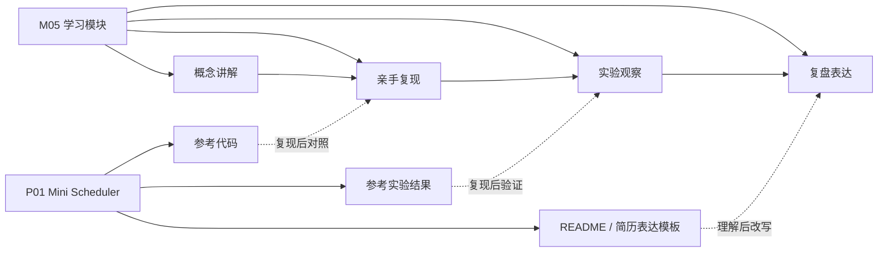

# 第 0 章：这门小教材怎么学

## 0.1 本章目标

学完这一章，你要先弄清楚三件事。

第一，M05 不是孤立学习一个算法，而是在学习“任务来了以后，系统如何安排资源”的工程能力。

第二，P01 Mini Scheduler 现在是参考答案，不是你已经完成的履历项目。

第三，后续学习不是看完文档就算完成，而是要亲手写代码、跑实验、解释结果、再把结论写回项目材料。

如果这三件事没有摆正，后面很容易走偏：看起来资料很多、项目很完整，但你自己并没有真正掌握。

## 0.2 M05 和 P01 的关系

M05 是学习模块，P01 是配套示范项目。

可以这样理解：

```text
M05 负责教你“为什么这样做、怎么一步步做、结果怎么看”。
P01 负责提供“做完以后大概应该长什么样”。
```

更具体一点：



这张图里最重要的是虚线：P01 是“复现后对照”，不是“先复制再解释”。

如果你一开始就直接拿 P01 的代码和结论当成果，会有两个问题。

第一，你很难在面试、汇报或后续项目里解释清楚为什么这样设计。别人一问 `available_at` 为什么在 Worker 上，或者为什么 SJF 平均等待低但 P99 可能变差，你就会卡住。

第二，你的项目表达会提前透支。README 和简历表达可以作为模板，但必须等你能自己复现核心逻辑、解释实验结果以后，才能变成你的成果表达。

## 0.3 当前阶段不做什么

当前阶段暂时不做这些事情：

- 不接 FastAPI。
- 不接数据库。
- 不接 Redis / Celery。
- 不接真实 RAG 请求。
- 不读 Kubernetes Scheduler 源码。
- 不做复杂 GPU 调度。
- 不把 P01 包装成已经完成的简历项目。

这不是降低目标，而是为了保护主线。

你现在最该练的是：

```text
把任务建模清楚，把调度策略写出来，把实验指标算明白，把结果解释成工程结论。
```

这些能力如果不扎实，后面接 API、数据库、Kubernetes 只会变成“堆技术名词”。

## 0.4 你应该怎么使用这份教材

每一章建议按五步学习。

第一步，先读概念讲解，不急着写代码。

你要先回答“为什么要学这个”。比如 FIFO 不是因为它高级，而是因为它是最容易解释、最适合做 baseline 的策略。

第二步，自己手写最小代码。

不要直接复制 P01。可以新建一个自己的练习文件，先写最小版本。例如第 2 章只写 `Task` 和 `Worker`，第 3 章只写 FIFO 和单 worker 执行循环。

第三步，运行一个小样例。

一开始不要追求复杂任务流。3 到 5 个任务就够了。你要能看出执行顺序、开始时间、完成时间、等待时间。

第四步，再对照 P01 参考答案。

对照的目的不是找“我哪里写得不一样”，而是看三个点：

- 参考答案多处理了哪些边界情况？
- 命名和结构是否更清楚？
- 哪些设计是为了后续实验扩展？

第五步，写复盘。

每章结束都要写几句话。不是写“完成了”，而是写：

```text
我学到的概念是什么？
代码里最关键的设计是什么？
实验结果说明了什么？
这个设计在真实 AI workload 里有什么局限？
```

## 0.5 本教材和外部资料怎么配合

这份教材不会试图替代所有外部资料。它更像是一条“适合你当前路线的学习主线”。

外部资料的使用方式是：少量、定向、能落地。

本模块主要绑定这些资料：

- [OSTEP Scheduling: Introduction](https://pages.cs.wisc.edu/~remzi/OSTEP/cpu-sched.pdf)：用来建立 FIFO、SJF、响应时间、公平性的基础直觉。
- [Python heapq 官方文档](https://docs.python.org/3/library/heapq.html)：用来实现优先队列、SJF 和成本排序。
- [Prometheus Histograms and Summaries](https://prometheus.io/docs/practices/histograms/)：用来理解 P95 / P99 为什么比平均值更能暴露尾部问题。
- [Kubernetes Scheduler 官方文档](https://kubernetes.io/docs/concepts/scheduling-eviction/kube-scheduler/)：用来把 Task / Worker 映射到 Pod / Node 的调度概念。
- [Kueue 官方文档](https://kueue.sigs.k8s.io/docs/)：用来理解 batch workload、queue、admission、quota。
- [Volcano 官方文档](https://volcano.sh/docs/home/introduction/)：用来理解 AI / HPC / batch scheduling 场景。

注意：第一轮不要把这些资料从头到尾啃完。第一轮只读和当前章节直接相关的部分，然后马上回到代码和实验。

## 0.6 第一轮学习的验收与检查标准

学完 M05 第一轮，你至少要能做到：

- 画出 Task -> Queue -> Scheduler -> Worker -> Metrics 的链路。
- 自己写出 `Task` 和 `Worker`。
- 自己写出 FIFO / Priority / SJF 三种策略。
- 自己计算 waiting time、turnaround time、P95、P99、worker utilization。
- 能解释为什么平均等待时间好，不代表尾延迟一定好。
- 能解释为什么增加 worker 会降低 P95，但也可能降低利用率。
- 能解释为什么 Cost-aware 调度没有唯一最优权重。
- 能把 P01 的结论改写成你自己的项目复盘。

如果这些做不到，就先不要急着进入 P03 或云原生调度。

## 0.7 本章你要做什么

这一章不要求写代码，但要求你完成两个动作。

第一个动作：在自己的笔记里写下 P01 的当前定位。

建议写成这样：

```text
P01 Mini Scheduler 当前是 M05 的参考实现和实验样板。我需要按章节亲手复现核心代码和实验，复现完成后才能把 README、图表和简历表达转化成自己的项目成果。
```

第二个动作：打开 P01 项目主页，只看结构，不看代码细节。

你要先找三个位置：

- `50_项目产出/P01_Mini_Scheduler/P01_Mini_Scheduler 项目主页.md`
- `50_项目产出/P01_Mini_Scheduler/mini_scheduler/scheduler/`
- `50_项目产出/P01_Mini_Scheduler/04_实验记录/`

现在只确认它们存在，不急着深入。

## 0.8 常见错误

最常见的错误是把“看懂了”当成“会了”。调度这类内容很容易产生错觉，因为文字解释看起来并不复杂，但一到代码和指标就会暴露问题。

第二个常见错误是过早追求真实系统。你现在不需要马上接 Kubernetes，不需要马上研究 Ray 或 vLLM 的调度细节。先把小模型里的任务、队列、worker、指标讲清楚，后面再看真实系统会轻松很多。

第三个常见错误是只看结果表。结果表告诉你发生了什么，但教材要训练的是你解释“为什么发生”。例如 SJF 平均等待时间低，背后是短任务提前完成减少了整体等待；但长任务可能被推迟，所以 P99 可能变差。

## 0.9 复盘问题

读完本章后，你应该能回答：

1. 为什么 P01 现在不能直接当作你的项目成果？
2. M05 和 P01 分别承担什么角色？
3. 为什么当前不继续扩展 FastAPI / Redis / Kubernetes？
4. 每章学习为什么必须包含“手写代码”和“实验解释”？
5. 你准备用什么标准判断自己真的掌握了 M05？

---
