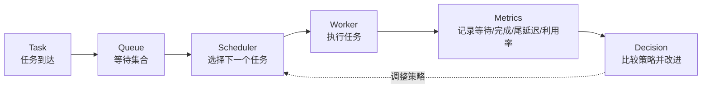

# 第 1 章：为什么调度不是简单排序

## 1.1 本章目标

本章要解决一个核心误解：

```text
调度不是把任务排个序这么简单。
```

排序只是调度里的一小步。真正的调度要回答的是：当资源有限、任务不断到来、任务重要性和成本不同的时候，系统如何做选择，并且如何证明这个选择更合理。

学完本章，你应该能做到：

- 说清楚调度和排序的区别。
- 画出 Task -> Queue -> Scheduler -> Worker -> Metrics 的完整链路。
- 理解为什么 AI / RAG / Agent workload 特别需要调度。
- 知道后续代码里为什么需要 Task、Queue、Scheduler、Worker、Metrics 这些角色。

## 1.2 先从一个直觉场景开始

假设你有一个很小的 AI 服务平台，同一时间来了四个任务。

| 任务 | 类型 | 到达时间 | 预计耗时 | 优先级 | token 数 | 场景 |
|---|---|---:|---:|---:|---:|---|
| A | RAG 查询 | 0 | 5 | 2 | 1200 | 普通用户问答 |
| B | Agent 工具调用 | 1 | 2 | 1 | 500 | 高优先级在线请求 |
| C | Embedding 批处理 | 2 | 1 | 3 | 3000 | 低优先级离线任务 |
| D | 长上下文总结 | 3 | 8 | 2 | 8000 | 高成本长任务 |

如果你说“按到达时间排序”，那就是 FIFO。

如果你说“按优先级排序”，那就是 Priority。

如果你说“按预计耗时排序”，那就是 SJF。

如果你说“综合耗时、token、优先级算一个成本分数”，那就是 Cost-aware 的雏形。

这些都像排序，但系统真正的问题不是“哪个排序函数看起来漂亮”，而是：

- 高优先级任务是否应该插队？
- 短任务是否应该提前做，以降低平均等待？
- 长任务一直被短任务插队，会不会饿死？
- token 很高的任务是否应该后放？
- 如果用户体验看 P95/P99，而不是平均值，结论会不会变？
- 如果 worker 从 1 个变成 8 个，策略差异还明显吗？

这些问题已经超出了普通排序。

## 1.3 排序只决定“候选顺序”，调度还要处理“系统状态”

排序面对的是一个静态列表。

调度面对的是一个会变化的系统。

静态排序可以这样想：

```text
给我一组任务，我按某个 key 排好。
```

调度则更接近：

```text
任务不断到来，worker 有忙有闲，当前时间不断前进；每次 worker 空出来时，只能从已经到达的任务里选一个执行。执行后还要记录开始时间、完成时间和指标。
```

这就是为什么调度需要时间概念。

一个任务有 `submit_time`，表示它什么时候进入系统。worker 有 `available_at`，表示它什么时候空出来。调度器每次做选择时，不能选择未来才到达的任务。

例如任务 D 虽然很重要，但它 `submit_time=3`。如果当前时间是 1，它还没有进入系统，就不应该被调度。

这也是为什么 P01 的参考代码里，单 worker 模拟不是简单 `sorted(tasks)` 后直接结束，而是有一个循环：

```text
还有任务没完成吗？
  找出当前时间已经到达的任务
  如果没有任务可执行，就把时间推进到下一个任务到达
  按策略选择下一个任务
  计算 start_time 和 finish_time
  更新 worker.available_at
  记录任务完成结果
```

这一段循环，才是调度比排序更接近真实系统的地方。

## 1.4 最小调度链路

M05 的核心链路可以画成这样：



这张图里每个节点都很重要。

Task 是被调度的工作单位。没有 Task 建模，就不知道一个任务有什么属性，也不知道它和另一个任务有什么差异。

Queue 是等待集合。它不是随便一个列表，而是“当前还没有被执行、但可能被调度器选择”的任务集合。

Scheduler 是决策者。它不执行任务，只负责选择下一个任务。

Worker 是执行资源。它可能是一个线程、进程、容器、GPU worker，或者抽象的执行槽位。

Metrics 是反馈系统。没有指标，策略好坏只能靠感觉。

Decision 是工程闭环。你不是写完一个排序函数就结束，而是要用指标比较策略，然后决定是否继续改。

## 1.5 为什么 AI workload 更需要调度

普通 Web 请求当然也需要调度，但 AI workload 的差异更大。

一个 RAG 请求可能很快，也可能因为检索结果多、上下文长而变慢。

一个 Agent 任务可能调用多个工具，中间还可能等待外部 API。

一个 embedding 批处理任务可能不急，但 token 数很大，长期占用资源。

一个长上下文总结任务可能对单个用户重要，但对整体系统成本很高。

这些任务之间至少有四类差异：

- 时间差异：有的任务 1 秒，有的任务 30 秒。
- 重要性差异：在线请求通常比离线任务更急。
- 成本差异：token、模型、工具调用次数会影响成本。
- 体验差异：用户通常更敏感于尾部延迟，而不是平均延迟。

所以 AI workload 调度不是只问“谁先来”，而是问：

```text
在当前资源有限的情况下，我怎样安排任务，才能在平均效率、尾部体验、成本和公平性之间取得可解释的平衡？
```

这就是 M05 的价值。

## 1.6 三种基础策略代表三种取舍

后续你会先学 FIFO、Priority、SJF。它们不是随便选的，而是代表三种非常基础的工程取舍。

FIFO 代表简单和公平感。

它的规则是先到先服务。好处是稳定、容易解释、适合作为 baseline。坏处是如果前面来了一个长任务，后面的短任务也要等，这叫 convoy effect。

Priority 代表业务重要性。

它的规则是优先级高的任务先执行。好处是能照顾关键任务。坏处是低优先级任务可能一直被推迟，出现 starvation 风险。

SJF 代表平均效率。

它的规则是短任务先执行。好处是通常能降低平均等待时间。坏处是长任务可能被牺牲，而且真实系统里任务耗时往往只能估计。

可以把三者关系记成：

```text
FIFO：我尊重到达顺序。
Priority：我尊重业务重要性。
SJF：我尊重预计处理效率。
```

没有哪个策略永远最好。调度学习最重要的不是背答案，而是学会解释取舍。

> **可迁移的原则**：**没有最优的调度策略，只有适合特定目标的取舍（no best policy, only trade-offs）。** 这是贯穿整个 M05、也是整个系统工程的一条核心原则，值得你现在就立在心里。
>
> 这不是一句鸡汤，而是有硬道理的。每个策略都在优化某一个目标，而**优化一个目标几乎总是以牺牲另一个为代价**——FIFO 优化"公平/简单"，代价是长任务拖垮短任务；SJF 优化"平均等待"，代价是长任务被无限推后；Priority 优化"重要任务",代价是低优任务饿死。你不可能同时把"平均延迟最低、尾部延迟最低、绝对公平、零饥饿"全占了，因为它们彼此冲突。
>
> 所以从第 3 章起，每学一个策略，你都要问同一组问题、而不是找"最好的那个"：
> - 它在优化**什么**目标？
> - 为了这个目标，它**牺牲了谁**？
> - 在**什么负载、什么资源**下，这个取舍才划算？
>
> 这套"识别取舍"的思维会一路迁移：M08 评估系统性能、P03 给 RAG/Agent 任务选调度策略、乃至你以后做任何资源分配决策，本质都是在不同目标间做有意识的取舍。**M05 真正教你的不是四个排序函数，是"看穿每个技术选择背后牺牲了什么"的眼光。** 这也是 OSTEP（操作系统经典教材）讲调度时反复强调的同一件事。

## 1.7 为什么平均值不够

调度实验里最容易犯的错误是只看平均等待时间。

平均值很重要，但它会掩盖尾部问题。

假设 100 个任务里，95 个任务都很快，5 个任务等了非常久。平均值可能还不错，但那 5 个任务的体验很糟糕。如果这些任务是高价值用户、关键业务或者长上下文 Agent 请求，问题就更严重。

所以后续必须同时看：

- average waiting time
- max waiting time
- P95 waiting time
- P99 waiting time
- worker utilization
- queue length

这里 P95 / P99 的意义是：观察尾部任务的等待情况。

在 P01 的高峰负载实验里，已经出现过这种现象：SJF / Cost-aware 能降低平均等待时间，但最大等待和 P99 可能更差。这说明它们改善了整体效率，却可能牺牲一部分任务。

这不是坏事，也不是好事，它是一个需要被看见的取舍。

## 1.8 资源数量也会改变结论

调度策略不是孤立存在的，它和资源数量强相关。

P01 的 worker 数量实验里，FIFO 在高峰任务流下有一个很直观的结果：

| worker 数量 | P95 等待时间 | worker 利用率 |
|---:|---:|---:|
| 1 | 97.70 | 0.97 |
| 2 | 42.80 | 0.86 |
| 4 | 15.70 | 0.61 |
| 8 | 3.50 | 0.30 |

这个结果告诉你两件事。

第一，增加 worker 确实能显著降低 P95。资源多了，排队自然少。

第二，worker 越多，利用率可能越低。8 个 worker 的 P95 很好看，但利用率只有 0.30，说明资源可能大量空闲。

所以工程上不能只说“加机器就行”，也不能只说“换策略就行”。真正要比较的是：

```text
延迟下降了多少？资源成本增加了多少？利用率牺牲了多少？
```

这就是为什么本模块要同时学调度策略和指标。

## 1.9 本章对应到 P01 的哪些文件

本章不要求你马上读代码，但你需要知道后续会对照哪些参考答案。

P01 里对应关系如下：

| 教材概念 | P01 参考位置 | 用途 |
|---|---|---|
| Task / Worker | `mini_scheduler/scheduler/models.py` | 看任务和执行资源如何建模 |
| FIFO / Priority / SJF | `mini_scheduler/scheduler/strategies.py` | 看策略如何变成排序键 |
| 单 worker 调度循环 | `mini_scheduler/scheduler/simulator.py` | 看时间推进和 worker 状态更新 |
| 指标计算 | `mini_scheduler/scheduler/metrics.py` | 看等待时间、周转时间、P95/P99 如何计算 |
| 架构图 | `mini_scheduler/artifacts/mini_scheduler_architecture.svg` | 对照 Task -> Queue -> Scheduler -> Worker -> Metrics |
| 实验结果 | `04_实验记录/FIFO_vs_Priority_vs_SJF.md` | 看策略差异如何写成项目分析 |

注意：现在只是知道位置，不建议立刻照抄。后面每章会明确什么时候看哪一段。

## 1.10 本章你要做什么

这一章的动手任务不复杂，但很关键。

第一，画一遍最小调度链路。

你可以手画，也可以在 Obsidian 里写 Mermaid。必须包含：

```text
Task -> Queue -> Scheduler -> Worker -> Metrics
```

第二，用自己的话解释每个节点。

不要抄定义，写成你能理解的句子。例如：

```text
Worker 不是任务本身，而是执行任务的资源。Worker 有 available_at，因为它可能正在忙，不能随时接新任务。
```

第三，写下三个调度策略的取舍。

建议用这种格式：

```text
FIFO 优化的是可解释性和到达顺序公平，但可能被长任务拖慢。
Priority 优化的是重要任务响应，但可能牺牲低优先级任务。
SJF 优化的是平均等待时间，但可能牺牲长任务。
```

第四，先不要写代码，只打开 P01 的架构图看一眼。

参考位置：

```text
50_项目产出/P01_Mini_Scheduler/mini_scheduler/artifacts/mini_scheduler_architecture.svg
```

你要确认这张图和本章链路是否一致。

## 1.11 常见错误

第一个错误：把调度等同于排序。

排序是静态的，调度是动态的。调度要考虑任务到达时间、worker 可用时间、当前队列、执行结果和指标。

第二个错误：一上来就追求最优策略。

M05 第一轮不需要最优策略。你需要先能解释 baseline，再比较策略。没有 baseline，就不知道“改进”到底改了什么。

第三个错误：只看平均等待。

平均等待降低，但 P99 变差，在工程里很常见。尤其是在线服务或多租户系统，尾部任务可能代表最差用户体验。

第四个错误：忽略资源成本。

worker 数量增加能改善延迟，但可能降低利用率。调度和扩容要一起看。

## 1.12 复盘问题

读完本章后，你应该能回答：

1. 为什么调度不是简单排序？
2. `submit_time` 和 `available_at` 分别解决什么问题？
3. Queue 为什么不是一个普通列表那么简单？
4. FIFO / Priority / SJF 分别优化什么、牺牲什么？
5. 为什么 P95 / P99 对 AI workload 很重要？
6. 为什么 worker 数量会改变策略效果？
7. 如果你要给别人介绍 P01，你会如何用 1 分钟讲清它的核心问题？

## 1.13 本章检查标准

- 能画出 Task -> Queue -> Scheduler -> Worker -> Metrics 的最小链路。
- 能解释排序和调度的区别。
- 能说明 FIFO / Priority / SJF 分别代表什么取舍。
- 能解释为什么平均等待不足以判断调度效果。
- 能说明 worker 数量为什么会改变延迟和利用率。
- 能用 1 分钟讲清 P01 解决的核心问题。

## 1.14 本章小结

本章最重要的结论是：

```text
调度是资源有限条件下的持续决策，不是一次性的任务排序。
```

你后面写的每一段代码，都服务于这句话。

Task 让任务差异可描述。

Queue 让等待集合可管理。

Scheduler 让选择规则可替换。

Worker 让资源状态可计算。

Metrics 让策略优劣可比较。

只要这条链路稳住，后面的 FIFO、Priority、SJF、Cost-aware、aging、多 worker，就不是零散知识点，而是在同一个系统骨架上的逐步增强。

---
