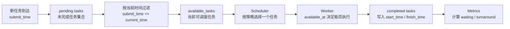

# 第 2 章：Task / Worker / Queue 最小模型

## 2.1 本章目标

第 1 章解决的是“为什么需要调度”。第 2 章开始解决“调度系统里到底有什么对象”。

学完本章，你要能做到：

- 解释 `Task`、`Worker`、`Queue` 分别代表什么。
- 说清楚 `submit_time`、`estimated_duration`、`priority`、`available_at` 这些字段为什么需要存在。
- 手写一个最小版本的 `Task` 和 `Worker`。
- 构造 3 到 5 个任务，观察它们为什么不能只靠一个普通列表随便处理。
- 明白 P01 参考答案里的 `models.py` 为什么这样写。

本章先不追求完整调度器，只把模型搭稳。模型稳了，后面的 FIFO、Priority、SJF 才有地方落。

## 2.2 为什么先学建模，而不是直接写排序函数

很多人写调度器时会一上来写：

```python
tasks.sort(key=lambda x: x.priority)
```

这不是不能写，而是太早了。

如果任务只是一个数字列表，比如 `[3, 1, 2]`，排序当然很简单。但真实任务不是一个数字，它至少有这些信息：

- 它是谁。
- 它什么时候到达。
- 它预计要执行多久。
- 它是否重要。
- 它属于哪类业务。
- 它是否已经开始。
- 它是否已经完成。

调度不是在排数字，而是在安排一组带有时间、状态和业务含义的对象。

所以第一步不是写策略，而是先把对象建出来。

可以把调度系统想成一个小剧场：

```text
Task 是等待上场的演员。
Queue 是候场区。
Scheduler 是场务，决定下一个谁上。
Worker 是舞台，真正执行任务。
Metrics 是记录员，记录谁等了多久、谁用了多少时间。
```

如果演员的信息都没登记清楚，场务就不可能做出稳定决策。

## 2.3 Task：被调度的工作单位

`Task` 是系统里最重要的对象。它代表一个需要被执行的工作。

在 AI workload 场景里，一个 Task 可以对应：

- 一次 RAG 查询。
- 一次 Agent 工具调用。
- 一批 embedding 生成任务。
- 一次长上下文总结。
- 一个离线评测任务。

它们都叫 Task，但它们的调度价值不一样。

一个最小 Task 至少要回答五个问题。

| 问题 | 对应字段 | 为什么需要 |
|---|---|---|
| 这个任务是谁？ | `id` | 用来追踪、打印、测试和记录结果 |
| 它属于什么类型？ | `task_type` | 后续做分组分析，判断谁被牺牲 |
| 它重要吗？ | `priority` | 支持 Priority 策略和业务优先级 |
| 它大概要跑多久？ | `estimated_duration` | 支持 SJF、成本估计和模拟执行时间 |
| 它什么时候进入系统？ | `submit_time` | 决定它什么时候能被调度 |

后续还会加一些执行结果字段：

| 字段 | 含义 | 谁来更新 |
|---|---|---|
| `start_time` | 任务真正开始执行的时间 | 调度模拟器 |
| `finish_time` | 任务执行完成的时间 | 调度模拟器 |
| `status` | pending / queued / running / succeeded / failed 等状态 | 调度流程 |
| `token_count` | token 数或近似成本 | workload 构造器或真实请求 |

这里先注意一个非常关键的点：`submit_time` 和 `start_time` 不是一回事。

`submit_time` 是任务进入系统的时间。

`start_time` 是 worker 真正开始处理它的时间。

二者的差值就是等待时间：

```text
waiting_time = start_time - submit_time
```

如果这两个字段混在一起，后面就算不出等待时间，也就没法比较调度策略。

## 2.4 Task 字段逐个讲清楚

### id

`id` 是任务编号。

在小实验里，它可能只是 `task-001`。在真实系统里，它可能是请求 ID、Job ID、Trace ID 或数据库主键。

它的作用不是参与复杂算法，而是让你能追踪任务：

```text
task-003 为什么等了这么久？
task-004 为什么最后才执行？
哪一个任务拉高了 P99？
```

没有 `id`，你只能看到一堆数字，很难调试。

### task_type

`task_type` 表示任务类型。

例如：

```text
rag_query
agent_tool
embedding
long_context
batch_eval
```

它一开始看起来不影响调度，但后面非常重要。因为你不能只看总平均等待时间，还要看不同任务类型谁被改善、谁被牺牲。

比如 Cost-aware 权重实验里，某个策略整体平均等待变好了，但 `short_high_token` 这类任务可能被严重推迟。如果没有 `task_type`，这个副作用就看不出来。

### priority

`priority` 表示业务优先级。

当前 P01 约定：

```text
priority=1 表示最高优先级。
数字越大，优先级越低。
```

这个约定必须稳定。不要一会儿数字越小越重要，一会儿数字越大越重要。调度策略最怕口径不一致。

在 AI 平台里，priority 可以表示：

- 在线请求优先于离线批处理。
- 付费用户优先于普通任务。
- 紧急任务优先于后台任务。
- 人工触发任务优先于自动清洗任务。

但 priority 也有风险：如果一直让高优先级任务先执行，低优先级任务可能长期等不到机会。后面第 10 章讲 aging 时会专门处理这个问题。

### estimated_duration

`estimated_duration` 表示预计耗时。

它是 SJF 和 Cost-aware 的基础字段。

在模拟项目里，我们可以直接给它一个数，比如 `2.0`、`5.0`、`8.0`。在真实 AI 系统里，它往往来自估计：

- prompt 长度。
- token 数。
- 检索文档数量。
- 是否需要工具调用。
- 过去相似任务的历史耗时。

这里有一个工程事实：预计耗时不一定准。

所以 SJF 并不是“绝对聪明”的策略。它依赖估计质量。如果估计错了，调度结果也会变差。

### submit_time

`submit_time` 表示任务什么时候到达系统。

这个字段让调度从静态排序变成动态过程。

调度器不能执行未来才到达的任务。例如：

```text
当前时间 = 1.0
task-D.submit_time = 3.0
```

这时 task-D 还不应该被选中。

没有 `submit_time`，你写出来的调度器就更像“离线排序器”，而不是“任务不断到达的系统”。

### token_count

`token_count` 不是最小调度器必需字段，但在 AI workload 里很有价值。

因为 LLM / RAG / Agent 的成本不只由时间决定。token 数会影响：

- 推理成本。
- 模型调用时间。
- 上下文长度。
- 资源占用。

后面 Cost-aware 调度会把 `estimated_duration`、`token_count`、`priority` 组合成一个成本分数。

第一轮你可以先把 `token_count` 当作附加字段，不急着用它做策略。

## 2.5 Worker：真正执行任务的资源

`Worker` 代表执行资源。

在不同系统里，Worker 可以对应不同东西：

| 当前教材里的 Worker | 真实系统里可能对应 |
|---|---|
| 一个模拟执行槽位 | 一个线程 |
| 一个 Python worker | 一个进程 |
| 一个推理实例 | 一个模型服务副本 |
| 一个容器 | 一个 Kubernetes Pod |
| 一个节点资源 | 一台机器或 GPU 卡 |

第一轮不要把它想复杂。你只需要记住：

```text
Worker 不是任务本身，而是执行任务的资源。
```

Worker 至少需要三个字段。

| 字段 | 含义 | 为什么需要 |
|---|---|---|
| `id` | worker 编号 | 多 worker 时区分资源 |
| `available_at` | worker 什么时候空闲 | 决定下一个任务能什么时候开始 |
| `current_task_id` | 当前正在执行哪个任务 | 便于观察状态 |

P01 里还加了一个字段：

| 字段 | 含义 | 用途 |
|---|---|---|
| `total_busy_time` | worker 累计忙碌时间 | 计算 worker 利用率 |

`available_at` 是 Worker 里最关键的字段。

假设 worker 从时间 0 开始执行一个耗时 5 秒的任务，那么：

```text
worker.available_at = 5.0
```

这表示在时间 5.0 之前，这个 worker 都不能接新任务。

如果后面有一个任务在时间 2.0 到达，它也不能立刻开始，只能等 worker 空出来。

这就是等待时间产生的根源。

## 2.6 Queue：等待集合，不只是 Python list

Queue 是等待执行的任务集合。

初学时可以先用 Python `list` 表示 Queue，但概念上要更清楚一点。

Queue 不是“所有任务的列表”，而是：

```text
已经到达系统、尚未完成、等待被调度器选择的任务集合。
```

这里有三个限制：

第一，未来才到达的任务不应该进入当前可调度集合。

第二，已经完成的任务不应该继续留在 Queue 里。

第三，正在执行的任务也不应该再被选择一次。

所以后面模拟器里会有两个概念：

```text
pending：还没完成的任务。
available_tasks：当前时间已经到达、可以被选择的任务。
```

这两个概念不一样。

例如：

| task | submit_time | 当前时间 2.0 时是否 available |
|---|---:|---|
| task-001 | 0.0 | 是 |
| task-002 | 1.0 | 是 |
| task-003 | 3.0 | 否 |

task-003 可能在 pending 里，但不在 available_tasks 里。

这就是为什么调度循环不能只写 `sorted(pending)[0]`。你必须先过滤当前已经到达的任务。

## 2.7 Task / Worker / Queue 的关系图

可以用下面这张图理解本章关系：



这张图是后面写代码的骨架。

你现在不用马上实现完整版本，但要先理解数据怎么流。

## 2.8 最小代码：先手写 Task 和 Worker

现在可以写第一段代码。

建议你先新建一个自己的练习文件，比如：

```text
scratch/m05_ch02_models.py
```

如果暂时不想建文件，也可以直接在 Python 交互环境里写。

最小版本如下：

```python
from dataclasses import dataclass
from typing import Optional


@dataclass
class Task:
    id: str
    task_type: str
    priority: int
    estimated_duration: float
    submit_time: float
    token_count: int = 0
    start_time: Optional[float] = None
    finish_time: Optional[float] = None
    status: str = "pending"


@dataclass
class Worker:
    id: str
    available_at: float = 0.0
    current_task_id: Optional[str] = None
    total_busy_time: float = 0.0
```

这段代码用到了 `dataclass`。

你可以先把 `dataclass` 理解为：它帮你少写很多模板代码，让 Python 自动生成初始化方法。也就是说，你可以这样创建对象：

```python
task = Task(
    id="task-001",
    task_type="rag_query",
    priority=2,
    estimated_duration=5.0,
    submit_time=0.0,
    token_count=1200,
)

worker = Worker(id="worker-1")
```

然后你可以打印它：

```python
print(task)
print(worker)
```

你会看到对象里的字段。

这里先不要急着写调度逻辑。先确认对象本身能创建、能打印、字段含义你能说清楚。

## 2.9 构造 4 个任务

接下来构造第 1 章里的 4 个任务。

```python
tasks = [
    Task(
        id="task-001",
        task_type="rag_query",
        priority=2,
        estimated_duration=5.0,
        submit_time=0.0,
        token_count=1200,
    ),
    Task(
        id="task-002",
        task_type="agent_tool",
        priority=1,
        estimated_duration=2.0,
        submit_time=1.0,
        token_count=500,
    ),
    Task(
        id="task-003",
        task_type="embedding",
        priority=3,
        estimated_duration=1.0,
        submit_time=2.0,
        token_count=3000,
    ),
    Task(
        id="task-004",
        task_type="long_context",
        priority=2,
        estimated_duration=8.0,
        submit_time=3.0,
        token_count=8000,
    ),
]
```

现在先做三个观察。

第一，按到达时间看：

```python
print([task.id for task in sorted(tasks, key=lambda task: task.submit_time)])
```

你应该看到：

```text
['task-001', 'task-002', 'task-003', 'task-004']
```

第二，按优先级看：

```python
print([task.id for task in sorted(tasks, key=lambda task: (task.priority, task.submit_time))])
```

你应该看到：

```text
['task-002', 'task-001', 'task-004', 'task-003']
```

第三，按预计耗时看：

```python
print([task.id for task in sorted(tasks, key=lambda task: (task.estimated_duration, task.submit_time))])
```

你应该看到：

```text
['task-003', 'task-002', 'task-001', 'task-004']
```

先不要急着判断谁最好。

你要观察的是：同一组任务，只要排序口径不同，顺序就会改变。这说明 Task 字段决定了调度策略能看见什么。

## 2.10 当前时间会改变可调度任务

现在加入当前时间。

假设：

```python
current_time = 1.0
```

那么当前可调度任务应该是：

```python
available_tasks = [
    task for task in tasks
    if task.submit_time <= current_time
]

print([task.id for task in available_tasks])
```

你应该看到：

```text
['task-001', 'task-002']
```

虽然 `task-003` 最短，但它 `submit_time=2.0`，当前时间 1.0 时还没到达，所以不能被调度。

这一步特别重要。

如果你不做 `submit_time <= current_time` 过滤，SJF 可能会错误地选择一个未来才到达的短任务。这就不是调度，而是“提前知道未来的离线排序”。

## 2.11 Worker 的 available_at 如何影响开始时间

现在创建一个 worker：

```python
worker = Worker(id="worker-1", available_at=0.0)
```

假设它要执行 `task-001`。

任务开始时间应该是：

```python
task = tasks[0]
start_time = max(worker.available_at, task.submit_time)
finish_time = start_time + task.estimated_duration
```

为什么要用 `max`？

因为任务开始必须同时满足两个条件：

```text
任务已经到达。
worker 已经空闲。
```

如果任务早就到了，但 worker 很忙，就要等 worker。

如果 worker 很早就空闲，但任务还没到，就要等任务到达。

所以：

```text
start_time = max(worker.available_at, task.submit_time)
```

这是调度模拟里最核心的时间公式之一。

执行完成后，你需要更新：

```python
task.start_time = start_time
task.finish_time = finish_time
task.status = "succeeded"

worker.available_at = finish_time
worker.total_busy_time += task.estimated_duration
```

这时 waiting time 可以算出来：

```python
waiting_time = task.start_time - task.submit_time
```

第 3 章写 FIFO 时，会把这几行放进循环里。

## 2.12 本章小实验：手动执行一个任务

你现在做一个非常小的实验，不写完整调度器，只手动执行 `task-001`。

完整代码大概这样：

```python
worker = Worker(id="worker-1")
task = tasks[0]

start_time = max(worker.available_at, task.submit_time)
finish_time = start_time + task.estimated_duration

task.start_time = start_time
task.finish_time = finish_time
task.status = "succeeded"

worker.current_task_id = task.id
worker.available_at = finish_time
worker.total_busy_time += task.estimated_duration
worker.current_task_id = None

print(task.id, task.start_time, task.finish_time, task.status)
print(worker)
```

你应该能解释：

```text
task-001 从 0.0 开始，5.0 完成。
worker-1 的 available_at 更新为 5.0。
worker 的 total_busy_time 增加 5.0。
```

如果这一步解释不清，先不要进入 FIFO。因为 FIFO 只是把这个动作重复很多次。

## 2.13 和 P01 参考答案对照

完成上面练习后，再看 P01 的参考答案：

```text
50_项目产出/P01_Mini_Scheduler/mini_scheduler/scheduler/models.py
```

当前参考模型大致是：

```python
@dataclass
class Task:
    id: str
    task_type: str
    priority: int
    estimated_duration: float
    submit_time: float
    token_count: int = 0
    start_time: Optional[float] = None
    finish_time: Optional[float] = None
    status: str = "pending"


@dataclass
class Worker:
    id: str
    available_at: float = 0.0
    current_task_id: Optional[str] = None
    total_busy_time: float = 0.0
```

你要对照三个点。

第一，字段是否和你手写的一致。

第二，哪些字段是输入字段，哪些字段是运行后才写入的结果字段。

输入字段包括：

```text
id
task_type
priority
estimated_duration
submit_time
token_count
```

运行结果字段包括：

```text
start_time
finish_time
status
```

第三，Worker 为什么不记录一个任务列表，而只记录 `current_task_id`、`available_at` 和 `total_busy_time`。

原因是：当前阶段的 Worker 只负责模拟“什么时候空闲”和“忙了多久”。完整历史可以由 completed tasks 记录，不需要都塞进 Worker 里。

## 2.14 常见错误

第一个错误：把 `submit_time` 写成 `start_time`。

这会让等待时间永远算不清。`submit_time` 是任务进入系统，`start_time` 是 worker 开始处理。

第二个错误：忘记给任务状态默认值。

如果没有 `status="pending"`，后面很难判断任务有没有完成。

第三个错误：priority 口径混乱。

当前约定是数字越小优先级越高。后续所有实验都按这个口径。

第四个错误：把 Queue 当成所有任务的列表。

Queue 更准确地说，是等待被调度的集合。当前时间没到达的任务不能被选，已经完成的任务也不能再选。

第五个错误：过早设计复杂类。

当前不要急着写 `Scheduler` 类、`Queue` 类、数据库模型或异步执行器。第一轮用简单 dataclass 和 list 就够了。

## 2.15 本章你要做什么

本章任务分四步。

第一步，手写 `Task` 和 `Worker`。

第二步，构造 4 个任务：

```text
rag_query
agent_tool
embedding
long_context
```

第三步，分别按 `submit_time`、`priority`、`estimated_duration` 打印任务顺序。

第四步，手动执行 `task-001`，更新 `start_time`、`finish_time`、`status`、`worker.available_at`。

完成后写一段复盘：

```text
我现在能解释 Task / Worker / Queue 的关系。
我知道 submit_time 和 start_time 不一样。
我知道 available_at 是 worker 状态的核心。
我知道后续 FIFO 只是按到达顺序反复选择并执行任务。
```

## 2.16 本章复盘问题

你可以用下面问题检查自己是否真的掌握。

1. `Task` 为什么需要 `submit_time`？
2. `Worker` 为什么需要 `available_at`？
3. `start_time = max(worker.available_at, task.submit_time)` 这行为什么合理？
4. `pending` 和 `available_tasks` 有什么区别？
5. 为什么 `task_type` 对后续实验分析有用？
6. 为什么当前阶段不需要先写复杂的 Queue 类？
7. 如果一个任务 `submit_time=10`，当前时间是 `5`，它能被调度吗？

## 2.17 本章检查标准

- 能手写 `Task` 和 `Worker` 的最小 dataclass。
- 能解释 `submit_time`、`start_time`、`finish_time` 的区别。
- 能说明 `priority`、`estimated_duration`、`token_count` 为什么是调度输入。
- 能解释 `available_at` 为什么是 Worker 状态的核心。
- 能区分 pending tasks、available tasks 和 completed tasks。
- 能手动执行一个任务，并更新任务状态和 worker 状态。

如果这些问题能说清楚，就可以进入第 3 章：FIFO baseline。

---
