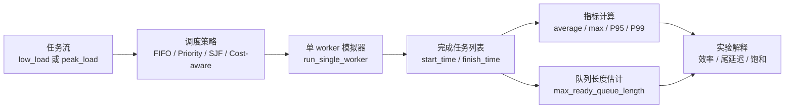

# 第 7 章：高峰负载实验

## 7.1 本章目标

前面几章已经把 Task / Worker / Queue、FIFO、Priority、SJF 和指标体系搭起来了。

但小样例有一个天然限制：任务太少、排队太短，很多策略差异不会充分显现。

这一章开始进入真正的实验思维：同一套调度策略，在低负载和高峰负载下，表现会完全不同。

学完本章，你应该能做到：

- 解释低负载和高峰负载的区别。
- 构造一个会产生排队积压的任务流。
- 用同一组任务比较 FIFO / Priority / SJF / Cost-aware。
- 读懂 average wait、max wait、P95、P99、max queue length、worker utilization。
- 解释为什么高峰负载会放大策略差异。
- 明白为什么“平均等待最低”不等于“策略最好”。

本章仍然不进入多 worker、aging、真实 RAG 请求、Kubernetes 或 GPU 调度。

本章只解决一个问题：

```text
为什么低负载下策略差异不明显，而高峰负载会放大平均等待、P95/P99 和最大等待的差异？
```

## 7.2 为什么要单独学高峰负载

很多系统平时看起来都没有问题。

用户少、任务少、worker 空闲时，FIFO、Priority、SJF 可能都差不多。因为任务一到就能执行，队列里没有多少等待任务，调度策略几乎没有发挥空间。

真正考验调度系统的是高峰：

```text
短时间内任务到达速度 > worker 处理速度
```

一旦这个条件成立，任务会在队列里堆起来。队列一堆起来，调度策略才真正开始影响结果：

- FIFO 会让先来的任务先走，行为稳定，但可能让短任务被长任务挡住。
- Priority 会优先保护高优先级任务，但可能牺牲低优先级任务。
- SJF 会优先处理短任务，降低平均等待，但可能让长任务一直往后排。
- Cost-aware 会把耗时、token、优先级揉成一个成本分数，但公式权重会影响谁被照顾、谁被牺牲。

所以高峰负载不是“把任务数量加大”这么简单。

它是调度系统从“看起来能跑”进入“必须做取舍”的分界线。

## 7.3 低负载和高峰负载的核心差别

先用一句话区分：

```text
低负载：worker 经常等任务。
高峰负载：任务经常等 worker。
```

低负载下，任务到达间隔比较大。

例如：

```text
task-001 submit_time=0, duration=1
task-002 submit_time=4, duration=1
task-003 submit_time=8, duration=1
```

worker 在 0-1 执行第一个任务，1-4 空闲等待第二个任务，4-5 执行第二个任务，5-8 又空闲。

这种情况下，队列很少积压。就算你换调度策略，策略也没什么可选，因为每次可能只有一个任务已经到达。

高峰负载下，任务到达间隔很短。

例如：

```text
task-001 submit_time=20.00, duration=8
task-002 submit_time=20.25, duration=1
task-003 submit_time=20.50, duration=2
task-004 submit_time=20.75, duration=6
```

worker 如果正在执行一个 8 秒任务，后面几个任务会不断堆进队列。

当 worker 再次空闲时，队列里已经有多个候选任务。

这时调度器才需要真正回答：

```text
下一步应该选谁？
```

## 7.4 高峰负载的数据流

本章的数据流可以画成这样：



你要注意，这里不是先看策略名字再下结论。

正确顺序是：

```text
先看任务流 -> 再看队列是否积压 -> 再看指标 -> 最后解释策略取舍
```

如果跳过任务流和队列积压，只看一张结果表，很容易得出错误结论。

## 7.5 本章任务流设计

P01 里已经准备了两组任务流：

```text
mini_scheduler/scheduler/workloads.py
```

对应函数是：

```python
build_low_load_tasks()
build_peak_load_tasks()
```

### 低负载任务流

低负载任务流的特点是：任务之间隔得比较开。

P01 里当前使用 24 个任务，提交时间大致按下面方式增长：

```python
submit_time=index * 4.0
```

也就是说，每 4 个时间单位才来一个任务。

任务耗时大致在：

```text
1.0 / 1.5 / 2.0 / 3.0 / 5.0
```

这会造成一个很重要的现象：

```text
worker 有时忙，有时空闲，队列很难长时间堆积。
```

所以低负载任务流的作用不是制造压力，而是作为对照组。

它告诉你：

```text
当系统没有排队压力时，调度策略差异可能很小。
```

### 高峰负载任务流

高峰负载任务流分三段：

```text
warmup：先来 8 个平稳任务
burst：再来 36 个密集任务
cooldown：最后来 8 个恢复期任务
```

最关键的是 burst 段。

P01 中 burst 段从 `submit_time=20.0` 开始，每隔 `0.25` 到达一个任务：

```python
submit_time=20.0 + index * 0.25
```

这意味着 1 个时间单位里会来 4 个任务。

但任务耗时可能是：

```text
1.0 / 1.2 / 1.5 / 2.0 / 6.0 / 8.0
```

单个 worker 不可能马上处理完。

于是高峰段会制造积压：

```text
任务到达速度明显超过 worker 处理速度。
```

这就是本章实验的核心。

## 7.6 手写一个最小高峰任务流

先不要急着跑 P01。

你应该先手写一个更小的高峰任务流，理解它为什么会积压。

可以从这个版本开始：

```python
from dataclasses import dataclass


@dataclass
class Task:
    id: str
    task_type: str
    priority: int
    estimated_duration: float
    submit_time: float
    token_count: int = 0
    start_time: float | None = None
    finish_time: float | None = None


def build_tiny_peak_tasks() -> list[Task]:
    return [
        Task("warmup-001", "rag_query", 2, 2.0, 0.0, 900),
        Task("warmup-002", "rag_query", 2, 2.0, 2.0, 900),
        Task("burst-001", "agent_tool", 1, 1.0, 5.00, 600),
        Task("burst-002", "long_context", 3, 8.0, 5.25, 8000),
        Task("burst-003", "embedding", 2, 1.2, 5.50, 3000),
        Task("burst-004", "batch_job", 3, 6.0, 5.75, 9000),
        Task("burst-005", "rag_query", 2, 2.0, 6.00, 1200),
    ]
```

你要观察的不是这几个任务本身，而是它们的到达节奏：

```text
5.00
5.25
5.50
5.75
6.00
```

这些任务几乎同时到达。

如果 worker 在某个长任务上被占住，后面的任务就会排队。

这就是高峰负载的最小形态。

## 7.7 高峰负载下为什么策略差异会变大

调度策略只有在“有多个可选任务”时才真正生效。

如果当前时间只有一个任务可选：

```text
available_tasks = [task-001]
```

FIFO、Priority、SJF 选出来都是 `task-001`。

但高峰负载下，worker 空闲时可能看到：

```text
available_tasks = [
    burst-002 duration=8.0 priority=3
    burst-003 duration=1.2 priority=2
    burst-004 duration=6.0 priority=3
    burst-005 duration=2.0 priority=2
]
```

这时不同策略会选择不同任务：

| 策略 | 可能选择 | 原因 |
|---|---|---|
| FIFO | 最早到达的任务 | 按 submit_time |
| Priority | priority 最小的任务 | 保护高优先级 |
| SJF | estimated_duration 最小的任务 | 先做短任务 |
| Cost-aware | cost_score 最小的任务 | 综合耗时、token、优先级 |

策略差异不是从策略名字里来的，而是从候选集合变大之后来的。

候选任务越多，策略越有选择空间。

选择空间越大，取舍就越明显。

> **可迁移的原则**：**任何调度策略对比都依赖负载条件；低负载下“哪个都差不多”，不能证明策略没有差异。** 当系统很空闲时，任务一来就能执行，FIFO、Priority、SJF 可能选到同一个任务；只有排队真的出现、候选集合变大，策略才开始暴露自己的取舍。
>
> 这也是第 1 章“什么负载下这个取舍才划算”的具体落地。以后你做实验时，不要只问“哪个策略更好”，要同时说清楚：
>
> - **负载条件**：低负载、突发高峰、持续高压，结论可能完全不同。
> - **指标目标**：看 average、P95/P99、max queue length，排序也可能不同。
> - **M08/RQ01**：压测报告和科研实验必须写清负载模型，否则结论不可复现，也不可比较。

## 7.8 本章使用的策略入口

P01 的策略函数在：

```text
50_项目产出/P01_Mini_Scheduler/mini_scheduler/scheduler/strategies.py
```

核心入口是：

```python
def sort_by_fifo(tasks):
    return sorted(tasks, key=lambda task: (task.submit_time, task.id))


def sort_by_priority(tasks):
    return sorted(tasks, key=lambda task: (task.priority, task.submit_time, task.id))


def sort_by_sjf(tasks):
    return sorted(tasks, key=lambda task: (task.estimated_duration, task.submit_time, task.id))
```

Cost-aware 当前使用的是：

```python
cost_score = (
    weights.duration * task.estimated_duration
    + weights.token * task.token_count
    + weights.priority * task.priority
)
```

这一章先把 Cost-aware 当作第四种对照策略。

但不要在本章深入权重调参。

权重调参会放到第 8 章。

本章只观察：

```text
在同一组低负载 / 高峰负载任务上，四种策略的指标有什么不同？
```

## 7.9 运行 P01 高峰负载实验

当你手写过最小高峰任务流之后，再运行 P01 的完整实验。

运行目录：

```text
50_项目产出/P01_Mini_Scheduler/mini_scheduler
```

命令：

```bash
python examples/run_high_load_experiment.py
```

这个脚本做的事情很简单：

```python
low_load_rows = compare_strategies(build_low_load_tasks(), STRATEGIES)
peak_load_rows = compare_strategies(build_peak_load_tasks(), STRATEGIES)
```

也就是：

```text
同一批策略 -> 跑低负载任务流
同一批策略 -> 跑高峰负载任务流
```

这点非常重要。

策略对比必须保持：

- 同一组任务。
- 同一个 worker 设置。
- 同一套指标。
- 同一种 percentile 计算口径。

否则结果不能比较。

## 7.10 低负载结果怎么读

P01 当前低负载结果是：

| 策略 | 平均等待时间 | 最大等待时间 | P95 | P99 | 最大队列长度 | worker 利用率 |
|---|---:|---:|---:|---:|---:|---:|
| FIFO | 0.17 | 1.00 | 1.00 | 1.00 | 1 | 0.61 |
| Priority | 0.17 | 1.00 | 1.00 | 1.00 | 1 | 0.61 |
| SJF | 0.17 | 1.00 | 1.00 | 1.00 | 1 | 0.61 |
| Cost-aware | 0.17 | 1.00 | 1.00 | 1.00 | 1 | 0.61 |

这张表的重点不是“大家都很好”。

重点是：

```text
低负载下，队列几乎不积压，所以策略没有太多发挥空间。
```

最大队列长度只有 1，说明 worker 每次做选择时，通常没有多个任务可选。

worker 利用率是 0.61，说明 worker 有一部分时间在空闲等待任务。

这种情况下，调度系统的瓶颈不是策略，而是任务到达量不够高。

所以不能用低负载结果证明：

```text
FIFO / Priority / SJF / Cost-aware 没有区别。
```

更准确的解释是：

```text
在这组低负载输入下，策略差异没有被激发出来。
```

## 7.11 高峰负载结果怎么读

P01 当前高峰负载结果是：

| 策略 | 平均等待时间 | 最大等待时间 | P95 | P99 | 最大队列长度 | worker 利用率 |
|---|---:|---:|---:|---:|---:|---:|
| FIFO | 48.71 | 101.45 | 97.70 | 101.45 | 31 | 0.97 |
| Priority | 37.02 | 121.45 | 112.95 | 121.45 | 27 | 0.97 |
| SJF | 26.04 | 121.45 | 108.45 | 121.45 | 27 | 0.97 |
| Cost-aware | 26.51 | 121.45 | 108.45 | 121.45 | 27 | 0.97 |

先不要急着说谁最好。

按顺序读。

第一，看 worker utilization。

```text
0.97
```

这说明 worker 几乎一直在忙。

系统已经接近饱和。

第二，看最大队列长度。

```text
27 到 31
```

这说明任务确实堆起来了。

worker 做选择时，经常面对一批候选任务。

第三，看平均等待时间。

```text
FIFO: 48.71
Priority: 37.02
SJF: 26.04
Cost-aware: 26.51
```

SJF / Cost-aware 的平均等待明显更低。

原因是它们更倾向于让短任务或低成本任务先完成，从而降低整体平均等待。

第四，看 P95 / P99 / max wait。

```text
FIFO P99: 101.45
Priority P99: 121.45
SJF P99: 121.45
Cost-aware P99: 121.45
```

这里出现了一个非常重要的现象：

```text
平均等待最低的策略，尾部等待不一定最好。
```

SJF 降低了很多短任务的等待时间，但长任务可能被推迟。

Priority 保护了高优先级任务，但低优先级任务可能被推迟。

Cost-aware 当前接近 SJF，因为耗时权重对排序影响很大。

FIFO 平均等待更高，但最大等待反而相对低一些，因为它不反复把某些任务往后推。

这就是调度策略的真实取舍。

## 7.12 为什么 SJF 平均等待低但 P99 可能高

这一点非常关键，值得单独讲。

假设队列里有 5 个任务：

```text
A duration=8
B duration=1
C duration=1
D duration=1
E duration=1
```

FIFO 如果先执行 A，后面 4 个短任务都会等。

SJF 会先执行 B/C/D/E。

这样短任务很快完成，平均等待会下降。

但 A 会被推迟。

如果后面持续有新的短任务到达，A 可能一直被往后排。

这就是 SJF 的典型风险：

```text
它改善了多数短任务，却可能牺牲少数长任务。
```

在平均值里，多数任务改善会把平均等待拉低。

但在 P99 / max wait 里，被牺牲的任务会暴露出来。

所以工程报告里不能只写：

```text
SJF average wait 最低，所以 SJF 最好。
```

更准确的写法是：

```text
SJF 在当前高峰任务流中显著降低平均等待时间，但尾部等待和最大等待没有同步改善，说明它可能把压力转移到少数长任务上。
```

这才是教材要训练的表达方式。

## 7.13 为什么 Priority 不一定让整体指标变好

Priority 的目标不是让所有任务平均更快。

Priority 的目标是保护某类任务。

例如：

```text
线上用户请求 priority=1
离线 embedding 批任务 priority=3
```

如果高峰到来，Priority 会优先处理线上用户请求。

这在业务上可能是正确的。

但它也可能让低优先级任务等待很久。

所以 Priority 的评价方式不能只看全局平均。

更合理的问题是：

```text
高优先级任务是否被保护？
低优先级任务是否被严重牺牲？
牺牲是否在业务上可以接受？
是否需要 aging 或最大等待保护？
```

本章先不做分组指标。

分组分析会放到第 9 章。

但你现在要先建立一个意识：

```text
Priority 是业务取舍，不是天然更优的算法。
```

## 7.14 max queue length 是什么

第 6 章主要讲了等待时间和利用率。

本章多了一个指标：

```text
max_ready_queue_length
```

它表示模拟过程中，某个时刻最多有多少任务已经到达并等待选择。

在 P01 的实验里，低负载最大队列长度是 1。

高峰负载最大队列长度是 27 到 31。

这说明两件事。

第一，高峰负载确实形成了排队压力。

第二，策略对比在高峰负载下更有意义。

因为队列越长，调度器每次选择的影响越大。

如果最大队列长度一直是 1，那么调度器没有什么选择空间。

如果最大队列长度达到 30 左右，那么每一次选择都可能改变一批任务的等待时间分布。

## 7.15 utilization 高为什么不是单纯好消息

高峰负载下 worker utilization 接近 0.97。

这看起来像好事：

```text
资源没有浪费。
```

但它也是风险信号：

```text
系统几乎没有缓冲空间。
```

如果下一波任务继续到达，worker 没有空闲能力吸收冲击。

于是等待时间、P95、P99 会继续上升。

所以 utilization 要和延迟一起看：

| 情况 | 解释 |
|---|---|
| utilization 低，等待低 | 资源充足，但可能有浪费 |
| utilization 高，等待低 | 状态理想，但要看是否可持续 |
| utilization 高，等待高 | 系统饱和，需要调度优化或增加资源 |
| utilization 低，等待高 | 可能是调度、依赖、锁、资源分配等其他问题 |

本章的高峰实验属于：

```text
utilization 高，等待高。
```

这说明单 worker 已经接近瓶颈。

但本章暂时不通过增加 worker 解决它。

多 worker 会放到第 11 章。

现在你只需要学会解释：

```text
在固定资源下，策略如何重新分配等待时间。
```

## 7.16 本章你要做什么

本章不要从头重写整个 P01。

你需要亲手完成的是一个最小可理解版本。

第一步，写两个任务流：

```python
def build_low_load_tasks() -> list[Task]:
    ...


def build_peak_load_tasks() -> list[Task]:
    ...
```

第二步，复用前面章节已经写过的策略：

```python
sort_by_fifo
sort_by_priority
sort_by_sjf
```

第三步，写一个 compare 函数：

```python
def compare_strategies(tasks: list[Task], strategy_names: list[str]) -> list[dict]:
    """Run every strategy on an independent copy of the same workload."""
    # TODO: clone or rebuild tasks for each strategy.
    # TODO: run the strategy and append one structured summary row.
    # TODO: retain task-level results outside this summary.
    raise NotImplementedError
```

第四步，分别跑：

```python
low_load_rows = compare_strategies(build_low_load_tasks(), strategies)
peak_load_rows = compare_strategies(build_peak_load_tasks(), strategies)
```

第五步，把结果写成两张表：

```text
low_load
peak_load
```

第六步，用自己的话解释：

```text
为什么低负载下差异小？
为什么高峰负载下差异大？
谁降低了平均等待？
谁的尾部等待更差？
worker utilization 说明了什么？
max queue length 说明了什么？
```

## 7.17 对照 P01 参考答案

本章对应的 P01 文件主要有四个。

任务流：

```text
50_项目产出/P01_Mini_Scheduler/mini_scheduler/scheduler/workloads.py
```

实验入口：

```text
50_项目产出/P01_Mini_Scheduler/mini_scheduler/examples/run_high_load_experiment.py
```

策略比较：

```text
50_项目产出/P01_Mini_Scheduler/mini_scheduler/scheduler/experiments.py
```

实验结果：

```text
50_项目产出/P01_Mini_Scheduler/mini_scheduler/artifacts/high_load_summary.csv
50_项目产出/P01_Mini_Scheduler/04_实验记录/FIFO_vs_Priority_vs_SJF.md
```

你对照时重点看：

第一，`build_peak_load_tasks()` 是怎样制造 burst 的。

第二，`run_high_load_experiment.py` 是否保持低负载和高峰负载使用同一批策略。

第三，`compare_strategies()` 是否每次都用同一套指标汇总。

第四，`high_load_summary.csv` 里的数字是否能被你解释，而不是只会复制表格。

## 7.18 本章常见错误

第一个错误：只把任务数量加大，却没有制造高峰。

如果 100 个任务间隔很远地到达，也可能不会排队。

高峰负载的关键不是任务总数，而是：

```text
短时间到达速度超过处理速度。
```

第二个错误：低负载和高峰负载使用不同策略配置。

这样会让实验不可比较。

第三个错误：看到 SJF 平均等待低，就直接宣布 SJF 最好。

这是典型的平均值陷阱。

必须同时看 P95、P99、max wait。

第四个错误：看到 utilization 高就以为系统健康。

高利用率可能代表资源充分使用，也可能代表系统已经饱和。

第五个错误：提前扩展到多 worker。

本章先固定资源数量，只研究策略在压力下如何改变等待时间分布。

第六个错误：把 Cost-aware 权重调参混进本章。

Cost-aware 的权重敏感性是下一章主题。本章只把它作为一条对照策略。

## 7.19 本章复盘问题

你可以用下面问题检查自己。

1. 低负载和高峰负载的本质区别是什么？
2. 为什么低负载下 FIFO / Priority / SJF 可能结果差不多？
3. 高峰负载为什么会放大策略差异？
4. 为什么 worker utilization 接近 1.0 可能意味着系统饱和？
5. max queue length 能帮助你判断什么？
6. 为什么 SJF 可以降低平均等待，却不一定降低 P99？
7. Priority 保护的是整体平均，还是某类业务任务？
8. 为什么策略对比必须使用同一组任务和同一套指标？
9. 本章为什么暂时不增加 worker？
10. 如果要把本章结果写进项目 README，哪些结论可以写，哪些结论还不能写死？

## 7.20 本章检查标准

- 能解释低负载和高峰负载的区别，不把任务数量简单等同于高峰。
- 能说明为什么高峰负载会放大 FIFO / Priority / SJF / Cost-aware 的策略差异。
- 能读懂 average wait、P95、P99、max wait、max queue length、worker utilization 的含义。
- 能解释为什么 SJF / Cost-aware 平均等待较低，但 P99 / max wait 不一定同步改善。
- 能说明本章为什么固定 worker 数量，不提前进入多 worker、Kubernetes 或真实 RAG。
- 能写出一段不夸大的实验结论，明确当前只是模拟任务流下的观察。

## 7.21 本章小结

本章把调度问题从小样例推进到了高峰负载实验。

你现在应该能理解：

```text
低负载下，策略差异可能被隐藏。
高峰负载下，队列积压让策略取舍显形。
```

P01 的结果说明：

- 低负载下四种策略指标几乎一样，因为队列几乎不积压。
- 高峰负载下 worker utilization 接近 0.97，说明系统接近饱和。
- SJF / Cost-aware 明显降低平均等待，但 P99 / max wait 没有同步改善。
- FIFO 平均等待更高，但尾部最大等待相对更低，说明它更稳定但不一定更高效。
- Priority 是业务保护策略，不是天然全局最优策略。

本章最重要的能力不是会运行脚本，而是会解释这句话：

```text
调度策略不是让所有指标同时变好，而是在固定资源和高峰压力下重新分配等待时间。
```

如果这些内容能说清楚，就可以进入第 8 章：Cost-aware 调度。

---
