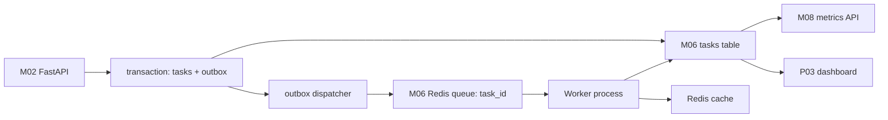
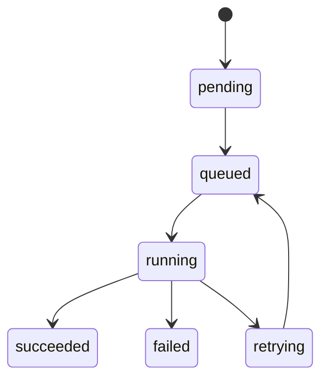
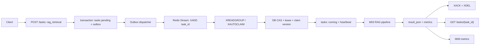

# M06 数据库缓存与异步任务适配教材

<!-- textbook-content: default=instructional -->

> 模块标签：`M06` · `数据库` · `缓存` · `异步任务` · `P03`
> 读法：先把任务从内存脚本保存下来，再让 worker 异步执行、失败可查、结果可恢复。

## 模块入口

| 项目 | 开始前应知道的边界 |
|---|---|
| 目标读者 | 已能编写基础 FastAPI/Python 服务，准备学习任务持久化、缓存、异步投递和失败恢复的学习者 |
| 先修知识 | Python 函数、类型标注、异常和 JSON；SQL 基础查询；理解 HTTP 请求生命周期。开始 P03 贯通前还需知道 M02 的路由/服务分层与 M05 的 Queue/Worker 概念 |
| 可执行环境检查 | SQLite reference 先运行 `py -3.13 --version`、`git --version`；进入 P03 Compose 再运行 `docker version` 与 `docker compose version`。缺少 Docker 不阻塞第 1-8 章和 SQLite reference 阅读 |
| 学习产物 | `tasks/outbox` Schema、状态机、owner-scoped 幂等约束、CAS/lease 恢复说明，以及 E06 实验记录和测试输出 |
| 完成口径 | E06 SQLite reference 与 P03 reference 的已有测试只证明参考实现可执行，不证明学习者已完成。学习者状态必须以自己的复现命令、输出和修改记录为准 |
| 预计学习时间与退出点 | 首轮约 10-14 小时；第 4 章后可先停在“任务事实源 + 状态机”，第 8 章后再进入 P03 Compose 贯通，避免把数据库、队列和容器问题一次叠加 |
| 版本边界 | 当前可执行基线为 Python 3.13；E06 SQLite reference v0.1.0；P03 service v0.3.1 使用 Python 3.13.2、PostgreSQL 17.5 和 Redis 8.0.3。P03 的运行契约是 Redis Streams consumer group；RQ/Celery 只用于概念对照 |

## 内容类型说明

| 范围 | 类型 | 阅读承诺 |
|---|---|---|
| 第 1-8 章及 P03 持久化异步案例 | `instructional` | 讲解任务事实源、outbox、状态机、缓存、队列、重试、幂等与指标来源；配合 E06/P03 reference 核对 |
| 第 9 章 | `appendix` | 给出学习顺序、实验路线和退出点，不作为新的核心概念章节 |
| 第 10 章 | `reference` | 说明如何按问题查阅官方数据库/队列资料，不替代正文教学 |
| 学习导航、编写说明、第一轮边界和暂不深入 | `appendix` | 用于导航、范围和状态说明 |

## 学习导航

本教材按四段阅读，主线始终是“任务入库 -> 入队 -> 执行 -> 回写 -> 查询”：

1. [[#第 1 章：为什么 M06 是从脚本到系统的分界线|第 1 章]] / [[#第 2 章：SQL 和任务状态表|第 2 章]]：系统边界与任务表。读完能设计最小 `tasks` 表。
2. [[#第 3 章：从 API 到 Repository|第 3 章]] / [[#第 4 章：任务状态流转|第 4 章]]：分层与状态。读完能让 API 创建任务，并查询 `queued/running/succeeded/failed`。
3. [[#第 5 章：Redis 缓存|第 5 章]] / [[#第 6 章：异步任务队列|第 6 章]] / [[#第 7 章：失败重试和幂等性|第 7 章]]：缓存、队列与可靠性。读完能解释缓存、worker、重试和防重复提交。
4. [[#第 8 章：任务结果、日志和 metrics|第 8 章]] / [[#项目贯通案例：P03 的持久化异步闭环|项目贯通案例]]：结果回写。读完能把 RAG/Agent 结果、错误和 metrics 写回任务。

> 2026-07-10 校订：`create task -> enqueue -> mark queued` 是不安全双写。最低正确模型改为同一数据库事务写入 `tasks + outbox`，由可重试 dispatcher 投递；worker 使用幂等键、compare-and-set、lease、heartbeat 和 reconciliation。可执行 SQLite reference 位于 `E06/e06_sqlite_reference/`，当前 7 个测试通过。

## 编写说明

M06 的任务是把前面已经出现的 API、RAG 请求和调度任务，从“内存里的对象和脚本”推进到“可保存、可恢复、可异步执行”的工程系统。

在总路线里，M06 不单独追求数据库知识，也不单独追求队列框架。它服务的是 P03 AI Workload Platform 的第一版工程闭环：

```text
M02 API 接收请求
-> M03 RAG 请求形成 RagTask
-> M05 调度器选择任务和 worker
-> M06 保存任务状态、异步执行、失败重试、缓存结果
-> M08 读取指标和日志做监控压测
```

本教材主要连接：

- [[10_学习模块/M06_数据库缓存与异步任务/M06_数据库缓存与异步任务_学习地图|M06 数据库缓存与异步任务学习地图]]
- [[20_资料库/模块资料索引/M06_数据库缓存与异步任务_资料索引|M06 数据库缓存与异步任务资料索引]]
- [[40_实验练习/E06_数据库异步任务实验/E06_数据库异步任务实验_索引|E06 数据库异步任务实验索引]]
- [[50_项目产出/P03_AI_Workload_Platform/P03_AI_Workload_Platform 项目主页|P03 AI Workload Platform]]
- [[10_学习模块/M02_后端API与服务化/M02_后端API与服务化_学习地图|M02 后端 API 与服务化学习地图]]
- [[10_学习模块/M03_RAG工程/M03_RAG工程_学习地图|M03 RAG 工程学习地图]]
- [[10_学习模块/M05_任务队列与调度/M05_任务队列与调度_学习地图|M05 任务队列与调度学习地图]]

推荐资料以 M06 资料索引为准，第一轮优先查阅：

- [PostgreSQL Tutorial](https://www.postgresql.org/docs/current/tutorial.html)
- [Redis Streams](https://redis.io/docs/latest/develop/data-types/streams/)
- [RQ Docs](https://python-rq.org/docs/)
- [Celery Workers](https://docs.celeryq.dev/en/stable/userguide/workers.html)

## 第一轮学习边界

M06 很容易写成数据库大全或中间件大全。当前第一轮只学能支撑 P03 v0.3.1 的内容。

| 内容 | 第一轮必须掌握 | 第一轮暂不深入 | 为什么这样划边界 |
|---|---|---|---|
| SQL / 数据库 | 会设计任务表、文档表、任务事件表，能增删改查和按状态查询 | 不深入查询优化器、分区表、复杂索引设计 | P03 先需要可靠保存任务和状态 |
| SQLite / PostgreSQL | 知道本地可先用 SQLite，后续迁移 PostgreSQL | 不做数据库高可用、主从复制、备份体系 | 第一轮先训练数据模型和持久化思维 |
| ORM / Repository | 能把 API 层、业务层、数据访问层分开 | 不陷入 ORM 高级特性 | M02 的服务分层需要 M06 接住 |
| Redis 缓存 | 会缓存 embedding 结果、任务临时状态或热点查询 | 不做 Redis 集群、复杂数据结构产品化 | P03 先观察缓存对延迟和成本的影响 |
| 异步任务队列 | 会用 Streams consumer group 把 task_id 至少一次投递给 worker，并解释 pending/ACK/reclaim | 不同时深入 RQ、Celery、Kafka、RabbitMQ | 第一轮先跑通一个与 P03 v0.3.1 一致、可恢复的队列闭环 |
| 状态流转 | 会维护 pending/running/succeeded/failed/retrying/cancelled | 不做复杂工作流引擎 | 任务状态是 P03 管理端和 M08 指标的基础 |
| 失败重试 | 能记录 error_type、retry_count、last_error | 不做复杂补偿事务和分布式一致性 | 第一轮先能解释失败、重试和最终失败 |
| 幂等性 | 会用 idempotency_key 防止重复提交和重复写结果 | 不做跨服务全局幂等框架 | API 重试和 worker 重试都需要防重复 |

判断是否越界：如果某个主题不能帮助 P03 做到“请求入库、任务入队、worker 执行、状态更新、失败可查”，就先不要在 M06 深挖。

## 本模块工程练习主线

M06 的练习不要从“安装很多中间件”开始，而要围绕一条固定闭环逐步加能力：

```text
任务入库
-> 状态更新
-> 异步执行
-> 失败重试
-> 查询状态
```

这条线对应 P03 的真实用户体验：

```text
用户提交 RAG 请求
-> API 返回 task_id
-> 用户可以查询任务状态
-> worker 在后台执行
-> 成功时返回 answer + retrieved_sources + metrics
-> 失败时能看到 error_type 和 retry_count
```

第一轮建议把 E06 设计成四个递进小阶段，不急着一口气做成完整平台：

| 阶段 | 练什么 | 最小验收 |
|---|---|---|
| R1：任务入库 | `POST /tasks` 创建 `rag_retrieval` 记录与 outbox | 数据库能在同一事务查到两条记录 |
| R2：状态更新 | dispatcher 与伪 worker 条件更新状态 | 能看到 `pending -> queued -> running -> succeeded/failed` |
| R3：异步执行 | API 返回 task_id，worker 后台执行 | API 不等待长任务，`GET /tasks/{task_id}` 可查进度 |
| R4：失败重试 | 模拟 worker 抛错并重试 | 能记录 `retry_count`、`last_error`，最终成功或 failed |
| R5：查询与指标 | 从数据库查询状态和基础耗时 | 能计算 queue_wait_ms、execution_ms、total_latency_ms |

本教材后面的章节就是围绕这条练习主线展开。读的时候不要把每章当独立知识点，而要不断问：这一章让上面的闭环多了哪一段能力？

## 第 1 章：为什么 M06 是从脚本到系统的分界线

### 1.1 本章目标

学完本章，你要理解 M06 在整条路线中的位置：它不是给系统“加一个数据库”这么简单，而是让任务从一次性内存对象变成可追踪的工程事实。

如果没有 M06，P03 只能像脚本：

```text
请求来了 -> 内存里创建任务 -> worker 跑一下 -> 进程重启后一切丢失
```

有了 M06，P03 才能像服务：

```text
请求来了 -> task 入库 -> 入队 -> worker 执行 -> 状态回写 -> 失败记录 -> metrics 可查询
```

### 1.2 M06 要解决什么工程问题

M02 负责 API；当前 P03 v0.3.1 统一通过 `POST /tasks` 提交，RAG 由
`task_type="rag_retrieval"` 和 `input_json` 表达。

M03 负责 RAG 请求本身，定义 query、top_k、retrieved_sources、metrics。

M05 负责调度思想，解释任务、队列、worker、策略和指标。

M06 负责把这些东西保存下来，并让它们可以在后台执行。

最小问题是：

```text
任务提交后，如果 API 进程返回了，任务还能继续执行吗？
worker 执行到一半失败了，系统能知道失败原因吗？
用户刷新页面后，还能查到任务状态吗？
同一个请求重复提交，会不会生成两条重复任务？
```

这些都是数据库、缓存和异步任务要解决的问题。

### 1.3 M06 和 P03 的关系

P03 第一版可以先用这条链路：



这里有一个关键边界：

- API 负责接收请求和返回 task_id。
- DB 负责保存任务事实。
- Queue 负责让任务进入后台执行。
- Worker 负责执行任务并回写状态。
- Scheduler 负责决定谁先执行，不应该被塞进数据库层。

### 1.4 同步任务和异步任务的区别

同步任务的特点是：API 收到请求后，当场把事情做完，再返回结果。

```text
Client -> conceptual synchronous RAG endpoint
API -> 执行 RAG
API -> 返回 answer
```

这种方式适合很短、很稳定的操作，例如普通查询、健康检查、读取任务状态。

异步任务的特点是：API 收到请求后，只负责创建任务并返回 `task_id`，真正耗时的工作交给 worker。

```text
Client -> POST /tasks (task_type=rag_retrieval)
API -> 事务写入 task + outbox
API -> 返回 task_id
Dispatcher -> 发布 task_id
Worker -> CAS claim 后执行 RAG
Client -> GET /tasks/{task_id}
```

RAG、文档解析、embedding、Agent 报告生成，都更适合异步执行，因为它们可能慢、可能失败、可能需要重试，也可能需要排队。

| 对比项 | 同步任务 | 异步任务 |
|---|---|---|
| API 返回 | 等任务执行完才返回 | 先返回 task_id |
| 用户体验 | 可能长时间等待或超时 | 可以轮询状态或看进度 |
| 失败记录 | 容易只返回一次错误 | 可以写入 error_type、last_error |
| 重试 | 通常依赖客户端重新请求 | worker 可以按 retry_count 重试 |
| 调度 | 很难统一排队 | 可以接入 M05 的队列和调度 |

第一轮判断标准很简单：

```text
如果任务可能超过 1-2 秒、可能失败重试、需要排队或需要后续查询，就优先设计成异步任务。
```

### 1.5 常见错误

第一个错误：只把数据库当成结果存储。

任务系统里，数据库不仅存最终结果，也保存任务状态、提交时间、开始时间、结束时间、失败原因、重试次数和 metrics。

第二个错误：API 同步执行长任务。

如果 RAG 检索、embedding 或报告生成很慢，API 一直阻塞会导致用户等待、超时和服务不稳定。更合理的是：API 创建任务并返回 task_id，worker 后台执行。

第三个错误：把队列当数据库。

Redis Streams 可以负责消息传递和短期 pending 记录，但 P03 的长期事实应写入数据库。否则 worker 重启、Stream 清理或保留时间过期后，状态就可能丢。RQ/Celery 只作队列框架对照，不是当前 reference 的事实源。

### 1.6 小练习

用自己的话回答：

```text
为什么 P03 不能只用内存列表保存任务？
数据库、队列、worker 分别保存或处理什么？
如果 worker 执行失败，哪些信息必须被记录？
一个 RAG 查询为什么更适合异步任务，而不是同步任务？
```

### 1.7 本章检查标准

- [ ] 能解释 M06 为什么是从脚本到系统的分界线。
- [ ] 能画出 API -> DB -> Queue -> Worker -> DB 的闭环。
- [ ] 能说清 M02、M03、M05、M06 的职责边界。
- [ ] 能解释同步任务和异步任务的区别。

## 第 2 章：SQL 和任务状态表

### 2.1 本章目标

本章只学 P03 第一版需要的数据库能力：设计任务表、保存任务、查询状态、更新状态。

你不需要先成为数据库专家，但必须能把一条任务从内存对象变成数据库记录。

### 2.2 为什么先从任务表开始

P03 的核心对象不是“页面”或“按钮”，而是任务。

无论用户提交的是 RAG 查询、Agent 报告生成，还是模拟推理请求，最终都可以抽象成：

```text
一个有类型、有状态、有输入、有输出、有时间、有错误记录的 task
```

任务表是后续调度、监控、失败重试和项目展示的共同基础。

### 2.3 最小 tasks 表

第一版可以先设计：

```sql
CREATE TABLE tasks (
    task_id TEXT PRIMARY KEY,
    tenant_id TEXT NOT NULL,
    user_id TEXT NOT NULL,
    task_type TEXT NOT NULL,
    status TEXT NOT NULL,
    priority INTEGER NOT NULL DEFAULT 5,
    collection_id TEXT,
    input_json TEXT NOT NULL,
    result_json TEXT,
    error_type TEXT,
    last_error TEXT,
    retry_count INTEGER NOT NULL DEFAULT 0,
    max_retries INTEGER NOT NULL DEFAULT 3,
    idempotency_key TEXT NOT NULL,
    version INTEGER NOT NULL DEFAULT 0,
    worker_id TEXT,
    lease_until TEXT,
    delivery_count INTEGER NOT NULL DEFAULT 0,
    created_at TEXT NOT NULL,
    queued_at TEXT,
    started_at TEXT,
    finished_at TEXT,
    updated_at TEXT NOT NULL,
    UNIQUE (tenant_id, user_id, idempotency_key)
);

CREATE TABLE outbox (
    event_id INTEGER PRIMARY KEY,
    task_id TEXT NOT NULL,
    event_type TEXT NOT NULL,
    payload_json TEXT NOT NULL,
    created_at TEXT NOT NULL,
    claimed_at TEXT,
    claimed_by TEXT,
    published_at TEXT,
    FOREIGN KEY (task_id) REFERENCES tasks(task_id)
);
```

第一轮用 `TEXT` 存 JSON 和时间是为了降低 SQLite 练习复杂度；进入 PostgreSQL 后应改用
`JSONB` 与带时区时间类型。`tenant_id`、`user_id` 来自服务端认证主体，不接受请求体覆盖。
幂等键只在同一任务所有者范围内唯一；`version`、worker lease 和 outbox 是并发恢复字段，不是
可有可无的展示字段。

### 2.4 任务状态怎么查

> **可迁移的原则**：持久化不是“把数据存起来”这么简单，而是让任务跨进程、跨 worker、跨重启之后仍然可恢复、可查询、可解释。只要一个任务可能超过一次 HTTP 请求的生命周期，就应该有稳定的 `task_id` 和数据库事实来源。

最常见查询是按 `task_id` 查单个任务：

```sql
SELECT task_id, task_type, status, result_json, error_type, last_error
FROM tasks
WHERE task_id = :task_id
  AND tenant_id = :tenant_id
  AND user_id = :user_id;
```

经过 operator 授权的管理端还可以查某类状态；普通用户查询不能省略 owner 条件：

```sql
SELECT task_id, task_type, priority, created_at, started_at
FROM tasks
WHERE status IN ('pending', 'running', 'retrying')
ORDER BY created_at ASC;
```

单任务查询支撑当前 P03 的 `GET /tasks/{task_id}`。当前 v0.3.1 没有任务列表接口，不能把上面的
operator SQL 写成已经暴露给普通用户的 API。

### 2.5 在 P03 中怎么用

当用户提交 RAG 请求时，API 不应该只把请求放进内存队列。

最低正确顺序是：

```text
1. 校验请求
2. 从服务端 principal 得到 tenant_id / user_id
3. 在同一数据库事务写入 pending task 与 outbox 事件
4. 提交事务并返回 task_id
5. dispatcher 可重试地把 outbox 中的 task_id 发布到队列
```

这样即使 API 在事务提交后重启，dispatcher 仍能补发未发布事件。不能使用“先写 tasks，再直接
enqueue”的双写流程：数据库提交或队列发布任一侧单独成功，都会留下丢任务或无主消息。

### 2.6 常见错误

第一个错误：状态只存在 Python 对象里。

进程重启后对象丢失，用户就查不到任务。

第二个错误：表里只存 result，不存 error。

失败任务必须能解释失败原因，否则无法重试和复盘。

第三个错误：没有时间字段。

没有 `created_at`、`started_at`、`finished_at`，就无法计算等待时间、执行时间和尾延迟。

#### 踩坑现场：worker 做完了，但用户永远看到 running

最常见的异步任务事故不是“worker 完全没跑”，而是 worker 已经执行完，却忘了把 `status`、`result_json`、`finished_at` 回写到数据库。用户侧只能看到任务一直 `running`，M08 也会把它统计成异常长耗时任务。解决方式是把“执行成功”和“状态回写成功”一起作为验收条件。

### 2.7 小练习

设计一个 RAG 任务记录，写出它在 `tasks` 表里的关键字段：

```text
task_type
status
input_json
priority
created_at
idempotency_key
```

再写 3 条 SQL：

- 插入新任务。
- 查询任务状态。
- 把任务从 `pending` 更新为 `running`。

### 2.8 本章检查标准

- [ ] 能解释为什么任务表是 P03 的核心表。
- [ ] 能设计最小 `tasks` 表。
- [ ] 能写插入、查询、更新任务状态的 SQL。
- [ ] 能说明时间字段如何服务 M05/M08 指标。

## 第 3 章：从 API 到 Repository

### 3.1 本章目标

M02 已经强调过 router / service / repository / model 分层。M06 要把这个分层真正落到数据库。

本章目标是：不要把 SQL、业务逻辑和 API 路由全部混在一起。

### 3.2 为什么要分层

不好的写法是：

```text
FastAPI route 里直接校验请求、拼 SQL、写数据库、入队、处理异常
```

这样短期能跑，但后续很难测试和维护。

更清楚的职责是：

| 层 | 负责什么 |
|---|---|
| router | 接收 HTTP 请求，返回 HTTP 响应 |
| service | 组织业务流程，比如创建任务并入队 |
| repository | 读写数据库 |
| worker | 后台执行任务并回写状态 |

### 3.3 最小 Repository

伪代码可以这样写：

```python
from dataclasses import dataclass
from typing import Optional


@dataclass
class TaskRecord:
    task_id: str
    tenant_id: str
    user_id: str
    task_type: str
    status: str
    input_json: str
    priority: int
    idempotency_key: Optional[str]


class TaskRepository:
    def create_task(self, task: TaskRecord) -> None:
        ...

    def get_task(self, task_id: str) -> Optional[TaskRecord]:
        ...

    def update_status(self, task_id: str, status: str) -> None:
        ...

    def save_result(self, task_id: str, result_json: str) -> None:
        ...

    def save_failure(self, task_id: str, error_type: str, last_error: str) -> None:
        ...
```

第一轮不必追求完美 ORM。重点是让“数据库读写”有一个明确边界。

### 3.4 创建任务的服务流程

M02 的 API 接到请求后，M06 推荐流程是：

```python
def submit_rag_task(principal, request, repo):
    with repo.transaction():
        task, created_new = repo.insert_or_get_by_owner_idempotency(
            tenant_id=principal.tenant_id,
            user_id=principal.user_id,
            request=request,
            status="pending",
        )
        if created_new:
            repo.append_outbox_event("task_submitted", {"task_id": task.task_id})
    return task.task_id, created_new
```

这个流程体现了三件事：

- 依靠 `(tenant_id, user_id, idempotency_key)` 唯一约束解决并发重复提交，而不是先查后插。
- task 与 outbox 事件在同一事务提交，避免数据库/队列双写裂缝。
- 队列里只传 `task_id`，worker 自己从数据库读任务详情。

dispatcher 负责重复扫描未发布 outbox。claim 时在同一数据库事务取得事件所有权，并把
`pending/retrying` 条件更新为 `queued`；随后发布 task_id，最后才确认 outbox 已发布。若发布
前崩溃，过期 claim 会被再次取得；若发布后、确认前崩溃，消息会重复，worker 必须依靠
task_id、CAS 和 lease 幂等处理。重试 dispatcher 时，已是 `queued` 的任务仍可重新发布对应的
未确认事件，不能要求状态再次从 `pending/retrying` 转换。

### 3.5 为什么队列里只传 task_id

如果把完整 RAG 请求都塞进队列，后续会遇到几个问题：

- 请求内容过大，不适合长期放队列消息里。
- 数据库和队列里的内容可能不一致。
- worker 失败后难以恢复完整上下文。

更稳的是：

```text
数据库保存任务事实
队列只传 task_id
worker 根据 task_id 加载任务
```

> **可迁移的原则**：队列消息越小，系统越容易恢复。队列负责“通知谁该执行”，数据库负责“保存这件事到底是什么”。这个分工以后迁移到 Celery、Kafka、云队列或 Kubernetes Job 时仍然成立。

### 3.6 常见错误

第一个错误：路由函数里直接写所有逻辑。

这样很难单独测试数据库逻辑，也很难把同步执行改成异步执行。

第二个错误：queue 里传完整大对象。

队列不是长期事实来源。任务详情应以数据库为准。

第三个错误：先入队再入库。

worker 可能很快拿到任务，但数据库里还查不到对应记录，造成状态混乱。

### 3.7 小练习

画出 `POST /tasks` 提交 `rag_retrieval` 的调用链：

```text
router -> service -> transaction(tasks + outbox) -> dispatcher -> queue -> worker -> repository
```

并写出每一层做什么、不做什么。

### 3.8 本章检查标准

- [ ] 能解释 router / service / repository / worker 的边界。
- [ ] 能说出为什么队列里只传 task_id。
- [ ] 能设计创建任务并入队的最小流程。

## 第 4 章：任务状态流转

### 4.1 本章目标

任务状态是 P03 的生命线。用户查状态、worker 执行、M05 调度、M08 监控，都依赖状态流转清楚。

本章要学会设计一组简单但够用的状态。

### 4.2 最小状态机

第一轮可以使用：

```text
pending -> queued -> running -> succeeded
pending -> queued -> running -> failed
running -> retrying -> queued -> running
```

图示：



`cancelled` 目前只保留在 P03 数据库枚举中；v0.3.1 没有取消 API，也没有合法迁移能到达该
状态。教材不能用预留枚举暗示功能已经实现。

这里要区分两个容易混的词：

- `retrying`：当前任务正准备重试，是一个状态。
- `retried`：表示曾经发生过一次重试，更适合作为事件或标记。

第一轮推荐状态字段使用 `retrying`，事件表里记录 `task_retried`。不要把 `retried` 当成状态，否则用户会疑惑任务到底是在执行、等待，还是已经结束。

如果一次任务发生过重试，可以这样记录：

```text
status = retrying
task_events 追加 task_retried
retry_count = retry_count + 1
```

### 4.3 每个状态代表什么

| 状态 | 含义 | 常见来源 |
|---|---|---|
| pending | 任务已经入库，尚未进入队列或等待提交 | API 创建任务 |
| queued | dispatcher 已取得提交事件，任务可被队列投递 | outbox claim 的条件更新 |
| running | worker 已开始执行 | worker 启动任务 |
| succeeded | 执行成功，结果已保存 | worker 保存结果 |
| failed | 最终失败，不再重试 | 超过重试次数或不可恢复错误 |
| retrying | 失败后准备重试 | 可恢复错误 |
| cancelled | 预留但当前不可达 | 当前 P03 v0.3.1 无取消 API |

这些状态重要，是因为它们分别回答不同问题：

| 问题 | 依赖状态 |
|---|---|
| 用户能不能继续等？ | pending / queued / running / retrying |
| 任务是否已经有结果？ | succeeded |
| 任务是否需要人工查看？ | failed |
| 用户取消是否成功？ | cancelled |
| 是否应该重新入队？ | retrying + retry_count |
| M05 能不能调度它？ | pending / queued |
| M08 能不能统计失败率？ | failed / succeeded |

状态不是装饰字段。状态定义不清楚，后面的 API、worker、调度器、监控图都会混乱。

> **可迁移的原则**：状态流转是系统契约，不是随手改的字符串。`pending/queued/running/succeeded/failed/retrying/cancelled` 一旦进入 API、数据库、实验记录和监控指标，就必须全链路统一，否则后续调度、压测、项目复盘都会失去可信度。

### 4.4 状态和指标的关系

状态不是只给页面看的，它会变成指标。

```text
queue_wait_ms = started_at - queued_at
execution_ms = finished_at - started_at
total_latency_ms = finished_at - created_at
```

M05 关心 `queue_wait_ms` 和不同策略的影响。

M08 关心 `total_latency_ms`、失败率、P95/P99。

P03 管理端关心任务状态、错误、队列长度和 worker 利用率。

### 4.5 状态更新要注意什么

只按 `task_id` 更新状态是一个**错误反例**：

```sql
UPDATE tasks
SET status = 'running',
    started_at = :now
WHERE task_id = :task_id;
```

这条语句没有验证 expected status/version。两个 worker 收到重复消息时都可能覆盖状态；旧 worker 也可能在 lease 过期、任务已重新分配后写入结果。仅仅先 `SELECT status` 再执行这条 `UPDATE` 也不安全，因为两条语句之间状态可能已改变。

正确做法是把“我看到的前置条件”放进同一条原子 `UPDATE`。下面是便于迁移的 CAS claim 正例：

```sql
UPDATE tasks
SET status = 'running',
    worker_id = :worker_id,
    lease_until = :lease_until,
    started_at = :now,
    updated_at = :now,
    version = version + 1
WHERE task_id = :task_id
  AND status = :expected_status       -- queued
  AND version = :expected_version
RETURNING version AS claim_version;
```

`RETURNING` 没有行就表示 claim 失败，worker 不得执行任务。返回的 `claim_version` 是这次所有权的 fencing token。当前 P03 reference 的 claim 用 `status='queued'` 作为原子竞争条件并递增/返回 version；更通用的 repository API 还可以像上例一样传入 `expected_version`。

成功回写必须再次校验状态、owner、fencing token 和 lease：

```sql
UPDATE tasks
SET status = 'succeeded',
    result_json = :result_json,
    finished_at = :now,
    updated_at = :now,
    worker_id = NULL,
    lease_until = NULL,
    version = version + 1
WHERE task_id = :task_id
  AND status = 'running'
  AND worker_id = :worker_id
  AND version = :claim_version
  AND lease_until > :now
RETURNING version;
```

失败、重试和 heartbeat 使用同一组 owner/version/lease 条件；区别只在目标状态和字段。受影响行数不是 1 时必须把操作视为“所有权已丢失”，不能无条件补写。这样旧 worker 即使仍在运行，也无法越过新 claim 的 fencing token。

### 4.6 常见错误

第一个错误：状态名字太随意。

比如一会儿写 `done`，一会儿写 `success`，一会儿写 `completed`。状态名不统一会让查询、监控和前端都混乱。

第二个错误：失败没有结束时间。

失败也应该有 `finished_at`，否则无法计算总耗时和失败率。

第三个错误：重试不记录次数。

没有 `retry_count`，就不知道任务是否反复失败，也无法限制最大重试次数。

第四个错误：把 `task_id` 当成写权限。

`task_id` 只标识任务，不证明当前 worker 仍拥有它。worker 的写权限来自合法 expected status、当前 owner、claim version 与未过期 lease 的共同匹配。

### 4.7 小练习

画出一个 RAG 任务从提交到成功的状态变化，并记录每一步更新时间字段：

```text
created_at
queued_at
started_at
finished_at
```

再画一个失败后重试一次的状态变化。

### 4.8 本章检查标准

- [ ] 能画出最小任务状态机。
- [ ] 能解释每个状态的含义。
- [ ] 能用状态时间计算等待时间和执行时间。
- [ ] 能记录失败和重试信息。

## 第 5 章：Redis 缓存

### 5.1 本章目标

Redis 在 P03 第一轮里主要服务两个用途：

1. 缓存高成本结果，降低重复计算。
2. 支撑轻量任务队列或队列框架。

本章先讲缓存，不把 Redis 写成完整数据库替代品。

### 5.2 什么适合缓存

P03 里适合缓存的内容包括：

| 缓存对象 | 为什么适合缓存 | 注意点 |
|---|---|---|
| embedding 结果 | 同一段文本重复向量化会浪费成本 | key 要包含模型版本、规范化版本和文本 hash |
| RAG 检索结果 | 同一 query 和 collection 短时间内可能重复 | tenant、服务端 ACL fingerprint/version 和所有影响结果的版本/过滤维度必须进入 key |
| 任务临时进度 | 前端频繁查询任务进度 | 最终状态仍以数据库为准 |
| metrics 临时聚合 | 管理端频繁读取队列长度 | 后续 M08 再系统化 |

第一轮最推荐做 embedding 缓存，因为它容易观察“是否减少重复计算”。

### 5.3 最小缓存 key

缓存 key 不能随便写。

embedding 缓存可以这样设计：

```text
embedding:v1:{model_version}:{normalizer_version}:{text_hash}
```

RAG 检索缓存可以这样设计：

```text
rag_search:v1:{sha256(canonical_json(cache_context))}
```

`cache_context` 至少包含 tenant、服务端有效 ACL 的 version/fingerprint、collection、文档/索引版本、embedding 模型、检索器、过滤条件、top-k 和 query hash。先对固定键顺序、固定编码的 canonical JSON 求 hash，避免直接拼接字符串产生分隔符歧义。不能接受客户端传入的 `permission_group` 来决定缓存范围；仅使用一个权限组字符串仍可能在多租户、ACL policy 更新、文档更新或检索配置变化后串结果。

### 5.4 最小伪代码

```python
def get_embedding(authorized_text, model_version, normalizer_version, redis_client, embed_fn):
    # authorized_text 必须已通过 tenant/文档授权；cache key 不是授权检查。
    key = make_embedding_key(model_version, normalizer_version, authorized_text)
    cached = redis_client.get(key)
    if cached:
        return decode_vector(cached)

    vector = embed_fn(authorized_text)
    redis_client.setex(key, 3600, encode_vector(vector))
    return vector
```

这里的重点不是 Redis API 细节，而是缓存策略：

- 先查缓存。
- miss 时计算。
- 计算后写缓存。
- 设置过期时间。

### 5.5 缓存和一致性

第一轮只需要掌握一个原则：

```text
缓存可以加速，但不能成为唯一事实来源。
```

> **可迁移的原则**：缓存是在用一致性风险换延迟和成本，不是“越多越好”。凡是会影响权限、证据引用、模型版本或文档版本的字段，都必须进入缓存 key；凡是任务最终状态和错误原因，都必须回到数据库。

任务最终状态、结果和错误仍以数据库为准。

如果缓存丢了，系统应该只是变慢，不应该丢任务。

### 5.6 常见错误

第一个错误：缓存 key 没有包含权限信息。

RAG 系统里这是很危险的问题，可能导致用户看到不该看的检索结果。

第二个错误：缓存永不过期。

文档更新后，旧缓存可能继续返回过期内容。

第三个错误：把任务最终状态只放 Redis。

Redis 可以辅助展示进度，但 P03 的任务事实必须写入数据库。

#### 踩坑现场：缓存 key 少了权限字段，检索结果串给了别人

RAG 检索缓存很容易只按 `query_hash` 做 key，看起来命中率很高，但这会把不同 tenant、collection 和有效 ACL 的结果混在一起。金融/合规场景尤其不能这样做。第一轮宁可命中率低，也要使用服务端 principal 生成的 ACL fingerprint/version，并加入 `collection_id`、`top_k`、filter、模型/检索器和必要的文档/索引版本。权限过滤必须在检索和缓存读取之前完成。

### 5.7 小练习

为下面三个对象设计缓存 key：

- 一段 chunk 的 embedding。
- 一个用户对某 collection 的 RAG 检索结果。
- 一个任务的临时进度。

并说明每个 key 应该包含哪些字段、为什么。

### 5.8 本章检查标准

- [ ] 能解释 Redis 在 P03 第一轮中的作用。
- [ ] 能设计不会泄露权限的缓存 key。
- [ ] 能说明缓存和数据库事实来源的区别。
- [ ] 能设计 E06-03 embedding 缓存实验。

## 第 6 章：异步任务队列

### 6.1 本章目标

本章把长耗时任务从 API 请求里移出去，让 worker 在后台执行。

P03 v0.3.1 的可执行契约是 Redis Streams consumer group。第一轮优先理解 `XADD`、`XREADGROUP`、pending entries list（PEL）、`XACK + XDEL` 和 `XAUTOCLAIM` 如何组成至少一次投递；RQ/Celery 只保留为框架对照。

### 6.2 为什么需要异步执行

RAG 请求可能包含：

- 文档解析。
- chunk。
- embedding。
- 检索。
- generation。
- retrieved_sources 和 metrics 记录。

这些步骤可能耗时较长。API 如果同步等待，用户可能遇到超时。

更合适的交互是：

```text
POST /tasks (task_type=rag_retrieval) -> 立即返回 task_id
GET /tasks/{task_id} -> 查询状态和结果
```

### 6.3 最小队列闭环

Redis Stream 承载消息，PostgreSQL 仍保存任务事实和 worker 所有权。当前 P03 的完整顺序是：

```text
API transaction: tasks(pending) + outbox(unpublished)
dispatcher DB transaction: claim outbox + pending/retrying -> queued
dispatcher: XADD stream(task_id) -> acknowledge outbox
worker: XAUTOCLAIM expired pending, otherwise XREADGROUP reserve new message
worker DB CAS: queued -> running + worker_id + lease + claim_version
worker: heartbeat -> execute -> owner/version/lease-checked database finalization
worker: only after database finalization succeeds, XACK + XDEL message
reconciler: recover expired outbox claims and database worker leases
```

`XREADGROUP` 把消息交给某个 consumer 后，消息不会立即消失，而是进入该 group 的 PEL。worker 在数据库终态提交前崩溃时，不执行 `XACK`，消息继续留在 PEL；超过 idle 阈值后，其他 consumer 用 `XAUTOCLAIM` 取得它。这个机制修复了破坏性 pop 在“取出后、完成前”崩溃会丢任务的问题。

dispatcher 自身也使用 claim lease。它必须先在数据库事务里 claim outbox 并把 task 条件更新为 `queued`，提交后才执行 `XADD`，避免 worker 看见消息时任务仍是 `pending`。发布成功后的 outbox acknowledgement 必须校验 `event_id + claimed_by + published_at IS NULL`。若 Redis 写入成功、outbox 确认前崩溃，事件会再次发布，所以该系统承诺的是**至少一次投递**，不是恰好一次。

```python
def dispatch_once(repo, queue, dispatcher_id):
    # 同一 DB 事务：claim outbox，并把 pending/retrying 条件更新为 queued。
    events = repo.claim_outbox(dispatcher_id, limit=100, claim_seconds=30)
    for event in events:
        try:
            queue.push(event.task_id)  # Redis XADD
            repo.mark_outbox_published(event.event_id, dispatcher_id)
        except Exception:
            repo.release_outbox_claim(event.event_id, dispatcher_id)
            raise
```

worker 先 reserve Stream message，再用数据库 CAS claim 与租约取得任务写权限。`claim_task` 只有在合法 expected status/version 满足时才能把任务交给当前 worker；重复消息、终态任务或其他 worker 已持有的任务都返回 `None`。Redis message id 只标识一次 delivery，不是数据库写权限；数据库返回的 `claim_version` 才是 fencing token：

```python
def consume_once(repo, queue, worker_id, lease_seconds=30):
    # receive 先 XAUTOCLAIM 超时 PEL，再用 XREADGROUP 读取新消息。
    message = queue.receive(worker_id, reclaim_idle_ms=lease_seconds * 1000)
    if message is None:
        return

    task = repo.claim_task(message.task_id, worker_id, lease_seconds)
    if task is None:
        queue.ack(message.message_id)  # Redis XACK + XDEL
        return

    finalized = False
    try:
        heartbeat.start(task.task_id, worker_id, task.version, lease_seconds)
        try:
            result = execute_task(task)
        except TaskError as exc:
            finalized = repo.fail_or_retry_if_owner(
                task.task_id,
                worker_id,
                task.version,
                error_type=exc.error_type,
                message=str(exc),
            )
        else:
            finalized = repo.complete_if_owner(
                task.task_id, worker_id, task.version, result
            )
    finally:
        heartbeat.stop()

    if finalized:
        # 数据库 succeeded/failed/retrying 已提交后，才确认并删除旧 delivery。
        queue.ack(message.message_id)  # Redis XACK + XDEL
```

`complete_if_owner` 和 `fail_or_retry_if_owner` 只有在条件更新恰好影响 1 行并提交成功时才返回 `True`。执行抛出未处理异常、数据库 finalization 抛错或返回 `False` 时都不能 ACK；消息留在 PEL 等待 `XAUTOCLAIM`。特别是旧 worker 被 fencing 拒绝后不能 ACK 当前 delivery，否则可能删除新 owner 仍需恢复的消息。heartbeat 只允许 `worker_id + claim_version + 未过期 lease` 的所有者延长 `running` 任务。reconciler 扫描数据库中过期 lease：未超过重试上限时在同一事务改为 `retrying` 并写恢复 outbox；超过上限时改为 `failed`。即使旧进程仍继续执行，它也会被 claim version fencing 拒绝，不能覆盖新 worker 的结果。

队列 backlog 也要按 Streams 语义解释：`lag` 是尚未交付给 group 的新消息，`pending` 是已交付但未 ACK 的消息；P03 的 `broker_queue_length` 取 `lag + pending`，它不等于数据库中全部 `queued` 任务数。

> **可迁移的原则**：异步任务的核心交互是“API 快速返回 `task_id`，worker 后台执行并回写结果”。用户、调度器和监控系统都围绕这个 `task_id` 协作，而不是围绕某个内存对象协作。

### 6.4 异步队列和 M05 的关系

M05 讲的是调度模型：

```text
Task -> Queue -> Scheduler -> Worker -> Metrics
```

M06 讲的是工程落地：

```text
tasks/outbox -> Redis Stream XADD -> consumer group/PEL -> worker process
-> database CAS/fencing -> XACK + XDEL -> metrics query
```

二者不是重复。

M05 负责“如何决定谁先执行”；M06 负责“任务如何持久化、如何至少一次投递、状态如何安全回写”。

E06 SQLite reference 用 `queue_messages + lease` 复现同一可靠性问题；P03 v0.3.1 再把它映射到 Redis Streams consumer group。后续如果要实现自定义调度策略，可以在 dispatcher 发布前或 worker 领取前增加调度层，但不能破坏 outbox、PEL 和数据库 fencing 契约。

### 6.5 队列里放什么

推荐只放：

```text
task_id
```

必要时可以加非常小的路由信息：

```text
queue_name = rag / agent / inference
```

任务详情、参数、状态、结果和错误都放数据库。

### 6.6 常见错误

第一个错误：API 直接调用长任务函数。

这会让服务响应变慢，也不利于失败恢复。

第二个错误：worker 成功执行但忘记更新数据库状态。

用户会看到任务一直 running 或 queued。

第三个错误：只信队列状态，不信任务表。

队列框架有自己的 job 状态，但 P03 的统一状态应该在 tasks 表里。

第四个错误：worker 先读状态，再无条件改成 running。

多个 worker 可能同时收到相同消息。必须用 CAS claim、worker_id 和 lease 让至多一个执行者
获得当前尝试的写权限。

第五个错误：worker 一收到消息就 `XACK`。

如果数据库 finalization 前进程崩溃，消息已经不在 PEL，其他 consumer 无法恢复。必须先提交数据库终态，再 `XACK + XDEL`。

第六个错误：只用 `XREADGROUP` 读取新消息，不处理 PEL。

中断 consumer 留下的 pending message 不会再次作为 `>` 新消息返回。worker 必须先用 `XAUTOCLAIM` 回收超过 idle 阈值的 delivery，并仍由数据库 CAS/fencing 判定是否可执行。

### 6.7 小练习

设计 `POST /tasks` 的 `rag_retrieval` 异步版本：

```text
认证 principal -> 事务写 task + outbox
-> dispatcher 事务 claim outbox 并先置 queued -> XADD task_id -> 确认 outbox
-> XREADGROUP/XAUTOCLAIM reserve -> worker CAS claim + heartbeat
-> 检索 -> owner/version/lease 条件更新结果 -> XACK + XDEL
```

写出每一步对应的表字段和状态。

### 6.8 本章检查标准

- [ ] 能解释为什么 API 要快速返回 task_id。
- [ ] 能说明 Redis Stream、consumer group、consumer、message 和 PEL 的关系。
- [ ] 能解释为什么队列里只传 task_id。
- [ ] 能解释 `XADD -> XREADGROUP/PEL -> database finalization -> XACK + XDEL` 的顺序。
- [ ] 能用 `XAUTOCLAIM` 恢复中断 consumer 的 pending delivery，并说明为什么仍需数据库 CAS/fencing。
- [ ] 能解释 outbox dispatcher、CAS claim、lease、heartbeat 和 reconciliation 各自修复什么故障窗口。
- [ ] 能把 M05 的调度模型映射到 M06 的工程组件。

## 第 7 章：失败重试和幂等性

### 7.1 本章目标

真实系统里，任务会失败，请求会重复，worker 会重启。

本章学习最小失败处理：记录失败、限制重试、防止重复提交和重复写结果。

### 7.2 失败类型

P03 第一版可以先记录这些错误类型：

| error_type | 含义 |
|---|---|
| validation_error | 请求参数不合法 |
| document_parse_error | 文档解析失败 |
| embedding_error | embedding 调用失败 |
| retrieval_error | 检索失败 |
| generation_error | 生成失败 |
| timeout | 执行超时 |
| permission_error | 权限过滤失败 |
| worker_error | worker 未分类错误 |

这些错误会帮助 M08 统计失败率，也帮助你复盘 P03 哪个环节最脆。

### 7.3 重试怎么设计

最小字段：

```text
retry_count
max_retries
last_error
error_type
```

伪代码：

```python
def handle_failure(task, worker_id, error_type, message, now):
    # task.version 是本次 claim 返回的 fencing token。
    with repo.transaction():
        if error_type in NON_RETRYABLE_ERRORS or task.retry_count >= task.max_retries:
            return repo.fail_if_owner(
                task_id=task.task_id,
                expected_status="running",
                worker_id=worker_id,
                claim_version=task.version,
                lease_after=now,
                error_type=error_type,
                message=message,
            )

        changed = repo.retry_if_owner(
            task_id=task.task_id,
            expected_status="running",
            worker_id=worker_id,
            claim_version=task.version,
            lease_after=now,
            error_type=error_type,
            message=message,
        )
        if changed:
            repo.append_outbox_event(
                "task_retry_requested", {"task_id": task.task_id}
            )
        return changed
```

`fail_if_owner` / `retry_if_owner` 的 SQL 必须同时匹配 `task_id + running + worker_id + claim_version + 未过期 lease`；返回 `False` 表示本次 claim 已失效，调用方不能回写、补写 outbox 或 ACK delivery。重试状态更新和 retry outbox 必须在同一事务里提交。

第一轮不要做复杂指数退避也可以，但至少要限制最大重试次数，并区分确定性错误与暂时性错误。`collection_not_found`、`invalid_input`、`permission_denied` 不应自动重试。

### 7.4 什么是幂等性

幂等性的意思是：同一个请求重复执行，不应该产生重复的副作用。

在 P03 里，用户可能因为网络问题重复点击提交。API 也可能因为超时被客户端重试。

如果没有幂等性，系统可能生成多个相同 RAG 任务，重复扣成本、重复排队、重复写结果。

最小做法是让客户端或服务端生成：

```text
idempotency_key
```

并在 `tasks` 表上加 owner-scoped 唯一约束：

```text
UNIQUE (tenant_id, user_id, idempotency_key)
```

`tenant_id` 和 `user_id` 必须来自服务端 principal。全表唯一会让不同用户互相占用 key；只在
应用代码里“先查再插”又会被并发请求穿透。

### 7.5 幂等提交流程

```text
收到请求并解析服务端 principal
-> 在事务内尝试插入 owner-scoped idempotency key
-> 插入成功：同时写 task + outbox，返回新 task_id
-> 唯一冲突：按同一 tenant/user/key 读取并返回已有 task_id
```

伪代码：

```python
def create_task_once(principal, request):
    with repo.transaction():
        task, created_new = repo.insert_or_get_by_owner_idempotency(
            principal.tenant_id,
            principal.user_id,
            request.idempotency_key,
            build_task(request),
        )
        if created_new:
            repo.append_outbox_event("task_submitted", {"task_id": task.task_id})
    return task.task_id, created_new
```

### 7.6 worker 幂等

worker 也要小心重复执行。

如果 worker 重启或队列重投，同一个 `task_id` 可能被执行两次。

最小保护：

```text
只有 CAS claim 成功的 worker 才执行。
执行期间 heartbeat 延长 lease，回写时再次校验 worker_id 和版本。
重复消息、已完成任务和有效租约下的 running 任务都不执行。
过期 lease 只由 reconciler 按重试策略恢复，普通 worker 不自行抢占。
```

仅检查 `succeeded` 不够，因为两个 worker 仍可能同时读到 `queued`。最低实现应是：

```python
def run_task_by_id(task_id, worker_id):
    task = repo.claim_task(task_id, worker_id, lease_seconds=30)
    if task is None:
        return
    execute_with_heartbeat_and_conditional_write(task, worker_id)
```

### 7.7 常见错误

第一个错误：失败了只打印日志，不写数据库。

日志可能丢，用户也查不到。失败必须回写任务表。

第二个错误：无限重试。

无限重试会把队列拖垮，也会污染指标。

第三个错误：只做 API 幂等，不做 worker 幂等。

后台任务重复执行也可能带来重复写结果和重复成本。

> **可迁移的原则**：重试必须和幂等一起设计。没有幂等的重试，会把一次失败变成多次重复副作用；没有重试的幂等，只能防重复提交，不能提升系统恢复能力。

#### 踩坑现场：retry 后重复生成、重复写结果、重复算成本

如果 worker 第一次已经调用了生成模型，但在保存结果前崩溃，第二次重试可能再次调用模型。第一轮可以先接受这种简化，但必须记录 `retry_count`、`last_error` 和任务事件，并在 worker 开始前检查任务是否已经 `succeeded`。以后做成本控制时，再把更细的步骤结果拆出来做阶段级幂等。

### 7.8 小练习

设计一个重复提交场景：

```text
用户连续两次提交相同 RAG query
```

写出系统如何用 `idempotency_key` 返回同一个 `task_id`。

再设计一个 worker 失败重试场景，写出状态变化：

```text
running -> retrying -> queued -> running -> succeeded
```

### 7.9 本章检查标准

- [ ] 能列出 P03 第一版常见错误类型。
- [ ] 能设计最大重试次数。
- [ ] 能解释 idempotency_key 的作用。
- [ ] 能说明 API 幂等和 worker 幂等的区别。

## 第 8 章：任务结果、日志和 metrics

### 8.1 本章目标

M06 不只保存任务状态，还要为 M08 的监控压测准备数据。

本章学习如何保存结果、错误、事件和基础指标。

### 8.2 结果保存

RAG 任务结果至少包含：

```json
{
  "answer": "...",
  "retrieved_sources": [
    {
      "source_id": "demo_note.md",
      "chunk_id": "chunk-001",
      "score": 0.82
    }
  ],
  "metrics": {
    "retrieval_ms": 30,
    "generation_ms": 600,
    "total_latency_ms": 700,
    "token_count": 1200,
    "has_citation": true
  }
}
```

第一轮可以先放到 `result_json`。后续如果查询需求增加，再拆成更细的表。

### 8.3 任务事件表

为了复盘状态变化，可以增加一个 `task_events` 表：

```sql
CREATE TABLE task_events (
    event_id TEXT PRIMARY KEY,
    task_id TEXT NOT NULL,
    event_type TEXT NOT NULL,
    message TEXT,
    created_at TEXT NOT NULL
);
```

常见事件：

```text
task_created
task_queued
task_started
task_succeeded
task_failed
task_retried
task_cancelled
```

第一轮如果时间紧，可以先不做事件表，但教材上要理解它的价值。

### 8.4 metrics 从哪里来

M08 以后会做监控压测，但 M06 需要先把原始数据存下来。

| 指标 | 从哪里算 |
|---|---|
| queue_wait_ms | started_at - queued_at |
| execution_ms | finished_at - started_at |
| total_latency_ms | finished_at - created_at |
| failure_rate | failed tasks / total tasks |
| retry_rate | retry_count > 0 的任务比例 |
| token_cost | result_json 或 metrics_json |

如果 M06 不保存这些时间和结果，M08 后面就没有数据可观察。

### 8.5 常见错误

第一个错误：只保存最终 answer，不保存 retrieved_sources 和 metrics。

这样无法判断 RAG 是否可靠，也无法分析成本和延迟。

第二个错误：只保存当前状态，不保存事件。

当前状态能告诉你任务现在是什么，但事件能告诉你任务经历了什么。

第三个错误：metrics 只在内存里算。

压测和复盘需要历史记录，不能只看运行时变量。

> **可迁移的原则**：结果、事件和 metrics 是同一条任务生命线的不同视角。`result_json` 回答“产出了什么”，`task_events` 回答“经历了什么”，时间字段和 metrics 回答“代价是多少、慢在哪里”。

### 8.6 小练习

设计一个任务完成后的 `result_json`，至少包含：

```text
answer
retrieved_sources
retrieval_ms
generation_ms
total_latency_ms
token_count
has_citation
```

再写一个 SQL，查询最近 100 个任务的平均执行时间和失败数量。

### 8.7 本章检查标准

- [ ] 能设计 result_json 的最小结构。
- [ ] 能解释 task_events 表的作用。
- [ ] 能说明 M06 如何为 M08 提供原始数据。
- [ ] 能从时间字段计算基础指标。

## 项目贯通案例：P03 的持久化异步闭环

这一节把 M06 接回 P03。

目标不是做一个复杂后端平台，而是完成最小闭环：

```text
POST /tasks (task_type=rag_retrieval, Bearer authentication)
-> 服务端 principal 确定 tenant/user
-> 同一事务创建 pending task + unpublished outbox
-> dispatcher 在事务内 claim outbox/置 queued，再 XADD task_id 并确认 outbox
-> worker 用 XREADGROUP/XAUTOCLAIM reserve，以 CAS + lease + claim version 取得 running 所有权
-> heartbeat 续租并执行 RAG
-> 保存 answer + retrieved_sources + metrics
-> 按 worker/version 条件更新 succeeded、retrying 或 failed
-> 数据库 finalization 成功后 XACK + XDEL
-> owner-scoped GET /tasks/{task_id} 查询状态和结果
```

### 最小数据流



### P03 第一版接口建议

```text
POST /tasks
GET /tasks/{task_id}
GET /metrics
GET /health
GET /ready
```

M06 重点支撑：

- `POST /tasks` 以 `task_type="rag_retrieval"` 创建任务；认证主体和 payload 中的
  `idempotency_key` 决定 owner-scoped 幂等范围。
- `/tasks/{task_id}` 按服务端 tenant/user 从数据库读取，其他所有者得到 404。
- `/metrics` 是 operator-authenticated JSON 聚合，不是公开的 Prometheus 文本端点。
- `/health` 只表示进程存活；`/ready` 才检查 PostgreSQL/Redis 依赖。

### 和 M05 的连接

M05 中的模拟字段：

```text
submit_time
start_time
finish_time
priority
estimated_duration
worker_id
```

在 M06/P03 中可以落到：

```text
created_at
started_at
finished_at
priority
estimated_duration_ms
worker_id
```

这说明 M05 的调度模型不是废掉，而是被 M06 工程化了。

### 贯通验收

- [ ] API 在一个事务中创建 `pending` task 与 outbox，任一写入失败时整体回滚。
- [ ] dispatcher 能恢复未发布/过期 claim，并把重复投递交给 worker 幂等处理。
- [ ] worker 开始执行后，状态变为 `running`。
- [ ] 成功后能保存 `result_json`。
- [ ] 失败后能保存 `error_type`、`last_error`、`retry_count`。
- [ ] 同一 tenant/user 重复提交同一 idempotency_key 不会生成重复任务，不同所有者互不占用 key。
- [ ] worker 通过 CAS、lease、heartbeat 和 reconciliation 处理重复消息与进程中断。
- [ ] metrics 能从数据库字段计算，而不是只靠内存变量。

## 第 9 章：第一轮学习顺序

<!-- textbook-content: type=appendix -->

### 9.1 推荐顺序

1. 读本教材第 1 章，理解为什么 M06 是从脚本到系统的分界线。
2. 读第 2 章，设计 `tasks` 表，并完成 E06-01：任务状态持久化。
3. 读第 3 章，把 M02 的 API 分层接到 repository。
4. 读第 4 章，画出任务状态机，统一 pending/queued/running/succeeded/failed/retrying/cancelled。
5. 读第 5 章，设计 embedding 缓存 key，完成 E06-03 的准备。
6. 读第 6 章，先用 E06 的 `queue_messages + lease` 理解恢复，再映射到 P03 Redis Streams consumer group，完成 E06-02。
7. 读第 7 章，加入失败重试和 idempotency_key。
8. 读第 8 章，把 result_json、error_type、时间字段转成 metrics。
9. 最后对照项目贯通案例，把 M06 接回 P03。

### 9.2 E06 练习路线

E06 的练习要按下面顺序推进：先用 SQLite reference 隔离可靠性语义，再进入 Redis Streams；避免一开始同时叠加数据库、broker 和容器配置问题。

#### R1：任务入库

目标：证明 API 请求能变成数据库记录。

最小流程：

```text
构造一个 RAG 请求
-> 生成 task_id
-> 插入 tasks 表，status = pending
-> 查询 tasks 表确认记录存在
```

验收：

- [ ] 能插入一条 `rag_retrieval` 任务及对应 outbox 事件。
- [ ] tenant_id / user_id 来自服务端 principal，并参与幂等唯一约束。
- [ ] 能通过 `task_id` 查到状态。
- [ ] 能解释 `input_json` 保存了哪些请求字段。

#### R2：状态更新

目标：证明任务不是一条死记录，而是可以流转。

最小流程：

```text
pending -> queued -> running -> succeeded
```

再模拟失败：

```text
pending -> queued -> running -> failed
```

验收：

- [ ] 每次状态变化都更新 `updated_at`。
- [ ] running 时写入 `started_at`。
- [ ] succeeded/failed 时写入 `finished_at`。
- [ ] failed 时写入 `error_type` 和 `last_error`。

#### R3：异步执行

目标：证明 API 不阻塞等待长任务。

最小流程：

```text
POST /tasks (task_type=rag_retrieval)
-> 返回 task_id
-> dispatcher 先 claim outbox/置 queued，再 XADD task_id
-> worker 用 XREADGROUP/XAUTOCLAIM reserve，并以 CAS + lease + claim version 取得数据库写权限
-> worker 执行模拟耗时函数
-> heartbeat 续租，worker 按版本条件回写状态和结果
-> 数据库 finalization 成功后 XACK + XDEL
-> GET /tasks/{task_id} 查询结果
```

验收：

- [ ] API 能快速返回。
- [ ] worker 只接收 `task_id`，不接收完整大对象。
- [ ] 查询接口能看到 running 到 succeeded 的变化。
- [ ] 重复投递不会让两个 worker 同时获得写权限。
- [ ] worker 中断后，过期 lease 能由 reconciler 进入 retrying/failed。

#### R4：失败重试

目标：证明 worker 失败不是黑洞。

最小流程：

```text
running -> retrying -> queued -> running -> succeeded
```

或者超过最大次数：

```text
running -> retrying -> queued -> running -> failed
```

验收：

- [ ] `retry_count` 会增加。
- [ ] 超过 `max_retries` 后进入 failed。
- [ ] `last_error` 保留最近一次错误。
- [ ] 不出现无限重试。

#### R5：查询状态与基础指标

目标：证明 M06 能给 M08 提供数据。

最小查询：

```text
GET /tasks/{task_id}
GET /metrics  # 仅 operator，返回 JSON 聚合
```

验收：

- [ ] 能查询单个任务。
- [ ] 能按 status 查询任务列表。
- [ ] 能计算 queue_wait_ms、execution_ms、total_latency_ms。
- [ ] 能统计 succeeded / failed 数量。

### 9.3 第一轮暂时不做

- 不做复杂分布式事务。
- 不做微服务治理和服务注册发现。
- 不做数据库高可用、读写分离和分库分表。
- 不深入 Redis 集群、持久化细节和 Lua 脚本。
- 不同时深入 RQ、Celery、Kafka、RabbitMQ。
- 不读 Celery 或 Redis 源码。
- 不做完整工作流引擎。

### 9.4 本模块最终检查

- [ ] 能设计 P03 第一版 tasks 表。
- [ ] 能把 API 请求保存成数据库任务。
- [ ] 能让 API 返回 task_id，而不是同步等待长任务。
- [ ] 能用 SQLite queue lease 与 Redis Streams consumer group 解释后台执行、pending recovery 和至少一次投递。
- [ ] 能设计任务状态机和状态更新时间字段。
- [ ] 能记录失败、重试、幂等和结果。
- [ ] 能说明 M06 如何承接 M02/M03/M05，并给 M08 提供指标数据。

## 第 10 章：外部资料怎么用

<!-- textbook-content: type=reference -->

### 10.1 资料使用原则

资料不是从头读完，而是按任务查。

| 任务 | 优先资料 | 用法 |
|---|---|---|
| 学 SQL 和任务表 | PostgreSQL Tutorial | 只读 SQL 基础、表、查询、更新、事务入门 |
| 学 Redis 缓存 | Redis Docs | 查 key、TTL、Python 客户端和基础数据类型 |
| 学当前 P03 队列 | Redis Streams | 查 consumer group、`XADD`、`XREADGROUP`、PEL、`XACK`、`XDEL`、`XAUTOCLAIM` |
| 对照 Python 队列框架 | RQ Docs | 只比较 Queue、Worker、Job、Retry，不替代当前 P03 运行契约 |
| 了解复杂 worker | Celery Workers | 只做进阶对比，不作为第一轮主线 |

### 10.2 推荐读法

```text
先用本教材建立 P03 数据流
-> 写最小 tasks 表
-> 做 E06 实验
-> 遇到具体 API 或命令再查官方文档
-> 把资料转化成项目字段、实验步骤或检查标准
```

### 10.3 资料转化要求

每读一条资料，至少转化成下面之一：

- SQL 表结构。
- repository 方法。
- E06 实验步骤。
- P03 接口字段。
- 失败重试或幂等规则。
- README 中的工程说明。

如果不能转化，就先不要读。

## 暂时不要深入

- PostgreSQL 查询优化、锁细节、分区表和复制。
- Redis 集群、哨兵、持久化策略和 Lua 脚本。
- Celery 复杂部署、beat、canvas、routing、autoscale。
- Kafka / RabbitMQ / Pulsar 等消息系统横向比较。
- 分布式事务、Saga、两阶段提交。
- 微服务治理、Service Mesh、复杂权限系统。

第一轮目标不是“懂所有数据库和队列技术”，而是：

```text
能把 P03 的 AI/RAG 任务保存下来、异步执行、失败可查、重复可控、指标可算。
```
