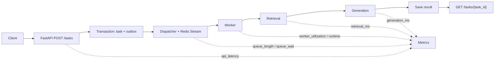
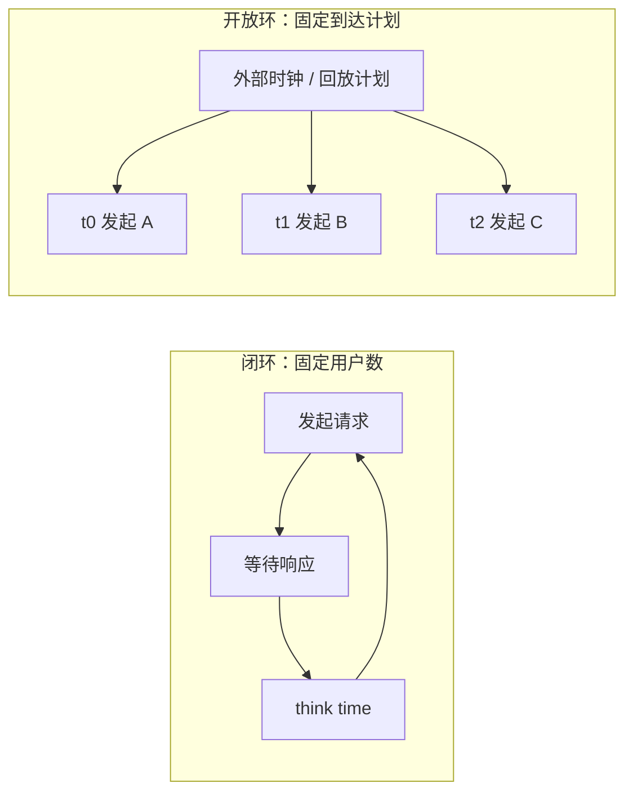
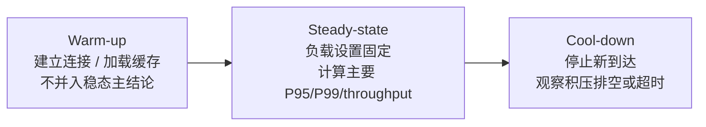

# M08 监控压测与可观测性适配教材

> 模块标签：`M08` · `监控` · `压测` · `metrics` · `P03` · `RQ01`
> 读法：先把“感觉慢”拆成日志、指标和压测数据，再把结论写成可复盘报告。

## 学习导航

本教材按四段阅读，目标是让每个性能判断都有数据证据：

1. [[#第 1 章：为什么需要可观测性|第 1 章]] / [[#第 2 章：日志，先让问题能被解释|第 2 章]] / [[#第 3 章：metrics，给系统建立仪表盘语言|第 3 章]]：日志与指标。读完能记录 request、task、error 和 latency。
2. [[#第 4 章：P95/P99，别被平均值骗了|第 4 章]] / [[#第 5 章：吞吐、错误率、队列长度和 worker utilization|第 5 章]]：核心性能指标。读完能解释 average、P95/P99、吞吐、错误率和 worker 利用率。
3. [[#第 6 章：tracing 基础，理解一次请求的路径|第 6 章]] / [[#第 7 章：压测实验设计|第 7 章]] / [[#第 7.5 章：负载测量和实验阶段|第 7.5 章]] / [[#第 7.6 章：饱和点、固定回放和实验判定|第 7.6 章]]：链路、负载与容量边界。读完能设计一次 API/RAG/队列压测，并说明结果受哪种负载模型和测量方法约束。
4. [[#第 8 章：从 M05 调度实验到真实服务监控|第 8 章]] / [[#第 9 章：常见误判和排查顺序|第 9 章]] / [[#第 10 章：报告模板|第 10 章]]：解释与报告。读完能把指标变化写成工程结论。

## 目标读者、先修与环境检查

本教材面向已经掌握 Python 基础、HTTP/API 状态码、P03 任务状态，以及 M05 中 waiting time、P95/P99 和 worker utilization 定义，准备为 P03/E08 建立可观测与压测证据的人。缺少 API 前置时先回到 M02，缺少队列与指标前置时先回到 M05。

在 `50_项目产出/P03_AI_Workload_Platform/p03_service` 目录运行：

```powershell
.\.venv\Scripts\python.exe --version
.\.venv\Scripts\python.exe -c "import locust, fastapi; print('M08 prerequisite ok', fastapi.__version__, locust.__version__)"
```

当前 verified reference 应显示 Python 3.13、FastAPI 0.116.1、Locust 2.45.0，并打印 `M08 prerequisite ok`。失败时先按 P03 README 创建 dev 虚拟环境，不要用系统 Python 或未锁定依赖继续实验。

当前实现边界以 P03 v0.3.1 为准：主提交端点是 `POST /tasks`，任务查询是 owner-scoped `GET /tasks/{task_id}`；`/metrics` 需要 operator bearer 并返回 JSON 聚合指标，公开 `/health` 只表示进程存活，`/ready` 在 `postgres_redis` backend 下才检查 PostgreSQL/Redis 依赖，在 memory backend 下只报告 memory ready。第 3 章的 `/prometheus` 是独立教学示例，不是 P03 当前接口；开放环方案、示例容量数据和报告模板也不代表已经执行过真实容量实验。

建议用时为作者侧初步估计 12-16 小时，包含固定回放与报告练习，不包含真实服务容量结论的采集。

| 范围 | 内容类型 | 阅读承诺 |
|---|---|---|
| 第 1-10 章 | `instructional` | 通过概念、worked example、反例、练习与检查标准建立可观测和压测能力 |
| 项目贯通案例 | `workbook` 小节 | 给出待执行任务、输入和观测要求，不预填真实容量结论 |
| 学习顺序、外部资料与最终检查 | `appendix` 小节 | 用于导航和复核，不作为新的教学章节统计 |

## 编写说明

这份教材服务于 P01 和 P03，不是监控平台大全。

M08 的核心目标是把一句模糊的话：

```text
系统感觉有点慢。
```

变成可以观察、可以压测、可以解释、可以写进实验报告的数据证据。下面的数字只示范合格表达，不是 P03 实测结果：

```text
在 30 个闭环并发用户、稳定阶段实测每秒约 12 个 RAG 请求的压测下，
API p95 latency 从 1.8s 上升到 4.6s，
queue_length 峰值达到 87，
worker_utilization 接近 0.96，
失败率从 0.2% 上升到 3.4%。
瓶颈主要来自 worker 处理能力不足，而不是 API 接口本身。
```

本教材基于以下真实资料和本学习库已有内容改写：

- [Prometheus Overview](https://prometheus.io/docs/introduction/overview/)
- [Prometheus Getting Started](https://prometheus.io/docs/prometheus/latest/getting_started/)
- [Prometheus Histograms and Summaries](https://prometheus.io/docs/practices/histograms/)
- [prometheus/client_python](https://github.com/prometheus/client_python)
- [Locust Documentation](https://docs.locust.io/)
- [Locust：Writing a locustfile / wait_time](https://docs.locust.io/en/stable/writing-a-locustfile.html#wait-time-attribute)
- [Locust：HttpUser API](https://docs.locust.io/en/stable/api.html#locust.HttpUser)
- [Grafana k6 Documentation](https://grafana.com/docs/k6/latest/)
- [Grafana k6：Open and closed models](https://grafana.com/docs/k6/latest/using-k6/scenarios/concepts/open-vs-closed/)
- [Grafana k6：Constant arrival rate](https://grafana.com/docs/k6/latest/using-k6/scenarios/executors/constant-arrival-rate/)
- [USENIX NSDI 2006：Open Versus Closed](https://www.usenix.org/conference/nsdi-06/open-versus-closed-cautionary-tale)
- [wrk2：Coordinated Omission](https://github.com/giltene/wrk2#coordinated-omission)
- [Vegeta Usage Manual](https://github.com/tsenart/vegeta#usage-manual)
- [OpenTelemetry Python Getting Started](https://opentelemetry.io/docs/languages/python/getting-started/)
- [[10_学习模块/M05_任务队列与调度/M05_任务队列与调度_章节教材|M05 任务队列与调度章节教材]]
- [[50_项目产出/P01_Mini_Scheduler/P01_Mini_Scheduler 项目主页|P01 Mini Scheduler]]
- [[50_项目产出/P03_AI_Workload_Platform/P03_AI_Workload_Platform 项目主页|P03 AI Workload Platform]]

第一轮只学项目需要的最小闭环：

```text
日志解释发生了什么
metrics 量化发生得多严重
tracing 帮助理解一次请求经过了哪些阶段
压测制造可重复负载
报告把数据转成工程结论
```

暂时不把重点放在完整 Prometheus 运维、复杂 Grafana 部署、OpenTelemetry 深度源码、分布式追踪平台建设。

## 第一轮学习边界

| 内容 | 第一轮要掌握 | 暂时不深入 | 为什么 |
|---|---|---|---|
| 日志 logging | 能记录 request_id、task_id、status、error_type、duration_ms | 不做日志平台和日志检索集群 | 先能解释失败原因 |
| metrics | 能暴露请求耗时、吞吐、错误率、队列长度、worker 利用率 | 不做复杂指标治理 | P03 先要能用数据判断瓶颈 |
| tracing | 知道一次请求可拆成 API、queue、worker、RAG 阶段 | 不做完整分布式追踪平台 | 先建立链路思维 |
| P95/P99 | 能解释尾延迟，不只看平均值 | 不深入统计学细节 | AI workload 容易出现长尾 |
| 压测 | 能区分闭环并发与开放环到达率，记录测试阶段、offered load、achieved throughput，并识别 coordinated omission | 不追求企业级压测平台 | 先得到负载语义清楚、可重复的实验数据 |
| 报告 | 能写出负载条件、指标变化、瓶颈判断和下一步优化 | 不做花哨可视化 | 服务学习、项目和科研表达 |

## 本模块工程主线

```text
M05 模拟调度指标
-> P01 参考项目中的 average / P95 / P99 / utilization
-> P03 真实 API / RAG / worker 指标
-> E08 压测实验
-> 指标报告与瓶颈解释
```

M05 里你已经学过：

- average waiting time
- P95 / P99 waiting time
- worker utilization
- queue length
- throughput

M08 要做的是把这些指标迁移到真实服务：

| M05/P01 模拟指标 | P03 真实服务指标 | 解释 |
|---|---|---|
| waiting time | queue_wait_ms | 任务从入队到 worker 开始执行的等待时间 |
| turnaround time | total_latency_ms | 从请求进入系统到结果完成的总时间 |
| execution time | task_runtime_ms / rag_runtime_ms | worker 真正执行任务的时间 |
| P95/P99 waiting | p95_queue_wait_ms / p99_queue_wait_ms | 排队尾延迟 |
| worker utilization | worker_busy_seconds / worker_total_seconds | worker 忙碌比例 |
| queue length | queue_length | 当前待处理任务数量 |
| failed task count | task_error_total / error_rate | 失败数和失败率 |
| throughput | requests_per_second / tasks_per_minute | 单位时间处理量 |

<!-- textbook-content: default=instructional -->

## 第 1 章：为什么需要可观测性

### 1.1 为什么要学

系统能启动，不代表系统可解释。

在 P03 里，RAG 请求会经过 API、数据库、Redis 队列、worker、检索、生成、结果回写。只要用户觉得慢，你需要判断：

- 是 API 接口慢？
- 是请求排队太久？
- 是 worker 太少？
- 是 RAG 检索慢？
- 是生成耗时太长？
- 是错误重试导致队列堆积？
- 是某类长任务拖高了 P99？

如果没有日志、metrics 和压测，只能靠猜。

### 1.2 三种观察方式

可观测性第一轮可以理解成三件事：

```text
logs: 发生了什么
metrics: 发生了多少、持续多久、比例多大
traces: 一次请求经过了哪些阶段
```

示例：

| 问题 | 日志怎么帮忙 | metrics 怎么帮忙 | tracing 怎么帮忙 |
|---|---|---|---|
| 请求失败 | 看 error_type 和 traceback | 看 error_rate 是否升高 | 看失败发生在哪一段 |
| 系统变慢 | 看慢请求 task_id | 看 P95/P99 是否升高 | 看时间花在 API、queue 还是 worker |
| 队列堆积 | 看任务状态变化 | 看 queue_length 峰值 | 看请求是否长时间停在 queued |
| worker 忙满 | 看 worker start/finish | 看 utilization | 看 worker 阶段耗时 |

### 1.3 在 P03 中的位置

P03 的第一版链路可以写成：

```text
POST /tasks (task_type=rag_retrieval)
-> API 事务写入 pending task + outbox
-> dispatcher 发布 task_id，任务进入 queued
-> worker 用 CAS + lease 执行 RAG
-> result_json / metrics 回写
-> GET /tasks/{task_id} 查询状态
```

M08 要在这条链路中加上证据：

```text
每次请求有 request_id
每个任务有 task_id
每个阶段有 duration_ms
每类失败有 error_type
每个 worker 有 busy/idle 状态
每轮压测有报告
```

### 1.4 常见错误

第一个错误：只看平均耗时。

平均值会掩盖尾部问题。RAG/Agent 任务通常有长尾，少数任务可能因为文档多、检索慢、生成长而非常慢。

第二个错误：只有日志，没有指标。

日志适合查单个问题，但不适合回答“整体变慢了多少”“失败率是不是升高了”。

第三个错误：只有指标，没有实验条件。

如果没有记录并发数、请求类型、数据规模、worker 数量，指标就没有解释价值。

### 1.5 小练习

把下面这句话改写成可观测问题：

```text
RAG 接口有时候很慢。
```

参考答案：

```text
在固定文档集合、固定 top_k、固定 worker 数量下，
用 Locust 生成 10/30/50 并发请求，
分别记录 API latency、queue_wait_ms、retrieval_ms、generation_ms、queue_length、error_rate。
判断慢主要来自排队、检索、生成还是失败重试。
```

### 1.6 本章检查标准

- [ ] 能解释 logs、metrics、tracing 的区别。
- [ ] 能说明为什么平均值不够。
- [ ] 能把“系统慢”改写成可测量问题。
- [ ] 能说出 M08 如何服务 P03。

## 第 2 章：日志，先让问题能被解释

### 2.1 为什么要学

日志是排查问题的第一层证据。

P03 第一轮不需要日志平台，但每条关键日志至少要回答：

- 哪个请求？
- 哪个任务？
- 到了哪个阶段？
- 当前状态是什么？
- 用了多久？
- 是否失败？
- 失败类型是什么？

### 2.2 结构化日志

不推荐只写：

```text
task failed
```

更好的日志应该像这样：

```json
{
  "event": "task_failed",
  "request_id": "req_20260629_001",
  "task_id": "task_123",
  "task_type": "rag_retrieval",
  "status": "failed",
  "error_type": "retrieval_timeout",
  "duration_ms": 8420,
  "retry_count": 1
}
```

结构化日志的好处是后续可以被搜索、统计和转成指标。

### 2.3 P03 最小日志点

| 位置 | 日志事件 | 关键字段 |
|---|---|---|
| API 收到请求 | request_received | request_id、path、method |
| 创建任务 | task_created | task_id、task_type、priority |
| 入队成功 | task_queued | task_id、queue_name |
| worker 开始 | task_started | task_id、worker_id |
| RAG 检索结束 | retrieval_finished | task_id、retrieval_ms、top_k |
| 生成结束 | generation_finished | task_id、generation_ms、token_count |
| 任务成功 | task_succeeded | task_id、total_latency_ms |
| 任务失败 | task_failed | task_id、error_type、retry_count |

### 2.4 最小 Python 示例

```python
import json
import logging
import time

logging.basicConfig(level=logging.INFO)
logger = logging.getLogger("p03")


def log_event(event: str, **fields):
    payload = {"event": event, **fields}
    logger.info(json.dumps(payload, ensure_ascii=False))


def run_task(task_id: str):
    started = time.perf_counter()
    log_event("task_started", task_id=task_id, worker_id="worker-1")

    try:
        # 这里替换成真实 RAG 逻辑
        time.sleep(0.2)
        duration_ms = int((time.perf_counter() - started) * 1000)
        log_event("task_succeeded", task_id=task_id, duration_ms=duration_ms)
    except Exception as exc:
        duration_ms = int((time.perf_counter() - started) * 1000)
        log_event(
            "task_failed",
            task_id=task_id,
            duration_ms=duration_ms,
            error_type=type(exc).__name__,
        )
        raise
```

### 2.5 和 M06 的关系

M06 负责状态持久化，M08 负责观察状态变化。

例如 M06 的任务状态：

```text
pending -> queued -> running -> succeeded
pending -> queued -> running -> failed -> retrying -> queued
```

M08 要记录每个状态发生的时间，从而计算：

```text
queue_wait_ms = started_at - queued_at
task_runtime_ms = finished_at - started_at
total_latency_ms = finished_at - created_at
```

### 2.6 常见错误

第一个错误：日志没有 task_id。

没有 task_id，就很难把 API 日志、worker 日志、错误日志串起来。

第二个错误：只记录成功，不记录失败。

失败日志必须有 `error_type`，否则后续只能看到失败率升高，却不知道失败原因。

第三个错误：日志里写敏感信息。

不要把真实 API key、用户隐私、完整文档内容直接写进日志。

### 2.7 小练习

为 P03 的 `POST /tasks`（`task_type=rag_retrieval`）设计 5 条关键日志：

1. 请求进入 API。
2. 任务创建。
3. 任务入队。
4. worker 开始执行。
5. 任务完成或失败。

每条日志至少包含 `request_id` 或 `task_id`。

### 2.8 本章检查标准

- [ ] 能解释为什么结构化日志比普通文本更适合工程排查。
- [ ] 能为 P03 设计最小日志字段。
- [ ] 能通过日志串起 API、queue、worker。
- [ ] 能避免把敏感信息写进日志。

## 第 3 章：metrics，给系统建立仪表盘语言

### 3.1 为什么要学

日志告诉你某个任务发生了什么，metrics 告诉你整体系统正在发生什么。

P03 第一轮最重要的 metrics 不是数量多，而是能回答这些问题：

- 请求是否变慢？
- 吞吐是否下降？
- 错误率是否升高？
- 队列是否堆积？
- worker 是否忙满？
- RAG 哪个阶段最耗时？

### 3.2 指标类型

第一轮只需要理解四类：

| 类型 | 用途 | P03 示例 |
|---|---|---|
| Counter | 只增不减的计数 | `http_requests_total`、`task_errors_total` |
| Gauge | 当前值，可升可降 | `queue_length`、`active_workers` |
| Histogram | 分桶统计耗时，可算 P95/P99 | `request_latency_seconds` |
| Summary | 客户端摘要统计 | 第一轮可先不用 |

### 3.3 P03 最小指标表

| 指标名 | 类型 | 含义 | 对应问题 |
|---|---|---|---|
| `http_requests_total` | Counter | API 请求总数 | 吞吐 |
| `http_request_duration_seconds` | Histogram | API 请求耗时 | API P95/P99 |
| `task_created_total` | Counter | 创建任务数 | 负载进入量 |
| `task_errors_total` | Counter | 任务失败数 | 失败率 |
| `queue_length` | Gauge | 当前队列长度 | 是否堆积 |
| `task_queue_wait_seconds` | Histogram | 排队等待时间 | 调度尾延迟 |
| `task_runtime_seconds` | Histogram | worker 执行时间 | worker/RAG 耗时 |
| `worker_busy` | Gauge | 忙碌 worker 数 | worker 利用率 |
| `rag_retrieval_seconds` | Histogram | 检索耗时 | RAG 检索瓶颈 |
| `rag_generation_seconds` | Histogram | 生成耗时 | 生成瓶颈 |

### 3.4 最小 FastAPI metrics 示例

下面示例用于理解，不要求一开始写得完美。

```python
import time

from fastapi import FastAPI, Request
from prometheus_client import Counter, Histogram, generate_latest, CONTENT_TYPE_LATEST
from starlette.responses import Response

app = FastAPI()

HTTP_REQUESTS = Counter(
    "http_requests_total",
    "Total HTTP requests",
    ["method", "path", "status"],
)

HTTP_LATENCY = Histogram(
    "http_request_duration_seconds",
    "HTTP request latency in seconds",
    ["method", "path"],
)


@app.middleware("http")
async def metrics_middleware(request: Request, call_next):
    start = time.perf_counter()
    status_code = 500

    try:
        response = await call_next(request)
        status_code = response.status_code
        return response
    finally:
        duration = time.perf_counter() - start
        route = request.scope.get("route")
        route_path = getattr(route, "path", None)
        path = route_path if isinstance(route_path, str) else "unmatched"
        method = request.method
        HTTP_REQUESTS.labels(method=method, path=path, status=str(status_code)).inc()
        HTTP_LATENCY.labels(method=method, path=path).observe(duration)


@app.get("/prometheus")
def prometheus_metrics():
    return Response(generate_latest(), media_type=CONTENT_TYPE_LATEST)
```

必须在 `await call_next(request)` 完成路由匹配后读取 `request.scope["route"].path`。直接使用
`request.url.path` 会把每个真实 task_id 变成新 label；未匹配路由和路由前异常统一归到低基数
`unmatched`。上面的 `/prometheus` 是 Prometheus 教学端点，不是当前 P03 v0.3.1 的 `/metrics`；
后者是需要 operator bearer 的 JSON 聚合接口。

### 3.5 为什么要控制 label

不要这样做：

```python
HTTP_LATENCY.labels(path=f"/tasks/{task_id}")
```

如果每个 task_id 都变成一个 label 值，指标会爆炸。

更好的做法：

```python
HTTP_LATENCY.labels(path="/tasks/{task_id}")
```

第一轮记住：label 用来分组，不是用来塞唯一 ID。

> **可迁移的原则**：metrics 的价值在于稳定聚合，不在于记录每个细节。唯一 ID、长文本、完整 query 应该进日志或任务表；metrics label 只保留低基数、可分组、能解释趋势的维度。

### 3.6 和 M05 的关系

M05 中你自己算：

```text
average_wait
p95_wait
p99_wait
worker_utilization
```

M08 中这些指标要从真实服务数据产生：

```text
queued_at / started_at / finished_at
-> queue_wait_seconds
-> task_runtime_seconds
-> total_latency_seconds
```

worker utilization 也从模拟公式变成真实记录：

```text
worker_busy_seconds / observation_window_seconds
```

如果有 4 个 worker，观察窗口是 60 秒，总可用时间是：

```text
4 * 60 = 240 worker-seconds
```

如果总忙碌时间是 180 秒：

```text
utilization = 180 / 240 = 0.75
```

### 3.7 常见错误

第一个错误：把所有信息都塞进 metrics。

唯一 ID、长文本、错误堆栈应该进日志，不应该作为 label。

#### 踩坑现场：把 task_id 放进 label，仪表盘越来越慢

如果每个任务都生成一个新的 `path` 或 `task_id` label，指标系统会把它们当成不同时间序列。压测跑几千个任务后，查询会变慢，图表也会混乱。正确做法是用 `/tasks/{task_id}` 这种模板路径，把具体 `task_id` 留在日志和任务表。

第二个错误：只有总耗时，没有阶段耗时。

RAG 总耗时高时，必须拆成 `queue_wait`、`retrieval`、`generation`，否则无法定位。

第三个错误：只有当前值，没有历史趋势。

单个时间点的 queue_length 没意义，要看压测期间如何变化。

### 3.8 小练习

为 P03 设计 6 个最小指标：

1. API 请求总数。
2. API 请求耗时。
3. 任务失败总数。
4. 队列长度。
5. 排队等待时间。
6. worker 执行时间。

说明每个指标应该用 Counter、Gauge 还是 Histogram。

### 3.9 本章检查标准

- [ ] 能解释 Counter、Gauge、Histogram 的区别。
- [ ] 能说明为什么 P95/P99 通常依赖 Histogram。
- [ ] 能设计 P03 最小 metrics 表。
- [ ] 能解释 label 爆炸为什么危险。

## 第 4 章：P95/P99，别被平均值骗了

### 4.1 为什么要学

AI workload 的性能问题经常出现在尾部。

100 个请求里，前 90 个都很快，不代表系统体验好。真正影响用户和实验结论的，可能是最后 5 个或 1 个特别慢的请求。

### 4.2 P95/P99 是什么

简单理解：

```text
P95: 95% 的请求不超过这个耗时
P99: 99% 的请求不超过这个耗时
```

如果某轮压测结果是：

```text
average latency = 800ms
p95 latency = 2400ms
p99 latency = 8000ms
```

说明平均值看起来还可以，但尾部请求已经很慢。

> **可迁移的原则**：平均值回答“总体大概如何”，P95/P99 回答“尾部用户会不会被牺牲”。调度、队列和 AI workload 的风险通常藏在尾部，所以 M05 的策略比较和 P03 的压测报告都不能只看 average。

### 4.3 M05 到 M08 的迁移

M05 里 P95/P99 主要用于调度模拟：

```text
P95 waiting time
P99 waiting time
```

M08 里要拆成更多真实服务指标：

| 指标 | 含义 | 对应瓶颈 |
|---|---|---|
| `p95_api_latency` | API 接口尾延迟 | FastAPI、网络、序列化 |
| `p95_queue_wait` | 排队尾延迟 | worker 不足、调度策略问题 |
| `p95_task_runtime` | 执行尾延迟 | RAG/Agent 任务太慢 |
| `p95_retrieval` | 检索尾延迟 | 向量检索、过滤、top_k |
| `p95_generation` | 生成尾延迟 | 模型调用、token 数量 |

### 4.4 最小计算示例

如果暂时不接 Prometheus，可以先用 Python 列表练习：

> 环境要求：本模块统一使用 Python 3.13 项目 `.venv`。若类型标注报错，先检查解释器路径，不再用兼容 Python 3.8/3.9 的改写掩盖环境漂移。

```python
import math


def percentile(values: list[float], p: float) -> float:
    if not 0.0 <= p <= 1.0:
        raise ValueError("p must be between 0 and 1")
    if not values:
        raise ValueError("percentile requires at least one observation")
    ordered = sorted(values)
    index = max(0, math.ceil(p * len(ordered)) - 1)
    return ordered[index]


latencies = [120, 130, 140, 150, 160, 170, 180, 900, 1200, 3000]

print("avg=", sum(latencies) / len(latencies))
print("sample_count=", len(latencies))
print("p95=", percentile(latencies, 0.95))
print("p99=", percentile(latencies, 0.99))
```

真实项目里建议让 Prometheus Histogram 或压测工具报告 P95/P99，本示例只是帮助理解。任何
percentile 都必须同时报告样本数和观测窗口；空窗口应输出 missing/null 或明确报错，不能输出
`0`，因为“没有样本”不等于“延迟为零”。

### 4.5 常见误判

第一个误判：平均值下降，所以策略一定更好。

M05 已经说明过，SJF 可能降低平均等待，但牺牲长任务，导致 P99 变差。

第二个误判：P99 上升就是 API 慢。

P99 可能来自排队，也可能来自 worker/RAG。必须拆阶段。

第三个误判：单轮压测结果就是结论。

压测至少要记录环境、并发、请求类型、数据规模，并尽量重复。

#### 踩坑现场：average 变好了，却把长 RAG 任务饿住了

如果 SJF 或 cost-aware 策略让短任务更快完成，average queue wait 可能明显下降。但长文档 RAG、Agent 报告或高 token 任务可能排得更久，P99 反而恶化。判断策略好坏时，要同时看任务类型分组、P95/P99 和失败率。

### 4.6 小练习

对比下面两组结果：

| 策略 | average queue wait | p95 queue wait | p99 queue wait |
|---|---:|---:|---:|
| FIFO | 900ms | 2200ms | 3600ms |
| SJF | 600ms | 3100ms | 7800ms |

回答：

1. 哪个策略平均等待更好？
2. 哪个策略尾部体验更差？
3. 如果 P03 面向多租户 RAG 请求，是否能只看 average？

### 4.7 本章检查标准

- [ ] 能解释 P95/P99。
- [ ] 能说明 average 和 P95/P99 的区别。
- [ ] 能把 M05 的尾延迟迁移到 P03 的真实指标。
- [ ] 能识别“平均值好但尾部变差”的情况。

## 第 5 章：吞吐、错误率、队列长度和 worker utilization

### 5.1 为什么要学

延迟不是唯一指标。

P03 的调度和监控至少要同时看：

```text
latency: 用户等多久
throughput: 系统处理多少
error_rate: 有多少失败
queue_length: 有多少任务堆积
worker_utilization: 资源忙不忙
```

只看一个指标容易得出错误结论。

> **可迁移的原则**：性能指标必须成组解释。吞吐、错误率、队列长度、worker utilization 和尾延迟描述的是同一个系统的不同侧面；单独看任何一个，都可能把瓶颈判断错。

### 5.2 吞吐

吞吐表示单位时间完成多少工作。

常见写法：

```text
requests per second
tasks per minute
tokens per second
documents per minute
```

P03 第一轮可以先记录：

- API 每秒请求数。
- worker 每分钟完成任务数。
- RAG 每分钟完成 query 数。

### 5.3 错误率

错误率不是简单的“有没有报错”，而是：

```text
error_rate = failed_requests / total_requests
```

P03 最少按错误类型拆：

| error_type | 可能原因 |
|---|---|
| `validation_error` | 请求参数错误 |
| `queue_timeout` | 队列等待太久 |
| `retrieval_timeout` | 检索超时 |
| `generation_timeout` | 生成超时 |
| `worker_crash` | worker 异常退出 |
| `rate_limited` | 外部模型限流 |

### 5.4 队列长度

queue_length 是判断系统是否堆积的关键指标。

如果压测时看到：

```text
request_rate 上升
queue_length 持续上升
worker_utilization 接近 1.0
p95_queue_wait 持续上升
```

通常说明 worker 处理能力不足。

如果看到：

```text
request_rate 不高
queue_length 不高
api_latency 很高
worker_utilization 很低
```

问题可能在 API、数据库连接、网络、锁等待，而不是 worker 数量。

### 5.5 worker utilization

worker utilization 表示 worker 有多少时间在忙。

M05 里的利用率公式可以迁移到 P03：

```text
worker_utilization = total_busy_time / total_available_time
```

示例：

```text
2 个 worker
观察窗口 60 秒
总可用时间 = 120 worker-seconds
两个 worker 总忙碌 96 秒
utilization = 96 / 120 = 0.8
```

> **可迁移的原则**：高 utilization 不是天然好事。它可能表示资源充分利用，也可能表示系统已经没有缓冲、队列开始堆积、尾延迟即将恶化。必须和 queue_length、P95/P99、error_rate 一起读。

### 5.6 指标组合判断

| 现象 | 可能解释 |
|---|---|
| queue_length 高、utilization 高、P95 高 | worker 不足或任务太重 |
| queue_length 高、utilization 低 | worker 没消费、队列连接错误、调度器问题 |
| error_rate 高、latency 低 | 请求快速失败，可能是参数或依赖错误 |
| latency 高、error_rate 低 | 系统慢但还没失败 |
| throughput 上升、P99 急剧上升 | 系统进入拥塞或尾部任务被牺牲 |

### 5.7 小练习

给出下面现象的判断：

```text
并发从 10 增加到 50 后：
throughput 只小幅上升
queue_length 从 3 增加到 120
worker_utilization = 0.98
p95_queue_wait 从 300ms 增加到 9000ms
error_rate = 0.5%
```

回答：

1. 主要瓶颈在哪里？
2. 是 API 先出问题，还是 worker 处理能力先出问题？
3. 下一轮实验应该增加 worker，还是先优化 FastAPI？

### 5.8 本章检查标准

- [ ] 能解释吞吐、错误率、队列长度、worker utilization。
- [ ] 能用组合指标判断瓶颈。
- [ ] 能说明为什么单个指标不能直接给出结论。
- [ ] 能把 M05 的 worker utilization 接到 P03。

## 第 6 章：tracing 基础，理解一次请求的路径

### 6.1 为什么要学

tracing 的第一轮目标不是搭完整链路追踪系统，而是建立“阶段拆分”的思维。

一次 RAG 请求不是一个黑盒，它至少包括：

```text
API receive
-> validate input
-> create task
-> enqueue
-> wait in queue
-> worker start
-> retrieval
-> generation
-> save result
-> return / query status
```

如果只记录总耗时，你不知道时间花在哪里。

### 6.2 span 是什么

可以把 span 理解成一次请求中的一个阶段：

```text
trace: task_123 的完整路径
span 1: API create_task
span 2: queue_wait
span 3: worker_run
span 4: rag_retrieval
span 5: rag_generation
span 6: save_result
```

第一轮即使不用 OpenTelemetry，也可以用字段记录这些阶段耗时。

### 6.3 P03 最小阶段表

| 阶段 | 起点 | 终点 | 产生指标 |
|---|---|---|---|
| API 接收 | request_received_at | task_created_at | api_create_ms |
| 排队 | queued_at | started_at | queue_wait_ms |
| worker 执行 | started_at | finished_at | task_runtime_ms |
| 检索 | retrieval_started_at | retrieval_finished_at | retrieval_ms |
| 生成 | generation_started_at | generation_finished_at | generation_ms |
| 总耗时 | created_at | finished_at | total_latency_ms |

### 6.4 Mermaid 链路图



### 6.5 常见错误

第一个错误：过早上全链路追踪平台。

如果连 task_id、queued_at、started_at、finished_at 都没有，直接上复杂 tracing 工具只会增加负担。

第二个错误：阶段边界不清。

例如把 queue_wait 和 worker_runtime 混在一起，会导致你误判瓶颈。

第三个错误：缺少 request_id/task_id 关联。

API 和 worker 是不同进程，必须靠 ID 关联。

### 6.6 小练习

为 P03 的 RAG 请求画一张阶段表，至少包含：

- API 创建任务。
- Redis 排队。
- worker 执行。
- retrieval。
- generation。
- result 保存。

每个阶段写出开始时间、结束时间和对应指标名。

### 6.7 本章检查标准

- [ ] 能解释 trace 和 span 的直觉含义。
- [ ] 能把 RAG 请求拆成阶段。
- [ ] 能说明为什么第一轮不急着做复杂 tracing。
- [ ] 能设计 P03 最小阶段耗时字段。

## 第 7 章：压测实验设计

### 7.1 为什么要学

压测不是“点一下看看会不会挂”。

压测要回答一个明确问题：

```text
在某种负载条件下，系统指标如何变化，瓶颈在哪里，下一步怎么优化？
```

P03 第一轮压测对象包括：

- API 创建任务接口。
- RAG 查询接口。
- 任务状态查询接口。
- worker 执行能力。
- 队列堆积情况。

### 7.2 最小压测变量

每次压测至少固定或记录：

| 变量 | 示例 | 记录要求 |
|---|---|---|
| 负载模型 | closed-loop / open-loop / fixed replay | 必须先写模型，不能只写“压到 20 RPS（requests per second，请求/秒）” |
| 闭环并发用户 | 10 / 30 / 50 | 仅闭环实验把它当主要输入 |
| 目标到达率 | 5 / 10 / 20 requests/s | 仅开放环实验设置；同时记录实际发起率 |
| 请求类型与比例 | short_rag 70% / long_rag 30% | 固定 payload 集合、比例和随机种子 |
| 文档规模 | 10 篇 / 100 篇 | 固定数据版本和 collection |
| top_k | 3 / 5 / 10 | 一轮实验只改变计划中的自变量 |
| worker 数量 | 1 / 2 / 4 | 记录实际存活和 busy 的 worker 数 |
| 调度策略 | FIFO / Priority / SJF / Cost-aware | 固定实现版本和配置 |
| 测试阶段 | warm-up / steady-state / cool-down | 分阶段保存时间边界和指标 |
| 运行时长 | 预热 2 分钟、稳态 5 分钟、冷却到队列排空 | 这是教学示例，不是通用固定时长 |
| 生成器健康 | CPU、连接错误、计划启动延迟 | 防止把压测机瓶颈误判为服务瓶颈 |

### 7.3 闭环并发和开放环到达率

“30 个并发用户”和“每秒到达 30 个请求”不是同一种负载。

闭环模型通常固定虚拟用户数。每个用户完成一次请求或任务，再等待一段 think time，然后发起下一次：

```text
发起请求 -> 等响应 -> think time -> 再发起请求
```

如果服务变慢，用户循环也会变慢，单位时间内新发起的请求往往随之减少。闭环适合回答“固定数量的交互用户会得到什么体验”，但不能把用户数直接写成固定 RPS。

开放环模型按外部时钟计划请求到达，不等待上一批完成才决定下一批是否到达：

```text
t=0ms 发请求 A
t=100ms 发请求 B
t=200ms 发请求 C
```

当服务变慢时，计划到达仍继续，排队、拒绝或超时才会真实暴露。开放环适合回答“外部业务以固定到达率进入时，系统何时饱和”。前提是压测机有能力按计划发起请求；如果压测机自己落后，必须报告实际启动延迟。



| 对比项 | 闭环并发 | 开放环到达率 |
|---|---|---|
| 主要输入 | 虚拟用户数、用户等待时间 | 目标到达率、到达分布或固定时间表 |
| 服务变慢时 | 用户循环变慢，新请求发起率可能下降 | 计划到达继续，队列和延迟更容易累积 |
| 适合回答 | 固定交互用户的体验 | 固定外部流量下的容量和饱和点 |
| 主要误读 | 把并发数当 RPS | 忽略压测机未能按计划发起请求 |

两种模型没有绝对优劣。关键是先写清业务问题，再选择匹配的模型。同一份报告可以同时包含闭环用户体验实验和开放环容量实验，但两者的输入和结论不能混写。

### 7.4 最小 Locust 示例及其闭环语义

Locust 适合 Python 学习路线，第一轮可以优先用它。

```python
import os
from uuid import uuid4

from locust import HttpUser, between, task


class RagUser(HttpUser):
    wait_time = between(1, 3)

    def on_start(self):
        self.bearer_token = os.environ["P03_LOAD_BEARER_TOKEN"]
        self.run_id = os.getenv("P03_LOAD_RUN_ID", "manual")

    @task(3)
    def create_rag_task(self):
        payload = {
            "task_type": "rag_retrieval",
            "priority": 5,
            "estimated_duration_ms": 0,
            "idempotency_key": f"locust-{uuid4()}",
            "input_json": {
                "query": "Explain why a RAG answer needs citations.",
                "top_k": 3,
                "run_id": self.run_id,
            },
        }
        self.client.post(
            "/tasks",
            json=payload,
            headers={"Authorization": f"Bearer {self.bearer_token}"},
            name="POST /tasks",
        )

    @task(1)
    def health_check(self):
        self.client.get("/health")
```

token 由压测环境注入，不能把开发 token、API key 或用户身份硬编码进教材或 locustfile。每次
新提交使用唯一 `idempotency_key`，否则 owner-scoped 幂等会把重复压测请求折叠成同一任务。
owner scope 由服务端根据 bearer 解析出的 `tenant_id` 和 `user_id` 建立，不能由 payload 声明；
当前幂等唯一性是 `(tenant_id, user_id, idempotency_key)`，观测到的负载才不会因错误复用 key
而偏离预期。

运行方式：

```bash
locust -f locustfile.py --host http://localhost:8000
```

这段 `HttpUser + between(1, 3)` 示例是闭环用户模型，不是固定到达率模型：

1. 每个模拟用户一次执行一个 task；task 返回后，该用户才进入下一轮。
2. `between(1, 3)` 表示每个 task 完成后随机等待 1 到 3 秒。它不是“每秒发 1 到 3 个请求”。
3. 如果一个 task 内有多个 HTTP 请求，等待发生在 task 结束后，而不是自动发生在每一个 HTTP 请求之后。
4. `@task(3)` 和 `@task(1)` 是任务选择权重；有限运行时间内不保证请求比例精确等于 3:1。
5. 服务响应越慢，每个用户完成一轮所需时间越长，因此实测 RPS 可能下降。

当每个 task 只有一个请求且客户端本身不是瓶颈时，可以用下面的粗略关系检查量级：

```text
闭环实测 RPS ≈ 用户数 /（平均响应时间 + 平均 wait_time）
```

这只是教学近似，不替代实测，也不适合直接套到包含多个请求、异步轮询或不同 task 权重的脚本。

如果问题是“系统能否承受固定 20 requests/s”，应另做开放环或固定时间表回放。k6 的 constant-arrival-rate、Vegeta 的 rate 模式和 wrk2 是可调研的开源工具入口；本教材这里只说明设计语义，没有声称已经用它们执行 E08，也没有把它们的示例结果当作本项目实测。

### 第 7 章小结

- 闭环固定用户数，服务变慢时用户循环和实测 RPS 可能一起下降。
- 开放环固定到达计划，适合观察固定外部流量下的排队、拒绝和饱和。
- 当前 `HttpUser + between` 示例是闭环基线；它的 RPS 是观测结果，不是配置承诺。

## 第 7.5 章：负载测量和实验阶段

### 7.5.1 Offered load 和 achieved throughput

压测报告至少要区分“想施加多少负载”和“系统实际完成多少工作”。推荐记录：

| 字段 | 定义 | 常见误读 |
|---|---|---|
| `target_arrival_rate` | 开放环配置的计划到达率 | 把它写成系统已经承受的吞吐 |
| `actual_start_rate` | 压测机实际发起的请求数 / 稳态秒数 | 不检查压测机是否落后于计划 |
| `api_accept_throughput` | API 成功接收并返回 task_id 的数量 / 稳态秒数 | 把“入队成功”当“任务完成” |
| `task_success_throughput` | worker 成功完成的任务数 / 稳态秒数 | 忽略失败、取消和稳态末尾积压 |
| `error_rate` | 失败请求或任务占尝试数的比例，必须写清分母 | 把快速失败也算进成功吞吐 |
| `backlog_delta` | 稳态结束队列长度减去稳态开始队列长度 | 只看完成吞吐，不看债务是否累积 |
| `start_lag_ms` | 实际启动时间减计划启动时间 | 把压测机调度落后归因给被测服务 |

在开放环里，可以把按计划或实际发起给系统的负载称为 offered load，但报告里必须明确使用的是 `target_arrival_rate` 还是 `actual_start_rate`。achieved throughput 也必须注明层级：API 接收吞吐和后台任务完成吞吐不是同一个指标。

当 offered load 上升时，健康系统的成功完成吞吐会先大致跟随上升。接近容量上限后，常出现：

```text
offered load 继续上升
-> achieved throughput 增长变慢或停止
-> queue_length 持续增加
-> P95/P99 上升
-> error_rate 或 timeout 上升
```

这比“某次测到最高 RPS”更接近饱和点证据。

### 7.5.2 Warm-up、steady-state 和 cool-down

缓存、连接池、Python 进程、模型加载和 worker 队列都会让测试刚开始与稳定运行时不同。不能把整段运行时间混成一个 percentile。



| 阶段 | 主要动作 | 指标怎么用 |
|---|---|---|
| warm-up | 逐步建立目标负载，完成必要初始化 | 单独保存；除非研究冷启动，否则不混入稳态主指标 |
| steady-state | 保持负载模型、请求比例和系统配置不变 | 计算主要延迟、吞吐、错误率、队列趋势和利用率 |
| cool-down | 停止新请求，继续观察在途请求和队列 | 记录排空时间、未完成数、取消和超时，不并入稳态到达率 |

“两分钟后一定稳态”不是普遍规律。进入稳态前至少确认：目标设置已经达到、实际发起率没有继续爬升、生成器没有明显落后，并且队列或吞吐的趋势符合本轮测试定义。若队列在固定 offered load 下持续上升，这本身就是不稳定或饱和证据，不能为了得到平滑曲线而等待它“自然稳定”。

冷启动性能也值得测，但应另建实验并明确标注，不能和预热后的稳态结果混为一谈。

### 7.5.3 Coordinated omission

Coordinated omission（协调遗漏）指测量过程会在系统变慢时同步减少或推迟采样，从而漏掉本应在拥塞期间到达并经历排队的请求。

例如业务计划每 100 ms 到达一个请求，而服务发生 2 秒停顿：

- 闭环客户端发出一个请求后等待 2 秒，期间可能没有继续发出新的样本，只记录到少量慢请求。
- 独立于响应的开放环计划在这 2 秒内仍有约 20 个计划到达；它们会等待、超时或被拒绝。

如果研究问题是固定外部到达率，第一种测法会让尾延迟看起来比真实计划负载更好。wrk2 的说明文档专门展示了这种问题，并从“请求原本计划发送的时间”计算延迟。

降低 coordinated omission 风险的做法：

1. 根据研究问题选择开放环，而不是把所有场景都写成固定用户数。
2. 保存 `planned_start_at`、`actual_start_at`、`completed_at`，同时报告启动延迟。
3. 确保压测机、连接数和客户端并发足以维持计划；维持不了就把生成器瓶颈写进限制。
4. 使用固定到达时间表回放时，不因为上一个请求未完成就推迟下一计划请求。
5. 不手工“补造”延迟样本。只有明确理解工具的校正语义时，才使用其 coordinated omission 校正输出。

闭环 Locust 实验并非无效。它仍然适合测固定用户数下的交互体验；错误在于用闭环结果回答固定到达率问题，或把响应变慢导致的 RPS 下降误写成系统承受住了负载。

### 第 7.5 章小结

- 同时记录目标到达、实际发起和分层完成吞吐，才知道负载是否真正施加到系统。
- warm-up、steady-state 和 cool-down 回答不同问题，不能混成一个 P99。
- coordinated omission 的根源是测量时序随服务变慢而推迟；是否构成问题取决于研究问题和负载模型。

## 第 7.6 章：饱和点、固定回放和实验判定

### 7.6.1 饱和点和固定回放

#### 用阶梯负载找饱和点

第一轮可以固定 worker、调度策略、请求比例和数据版本，只逐级提高一种负载输入：

```text
5 requests/s -> 10 requests/s -> 15 requests/s -> 20 requests/s
```

每一级都要有独立的 warm-up 和 steady-state 记录，并至少重复运行以观察波动。饱和点不是一个脱离条件的“最大 RPS”，而是给定硬件、worker 数、请求组合、版本和 SLO 下的操作边界。

把以下信号放在一起判断：

| 信号 | 未饱和时的常见表现 | 接近或超过饱和时的常见表现 |
|---|---|---|
| actual start vs target | 压测机能跟上计划 | actual start 落后时先怀疑生成器 |
| achieved throughput | 随 offered load 增长 | 增长变慢、平台或下降 |
| queue_length | 稳态内大致有界 | 稳态内持续上升 |
| P95/P99 | 随负载缓慢变化 | 明显抬升或超过预先写明的 SLO |
| error/timeout | 处于可接受边界 | 开始持续增加 |
| worker utilization | 尚有余量 | 接近上限且队列同时增长 |

必须在运行前写 SLO 或判定阈值；否则很容易看完曲线后再挑一个对结论有利的“饱和点”。

#### 固定回放不是“同一批请求依次跑”

可复现回放至少固定请求内容和计划到达时间。可以先生成一个 manifest：

```csv
request_id,planned_offset_ms,task_type,payload_ref
r001,0,rag_retrieval,payloads/rag-public.json
r002,100,mock_rag,payloads/mock-short.json
r003,200,rag_retrieval,payloads/rag-public.json
r004,300,mock_rag,payloads/mock-long.json
r005,400,rag_retrieval,payloads/rag-public.json
r006,500,mock_rag,payloads/mock-short.json
```

仓库中的可执行 reference 位于
`p03_service/load/fixed_replay_example/manifest.csv`，sender 入口为
`python -m app.fixed_replay`。它用结构化 CSV/JSON 解析和当前 `TaskCreate` schema 校验 payload，
为每行注入 `run_id:request_id` owner-scoped 幂等键，并为所有计划到达独立创建异步发送任务。
上一请求仍在等待响应或轮询终态时，不会阻塞下一计划启动。

```powershell
$env:P03_REPLAY_BEARER_TOKEN = '<development-bearer-token>'
python -m app.fixed_replay `
  .\load\fixed_replay_example\manifest.csv `
  .\artifacts\fixed_replay_results.csv `
  --base-url http://127.0.0.1:8001 `
  --run-id fixed-replay-001 `
  --poll-timeout-seconds 60
```

bearer 只从环境读取，不进入 manifest、payload 或命令参数。示例 token 只能使用 P03 的本地
development fixture；真实部署使用外部身份系统提供的短期凭据。

回放时记录：

```text
planned_start_at
actual_start_at
response_at
task_completed_at
status
error_type
```

reference CSV 还保存 `start_lateness_ms`、`api_latency_ms`、HTTP status、`created_new`、task id
和 `total_observed_ms`。`api_latency_ms` 只覆盖 `POST /tasks` 到 202 响应；启用轮询后，
`total_observed_ms` 才覆盖 sender 观察到的任务终态。poll timeout 是删失/观测边界，不能改写成
任务失败或零延迟。

如果脚本一定要等 `r001` 完成才发送 `r002`，它仍然是响应协调的闭环回放，不是固定到达时间表。固定时间表回放应按 `planned_offset_ms` 发起；当实际启动落后时，记录 lateness 并判定压测机是否已经成为瓶颈，不能悄悄顺延计划时间。

同一 manifest 可以用于比较 1/2/4 个 worker 或不同调度策略。变化条件之间必须复用同一请求内容、顺序、计划时间和随机种子，才能减少“任务流不同”对结论的污染。

### 7.6.2 压测不是只看 RPS

RPS 高不一定说明系统好。

例如：

```text
RPS 高，但是错误率 20%
```

这不是成功吞吐，而是大量快速失败。

> **可迁移的原则**：压测不是为了证明系统“很快”，而是为了在受控条件下暴露瓶颈。每轮压测都必须写清变量、控制变量、观察指标和下一步动作，否则数字再漂亮也不能指导工程优化。

又例如：

```text
API 返回很快，但只是返回 task_id，真正任务一直 queued
```

这说明 API latency 好看，但任务完成体验很差。所以 P03 必须同时看：

- API response latency。
- task total latency。
- queue_wait。
- worker runtime。
- error_rate。
- API 接收吞吐和任务成功完成吞吐。
- offered load、actual start rate 和 backlog delta。

### 7.6.3 E08 实验路线

E08 可以按三步做：

```text
E08-01: 用 Locust 做闭环用户基线，记录用户数、wait_time 和实测 RPS
-> E08-02: 记录 P95/P99、吞吐、错误率
-> E08-03: 展示 queue_length 和 worker utilization
```

固定时间表 sender 已有 3 项 MockTransport reference tests，验证 manifest/幂等注入、后一计划
请求不等待前一慢响应，以及终态轮询与 CSV 导出；这证明发送器语义，不是 P03 容量实验。
开放环阶梯负载和真实服务回放仍需保存原始输出与环境记录。没有这些证据时，不能写成“已经
用 k6、Vegeta 或 wrk2 验证”。

每个实验都要输出：

- 实验问题。
- 负载模型和为什么选择它。
- 环境和参数。
- warm-up / steady-state / cool-down 边界。
- offered load、actual start rate 和 achieved throughput。
- 指标表。
- 现象解释。
- 下一步优化建议。

### 7.6.4 常见错误

第一个错误：压测数据和实验条件分离。

只保存图，不保存并发、worker 数、请求类型，就无法复盘。

#### 踩坑现场：图很好看，但没人知道当时怎么跑的

只截一张 Locust 或 k6 图，后面很难判断结果是否可复现。至少要记录并发用户、到达速率、worker 数、请求类型、top_k、运行时长、数据规模和代码版本。否则这轮压测不能进入 RQ01，也不适合写进项目报告。

第二个错误：压测真实外部大模型。

第一轮可以用模拟生成耗时，避免花费失控和外部限流干扰。

第三个错误：所有请求都一样。

AI workload 要有短任务、长任务、高优先级任务、高 token 任务，才能观察调度差异。

第四个错误：把 Locust 用户数或 `between` 写成固定到达率。

当前示例只承诺闭环用户行为。RPS 必须从结果中测量，不能从用户数直接命名。

第五个错误：把 warm-up、steady-state 和 cool-down 混在一起算 P99。

这样会把冷启动、稳定运行和积压排空混成一个无法解释的数字。

第六个错误：固定了请求内容，却没有固定计划时间。

如果每个请求都等待上一个完成，系统越慢，后续请求越晚到达，仍然可能产生 coordinated omission。

第七个错误：忽略压测机落后。

当 `actual_start_rate < target_arrival_rate` 或 `start_lag_ms` 持续增长时，必须先检查客户端 CPU、连接数和执行器容量，不能把全部差异归因给 P03。

### 第 7.6 章小结

- 饱和点要由吞吐平台、队列趋势、尾延迟、错误率和预先声明的 SLO 共同判断。
- 固定回放既要固定请求内容，也要固定计划到达时间；顺序相同但随响应顺延仍是闭环。
- 工具候选、实验设计和实际执行是三个状态；只有保留命令、环境和原始输出后，才能写成已验证。

### 7.6.5 可判定练习

下面是开放环阶梯压测的**教学用示例数据，不是 E08 实测结果**。各行只统计 steady-state：

| target arrival | actual start | task success throughput | p95 total latency | backlog delta | error rate | late starts |
|---:|---:|---:|---:|---:|---:|---:|
| 5 req/s | 5.0 req/s | 4.98 task/s | 0.22 s | 0 | 0.4% | 0% |
| 10 req/s | 10.0 req/s | 9.90 task/s | 0.38 s | +1 | 0.5% | 0% |
| 15 req/s | 15.0 req/s | 12.10 task/s | 1.90 s | +52 | 2.0% | 0.4% |
| 20 req/s | 17.0 req/s | 12.30 task/s | 5.20 s | +165 | 8.0% | 15% |

回答：

1. 这是闭环还是开放环实验？哪一列是配置输入，哪几列是观测输出？
2. 第一个有证据支持的饱和区间在哪里？必须同时引用 throughput、latency 和 backlog。
3. 为什么 20 req/s 这一行不能把全部问题都归因给服务端？
4. 如果改用当前 `HttpUser + between(1, 3)` 的闭环脚本，服务变慢时实测 RPS 可能怎样变化？
5. cool-down 期间队列排空完成的任务，能否直接并入 steady-state 的到达率和 P95？为什么？

判定标准：

- [ ] 指出这是开放环，`target arrival` 是配置输入，其余主要列是观测结果。
- [ ] 把首次饱和证据定位在 10 到 15 req/s 之间：成功吞吐未跟随到 15、P95 明显上升、backlog 从近零变为持续增加。
- [ ] 指出 20 req/s 时 actual start 只有 17 req/s 且 late starts 为 15%，压测机或执行器也可能成为限制。
- [ ] 指出闭环脚本会因响应变慢而降低用户循环频率，实测 RPS 可能下降；这不能证明固定 20 req/s 下系统稳定。
- [ ] 指出 cool-down 用于观察积压排空，应单独报告，不能混入 steady-state 的主要延迟和到达率统计。

再为固定回放写一份至少 6 行的 manifest，并检查每行都有唯一 `request_id`、非递减 `planned_offset_ms`、明确 `task_type` 和可追溯 `payload_ref`。这四项全部满足才算通过。

### 7.6.6 本章检查标准

- [ ] 能设计一轮有明确变量的压测。
- [ ] 能说明为什么不能只看 RPS。
- [ ] 能区分闭环并发和开放环到达率。
- [ ] 能准确解释 `HttpUser + between` 的闭环语义。
- [ ] 能区分 target arrival、actual start 和 achieved throughput。
- [ ] 能分开记录 warm-up、steady-state 和 cool-down。
- [ ] 能解释 coordinated omission 为什么会低估固定到达率下的尾延迟。
- [ ] 能用固定 manifest 回放同一任务流，并记录计划时间和实际启动时间。
- [ ] 能根据吞吐平台、队列增长、尾延迟和错误率共同判断饱和区间。
- [ ] 能用 Locust 写最小闭环压测脚本，但不把它误写成固定 RPS。
- [ ] 能把 E08 实验接到 P03。

## 第 8 章：从 M05 调度实验到真实服务监控

### 8.1 为什么要学

M05 的指标不是孤立练习。

它们会在 P03 中变成真实系统的监控指标。你要能讲清：

```text
我在 P01/M05 里用模拟任务学会了调度指标，
然后在 P03 里把这些指标接到可执行的 BM25 RAG/API/worker reference，
用 E08 先验证 workload 与 worker 数对尾延迟、吞吐和利用率的影响；多调度策略服务对比仍是后续实验。
```

### 8.2 映射关系

| M05 概念 | P01 表现 | P03 表现 | M08 观察方式 |
|---|---|---|---|
| Task | dataclass Task | database task row | task_created_total |
| Queue | list / heap | PostgreSQL task/outbox + Redis Stream | broker_queue_length / queue_length |
| Worker | Worker object | worker process | worker_busy / utilization |
| Strategy | FIFO/Priority/SJF | 当前 FIFO；其他策略尚未接入 | 后续按策略分组指标 |
| Waiting time | start - arrival | started_at - queued_at | queue_wait_seconds |
| Completion time | finish - arrival | finished_at - created_at | total_latency_seconds |
| P95/P99 | Python 计算 | Histogram / 压测报告 | p95/p99 dashboard |
| Utilization | busy / total | worker busy seconds | worker_utilization |

### 8.3 P03 指标落库建议

第一轮可以同时做两件事：

1. 任务表保存关键时间字段。
2. 由 operator bearer 鉴权的 `/metrics` 返回 JSON 聚合指标。

任务表字段用于复盘单个任务：

```text
created_at
queued_at
started_at
finished_at
status
error_type
retry_count
```

metrics 用于观察整体趋势：

```text
queue_length
task_queue_wait_seconds
task_runtime_seconds
task_errors_total
worker_busy
```

### 8.4 按调度策略分组

如果 P03 要比较 FIFO / Priority / SJF，指标必须带上策略维度。

但 label 要克制：

```text
scheduler_strategy="fifo"
scheduler_strategy="priority"
scheduler_strategy="sjf"
```

不要把 `task_id`、`query`、`user_id` 放进 metrics label。

> **可迁移的原则**：模拟指标迁移到真实服务时，定义必须先对齐。M05 的 waiting time、P03 的 queue_wait、E08 的 p95_queue_wait 如果边界不同，就不能直接比较策略效果。

### 8.5 常见错误

第一个错误：M05 和 M08 断开。

如果 M08 只学 Prometheus，不连接 M05 指标，学习路线就偏了。

第二个错误：真实服务指标和模拟指标定义不一致。

例如 M05 的 waiting time 是 arrival 到 start，P03 就要明确 queue_wait 是 queued 到 started，不能混用。

第三个错误：比较策略时负载不一致。

FIFO 和 SJF 必须用同一批请求、同一 worker 数、同一数据规模，结果才可比。

### 8.6 小练习

把 M05 的 `average_wait / p95_wait / worker_utilization` 改写成 P03 指标定义：

```text
average_queue_wait_seconds
p95_queue_wait_seconds
worker_utilization
```

并写出每个指标依赖哪些时间字段。

### 8.7 本章检查标准

- [ ] 能说明 M05 指标如何迁移到 P03。
- [ ] 能解释 waiting time 和 queue_wait 的边界。
- [ ] 能按调度策略分组比较指标。
- [ ] 能避免把 M08 学成孤立监控工具。

## 第 9 章：常见误判和排查顺序

### 9.1 为什么要学

监控指标不是答案本身，指标需要解释。

同一个现象可能有多种原因。你要训练的是“根据指标组合缩小范围”。

### 9.2 常见误判表

| 误判 | 为什么错 | 正确看法 |
|---|---|---|
| 平均延迟低，所以系统没问题 | 尾延迟可能很差 | 同时看 P95/P99 |
| RPS 高，所以性能好 | 可能快速失败 | 同时看 error_rate |
| API latency 低，所以用户体验好 | 异步任务可能一直 queued | 看 task total latency |
| queue_length 高，所以 Redis 慢 | 可能 worker 不足 | 看 worker utilization |
| utilization 高，所以资源用得好 | 可能已经拥塞 | 看 P95/P99 和 error_rate |
| P99 高，所以要加机器 | 可能少数长任务没被隔离 | 看 task_type 分组 |

### 9.3 排查顺序

建议按下面顺序排查：

```text
1. 错误率是否升高？
2. API latency 是否升高？
3. queue_length 是否持续上升？
4. worker_utilization 是否接近 1？
5. queue_wait 是否拉高 P95/P99？
6. task_runtime 是否拉高 P95/P99？
7. retrieval/generation 哪个阶段更慢？
8. 是否只影响某类 task_type 或 priority？
```

### 9.4 P03 典型场景

场景一：worker 不足。

```text
queue_length 高
worker_utilization 高
p95_queue_wait 高
task_runtime 正常
```

建议：增加 worker，或改调度策略，或限制入口速率。

场景二：RAG 检索慢。

```text
queue_length 不高
worker_utilization 中等
retrieval_ms 高
generation_ms 正常
```

建议：检查 top_k、chunk 数量、过滤条件、向量库响应。

场景三：生成慢。

```text
generation_ms 高
token_count 高
p99_total_latency 高
```

建议：限制输出长度、优化 prompt、分任务类型统计。

场景四：快速失败。

```text
latency 低
throughput 高
error_rate 高
```

建议：先看日志 error_type，不要误以为吞吐高。

### 9.5 小练习

阅读下面指标：

```text
http p95 = 180ms
task total p95 = 12s
queue_wait p95 = 9s
task_runtime p95 = 2.5s
queue_length peak = 150
worker_utilization = 0.99
error_rate = 1%
```

回答：

1. 用户慢主要慢在哪里？
2. API 层是不是瓶颈？
3. 下一步应该优先观察什么？

### 9.6 本章检查标准

- [ ] 能根据指标组合判断可能瓶颈。
- [ ] 能解释为什么不能单看一个指标。
- [ ] 能区分 API latency 和 task total latency。
- [ ] 能写出排查顺序。

## 第 10 章：报告模板

### 10.1 为什么要学

M08 的产出不是“我搭了监控”，而是：

```text
我能用压测和指标证明系统瓶颈在哪里，并解释优化是否有效。
```

这对学习、项目 README、科研训练和简历表达都很关键。

### 10.2 最小报告结构

```markdown
# 压测与监控报告：标题

## 1. 实验问题

本轮实验要回答什么问题？

## 2. 实验环境

- 日期：
- 机器：
- 服务版本：
- worker 数量：
- 调度策略：
- 数据规模：
- 压测工具：
- 压测机配置：

## 3. 压测参数

- 负载模型：closed-loop / open-loop / fixed replay
- 闭环并发用户（如适用）：
- 目标到达率（如适用）：
- request manifest / seed：
- 请求类型：
- warm-up 时间和退出条件：
- steady-state 时间边界：
- cool-down 结束条件：

## 4. 指标结果

| 指标 | 结果 | 解释 |
|---|---:|---|
| target_arrival_rate |  | 仅开放环适用 |
| actual_start_rate |  | 检查生成器是否跟上计划 |
| api_accept_throughput |  | API 接收任务能力 |
| task_success_throughput |  | 后台任务实际完成能力 |
| error_rate |  |  |
| average_latency |  |  |
| p95_latency |  |  |
| p99_latency |  |  |
| p95_queue_wait |  |  |
| backlog_delta |  | 判断积压是否持续增长 |
| queue_length_peak |  |  |
| worker_utilization |  |  |
| start_lag_p95 |  | 检查压测机启动延迟 |

## 5. 现象解释

哪些指标升高？哪些指标正常？瓶颈更像在哪里？

## 6. 结论

本轮实验支持什么结论？有什么限制？

## 7. 下一步

下一轮实验要改变哪个变量？
```

### 10.3 报告写作要点

好的报告要避免“只贴图不解释”。

每个结论都要对应数据：

```text
不合格：worker 数量不够。
合格：并发 50 时 queue_length 峰值达到 150，worker_utilization 为 0.99，p95_queue_wait 达到 9s，而 API p95 只有 180ms，因此瓶颈更可能在 worker 处理能力，而不是 API 层。
```

### 10.4 和 P01/P03 的关系

P01 的报告偏调度模拟：

```text
同一批任务，不同策略下 average / P95 / P99 / utilization 怎么变化？
```

P03 的报告偏真实服务：

```text
同一批 RAG/API 请求，不同 worker 数或调度策略下，API latency、queue_wait、task_runtime、queue_length、error_rate 怎么变化？
```

### 10.5 小练习

用下面数据写 5 句话结论：

| worker | throughput | p95_queue_wait | p99_queue_wait | utilization |
|---:|---:|---:|---:|---:|
| 1 | 4 req/s | 12s | 20s | 0.99 |
| 2 | 7 req/s | 5s | 9s | 0.91 |
| 4 | 9 req/s | 1.8s | 3.2s | 0.62 |

要求同时解释：

- 延迟变化。
- 吞吐变化。
- 利用率变化。
- 成本/资源取舍。

### 10.6 本章检查标准

- [ ] 能写出压测报告结构。
- [ ] 能把指标变成工程结论。
- [ ] 能说明实验限制。
- [ ] 能提出下一轮实验变量。

## 项目贯通案例：P03 RAG 任务压测

### 目标

用一轮最小压测回答：

```text
P03 当前 worker 数量是否足够承接 RAG 请求？
```

### 前置条件

- M02：FastAPI 有 `POST /tasks` 和 owner-scoped `GET /tasks/{task_id}`。
- M03：RAG 请求边界清楚，可以用真实或模拟 RAG worker。
- M06：任务有状态和时间字段。
- M07：api、db、redis、worker 可以用 compose 启动。
- M08：API 和 worker 暴露基础 metrics。

### 最小流程

```text
docker compose up --build
-> 确认 /health 正常
-> 确认 postgres_redis backend 下 /ready 的 PostgreSQL/Redis 依赖正常
-> 用环境变量中的 operator bearer 查询 /metrics JSON
-> Locust 用提交用户 bearer 压测 POST /tasks，task_type=rag_retrieval
-> 按数据源记录 API latency / task latency / queue_wait / queue_length / worker busy time
-> 输出压测报告
```

`POST /tasks` 返回 202 只表示任务已接收，Locust 的该请求 latency 不是 task total latency。
任务完成延迟要么用同一 owner bearer 轮询响应中的 `task.task_id`，要么从带 `run_id` 过滤的
operator `/metrics` JSON 和数据库时间字段计算。提交 token 与 operator token 职责不同，都从
环境注入；报告不能把公开 `/health` 成功误写成依赖已经 ready。

### 观测指标

| 指标 | 当前 P03 v0.3.1 数据源 | 为什么看 |
|---|---|---|
| API p95 latency | Locust 的命名请求 `POST /tasks` | 判断接口接收层是否慢；不等于任务完成延迟 |
| task p95 total latency | owner-scoped `GET /tasks/{task_id}` 的 `total_latency_ms` 样本 | 判断任务从创建到完成的真实等待 |
| p95 queue wait | operator `/metrics` JSON 的 `p95_queue_wait_ms` | 判断排队是否是瓶颈 |
| p95 task runtime | operator `/metrics` JSON 的 `p95_runtime_ms` | 判断 worker/RAG 是否慢 |
| queue length peak | 在 steady-state 周期采样 `/metrics.queue_length` 后取峰值 | 判断是否持续堆积；单次快照不是峰值 |
| worker utilization | 用 `worker_busy_time_ms`、`observation_window_ms` 和已记录的 worker 容量派生 | 当前 JSON 不直接返回 utilization，缺少容量口径时不得计算 |
| error rate | 在同一 `run_id` 和阶段内由 `status_counts` 的终态计数派生 | 判断是否出现失败；不能把运行中任务放进完成任务分母 |
| task success throughput | 用 steady-state 内完成时间戳计数除以观测时长；`completed_last_minute` 只作一分钟快照参考 | 判断后台真实处理能力 |

因此，当前 `/metrics` 不是 Prometheus 文本端点，也不是一张已经替你算好所有报告指标的表。
报告必须保存采样时刻、`run_id`、阶段边界和派生公式，才能把不同来源的观测安全地合并。

### 最小结论模板

```text
在负载模型 X、负载输入 Y、worker 数量 W、调度策略 Z 下，
steady-state 的 actual start rate 为 S，task success throughput 为 T，
P03 的 API p95 为 A，task p95 为 B，queue_wait p95 为 C，
backlog delta 为 D，queue_length 峰值为 Q，worker utilization 为 E，error_rate 为 F。

仅当实测表明 queue_wait 占 task total latency 的主要部分，且按明确容量口径计算的 worker
utilization 接近 1 时，才支持“瓶颈更可能在 worker 处理能力”的判断；否则应写为证据不足。
证据成立后，下一轮再增加 worker 数量，或比较 FIFO/Priority/SJF 对 p95_queue_wait 的影响。
```

## 第一轮学习顺序

1. 读第 1 章，理解 M08 的任务是把“感觉慢”变成证据。
2. 读第 2 章，为 P03 设计结构化日志字段。
3. 读第 3 章，设计最小 metrics 表。
4. 读第 4-5 章，掌握 P95/P99、吞吐、错误率、队列长度、worker utilization。
5. 读第 6 章，把 RAG 请求拆成阶段。
6. 读第 7 章，区分闭环用户和开放环到达，并准确解释当前 Locust 示例。
7. 读第 7.5 章，区分 offered load、achieved throughput 和三个测试阶段，识别 coordinated omission。
8. 读第 7.6 章，用固定回放和阶梯负载设计容量实验，并完成可判定练习。
9. 读第 8 章，把 M05/P01 指标迁移到 P03。
10. 读第 9-10 章，练习误判排查和报告写作。

## 外部资料怎么用

| 资料 | 第一轮怎么用 |
|---|---|
| Prometheus Overview | 理解 metrics 采集和查询的基本模型 |
| Prometheus Getting Started | 只看如何启动和抓取 metrics 的最小流程 |
| Prometheus Histograms and Summaries | 理解为什么耗时指标要用 Histogram |
| prometheus/client_python | 查 Python 暴露 Counter、Gauge、Histogram 的写法 |
| Locust locustfile / HttpUser | 确认 task 循环和 `between` 在 task 后等待的闭环语义 |
| k6 Open and closed models | 对照闭环并发与开放环到达率，不把 VU 数写成固定 RPS |
| k6 Constant arrival rate | 只学习开放环执行器语义；没有原始输出前不写成已执行 |
| USENIX Open Versus Closed | 理解两种模型为什么可能得到不同容量结论 |
| wrk2 Coordinated Omission | 理解计划发送时间、实际发送时间和响应完成时间的区别 |
| Vegeta Usage Manual | 作为固定 rate 工具候选；实际运行前先做独立环境验证 |
| OpenTelemetry Python | 只了解 tracing 概念，暂不深挖 |

## 暂时不要深入

- 不搭复杂 Prometheus 高可用。
- 不做 Grafana 大规模运维。
- 不做 OpenTelemetry Collector 深度配置。
- 不做全链路追踪平台建设。
- 不把监控学习成运维工具清单。
- 不把读过 k6、Vegeta 或 wrk2 文档写成已经执行过对应实验。
- 不脱离 M05/P01/P03 的指标主线。

## 本模块最终检查

- [ ] 能解释 logs、metrics、tracing 的区别。
- [ ] 能设计 P03 最小日志字段和 metrics 表。
- [ ] 能解释 average、P95/P99、吞吐、错误率、队列长度、worker utilization。
- [ ] 能说明 M05 调度指标如何变成 P03 服务指标。
- [ ] 能解释当前 Locust 示例为什么是闭环模型，并用它设计一轮闭环压测。
- [ ] 能为开放环实验写目标到达率、实际发起率和生成器延迟字段，但不虚构未执行结果。
- [ ] 能区分 offered load、API 接收吞吐和任务成功完成吞吐。
- [ ] 能划分 warm-up、steady-state 和 cool-down，并只用匹配阶段的数据支撑结论。
- [ ] 能解释 coordinated omission、固定回放和饱和点的判定证据。
- [ ] 能根据指标组合判断瓶颈。
- [ ] 能写出一份压测与监控报告。
- [ ] 能说明哪些内容第一轮暂时不深入。
