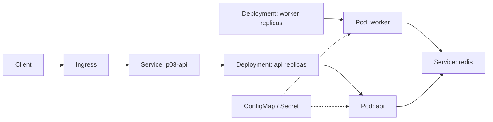

# M09 Kubernetes 与云原生适配教材

<!-- textbook-content: default=instructional -->

## 编写说明

这是一份长期进阶导论，不是 Kubernetes 大书。

M09 第一版只解决两个问题：

```text
1. P03 这种 Docker Compose 多服务项目，未来如何逐步迁移到 Kubernetes？
2. Kubernetes 调度概念如何和 M05 的 Task / Worker / Queue / Scheduler 对上？
```

当前你还不需要深入生产集群运维，也不需要读 Kubernetes Scheduler 源码。第一轮只建立概念地图、最小部署路线和调度类比。

本教材基于以下真实资料和当前学习库内容改写：

- [Kubernetes Pods](https://kubernetes.io/docs/concepts/workloads/pods/)
- [Kubernetes Deployments](https://kubernetes.io/docs/concepts/workloads/controllers/deployment/)
- [Kubernetes Services](https://kubernetes.io/docs/concepts/services-networking/service/)
- [ConfigMaps](https://kubernetes.io/docs/concepts/configuration/configmap/)
- [Secrets](https://kubernetes.io/docs/concepts/configuration/secret/)
- [Good practices for Kubernetes Secrets](https://kubernetes.io/docs/concepts/security/secrets-good-practices/)
- [Ingress](https://kubernetes.io/docs/concepts/services-networking/ingress/)
- [Kubernetes Gateway API](https://gateway-api.sigs.k8s.io/)
- [Jobs](https://kubernetes.io/docs/concepts/workloads/controllers/job/)
- [CronJob](https://kubernetes.io/docs/concepts/workloads/controllers/cron-jobs/)
- [Horizontal Pod Autoscaling](https://kubernetes.io/docs/tasks/run-application/horizontal-pod-autoscale/)
- [Kubernetes Scheduler](https://kubernetes.io/docs/concepts/scheduling-eviction/kube-scheduler/)
- [Kueue Documentation](https://kueue.sigs.k8s.io/docs/)
- [[10_学习模块/M05_任务队列与调度/M05_任务队列与调度_学习地图|M05 任务队列与调度学习地图]]
- [[10_学习模块/M07_Docker与容器化/M07_Docker与容器化_适配教材|M07 Docker 与容器化适配教材]]
- [[50_项目产出/P03_AI_Workload_Platform/P03_AI_Workload_Platform 项目主页|P03 AI Workload Platform]]

## 开始之前

| 项目 | 要求 |
|---|---|
| 目标读者 | 已能用 Docker Compose 观察多服务系统、希望建立 Kubernetes 对象和调度直觉的学习者 |
| 先修知识 | 完成 M07 的镜像/网络/卷/健康检查，并理解 M05 的 task/worker/queue；不要求生产集群运维经验 |
| 前置诊断 | 概念章先运行 `docker version` 和 `kubectl version --client --output=yaml`；动手章还需一个可删除的本地集群，并记录 `kubectl version` 的 client/server 输出 |
| 环境与版本 | YAML 使用 `apps/v1`、`batch/v1` 和 `networking.k8s.io/v1` 语义；兼容性以实际 client/server 版本为准。Ingress 需要 controller，HPA 需要指标链路，均不能由对象清单自动推得可用 |
| 学习产物 | 最小 manifests、对象状态快照、一次受控故障/恢复记录、清理命令和 Compose 到 Kubernetes 的差异表 |
| 完成口径 | `apply -> observe -> break -> diagnose -> fix -> verify -> delete` 有证据；第 9 章迁移路线不等于生产部署已完成 |
| 建议用时 | 作者侧初步估计 12-16 小时；先完成 Pod/Deployment/Service，再选择配置或 Job 支线，HPA/Kueue 暂不作为完成条件 |

## 内容类型说明

本表只说明各部分承担的教学角色，不等于宣称对应章节已经通过完整试学或外部认证。未单独
列出的小节继承其所在范围的类型。

| 范围 | 类型 | 阅读承诺 |
|---|---|---|
| 第 1-8 章的概念、示例、类比和检查 | `instructional` | 用于第一次建立 Kubernetes 对象、调度和扩缩容直觉 |
| 第 2.6-2.8 节和第 3.6-3.8 节 | `workbook` | 要求学习者亲手观察、故障注入、恢复和保存证据；reference 验证不等于本人完成 |
| 第 9 章及项目贯通案例中的 P03 迁移路线 | `design-note` | 说明未来迁移步骤；不代表生产部署、Kueue 或自动扩缩容已经实现 |
| 顶部官方资料列表和“外部资料怎么用” | `reference` | 用于查对象语义和命令边界，不替代观察实验 |
| 编写说明、第一轮边界、工程主线、学习顺序和暂不深入 | `appendix` | 用于导航、范围控制和状态说明，不计作核心概念章节 |

## 第一轮学习边界

| 内容 | 第一轮要掌握 | 暂时不深入 |
|---|---|---|
| Pod | 最小运行单元，里面跑一个或多个容器 | Pod 生命周期细节、sidecar 深水区 |
| Deployment | 管理长期运行服务的副本和滚动更新 | 复杂发布策略 |
| Service | 给 Pod 提供稳定访问入口 | CNI 网络细节 |
| ConfigMap | 保存非敏感配置 | 大规模配置治理 |
| Secret | 保存敏感配置的 Kubernetes 对象 | 生产级密钥管理系统 |
| Ingress | 暴露 HTTP 入口 | Ingress Controller 深度运维 |
| Job | 一次性任务 | 大规模 batch 平台 |
| CronJob | 定时任务 | 复杂工作流调度 |
| HPA | 根据指标扩缩容 Pod | 复杂自动扩缩容策略 |
| Scheduler | 把 Pod 放到 Node 上 | 不读源码，不改调度器 |

不做：

- 不读 Kubernetes Scheduler 源码。
- 不讲复杂 CRD/operator。
- 不深入服务网格。
- 不做生产集群安全加固大全。
- 不把 Kueue/Volcano 展开成完整平台建设。

## 本模块工程主线

```text
M07 Docker Compose
-> api / db / redis / worker 本地多服务
-> M09 Kubernetes 基础对象
-> api Deployment + Service
-> worker Deployment / Job
-> ConfigMap / Secret
-> Ingress / HPA
-> M05 调度概念映射
```

P03 在 M07 阶段是：

```text
docker compose up
-> api
-> db
-> redis
-> worker
```

未来迁移到 M09 时，不是一次性“上云原生”，而是逐步替换：

| Compose 里是什么 | Kubernetes 里大致对应什么 |
|---|---|
| service: api | Deployment + Service |
| service: worker | Deployment 或 Job |
| service: redis | Deployment/StatefulSet + Service |
| env_file | ConfigMap + Secret |
| ports | Service / Ingress |
| volumes | PersistentVolume / PersistentVolumeClaim |
| replicas 手动扩 | Deployment replicas / HPA |

第一轮先理解这些对应关系，不要求马上做生产部署。

## 可迁移的原则

1. Kubernetes 不是 Docker Compose 的炫技替代，而是把服务副本、网络入口、配置、弹性和任务运行交给集群控制面管理。
2. 学 M09 时要始终从 P03 出发：api、db、redis、worker 在 Compose 中怎么连，迁移到 K8s 后就分别问 Pod、Service、ConfigMap、Secret、Job 和 HPA 怎么承接。
3. M05 的调度直觉可以迁移到 K8s，但不能简单画等号。Pod/Node 类比 Task/Worker 有助于入门，真实 Kubernetes Scheduler 还涉及资源请求、亲和性、抢占、配额和控制循环，第一轮只理解概念边界。

## 踩坑现场

> 你把 P03 的 `api` 和 `worker` 都写成 Pod，发现服务重启后配置丢失、数据库连不上、外部访问失败。问题通常不是“还没学高级 K8s”，而是还没有分清运行单元、服务发现、配置注入和持久化。先画清 Compose 到 K8s 的映射表，再写 YAML。

## 第 1 章：Kubernetes 解决什么问题

### 1.1 为什么要学

Docker Compose 适合本地复现。它让 P03 的 api、db、redis、worker 能在一台机器上稳定启动。

但真实平台会遇到更多问题：

- 服务要跑在多台机器上。
- API 需要多个副本。
- worker 要根据负载扩缩容。
- 某个容器挂了要自动恢复。
- 配置和密钥不能写死在镜像里。
- 外部访问需要稳定入口。
- batch / AI workload 需要队列、资源配额和调度。

Kubernetes 的作用是管理这些容器化服务的部署、运行、扩缩容和调度。

### 1.2 从 P03 看 K8s

P03 的核心服务可以分成两类：

| 类型 | P03 示例 | K8s 视角 |
|---|---|---|
| 长期在线服务 | FastAPI API | Deployment + Service |
| 后台工作进程 | RAG worker / Agent worker | Deployment 或 Job |
| 中间件 | Redis / database | 第一轮本地可先保留，后续再学习 StatefulSet/托管服务 |
| 入口 | HTTP API | Ingress |
| 配置 | DATABASE_URL、REDIS_URL | ConfigMap / Secret |

### 1.3 和 M05 的关系

M05 学的是抽象调度：

```text
Task -> Queue -> Scheduler -> Worker -> Metrics
```

Kubernetes 也有调度，但对象不同：

```text
Pod -> Scheduler -> Node -> kubelet -> running container
```

类比时要小心：

| M05 | Kubernetes | 类比说明 |
|---|---|---|
| Task | Pod / Job | 被调度的工作单位 |
| Worker | Node | 执行资源 |
| Queue | Pending Pods / Kueue queue | 等待被接纳或调度的工作集合 |
| Scheduler | kube-scheduler | 选择 Pod 放到哪个 Node |
| Metrics | kube-state / Prometheus 指标 | 观察资源和状态 |

这个类比不是完全等价，但能帮助你把 M05 的调度直觉迁移到云原生。

### 1.4 常见错误

第一个错误：以为 Kubernetes 等于 Docker 的升级版。

Kubernetes 管的是集群中的容器化 workload，不只是本机启动工具。

第二个错误：一上来就学源码。

如果还不能解释 Pod、Deployment、Service，读 Scheduler 源码只会变成背术语。

第三个错误：把 M09 当成当前主战场。

当前 P03 先需要 M02/M03/M05/M06/M07/M08 的工程闭环。M09 是长期进阶。

### 1.5 小练习

把 P03 compose 中的服务写成 K8s 对象草图：

```text
api -> ?
worker -> ?
redis -> ?
DATABASE_URL -> ?
外部 HTTP 访问 -> ?
```

### 1.6 本章检查标准

- [ ] 能解释 Kubernetes 和 Docker Compose 的区别。
- [ ] 能说明 P03 哪些服务未来会迁移到 K8s。
- [ ] 能把 M05 的 Task/Worker/Queue/Scheduler 类比到 K8s。
- [ ] 能说明为什么 M09 第一轮只做导论。

## 第 2 章：Pod，Kubernetes 的最小运行单元

### 2.1 为什么要学

Pod 是 Kubernetes 中最小的可调度运行单元。你通常不是直接调度一个裸容器，而是让 Kubernetes 调度 Pod。

一个 Pod 里可以有一个或多个容器。第一轮先按“一个 Pod 跑一个主要容器”理解即可。

### 2.2 P03 中的 Pod

如果把 P03 API 放到 Kubernetes，最小形态是：

```text
api Pod
-> container: p03-api image
-> command: uvicorn app.main:app
```

worker 也可以是 Pod：

```text
worker Pod
-> container: p03-api image
-> command: python -m app.worker
```

这和 M07 中“API 和 worker 可以来自同一个镜像，但启动命令不同”是一致的。

### 2.3 最小 Pod 示例

```yaml
apiVersion: v1
kind: Pod
metadata:
  name: p03-api
spec:
  containers:
    - name: api
      image: p03-api:dev
      ports:
        - containerPort: 8000
```

这个示例只用于理解。实际项目里长期运行服务通常不用裸 Pod，而用 Deployment 管理。

### 2.4 和 M05 的类比

在 M05 中，Task 是等待执行的工作单位。

在 Kubernetes 中，Pod 是被 Scheduler 放到某个 Node 上运行的对象。

类比：

```text
M05 Task 等待 Worker
K8s Pod 等待 Node
```

差别是：M05 的 Task 可能代表一次 RAG 请求；K8s 的 Pod 通常代表一个运行环境或服务副本，不一定等于一次业务请求。

### 2.5 常见错误

第一个错误：把 Pod 等同于容器。

Pod 可以包含多个容器，并且有共享网络命名空间等概念。第一轮不用深挖，但不能简单说 Pod 就是容器。

第二个错误：长期服务直接写裸 Pod。

裸 Pod 不方便管理副本和滚动更新，长期服务优先用 Deployment。

### 2.6 观察实验：Pod 不是 YAML 里的名词

本节使用 [[40_实验练习/E09_K8s实验/E09-01 kind 本地集群|E09-01]] 的一次性 kind 集群。
Reference 已验证集群创建和清理，但下面命令只有学习者本人执行并保存证据后才算复现。

先防止误操作其他集群：

```powershell
$expectedContext = "kind-p03-lab"
$currentContext = kubectl config current-context
if ($currentContext -ne $expectedContext) {
    throw "Refusing to run: current context is '$currentContext', expected '$expectedContext'."
}
```

只有输出严格等于 `kind-p03-lab` 才继续。创建一个可观察 Pod：

```powershell
kubectl --context=kind-p03-lab run pod-observe --image=nginx:1.27-alpine --restart=Never
kubectl --context=kind-p03-lab wait --for=condition=Ready pod/pod-observe --timeout=120s
kubectl --context=kind-p03-lab get pod pod-observe -o wide
kubectl --context=kind-p03-lab get pod pod-observe `
  -o custom-columns=UID:.metadata.uid,NODE:.spec.nodeName,PHASE:.status.phase
kubectl --context=kind-p03-lab describe pod pod-observe
```

记录 Pod UID、Node、phase、container image 和事件。然后制造一个可安全清理的镜像错误：

```powershell
kubectl --context=kind-p03-lab run pod-bad-image --image=nginx:this-tag-does-not-exist --restart=Never
Start-Sleep -Seconds 10
kubectl --context=kind-p03-lab get pod pod-bad-image
kubectl --context=kind-p03-lab describe pod pod-bad-image
kubectl --context=kind-p03-lab get events --sort-by=.metadata.creationTimestamp
```

预期不是 Pod Ready，而是状态或事件出现镜像拉取失败，例如 `ErrImagePull` 或
`ImagePullBackOff`。学习目标是用 `describe/events` 找到失败证据，不是背状态名。

清理并验证对象消失：

```powershell
kubectl --context=kind-p03-lab delete pod pod-observe pod-bad-image --ignore-not-found
kubectl --context=kind-p03-lab get pod pod-observe pod-bad-image --ignore-not-found
```

诊断记录至少回答：声明的 image 在 spec 哪里、实际失败在 status/events 哪里、Pod 为何仍是
Kubernetes 对象但容器没有成功运行。不要把故障 Pod 留在共享或生产 context。

### 2.7 独立变式

写出 P03 里哪些东西可以变成 Pod：

- api
- worker
- redis

再说明它们是不是都应该第一轮自己部署到 K8s。

在图解之外，再选择 API 或 worker 中一个对象，写出 image、command、port、环境变量、
readiness 和资源请求分别属于 Pod spec 的哪里。不得直接复制完整 reference manifest。

### 2.8 本章检查标准

- [ ] 能解释 Pod 是最小调度单元。
- [ ] 能说明 Pod 和容器的区别。
- [ ] 能把 P03 API/worker 映射成 Pod。
- [ ] 能说明为什么长期服务一般用 Deployment。
- [ ] 能从 spec、status 和 events 三处解释一次真实 Pod 运行或失败。
- [ ] 能安全制造并清理 ImagePullBackOff 类故障。

### 2.9 本章依据

- [Kubernetes Pods](https://kubernetes.io/docs/concepts/workloads/pods/)
  用于核对 Pod、容器和调度单元的对象边界。
- [Debug Pods](https://kubernetes.io/docs/tasks/debug/debug-application/debug-pods/)
  用于核对 `get`、`describe`、status 和 events 的诊断路径；本章故障只允许在一次性学习集群执行。

## 第 3 章：Deployment，管理长期运行服务

### 3.1 为什么要学

Deployment 用来管理长期运行服务的副本、更新和恢复。

P03 的 FastAPI API 就适合用 Deployment：

```text
我希望 API 一直运行
如果挂了自动拉起
需要多个副本承接请求
镜像更新时能滚动更新
```

### 3.2 最小 Deployment

```yaml
apiVersion: apps/v1
kind: Deployment
metadata:
  name: p03-api
spec:
  replicas: 2
  selector:
    matchLabels:
      app: p03-api
  template:
    metadata:
      labels:
        app: p03-api
    spec:
      containers:
        - name: api
          image: p03-api:dev
          ports:
            - containerPort: 8000
```

这表示 Kubernetes 尝试维持 2 个 API Pod 副本。

### 3.3 worker 也能用 Deployment 吗

可以。

如果 P03 worker 是长期从 Redis 队列消费任务的进程，可以用 Deployment：

```text
replicas: 3
command: python -m app.worker
```

这相当于启动 3 个 worker 进程去消费队列。

### 3.4 和 M05 的关系

M05 中增加 worker 数量会影响：

- P95 等待时间。
- worker utilization。
- 吞吐。
- 资源成本。

Kubernetes 中增加 worker Deployment 的 replicas，也会影响这些指标。

```text
replicas 从 1 到 4
-> worker 可用资源变多
-> queue_wait 可能下降
-> utilization 可能下降
-> 成本可能上升
```

### 3.5 常见错误

第一个错误：以为 replicas 越多越好。

副本多会降低排队，但也可能导致资源空闲和成本上升。M05 的 worker 数量实验已经训练过这个取舍。

第二个错误：API 和 worker 使用完全不同镜像。

第一轮可以共用镜像，通过 command 区分入口。

### 3.6 观察实验：删掉 Pod 后，谁把它补回来

裸 Pod 和 Deployment 的差别需要观察，而不是只读定义。在 `kind-p03-lab` 中创建两个副本：

```powershell
$expectedContext = "kind-p03-lab"
$currentContext = kubectl config current-context
if ($currentContext -ne $expectedContext) {
    throw "Refusing to run: current context is '$currentContext', expected '$expectedContext'."
}
kubectl --context=kind-p03-lab create deployment deploy-observe --image=nginx:1.27-alpine --replicas=2
kubectl --context=kind-p03-lab rollout status deployment/deploy-observe --timeout=120s
kubectl --context=kind-p03-lab get deployment,replicaset,pod -l app=deploy-observe -o wide
```

保存两个 Pod 的 name 和 UID。删除其中一个：

```powershell
$pod = kubectl --context=kind-p03-lab get pod -l app=deploy-observe -o jsonpath='{.items[0].metadata.name}'
kubectl --context=kind-p03-lab delete pod $pod
kubectl --context=kind-p03-lab wait --for=condition=Available deployment/deploy-observe --timeout=120s
kubectl --context=kind-p03-lab get pod -l app=deploy-observe `
  -o custom-columns=NAME:.metadata.name,UID:.metadata.uid,PHASE:.status.phase
```

Deployment 期望副本仍是 2；新 Pod UID 与被删除 Pod 不同。这里观察到的不是“Pod 自己复活”，
而是控制器发现实际副本少于期望副本后创建替代 Pod。

再制造一次可回滚的 rollout 失败：

```powershell
kubectl --context=kind-p03-lab set image deployment/deploy-observe nginx=nginx:this-tag-does-not-exist
kubectl --context=kind-p03-lab rollout status deployment/deploy-observe --timeout=30s
kubectl --context=kind-p03-lab get pod -l app=deploy-observe
kubectl --context=kind-p03-lab describe deployment deploy-observe
kubectl --context=kind-p03-lab rollout undo deployment/deploy-observe
kubectl --context=kind-p03-lab rollout status deployment/deploy-observe --timeout=120s
```

失败的 `rollout status` 应返回非零，不能被记录为“实验脚本失败”；它是本节预期故障。回滚后
必须重新 Ready。最后清理：

```powershell
kubectl --context=kind-p03-lab delete deployment deploy-observe --ignore-not-found
kubectl --context=kind-p03-lab get deployment,replicaset,pod -l app=deploy-observe
```

### 3.7 独立变式

把 P03 compose 的 `api` 和 `worker` 分别改写成 Deployment 草图：

- api replicas = 2
- worker replicas = 3

说明 worker 副本数会影响哪些 M08 指标。

再回答：删除 API Pod、扩容 worker Deployment、更新镜像分别改变“实际状态、期望状态、
业务容量”中的哪一项。把答案和本节实际 `kubectl` 输出放在一起，不只画对象关系图。

### 3.8 本章检查标准

- [ ] 能解释 Deployment 的作用。
- [ ] 能写出最小 Deployment。
- [ ] 能说明 P03 API 和 worker 如何使用 Deployment。
- [ ] 能把 replicas 和 M05 worker 数量联系起来。
- [ ] 能用 Pod UID 证明控制器创建的是替代对象，不是原 Pod 复活。
- [ ] 能观察失败 rollout、读取证据、执行 undo 并验证恢复。

### 3.9 本章依据

- [Kubernetes Deployments](https://kubernetes.io/docs/concepts/workloads/controllers/deployment/)
  用于核对期望副本、替代 Pod、rollout 状态和 rollback 语义。

## 第 4 章：Service 和 Ingress，给服务稳定入口

### 4.1 为什么要学

Pod 会创建、销毁、重建，它的 IP 不稳定。Service 负责给一组 Pod 提供稳定访问入口。

P03 中，worker 要访问 Redis，外部用户要访问 API，都需要稳定地址。

### 4.2 Service

最小 API Service：

```yaml
apiVersion: v1
kind: Service
metadata:
  name: p03-api
spec:
  selector:
    app: p03-api
  ports:
    - port: 80
      targetPort: 8000
```

Service 会根据 selector 找到带有 `app: p03-api` 标签的 Pod。

### 4.3 Ingress

Ingress 可以把外部 HTTP 请求路由到 Service。

例如：

```text
https://p03.example.com
-> Ingress
-> Service p03-api
-> API Pod
```

第一轮只理解 Ingress 是 HTTP 入口，不深入 Ingress Controller 运维。

但创建 `Ingress` 对象本身不会产生可用入口。集群必须已经安装与该资源匹配的 Ingress
controller，并配置 IngressClass、DNS 和 TLS；没有 controller 时，YAML 即使被 API server
接受也不会转发流量。当前 Kubernetes Ingress API 已冻结，只维护兼容性；新能力逐步进入
Gateway API。第一轮仍可用 Ingress 学习既有系统，但新架构应把 Gateway API 作为后续比较项，
不能把二者写成同一个对象。

最小前置检查：

```text
kubectl get ingressclass
kubectl get pods -A  # 确认选定 controller 实际运行
kubectl describe ingress p03-api
```

检查结果必须同时包含 controller、地址/事件和一次真实 HTTP 请求；只有资源 `Created` 不算成功。

### 4.4 和 Compose 的关系

Compose 中：

```yaml
ports:
  - "8000:8000"
```

Kubernetes 中通常变成：

```text
Deployment 暴露 containerPort
-> Service 提供集群内稳定访问
-> Ingress 提供外部 HTTP 入口
```

### 4.5 常见错误

第一个错误：以为 Deployment 自带稳定访问地址。

Deployment 管 Pod 副本，Service 负责稳定访问。

第二个错误：一开始就深挖 CNI。

第一轮只要能解释 Pod、Service、Ingress 的关系即可。

第三个错误：只提交 Ingress YAML，不检查 controller。

Ingress 是配置契约，不是内置反向代理。无 controller、IngressClass 不匹配、DNS/TLS 未配置时，
外部请求仍然不可达。

### 4.6 小练习

画出：

```text
Client -> Ingress -> Service -> API Pods
Worker Pods -> Redis Service -> Redis Pod
```

### 4.7 本章检查标准

- [ ] 能解释 Service 的作用。
- [ ] 能解释 Ingress 的作用。
- [ ] 能说明 Deployment、Service、Ingress 的关系。
- [ ] 能把 Compose ports 映射到 K8s 入口对象。
- [ ] 能说明 Ingress controller 是运行前置，并知道 Gateway API 是新能力的后续方向。

## 第 5 章：ConfigMap 和 Secret，配置不能写死在镜像里

### 5.1 为什么要学

M07 已经强调配置不要写死进 Dockerfile。Kubernetes 里也一样。

P03 至少会有：

```text
DATABASE_URL
REDIS_URL
APP_ENV
MODEL_API_KEY
```

非敏感配置可以放 ConfigMap，敏感配置放 Secret。

### 5.2 ConfigMap

```yaml
apiVersion: v1
kind: ConfigMap
metadata:
  name: p03-config
data:
  APP_ENV: "dev"
  REDIS_URL: "redis://redis:6379/0"
```

### 5.3 Secret

> **警告**：base64 只是编码，不是加密。不要把真实 token、数据库密码或 kubeconfig 写进本库
> 的 Secret manifest；下面只能使用明确的假值。

```yaml
apiVersion: v1
kind: Secret
metadata:
  name: p03-secret
type: Opaque
stringData:
  MODEL_API_KEY: "replace-me"
```

注意：第一轮只理解 Secret 是 Kubernetes 的敏感配置对象，不把它等同于完整密钥管理安全方案。
`data` 字段的值只是 base64 编码，`stringData` 由 API server 转换后仍作为 Secret 数据保存。
Secret 可能被有 API 权限的主体读取，也可能进入未启用静态加密的 etcd、备份、审计或终端历史。
生产边界至少包括最小 RBAC、etcd encryption at rest、短期凭据/轮换，以及外部密钥系统或
Secrets Store CSI 等方案；本章示例不声称已经实现这些能力。

### 5.4 在 Deployment 中使用

```yaml
envFrom:
  - configMapRef:
      name: p03-config
  - secretRef:
      name: p03-secret
```

### 5.5 常见错误

第一个错误：把 API key 写进镜像。

镜像应该可以复用，配置应该在运行时注入。

第二个错误：以为 Secret 就绝对安全。

Kubernetes Secret 是配置对象，不等于完整的企业密钥管理体系。

第三个错误：把 base64 字符串当密文提交到 Git。

任何能读取仓库的人都能还原它。仓库只保留 `secret.example.yaml` 或占位符，真实值从受控
部署环境注入，并验证提交历史中没有旧密钥。

### 5.6 小练习

把 M07 的 `.env.example` 分成：

- ConfigMap：APP_ENV、REDIS_URL。
- Secret：MODEL_API_KEY、数据库密码。

### 5.7 本章检查标准

- [ ] 能解释 ConfigMap 和 Secret 的区别。
- [ ] 能说明为什么配置不能写死进镜像。
- [ ] 能把 P03 的环境变量迁移到 K8s 对象。
- [ ] 能说明 Secret 第一轮的边界。
- [ ] 能解释 base64 不是加密，并列出 RBAC、静态加密和轮换三项最低生产边界。

## 第 6 章：Job 和 CronJob，运行一次性或定时任务

### 6.1 为什么要学

不是所有 workload 都是长期服务。

P03 里可能有：

- 批量文档解析。
- 离线 embedding。
- 每晚生成报表。
- 清理过期任务。

这些更像 Job 或 CronJob。

### 6.2 Job

Job 用于运行一次性任务，直到成功完成。

“直到成功”不等于“业务逻辑只执行一次”。Pod 重启、节点故障、控制器重建或完成状态尚未
回写时，Job 可能启动新的 Pod，同一业务动作可能执行多次。导入、扣费、发报告或写外部系统
必须使用业务幂等键、唯一约束或 compare-and-set；不能只依赖 Job 名称防重。

最小运行边界还要显式设置和记录：

```yaml
spec:
  backoffLimit: 3
  template:
    spec:
      restartPolicy: Never
```

`backoffLimit` 控制失败重试上限，不保证没有重复副作用。失败 Job 的 Pod 日志、退出码、事件和
业务幂等记录都要保留，超过上限后进入可观察的失败路径。

例子：

```text
导入一批文档
-> 创建 Job
-> Pod 运行导入脚本
-> 完成后退出
```

### 6.3 CronJob

CronJob 用于定时创建 Job。

定时触发也不是精确一次语义：controller 暂停或拥塞可能导致 missed schedule，相邻 Job 可能
重叠。必须根据业务选择 `concurrencyPolicy: Forbid` 或 `Replace`，设置合理的
`startingDeadlineSeconds`，固定时区/调度解释，并让 Job 本身保持幂等。即使使用 `Forbid`，
也不能替代业务侧防重。

例子：

```text
每天凌晨清理 failed/retried 过久的任务
每小时生成队列统计摘要
```

### 6.4 和 M05 的关系

M05 的 Task 是抽象任务。Kubernetes Job 更接近 batch workload。

如果未来 P03 有大量离线任务，就会碰到：

- 任务排队。
- 资源配额。
- 优先级。
- retry。
- 并发限制。

这些概念和 M05 调度实验有直接关系。

### 6.5 常见错误

第一个错误：所有东西都用 Deployment。

长期服务用 Deployment，一次性任务用 Job，定时任务用 CronJob。

第二个错误：把业务队列和 K8s Job 混为一谈。

Redis/RQ 队列处理业务任务；K8s Job 管 Pod 级别的批处理运行。两者可以配合，但不是同一个层次。

第三个错误：把 Job/CronJob 当作 exactly-once 执行器。

控制器保证的是期望状态收敛，不是外部副作用只发生一次。重试、重叠和状态回写失败都要求
业务幂等与可核对的执行记录。

### 6.6 小练习

判断下面任务用 Deployment、Job 还是 CronJob：

- FastAPI API。
- RAG worker。
- 一次性导入 1000 篇文档。
- 每晚清理过期任务。

### 6.7 本章检查标准

- [ ] 能解释 Job 和 CronJob。
- [ ] 能区分长期服务和一次性任务。
- [ ] 能说明 K8s Job 和业务队列不是同一层。
- [ ] 能把 P03 的离线任务映射到 Job/CronJob。
- [ ] 能解释 Job 可能重复执行，并为外部副作用设计幂等键和失败上限。
- [ ] 能说明 CronJob 的并发策略、missed schedule 和时区是运行前置。

## 第 7 章：HPA，worker 为什么可以扩缩容

### 7.1 为什么要学

HPA 是 Horizontal Pod Autoscaler，用于根据指标调整 Pod 副本数。

P03 中最直观的是 worker 扩缩容：

```text
queue_length 高
-> worker 副本增加
-> queue_wait 下降
-> 资源成本上升
```

第一轮只理解概念，不要求马上做复杂指标驱动扩缩容。

当前 kind reference 没有安装 metrics-server 或自定义指标 adapter，因此这一章的 HPA 仍是
设计说明，不是已经验证的自动扩缩容实验。

### 7.2 HPA 看什么

常见 HPA 可以基于 CPU、内存或自定义指标。

CPU/内存 utilization 依赖 Pod 的 resource requests；没有 requests 时，HPA 无法按该 Pod 的
利用率正确计算目标。资源指标通常还需要 metrics-server，自定义/外部的 queue length、
queue wait 则需要对应 metrics adapter 或事件驱动控制器。把指标写进 Prometheus 或教材表格，
不会自动让 HPA 读取它。

对 AI workload 来说，CPU 不一定足够。更有意义的指标可能是：

- queue_length。
- p95_queue_wait。
- worker utilization。
- requests_per_second。

这就连接到 M08。

### 7.3 和 M05 的关系

M05 的 worker 数量实验说明：

```text
worker 增加
-> P95 等待可能下降
-> utilization 可能下降
-> 成本上升
```

HPA 本质上是在真实系统里自动调整 worker 数量。

### 7.4 常见错误

第一个错误：以为 HPA 会自动解决所有性能问题。

如果瓶颈在数据库、外部模型限流、代码锁等待，增加 Pod 可能没有用。

第二个错误：只看 CPU。

RAG/Agent workload 的队列长度和等待时间更重要。

第三个错误：有指标名就认为 HPA 能消费。

必须写清 metrics API、adapter、target 类型、采样窗口、最小/最大副本和 scale-up/scale-down
稳定策略。否则扩缩容可能振荡，或在短峰值过去后仍持续积压。

### 7.5 小练习

为 P03 worker 设计一个扩缩容观察方案：

```text
指标：queue_length、p95_queue_wait、worker_utilization
动作：worker replicas 从 1 到 2 到 4
观察：P95、吞吐、错误率、利用率
```

### 7.6 本章检查标准

- [ ] 能解释 HPA 的作用。
- [ ] 能说明 worker 扩缩容和 M05 实验的关系。
- [ ] 能说出为什么 AI workload 不一定只看 CPU。
- [ ] 能把 HPA 和 M08 指标连接起来。
- [ ] 能列出 resource requests、metrics-server/adapter 和 stabilization 三类前置。
- [ ] 能区分当前手工 replicas reference 与尚未实现的 HPA 实验。

## 第 8 章：Scheduler，Pod 如何被放到 Node 上

### 8.1 为什么要学

Kubernetes Scheduler 的基础任务是：为新创建且尚未分配 Node 的 Pod 选择合适的 Node。

第一轮只理解它在系统中的位置：

```text
Pod created
-> pending
-> scheduler chooses Node
-> kubelet starts container
-> running
```

### 8.2 和 M05 的类比

M05：

```text
Task -> Queue -> Scheduler -> Worker
```

Kubernetes：

```text
Pod -> Pending -> kube-scheduler -> Node
```

类比表：

| M05 概念 | K8s 概念 | 注意 |
|---|---|---|
| Task | Pod / Job | K8s 调度的是 Pod，不是单个业务请求 |
| Worker | Node | Node 是运行 Pod 的机器资源 |
| Queue | Pending Pods / Kueue queue | 原生 K8s 和 batch queue 不是一回事 |
| Scheduler | kube-scheduler | 选择合适 Node |
| Priority | PriorityClass / Kueue queue priority | 第一轮只理解概念 |
| Quota | ResourceQuota / Kueue quota | 控制资源使用 |
| Admission | Kueue admission | batch workload 先被接纳再运行 |

### 8.3 queue / admission / quota

普通 Kubernetes 调度会处理 Pending Pod，但 AI/ML batch workload 往往还需要更明确的队列和资源配额。

Kueue 这类项目关注：

- workload 是否进入队列。
- 资源是否足够。
- 是否被 admitted。
- quota 如何分配。
- 多队列之间如何共享资源。

这和 M05 的调度实验关系是：

```text
M05 训练你理解任务、队列、优先级、资源有限和指标
Kueue/Volcano 把这些问题放到 Kubernetes batch workload 场景
```

第一轮只做概念映射，不安装复杂组件。

### 8.4 常见错误

第一个错误：把业务调度和 K8s 调度混成一个东西。

当前 P03 v0.3.1 先是 `Task(task_type=rag_retrieval) -> PostgreSQL/outbox -> Redis Streams -> worker`；
post-v0.3.1 / vNext 才规划 `AgentTask -> strategy scheduler -> worker`。K8s Scheduler 决定 Pod 放到哪个 Node。

第二个错误：一开始就读源码。

先能画出 Pod -> Scheduler -> Node，再考虑源码。

第三个错误：把 Kueue/Volcano 当成现在必须实现的项目。

当前只做长期进阶导论。

### 8.5 小练习

画两张图：

```text
P03 current v0.3.1：Task(task_type=rag_retrieval) -> PostgreSQL/outbox -> Redis Streams -> worker
P03 planned post-v0.3.1：AgentTask -> strategy scheduler -> worker
K8s 资源调度：Pod -> kube-scheduler -> Node
```

然后写出二者的区别。

### 8.6 本章检查标准

- [ ] 能解释 kube-scheduler 的基础作用。
- [ ] 能把 M05 概念映射到 K8s 概念。
- [ ] 能区分业务任务调度和 Pod 资源调度。
- [ ] 能说明 queue/admission/quota 和调度实验的关系。

## 第 9 章：P03 最小迁移路线

<!-- textbook-content: type=design-note -->

### 9.1 为什么要学

M09 不要求你现在把 P03 完整搬上 Kubernetes，但要知道未来怎么走。

迁移要分阶段，不要一步到位。

### 9.2 阶段路线

阶段 0：M07 本地 compose 稳定。

```text
docker compose up
api/db/redis/worker 正常
```

阶段 1：本地 kind/minikube 集群。

```text
创建本地 K8s
能 kubectl get nodes
```

阶段 2：部署 API。

```text
api Deployment
api Service
kubectl port-forward 测试 /health
```

阶段 3：配置迁移。

```text
ConfigMap / Secret
DATABASE_URL / REDIS_URL
```

阶段 4：部署 worker。

```text
worker Deployment
replicas: 1 -> 2 -> 4
观察 queue_wait / utilization
```

阶段 5：入口和扩缩容。

```text
Ingress
HPA 概念实验
```

阶段 6：batch/AI workload 调度概念。

```text
Job / CronJob
Kueue / Volcano 概念映射
```

### 9.3 最小部署目录

未来可以在 P03 中准备：

```text
k8s/
├─ api-deployment.yaml
├─ api-service.yaml
├─ worker-deployment.yaml
├─ configmap.yaml
├─ secret.example.yaml
├─ ingress.yaml
└─ job-demo.yaml
```

第一轮只需要知道这些文件各自负责什么，不急着完善生产配置。

### 9.4 常见错误

第一个错误：数据库也立刻自己上 K8s。

数据库有持久化、备份、恢复问题。第一轮可以先用外部数据库或保留本地方案，等基础清楚后再学 StatefulSet/PVC。

第二个错误：把所有 YAML 一次写完。

先 API，再 worker，再配置，再入口，再扩缩容。

第三个错误：没有回到指标。

部署不是终点。P03 仍然要看 queue_wait、P95/P99、worker utilization 和错误率。

### 9.5 小练习

为 P03 写一份迁移计划：

```text
第一步只部署 api。
第二步接 ConfigMap/Secret。
第三步部署 worker。
第四步观察 worker replicas 对 queue_wait 的影响。
```

### 9.6 本章检查标准

- [ ] 能说明 P03 从 Compose 到 K8s 的分阶段路线。
- [ ] 能列出最小 k8s 文件结构。
- [ ] 能说明为什么数据库不急着上 K8s。
- [ ] 能把部署结果接回 M08 指标。

## 项目贯通案例：P03 从 Compose 到 Kubernetes

### 目标

理解 P03 未来迁移路径：

```text
compose api/db/redis/worker
-> api Deployment + Service
-> worker Deployment
-> ConfigMap / Secret
-> Ingress
-> HPA
-> Job / CronJob
```

### 最小对象关系



### 和 M05 的最终连接

P03 业务层（区分 current 与 planned）：

```text
current v0.3.1：Task(task_type=rag_retrieval) -> PostgreSQL/outbox -> Redis Streams -> worker
planned post-v0.3.1：AgentTask -> strategy scheduler -> worker
```

Kubernetes 资源层：

```text
Worker Pod -> kube-scheduler -> Node
```

两层不是一回事，但互相影响：

- P03 worker 副本数影响业务 queue_wait。
- K8s Node 资源影响 Pod 能否启动。
- HPA 改变 worker 副本数。
- Kueue/Volcano 等进阶系统处理 batch workload queue/admission/quota。

## 第一轮学习顺序

1. 先读 M07，确认 P03 compose 的 api/db/redis/worker 已经能本地启动。
2. 读本教材第 1-3 章，理解 Kubernetes、Pod、Deployment。
3. 读第 4-5 章，理解 Service/Ingress 和 ConfigMap/Secret。
4. 读第 6-7 章，理解 Job/CronJob 和 HPA。
5. 读第 8 章，把 M05 调度模型映射到 Kubernetes。
6. 读第 9 章，写 P03 最小迁移路线。
7. 复核现有 E09-01/02/03 `verified reference`，再由学习者亲手复现；E09-04 Kueue、
   自动扩缩容和生产运维仍是未验证进阶项。

## 外部资料怎么用

| 资料 | 第一轮怎么用 |
|---|---|
| Kubernetes Basics | 建立 Pod、Deployment、Service 入门概念 |
| Kubernetes Pods | 查 Pod 定义和基本用法 |
| Kubernetes Deployments | 查 Deployment 的副本和更新概念 |
| Kubernetes Services | 查 Service 如何稳定访问 Pod |
| ConfigMaps / Secrets | 查配置和密钥对象 |
| Ingress | 只理解 HTTP 入口 |
| Job / CronJob | 理解一次性和定时任务 |
| HPA | 理解扩缩容概念 |
| Kubernetes Scheduler | 只读概念页，不读源码 |
| Kueue | 只理解 queue、admission、quota 概念 |

## 暂时不要深入

- 不读 Kubernetes Scheduler 源码。
- 不实现自定义 Scheduler。
- 不讲复杂 CRD/operator。
- 不深入服务网格。
- 不做生产集群运维。
- 不做复杂安全加固。
- 不一开始部署数据库 StatefulSet。
- 不展开 Kueue/Volcano 的完整安装和生产用法。

## 本模块最终检查

- [ ] 能解释 Pod、Deployment、Service、ConfigMap、Secret、Ingress、Job、CronJob、HPA、Scheduler 的基本作用。
- [ ] 能说明 Docker Compose 到 Kubernetes 的迁移路线。
- [ ] 能把 P03 的 api/worker/config/入口映射到 K8s 对象。
- [ ] 能把 M05 的 Task/Worker/Queue/Scheduler 类比到 Pod/Node/queue/Scheduler。
- [ ] 能区分 P03 业务调度和 Kubernetes 资源调度。
- [ ] 能说明 queue/admission/quota 与调度实验的关系。
- [ ] 能说清本模块为什么是长期进阶导论。
