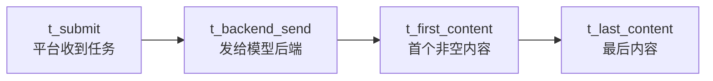

# M10 推理 workload 与指标导论（vLLM / Triton 定位）

<!-- textbook-content: default=instructional -->

## 编写说明

这是一份长期进阶导论，不是 vLLM/Triton 工程实战或底层推理优化教材。目录路径保留
`M10_AI推理系统_vLLM_Triton` 只为兼容现有链接；当前可验证内容是合成推理 workload、
TTFT/TPOT 口径和 KV cache 估算，不是实际 GPU serving 能力。

M10 第一版只解决一个问题：

```text
为什么 LLM 推理服务会成为 AI workload 平台的核心压力来源？
```

在 P03 中，RAG/Agent 请求最终都会触发生成或推理。推理服务的耗时、并发、token 数、队列和限流会直接影响：

- P95/P99。
- 吞吐。
- worker utilization。
- token 成本。
- 队列长度。
- 用户体验。

本教材基于以下真实资料和当前学习库内容改写：

- [vLLM Documentation](https://docs.vllm.ai/)
- [vLLM PagedAttention](https://docs.vllm.ai/en/latest/design/paged_attention/)
- [PagedAttention paper](https://arxiv.org/abs/2309.06180)
- [vLLM Metrics](https://docs.vllm.ai/en/stable/design/metrics/)
- [vLLM Bench Serve](https://docs.vllm.ai/en/latest/cli/bench/serve/)
- [AIPerf](https://github.com/ai-dynamo/aiperf)
- [Hugging Face KV cache explanation](https://huggingface.co/docs/transformers/main/en/cache_explanation)
- [Orca OSDI 2022](https://www.usenix.org/conference/osdi22/presentation/yu)
- [DistServe OSDI 2024](https://www.usenix.org/conference/osdi24/presentation/zhong-yinmin)
- [Prometheus metric naming](https://prometheus.io/docs/practices/naming/)
- [Prometheus histograms and summaries](https://prometheus.io/docs/practices/histograms/)
- [Ray Serve LLM](https://docs.ray.io/en/latest/serve/llm/index.html)
- [NVIDIA Triton Inference Server Documentation](https://docs.nvidia.com/deeplearning/triton-inference-server/user-guide/docs/index.html)
- [KServe Documentation](https://kserve.github.io/website/)
- [[10_学习模块/M05_任务队列与调度/M05_任务队列与调度_学习地图|M05 任务队列与调度学习地图]]
- [[10_学习模块/M08_监控压测与可观测性/M08_监控压测与可观测性_适配教材|M08 监控压测与可观测性适配教材]]
- [[50_项目产出/P03_AI_Workload_Platform/P03_AI_Workload_Platform 项目主页|P03 AI Workload Platform]]

## 开始之前

| 项目 | 要求 |
|---|---|
| 目标读者 | 已理解队列与延迟指标、需要建立 LLM serving workload 模型但暂不进入 CUDA 内核的学习者 |
| 先修知识 | 完成 M05 的排队/调度和 M08 的直方图/P95/P99；能区分请求数、token 数、吞吐和延迟 |
| 前置诊断 | 运行 `py -3.13 --version`，并确认 `40_实验练习/E10_推理服务实验/e10_inference_reference/requirements-dev.lock` 存在；第一轮先走 E10-01/02 合成 reference |
| 环境与版本 | E10-01/02 以 Python 3.13 和锁文件为基线，只验证确定性模拟。真实 vLLM 需要 Linux/WSL、兼容 GPU/驱动及固定模型 revision；当前 E10-03 为 `blocked/unverified` |
| 学习产物 | 请求长度/延迟 trace、TTFT/TPOT/tokens/s 指标表、容量边界说明，以及真实服务实验的环境清单 |
| 完成口径 | 能解释 canonical `prompt_tokens`、排队与服务时间，并复算 E10-01/02；不得从合成单 worker 外推真实 GPU 或 continuous batching 容量 |
| 建议用时 | 作者侧初步估计 8-12 小时，不含真实 GPU 环境准备；第 8 章 E10-03 不作为当前完成条件 |

第一轮不深入：

- CUDA。
- Triton kernel。
- 显存管理源码。
- vLLM 内核源码。
- 分布式推理集群调优。
- GPU 算子优化。

## 第一轮学习边界

| 内容 | 第一轮要掌握 | 暂时不深入 |
|---|---|---|
| TTFT | 首 token 等待时间，影响首屏体验 | 内核级 profiling |
| TPOT | 每个输出 token 的平均生成时间 | 解码 kernel 优化 |
| tokens/s | 单位时间生成 token 数，衡量吞吐 | 多 GPU 极限优化 |
| batching | 多请求合批提高吞吐 | 调度器内部实现细节 |
| KV cache | 缓存注意力中间状态，影响显存和并发 | PagedAttention 源码 |
| 并发 | 多用户同时请求，导致排队和资源竞争 | 真实大规模流量治理 |
| 队列 | 推理请求等待执行 | 复杂多级队列 |
| 限流 | 保护服务不被压垮 | 企业级网关体系 |
| 吞吐 | requests/s、tokens/s | 分布式推理集群优化 |
| 尾延迟 | P95/P99 推理体验 | 内核级延迟分析 |

判断是否越界：

```text
如果这个内容不能帮助解释 P03 的推理 workload、M05 队列调度或 M08 监控指标，就先不深入。
```

## 本模块工程主线

```text
M03 RAG / M04 Agent
-> generation / inference 请求
-> M10 推理 workload
-> M05 队列和调度
-> M08 TTFT / TPOT / tokens/s / P95/P99 监控
-> P03 Simulated Inference Worker
-> 后续 vLLM / Triton / Ray Serve
```

P03 第一轮可以先用模拟推理 worker：

```text
prompt_tokens 越多 -> prefill 越慢
output_tokens 越多 -> decode 越久
并发越高 -> queue_wait 越高
worker 越少 -> P95/P99 越高
限流不足 -> error_rate 上升
```

本库任务与 E10 reference 的 canonical 字段统一为 `prompt_tokens`。外部 API 或监控系统可能
把同一概念命名为 input tokens；接入边界可以显式映射，但教材、任务 schema 和实验 CSV 内
不能交替使用两个字段名。

## 可迁移的原则

1. 推理服务的压力不是单一“慢”，而是 TTFT、TPOT、tokens/s、queue_wait、batch size、KV cache 和尾延迟共同作用。
2. M10 第一轮只需要把推理请求抽象成 workload。你要能解释输入 token、输出 token、并发、队列和限流如何影响 M05 调度与 M08 指标，不需要读 vLLM 内核或 CUDA kernel。
3. 优化必须有指标边界。提高吞吐可能牺牲 P99，增大 batch 可能增加单请求等待，降低延迟可能降低 GPU 利用率；不能只用一个数字判断系统好坏。

## 踩坑现场

> 你看到 tokens/s 提高了，就以为推理服务变好了。但用户可能感受到 TTFT 变长，P99 也变差。正确做法是同时记录 TTFT、TPOT、throughput、queue_wait、error_rate 和并发设置，再判断调度策略有没有改善真实体验。

## 第 1 章：为什么推理服务是核心压力来源

### 1.1 为什么要学

普通 API 请求可能只做数据库查询和 JSON 返回。

LLM 推理请求不同，它会消耗大量计算资源，并且耗时与 token 数强相关。

一次 RAG 请求通常包括：

```text
用户问题
-> 检索上下文
-> 拼 prompt
-> 调用推理服务生成答案
-> 返回 answer / sources / metrics
```

其中“生成答案”可能成为最慢、最贵、最不稳定的部分。

### 1.2 推理请求为什么难调度

推理请求有几个特点：

| 特点 | 对系统的影响 |
|---|---|
| 输入长度不同 | prefill 时间不同 |
| 输出长度不同 | decode 时间不同 |
| 并发突增 | 队列等待上升 |
| GPU/CPU 资源有限 | worker utilization 接近 1 |
| token 成本明显 | Cost-aware 调度有意义 |
| 流式返回 | TTFT 和总耗时都要看 |

### 1.3 和 P03 的关系

P03 里有三类 worker：

```text
RAG Worker
Agent Worker
Simulated Inference Worker
```

M10 负责解释第三类 worker 为什么重要：它代表真实模型服务压力。

### 1.4 和 M05 的关系

M05 学的是：

```text
Task -> Queue -> Scheduler -> Worker -> Metrics
```

推理请求可以变成一种 Task：

```text
InferenceTask(
  prompt_tokens,
  max_output_tokens,
  priority,
  estimated_cost,
  timeout
)
```

调度会影响谁先进入推理 worker，从而影响 P95/P99。

### 1.5 常见错误

第一个错误：只看总响应时间。

推理服务要拆成排队、首 token、每 token 生成和总耗时。

第二个错误：把推理服务当普通 API。

普通 API 扩副本可能比较直接；推理服务还要看显存、batching、KV cache、token 长度。

第三个错误：一开始就研究 CUDA。

当前先理解系统指标和 workload 压力，底层优化以后再学。

### 1.6 小练习

把下面请求改写成推理 workload：

```text
用户提交一个 3000 token prompt，希望生成 800 token 报告。
```

写出：

- prompt_tokens。
- max_output_tokens。
- priority。
- estimated_cost。
- timeout。
- 需要监控的指标。

### 1.7 本章检查标准

- [ ] 能说明推理服务为什么比普通 API 更重。
- [ ] 能把推理请求建模成 Task。
- [ ] 能说明推理请求如何影响 M05 调度。
- [ ] 能说明为什么第一轮不学底层优化。

## 第 2 章：TTFT、TPOT、tokens/s

### 2.1 为什么要学

推理服务不能只看 total latency。

流式生成中，用户最先感受到的是：

```text
多久看到第一个 token？
后续 token 出得快不快？
总共生成多久？
```

这对应三个核心指标：

- TTFT：Time To First Token。
- TPOT：Time Per Output Token。
- tokens/s：每秒生成 token 数。

### 2.2 先固定时间戳，再定义 TTFT

“请求进入服务”可能指平台、网关、模型后端或引擎队列。先保存时间戳，指标才不会互相
重复相加：

```text
t_submit          平台收到任务
t_backend_send    平台把请求发给模型后端
t_first_content   客户端收到第一个非空生成内容
t_last_content    客户端收到最后一个生成内容
```



第一轮使用两层 TTFT：

```text
outer_queue_wait = t_backend_send - t_submit
backend_ttft     = t_first_content - t_backend_send
e2e_ttft         = t_first_content - t_submit
                 = outer_queue_wait + backend_ttft
```

`backend_ttft` 内部还可能含模型后端排队、prefill、首次 decode/sample 和发送开销。除非有
后端内部时间戳，不要把猜测的内部阶段再加到它上面。第一个 token 指客户端收到的第一个
非空生成内容，不是 HTTP header、空 SSE chunk 或只含 role 的事件。

SSE event 或 SDK chunk 也不等于 tokenizer token。一次事件可能没有生成文本，也可能合并
多个 token；token 的解码文本还可能跨传输片段组装。只有后端提供 token id/时间戳，或客户端
在明确 tokenizer 与累积文本对齐后，才能构造 token 级 ITL。否则只能报告
`content_event_interval`，不能把事件间隔重命名为 ITL/TPOT。

### 2.3 prefill 和 decode

- **prefill** 一次处理 prompt，并为各层写入 prompt 的 KV cache。prompt 越长，通常越影响
  TTFT，但 TTFT 不等于纯 prefill kernel 时间。
- **decode** 迭代生成后续 token。每次迭代还受 batching、当前上下文长度、调度和发送影响，
  所以 TPOT 也不等于某个 kernel 的孤立耗时。

流式请求的首 token 通常要等内部排队、prefill、第一次采样和发送；后续 token 才形成可观测
的 token 间隔。chunked/disaggregated prefill 属于进阶机制，第一轮只记录它是否启用。

### 2.4 TPOT 和 ITL

若一个成功请求输出 `N > 1` 个 token，第一轮定义：

```text
TPOT_request = (t_last_content - t_first_content) / (N - 1)
```

分母是 `N - 1`，因为从第一个 token 到最后一个 token 只有 `N - 1` 个间隔。`N = 1` 时
TPOT 未定义，必须记录为 null，不能除以 0。ITL 是每一对相邻 token 的间隔分布；请求级
TPOT 是这些间隔的平均，两者不能混叫。非流式客户端看不到逐 token 时间，只能依赖后端
埋点或放弃客户端 TPOT/ITL。

### 2.5 不要把所有 tokens/s 都叫系统吞吐

| 指标 | 计算口径 | 回答的问题 |
|---|---|---|
| 逐请求生成速率 | `(N - 1) / (t_last - t_first) = 1 / TPOT` | 单个回答“打字”多快 |
| output token throughput | `sum(output_tokens) / steady_state_seconds` | 整个服务每秒完成多少输出 token |
| prompt token throughput | `sum(prompt_tokens) / steady_state_seconds` | prefill 侧处理量 |
| request throughput | `completed_requests / steady_state_seconds` | 每秒完成多少请求 |
| SLO goodput | `满足全部 SLO 的请求数 / steady_state_seconds` | 有多少吞吐真正可用 |

系统 aggregate output tokens/s 不是各请求速率的简单平均，也不等于平均 TPOT 的倒数。
requests/s 与 tokens/s 互补：请求长度变化时，任何一个单独使用都会失真。

### 2.6 和 M08 的关系

M08 已经讲过 P95/P99、吞吐、错误率、队列长度和 worker utilization。

M10 要把推理指标接进去：

| M08 通用指标 | M10 推理指标 |
|---|---|
| request latency | total_inference_latency |
| queue_wait | inference_queue_wait |
| task_runtime | inference_runtime |
| throughput | requests/s、input/output tokens/s、SLO goodput |
| P95/P99 | p95_e2e_ttft、p95_backend_ttft、p95_tpot、p95_total_latency |
| error_rate | timeout、rate_limited、oom |

### 2.7 常见错误

第一个错误：只看 tokens/s。

tokens/s 高但 TTFT 很高，用户首屏体验仍然差。

第二个错误：只看 TTFT。

TTFT 低但 TPOT 高，用户后续生成仍然慢。

第三个错误：不区分 outer queue、backend TTFT 和 e2e TTFT。

如果请求在外层队列等了很久，不能全部算成模型后端慢，也不能把 outer queue 在 e2e TTFT
之外再加一遍。

第四个错误：用 `output_tokens` 而不是 `output_tokens - 1` 计算 TPOT。

这会系统性改变短输出请求的结果，并让单 token 请求产生伪 TPOT。

### 2.8 可判定练习

给出：

```text
outer_queue_wait = 1.2s
backend_ttft = 2.0s
总输出 N = 200 tokens
首 token 后生成耗时 8s
```

计算：

- e2e TTFT。
- 请求级 TPOT 和后续生成速率。
- 从提交到最后 token 的总延迟。

已知答案：

```text
e2e_ttft = 1.2 + 2.0 = 3.2s
TPOT = 8 / (200 - 1) = 0.040201s/token
request_generation_rate = 199 / 8 = 24.875 tokens/s
e2e_total_latency = 3.2 + 8 = 11.2s
```

如果题目给的是 `e2e_ttft=2.0s`，则不能再加 1.2s。指标名和起止时间戳是答案的一部分。

### 2.9 本章检查标准

- [ ] 能解释 TTFT、TPOT、tokens/s。
- [ ] 能说明三者分别影响什么体验。
- [ ] 能把推理指标接到 M08。
- [ ] 能区分 outer queue、backend TTFT 和 e2e TTFT。
- [ ] 能解释 TPOT 为什么使用 `N - 1`，并处理单 token 请求。
- [ ] 能区分逐请求生成速率、服务吞吐和 SLO goodput。

## 第 3 章：batching 和并发，吞吐和尾延迟的取舍

### 3.1 为什么要学

模型推理很贵。系统通常会尝试把多个请求合在一起处理，提高硬件利用率。

这就是 batching。

但 batching 有取舍：

```text
等一等凑 batch -> 吞吐可能更高 -> 单个请求等待可能变长
不等直接处理 -> 首 token 可能更快 -> 资源利用率可能低
```

### 3.2 batching

batching 可以粗略理解成：

```text
一次处理多个请求
```

对于推理服务，batching 可能提高 tokens/s，但也可能增加某些请求的等待时间。

### 3.3 continuous batching

LLM 请求长度不同，传统固定 batch 不够灵活。

continuous batching 的直觉是：

```text
不是等一整批全部结束再处理下一批，
而是在每次调度迭代按 token、sequence 和 KV 预算选择工作；
完成请求离开，等待请求可以在后续迭代加入。
```

第一轮只理解这个直觉，不研究实现细节。

三种常被混用的 batching：

| 模式 | 何时组成 batch | 典型边界 |
|---|---|---|
| static batching | 一批请求一起开始，整批结束后再换下一批 | 长请求可能让整批等待 |
| Triton dynamic batching | 在短等待窗口内把独立推理请求合批 | 不自动等于 LLM token 级调度 |
| LLM continuous batching | 在生成迭代之间加入、移除或切换 sequence | 受 token/KV 预算和调度策略约束 |

### 3.4 并发

并发、到达率和系统压力不是同一个量。低负载时增加并发可能改善 batching，队列仍接近零；
接近 saturation knee 后，offered load 继续增加而 achieved throughput 不再同步增长，等待和
尾延迟才会明显恶化：

```text
低负载区：并发上升 -> batching/吞吐可能改善，queue 仍接近 0
饱和附近：offered load 上升 -> waiting 增长 -> TTFT/P95/P99 陡升
过载区：achieved throughput 平台化 -> timeout/rate limit/error 增加
```

closed-loop 固定并发会被响应时间自节流；open-loop request rate 更容易暴露积压。实验必须
同时记录 offered request rate、实际发起率、achieved requests/tokens per second、running、
waiting 和失败，不能只写“并发 20”。

### 3.5 和 M05 的关系

M05 里你已经学过：

```text
资源有限时，任务如何排队和调度？
```

推理服务中，batching 也是一种调度问题：

- 哪些请求一起处理？
- 长请求会不会拖慢短请求？
- 高优先级请求是否应该插队？
- 是否限制超长输出？

这些都会影响 P95/P99。

### 3.6 常见错误

第一个错误：以为 batch 越大越好。

batch 大可能提高吞吐，但也可能增加等待、占用更多显存、拖高尾延迟。

第二个错误：只压测单请求。

单请求性能不能代表并发下表现。

第三个错误：不区分短请求和长请求。

长输出请求会占用更久，可能影响其他请求。

### 3.7 小练习

设计两组推理请求：

```text
短请求：input 200 tokens，output 100 tokens
长请求：input 4000 tokens，output 1000 tokens
```

说明它们混在一起时可能如何影响 P95/P99。

### 3.8 本章检查标准

- [ ] 能解释 batching 的作用。
- [ ] 能解释 continuous batching 的直觉。
- [ ] 能说明并发如何影响 TTFT 和尾延迟。
- [ ] 能把 batching 看成调度问题。

## 第 4 章：KV cache，为什么上下文和并发会影响资源

### 4.1 为什么要学

LLM 生成时会反复使用前面 token 的中间状态。KV cache 用来保存这些状态，减少重复计算。

对系统来说，KV cache 很重要，因为它会影响：

- 显存占用。
- 并发数量。
- 长上下文请求成本。
- 是否容易 OOM。
- 调度和限流策略。

### 4.2 直觉解释

你可以把 KV cache 暂时理解成：

```text
模型已经读过的上下文记忆
```

prompt 越长，cache 越大。

并发请求越多，cache 总占用越高。

输出越长，cache 继续增长。

### 4.3 KV cache 可计算模型

对常见 decoder-only Transformer，单个 cached token 的原始 KV 字节可近似为：

```text
bytes_per_token = 2 * n_layers * n_kv_heads * head_dim * bytes_per_element
bytes_for_sequences = bytes_per_token * sum(cached_tokens_i)
```

前面的 `2` 表示 K 和 V。GQA/MQA 必须使用 KV heads，不是 query heads；BF16/FP16 通常
按 2 byte 估算。模型配置、KV dtype 和当前 cached tokens 缺一项，就不能可靠填写
`estimated_kv_cache_mb`。

<!-- textbook-code: role=runnable env=python-3.13 network=off -->
```python
def kv_cache_bytes_per_token(
    layers: int,
    kv_heads: int,
    head_dim: int,
    bytes_per_element: int,
) -> int:
    return 2 * layers * kv_heads * head_dim * bytes_per_element


per_token = kv_cache_bytes_per_token(
    layers=32,
    kv_heads=8,
    head_dim=128,
    bytes_per_element=2,
)
sequence_gib = per_token * 8192 / 1024**3

assert per_token == 128 * 1024
assert sequence_gib == 1.0
```

这个 GQA 示例是 128 KiB/token，8192 cached tokens 约 1 GiB/sequence。若 KV pool 只有
8 GiB，忽略一切开销时最多容纳 65536 个 cached tokens，例如 8 条 8192-token 或 64 条
1024-token 序列。真实上限更低，因为还要考虑：

```text
KV pool = serving memory budget
          - model weights
          - runtime/CUDA graph/workspace
          - safety headroom
```

此外还有 block 向上取整、碎片、元数据、tensor parallel 分片、prefix sharing 和 KV
quantization。调度前只有 `max_output_tokens` 或预测输出长度；结束后才有
`actual_output_tokens`。用实际未来长度做调度成本会退化成 oracle。

### 4.4 PagedAttention / vLLM 的位置

vLLM 的 PagedAttention 主要是为了更高效地管理 attention key/value cache，从而改善吞吐和内存利用。
它减少分配和碎片浪费，但不会把上述单 token 固有 K/V 内容凭空压缩掉。

第一轮只要知道：

```text
vLLM 这类系统不是普通 API 框架，
它重点解决 LLM serving 中 batching、KV cache、吞吐和并发效率问题。
```

不需要读 PagedAttention 内核源码。

### 4.5 和 P03 的关系

P03 中可以先用字段模拟资源压力：

```text
prompt_tokens
max_output_tokens
predicted_output_tokens
actual_output_tokens
model_config_ref
kv_cache_dtype
estimated_kv_cache_mb
estimated_runtime_ms
```

这可以帮助 M05 做 Cost-aware 调度：

```text
token 多、上下文长、预计 cache 大的任务成本更高；
预测字段用于调度，actual 字段只用于事后评估预测误差
```

### 4.6 常见错误

第一个错误：把 KV cache 当成普通应用缓存。

它不是 Redis 那种业务缓存，而是模型推理过程中的中间状态缓存。

第二个错误：以为长上下文只影响 token 成本。

长上下文还会影响显存、TTFT、并发能力。

第三个错误：一开始就研究内存管理源码。

当前先理解系统影响。

第四个错误：把 query heads 直接代入 GQA/MQA 的 KV 公式。

这会高估 cache；必须从固定模型配置读取 `n_kv_heads`。

### 4.7 可判定练习

比较两个请求：

```text
A: input 500 tokens，output 200 tokens
B: input 8000 tokens，output 200 tokens
```

回答：

- 谁的 TTFT 可能更高？
- 谁的 KV cache 压力更大？
- 谁更应该被 Cost-aware 调度标记为高成本？
- 使用本节公式计算上述 32/8/128/BF16 模型中两者“仅输入 token”的理论 KV GiB。

### 4.8 本章检查标准

- [ ] 能解释 KV cache 的直觉含义。
- [ ] 能说明上下文长度如何影响资源。
- [ ] 能说明 vLLM 解决的问题方向。
- [ ] 能把 KV cache 压力转成 P03 的成本字段。
- [ ] 能计算 128 KiB/token 与 8192 token = 1 GiB 的已知答案。
- [ ] 能区分预测输出长度和实际输出长度，避免 oracle 成本。

## 第 5 章：队列、限流和超时，推理服务不能无限接请求

### 5.1 为什么要学

推理服务资源有限。如果入口无限接收请求，系统会进入拥塞：

```text
queue_length 上升
TTFT 上升
P95/P99 上升
timeout 增加
用户重试更多
系统更慢
```

所以推理服务需要队列、限流和超时。

### 5.2 队列

队列回答：

```text
请求来了，但 worker 忙，先等在哪里？
```

P03 可以有业务队列：

```text
InferenceTask -> Queue -> Scheduler -> Inference Worker
```

推理服务内部也可能有自己的请求队列。

第一轮要知道：外层业务队列和推理服务内部队列都可能贡献延迟。

### 5.3 限流

限流回答：

```text
什么时候应该拒绝或延迟接收请求，避免系统被压垮？
```

常见限流维度：

- requests/s。
- concurrent requests。
- tokens/s。
- max prompt tokens。
- max output tokens。
- per user quota。

### 5.4 超时

推理请求必须有超时。

否则长请求可能长时间占用 worker，拖高后续请求 P95/P99。

P03 第一轮可以设置：

```text
queue_timeout_seconds
inference_timeout_seconds
max_output_tokens
```

### 5.5 和 M05 的关系

M05 的调度策略会决定：

- 长请求是否先执行。
- 高优先级请求是否插队。
- token 成本高的请求是否延后。
- 超时任务如何处理。

推理请求更能体现调度取舍：

```text
FIFO 公平但可能被长请求拖慢
Priority 保护重要用户但可能牺牲低优先级
SJF 优先短请求但可能饿死长请求
Cost-aware 兼顾 token、耗时和优先级
```

### 5.6 常见错误

第一个错误：只在 API 层限流，不看 token。

10 个短请求和 10 个超长请求压力完全不同。

第二个错误：没有最大输出长度。

输出不受控会导致 worker 长时间被占用。

第三个错误：把所有排队都归咎于 vLLM/Triton。

外层业务队列、API、worker、模型服务内部队列都可能排队。

### 5.7 小练习

为 P03 推理请求设计限流规则：

```text
单用户最多 3 个并发推理任务
单请求 max_prompt_tokens = 4096
单请求 max_output_tokens = 1024
queue_timeout_seconds = 30
```

说明这些规则分别保护什么。

### 5.8 本章检查标准

- [ ] 能说明推理请求为什么需要队列。
- [ ] 能解释限流和超时的作用。
- [ ] 能把 token 维度纳入限流。
- [ ] 能说明 M05 调度如何影响推理 P95/P99。

<!-- textbook-content: type=design-note -->

## 第 6 章：vLLM、Triton、Ray Serve 分别解决什么问题

### 6.1 为什么要学

这些名字很容易变成技术名词堆叠。本章只承担系统定位，不承担工具实操或首次工程教学；
在 E10-03 和独立 Triton 实验完成前，本章保持 `design-note`。

### 6.2 vLLM

vLLM 主要面向 LLM serving，关注高吞吐、内存效率、continuous batching、KV cache 管理等问题。

在 P03 中，未来可以把它看成：

```text
Inference Worker 背后的 LLM serving backend
```

### 6.3 NVIDIA Triton Inference Server

Triton 是更通用的推理服务系统，支持多框架模型部署、模型版本、动态 batching、推理服务接口等。

这里的 Triton 专指 **NVIDIA Triton Inference Server**。它与 **OpenAI Triton language/compiler** 不是同一项目：后者用于编写和编译 GPU kernel。vLLM 底层可能使用 Triton kernel，不表示 vLLM 就是 NVIDIA Triton Inference Server。

第一轮只理解 NVIDIA Triton Inference Server 是工业级模型服务系统，不学习 OpenAI Triton kernel，也不深入服务端后端实现。

### 6.4 Ray Serve

Ray Serve 用于构建和部署可扩展模型服务，适合和 Ray 生态结合。

第一轮只知道它可以承接分布式 serving 和路由，不深入集群调度。

### 6.5 KServe

KServe 偏 Kubernetes 模型服务平台。

它和 M09 有关系，但第一轮只作为未来云原生模型服务入口。

### 6.6 怎么选学习顺序

建议：

```text
先模拟推理 worker
-> 理解 TTFT/TPOT/tokens/s
-> 理解 vLLM 解决 LLM serving 问题
-> 再看 Triton/Ray Serve/KServe 的定位
```

不要一上来同时部署所有系统。

### 6.7 常见错误

第一个错误：把 vLLM、Triton、Ray Serve 当成并列必学工具清单。

它们解决的问题有重叠也有差异。第一轮要看“它解决什么系统问题”。

第二个错误：直接开始部署大模型。

如果没有指标、队列、压测，部署成功也解释不了性能。

### 6.8 小练习

用一句话分别解释：

- vLLM 解决什么问题。
- Triton 解决什么问题。
- Ray Serve 解决什么问题。
- KServe 适合放在哪个阶段。

### 6.9 本章检查标准

- [ ] 能解释 vLLM/Triton/Ray Serve/KServe 的定位。
- [ ] 能说明为什么第一轮先做模拟推理 worker。
- [ ] 能避免把工具名当学习成果。
- [ ] 能说明它们如何服务 P03。

## 第 7 章：推理服务要监控哪些指标

### 7.1 为什么要学

推理服务的监控要同时看用户体验、系统吞吐、资源压力和错误。

### 7.2 最小指标表

| 指标 | 类型 | 含义与用法 |
|---|---|---|
| `inference_requests_total` | Counter | 按低基数结果统计请求数 |
| `inference_prompt_tokens_total` | Counter | 用 `rate()` 求窗口 prompt token throughput |
| `inference_output_tokens_total` | Counter | 用 `rate()` 求窗口 output token throughput |
| `inference_errors_total{reason}` | Counter | timeout/rate_limited/oom 等稳定枚举 |
| `inference_running_requests` | Gauge | 当前执行中的请求 |
| `inference_waiting_requests` | Gauge | 当前后端等待请求，不能和 running 合并 |
| `inference_kv_cache_usage_ratio` | Gauge | KV pool 压力，必须绑定实现版本 |
| `inference_outer_queue_wait_seconds` | Histogram | 平台外层排队分布 |
| `inference_backend_ttft_seconds` | Histogram | 后端入口到首个非空内容 |
| `inference_inter_token_latency_seconds` | Histogram | 相邻 token 间隔分布，不直接改名为 TPOT |
| `inference_request_tpot_seconds` | Histogram | 先按请求用 `N - 1` 计算，再汇总 |
| `inference_total_latency_seconds` | Histogram | 客户端端到端总耗时 |

不要维护一个含义模糊的 `inference_tokens_per_second` Gauge。窗口吞吐从 Counter 求 rate，
整段 benchmark 吞吐从原始计数和稳态时长计算。禁止把 `request_id`、`user_id`、prompt 或
完整模型版本放进 Prometheus label，避免高基数拖垮监控。

### 7.3 P95/P99

推理服务至少要看：

```text
p95_ttft
p99_ttft
p95_tpot
p99_tpot
p95_itl
p99_itl
p95_total_latency
p99_total_latency
p95_queue_wait
p99_queue_wait
```

先对每个请求算 TTFT/TPOT/E2E，再在请求集合上取分位数，并按输入/输出长度分桶。多次 run
必须保存每次原始样本和区间，不能直接平均各 run 的 P95/P99，也不能静默删除超时或失败。

### 7.4 和 M08 的关系

M08 已经给出监控压测方法。M10 提供推理服务专用指标。

E10-01/02 的已验证 reference 已能把合成指标交给 M08 报告模板；真实 E10-03 仍未验证：

```text
并发 20
平均 prompt_tokens 1200
平均 output_tokens 300
p95_ttft 2.1s
p95_total_latency 9.4s
achieved_output_tokens/s 850
offered_requests/s 4
achieved_requests/s 3.8
rate_limited 12
```

### 7.5 常见错误

第一个错误：只监控 GPU 利用率。

GPU 忙不代表用户体验好，也不代表队列健康。

第二个错误：只看 requests/s 或只看 tokens/s。

推理请求长度差异很大，两者回答的问题不同；还要拆 prompt/output token throughput。

第三个错误：不记录 prompt/output tokens。

没有 token 数，就无法解释成本和延迟。

### 7.6 小练习

为一轮 E10 压测设计指标表：

- 并发数。
- closed-loop concurrency 或 open-loop request rate。
- offered 与 achieved requests/s。
- prompt_tokens 分布。
- output_tokens 分布。
- p95 backend/e2e TTFT。
- p95_tpot。
- p95/p99 ITL。
- prompt/output tokens/s 和 SLO goodput。
- p95_queue_wait。
- error_rate。

### 7.7 本章检查标准

- [ ] 能列出推理服务最小监控指标。
- [ ] 能说明 requests/s、input/output tokens/s 和 goodput 为什么必须分开。
- [ ] 能把 TTFT/TPOT/P95/P99 接到 M08。
- [ ] 能用指标解释推理服务瓶颈。
- [ ] 能为 Counter、Gauge、Histogram 选择正确类型并避免高基数标签。

## 第 8 章：最小实验规划

### 8.1 为什么要学

第一轮不要直接上真实大模型集群。先用模拟实验把指标和调度关系跑清楚。

### 8.2 E10-01：模拟推理 worker

状态：`verified reference / learner reproduction pending`。目标：

```text
用 prompt_tokens 和 output_tokens 模拟推理耗时
```

可执行 reference 的版本化 `InferenceProfile` 当前使用：

```text
fixed_overhead_ms = 5.0
prefill_ms_per_token = 0.05
decode_ms_per_token = 2.0
service_ms = fixed_overhead_ms
             + prompt_tokens * prefill_ms_per_token
             + output_tokens * decode_ms_per_token
ttft_ms = queue_wait_ms + fixed_overhead_ms
          + prompt_tokens * prefill_ms_per_token
          + decode_ms_per_token
```

这些常量只是确定性调度夹具，不是 GPU/vLLM 测量。模型是故意线性的，不验证 continuous
batching、KV cache 分配或真实 prefill/decode 缩放。教材引用 reference 配置，不再复制另一套
漂移常量。

记录：

- queue_wait_ms。
- runtime_ms。
- prompt_tokens。
- output_tokens。
- estimated_cost。

### 8.3 E10-02：不同请求长度的延迟统计

状态：`verified reference / learner reproduction pending`。目标：

```text
比较短 prompt、长 prompt、短输出、长输出对 P95/P99 的影响
```

任务类型：

| 类型 | prompt_tokens | output_tokens |
|---|---:|---:|
| short_chat | 300 | 100 |
| rag_answer | 2000 | 300 |
| long_report | 6000 | 1000 |

观察：

- 谁拖高 P95/P99。
- SJF 是否改善短任务。
- Cost-aware 是否更合理。

### 8.4 E10-03：vLLM 最小服务实验

状态：`blocked / unverified`，当前 Windows 环境没有真实 vLLM 服务证据。目标：

```text
了解 vLLM online serving 的基本形态
```

具备 Linux/WSL、兼容 GPU/驱动和可固定模型 revision 后，第一轮只做 smoke：

- 跑通最小服务。
- 发起少量请求。
- 记录客户端原始时间戳、TTFT / TPOT / ITL / 总耗时和请求结果。

不做：

- 多 GPU。
- 分布式部署。
- 内核 profiling。
- 生产调优。

少量请求只能证明服务链路可用，不能支持容量、框架优劣或性能结论。正式性能实验优先评估
AIPerf 或 vLLM `bench serve`，并在固定环境里执行下一节契约。

### 8.5 最小压测契约

每轮至少固定并保存：

- 模型、tokenizer、revision、dtype、vLLM/PyTorch/CUDA 和硬件。
- streaming、采样参数、EOS、prefix cache 和最大输出策略。
- 输入长度、实际输出长度和 prefix 重复比例。
- closed-loop concurrency 或 open-loop arrival process、request rate、burstiness 和 seed。
- warm-up、steady-state、cool-down、持续时间、样本数和超时/限流规则。
- 每请求原始时间戳、成功/失败原因，不静默删除失败。

先做 request-rate sweep 或 concurrency sweep，报告 offered 与 achieved req/s、input/output
tokens/s、e2e/backend TTFT、TPOT/ITL/E2E 分位数、running/waiting、KV usage 和 SLO
goodput，找到仍满足 SLO 的 saturation knee。重复 prompt 可能触发 prefix cache，必须禁用或
单列实验。

### 8.6 和 P03 的连接

E10 输出要回到 P03：

```text
InferenceTask 字段
-> M05 调度策略
-> M08 指标表
-> P03 README / 实验报告
```

### 8.7 常见错误

第一个错误：实验一开始就依赖昂贵 GPU。

先用模拟 worker 学清楚指标。

第二个错误：只看是否能启动 vLLM。

启动只是开始，关键是记录指标和解释瓶颈。

第三个错误：实验没有请求长度分布。

推理服务的关键压力来自不同长度请求混合。

第四个错误：从 E10 合成单 worker 外推 continuous batching 或真实 GPU 容量。

reference 只验证指标和排队记账；机制和容量必须由真实服务实验验证。

### 8.8 本章检查标准

- [ ] 能设计模拟推理 worker。
- [ ] 能设计请求长度对比实验。
- [ ] 能说明 vLLM 最小服务实验只做到什么程度。
- [ ] 能把 E10 结果接到 P03/M05/M08。
- [ ] 能区分已验证 E10-01/02 reference 与 blocked 的 E10-03。
- [ ] 能写出包含 offered/achieved load、原始时间戳和 SLO goodput 的压测契约。

## 项目贯通案例：P03 Simulated Inference Worker

### 目标

在 P03 中先做一个模拟推理 worker，用来训练调度和监控。

### 最小任务结构

```python
from dataclasses import dataclass


@dataclass
class InferenceTask:
    task_id: str
    user_id: str
    prompt_tokens: int
    max_output_tokens: int
    predicted_output_tokens: int
    priority: int = 0
    status: str = "pending"
    timeout_seconds: int = 60
```

任务完成后另写 `actual_output_tokens`；它不能在调度前覆盖预测字段。最小耗时估计直接使用
E10 reference 的版本化 profile：

<!-- textbook-code: role=fragment env=python-3.13 network=off -->
```python
from e10_reference import InferenceProfile


def estimate_inference_ms(task: InferenceTask, profile: InferenceProfile) -> float:
    return (
        profile.fixed_overhead_ms
        + task.prompt_tokens * profile.prefill_ms_per_token
        + task.predicted_output_tokens * profile.decode_ms_per_token
    )
```

### 接入调度

```text
InferenceTask
-> Queue
-> Scheduler(FIFO/Priority/SJF/Cost-aware)
-> Simulated Inference Worker
-> metrics
```

### 接入监控

至少记录：

- queue_wait_ms。
- ttft_ms。
- tpot_ms。
- total_latency_ms。
- prompt_tokens。
- output_tokens。
- request_generation_rate 和 aggregate_output_tokens_per_second。
- error_type。

## 第一轮学习顺序

1. 读第 1 章，理解推理服务为什么是 AI workload 的核心压力源。
2. 读第 2 章，掌握 TTFT、TPOT、tokens/s。
3. 读第 3-5 章，理解 batching、KV cache、并发、队列、限流和超时。
4. 读第 6 章，了解 vLLM、Triton、Ray Serve、KServe 的定位。
5. 读第 7 章，把推理服务指标接到 M08。
6. 读第 8 章，复核 E10-01/02 verified reference，再由学习者亲手复现。
7. 环境满足后再执行 blocked 的 E10-03，不急着进入底层优化。

## 外部资料怎么用

| 资料 | 第一轮怎么用 |
|---|---|
| vLLM Documentation | 了解 vLLM 是 LLM serving 系统 |
| vLLM PagedAttention | 只理解 KV cache 管理和吞吐方向，不读源码 |
| vLLM Metrics | 查 TTFT、tokens、队列、吞吐等指标出口 |
| vLLM Bench Serve | 对照 TTFT/TPOT/ITL、request rate 和 goodput 口径 |
| AIPerf | 真实服务实验的优先候选；保存客户端明细和 offered/achieved load |
| Orca / DistServe | 理解 iteration-level scheduling 与 prefill/decode SLO 边界 |
| Hugging Face KV cache explanation | 对照 K/V tensor 维度和 token 增长 |
| Ray Serve LLM | 理解 Ray Serve 在 LLM 服务中的定位 |
| NVIDIA Triton Docs | 理解通用推理服务平台定位 |
| KServe Docs | 理解 K8s 模型服务平台入口 |

## 暂时不要深入

- 不学 CUDA。
- 不学 Triton kernel。
- 不读显存管理源码。
- 不读 vLLM 内核源码。
- 不做多 GPU 分布式推理调优。
- 不做生产级模型服务运维。
- 不把所有 serving 框架一次性部署一遍。

## 本模块最终检查

- [ ] 能解释推理服务为什么是 AI workload 平台的核心压力来源。
- [ ] 能解释 TTFT、TPOT、tokens/s。
- [ ] 能说明 batching、KV cache、并发、队列、限流如何影响吞吐和尾延迟。
- [ ] 能把推理请求建模成 InferenceTask。
- [ ] 能说明 M05 调度如何影响推理 P95/P99。
- [ ] 能列出 M08 应监控的推理服务指标。
- [ ] 能复核 E10-01/02 reference，并说明 E10-03 为什么仍 blocked。
- [ ] 能计算 KV cache 已知答案并写出最小真实压测契约。
- [ ] 能说明为什么第一版不进入 CUDA、Triton kernel、vLLM 内核源码。
