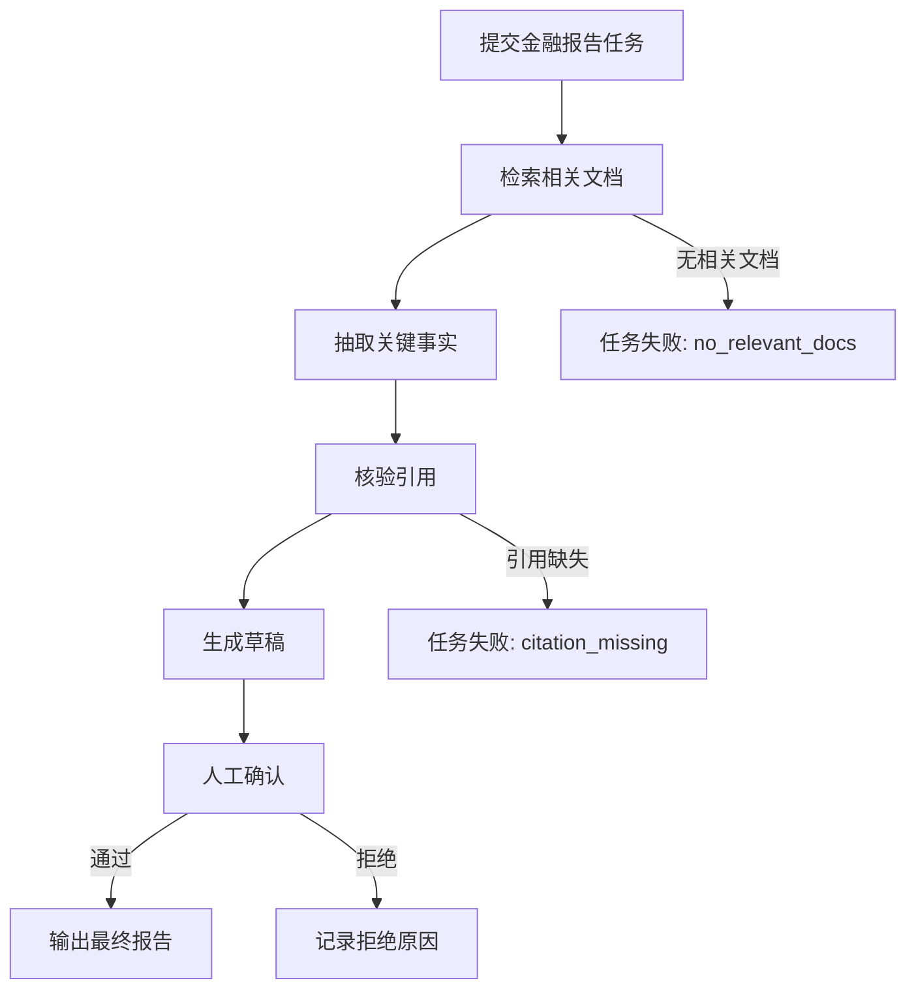

# M12 金融投研 AI 场景适配教材

<!-- textbook-content: default=design-note -->

## 编写说明

这份教材服务于当前学习路线中的场景化差异建设。

它不是金融学教材，不提供投资建议，也不要求你先成为行业研究员。M12 的目标只有一个：

```text
把金融投研中的文档密集型任务，转成 M03 RAG、M04 Agent 和 P03 AI Workload Platform 能承接的真实应用场景。
```

> 状态边界：本文件定义未来金融 workload 的设计契约。当前 P03 v0.3.1 只注册
> `mock_rag/mock_agent/simulated_inference/rag_retrieval`，会拒绝本教材中的金融
> `task_type`；以下接口和结果不能写成已实现教程。

金融投研场景适合当前路线，是因为它天然具有几个特点：

- 文档多：公告、财报、研报、新闻、会议纪要、政策文件。
- 证据重要：回答必须能指向来源，不能只给“看起来合理”的结论。
- 任务复杂：常常不是一次问答，而是检索、抽取、比较、核验、写报告。
- 风险敏感：必须区分事实、推断、模型生成和待核验内容。
- 负载真实：长文档解析、向量检索、多步骤 Agent、报告生成都会带来延迟、成本和失败。

因此，M12 的学习主线是：

```text
金融文档
-> RAG 检索与引用
-> 投研问答和信息抽取
-> Agent 多步骤工作流
-> P03 workload 接入
-> 项目展示和简历表达
```

本教材连接：

- [[10_学习模块/M12_金融投研AI场景/M12_金融投研AI场景_学习地图|M12 金融投研 AI 场景学习地图]]
- [[20_资料库/模块资料索引/M12_金融投研AI场景_资料索引|M12 金融投研 AI 场景资料索引]]
- [[10_学习模块/M03_RAG工程/M03_RAG工程_适配教材|M03 RAG 工程适配教材]]
- [[10_学习模块/M04_Agent工作流/M04_Agent工作流_适配教材|M04 Agent 工作流适配教材]]
- [[50_项目产出/P03_AI_Workload_Platform/P03_AI_Workload_Platform 项目主页|P03 AI Workload Platform]]
- [[80_就业市场与简历/就业市场总览|就业市场总览]]

第一轮推荐查阅的真实资料：

- [SEC EDGAR APIs](https://www.sec.gov/search-filings/edgar-application-programming-interfaces)
- [SEC EDGAR fair access](https://www.sec.gov/os/accessing-edgar-data)
- [LangChain RAG](https://docs.langchain.com/oss/python/langchain/rag)
- [LangGraph Quickstart](https://docs.langchain.com/oss/python/langgraph/quickstart)
- [Google Cloud RAG reference architectures](https://docs.cloud.google.com/architecture/rag-reference-architectures)
- [Ragas Docs](https://docs.ragas.io/en/stable/)

## 开始之前

| 项目 | 要求 |
|---|---|
| 目标读者 | 已理解 RAG 引用和受控 Agent 工作流、希望设计金融文档型 workload 的学习者 |
| 先修知识 | 完成 M03 的 corpus/chunk/citation 和 M04 的状态/审批边界；具备 F00 的金融文档与数据口径即可，不要求估值或投资研究经验 |
| 前置诊断 | 打开 P03 `p03_service/app/models.py` 核对注册任务类型；再选一份可合法使用的公开文档，记录来源、revision、SHA-256、as-of time 和权限范围 |
| 版本边界 | 当前基线为 P03 v0.3.1，金融 `task_type` 尚未注册。SEC/框架接口按使用时官方规则执行并固定 locator/revision；网络可访问不等于内容许可或来源支持成立 |
| 学习产物 | corpus manifest、claim-support 映射、检索前权限方案、受控工作流、失败/人工复核状态和候选 workload 契约 |
| 完成口径 | 产物是可评审设计稿，不是已运行平台；无稳定证据、授权或已注册 task 时，不得宣称端到端完成或给出投资建议 |
| 建议用时 | 作者侧初步估计 6-8 小时；先做一条文档到证据映射，第 5 章接口和第 6 章表达只按 design-note/appendix 阅读 |

## 第一轮学习边界

金融场景很容易发散。第一轮只学和 P03 有关的 AI 工程能力，不把时间投入到完整金融知识体系或投资策略上。

| 内容 | 第一轮要掌握 | 暂时不深入 | 为什么 |
|---|---|---|---|
| 金融文档 | 知道公告、财报、研报、新闻的结构差异 | 不系统学习会计、估值、宏观金融 | 当前目标是构造文档型 workload |
| 金融 RAG | 能设计 chunk、metadata、retrieval、citation | 不做完整投研知识库产品 | 先接入 M03/P03 |
| 信息抽取 | 能抽取公司、时间、指标、事件、风险因素 | 不做复杂金融 NLP 模型训练 | 项目第一轮以规则和 LLM 抽取为主 |
| 投研问答 | 能回答“基于哪些资料，得到什么事实” | 不生成投资评级或买卖建议 | 避免越界和虚构 |
| Agent 工作流 | 能拆成检索、抽取、核验、汇总、报告 | 不做开放式多 Agent 研究系统 | 保持 M04 的可控工作流边界 |
| 风险提示 | 能标注来源不足、时间过旧、生成内容待核验 | 不做复杂合规审查系统 | 项目展示需要诚实边界 |
| workload | 能记录任务类型、耗时、token、引用、失败 | 不做金融终端平台 | 服务 P03 调度监控 |

判断是否越界很简单：

```text
如果一个内容不能帮助金融文档进入 RAG、Agent 或 P03 workload，就先不学深。
```

## 可迁移的原则

1. 金融投研 AI 的核心不是“生成漂亮报告”，而是把文档、事实、证据、推断和风险提示分开记录。
2. RAG 输出必须围绕 `retrieved_sources` 和引用边界。没有证据来源的回答不能进入项目展示，更不能变成投资判断。
3. Agent 工作流必须可回放。检索、抽取、核验、人工确认、报告生成每一步都要留下 `step_logs`，否则失败后无法解释，也无法接入 M06/M08。
4. 金融场景只提供 workload 和展示差异，不提供投资建议。M12 的合格产出是“可核验的信息处理流程”，不是“推荐买卖”。

## 踩坑现场

> 你让模型基于一份财报生成“公司前景很好”的总结。这个输出很危险：它混合了事实、推断和主观判断。更合格的做法是抽取收入、利润、风险因素等事实，列出 `retrieved_sources`，再把“待人工核验”的推断和风险提示单独标注。

## 第 1 章：为什么金融投研适合做 RAG / Agent 场景

### 1.1 为什么要学

普通 RAG demo 常常是上传几篇文章，然后问一句话。这能展示“会用 RAG”，但不一定能展示真实工程复杂度。

金融投研场景更适合做项目展示，因为它让 RAG 和 Agent 面对更接近真实工作的材料：

```text
一家公司发布年报
-> 你需要找到收入、利润、风险因素、管理层讨论
-> 再结合历史公告或研报
-> 回答某个具体问题
-> 给出引用来源
-> 标注不能确定的地方
```

这不是单纯“问模型一个问题”，而是一个文档理解、检索、证据引用、风险控制和任务执行的工程问题。

### 1.2 金融投研 AI 场景是什么

在当前路线里，金融投研 AI 场景可以理解为：

```text
用 RAG / Agent 帮助用户阅读、检索、抽取、对比和整理金融文档，
但不替用户做投资决策。
```

第一轮可以选择以下任务：

| 场景 | 输入 | 输出 | 为什么适合 P03 |
|---|---|---|---|
| 公告问答 | 公司公告 | 带引用的回答 | 检验 chunk 和 citation |
| 财报解析 | 10-K / 年报 / 财报 PDF | 指标、风险因素、摘要 | 检验长文档解析和抽取 |
| 研报检索 | 研报或公开资料 | 主题检索和观点定位 | 检验 retrieval 和 metadata |
| 风险提示 | 财报风险章节、公告 | 风险点列表和来源 | 检验证据边界 |
| 报告生成 | 多份材料 | 初版研究摘要 | 检验 Agent 工作流 |

这些任务共同构成金融 AI workload。

### 1.3 不能做什么

M12 必须非常清楚地划边界：

- 不输出“买入 / 卖出 / 持有”建议。
- 不生成没有来源的财务数据。
- 不把模型摘要当作事实。
- 不声称系统能预测股价。
- 不使用没有授权的数据。
- 不把示例项目包装成真实投研产品。

项目输出应该更像：

```text
根据用户上传的公开公告和财报，系统检索相关片段，
生成带来源引用的摘要，并标注信息来源、时间范围和待核验风险。
```

而不是：

```text
系统自动判断股票是否值得投资。
```

### 1.4 在项目里的使用场景

未来可以给 P03 注册金融任务，但它仍然复用统一 workload 入口：

```text
POST /tasks (candidate task_type=finance_doc_ingest)
-> 解析公告/财报并写 server-owned ACL metadata
-> chunk + metadata
-> POST /tasks (candidate task_type=finance_rag_query)
-> transaction(tasks + outbox) / Scheduler / Worker
-> 检索前权限过滤
-> 返回 claims + retrieved_sources + support_status + risk_notes + metrics
```

这个设计的重点不是做金融平台，而是让 P03 的 AI workload 更真实：

- 文档更长，chunk 和检索更重要。
- 引用更关键，不能只返回答案。
- 任务更重，调度和压测更有意义。
- 输出更敏感，风险提示和边界更重要。

### 1.5 常见错误

| 错误 | 后果 | 正确做法 |
|---|---|---|
| 把 M12 写成金融学学习 | 偏离 AI Infra 主线 | 只学文档场景需要的金融背景 |
| 直接让模型写投资结论 | 风险高且容易虚构 | 输出事实摘要、证据和风险提示 |
| 只做漂亮报告 | 无法证明工程能力 | 记录任务、引用、延迟、失败和成本 |
| 没有来源引用 | 结果无法核验 | answer 必须绑定 sources |
| 使用不清楚来源的数据 | 项目不可复现 | 优先用公开、可追踪、可说明的数据 |

### 1.6 小练习

拿一份公开公司年报或 SEC filing，写出它在系统里的 metadata：

```yaml
document_id: sec_0000320193_10k_2023
source_system: sec_edgar
issuer_id: cik_0000320193
accession_number: 0000320193-23-000106
company: Apple Inc.
ticker: AAPL
document_type: 10-K
report_period: 2023-09-30
filing_date: 2023-11-03
primary_document: aapl-20230930.htm
source_url: https://www.sec.gov/Archives/edgar/data/320193/...
retrieved_at: 2026-07-12T08:00:00Z
content_sha256: sha256:<64-hex-digest>
parser_version: filing-parser/0.1.0
tenant_id: <server-owned>
permission_group: <server-owned-public>
acl_policy_version: public-filings/1
language: en
```

公司名、ticker 和 URL 便于展示，但都不能单独充当稳定标识。SEC 文件至少保留 CIK、accession
number、form、filing/report date、primary document、抓取时间与内容 digest；其他来源也要提供
等价的 source id/revision。`tenant_id`、permission 和 ACL 版本由受信任的 ingest 服务根据
principal/policy 写入，不能由普通查询或上传请求自报。

验收标准：

- 能说明每个字段为什么对检索、引用或权限有用。
- 能区分 `document_type`、`report_period`、`filing_date`、`retrieved_at` 和 source revision。
- 能用 accession/source revision 与 digest 定位同一版内容，而不只依赖可变 URL。
- 不添加无法核验的字段。

### 1.7 推荐资料

- [SEC EDGAR APIs](https://www.sec.gov/search-filings/edgar-application-programming-interfaces)
- [SEC EDGAR fair access](https://www.sec.gov/os/accessing-edgar-data)
- [[10_学习模块/M03_RAG工程/M03_RAG工程_适配教材|M03 RAG 工程适配教材]]

## 第 2 章：金融文档如何进入 RAG

### 2.1 为什么要学

RAG 的第一步不是调用模型，而是把文档整理成系统能检索、能引用、能过滤的结构。

金融文档比普通文章更麻烦：

- 文档长。
- 表格多。
- 章节结构明显。
- 时间、公司、指标和来源很重要。
- 同一个问题可能需要跨章节或跨文档回答。

如果文档进入系统时没有处理好，后面的检索和生成都会出问题。

### 2.2 核心概念

金融 RAG 至少需要四层信息：

```text
document
-> section
-> chunk
-> metadata
```

可以这样理解：

| 层次 | 例子 | 作用 |
|---|---|---|
| document | 一份 10-K、一份公告、一篇研报 | 文档级来源 |
| section | Risk Factors、MD&A、财务报表附注 | 章节级语义 |
| chunk | 一段可检索文本 | embedding 和 retrieval |
| metadata | 公司、年份、文档类型、来源 URL、页码 | 过滤、引用、权限 |

M03 里讲过 chunk、embedding、retrieval、citation。M12 要做的是把这些概念落到金融文档上。

### 2.3 最小流程

最小金融文档 RAG 流程：

```text
Upload filing / report
-> Authenticate ingest principal and assign server-owned tenant/ACL metadata
-> Fetch exact source revision and verify content digest
-> Parse text
-> Split by section or fixed chunk
-> Add metadata
-> Embed chunks
-> Store chunks
-> Authenticate query principal and resolve allowed scope
-> Pre-filter tenant/ACL before scoring
-> Query with business filters inside the authorized set
-> Retrieve top-k chunks
-> Generate answer with citations
```

伪代码可以这样写：

```python
chunks = split_document(text, chunk_size=800, overlap=120)

records = []
for i, chunk in enumerate(chunks):
    records.append({
        "chunk_id": f"{document_id}@{accession_number}#chunk-{i:04d}",
        "text": chunk,
        "metadata": {
            "source_system": "sec_edgar",
            "issuer_id": "cik_0000320193",
            "accession_number": accession_number,
            "content_sha256": content_sha256,
            "chunk_sha256": sha256_text(chunk),
            "company": "Apple Inc.",
            "ticker": "AAPL",
            "document_type": "10-K",
            "report_period": "2023-09-30",
            "section_path": section_path_for(i),
            "char_start": chunk_offsets[i][0],
            "char_end": chunk_offsets[i][1],
            "source_url": source_url,
            "chunk_index": i,
            "tenant_id": server_principal.tenant_id,
            "permission_group": assigned_permission_group,
            "acl_policy_version": acl_policy_version,
        },
    })
```

`section_path + char_start/char_end` 只是 HTML/text 解析的一种 locator；PDF 可使用 page 与 bounding
box，表格可使用 sheet/table/row/column。关键是 locator、source revision、parser version 和
digest 能共同回到被实际检索的字节。重新解析或换 chunk 参数必须产生新 revision/chunk id，
不能悄悄复用旧引用。

这里的重点不是代码复杂，而是 metadata 不能丢。没有 metadata，后面很难回答：

- 这个答案来自哪份文档？
- 是哪一年的数据？
- 是公告、财报还是研报？
- 用户有没有权限看这份资料？
- 引用能不能回到原文？

### 2.4 Chunk 设计

金融文档 chunk 不能只追求“切得越细越好”。

| 设计 | 优点 | 风险 |
|---|---|---|
| 小 chunk | 检索更精确、引用更短 | 容易丢上下文 |
| 大 chunk | 保留上下文 | 检索噪声和 token 成本更高 |
| 固定长度 chunk | 实现简单 | 可能切断表格或段落 |
| 按章节 chunk | 更符合文档结构 | 解析难度更高 |

第一轮建议：

```text
先用固定长度 + overlap 跑通 E03/P03，
再在财报章节上尝试 section-aware chunk。
```

不要一开始追求完美 PDF 表格解析。先保证任务可运行、引用可回溯、指标可记录。

### 2.5 检索与引用

金融问答的回答应该默认带引用。

推荐输出结构：

```json
{
  "answer": "根据 2023 10-K 的风险因素章节，公司提到了供应链、宏观环境和监管相关风险。",
  "claims": [
    {
      "claim_id": "claim-001",
      "text": "该文件列出供应链相关风险。",
      "material": true,
      "support_status": "supported",
      "citation_ids": ["citation-001"]
    }
  ],
  "retrieved_sources": [
    {
      "citation_id": "citation-001",
      "document_id": "sec_0000320193_10k_2023",
      "source_system": "sec_edgar",
      "accession_number": "0000320193-23-000106",
      "document_type": "10-K",
      "report_period": "2023-09-30",
      "section_path": "Item 1A > Risk Factors",
      "char_start": 14200,
      "char_end": 14980,
      "chunk_id": "sec_0000320193_10k_2023@0000320193-23-000106#chunk-0042",
      "chunk_sha256": "sha256:<64-hex-digest>",
      "source_url": "https://www.sec.gov/...",
      "score": 0.82
    }
  ],
  "risk_note": "该回答仅基于已上传文档，不构成投资建议。"
}
```

retrieval `score` 只表示排序相关性，不证明 source 支持某个 claim。每个 material claim 必须通过
`citation_ids` 映射到精确 locator，再按 `supported/partially_supported/unsupported/contradicted`
复核。单纯要求“每个关键点至少一个 URL”会奖励无关引用，不能作为质量判据。

这比只返回一段自然语言更适合项目展示，因为它体现了：

- RAG 工程能力。
- 证据链意识。
- 金融场景风险边界。
- 后续可评估和可监控。

### 2.6 在 P03 里的使用

金融 RAG 请求可以扩展 P03 的 RagTask：

| 字段 | 作用 |
|---|---|
| task_type | `finance_rag_query` |
| query | 用户问题 |
| collection_id | 金融文档集合 |
| company / ticker | 公司过滤 |
| document_type | 10-K / announcement / report |
| report_period / source_revision | 时间过滤与不可变来源版本 |
| top_k | 检索片段数量 |
| require_citation | 是否强制引用 |
| risk_note_required | 是否强制风险提示 |
| queue_wait_ms | 排队等待 |
| retrieval_ms | 检索耗时 |
| generation_ms | 生成耗时 |
| token_count | 成本估计 |
| citation_count | 引用数量，只表示输出规模，不表示支持质量 |
| material_claim_count / supported_claim_count | claim-support 分母与已支持数量 |
| claim_support_rate | `supported material claims / material claims`，必须同时报告分子分母 |
| error_type | 失败类型 |

这能直接连接 M05/M08：

- 不同文档长度会影响执行时间。
- 不同 top_k 会影响 retrieval/generation latency。
- 强制 citation 会影响输出质量检查。
- 报告生成类任务比简单问答更适合进入队列。

### 2.7 常见错误

| 错误 | 表现 | 修正 |
|---|---|---|
| 只保存来源 URL | URL 变化或内容修订后无法定位原字节 | 保存 source id/revision、digest 和精确 locator |
| 不保存期间 | 混用不同年份数据 | 保存 report_period / filing_date |
| chunk 太大 | 成本高，回答混乱 | 先用固定 chunk_size 做对比 |
| chunk 太小 | 找不到完整语义 | 设置 overlap 或按章节切分 |
| 检索后才做权限过滤 | 未授权内容已参与打分、缓存或生成 | 使用服务端 principal，在打分前过滤 tenant/ACL |

权限过滤的正确含义不是“生成后删除不该看的 source”，而是：服务端认证得到 tenant/user 与授权
范围快照，在 BM25/vector 检索或 cache 命中之前就用 `(tenant_id, allowed groups, ACL version)`
缩小候选集。客户端 filters 只能进一步收窄，不能扩大授权范围；检索缓存 key 也必须包含 tenant、
scope hash、document/index revision 和 filter hash。

### 2.8 小练习

设计一个金融文档 collection schema：

```text
documents
chunks
embeddings
metadata
```

验收标准：

- 能支持按公司、时间、文档类型过滤。
- 能返回 chunk 级引用。
- 能记录检索耗时和生成耗时。
- 能证明未授权 chunk 在打分前就不进入候选集，并保存服务端 authorization snapshot。

### 2.9 推荐资料

- [LangChain RAG](https://docs.langchain.com/oss/python/langchain/rag)
- [Google Cloud RAG reference architectures](https://docs.cloud.google.com/architecture/rag-reference-architectures)
- [[10_学习模块/M03_RAG工程/M03_RAG工程_适配教材|M03 RAG 工程适配教材]]

## 第 3 章：金融问答、信息抽取和风险提示

### 3.1 为什么要学

金融场景里的“回答”不能只追求流畅。一个回答可能涉及年份、指标、公司、来源和风险边界。

例如用户问：

```text
这家公司 2023 年主要风险有哪些？
```

差的回答是：

```text
公司面临市场竞争、供应链和宏观经济风险。
```

更适合项目的回答是：

```text
基于 2023 10-K 的 Risk Factors 章节，系统检索到供应链、宏观环境、监管和产品需求相关风险。
下面每个风险点都附带原文片段来源。该摘要仅基于当前文档集合，不构成投资建议。
```

差别在于：第二种回答能被核验。

### 3.2 三类任务

第一轮金融 AI 场景可以从三类任务开始。

| 任务 | 输入 | 输出 | 重点 |
|---|---|---|---|
| 问答检索 | 用户问题 + 文档集合 | answer + retrieved_sources | citation |
| 信息抽取 | 财报/公告文本 | 指标、事件、风险因素 | schema |
| 报告生成 | 多份材料 + 主题 | 结构化摘要 | workflow |

这三类任务都可以成为 P03 的 workload。

### 3.3 信息抽取 schema

信息抽取不要一开始追求全自动万能。先定义清楚输出结构。

例如风险因素抽取：

```json
{
  "company": "Example Corp",
  "document_type": "10-K",
  "report_period": "2023-12-31",
  "risk_items": [
    {
      "risk_category": "supply_chain",
      "summary": "供应链中断可能影响生产和交付。",
      "claim_id": "claim-risk-001",
      "support_status": "supported",
      "citation_ids": ["citation-001"],
      "confidence_note": "模型摘要，需人工核验原文。"
    }
  ]
}
```

这个 schema 有三个好处：

- 结果可检查。
- 引用可追踪。
- 风险边界清楚。

### 3.4 风险提示

金融场景中，风险提示不是装饰文字，而是输出的一部分。

最小风险提示包括：

```text
本回答仅基于当前检索到的公开文档片段生成。
模型输出可能遗漏上下文或误解原文。
请以原始公告、财报和专业判断为准。
本回答不构成投资建议。
```

在系统里可以设计为：

```json
{
  "risk_note_required": true,
  "risk_note": "...",
  "unsupported_claims": [],
  "needs_human_review": true
}
```

### 3.5 常见错误

| 错误 | 为什么危险 | 正确做法 |
|---|---|---|
| 把摘要写成结论 | 用户可能误以为是分析结论 | 明确“基于文档摘要” |
| 没有 citation | 无法核验 | 每个关键点绑定来源 |
| 混用不同期间 | 财务语义错误 | 强制 period 过滤 |
| 编造指标 | 项目可信度崩掉 | 没有证据就输出“不足以判断” |
| 过度自信 | 金融场景风险高 | 加 risk_note 和 human_review |

### 3.6 小练习

设计一个“财报风险因素问答”的输出模板。

要求包含：

- answer
- bullet_points
- sources
- risk_note
- unsupported_claims
- metrics

验收标准：

- 每个 material claim 都有 claim_id、support_status 和精确 citation locator。
- 无来源或来源不支持的内容进入 unsupported_claims，矛盾证据单独标记 contradicted。
- 输出不包含投资建议。

### 3.7 推荐资料

- [Ragas Docs](https://docs.ragas.io/en/stable/)
- [[10_学习模块/M03_RAG工程/M03_RAG工程_适配教材|M03 RAG 工程适配教材]]
- [[10_学习模块/M08_监控压测与可观测性/M08_监控压测与可观测性_适配教材|M08 监控压测与可观测性适配教材]]

## 第 4 章：投研 Agent 工作流

### 4.1 为什么要学

金融投研任务经常不是一次问答。

例如用户想要：

```text
基于这家公司最近一年的公开材料，生成一份风险摘要。
```

这可能需要多个步骤：

```text
选择文档
-> 检索风险章节
-> 抽取风险因素
-> 合并重复风险
-> 标注来源
-> 生成摘要
-> 等待人工确认
-> 输出最终报告
```

这就是 M04 的可控 Agent 工作流。

### 4.2 Agent 和 RAG 的关系

在 M12 里，RAG 是 Agent 的工具之一。

```text
RAG：回答一个具体问题。
Agent：组织多个 RAG / 抽取 / 核验 / 写作步骤，完成一个任务。
```

不要把 Agent 理解成“让 AI 自己随便研究”。第一轮投研 Agent 必须固定步骤、固定工具、固定失败处理。

### 4.3 最小投研 Agent

最小流程可以设计为：

```text
submit_finance_report_task
-> retrieve_relevant_docs
-> extract_key_facts
-> verify_citations
-> draft_report
-> waiting_approval
-> finalize_report
```

对应状态：

| 步骤 | 输入 | 输出 | 失败类型 |
|---|---|---|---|
| retrieve_relevant_docs | query, filters | chunks | no_relevant_docs |
| extract_key_facts | chunks | facts with sources | extraction_failed |
| verify_citations | facts | verified_facts | citation_missing |
| draft_report | verified_facts | draft | generation_failed |
| waiting_approval | draft | approved/rejected | approval_timeout |
| finalize_report | approved draft | final report | finalize_failed |

### 4.4 在 P03 里的 AgentTask

金融投研 Agent 是待注册的 P03 候选：

```json
{
  "task_type": "finance_agent_report",
  "priority": 3,
  "estimated_duration_ms": 120000,
  "idempotency_key": "agent-report-018f4e5c",
  "input_json": {
    "current_step": "retrieve_relevant_docs",
    "company": "Example Corp",
    "document_types": ["10-K", "announcement"],
    "report_period": "2023-12-31",
    "source_revision": "edgar-snapshot-2026-07-12",
    "max_steps": 8,
    "require_approval": true,
    "estimated_token_cost": 12000
  }
}
```

它比普通 RAG 更需要调度，因为：

- 步骤更多。
- 耗时更长。
- token 成本更高。
- 中间可能等待人工确认。
- 失败点更多。

这正好连接 M05/M06/M08：

| 模块 | 在金融 Agent 中负责什么 |
|---|---|
| M04 | 定义步骤、工具、状态和失败处理 |
| M05 | 队列、优先级、超时、成本感知 |
| M06 | 任务状态持久化、重试、幂等 |
| M08 | step latency、tool error、queue wait、P95/P99 |

### 4.5 常见错误

| 错误 | 后果 | 修正 |
|---|---|---|
| Agent 步骤不固定 | 难以调试和复现 | 第一版使用固定工作流 |
| 没有人工确认 | 输出风险高 | 报告生成加入 waiting_approval |
| 工具调用不记录 | 无法排查错误 | 保存 step_logs |
| 失败后直接重跑 | 可能重复消耗和重复写入 | 用 task_id 和 idempotency_key |
| 把 Agent 做成聊天机器人 | 偏离 P03 workload | 每次请求必须形成 AgentTask |

### 4.6 小练习

画一个“风险摘要 Agent”的状态图。



验收标准：

- 每个步骤有输入和输出。
- 每个失败路径有 error_type。
- 报告输出前有人工确认。
- 能说明这个 AgentTask 如何进入 P03 队列。

### 4.7 推荐资料

- [LangGraph Quickstart](https://docs.langchain.com/oss/python/langgraph/quickstart)
- [LangGraph Agentic RAG](https://docs.langchain.com/oss/python/langgraph/agentic-rag)
- [[10_学习模块/M04_Agent工作流/M04_Agent工作流_适配教材|M04 Agent 工作流适配教材]]

## 第 5 章：把金融请求接入 P03 workload

### 5.1 为什么要学

M12 最重要的出口不是“我懂金融”，而是：

```text
我能把金融投研请求建模成真实 AI workload，
并让它进入队列、调度、执行、监控和项目展示。
```

这会让 P03 比普通 RAG demo 更有差异。

### 5.2 金融请求类型

第一版可以定义三类任务：

| task_type | 说明 | worker |
|---|---|---|
| finance_doc_ingest | 金融文档解析、chunk、metadata | Document Worker |
| finance_rag_query | 基于金融文档的问答检索 | RAG Worker |
| finance_agent_report | 多步骤投研报告生成 | Agent Worker |

这三类都是待注册候选。当前 P03 v0.3.1 的 `TaskCreate` 会拒绝它们，不能直接复制下面的设计请求
并期待成功；实现时必须先增加 schema、worker、owner/security tests 和端到端结果契约。

它们都进入统一任务系统：

```text
API
-> transaction: tasks table + outbox
-> dispatcher -> queue(task_id only)
-> scheduler
-> worker CAS + lease
-> result_json / metrics
```

### 5.3 最小 API 设计

候选金融任务应复用统一任务入口，而不是另建三个绕过幂等、outbox 和 owner query 的接口：

```text
POST /tasks
GET /tasks/{task_id}
```

示例请求：

```json
{
  "task_type": "finance_rag_query",
  "priority": 5,
  "estimated_duration_ms": 0,
  "idempotency_key": "request-018f4e5c",
  "input_json": {
    "query": "这家公司最近年度报告中提到的主要风险是什么？",
    "collection_id": "filings-public-v1",
    "filters": {
      "company": "Example Corp",
      "document_type": "10-K",
      "report_period": "2023-12-31"
    },
    "source_revision": "edgar-snapshot-2026-07-12",
    "top_k": 5,
    "require_citation": true,
    "risk_note_required": true
  }
}
```

`tenant_id`、`user_id`、permission groups 和 ACL 不能出现在 `input_json`；API 从 bearer
principal 和服务端策略生成 owner/security snapshot。幂等唯一约束是
`(tenant_id, user_id, idempotency_key)`。key 的语义必须覆盖一次逻辑提交；若 query、source
revision 或输出要求改变，应使用新 key，不能用含义模糊的 `user_query_hash` 永久复用旧结果。

对应任务记录：

```json
{
  "task_id": "task_123",
  "task_type": "finance_rag_query",
  "status": "pending",
  "priority": 3,
  "input_json": "...",
  "created_at": "...",
  "tenant_id": "<server-owned>",
  "user_id": "<server-owned>",
  "authorization_snapshot_id": "authz-20260712-001",
  "idempotency_key": "request-018f4e5c"
}
```

### 5.4 指标设计

金融 workload 需要记录通用指标和场景指标。

通用指标：

- queue_wait_ms
- execution_ms
- retrieval_ms
- generation_ms
- total_latency_ms
- token_count
- error_type
- status

金融场景指标：

- document_type
- period
- chunk_count
- citation_count
- unsupported_claim_count
- material_claim_count
- supported_material_claim_count
- claim_support_rate（同时报告分子和分母）
- needs_human_review
- risk_note_included

这些指标可以直接连接 M08：

```text
金融问答 p95 延迟是多少？
报告生成 Agent 的失败率是多少？
强制 citation 是否增加生成耗时？
长文档 ingest 是否导致队列堆积？
```

`citation_count` 只是输出规模指标：多放几个不相关引用也会升高，不能解释为质量改善。质量判断
至少使用 claim-support 映射、可解析 locator、矛盾/无支持计数和 M11 的人工 Rubric；没有人工
或有标注 reference 时，字段只能记为 `not_reviewed`，不能预填 `supported=true`。

### 5.5 调度意义

金融场景能让 M05 的调度策略更真实。

不同任务成本差异很大：

| 任务 | 预计耗时 | 调度含义 |
|---|---|---|
| 简单问答 | 短 | 可快速返回 |
| 长财报解析 | 长 | 可能阻塞 worker |
| 报告生成 Agent | 很长 | 需要队列、优先级、超时 |
| 文档 ingest | 中到长 | 可异步执行 |

因此 P03 可以比较：

- FIFO 是否让短问答被长任务拖慢。
- Priority 是否能保证交互式问答优先。
- SJF / cost-aware 是否能降低平均等待，但是否牺牲长任务。
- worker 数量变化如何影响 P95/P99。

这正好接 RQ01 的研究训练方向。

### 5.6 常见错误

| 错误 | 表现 | 修正 |
|---|---|---|
| 金融功能绕过任务队列 | 无法体现 P03 主线 | 所有金融请求都生成 task |
| 只展示最终报告 | 看不到工程能力 | 展示状态、日志、引用、metrics |
| 不记录 task_type | 无法分组压测 | finance_rag_query / finance_agent_report |
| 不记录 claim-support | 无法判断引用是否支持断言 | material/supported/partial/unsupported/contradicted 及 locator |
| 不记录风险提示 | 输出边界不清 | risk_note_required / risk_note_included |
| 客户端自报 tenant/permission | 可越权检索或污染缓存 | 只使用服务端 principal/policy snapshot，检索前过滤 |
| 全局 idempotency key | 不同用户互相占 key，或数据更新仍返回旧任务 | owner-scoped 唯一约束，并绑定 source revision |
| 用 citation_count 代表质量 | 无关引用也能提高数字 | 使用 claim-support Rubric 与可解析 locator |

### 5.7 小练习

设计一次金融 RAG 压测实验：

```text
固定 100 个金融问答请求
比较 top_k=3 和 top_k=8
观察 retrieval_ms、generation_ms、total_latency_ms、claim_support_rate 和 P95
```

验收标准：

- 能说明负载条件。
- 能说明变量和控制变量。
- 能记录 P95/P99。
- 能解释 top_k 对质量、延迟和成本的影响。
- 能同时报告 material claims 分母、支持/部分支持/无支持数量，不用 citation_count 代替质量。

### 5.8 推荐资料

- [[10_学习模块/M05_任务队列与调度/M05_任务队列与调度_章节教材|M05 任务队列与调度章节教材]]
- [[10_学习模块/M08_监控压测与可观测性/M08_监控压测与可观测性_适配教材|M08 监控压测与可观测性适配教材]]
- [[50_项目产出/P03_AI_Workload_Platform/P03_AI_Workload_Platform 项目主页|P03 AI Workload Platform]]

## 第 6 章：项目展示与简历表达

<!-- textbook-content: type=appendix -->

### 6.1 为什么要学

M12 的价值在于差异化表达。

很多项目都能写“做了 RAG 问答”。更好的表达是：

```text
围绕金融投研文档场景，设计 RAG/Agent workload，
支持公告/财报解析、证据引用、风险提示、任务队列和性能指标记录。
```

这样能同时体现：

- AI 应用工程能力。
- RAG/Agent 真实场景理解。
- 金融背景和项目结合。
- AI workload 平台意识。

### 6.2 项目展示应该展示什么

一个 M12 场景 demo 可以展示：

| 展示项 | 说明 |
|---|---|
| 文档上传 | 一份公开公告或财报进入系统 |
| metadata | 公司、文档类型、期间、来源 |
| RAG 问答 | 回答带 sources |
| 风险提示 | 输出不构成投资建议 |
| Agent 步骤 | retrieve、extract、verify、draft、approve |
| 任务状态 | pending/running/succeeded/failed |
| metrics | queue_wait、retrieval、generation、total latency |

这比只展示一个聊天框更能说明工程能力。

### 6.3 简历表达草稿

可以写成：

```text
在 AI Workload Platform 中设计金融投研文档场景，将公告/财报解析、RAG 问答和 Agent 报告生成建模为可调度任务；实现文档 metadata、chunk 检索、证据引用、风险提示、任务状态记录和基础延迟指标采集，用于对比不同请求类型下的队列等待和 P95 延迟。
```

如果项目还没实现，只能写成计划或学习项目表达：

```text
正在围绕金融投研文档场景设计 RAG/Agent workload：规划公告/财报解析、证据引用、风险提示、任务队列和监控指标，目标是将金融文档任务接入 AI Workload Platform。
```

不要提前写：

```text
已构建智能投研系统，可自动生成投资建议。
```

这不符合当前路线，也风险太高。

### 6.4 面试解释口径

面试中可以这样解释：

```text
我没有把金融场景做成投资建议系统，而是把它作为 AI workload 平台的真实应用场景。
金融文档长、来源敏感、引用重要，适合检验 RAG 的 chunk、retrieval、citation；
投研报告生成又天然是多步骤流程，适合检验 Agent 的状态、工具调用和失败处理。
这些请求进入统一任务队列后，可以进一步观察 P95/P99、worker utilization 和 token 成本。
```

这段话的重点是：你不是在卖“金融预测”，而是在展示“场景驱动的 AI 工程能力”。

### 6.5 常见错误

| 错误表达 | 问题 | 更合适表达 |
|---|---|---|
| 智能炒股系统 | 风险高且不真实 | 金融文档 RAG / Agent 场景 |
| 自动生成投资建议 | 容易越界 | 生成带引用的文档摘要和风险提示 |
| 金融大模型平台 | 夸大范围 | AI workload 平台中的金融文档场景 |
| 精准预测股价 | 无证据 | 对公开材料进行检索、抽取和整理 |

### 6.6 小练习

写两版项目表达：

1. 面向 AI 应用工程师。
2. 面向金融科技 AI 平台岗位。

验收标准：

- 不夸大实现状态。
- 不写投资建议。
- 能体现 RAG/Agent/P03 workload。
- 能体现金融场景差异。

## 设计贯通案例（当前未实现）

下面是实现前必须满足的 M12 到 P03 设计链路，不是当前可运行 walkthrough：

```text
用户上传 2023 年 10-K
-> 服务端认证 ingest principal，固定 source revision/digest 和 ACL metadata
-> 系统解析文本并保存稳定 locator
-> 文档被切成 chunks 并建立索引
-> 用户提问“主要风险因素有哪些？”
-> API 创建 owner-scoped finance_rag_query task + outbox
-> dispatcher 发布 task_id
-> Scheduler 分配给 RAG Worker
-> Worker 按 server-owned tenant/ACL 预过滤，再检索 top-k chunks
-> LLM 生成 claims + retrieved_sources + risk_note
-> 系统复核 claim-citation support，记录分子、分母与 unsupported/contradicted
-> 系统记录 retrieval_ms / generation_ms / claim_support_rate
-> 用户查看回答和引用
```

如果升级为 Agent：

```text
用户请求生成风险摘要报告
-> API 创建 finance_agent_report task
-> Agent Worker 执行 retrieve / extract / verify / draft
-> 进入 waiting_approval
-> 人工确认后 finalize
-> 返回 report + step_logs + metrics
```

这条链路同时连接：

- M03：文档 chunk、retrieval、citation。
- M04：多步骤 Agent、状态、失败处理。
- M05：任务队列、优先级、成本感知。
- M06：任务持久化、状态流转、重试。
- M08：P95/P99、错误率、worker utilization。
- M11：后续可形成实验记录和报告。
- P03：统一 workload 平台。

## 学习检查

- [ ] 能说明金融投研 AI 场景的工程价值。
- [ ] 能设计金融文档 metadata。
- [ ] 能解释 chunk_size、top_k、citation 对金融 RAG 的影响。
- [ ] 能设计 claims + stable retrieved_sources + support_status + risk_note 输出。
- [ ] 能证明 tenant/ACL 在检索打分和缓存命中前执行，且客户端不能自报权限。
- [ ] 能画出一个可控投研 Agent 工作流。
- [ ] 能说明 finance task 尚未注册，并列出接入 P03 前需要的 schema/worker/security tests。
- [ ] 能设计至少 3 个指标：latency、claim_support_rate、unsupported/contradicted claim count。
- [ ] 能写出不夸大、不越界的简历表达。

## 外部资料索引

以 [[20_资料库/模块资料索引/M12_金融投研AI场景_资料索引|M12 资料索引]] 为准。第一轮只激活少量资料：

- SEC EDGAR APIs：用于公开 filings 数据源和字段理解。
- SEC EDGAR fair access：用于理解公开数据访问规范。
- LangChain RAG：用于复用 RAG 工程流程。
- LangGraph Quickstart：用于可控 Agent 工作流。
- Google Cloud RAG reference architectures：用于企业 RAG 架构参考。
- Ragas Docs：用于后续 RAG 评估，不作为第一轮主线。

## 暂时不要深入

- 不做投资建议。
- 不做量化交易策略。
- 不做因子研究和回测平台。
- 不做金融大模型训练或微调。
- 不做复杂 PDF 表格抽取系统。
- 不做完整金融终端。
- 不声称模型输出具有事实正确性，除非有来源和人工核验。
