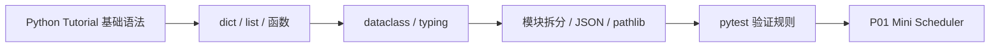

# M01 Python 工程能力资料索引

## 当前策略

M01 的资料不是为了“系统学完整个 Python”，而是服务一个明确目标：把 `task_sorter` 和 P01 Mini Scheduler 做成结构清楚、可测试、可维护的小型 Python 工程。

因此资料使用遵循三条原则：

1. 先读能直接支撑 P01 的部分。
2. 官方文档只取当前需要的章节，不把标准库当百科背。
3. 每条资料都必须能转化为教材章节、实验步骤、项目代码或知识卡片。

当前阶段的主线是：

## 核心资料表

| 资料 | 链接 | 类型 | 适合阶段 | 当前用途 | 状态 |
|---|---|---|---|---|---|
| Python Tutorial | https://docs.python.org/3/tutorial/ | 官方教程 | 入门到项目前置 | 建立 Python 语言整体框架，重点取函数、数据结构、模块、异常、类 | 必读 |
| Python Tutorial - Data Structures | https://docs.python.org/3/tutorial/datastructures.html | 官方教程 | 入门 | 支撑 list、dict、排序输入数据和任务集合处理 | 必读 |
| Python Tutorial - Modules | https://docs.python.org/3/tutorial/modules.html | 官方教程 | 项目化 | 支撑从单文件脚本拆成 `models.py`、`strategies.py`、`metrics.py` | 必读 |
| Python Tutorial - Errors and Exceptions | https://docs.python.org/3/tutorial/errors.html | 官方教程 | 项目化 | 支撑任务字段校验、错误输入处理和 pytest 异常测试 | 必读 |
| Python dataclasses | https://docs.python.org/3/library/dataclasses.html | 标准库文档 | 项目化 | 支撑 `Task`、`Worker` 等核心数据模型 | 必读 |
| Python typing | https://docs.python.org/3/library/typing.html | 标准库文档 | 项目化 | 支撑函数签名、`list[Task]`、代码可读性和后续 FastAPI/Pydantic | 查阅 |
| Python json | https://docs.python.org/3/library/json.html | 标准库文档 | 项目化 | 支撑读取 `tasks.json`、保存实验结果、理解 API 数据结构 | 查阅 |
| Python pathlib | https://docs.python.org/3/library/pathlib.html | 标准库文档 | 项目化 | 支撑跨平台路径、项目内数据文件读取、减少路径错误 | 查阅 |
| Python argparse | https://docs.python.org/3/library/argparse.html | 标准库文档 | 项目扩展 | 支撑把脚本做成可传参数的命令行工具 | 选读 |
| pytest Getting Started | https://docs.pytest.org/en/stable/getting-started.html | 官方文档 | 入门 | 支撑最小测试文件、断言、运行 `python -m pytest` | 必读 |
| pytest Fixtures | https://docs.pytest.org/en/stable/how-to/fixtures.html | 官方文档 | 项目化 | 支撑复用任务样例、减少测试重复 | 选读 |
| pytest Good Integration Practices | https://docs.pytest.org/en/stable/explanation/goodpractices.html | 官方文档 | 项目化 | 支撑测试目录结构、导入方式、项目测试习惯 | 必读 |
| Pydantic Docs | https://docs.pydantic.dev/ | 项目文档 | M02 前置 | 后续 FastAPI 请求/响应模型和数据校验前置理解 | 暂缓 |

## 补充资料

- Python Logging HOWTO：https://docs.python.org/3/howto/logging.html
  - 用途：把 M01 里的调试、运行观察和实验记录接到工程日志习惯上。
  - 状态：查阅
  - 当前只看：Basic Logging Tutorial、log level、format。

- HTTPX QuickStart：https://www.python-httpx.org/quickstart/
  - 用途：如果 E01 或 P01 需要做最小 API 请求，就优先看这个入口。
  - 状态：选读
  - 当前只看：GET、POST、JSON、timeout、response.raise_for_status()。

## 资料和教材章节的对应关系

| 教材章节 | 主要资料 | 使用方式 |
|---|---|---|
| 第 1 章：Python 工程能力到底是什么 | Python Tutorial | 不逐章背诵，只理解 Python 作为脚本、模块和工程语言的定位 |
| 第 2 章：从业务需求到数据模型 | Data Structures、dataclasses、typing | 用 dict 快速表达任务，再用 dataclass 固化 Task / Worker |
| 第 3 章：函数：把规则变成可测试单元 | Python Tutorial 函数相关章节 | 把 FIFO、Priority、SJF 拆成独立函数 |
| 第 4 章：类型标注 | typing、dataclasses | 给函数参数、返回值和 dataclass 字段加最小类型提示 |
| 第 5 章：模块和项目结构 | Modules、pytest Good Integration Practices | 从单文件改成包结构和 tests 结构 |
| 第 6 章：异常处理 | Errors and Exceptions、pytest 异常断言 | 对缺字段、非法 duration、空输入建立清楚错误处理 |
| 第 7 章：文件、JSON 和 pathlib | json、pathlib | 读取任务文件、保存实验结果、处理项目相对路径 |
| 第 8 章：面向对象 | dataclasses、Python Tutorial Classes | 只学能表达 Task / Worker / Scheduler 的最小类用法 |
| 第 9 章：pytest | pytest Getting Started、Fixtures、Good Practices | 写排序规则测试、边界测试、错误输入测试 |
| 第 10 章：贯通案例 | 上述资料综合 | 把 `task_sorter` 推进到 P01 Mini Scheduler |

## 对应实验

- [[40_实验练习/E01_Python基础练习/E01-01 任务排序脚本]]
- [[40_实验练习/E01_Python基础练习/E01-02 Python 类实现 Task 和 Worker]]
- [[40_实验练习/E01_Python基础练习/E01-03 pytest 测试调度器]]

## 资料和实验的对应关系

| 实验 | 必读资料 | 查阅资料 | 转化目标 |
|---|---|---|---|
| E01-01 任务排序脚本 | Data Structures、Python Tutorial 函数相关内容 | typing | 写出 dict + 函数版排序脚本，理解 `sorted(..., key=...)` |
| E01-02 Python 类实现 Task 和 Worker | dataclasses、typing、Python Tutorial Classes | pathlib | 用 dataclass 建立 `Task`、`Worker`，把任务对象从 dict 升级为结构化对象 |
| E01-03 pytest 测试调度器 | pytest Getting Started、pytest Good Integration Practices | pytest Fixtures、Errors and Exceptions | 给 FIFO、Priority、SJF、空输入、错误输入写测试 |
| P01 阶段扩展 | Modules、json、pathlib、argparse | Pydantic | 拆分工程结构，支持 JSON 输入，准备后续 API 化 |

## 当前只读哪些部分

为了避免资料过载，M01 第一轮只读这些内容：

| 资料 | 第一轮阅读范围 |
|---|---|
| Python Tutorial | 数据结构、函数、模块、异常、类；其他章节先跳过 |
| Data Structures | list、dict、looping techniques、排序相关直觉 |
| Modules | 创建模块、包、导入路径；不深入包发布 |
| Errors and Exceptions | 常见异常、raise、try/except 基础；不深入异常组和高级链式异常 |
| dataclasses | `@dataclass`、字段、默认值；不深入 frozen、slots、post_init 高级用法 |
| typing | `list[T]`、基础类型、函数返回值；不深入 Protocol、TypeVar、overload |
| json | `load`、`dump`、`loads`、`dumps`、`indent`、`ensure_ascii` |
| pathlib | `Path`、`/` 拼路径、`open`、`exists`；不深入底层路径风格差异 |
| pytest | 测试发现、assert、raises、fixture 最小用法、测试目录结构 |
| argparse | 只在需要命令行参数时查 `ArgumentParser` 最小示例 |
| Pydantic | M01 不正式展开，只知道它后续用于数据校验和 API 模型 |

## 转化要求

M01 的资料阅读不能停在“看过”。每次阅读后至少产生一种输出：

| 资料内容 | 转化出口 |
|---|---|
| list / dict / sorted | E01-01 的排序函数和测试样例 |
| dataclass | E01-02 的 `Task`、`Worker` 数据模型 |
| typing | P01 代码中的函数签名和返回值标注 |
| Modules | P01 的 `scheduler/` 包结构 |
| Errors and Exceptions | `validate_task()` 和错误输入测试 |
| json / pathlib | `load_tasks()`、`save_results()` 或实验数据文件 |
| pytest | `tests/test_strategies.py`、`tests/test_metrics.py` |
| Good Practices | P01 README 中的运行测试说明 |

## 建议学习顺序

1. 先读 Python Tutorial 中的数据结构和函数部分，完成 E01-01。
2. 再读 dataclasses 和 typing 的最小用法，完成 E01-02。
3. 然后读 Modules 和 pytest Good Integration Practices，把代码拆成项目结构。
4. 接着读 pytest Getting Started，完成 E01-03。
5. 最后查 json、pathlib，把任务输入和实验结果从硬编码改成文件。
6. argparse 和 Pydantic 暂时放后面，只在 P01 或 M02 需要时启用。

## 不做

- 不先学爬虫、GUI、数据分析全家桶。
- 不追求复杂设计模式。
- 不提前引入大型框架。
- 不背完整标准库。
- 不在 M01 深入异步 Python、元编程、包发布、复杂泛型。
- 不把 Pydantic 当 M01 主线，它是 M02/FastAPI 的前置资料。
