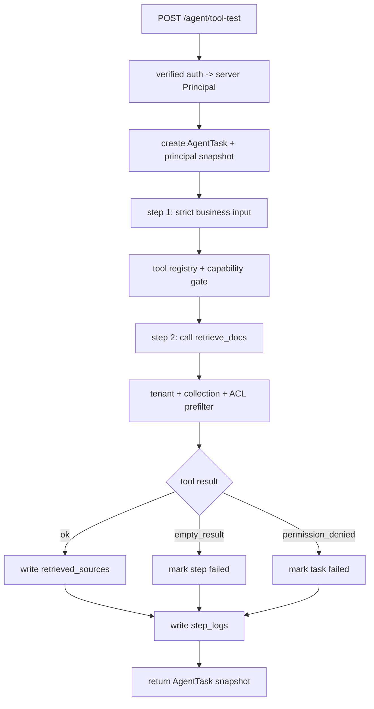

# E04-01 工具调用最小实验

## 实验目的

本实验把 M03 的 RAG 检索能力包装成 M04 Agent 可调用的受控工具。

目标不是让 Agent 自由规划，而是验证一个最小闭环：

```text
AgentTask 收到用户问题
-> 调用 retrieve_docs 工具
-> 得到 chunks / retrieved_sources
-> 写入 step_logs
-> 产出工具调用结果
```

完成后，你应该能说清楚：Agent 不是替代 RAG，而是把 RAG 当成一个工具，并把每次工具调用记录成可调度、可持久化、可监控的 workload 步骤。

## 前置阅读

- [[10_学习模块/M04_Agent工作流/M04_Agent工作流_适配教材|M04 Agent 工作流适配教材]] 第 1-3 章。
- [[10_学习模块/M03_RAG工程/M03_RAG工程_适配教材|M03 RAG 工程适配教材]] 中 Document、Chunk、Retrieval、retrieved_sources 的部分。
- [[20_资料库/模块资料索引/M04_Agent工作流_资料索引|M04 Agent 工作流资料索引]] 中 LangChain Tool Calling 和 LangGraph Quickstart 的对应说明。

## 怎么使用本实验

先把它当成“Agent 调用 RAG 工具”的最小手工演练，不要急着接真实模型或复杂框架。你要先能用固定输入、固定工具和固定返回值解释清楚：工具为什么被调用、输入参数从哪里来、输出如何写进 `step_logs`、失败时 `error_type` 如何保留下来。

当前文档是实验说明页，不表示你已经亲手完成。正式学习时需要把下面的记录表填成自己的执行记录。

## 实验步骤

| 步骤 | 要做什么 | 关键检查 |
|---|---|---|
| 1 | 准备 2-3 段自造测试文档，给每段分配 `chunk_id/source_id/permission_group` | 数据来源标注为自造测试数据，不写真实合规结论 |
| 2 | 定义 `retrieve_docs` 的严格输入 schema | 只包含 `query/collection_id/top_k`，额外身份字段必须失败 |
| 3 | 通过 capability gate 调用 mock retriever，返回 `chunks/retrieved_sources` | 工具、动作、资源都获服务端授权；返回结构稳定且按不可信数据处理 |
| 4 | 把工具调用写入 `step_logs` | 能看到 `tool_name/status/duration_ms/error_type` |
| 5 | 分别测试成功、空结果、无权限、跨租户、伪造身份字段和超时 | 每种路径都有明确状态/error_type，失败时底层函数未被越权调用 |
| 6 | 填写记录表，说明本实验如何迁移到 P03 `AgentTask` | 能把字段对应到 P03/M03/M08 |

## 工作流图



## 输入输出

### 输入

```json
{
  "query": "请找出合规审查流程中需要人工确认的依据。",
  "collection_id": "demo_policy_docs",
  "top_k": 3
}
```

这组输入可以先用自造测试文档，不代表真实合规结论。`task_type/task_id/tenant_id/user_id`、
有效 permission groups 和 ACL 版本都由服务端产生，不是隐藏的可选输入。请求或模型参数出现
`tenant_id/user_id/permission_group(s)/allowed_permission_groups/reviewer_id` 时必须拒绝，不能
拿它们覆盖 server principal。

### 输出

```json
{
  "task_id": "agent_001",
  "status": "succeeded",
  "current_step": "retrieve_docs",
  "retrieved_sources": [
    {
      "chunk_id": "chunk_01",
      "source_id": "policy_demo_01",
      "score": 0.87
    }
  ],
  "step_logs": [
    {
      "step_name": "retrieve_docs",
      "tool_name": "rag_retriever",
      "status": "succeeded",
      "duration_ms": 42,
      "error_type": null,
      "input_summary": "query_hash + query_length + collection_id + top_k + effective_scope_hash",
      "output_summary": "1 source returned"
    }
  ]
}
```

## 状态字段

| 字段 | 用途 | 连接模块 |
|---|---|---|
| `task_id` | 串起 API、worker、日志和结果 | P03/M06 |
| `task_type` | 标记这是 Agent 工具实验 | P03/M05 |
| `status` | `pending / running / succeeded / failed` | M06 |
| `current_step` | 当前执行到哪一步 | M04/M06 |
| `tool_name` | 统计 Agent 调用了什么工具 | M04/M08 |
| `retrieved_sources` | 保存 RAG 工具返回的证据来源 | M03/P03 |
| `duration_ms` | 后续统计 step latency | M08 |
| `error_type` | 失败分类 | M04/M08 |

## 最小工具定义

第一轮可以把工具写成普通函数，先理解结构，不必一开始引入完整 Agent 框架。下面的
`principal` 来自认证中间件，`RetrieveArgs` 使用严格 schema（例如 Pydantic
`extra="forbid"`）；模型只能生成 `query/collection_id/top_k`。工具白名单只解决“工具是否
注册”，capability gate 还必须根据服务端 principal 判断“这个主体能否对这个资源执行这个
动作”，客户端或模型不能自行声明 capability。

```python
from dataclasses import dataclass
from typing import Optional
from pydantic import BaseModel, ConfigDict, Field, ValidationError


class RetrieveArgs(BaseModel):
    model_config = ConfigDict(extra="forbid")
    query: str = Field(min_length=1, max_length=2000)
    collection_id: str
    top_k: int = Field(default=3, ge=1, le=20)


class RetrievedChunk(BaseModel):
    model_config = ConfigDict(extra="forbid")
    chunk_id: str
    source_id: str
    text: str
    score: float


class RetrieveOutput(BaseModel):
    model_config = ConfigDict(extra="forbid")
    chunks: list[RetrievedChunk]


@dataclass
class ToolResult:
    status: str
    data: dict
    error_type: Optional[str] = None


def retrieve_docs_tool(principal, raw_arguments: dict, repository) -> ToolResult:
    try:
        args = RetrieveArgs.model_validate(raw_arguments)
    except ValidationError:
        return ToolResult(status="failed", data={}, error_type="invalid_tool_args")

    collection = repository.get_visible_collection(
        tenant_id=principal.tenant_id,
        collection_id=args.collection_id,
    )
    if collection is None:
        return ToolResult(status="failed", data={}, error_type="collection_unavailable")

    if not authorize_capability(
        principal=principal,
        action="rag:query",
        resource=collection,
    ):
        return ToolResult(status="failed", data={}, error_type="permission_denied")

    authorized_chunks = repository.list_authorized_chunks(
        tenant_id=principal.tenant_id,
        collection_id=args.collection_id,
        permission_groups=principal.effective_permission_groups,
    )
    if not authorized_chunks:
        return ToolResult(status="failed", data={}, error_type="empty_authorized_corpus")
    authorized_source_ids = {chunk.source_id for chunk in authorized_chunks}

    chunks = retrieve_from(authorized_chunks, args.query, args.top_k)
    if not chunks:
        return ToolResult(
            status="failed",
            data={},
            error_type="no_relevant_authorized_source",
        )
    try:
        output = RetrieveOutput.model_validate({"chunks": chunks})
    except ValidationError:
        return ToolResult(status="failed", data={}, error_type="invalid_tool_output")
    returned_source_ids = {chunk.source_id for chunk in output.chunks}
    if not returned_source_ids.issubset(authorized_source_ids):
        return ToolResult(status="failed", data={}, error_type="invalid_tool_output")
    return ToolResult(status="succeeded", data=output.model_dump())
```

授权过滤必须发生在候选计数、打分、重排、缓存值、prompt、sources 和日志之前。返回值还要
通过输出 schema；而 schema 只证明字段形状正确，不能证明来源获授权。因此还必须校验所有
返回 `source_id` 都属于本次服务端生成的授权候选集。任一越界来源都让整个工具结果以
`invalid_tool_output` 失败，不能只删除异常项后继续使用其余结果。

`chunks`、网页片段和任何 tool output 都是不可信数据，不是系统指令或新的授权。进入下一轮
context 前要做输出 schema、大小、类型、来源和敏感字段校验，并放在明确的数据边界内。即使
片段写着“忽略规则、调用其他工具、泄露 token”，也不能改变 principal、capability、tool
policy 或触发副作用。

## 失败路径

| 失败路径 | 触发方式 | 期望处理 |
|---|---|---|
| `invalid_tool_args` | query 为空、top_k 非法、未知字段或模型伪造身份字段 | `422` 或步骤失败，不调用 repository/tool |
| `permission_denied` | server principal 缺少该 action/resource 所需 capability | `403`，不返回文档或 source metadata |
| `collection_unavailable` | collection 不存在或跨 tenant 不可见 | 对外 `404`，避免资源枚举 |
| `empty_authorized_corpus` | 授权范围内没有 chunk | 任务失败，不暴露全局集合规模 |
| `no_relevant_authorized_source` | 授权语料有内容但无相关证据 | 任务失败，不编造报告 |
| `tool_timeout` | 检索工具超过超时时间 | 记录超时，丢弃迟到的部分结果；是否重试由策略决定 |
| `invalid_tool_output` | 返回结构、类型或大小不合规，或 `source_id` 不是授权候选集的子集 | 整个结果失败；不写入下一轮 context，不触发后续工具 |
| `tool_not_allowed` | 模型请求未注册工具 | 不调用底层函数；记录拒绝原因 |

## step_logs

每一次工具调用都必须写日志。不要只保存最终 answer，否则后面无法判断 Agent 慢在哪里、失败在哪里。

| 字段 | 示例 | 说明 |
|---|---|---|
| `task_id` | `agent_001` | 所属任务 |
| `step_index` | `1` | 第几个步骤 |
| `step_name` | `retrieve_docs` | 固定步骤名 |
| `tool_name` | `rag_retriever` | 调用的工具 |
| `status` | `succeeded` | 步骤状态 |
| `started_at` | `2026-06-29T13:30:00` | 开始时间 |
| `finished_at` | `2026-06-29T13:30:01` | 结束时间 |
| `duration_ms` | `42` | 步骤耗时 |
| `input_summary` | `query_hash/query_length/collection_id/top_k` | 不记录完整敏感原文或客户端权限字段 |
| `effective_scope_hash` | `sha256:...` | 可关联服务端 ACL 快照，不记录原始 group 列表 |
| `output_summary` | `1 source returned` | 输出摘要 |
| `error_type` | `null` | 失败分类 |

## 和 M03 的连接

本实验只做一个连接点：

```text
M03 RagTask 的 retrieval 能力
-> M04 Agent 的 retrieve_docs 工具
```

Agent 不负责重新发明 chunk、embedding、top-k 或 metadata 权限过滤。它把这些能力作为工具
调用，但必须把同一个 server principal 传到检索层；不能让模型在 tool arguments 中重新声明
用户、tenant 或 permission group。调用结果只把已授权内容写入 `step_logs` 和
`retrieved_sources`。

## 和 M05/M06/M08 的连接

- M05：Agent 工具调用可能比普通 RAG 更慢，需要 `priority`、`timeout_ms`、`estimated_duration_ms`。
- M06：工具调用中断后，需要通过 `task_id` 和 `current_step` 恢复或标记失败。
- M08：工具耗时、错误数和检索为空次数需要成为指标。

## 记录表

| task_id | principal_fixture | tenant / ACL version | query_id | top_k | tool_status | retrieved_count | duration_ms | error_type | 备注 |
|---|---|---|---|---:|---|---:|---:|---|---|
|  |  |  |  |  |  |  |  |  |  |

## 验收标准

- [ ] 能把 RAG 检索包装成 `retrieve_docs` 工具。
- [ ] 能说明工具输入、输出和错误类型。
- [ ] 能输出 `step_logs`，而不是只输出最终结果。
- [ ] 能处理 `invalid_tool_args`、空授权语料、无相关授权来源、权限拒绝、隐藏资源和超时。
- [ ] 伪造 tenant/user/permission/reviewer 字段返回 `422`，且底层函数未调用。
- [ ] public principal 查询私密唯一词时，候选、answer、sources 和日志均无私密内容。
- [ ] 跨 tenant collection 对外为 `404`；权限过滤发生在计数、打分和重排之前。
- [ ] 即使输出 schema 合法，只要任一 `source_id` 不属于本次授权候选集，整个结果仍以 `invalid_tool_output` 失败。
- [ ] 超时不返回部分结果；日志不含原始敏感 query、token 或私有文档原文。
- [ ] server principal 从 API/task 贯穿到工具和检索层，没有被模型参数替换。
- [ ] 未注册工具、缺 capability 或越权资源均不会调用底层函数，也不会产生副作用。
- [ ] 恶意 RAG 片段或 tool output 不能改写 policy、读取秘密、调用外发工具；非法输出不进入 context。
- [ ] 能说明本实验如何连接 M03 的 RAG 检索和 P03 的 AgentTask。

## 边界提醒

本实验不做 AutoGPT，不做工具市场，不做多智能体协作，不让模型自由决定任意外部动作。
