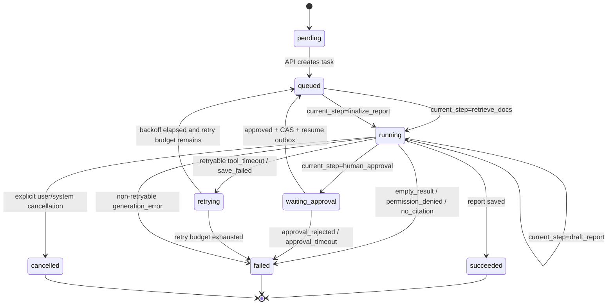

# E04-02 多步骤 Agent 状态流转实验

## 实验目的

本实验把 E04-01 的单次工具调用扩展成固定多步骤 Agent 工作流。

目标是训练你设计一个可恢复、可记录、可调度的 AgentTask：

```text
retrieve_docs
-> draft_report
-> human_approval
-> finalize_report
```

这里的重点不是让 Agent 自己规划下一步，而是让每一步的状态变化都清楚、可保存、可查询。

## 前置阅读

- [[10_学习模块/M04_Agent工作流/M04_Agent工作流_适配教材|M04 Agent 工作流适配教材]] 第 3-7 章。
- [[40_实验练习/E04_Agent实验/E04-01 工具调用最小实验|E04-01 工具调用最小实验]]。
- [[50_项目产出/P03_AI_Workload_Platform/P03_AI_Workload_Platform 项目主页|P03 AI Workload Platform]] 中 Agent v1 工作负载边界。

## 怎么使用本实验

这个实验不是让模型“自己想下一步”，而是训练你把一个 Agent 报告任务拆成固定状态机。阅读时要盯住三个问题：当前任务处于什么状态、下一步由什么事件触发、如果中断后靠哪些字段恢复。

当前文档是实验说明页，不表示你已经亲手跑完。正式学习时要用自己的样例输入填记录表，并写出至少一个中断恢复场景。

## 实验步骤

| 步骤 | 要做什么 | 关键检查 |
|---|---|---|
| 1 | 复用 E04-01 的 `retrieve_docs` 工具输出 | `retrieved_sources` 能进入后续步骤 |
| 2 | 定义 `AgentTask` 与 `AgentStep` 的最小字段 | `status/current_step/artifacts/step_logs` 不缺 |
| 3 | 按固定步骤执行 `retrieve_docs -> draft_report -> human_approval` | `waiting_approval` 只作为 task status，不当作步骤名 |
| 4 | 模拟任务在 `waiting_approval` 暂停 | worker 释放，任务状态可查询 |
| 5 | 模拟 approved 后重新入队并进入 `finalize_report` | 能说明为什么不是原 worker 一直等待 |
| 6 | 模拟 `empty_result/no_citation/generation_error` | 失败能写入 `error_type` 和 `step_logs` |
| 7 | 填写记录表并画出最终状态流 | 能从记录还原每一步发生了什么 |

## 工作流图



`retrieve_docs/draft_report/human_approval/finalize_report` 是 `current_step`，不是与 `running` 并列
的新任务状态。`status=waiting_approval` 时，`current_step=human_approval`；两列不能复用同一
套枚举。`cancelled` 只表示显式取消；审批拒绝和超时统一进入 `failed`，错误码分别固定为
`approval_rejected` 和 `approval_timeout`。

`retrying` 表示任务已释放 worker、正在等待退避或重试资格判断；退避结束且预算未耗尽后才变回
`queued`，再由 worker 重新领取为 `running`。因此可重试失败不能在同一个 worker 调用栈里直接
跳回业务步骤。

## 输入输出

### 输入

```json
{
  "query": "根据资料生成一份合规审查风险摘要。",
  "collection_id": "demo_policy_docs",
  "top_k": 3
}
```

`task_id/task_type/tenant_id/user_id/effective permission groups/priority/max_steps/timeout_ms` 由服务端
生成、从 principal 保存或按策略限制。请求 schema 禁止身份和授权字段，不能让调用者覆盖
恢复任务所用的 principal snapshot。

### 输出

```json
{
  "task_id": "agent_002",
  "task_type": "agent_report",
  "status": "waiting_approval",
  "current_step": "human_approval",
  "version": 3,
  "workflow_version": "agent-report-v1",
  "artifacts": {
    "retrieved_sources": ["policy_demo_01#chunk_01"],
    "draft_report_id": "draft_001",
    "draft_version": 1,
    "draft_sha256": "sha256:draft-demo",
    "action_sha256": "sha256:finalize-demo"
  },
  "approval_id": "approval_001",
  "approval_status": "pending",
  "expires_at": "2026-06-29T14:30:00Z",
  "step_logs": [
    {
      "step_index": 1,
      "step_name": "retrieve_docs",
      "status": "succeeded",
      "duration_ms": 55,
      "error_type": null
    },
    {
      "step_index": 2,
      "step_name": "draft_report",
      "status": "succeeded",
      "duration_ms": 410,
      "error_type": null
    },
    {
      "step_index": 3,
      "step_name": "human_approval",
      "status": "waiting",
      "duration_ms": null,
      "error_type": null
    }
  ]
}
```

## 状态字段

| 字段 | 用途 | P03/M06 中的落点 |
|---|---|---|
| `task_id` | 唯一任务 ID | `tasks.task_id` |
| `tenant_id / user_id` | server principal 的任务归属快照 | owner-scoped 查询；不能来自创建请求 |
| `task_type` | `agent_report` | 区分 RAG 和 Agent |
| `status` | 任务整体生命周期 | `pending / queued / running / waiting_approval / retrying / succeeded / failed / cancelled` |
| `current_step` | 业务步骤 | `retrieve_docs / draft_report / human_approval / finalize_report`，不能写成任务状态 |
| `max_steps` | 防止无限循环 | M05 超步数控制 |
| `timeout_ms` | 防止 worker 被长任务占满 | M05/M08 |
| `artifacts` | 中间产物 | `draft_report_id`、`retrieved_sources` |
| `approval_status / expires_at` | 人工确认状态与数据库时钟截止时间 | `pending / approved / rejected / timeout`；过期进入 failed |
| `version / workflow_version` | CAS 与恢复所用版本 | 拒绝旧 worker、旧页面和旧工作流恢复 |
| `approval_id` | 当前一次性审批记录 | 必须与 task 和 tenant 绑定 |
| `draft_version / draft_sha256 / action_sha256` | 不可变审批目标 | 防止审批后替换草稿或动作 |
| `step_logs` | 步骤执行历史 | 独立表或 `result_json` |

## 固定步骤定义

| step_index | step_name | 输入 | 输出 | 失败类型 |
|---:|---|---|---|---|
| 1 | `retrieve_docs` | query、collection_id、top_k + server principal | chunks、retrieved_sources | `empty_result / permission_denied / tool_timeout` |
| 2 | `draft_report` | query、chunks、retrieved_sources | draft_report | `generation_error / no_citation` |
| 3 | `human_approval` | immutable draft/action target | approval_status | `approval_timeout / approval_rejected` |
| 4 | `finalize_report` | approved draft | final_report | `generation_error / save_failed` |

## 失败路径

| 位置 | 失败情况 | 任务状态 | 是否重试 | 说明 |
|---|---|---|---|---|
| retrieve_docs | `tool_timeout` | `retrying` | 是 | 可以由 M06 retry_count 控制 |
| retrieve_docs | `permission_denied` | `failed` | 否 | 权限错误不应盲目重试 |
| retrieve_docs | `empty_result` | `failed` | 否 | 第一轮没有定义 waiting_input，不编造证据 |
| draft_report | `no_citation` | `failed` | 否 | 没有证据引用不能生成正式报告 |
| human_approval | `approval_timeout` | `failed` | 否 | 记录 `approval_timeout`，不产生 resume event |
| human_approval | `approval_rejected` | `failed` | 否 | 保留草稿和审计，不产生 resume event |
| finalize_report | `save_failed` | `retrying` | 是 | 存储故障可重试 |

## step_logs

本实验要求每个步骤都写 `step_logs`，并且能从日志还原执行过程。

| 字段 | 类型 | 示例 |
|---|---|---|
| `task_id` | string | `agent_002` |
| `step_index` | int | `2` |
| `step_name` | string | `draft_report` |
| `status` | string | `succeeded` |
| `tool_name` | string/null | `rag_retriever` |
| `started_at` | datetime | `2026-06-29T14:00:00` |
| `finished_at` | datetime/null | `2026-06-29T14:00:01` |
| `duration_ms` | int/null | `410` |
| `input_summary` | string | `query + 3 chunks` |
| `output_summary` | string | `draft_report_id=draft_001` |
| `error_type` | string/null | `null` |

## 和 M03 的连接

`retrieve_docs` 步骤复用 M03 的 RAG 检索链路：

```text
business input(query + collection_id + top_k)
+ server principal(tenant + effective ACL snapshot)
-> retrieve_docs with tenant/ACL prefilter
-> retrieved_sources
-> draft_report 必须引用 retrieved_sources
```

如果 `draft_report` 没有引用 `retrieved_sources`，本实验应记录 `no_citation`，不能直接进入最终报告。

## 和 M05/M06/M08 的连接

- M05：`priority`、`estimated_duration_ms`、`timeout_ms`、`max_steps` 决定 AgentTask 如何排队和防止长时间占用 worker。
- M06：`status/current_step/version/workflow_version/artifacts/step_logs` 需要持久化；恢复时还要核对
  当前 task version、draft/action hash，并对已成功步骤使用幂等键，不能重复产生副作用。
- M08：每个 step 的 `duration_ms`、`error_type`、`approval_wait_ms` 可以转成监控指标。

## 记录表

| task_id | status | current_step | step_count | approval_status | retry_count | total_duration_ms | error_type | 备注 |
|---|---|---|---:|---|---:|---:|---|---|
|  |  |  |  |  |  |  |  |  |

## 验收标准

- [ ] 能画出固定 Agent 状态流转图。
- [ ] 能输出 `AgentTask`、`AgentState`、`AgentStep` 的最小字段。
- [ ] 能解释 `waiting_approval` 为什么不是失败，而是等待人工输入。
- [ ] 能从 `step_logs` 还原每一步执行结果。
- [ ] 能说明任务中断后如何通过 `current_step` 和 `artifacts` 恢复。
- [ ] 恢复前校验 task/workflow version 与 artifact hash，重复投递不会重复生成产物或副作用。
- [ ] 客户端伪造 tenant/user/permission 字段返回 `422`，不能改变 principal snapshot。
- [ ] 旧 draft、重复 approve、跨租户 approve 和 artifact hash 不匹配均被拒绝。
- [ ] 审批拒绝/超时进入 `failed`；`cancelled` 只用于显式取消。
- [ ] 任一记录都能分别回答“任务生命周期是什么”和“当前业务步骤是什么”，没有 `retrieving/finalizing` 之类混合状态。
- [ ] 能说明 AgentTask 如何进入 M05 队列，并由 M06 保存状态。

## 边界提醒

本实验不让 Agent 自己决定无限下一步。所有步骤都是固定白名单，最多执行 `max_steps` 次。
