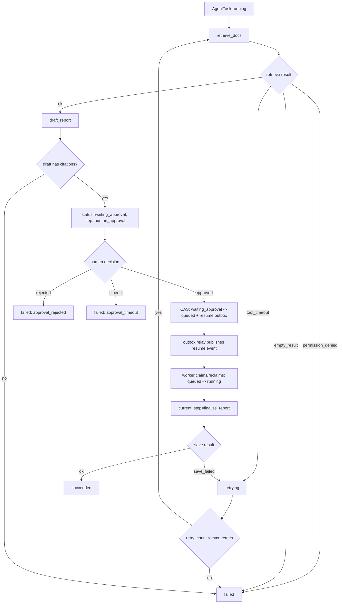

# E04-03 人工确认与失败处理实验

## 实验目的

本实验专门练习 Agent 工作流里最容易被忽略的部分：人工确认、失败分类、重试、取消和监控。

目标是把下面几类情况记录清楚：

```text
工具失败
-> 任务是否重试
-> 是否超过 max_retries
-> 是否需要人工确认
-> 人工确认通过/拒绝/超时
-> 最终如何写入 task status 和 step_logs
```

完成后，AgentTask 不再是一次性脚本，而是可以接入 M05 队列、M06 状态持久化和 M08 监控压测的可控 workload。

## 前置阅读

- [[10_学习模块/M04_Agent工作流/M04_Agent工作流_适配教材|M04 Agent 工作流适配教材]] 第 5-9 章。
- [[40_实验练习/E04_Agent实验/E04-02 多步骤 Agent 状态流转实验|E04-02 多步骤 Agent 状态流转实验]]。
- [[10_学习模块/M06_数据库缓存与异步任务/M06_数据库缓存与异步任务_适配教材|M06 数据库缓存与异步任务适配教材]] 中任务状态持久化部分。
- [[10_学习模块/M08_监控压测与可观测性/M08_监控压测与可观测性_适配教材|M08 监控压测与可观测性适配教材]] 中错误率、延迟和队列观察部分。

## 怎么使用本实验

这个实验专门训练“不要让 Agent 悄悄失败，也不要让它假装成功”。你要把每一种异常都落到状态、日志和指标里：哪些可以重试，哪些必须失败，哪些应该等待人工确认，哪些应该取消。

当前文档是实验说明页，不表示你已经亲手执行。正式学习时至少要填一条成功记录、一条可重试失败记录、一条不可重试失败记录和一条人工拒绝记录。

## 实验步骤

| 步骤 | 要做什么 | 关键检查 |
|---|---|---|
| 1 | 复用 E04-02 的固定工作流 | 步骤为 `retrieve_docs/draft_report/human_approval/finalize_report` |
| 2 | 定义失败分类表 | 至少覆盖 `tool_timeout/empty_result/permission_denied/no_citation/save_failed/approval_timeout` |
| 3 | 模拟一次可重试失败 | `retry_count` 增加，未超过 `max_retries` 时重新进入队列 |
| 4 | 模拟一次不可重试失败 | `permission_denied/no_citation` 不盲目重试 |
| 5 | 模拟人工通过、拒绝、超时三种确认结果 | `approval_status` 和 task status 一致 |
| 6 | 记录 M08 需要的指标字段 | 至少有 `approval_wait_ms/tool_error_count/retry_count/agent_total_latency_ms` |
| 7 | 填写记录表并解释每条记录是否符合预期 | 不能只写最终状态，要能复盘路径 |

## 工作流图



## 输入输出

### 输入

```json
{
  "query": "生成一份带引用的合规风险摘要。",
  "collection_id": "demo_policy_docs",
  "top_k": 3
}
```

`task_id/task_type` 由服务端生成；`tenant_id/user_id/effective permission groups` 来自 server
principal；`priority/timeout_ms/max_steps/max_retries` 由服务端策略限制；是否需要审批由
workflow/policy 决定。创建请求出现这些身份、授权或策略覆盖字段应返回 `422`。

### 输出：人工通过

```json
{
  "task_id": "agent_003",
  "status": "succeeded",
  "approval_status": "approved",
  "retry_count": 0,
  "result_json": {
    "report_id": "report_001",
    "citation_count": 2
  },
  "error_type": null
}
```

### 输出：人工拒绝

```json
{
  "task_id": "agent_003",
  "status": "failed",
  "approval_status": "rejected",
  "result_json": {
    "draft_report_id": "draft_001"
  },
  "error_type": "approval_rejected"
}
```

## 状态字段

| 字段 | 用途 |
|---|---|
| `status` | 任务整体状态：`pending / queued / running / waiting_approval / retrying / succeeded / failed / cancelled` |
| `approval_status` | 人工确认状态：`not_required / pending / approved / rejected / timeout` |
| `retry_count` | 当前重试次数 |
| `max_retries` | 最大重试次数 |
| `timeout_ms` | 单次执行或步骤超时 |
| `error_type` | 失败分类 |
| `last_error` | 最近一次错误摘要 |
| `current_step` | 当前业务步骤：`retrieve_docs / draft_report / human_approval / finalize_report`；不得复用 task status |
| `step_logs` | 步骤日志 |
| `metrics` | `queue_wait_ms / step_duration_ms / approval_wait_ms / total_latency_ms` |

## 失败路径

| error_type | 发生位置 | 是否重试 | 最终状态 | 说明 |
|---|---|---|---|---|
| `tool_timeout` | retrieve_docs / finalize_report | 是 | `retrying` 或 `failed` | 超过 max_retries 后失败 |
| `permission_denied` | retrieve_docs | 否 | `failed` | 权限错误不能靠重试解决 |
| `empty_result` | retrieve_docs | 否 | `failed` | 第一轮记录失败，不编造证据 |
| `no_citation` | draft_report | 否 | `failed` | 报告必须有来源 |
| `approval_timeout` | human_approval | 否 | `failed` | 人工未处理；超时审计后终止，不生成恢复事件 |
| `approval_rejected` | human_approval | 否 | `failed` | 人工拒绝是业务终止，不自动重试 |
| `save_failed` | finalize_report | 是 | `retrying` 或 `failed` | 存储类错误可重试 |

## step_logs

失败和人工确认也要写入 `step_logs`，否则后续无法解释任务为什么没成功。

```json
{
  "task_id": "agent_003",
  "step_index": 3,
  "step_name": "human_approval",
  "status": "failed",
  "tool_name": null,
  "event_type": "approval_decision",
  "started_at": "2026-06-29T14:10:00",
  "finished_at": "2026-06-29T14:20:00",
  "duration_ms": 600000,
  "input_summary": "draft_report_id=draft_001",
  "output_summary": "approval_status=rejected",
  "error_type": "approval_rejected"
}
```

## 人工确认节点设计

第一轮只做最小人工确认，不做完整审批平台，但服务端身份、资源所有权、一次性审批目标、过期
时间、CAS 和审计不能省略。

### 最小确认输入

```json
{
  "decision": "approved",
  "expected_version": 3,
  "comment": "引用完整，可以生成最终报告。"
}
```

请求路径携带资源标识：

```text
POST /agent/tasks/{task_id}/approvals/{approval_id}/decision
```

approver 的 `tenant_id/user_id/scopes` 只来自已验证 principal。请求体出现 `reviewer_id`、
`approver_user_id`、tenant/user/permission/scope、draft/action hash 或 policy 字段一律 `422`，
不能静默采用。

审批记录必须绑定：

```text
tenant_id + task_id + approval_id + task_owner_user_id
+ workflow_version + draft_artifact_id + draft_version + draft_sha256
+ action_type + action_sha256 + policy_version + required_approver_scope
+ version + expires_at
```

决策事务先按 tenant/task/approval 加锁读取，校验 scope、数据库时间、task 状态、expected
version 和当前 draft/action hash，再用 CAS 同时更新 approval 与 task。两种 decision 都写不可变
审计事件；只有 approved 在同一事务写一个 resume outbox。rejected 和 timeout 不写 resume。
resume 事件至少携带 `tenant_id/task_id/approval_id/task_version/action_sha256`，并以
`approval_id` 作为幂等键；消费者恢复前再次核对当前任务版本和审批目标，不能只凭 task_id
直接执行 finalize。approved 事务只把任务置为 `queued` 并创建 outbox；relay 发布后，worker
仍须按队列租约和 fencing 规则领取或重新领取任务，把 `queued -> running` CAS 成功后，才能把
`current_step` 推进到 `finalize_report`。
如果决策请求观察到 `expires_at <= database_now()`，同一事务应把 approval 标为 `timeout`、把
task 置为 `failed(error_type=approval_timeout)` 并写审计；不能只返回冲突后把任务长期留在
`waiting_approval`。后台 reconciliation 使用同一 CAS 规则兜底。

### 确认结果

| decision | approval_status | task status | 后续动作 |
|---|---|---|---|
| `approved` | `approved` | `queued` | 写 resume outbox；relay 发布；worker 领取后 `queued -> running`，再继续 `finalize_report` |
| `rejected` | `rejected` | `failed` | `approval_rejected`；保留 draft 和审计，不重试/不入队 |
| 无响应超过时限 | `timeout` | `failed` | `approval_timeout`；过期后不能再批准 |

统一接口语义：缺少认证 `401`；缺 approver scope `403`；跨 tenant/owner 或不存在对外 `404`；
旧 version、重复决定、过期或 draft/action 已替换对决策请求返回 `409`；其中过期事务仍把 task
终态错误码统一写为 `approval_timeout`。非法或伪造字段为 `422`。

## 和 M03 的连接

人工确认前的 draft 必须来自 RAG 检索证据：

```text
retrieve_docs 返回 retrieved_sources
-> draft_report 必须引用 retrieved_sources
-> status=waiting_approval, current_step=human_approval，展示 draft + retrieved_sources
-> approved + CAS: waiting_approval -> queued，并写 resume outbox
-> relay 发布，worker 领取/重领: queued -> running
-> current_step=finalize_report 后执行并终态化
```

如果没有 `retrieved_sources`，任务应记录 `no_citation` 或 `empty_result`，不能为了完成实验而生成无依据结论。

## 和 M05/M06/M08 的连接

- M05：AgentTask 可能等待人工确认，不能一直占用 worker；应在 `waiting_approval` 时释放 worker，确认后重新入队。
- M06：`status`、`approval_status`、`retry_count`、`last_error` 和 `step_logs` 必须持久化。
- M08：需要记录 `approval_wait_ms`、`tool_error_count`、`retry_count`、
  `approval_rejected_count`、`approval_timeout_count`、显式 `cancelled_count` 和
  `agent_total_latency_ms`。

## 记录表

| task_id | error_type | retry_count | approval_status | final_status | approval_wait_ms | total_latency_ms | 是否符合预期 | 备注 |
|---|---|---:|---|---|---:|---:|---|---|
|  |  |  |  |  |  |  |  |  |

## 验收标准

- [ ] 能区分 `failed` 和 `cancelled`。
- [ ] 能说明哪些失败可以重试，哪些不能重试。
- [ ] 能设计人工确认输入和确认后状态变化。
- [ ] 能在 `waiting_approval` 时释放 worker，确认后重新入队。
- [ ] 能记录 `step_logs`、`error_type`、`approval_status`、`retry_count`。
- [ ] 能说明这些字段如何进入 M06 数据表和 M08 指标。
- [ ] 伪造 reviewer/tenant/user/permission/scope 字段返回 `422`；approver 来自 principal。
- [ ] 无 approver scope 为 `403`；跨 tenant/owner 为 `404`，且不泄露记录是否存在。
- [ ] 旧 version、重复点击、已过期或 draft/action 已变化为 `409`。
- [ ] 两个并发批准只有一个成功，且事务内只产生一个 resume outbox。
- [ ] resume 消费者核对 tenant/task/approval/version/action hash；篡改或过期事件不能进入 finalize。
- [ ] 拒绝和超时进入 `failed`，不重试、不入队；过期审批不能再批准。
- [ ] 审批失败不会改变 task/approval/outbox 的部分状态，事务必须整体回滚。

## 边界提醒

本实验不做完整审批平台，不做自动修复系统，不做多 Agent 互评，也不做强化学习式策略优化。人工确认只是 P03 planned Agent v1 的一个受控节点。
