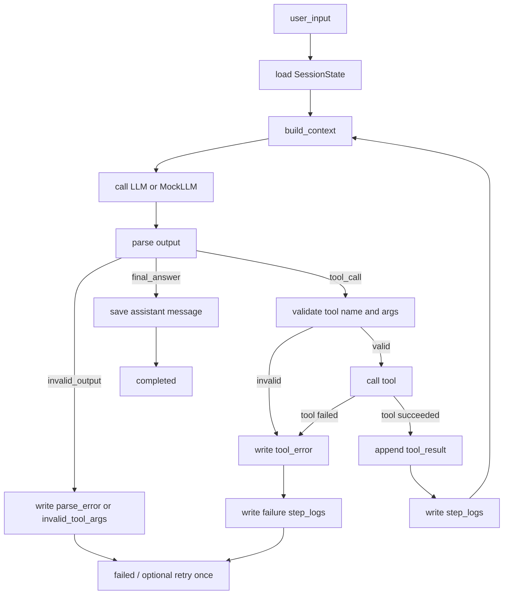

# E04-04 最小 Agent Runtime 实现实验

## 实验定位

本实验承接 M04 第 10 章“从零实现最小 Agent Runtime”。它不是要求你现在完成一个生产级 Agent 框架，而是把面试题里的核心工程要求拆成一个可练习的最小闭环。

目标是让你能说清并手写：

```text
用户输入
-> session 读取
-> context 构造
-> LLM 决策
-> 输出解析
-> 工具调用
-> 工具结果回填
-> step_logs 记录
-> final_answer 或 max_turns 结束
```

本实验完成后，才能继续进入 E04-05 的 session 隔离、E04-06 的 context/memory、E04-07 的异步工具和 busy state。

## 前置阅读

- [[10_学习模块/M04_Agent工作流/M04_Agent工作流_适配教材|M04 Agent 工作流适配教材]] 第 1-10 章，尤其第 10 章。
- [[40_实验练习/E04_Agent实验/E04-01 工具调用最小实验|E04-01 工具调用最小实验]]。
- [[40_实验练习/E04_Agent实验/E04-02 多步骤 Agent 状态流转实验|E04-02 多步骤 Agent 状态流转实验]]。
- [[40_实验练习/E04_Agent实验/E04-03 人工确认与失败处理实验|E04-03 人工确认与失败处理实验]]。
- [[20_资料库/模块资料索引/M04_Agent工作流_资料索引|M04 Agent 工作流资料索引]] 中 OpenAI Function Calling、OpenAI Agents SDK Running Agents、Anthropic Tool Use 的条目。

## 实验目标

- [ ] 定义一个最小 `ToolRegistry`。
- [ ] 至少注册三个工具：`calculator`、`mock_search`、`todo_add`。
- [ ] 定义 `SessionState`，让一次对话有可保存状态。
- [ ] 定义 `OutputParser`，区分 `final_answer`、`tool_call`、`invalid_output`。
- [ ] 实现一个有限轮次的 `AgentLoop`。
- [ ] 能用 mock LLM 测试 runtime 行为。
- [ ] 明确真实 LLM API 和 mock LLM 的边界。
- [ ] 记录 `step_logs`，而不是只看最终回答。

## 工作流图



## 最小项目结构

本实验可以先用一个小目录完成，不要求接入 P03 代码仓库：

```text
agent_runtime_lab/
├─ runtime.py
├─ tools.py
├─ models.py
├─ mock_llm.py
├─ tests/
│  ├─ test_runtime_loop.py
│  ├─ test_tool_registry.py
│  └─ test_session_state.py
└─ README.md
```

后续接 P03 时，再把这些概念迁移到 `app/agent_runtime.py`、`app/tools.py`、`app/models.py` 和 `tests/`。

## 实验步骤

按下面顺序推进，不要一开始就接真实 LLM API。先让 runtime 行为可测，再做真实模型 smoke test。

| 步骤 | 要做什么 | 主要文件 | 必过检查 |
|---|---|---|---|
| 1 | 创建 `agent_runtime_lab/` 目录和 `tests/` | 项目目录 | 能运行空测试或最小脚本 |
| 2 | 定义 `SessionState`、`ToolSpec`、`ParsedAction` | `models.py` | 数据结构字段和本实验字段表一致 |
| 3 | 实现三个工具和 `ToolRegistry` | `tools.py` | 能注册、查询、调用 `calculator/mock_search/todo_add` |
| 4 | 实现 `MockLLM.generate()` | `mock_llm.py` | 能固定返回 final_answer、tool_call 和非法输出样例 |
| 5 | 实现 `OutputParser` | `runtime.py` | 能产生三类解析结果，并返回明确 `error_type` |
| 6 | 实现 `AgentLoop` | `runtime.py` | 支持 `max_turns`、工具调用、最终答案、失败退出 |
| 7 | 写测试矩阵 | `tests/` | P0 测试全部通过 |
| 8 | 填写记录表和失败记录 | 本实验页或实验记录页 | 每个失败都有 `error_type` 和说明 |
| 9 | 可选：接真实 LLM 做 smoke test | `real_llm_client.py` 或手动脚本 | 不阻塞单元测试，不写成已完成项目 |

执行顺序的核心原则是：

```text
数据结构稳定
-> 工具可调用
-> 模型输出可模拟
-> 解析可验证
-> loop 可测试
-> 再考虑真实 LLM
```

## 核心数据结构

### SessionState

```python
from dataclasses import dataclass, field


@dataclass
class SessionState:
    session_id: str
    user_id: str
    messages: list[dict] = field(default_factory=list)
    tool_results: list[dict] = field(default_factory=list)
    runtime_status: str = "idle"
    current_turn: int = 0
    context_summary: str | None = None
```

第一版先把 state 放内存。等进入 M06/P03 时，再考虑数据库或缓存持久化。

### ToolSpec

```python
from dataclasses import dataclass


@dataclass
class ToolSpec:
    name: str
    description: str
    args_schema: dict
    returns: dict
    error_types: list[str]
```

工具定义必须包含 schema。否则 LLM 即使“想调用工具”，runtime 也无法判断参数是否合理。

### ParsedAction

```python
@dataclass
class ParsedAction:
    type: str  # final_answer / tool_call / invalid_output
    text: str | None = None
    tool_name: str | None = None
    arguments: dict | None = None
    error_type: str | None = None
```

不要记录完整不可展示推理过程。可以记录 `decision_reason` 或 `reason_summary`，但不要把 chain-of-thought 当作日志正文。

## 三个最小工具

| 工具 | 用途 | 成功返回 | 常见错误 |
|---|---|---|---|
| `calculator` | 计算简单表达式 | `{"value": 4}` | `invalid_expression` |
| `mock_search` | 模拟搜索或文档检索 | `{"results": [...]}` | `empty_result` |
| `todo_add` | 记录待办事项 | `{"todo_id": "todo_001"}` | `invalid_input` |

工具返回要结构化，不能只返回一段自然语言。这样后续 step_logs、测试和 P03 字段才能稳定。

### 工具 schema 示例

| 工具 | args_schema | 示例输入 | 示例输出 | 失败样例 |
|---|---|---|---|---|
| `calculator` | `{"expression": "string"}` | `{"expression": "2+2"}` | `{"value": 4}` | `{"expression": ""}` -> `invalid_expression` |
| `mock_search` | `{"query": "string", "top_k": "integer"}` | `{"query": "agent memory", "top_k": 3}` | `{"results": [{"title": "demo", "snippet": "..."}]}` | `{"query": "not_found", "top_k": 3}` -> `empty_result` |
| `todo_add` | `{"text": "string"}` | `{"text": "写周报"}` | `{"todo_id": "todo_001", "text": "写周报"}` | `{"text": ""}` -> `invalid_input` |

第一版 schema 可以先用字典表达，不必一开始引入复杂校验库。关键是：runtime 必须知道工具需要什么参数、返回什么结构、失败时怎么记录。

## LLM 边界：真实 API 与 MockLLM

面试题要求使用真实 LLM API，但学习阶段不能把所有测试都依赖真实 API。建议分两层：

| 层 | 用途 | 要求 |
|---|---|---|
| `MockLLM` | 跑单元测试，验证 runtime 行为 | 固定返回 final_answer / tool_call / 非法输出样例 |
| `RealLLMClient` | 验证真实模型工具调用能力 | 只在手动实验或少量集成测试使用 |

第一轮先用 `MockLLM` 保证 loop、parser、tools、session 都可测。真实 API 只用于证明“同样的 schema 能被模型使用”，不要让网络、额度、模型波动阻塞基础测试。

### 统一 LLM 接口

不管是真实模型还是 mock，都先统一成一个接口：

```python
class LLMClient:
    def generate(self, messages: list[dict], tool_schemas: list[dict]) -> str:
        raise NotImplementedError


class MockLLM(LLMClient):
    def __init__(self, outputs: list[str]):
        self.outputs = outputs

    def generate(self, messages: list[dict], tool_schemas: list[dict]) -> str:
        return self.outputs.pop(0)
```

真实 API 客户端也实现同一个 `generate()`。这样 runtime 不关心底层是 mock 还是真实模型，测试就不会被网络和模型波动绑架。

## 输出解析规则

第一版只把两类 LLM 输出当成合法动作：直接回答和工具调用。`invalid_output` 不是模型应该主动返回的格式，而是 parser 在发现错误时生成的内部结果。

```json
{"type": "final_answer", "text": "答案内容"}
```

```json
{"type": "tool_call", "tool_name": "calculator", "arguments": {"expression": "2+2"}}
```

解析时至少检查：

| 检查 | 失败时怎么处理 |
|---|---|
| JSON 是否可解析 | `parse_error` |
| `type` 是否属于允许值 | `invalid_action_type` |
| tool 是否存在 | `missing_tool` |
| 参数是否满足 schema | `invalid_tool_args` |
| 工具是否允许当前 session 使用 | `permission_denied` |

解析失败不要只写一句“模型格式错了”。实验记录里至少要区分四类情况：

| 原始输出问题 | Runtime 应该怎么处理 | 记录字段 |
|---|---|---|
| 不是 JSON，例如一整段自然语言 | 不调用工具，记录解析失败 | `error_type=parse_error` |
| JSON 有 `type`，但不是 `final_answer/tool_call` | 不继续执行，记录动作类型错误 | `error_type=invalid_action_type` |
| `tool_call` 缺少 `tool_name` 或 `arguments` | 不调用工具，记录参数结构错误 | `error_type=invalid_tool_args` |
| 工具名不在注册表里 | 不调用工具，记录工具不存在 | `error_type=missing_tool` |

这样做的意义是：以后接真实 LLM 时，失败不是“玄学坏了”，而是可以回放、分类、修 prompt 或修 schema。

## step_logs

每轮 loop 都要记录，不要只保存最终回答。

| 字段 | 示例 | 说明 |
|---|---|---|
| `session_id` | `s_001` | 对话窗口 |
| `turn_index` | `1` | 第几轮 runtime 决策 |
| `action_type` | `tool_call` | final_answer / tool_call / invalid_output |
| `tool_name` | `calculator` | 没有工具时为 null |
| `tool_args_summary` | `expression` | 不记录敏感完整输入 |
| `status` | `succeeded` | succeeded / failed |
| `error_type` | `null` | 失败分类 |
| `duration_ms` | `12` | 本轮耗时 |
| `decision_reason` | `需要计算表达式` | 可展示的简短理由，不是完整推理链 |

## 测试矩阵

测试不要只检查最终答案。每个测试都要检查状态、日志和错误类型。

| 测试用例 | 对应步骤 | 主要文件 | 输入 | 期望 | 级别 |
|---|---|---|---|---|---|
| 直接回复 | 4/5/6/7 | `test_runtime_loop.py` | MockLLM 返回 `final_answer` | 不调用工具，状态 `completed`，写入 assistant message | P0 |
| 工具调用 | 3/4/5/6/7 | `test_runtime_loop.py` | MockLLM 返回 calculator 调用 | 写入 tool_result 和 step_logs | P0 |
| 工具结果回填 | 3/4/5/6/7 | `test_runtime_loop.py` | 第一轮 tool_call，第二轮 final_answer | 第二轮 context 能看到 tool_result，并生成最终回答 | P0 |
| 工具不存在 | 3/6/7 | `test_tool_registry.py` | tool_name=`unknown_tool` | 记录 `missing_tool`，不崩溃 | P0 |
| 参数错误 | 3/5/7 | `test_tool_registry.py` | calculator 缺少 expression | 记录 `invalid_tool_args` | P0 |
| 解析失败 | 4/5/7 | `test_runtime_loop.py` | MockLLM 返回非 JSON | 记录 `parse_error` | P0 |
| 最大轮次 | 6/7 | `test_runtime_loop.py` | 一直返回 tool_call | 达到 `max_turns` 后停止，记录 `max_turns_exceeded` | P0 |
| session 隔离预检查 | 2/7 | `test_session_state.py` | 两个 session 各自写 todo | messages 和 tool_results 不互相污染 | P1 |
| 真实 LLM smoke test | 9 | 手动脚本或 README | 使用同一组 tool schema | 能返回 final_answer 或 tool_call；失败也要记录 | P2 |

P0 必须先通过，P1/P2 可以在 E04-05 或真实项目阶段继续完善。

## 代码级引导

下面是帮助你下手的伪代码，不是标准答案。正式学习时应自己手写并用测试保护行为。

### ToolRegistry.call

```python
class ToolRegistry:
    def __init__(self):
        self._tools = {}

    def register(self, spec, fn):
        self._tools[spec.name] = {"spec": spec, "fn": fn}

    def call(self, name: str, arguments: dict) -> dict:
        if name not in self._tools:
            return {"status": "failed", "error_type": "missing_tool"}

        item = self._tools[name]
        missing = [key for key in item["spec"].args_schema if key not in arguments]
        if missing:
            return {"status": "failed", "error_type": "invalid_tool_args"}

        try:
            return item["fn"](**arguments)
        except Exception:
            return {"status": "failed", "error_type": "tool_error"}
```

第一版只需要理解三个动作：找工具、校验参数、执行并返回结构化结果。不要把异常吞掉，也不要直接把 Python exception 当成用户可见回答。

这里的参数校验先只做“必填字段检查”。类型校验、取值范围、权限控制可以留到后续增强，但要在日志里保留 `error_type`，方便以后扩展。

### OutputParser.parse

```python
import json


class OutputParser:
    def parse(self, raw_output: str) -> ParsedAction:
        try:
            obj = json.loads(raw_output)
        except json.JSONDecodeError:
            return ParsedAction(type="invalid_output", error_type="parse_error")

        action_type = obj.get("type")
        if action_type == "final_answer":
            return ParsedAction(type="final_answer", text=obj.get("text", ""))

        if action_type == "tool_call":
            if not obj.get("tool_name") or "arguments" not in obj:
                return ParsedAction(type="invalid_output", error_type="invalid_tool_args")
            if not isinstance(obj.get("arguments"), dict):
                return ParsedAction(type="invalid_output", error_type="invalid_tool_args")

            return ParsedAction(
                type="tool_call",
                tool_name=obj.get("tool_name"),
                arguments=obj.get("arguments") or {},
            )

        return ParsedAction(type="invalid_output", error_type="invalid_action_type")
```

这里先不解析完整思考过程。可以记录 `decision_reason` 这种简短可展示理由，但不要把完整 chain-of-thought 写进日志或 README。

### AgentLoop.run

```python
class AgentLoop:
    def run(self, session_id: str, user_input: str) -> SessionState:
        state = self.session_store.load(session_id)
        state.messages.append({"role": "user", "content": user_input})
        state.runtime_status = "running"

        for turn in range(self.max_turns):
            raw = self.llm.generate(state.messages, self.tools.schemas())
            action = self.parser.parse(raw)

            if action.type == "final_answer":
                state.messages.append({"role": "assistant", "content": action.text})
                state.runtime_status = "completed"
                self.trace.write(state, turn, action, status="succeeded")
                return state

            if action.type == "tool_call":
                result = self.tools.call(action.tool_name, action.arguments)
                state.tool_results.append(result)

                if result.get("status") == "failed":
                    state.runtime_status = "failed"
                    self.trace.write(
                        state,
                        turn,
                        action,
                        result=result,
                        status="failed",
                        error_type=result.get("error_type"),
                    )
                    return state

                self.trace.write(state, turn, action, result=result, status="succeeded")
                state.messages.append({
                    "role": "tool",
                    "name": action.tool_name,
                    "content": result,
                })
                continue

            state.runtime_status = "failed"
            self.trace.write(state, turn, action, status="failed", error_type=action.error_type)
            return state

        state.runtime_status = "failed"
        self.trace.write(state, self.max_turns, None, status="failed", error_type="max_turns_exceeded")
        return state
```

工具结果必须回填进下一轮 context。否则 runtime 只是“调用了工具”，但模型看不到工具结果，无法基于结果继续回答。

这里的 `content` 是伪代码写法。真实 LLM API 通常需要把 tool result 序列化成 JSON 字符串，或通过 `build_context(state)` 转成模型可读的消息结构。

这个 loop 的目标是“可测、可复盘、不会无限跑”。后续 E04-05/E04-06/E04-07 再增强 session、context、memory 和异步事件。

## 记录表

| session_id | case_name | 对应步骤 | 测试文件 | action_type | tool_name | expected_runtime_status | expected_tool_status | actual_status | error_type | step_log_ok | 备注 |
|---|---|---|---|---|---|---|---|---|---|---|---|
|  | direct_answer | 4/5/6/7 | `test_runtime_loop.py` | final_answer |  | completed |  |  |  |  |  |
|  | calculator_call | 3/4/5/6/7 | `test_runtime_loop.py` | tool_call | calculator | completed | succeeded |  |  |  |  |
|  | tool_result_feedback | 3/4/5/6/7 | `test_runtime_loop.py` | tool_call -> final_answer | calculator | completed | succeeded |  |  |  |  |
|  | missing_tool | 3/6/7 | `test_tool_registry.py` | tool_call | unknown_tool | failed | failed |  | missing_tool |  |  |
|  | invalid_args | 3/5/7 | `test_tool_registry.py` | tool_call | calculator | failed | failed |  | invalid_tool_args |  |  |
|  | parse_error | 4/5/7 | `test_runtime_loop.py` | invalid_output |  | failed |  |  | parse_error |  |  |
|  | max_turns | 6/7 | `test_runtime_loop.py` | tool_call | calculator | failed |  |  | max_turns_exceeded |  |  |
|  | session_isolation | 2/7 | `test_session_state.py` | tool_call | todo_add | completed | succeeded |  |  |  |  |

## 和 P03 的连接

本实验暂时不要求改 P03，但字段要提前对齐：

| 实验字段 | P03 后续落点 |
|---|---|
| `session_id` | P03 post-v0.3.1 / vNext planned Agent Runtime |
| `runtime_status` | Agent task 状态扩展 |
| `tool_results` | `result_json.tool_calls` |
| `step_logs` | `result_json.step_logs` |
| `error_type` | task 失败分类 |
| `current_turn` / `max_turns` | 防止无限 loop |

P03 v0.3.1 仍然先维护 `rag_retrieval` task 闭环。本实验属于 post-v0.3.1 / vNext planned
候选基础，不抢当前主线，也不表示 P03 已实现 Agent Runtime。

## 常见错误与排查

这类实验最容易“看起来跑通了，实际没学到 runtime”。排查时优先看下面这些点：

| 现象 | 常见原因 | 应该怎么改 |
|---|---|---|
| 只看到最终回答，不知道中间发生了什么 | 没有 `step_logs`，工具调用结果也没保存 | 每一轮都记录 action、tool_name、status、error_type、duration_ms |
| 工具偶尔被调用错，但测试测不出来 | 只测 happy path，没有测 unknown tool / invalid args | 把失败路径列为 P0 测试 |
| session 串话 | 用 `user_id` 当会话状态 key | 状态 key 至少包含 `session_id`，后续再加 `user_id` 做归属 |
| 模型输出自然语言导致程序崩溃 | parser 假设 LLM 一定输出合法 JSON | parser 先兜底 `parse_error`，不要让异常穿透 runtime |
| 工具返回一段自然语言，后续无法统计 | 工具没有结构化返回格式 | 工具返回 `status/result/error_type/metadata` |
| 单元测试依赖真实 LLM，结果不稳定 | 没有 MockLLM 边界 | P0 测试只用 MockLLM，真实 API 只做 smoke test |
| 日志记录完整思考链 | 把不可展示推理过程当 trace | 只记录 `decision_reason` 或简短可展示摘要 |

你正式学习时，可以把这个表当作调试顺序：先保证可解析，再保证可调用，再保证可记录，最后再看回答质量。

## 面试提交物预留

本实验页不是让你现在提交面试作业，而是提前告诉你：如果以后要把它发展成作品，应该补齐哪些交付物。以下内容只有在你亲手实现、测试和录屏后，才能写进个人成果。

| 提交物 | 应包含什么 | 当前状态 |
|---|---|---|
| README | 运行方式、目录结构、核心设计、memory/context 放置规则、测试命令 | 预留模板，未代表已完成 |
| 测试结果 | P0 测试命令、通过截图或终端输出、失败用例说明 | 需要亲手执行后填写 |
| 操作录屏 | 一次直接回答、一次工具调用、一次失败处理或 session 隔离 | 需要亲手录制 |
| Prompt 与问题解决记录 | 工具 schema 如何提示模型、遇到的 parse/tool/session 问题如何修 | 需要边做边记录 |
| 架构说明 | agent loop、ToolRegistry、OutputParser、SessionState、Trace 的关系图 | 可由本实验图扩展 |

完成前不要写进简历项目成果。最多只能表达为“正在学习/计划复现的 Agent Runtime 实验”。

README 最小骨架可以先按下面写：

```text
# Minimal Agent Runtime Lab

## Run
pytest tests/

## What it implements
- AgentLoop
- ToolRegistry
- OutputParser
- SessionState
- step_logs

## What it does not implement
- multi-agent collaboration
- production memory system
- async tools
- full framework compatibility

## Memory / context policy
- short session messages stay in context
- tool results are summarized before reuse
- context_summary is updated only when messages exceed the limit
- full chain-of-thought is not stored
```

## 验收标准

- [ ] 能解释最小 Agent Runtime 的 6 个部件。
- [ ] 能注册至少三个工具，并说明每个工具的 schema、返回和错误类型。
- [ ] 能用 MockLLM 测试直接回答、工具调用和解析失败。
- [ ] 能说明真实 LLM API 在本实验中的位置。
- [ ] 能记录每轮 `step_logs`。
- [ ] 能解释工具结果如何进入下一轮 context。
- [ ] 能解释为什么不记录完整 chain-of-thought。
- [ ] 能说明本实验如何连接 E04-05/E04-06/E04-07 和 P03 Runtime 字段。

## 边界提醒

本实验不做完整 Agent 框架、不做多 Agent、不做 AutoGPT、不做 OpenHands 源码复现、不做生产级 memory 系统。目标只是把面试题的核心 runtime 能力变成可学习、可测试、可复盘的最小实验。
