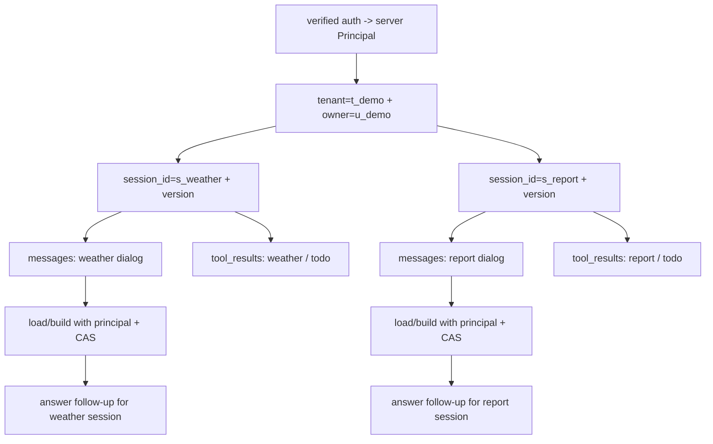

# E04-05 Session 隔离与多轮追问实验

## 实验定位

本实验承接 E04-04 的最小 Agent Runtime。E04-04 解决“一个 loop 怎么跑”；E04-05 解决“同一个用户开多个窗口时，状态怎么不串、追问怎么接得住”。

面试题里的例子是：

```text
用户 A 窗口 1：查天气，记一个待办
用户 A 窗口 2：写周报，记另一个待办
```

这两个窗口属于同一个服务端 principal（同一 `tenant_id + owner_user_id`），但必须是两个独立
`session_id`。窗口 1 的天气结果不能跑到窗口 2 的周报里，窗口 2 的待办也不能污染窗口 1；
其他 tenant 或 owner 即使猜到 session ID 也不能判断记录是否存在。

本实验只练 session 隔离和短上下文追问。context 压缩、长期 memory 召回放到 E04-06；异步工具和 busy state 放到 E04-07。

## 前置阅读

- [[10_学习模块/M04_Agent工作流/M04_Agent工作流_适配教材|M04 Agent 工作流适配教材]] 第 10.6 节。
- [[40_实验练习/E04_Agent实验/E04-04 最小 Agent Runtime 实现|E04-04 最小 Agent Runtime 实现]]。
- [[20_资料库/模块资料索引/M04_Agent工作流_资料索引|M04 Agent 工作流资料索引]] 中 OpenAI Agents SDK Sessions、LangGraph Persistence 的条目。

## 实验目标

- [ ] 能区分 server principal、`session_id`、`task_id`，并拒绝客户端身份字段。
- [ ] 同一个 `tenant_id + owner_user_id` 下创建两个独立 session。
- [ ] 每个 session 保存自己的 `messages`、`tool_results`、`session_variables`。
- [ ] 支持纯对话追问，例如“刚才那个再说详细一点”。
- [ ] 支持带工具结果的追问，例如“把刚才查到的内容记到待办里”。
- [ ] 能证明窗口 1 和窗口 2 的状态互不污染。
- [ ] 能用 `version`/CAS 防止两次并发追问互相覆盖。
- [ ] 能记录 session 级别的 step_logs 和测试结果。

## 工作流图



核心判断很简单：`load_for_principal(principal, s_weather)` 和随后构造的 context 只能读取该
principal 的天气窗口；周报窗口同理。API 不能先按裸 `session_id` 读取，再在应用层检查 owner，
否则会产生枚举、竞态和误写窗口。

## 核心字段

| 字段 | 作用 | 常见错误 |
|---|---|---|
| `tenant_id / owner_user_id` | 服务端 principal 的会话归属快照 | 从请求 JSON 读取，导致伪造身份或跨租户访问 |
| `session_id` | 表示一个独立对话窗口 | 不保存或每轮都新建，导致无法追问 |
| `task_id` | 表示某次后台任务 | 和 session 混用，导致任务结果难回填 |
| `version` | session 的单调版本，用于 CAS | 无条件覆盖，导致并发追问或异步回填丢失 |
| `messages` | 保存当前 session 的对话历史 | 全局共用 messages |
| `tool_results` | 保存当前 session 的工具观察结果 | 不绑定 session，工具结果污染别的窗口 |
| `session_variables` | 保存当前窗口内的短期变量 | 把长期记忆和短期变量混在一起 |

第一版可以先用内存字典，但 key 和状态都要保留完整所有权：

```python
sessions = {
    ("t_demo", "u_demo", "s_weather"): SessionState(
        tenant_id="t_demo", owner_user_id="u_demo", session_id="s_weather", version=0
    ),
    ("t_demo", "u_demo", "s_report"): SessionState(
        tenant_id="t_demo", owner_user_id="u_demo", session_id="s_report", version=0
    ),
}
```

后续进入 M06/P03 时，再把 session state 持久化到数据库或缓存。

`tool_results` 第一版至少保存这些字段：

| 字段 | 示例 | 为什么需要 |
|---|---|---|
| `tenant_id / owner_user_id / session_id` | `t_demo/u_demo/s_weather` | 把结果绑定到服务端会话所有权 |
| `tool_name` | `weather_lookup` | 说明结果来自哪个工具 |
| `result_summary` | `北京晴，28C` | 经输出 schema 校验、脱敏和限长后给下一轮 context 使用 |
| `result_ref / trust_level` | `tool-result-001/untrusted` | 原始结果受控保存；明确它是数据而不是指令 |
| `error_type` | `null` | 工具失败时分类 |

## 实验步骤

| 步骤 | 要做什么 | 主要文件 | 必过检查 |
|---|---|---|---|
| 1 | 基于 E04-04 增加 `SessionStore` | `session_store.py` | 所有公开方法接收 server principal，并按 owner 条件读写 |
| 2 | 创建同一 principal 的两个 session | `test_session_state.py` | tenant/owner 相同，`session_id` 不同；ID 由服务端生成 |
| 3 | 给窗口 1 写入天气对话和工具结果 | `test_session_state.py` | 只出现在 `s_weather` |
| 4 | 给窗口 2 写入周报对话和待办工具结果 | `test_session_state.py` | 只出现在 `s_report` |
| 5 | 实现 `build_context(principal, session_id)` | `runtime.py` | 只读取当前 owner/session 的 messages 和已校验 tool_results |
| 6 | 测试纯对话追问 | `test_followup.py` | 能引用当前 session 最近上下文 |
| 7 | 测试带工具的追问 | `test_followup.py` | 能使用当前 session 的 tool_result，不串到另一个窗口 |
| 8 | 填写隔离记录表 | 本实验页或记录页 | 每个 case 都能说明读取了哪些 session 字段 |
| 9 | 模拟两个请求携带同一 `expected_version` 保存 | `test_session_state.py` | 仅一个 CAS 成功，另一个返回 `409 session_version_conflict` |
| 10 | 注入伪造身份字段与恶意 tool output | `test_session_security.py` | `422` 或拒绝；不越权、不调用额外工具、不泄露秘密 |

执行顺序不要反过来。先证明 session store 不串，再测试追问；否则追问跑通也可能只是因为全局变量碰巧还在。

## 最小伪代码

### SessionStore

```python
from threading import Lock


class SessionStore:
    def __init__(self):
        self._sessions = {}
        self._lock = Lock()

    def create_for_principal(self, principal) -> SessionState:
        session_id = generate_unpredictable_session_id()
        state = SessionState(
            tenant_id=principal.tenant_id,
            owner_user_id=principal.user_id,
            session_id=session_id,
            version=0,
        )
        with self._lock:
            self._sessions[self._key(principal, session_id)] = copy.deepcopy(state)
        return copy.deepcopy(state)

    def load_for_principal(self, principal, session_id: str) -> SessionState:
        with self._lock:
            state = self._sessions.get(self._key(principal, session_id))
        if state is None:
            # 不向跨 tenant/owner 的调用者暴露记录是否存在。
            raise NotFound("session_not_found")
        return copy.deepcopy(state)

    def save_for_principal(
        self,
        principal,
        state: SessionState,
        expected_version: int,
    ) -> SessionState:
        key = self._key(principal, state.session_id)
        with self._lock:
            current = self._sessions.get(key)
            if current is None:
                raise NotFound("session_not_found")
            if current.version != expected_version:
                raise Conflict("session_version_conflict")
            if (state.tenant_id, state.owner_user_id) != key[:2]:
                raise InvalidInput("server_owned_identity_changed")

            saved = copy.deepcopy(state)
            saved.version = expected_version + 1
            self._sessions[key] = saved
        return copy.deepcopy(saved)

    @staticmethod
    def _key(principal, session_id: str) -> tuple[str, str, str]:
        return principal.tenant_id, principal.user_id, session_id
```

`principal` 只能由认证中间件产生。创建/追问请求只允许业务输入和 `session_id/expected_version`；
出现 `tenant_id/user_id/owner_user_id/permission_group/scopes` 等身份或授权字段一律 `422`，不能
用它们构造 principal。持久化版的 SQL `WHERE` 条件也必须同时包含 tenant、owner、session 和
expected version；上面的内存 CAS 不是“以后接数据库再补”的可选增强。

### build_context

```python
def build_context(state: SessionState) -> list[dict]:
    context = []
    context.extend(state.messages[-6:])

    for item in state.tool_results[-3:]:
        result = ToolResultForContext.model_validate(item)
        context.append({
            "role": "tool",
            "name": result.tool_name,
            "content": render_untrusted_data(result.result_summary),
        })

    return context
```

这里不是做复杂压缩，只是训练两个边界：context 只来自当前 owner/session；RAG 文本和 tool
output 进入 context 后仍是不可信数据。它们不能放进 system/developer 指令位置，也不能选择
principal、扩大 capability、关闭审批或触发额外工具。`render_untrusted_data` 只是明确数据边界，
真正的安全保证仍由模型外的 schema、capability gate 和副作用审批提供。

## 两类追问

### 纯对话追问

示例：

```text
s_weather 第 1 轮：北京今天适合跑步吗？
s_weather 第 2 轮：刚才那个再说具体一点。
```

第二轮的“刚才那个”依赖最近对话，不需要调用工具。测试重点是：`build_context(s_weather)` 能带上第一轮问题和回答。

### 带工具结果的追问

示例：

```text
s_weather 第 1 轮：查一下北京天气。
tool_result: {"city": "北京", "weather": "晴", "temperature": "28C"}
s_weather 第 2 轮：把这个结果记到待办里，提醒我晚上跑步前再看一次。
```

第二轮不仅依赖对话，还依赖当前 session 的 `tool_results`。测试重点是：todo 工具只能看到 `s_weather` 的天气结果，不能看到 `s_report` 的周报内容。

## 测试矩阵

| 测试用例 | 输入 | 期望 | 级别 |
|---|---|---|---|
| 创建两个 session | server principal=`t_demo/u_demo` | 服务端生成两个 ID，两个 state 独立存在 | P0 |
| 窗口 1 写入工具结果 | 给 `s_weather` 写 weather tool_result | `s_report` 查不到该结果 | P0 |
| 窗口 2 写入待办 | 给 `s_report` 写 todo tool_result | `s_weather` 查不到该待办 | P0 |
| 纯对话追问 | `s_weather` 问“刚才那个” | context 包含 `s_weather` 最近 messages | P0 |
| 带工具追问 | `s_weather` 要把天气结果记待办 | context 包含 `s_weather` weather tool_result | P0 |
| session 不存在 | `session_id=unknown` | 返回 `session_not_found`，不新建脏状态 | P0 |
| 跨 owner/tenant 读取 | 另一 server principal 读 `s_weather` | 对外统一 `404 session_not_found`，不泄露存在性 | P0 |
| 伪造身份字段 | 请求体提交 `tenant_id/user_id/permission_group` | `422`，principal 和 session 均不改变 | P0 |
| 并发 CAS | 两个更新都带同一 `expected_version` | 仅一个成功；另一个 `409 session_version_conflict` | P0 |
| 恶意工具结果 | output 要求泄露 token 或调用外发工具 | 仅作为不可信数据；无秘密、无新工具调用、无副作用 | P0 |
| 非法工具输出 | output schema/大小/来源不合格 | `invalid_tool_output`，不得进入 context | P0 |
| task_id 不替代 session_id | 同一 session 下创建两个 task | 两个 task 共享 session 上下文，但不能用 task_id 做会话 key | P1 |

P0 内存版也必须通过 tenant/owner 与 CAS 测试。持久化到 M06/P03 后，认证条件和
`expected_version` 必须下推到同一条数据库更新语句，不能先查后无条件保存。

## 记录表

| case_name | principal_fixture | session_id | expected_version | other_session_id | context_sources | leak_detected | expected | actual | error_type | 备注 |
|---|---|---|---:|---|---|---|---|---|---|---|
| two_sessions | t_demo/u_demo | s_weather | 0 | s_report | session_store | false | 两个 state 独立 |  |  |  |
| weather_not_in_report | t_demo/u_demo | s_report | 1 | s_weather | tool_results | false | 读不到 weather result |  |  |  |
| report_not_in_weather | t_demo/u_demo | s_weather | 1 | s_report | tool_results | false | 读不到 report todo |  |  |  |
| pure_followup | t_demo/u_demo | s_weather | 1 |  | messages | false | 能回答“刚才那个” |  |  |  |
| tool_followup | t_demo/u_demo | s_weather | 2 |  | messages + validated tool_results | false | 能用天气结果调用 todo |  |  |  |
| cross_owner | t_demo/u_other | s_weather | 0 |  | session_store | false | `404 session_not_found` |  |  |  |
| stale_save | t_demo/u_demo | s_weather | 1 |  | session_store | false | `409 session_version_conflict` |  |  |  |
| malicious_output | t_demo/u_demo | s_weather | 2 |  | untrusted tool result | false | 无秘密读取或副作用 |  |  |  |

记录时不要写“测试通过”四个字就结束。要写清楚本轮 context 读了哪些来源，尤其要说明没有读到哪个 `other_session_id`。

## 和 P03 的连接

本实验不要求改 P03 v0.3.1。它为 P03 post-v0.3.1 / vNext planned Agent Runtime 预留字段：

| E04-05 字段 | P03 后续落点 |
|---|---|
| `tenant_id / owner_user_id` | server principal 的请求归属快照和存储层所有权条件 |
| `session_id` | Agent 对话窗口 |
| `version` | session CAS；拒绝旧页面、并发追问和迟到的异步回填 |
| `task_id` | 某次 RAG/Agent 后台任务 |
| `messages` | session 内短上下文 |
| `tool_results` | `result_json.tool_calls` 或 runtime context |
| `context_sources` | 调试 context 是否串话 |
| `error_type=session_not_found` | 状态读取失败 |
| `error_type=session_version_conflict` | 旧版本或并发保存冲突 |
| 对外 `404 session_not_found` | 不存在、跨 tenant 或跨 owner 使用同一隐藏语义 |

P03 第一阶段仍然先做 RAG task 闭环。E04-05 只是给后续 AgentTask/session 功能打基础，不改变主线优先级。

## 常见错误

| 错误 | 后果 | 修正方式 |
|---|---|---|
| 用 owner 当 session key | 同一用户多个窗口互相污染 | 用不可预测 `session_id` 区分窗口，并保留 tenant/owner 归属 |
| 从请求体读取 tenant/owner | 调用者可以伪造会话归属 | 身份只取 server principal；额外身份字段 `422` |
| 每次请求都新建 session | 追问无法接住 | 请求必须携带或返回稳定 `session_id` |
| 每轮重新生成 `session_id` | 表面是同一窗口，实际每轮都失忆 | 前端或调用方必须复用同一个 `session_id` |
| context 从全局 messages 取 | 不同窗口内容混进回答 | `build_context()` 只接收当前 `SessionState` |
| tool_results 不绑定 session | 工具观察结果串话 | 工具结果结构里保存 `session_id` |
| 先读后无条件保存 | 并发追问、工具回填互相覆盖 | tenant/owner/session/version 一次 CAS 更新 |
| 把 tool output 当指令 | 间接 prompt injection 触发越权动作 | 作为不可信数据渲染，所有工具仍走 capability gate/审批 |
| 把 memory 召回塞进本实验 | 范围发散 | E04-05 只做短上下文，memory 放 E04-06 |
| 只测回答内容 | 看不出是否串话 | 同时检查 context_sources 和 other_session 是否为空 |

## 验收标准

- [ ] 能解释 server principal、`session_id`、`task_id` 的区别。
- [ ] 能创建两个同用户不同 session，并证明状态互不污染。
- [ ] 能写出 `SessionStore.create/load/save_for_principal` 的最小逻辑，并把 tenant/owner 条件下推到存储层。
- [ ] 客户端伪造身份字段为 `422`；跨 tenant/owner 为隐藏式 `404`。
- [ ] 两个相同 `expected_version` 的并发更新只有一个成功，旧版本得到 `409`。
- [ ] 能说明 `build_context()` 为什么只能读取当前 session。
- [ ] 能完成纯对话追问测试。
- [ ] 能完成带工具结果追问测试。
- [ ] 能记录 `context_sources`，说明本轮回答使用了哪些状态。
- [ ] 恶意/非法 RAG 或 tool output 不会改变 capability、调用新工具、读取秘密或进入受信指令区。
- [ ] 能说明本实验如何连接 E04-06 context/memory 和 P03 post-v0.3.1 / vNext planned Agent Runtime。

## 边界提醒

本实验不做长期 memory、不做 context 压缩算法、不做异步工具、不做完整 IAM/策略平台，也不做
完整聊天产品；但 server principal、tenant/owner 存储条件、严格请求 schema 和 CAS 是实验基线，
不能以“不做权限系统”为由省略。
