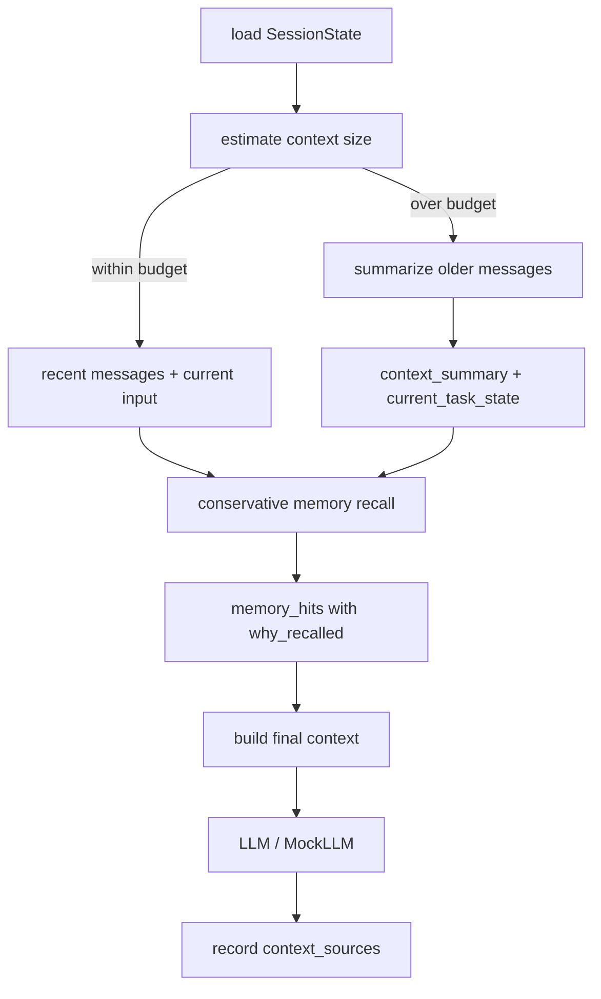

# E04-06 Context 压缩与 memory 召回实验

## 实验定位

本实验承接 E04-05。E04-05 解决“不同 session 不能串”；E04-06 解决“同一个 session 聊久了，context 放不下怎么办，以及什么时候可以召回少量历史 memory”。

本实验的目标不是做一个长期记忆系统，也不是向量数据库工程。第一版只训练三个能力：

```text
长对话变短：context_summary
当前任务不丢：current_task_state
历史记忆慎用：memory_hits + why_recalled
```

判断标准不是“记得越多越好”，而是：压缩后还能继续当前任务；召回时有理由、有来源、不污染回答。

## 前置阅读

- [[10_学习模块/M04_Agent工作流/M04_Agent工作流_适配教材|M04 Agent 工作流适配教材]] 第 10.6 节。
- [[40_实验练习/E04_Agent实验/E04-05 Session 隔离与多轮追问|E04-05 Session 隔离与多轮追问]]。
- [[20_资料库/模块资料索引/M04_Agent工作流_资料索引|M04 Agent 工作流资料索引]] 中 OpenAI Compaction、LangGraph Memory Overview 的条目。Memory 资料只读 short-term / long-term memory 的边界，不学习完整 memory 系统。

## 实验目标

- [ ] 能说明 context 压缩和 memory 召回的区别。
- [ ] 能为一个 session 设置简单 context budget。
- [ ] 能把较早对话压缩成 `context_summary`。
- [ ] 能保留当前任务状态，例如当前目标、未完成步骤、关键约束。
- [ ] 能用保守规则召回少量 memory。
- [ ] 每次 memory 召回都记录 `why_recalled`、`source_session_id`、`used_in_answer`。
- [ ] 能设计误召回测试，证明无关 memory 不会进入回答。

## 工作流图



压缩发生在当前 session 内。memory 召回可以跨 session，但必须先通过权限/范围检查，再非常克制地召回，并且要记录来源和理由。

## 核心概念

| 概念 | 解决什么问题 | 第一版怎么做 |
|---|---|---|
| `context_budget` | prompt 不能无限长 | 用字符数或消息条数近似，不必先算真实 token |
| `recent_messages` | 保留最近对话细节 | 保留最近 N 轮原文 |
| `context_summary` | 压缩较早历史 | 人工或 MockLLM 摘要，必须保留任务状态 |
| `current_task_state` | 防止长任务忘目标 | 保存目标、约束、下一步 |
| `memory_candidate` | 可被召回的历史片段 | 先用少量手写样例，不接向量库 |
| `memory_hit` | 本轮实际召回的记忆 | 必须有 `why_recalled` 和 `source` |

context 压缩是“当前 session 内变短”；memory 召回是“从过去的 session 或长期记录中拿少量相关信息”。这两个不能混。

## 最小数据结构

```python
class ContextState:
    session_id: str
    recent_messages: list[dict]
    context_summary: str | None
    current_task_state: dict
    memory_hits: list[dict]
    context_sources: list[str]
```

`current_task_state` 第一版至少包含：

| 字段 | 示例 | 作用 |
|---|---|---|
| `goal` | `完成 Agent Runtime 实验` | 防止模型忘记当前任务 |
| `constraints` | `不做长期 memory 系统` | 防止范围发散 |
| `open_questions` | `session 权限如何校验` | 保留未解决问题 |
| `next_step` | `测试 tool_result_feedback` | 指导下一轮继续 |

memory hit 第一版至少包含：

| 字段 | 示例 | 作用 |
|---|---|---|
| `memory_id` | `mem_001` | 可追踪 |
| `source_session_id` | `s_old_agent` | 来源 |
| `content_summary` | `用户之前希望先做可运行 demo` | 召回内容 |
| `why_recalled` | `当前问题明确提到之前的 Agent demo` | 召回理由 |
| `confidence` | `0.72` | 粗略置信度 |
| `used_in_answer` | `true/false` | 最终是否真的用上 |

## 实验步骤

| 步骤 | 要做什么 | 主要文件 | 必过检查 |
|---|---|---|---|
| 1 | 构造一个超过 budget 的 session 对话 | `test_context_compaction.py` | 至少 12 条 messages |
| 2 | 定义 `context_budget` | `context.py` | 先用消息条数或字符数近似 |
| 3 | 写 `compact_session()` | `context.py` | 旧消息变成 `context_summary` |
| 4 | 保留 `current_task_state` | `context.py` | goal/constraints/next_step 不丢 |
| 5 | 构造少量 memory candidates | `memory_store.py` | 3-5 条手写样例即可 |
| 6 | 写 `recall_memory()` | `memory_store.py` | 只在明确相关时召回 |
| 7 | 写误召回测试 | `test_memory_recall.py` | 无关 memory 不进入 context |
| 8 | 填写压缩与召回记录表 | 本实验页或记录页 | 每次召回都有理由和来源 |

第一版不要接向量数据库。可以先用关键词匹配或人工规则模拟召回，因为本实验训练的是边界和记录方式，不是检索系统性能。

## 最小伪代码

### compact_session

```python
def compact_session(messages: list[dict], budget: int) -> dict:
    if len(messages) <= budget:
        return {
            "recent_messages": messages,
            "context_summary": None,
            "compression_reason": "within_budget",
        }

    older = messages[:-budget]
    recent = messages[-budget:]
    summary = summarize_older_messages(older)

    return {
        "recent_messages": recent,
        "context_summary": summary,
        "compression_reason": "over_budget",
    }
```

`summarize_older_messages()` 第一版可以手写或用 MockLLM。关键不是摘要写得漂亮，而是不能丢掉当前任务目标、重要约束和未完成步骤。

压缩函数不要负责“猜”当前任务状态。`current_task_state` 应由 `session_state` 单独维护，再进入 `build_context()`；这样 summary 写坏时，任务目标和下一步还有独立字段可以校验。

### recall_memory

```python
def recall_memory(query: str, candidates: list[dict]) -> list[dict]:
    hits = []
    for item in candidates:
        if is_explicitly_related(query, item):
            hits.append({
                "memory_id": item["memory_id"],
                "source_session_id": item["source_session_id"],
                "content_summary": item["content_summary"],
                "why_recalled": "query explicitly matches memory topic",
                "confidence": 0.7,
                "used_in_answer": False,
            })
    return hits[:2]
```

第一版只召回 0-2 条。召回少一点通常比召回一堆更安全。`used_in_answer` 初始为 false，生成答案后再根据实际使用情况更新。

这里的 `confidence=0.7` 只是模拟置信度，不代表真实检索评分。正式接入检索系统前，不要把它包装成模型质量指标。

### build_context

```python
def build_context(current_input, session_state, memory_candidates):
    packed = compact_session(session_state.messages, budget=6)
    memory_hits = recall_memory(current_input, memory_candidates)
    context_sources = ["recent_messages", "task_state"]
    if packed["context_summary"]:
        context_sources.append("summary")
    if memory_hits:
        context_sources.append("memory_hits")

    return {
        "context_summary": packed["context_summary"],
        "recent_messages": packed["recent_messages"],
        "current_task_state": session_state.current_task_state,
        "memory_hits": memory_hits,
        "current_input": current_input,
        "context_sources": context_sources,
    }
```

如果没有召回 memory，`context_sources` 里不要硬写 `memory_hits`。记录要诚实，否则后面无法判断污染来源。

## 测试矩阵

| 测试用例 | 输入 | 期望 | 级别 |
|---|---|---|---|
| 未超 budget | 4 条 messages | 不生成 summary，只保留 recent_messages | P0 |
| 超过 budget | 12 条 messages | 生成 context_summary，保留最近 6 条 | P0 |
| 任务状态不丢 | 旧消息包含目标和约束 | `current_task_state.goal/constraints` 仍存在 | P0 |
| 显式相关召回 | 当前问题提到旧 Agent demo | 召回对应 memory，记录 `why_recalled` | P0 |
| 无关不召回 | 当前问题问 Docker，memory 是金融报告 | `memory_hits=[]` | P0 |
| 召回后未使用 | memory 被召回但答案没用 | `used_in_answer=false` | P1 |
| 跨 session 来源记录 | memory 来自旧 session | 记录 `source_session_id` | P1 |
| memory 权限边界 | memory 来自不可访问 session | 不召回，记录 `memory_scope_denied` 或 `permission_denied` | P0 |
| 错误摘要检查 | summary 丢失关键约束 | 记录 `summary_lost_constraint` | P1 |

P0 的核心是“不丢当前任务、不乱召回”。P1 再关注更细的质量记录。

## 记录表

| case_name | session_id | message_count | compression_reason | summary_ok | memory_query | memory_hits | source_session_id | why_recalled | used_in_answer | error_type | 备注 |
|---|---|---:|---|---|---|---|---|---|---|---|---|
| within_budget | s_agent | 4 | within_budget |  |  | 0 |  |  |  |  |  |
| over_budget | s_agent | 12 | over_budget |  |  | 0 |  |  |  |  |  |
| task_state_kept | s_agent | 12 | over_budget |  |  | 0 |  |  |  |  |  |
| explicit_memory | s_agent | 8 | over_budget |  | Agent demo | 1 | s_old_agent | 明确提到旧 demo |  |  |  |
| irrelevant_memory | s_agent | 8 | over_budget |  | Docker | 0 |  |  |  |  |  |
| memory_scope_denied | s_agent | 8 | over_budget |  | private old session | 0 | s_forbidden |  | false | memory_scope_denied |  |
| lost_constraint | s_agent | 12 | over_budget | false |  | 0 |  |  |  | summary_lost_constraint |  |

`summary_ok` 不是主观感觉。至少要检查：目标是否保留、关键约束是否保留、下一步是否保留。

## 和 P03 的连接

本实验不要求改 P03 v0.3.1。它为 P03 post-v0.3.1 / vNext planned Agent Runtime 提供字段设计：

| E04-06 字段 | P03 后续落点 |
|---|---|
| `context_budget` | 控制 prompt 长度和成本 |
| `context_summary` | session 压缩摘要 |
| `current_task_state` | 长程任务目标和下一步 |
| `memory_hits` | 召回历史片段 |
| `why_recalled` | 解释召回理由 |
| `source_session_id` | 追踪 memory 来源 |
| `used_in_answer` | 判断 memory 是否真的影响输出 |
| `compression_reason` | 解释为什么压缩 |
| `error_type=summary_lost_constraint` | 摘要质量问题 |

这些字段后续可以进入 P03 的 `result_json.runtime_context` 或 `step_logs`。第一阶段 P03 仍然先做 RAG task 闭环，不因为 E04-06 改主线。

## 常见错误

| 错误 | 后果 | 修正方式 |
|---|---|---|
| 把所有历史都塞进 prompt | 成本高、噪声大、容易超限 | recent messages + summary |
| 摘要只写闲聊，不保留任务状态 | 长程任务忘目标 | 单独维护 `current_task_state` |
| memory 召回越多越好 | 污染当前回答 | 第一版最多 0-2 条，且要有理由 |
| 没有记录来源 | 出错后无法追责 | 每条 memory hit 保存 `source_session_id` |
| 把 memory 当事实真相 | 可能使用过时或错误信息 | 答案里只在合适时使用，并记录 `used_in_answer` |
| 把 E04-06 写成向量数据库实验 | 范围发散 | 检索性能留给 M03/E03，E04-06 只练 context/memory 边界 |
| `context_summary` 编造旧对话没有的约束 | 后续任务按假约束执行 | 记录 `summary_fabricated_fact`，回看原始 messages |

## 验收标准

- [ ] 能解释 context 压缩和 memory 召回的区别。
- [ ] 能设置一个简单 context budget。
- [ ] 能把旧消息压缩成 `context_summary`。
- [ ] 能保留 `current_task_state`。
- [ ] 能在显式相关时召回少量 memory。
- [ ] 能在无关时不召回 memory。
- [ ] 每条 memory hit 都有来源、理由和是否使用。
- [ ] 能解释为什么 `used_in_answer=false` 也要记录。
- [ ] 能说明 E04-06 如何连接 E04-05 session 边界、E04-07 异步工具和 P03 post-v0.3.1 / vNext planned Agent Runtime。

## 边界提醒

本实验不做长期记忆系统、不做用户画像、不做向量数据库、不做自动总结平台、不做多 Agent 规划、不做异步工具和 busy state。目标只是把“上下文太长”和“历史要不要召回”变成可测试、可解释、可复盘的最小实验。
