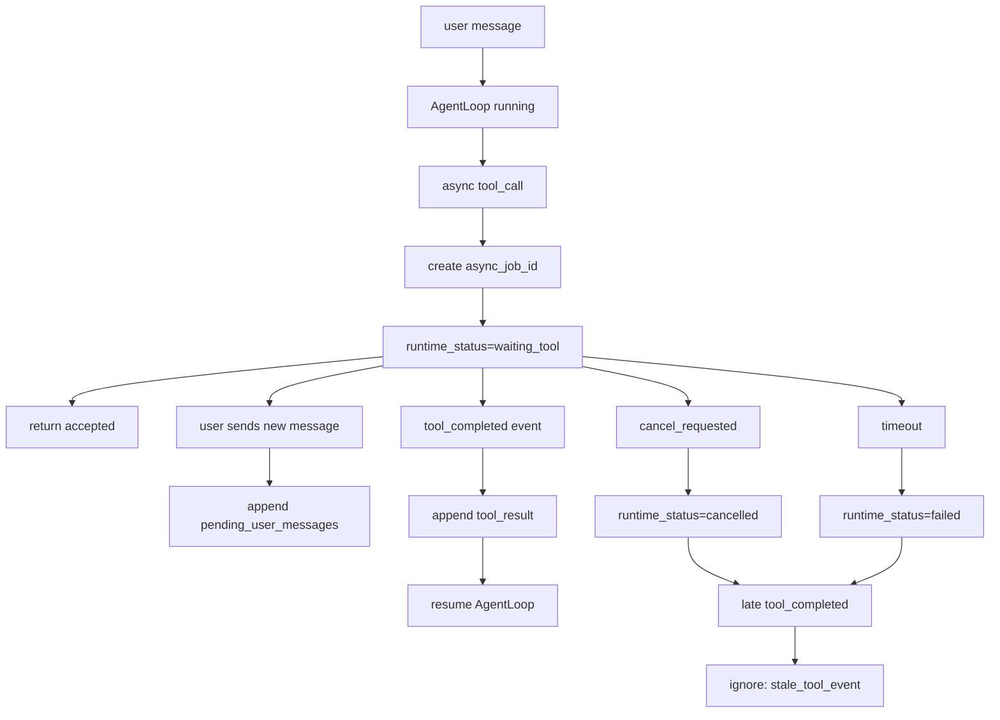

# E04-07 异步工具与 busy state 实验

## 实验定位

本实验承接 E04-04 到 E04-06。前面已经有最小 loop、session 隔离、context 压缩与 memory 边界；E04-07 只解决一个问题：当 Agent 调用了一个慢工具时，runtime 怎么处理工具完成事件、新用户消息、取消请求和超时。

本实验不做完整队列系统、不做生产级通知平台、不做分布式锁、不做 Celery/RQ 源码，也不替代 M05/M06。它只练 Agent Runtime 的状态流。

```text
用户请求
-> Agent 决定调用慢工具
-> runtime 进入 waiting_tool
-> 慢工具后台执行
-> 用户可能继续发消息 / 取消 / 工具完成 / 超时
-> runtime 按事件顺序恢复或结束
```

## 前置阅读

- [[10_学习模块/M04_Agent工作流/M04_Agent工作流_适配教材|M04 Agent 工作流适配教材]] 第 10.7 节。
- [[40_实验练习/E04_Agent实验/E04-04 最小 Agent Runtime 实现|E04-04 最小 Agent Runtime 实现]]。
- [[40_实验练习/E04_Agent实验/E04-05 Session 隔离与多轮追问|E04-05 Session 隔离与多轮追问]]。
- [[40_实验练习/E04_Agent实验/E04-06 Context 压缩与 memory 召回|E04-06 Context 压缩与 memory 召回]]。
- [[10_学习模块/M06_数据库缓存与异步任务/M06_数据库缓存与异步任务_适配教材|M06 数据库缓存与异步任务适配教材]] 中任务状态、失败重试和幂等性相关章节。

## 实验目标

- [ ] 能解释同步工具和异步工具的区别。
- [ ] 能设计 `runtime_status=idle/running/waiting_tool/completed/failed/cancelled`。
- [ ] 能在慢工具启动后立即返回“任务已开始”，而不是阻塞用户请求。
- [ ] 能处理 busy 状态下的新用户消息。
- [ ] 能处理工具完成事件并恢复 Agent loop。
- [ ] 能处理取消请求和工具超时。
- [ ] 能记录 `runtime_events`、`pending_user_messages`、`step_logs`。

## 工作流图



这里的关键不是“用什么队列”，而是状态和事件不能乱。慢工具还没回来时，runtime 不能假装已经完成；用户又发消息时，也不能随意插进正在等待工具的上下文。

## 核心状态与事件

| 字段 | 示例 | 用途 |
|---|---|---|
| `runtime_status` | `waiting_tool` | 当前 runtime 是否忙、等工具、已完成或失败 |
| `async_job_id` | `job_001` | 慢工具后台任务标识 |
| `waiting_tool` | `web_search` | 当前等待哪个工具 |
| `pending_user_messages` | `["顺便帮我总结"]` | busy 时到达的新消息 |
| `runtime_events` | `tool_completed/cancel_requested/timeout` | 按时间记录事件 |
| `timeout_ms` | `30000` | 防止无限等待 |
| `cancel_requested` | `true/false` | 用户是否要求取消 |
| `event_id` | `evt_001` | 防止重复处理事件 |
| `event_time` | `10:00:08` | 记录事件到达或写入时间 |
| `processed_event_ids` | `{"evt_003"}` | 防止重复处理完成事件 |

第一版只需要内存版事件表，不要求真的接消息队列：

```python
runtime_events = [
    {"event_id": "evt_001", "event_time": "10:00:01", "type": "tool_started", "session_id": "s_agent", "job_id": "job_001"},
    {"event_id": "evt_002", "event_time": "10:00:03", "type": "user_message_queued", "session_id": "s_agent", "text": "顺便总结一下"},
    {"event_id": "evt_003", "event_time": "10:00:08", "type": "tool_completed", "session_id": "s_agent", "job_id": "job_001"},
]
```

## 状态流转规则

| 当前状态 | 事件 | 下一状态 | 处理方式 |
|---|---|---|---|
| `idle` | 用户新消息 | `running` | 启动 Agent loop |
| `running` | 选择慢工具 | `waiting_tool` | 创建 `async_job_id`，返回 accepted |
| `waiting_tool` | 用户新消息 | `waiting_tool` | 进入 `pending_user_messages` |
| `waiting_tool` | 工具完成 | `running` | 回填 tool_result，恢复 loop |
| `waiting_tool` | 用户取消 | `cancelled` | 标记取消，停止恢复 loop |
| `waiting_tool` | 超时 | `failed` | 写 `tool_timeout` |
| `running` | final_answer | `completed` | 保存回答 |

第一版采用保守策略：busy 时新消息先排队，不打断当前工具。以后如果要支持打断、抢占或优先级，再交给 M05/M06/P03 项目阶段。

## 实验步骤

| 步骤 | 要做什么 | 主要文件 | 必过检查 |
|---|---|---|---|
| 1 | 定义 runtime 状态枚举 | `runtime_state.py` | 状态值和本实验一致 |
| 2 | 定义 `RuntimeEvent` | `runtime_state.py` | 有 `event_id/type/session_id/event_time` |
| 3 | 模拟一个慢工具 | `async_tools.py` | 返回 `async_job_id`，不立即给结果 |
| 4 | 实现 `start_async_tool()` | `runtime.py` | 状态变为 `waiting_tool` |
| 5 | 实现 busy 时的新消息处理 | `runtime.py` | 新消息进入 `pending_user_messages` |
| 6 | 实现 `handle_tool_completed()` | `runtime.py` | 工具结果回填并恢复 loop |
| 7 | 实现取消和超时处理 | `runtime.py` | 写 `cancelled/tool_timeout` |
| 8 | 填写事件记录表 | 本实验页或记录页 | 每个事件都有状态变化 |

## 最小伪代码

### start_async_tool

```python
def start_async_tool(state, tool_name, arguments):
    job_id = fake_async_runner.submit(tool_name, arguments)
    state.runtime_status = "waiting_tool"
    state.waiting_tool = tool_name
    state.async_job_id = job_id
    state.runtime_events.append({
        "event_id": new_event_id(),
        "event_time": now(),
        "type": "tool_started",
        "session_id": state.session_id,
        "job_id": job_id,
        "tool_name": tool_name,
    })
    return {"status": "accepted", "job_id": job_id}
```

这里的 `fake_async_runner` 可以只是一个测试桩。重点是 API 不再同步等待慢工具，而是留下 job_id 和事件记录。

### handle_user_message_when_busy

```python
def handle_user_message_when_busy(state, text):
    if state.runtime_status == "waiting_tool":
        state.pending_user_messages.append(text)
        state.runtime_events.append({
            "event_id": new_event_id(),
            "event_time": now(),
            "type": "user_message_queued",
            "session_id": state.session_id,
            "text_summary": text[:80],
        })
        return {"status": "queued"}

    return {"status": "ready_to_run"}
```

第一版不要让新消息直接打断正在等待的工具。这样更容易保证状态可解释。

### handle_tool_completed

```python
def handle_tool_completed(state, event):
    if event["session_id"] != state.session_id:
        return {"status": "ignored", "error_type": "session_id_mismatch"}

    if event["event_id"] in state.processed_event_ids:
        return {"status": "ignored", "error_type": "duplicate_event"}

    if state.runtime_status != "waiting_tool":
        return {"status": "ignored", "error_type": "stale_tool_event"}

    if event["job_id"] != state.async_job_id:
        return {"status": "ignored", "error_type": "job_id_mismatch"}

    state.processed_event_ids.add(event["event_id"])
    state.tool_results.append(event["tool_result"])
    state.runtime_status = "running"
    state.runtime_events.append({
        "event_id": event["event_id"],
        "event_time": event["event_time"],
        "type": "tool_completed",
        "session_id": event["session_id"],
        "job_id": event["job_id"],
    })
    return {"status": "resume_loop"}
```

这里加入 `processed_event_ids`，不是要做复杂幂等系统，而是让你知道异步事件可能重复到达，runtime 至少不能重复处理同一个完成事件。

### handle_cancel_requested

```python
def handle_cancel_requested(state):
    if state.runtime_status != "waiting_tool":
        return {"status": "ignored", "error_type": "not_waiting_tool"}

    state.cancel_requested = True
    state.runtime_status = "cancelled"
    state.runtime_events.append({
        "event_id": new_event_id(),
        "event_time": now(),
        "type": "cancel_requested",
        "session_id": state.session_id,
        "job_id": state.async_job_id,
    })
    return {"status": "cancelled"}
```

取消后如果工具迟到完成，`handle_tool_completed()` 必须返回 `stale_tool_event`，不能把状态改回 `running`。

### handle_timeout

```python
def handle_timeout(state):
    if state.runtime_status != "waiting_tool":
        return {"status": "ignored", "error_type": "not_waiting_tool"}

    state.runtime_status = "failed"
    state.runtime_events.append({
        "event_id": new_event_id(),
        "event_time": now(),
        "type": "timeout",
        "session_id": state.session_id,
        "job_id": state.async_job_id,
        "error_type": "tool_timeout",
    })
    return {"status": "failed", "error_type": "tool_timeout"}
```

超时后同样不能被迟到的工具完成事件恢复。

## 测试矩阵

| 测试用例 | 输入 | 期望 | 级别 |
|---|---|---|---|
| 慢工具启动 | Agent 调用 `slow_search` | 返回 `accepted/job_id`，状态 `waiting_tool` | P0 |
| busy 新消息 | waiting_tool 时用户发新消息 | 写入 `pending_user_messages` | P0 |
| 工具完成恢复 | `tool_completed(job_001)` | 回填 tool_result，状态回到 `running` | P0 |
| 用户取消 | waiting_tool 时 cancel | 状态 `cancelled`，不恢复 loop | P0 |
| 工具超时 | 超过 `timeout_ms` | 状态 `failed`，`error_type=tool_timeout` | P0 |
| cancel 后工具迟到 | cancelled 后收到 tool_completed | 忽略，记录 `stale_tool_event` | P0 |
| timeout 后工具迟到 | failed 后收到 tool_completed | 忽略，记录 `stale_tool_event` | P0 |
| job_id 不匹配 | 完成事件 job_id 错 | 忽略并记录 `job_id_mismatch` | P1 |
| session_id 不匹配 | 完成事件属于其他 session | 忽略并记录 `session_id_mismatch` | P1 |
| 重复完成事件 | 同一 event_id 到达两次 | 第二次忽略，记录 `duplicate_event` | P1 |
| pending 消息恢复 | 工具完成后还有 pending 消息 | 当前 loop 完成后，再把 pending 消息作为下一轮用户输入处理 | P1 |

P0 的核心是状态正确；P1 再练异步系统常见的重复事件和乱序事件。

## 记录表

| case_name | session_id | event_session_id | event_time | before_status | event_type | job_id | after_status | pending_count | handled | error_type | event_logged | 备注 |
|---|---|---|---|---|---|---|---|---:|---|---|---|---|
| start_slow_tool | s_agent | s_agent | 10:00:01 | running | tool_started | job_001 | waiting_tool | 0 | true |  |  |  |
| busy_user_message | s_agent | s_agent | 10:00:03 | waiting_tool | user_message_queued | job_001 | waiting_tool | 1 | true |  |  |  |
| tool_completed | s_agent | s_agent | 10:00:08 | waiting_tool | tool_completed | job_001 | running | 1 | true |  |  |  |
| cancel_waiting | s_agent | s_agent | 10:00:04 | waiting_tool | cancel_requested | job_001 | cancelled | 0 | true |  |  |  |
| tool_timeout | s_agent | s_agent | 10:00:31 | waiting_tool | timeout | job_001 | failed | 0 | true | tool_timeout |  |  |
| stale_after_cancel | s_agent | s_agent | 10:00:08 | cancelled | tool_completed | job_001 | cancelled | 0 | false | stale_tool_event |  |  |
| stale_after_timeout | s_agent | s_agent | 10:00:40 | failed | tool_completed | job_001 | failed | 0 | false | stale_tool_event |  |  |
| job_id_mismatch | s_agent | s_agent | 10:00:08 | waiting_tool | tool_completed | job_wrong | waiting_tool | 0 | false | job_id_mismatch |  |  |
| session_id_mismatch | s_agent | s_other | 10:00:08 | waiting_tool | tool_completed | job_001 | waiting_tool | 0 | false | session_id_mismatch |  |  |
| duplicate_event | s_agent | s_agent | 10:00:09 | running | tool_completed | job_001 | running | 0 | false | duplicate_event |  |  |

记录时要同时看状态和事件。只看最终回答，会完全看不出 runtime 是否正确处理了 busy 期间的新消息。

最小 `step_logs` 字段：

| 字段 | 用途 |
|---|---|
| `event_id` | 串起 runtime_events |
| `status_before` | 事件到达前状态 |
| `status_after` | 事件处理后状态 |
| `error_type` | 忽略、失败或超时原因 |
| `duration_ms` | 本次事件处理耗时 |

## 和 P03/M05/M06/M08 的连接

本实验不要求改 P03 v0.3.1。它提供的是 P03 post-v0.3.1 / vNext planned Agent Runtime 的事件字段：

| 字段 | 后续落点 |
|---|---|
| `runtime_status` | P03 planned AgentTask 状态 |
| `async_job_id` | M06 异步任务或 worker job |
| `runtime_events` | M08 事件日志和 trace |
| `pending_user_messages` | busy state 下的新消息队列 |
| `timeout_ms` | M05/M06 超时控制 |
| `error_type=tool_timeout` | M08 错误率和失败分类 |
| `processed_event_ids` | 后续幂等处理的最小意识 |

M05/M06 会真正处理队列、worker、重试和持久化；E04-07 只负责让 Agent Runtime 的事件和状态说得清。

## 常见错误

| 错误 | 后果 | 修正方式 |
|---|---|---|
| API 一直等慢工具返回 | 用户体验差，也容易超时 | 立即返回 accepted/job_id |
| busy 时直接插入新消息 | 当前工具结果和新意图混在一起 | 先放入 `pending_user_messages` |
| 工具完成后不校验 job_id | 错误工具结果回填到当前 session | 检查 `job_id` 和 `session_id` |
| 重复事件重复处理 | 同一个工具结果写两次 | 保存 `processed_event_ids` |
| 没有 timeout | runtime 永远 waiting | 设置 `timeout_ms` 并写 `tool_timeout` |
| 取消后迟到的工具完成事件又恢复 loop | 已取消任务被错误继续执行 | 非 `waiting_tool` 状态下的完成事件记录 `stale_tool_event` |
| 把本实验写成队列系统教程 | 范围发散 | 队列和持久化交给 M06/P03 |

## 验收标准

- [ ] 能解释同步工具和异步工具的区别。
- [ ] 能画出 `running -> waiting_tool -> running/completed/failed/cancelled` 状态流。
- [ ] 能让慢工具启动后返回 `accepted/job_id`。
- [ ] 能处理 busy 状态下的新用户消息。
- [ ] 能处理工具完成、取消、超时。
- [ ] 能记录 `runtime_events` 和 `step_logs`。
- [ ] 能说明 E04-07 如何连接 M05/M06/M08/P03。
- [ ] 能说明为什么本实验不做完整队列系统。

## 边界提醒

本实验不做完整任务队列、不做 Celery/RQ 源码、不做分布式锁、不做生产通知平台、不做复杂调度策略、不做 K8s job。目标只是把异步工具和 busy state 变成可测试、可解释、可复盘的 runtime 状态流。
