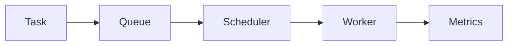

# E05-R0-R1 学习边界与最小模型复现

## 定位

这是 M05 第一轮复现的起点，对应：

- [[10_学习模块/M05_任务队列与调度/M05_任务队列与调度_复现推进表|M05 复现推进表]]：R0 学习边界、R1 最小模型
- [[10_学习模块/M05_任务队列与调度/教材章节/00_这门小教材怎么学|第 0 章：这门小教材怎么学]]
- [[10_学习模块/M05_任务队列与调度/教材章节/01_为什么调度不是简单排序|第 1 章：为什么调度不是简单排序]]
- [[10_学习模块/M05_任务队列与调度/教材章节/02_Task_Worker_Queue_最小模型|第 2 章：Task / Worker / Queue 最小模型]]

这份文档不是 P01 参考答案，也不是项目成果。它用来记录你第一轮亲手复现的理解和代码。

## 开始前阅读顺序

不要一次读完整个 M05。第一轮只按下面顺序读：

1. 读第 0 章，确认学习方式和材料边界。
2. 读第 1 章，理解调度不是简单排序。
3. 填写本文件的 R0 部分。
4. 读第 2 章，理解 Task / Worker / Queue。
5. 填写本文件的 R1 部分。
6. 最后再对照 P01 的 `models.py`。

如果还没有完成 R0，不建议直接写 R1。因为你需要先确认：P01 现在是参考答案，不是你已经完成的项目。

## 填写规则

- 先用自己的话写，再看参考答案。
- 每个空白处至少写 2-3 句，避免只写“理解了”。
- 不需要写得很漂亮，但要能解释给别人听。
- 代码可以很小，但必须是你亲手敲过、能说清字段含义的版本。
- 当前主学习环境固定为项目 Python 3.13 `.venv`，类型标注使用 `float | None`、`list[Task]` 等现代写法。
- 对照 P01 时只记录差异和原因，不把 P01 代码复制成自己的复现记录。
- 如果类型标注运行失败，先检查是否误用了系统 Python 3.8/3.9，而不是修改教材去兼容已废弃环境。
- 如果某一项不确定，就写在“我还不确定的问题”里，不要硬编结论。


## 本轮详细执行计划

本轮只做 R0/R1，不追求“把调度系统做完”。你要先把最小对象、最小链路、最小状态变化讲清楚。后面的 FIFO、Priority、SJF、指标、高峰负载、Cost-aware、Aging、多 worker，等这一步完成后再推进。

| 步骤 | 预计时间 | 先读内容 | 具体动作 | 产出 | 验收标准 |
|---:|---:|---|---|---|---|
| 1 | 15 分钟 | 第 0 章 0.1-0.5 | 只读学习方式、M05/P01 关系、当前阶段不做什么。读完后不要写代码，先确认边界。 | 在 R0 写出“我现在学什么”。 | 能说清 M05 是教材主线，P01 是参考答案/实验样板。 |
| 2 | 10 分钟 | 第 0 章 0.2-0.3 | 列出暂时不推进的内容，例如 FastAPI、Redis/Celery、数据库、真实 RAG、Kubernetes Scheduler 源码、GPU 调度。 | 在 R0 写出“我现在不做什么”。 | 至少写 5 项，并能说明为什么第一轮不做。 |
| 3 | 15 分钟 | 第 1 章 1.2-1.5 | 用自己的话解释“排序”和“调度”的区别。重点看系统状态：任务是否到达、worker 是否空闲、当前时间是多少。 | R0 中补充调度不是简单排序的说明。 | 能说出：排序只决定候选顺序，调度还要处理时间、资源和状态。 |
| 4 | 15 分钟 | 第 1 章 1.4 | 手画或改写 `Task -> Queue -> Scheduler -> Worker -> Metrics` 链路。不要追求图漂亮，先把每个节点作用说清楚。 | 最小调度链路图和节点解释。 | 能解释每个节点输入什么、输出什么。 |
| 5 | 20 分钟 | 第 2 章 2.3-2.7 | 逐个理解 Task、Worker、Queue。尤其区分 `submit_time`、`start_time`、`finish_time`、`available_at`。 | 字段理解草稿。 | 能说清 `available_at` 为什么属于 Worker，而不是 Task。 |
| 6 | 20 分钟 | 第 2 章 2.8 | 在 Python 3.13 项目 `.venv` 中新建 `m05_r1_task_worker.py`，亲手写 `Task` 和 `Worker`，使用 `float | None`、`str | None`。 | 一份可运行的最小模型代码。 | 激活 `.venv` 后能运行脚本，没有类型语法报错。 |
| 7 | 15 分钟 | 第 2 章 2.9 | 构造 4 个任务，故意让它们在 duration、priority、submit_time、token_count 上有差异。 | R1 的 4 行任务表。 | 任务之间确实有差异，不是 4 个几乎一样的样例。 |
| 8 | 20 分钟 | 第 2 章 2.10-2.12 | 手动选一个任务执行：计算 `start_time = max(worker.available_at, task.submit_time)`，再计算 `finish_time`，更新 worker 和 task 状态。 | 一段状态变化记录。 | 能解释每一步状态为什么这样变化。 |
| 9 | 15 分钟 | 第 2 章 2.13 | 最后才对照 P01 的 `models.py`。只看差异，不复制成自己的答案。 | “P01 比我的版本多了什么/为什么多/我还不懂什么”。 | 能把 P01 的额外字段归因到后续章节或工程扩展。 |
| 10 | 15 分钟 | 本文件“本轮复盘” | 写复盘：概念、代码、观察到的现象、能解释的结论、不确定的问题。 | 本轮复盘五段内容。 | 每段至少 2-3 句，不能只写“完成/理解”。 |

### 推荐执行节奏

如果一次只能学 60 分钟，建议按下面节奏拆：

- 第一次：完成步骤 1-4，只做边界和链路，不写代码。
- 第二次：完成步骤 5-8，亲手写 `Task` / `Worker` 并手动执行一个任务。
- 第三次：完成步骤 9-10，对照 P01 并复盘。

如果你当天状态很好，也可以一口气做完。但不要跳过 R0 直接复制 P01，因为这会让后面的 FIFO、Priority、SJF 都变成“看代码像懂了，换个场景又不会写”。

### 什么时候算本轮完成

本轮完成不是指“代码很多”，而是指你具备下面这些能力：

- 能解释 P01 当前只是参考答案、实验样板和后续对照材料。
- 能手写 Python 3.13 的 `Task` 和 `Worker`。
- 能解释 `submit_time`、`start_time`、`finish_time`、`available_at` 的关系。
- 能手动执行一个任务，并记录 task/worker 的状态变化。
- 能说出自己的版本和 P01 参考答案至少 3 个差异。
- 能把不理解的问题留下来，而不是编一个看似完整的结论。


### R0 作答质量标准

R0 不是写口号，而是确认你有没有摆正学习位置。合格答案应该满足下面要求：

| 作答项 | 合格写法 | 不合格写法 |
|---|---|---|
| 我现在学什么 | 能说出任务建模、调度链路、状态变化、实验指标这些关键词，并解释它们之间的关系。 | 只写“学习调度”“学习项目”“学习 AI Infra”。 |
| 我现在不做什么 | 至少列 5 项，并说明为什么第一轮暂时不做。 | 只列技术名词，没有原因。 |
| P01 和 M05 的关系 | 能说清 M05 是学习主线，P01 是复现后的参考答案和对照材料。 | 把 P01 当成已经完成的个人项目。 |
| 最小调度链路图 | 不只画箭头，还能解释 Task、Queue、Scheduler、Worker、Metrics 各自负责什么。 | 只复制 Mermaid 图，不解释节点。 |

你写完 R0 后，可以用一句话自检：

```text
我现在是在学习如何亲手复现调度内核，而不是把参考项目包装成成果。
```

如果这句话说不稳，先不要进入 R1。

### R1 运行边界和检查方法

R1 的重点不是写一个完整调度器，而是确认你真的理解最小模型。练习代码只需要做到下面这些：

- 定义 `Task`。
- 定义 `Worker`。
- 构造 4 个任务对象。
- 构造 1 个 worker。
- 手动选择 1 个任务执行。
- 打印或记录这个任务执行前后的状态变化。

第一轮不要求写：

- FIFO 排序函数。
- Priority 排序函数。
- SJF 排序函数。
- 多 worker 调度循环。
- P95/P99 指标计算。
- 文件读写、数据库、API 或可视化。

建议运行检查只看三件事：

```text
1. 代码能不能在项目 Python 3.13 `.venv` 下运行？
2. start_time 是否等于 max(worker.available_at, task.submit_time)？
3. 执行后 task.status 和 worker.available_at 是否发生了合理变化？
```

如果这三件事跑通，本轮 R1 就够了。不要在 R1 阶段继续往 FIFO 或完整项目扩展。

### 本轮之后只推进到哪里

完成 R0/R1 后，下一步才进入 R2：FIFO baseline。也就是说，下一次推进只应该做：

```text
第 3 章 -> E05-01 -> 手写 FIFO 排序和单 worker 调度循环
```

不要直接跳到 Cost-aware、Aging、多 worker 或 README。那些内容已经在教材里有位置，但不应该抢走第一轮复现的顺序。

## R0：学习边界确认
本节下面的提示只用来帮你启动思路，不是标准答案。真正填写时要换成自己的语言，最好带上你能理解的具体例子，比如 RAG 查询、Agent 工具调用、批量文档处理、推理请求排队等。

如果发现自己只是把提示句复制了一遍，就先停下来，重新用“我为什么要学这个、我现在能解释什么、我还不能做什么”来改写。


### 我现在学什么
回答时不要只写主题名，尽量围绕下面 4 个问题组织：

1. 任务进入系统后，为什么不能只按一个字段排序？
2. `Task`、`Queue`、`Scheduler`、`Worker`、`Metrics` 分别解决什么问题？
3. 我为什么要先学最小模型，再学 FIFO / Priority / SJF？
4. 这部分和 AI workload、RAG、Agent、推理服务有什么关系？

可以按这个句式起步，但要换成你自己的话：

```text
我现在不是在做完整平台，而是在学习任务调度的最小内核。我要先理解任务如何被表示，worker 如何表示资源状态，调度器如何从队列中选择任务，以及指标如何说明策略效果。
```


用自己的话写 3-5 句：

```text

```

### 我现在不做什么
建议每一项都写成“暂时不做 X，因为 Y”。重点不是否定这些技术，而是说明它们为什么不属于第一轮。

可考虑的暂缓项：

- FastAPI 服务化
- Redis / Celery / RQ 任务队列
- 数据库持久化
- Docker / Kubernetes 部署
- Kubernetes Scheduler 源码
- 真实 RAG / Agent 请求
- GPU 调度
- 论文级调度算法
- README / 简历包装

不要写成“这些都不重要”。更准确的表达是：这些都重要，但要等最小模型、策略和指标能亲手复现之后再做。


至少写出 5 个暂时不推进的内容，并说明原因：

```text

```

### P01 和 M05 的关系
回答这 4 个问题时，建议抓住一条主线：

```text
M05 负责教会我怎么做，P01 负责让我在复现后对照做得是否合理。
```

你可以分别说明：

- M05 是学习路线、教材讲义和复现顺序。
- P01 是参考实现、实验样板和后续成果表达模板。
- 不能直接把 P01 当成个人项目，是因为核心逻辑还没有亲手复现，实验结论还没有自己解释过。
- 只有当你能不看 P01 写出核心模型、策略和指标，并能解释实验结果时，才适合改写成 README 或简历表达。


回答下面问题：

1. M05 是什么？
2. P01 现在是什么？
3. 为什么不能直接把 P01 当成已经完成的个人项目？
4. 什么时候 P01 才适合转成 README 或简历表达？

```text

```

### 最小调度链路图

先自己画一版。可以用文字，也可以用 Mermaid。



在图下面解释每个节点的作用：

```text

```

## R1：Task / Worker 最小模型复现

### 先不要看 P01，自己写

先在自己的练习文件里手写最小版本，不要复制 P01。

建议把练习代码单独放在你的个人练习区，文件名可以用：

```text
m05_r1_task_worker.py
```

这个文件不是 P01 正式代码。它只是为了训练你亲手写模型、解释字段、跑最小样例。

建议先写：

```python
from dataclasses import dataclass
@dataclass
class Task:
    id: str
    task_type: str
    priority: int
    estimated_duration: float
    submit_time: float
    token_count: int = 0
    start_time: float | None = None
    finish_time: float | None = None
    status: str = "pending"


@dataclass
class Worker:
    id: str
    available_at: float = 0.0
    current_task_id: str | None = None
    total_busy_time: float = 0.0
```


写完上面两个类以后，可以先加一个最小 `main` 检查，不需要引入调度策略：

```python
if __name__ == "__main__":
    worker = Worker(id="worker-1")
    task = Task(
        id="task-1",
        task_type="rag_query",
        priority=2,
        estimated_duration=5.0,
        submit_time=0.0,
        token_count=800,
    )
    print(worker)
    print(task)
```

这个检查的目的只是确认：类能创建、字段能看见、Python 3.13 项目环境能运行。不要在这里继续写 FIFO 或调度循环。

### 构造 4 个任务

写出你的任务表：

| id | task_type | priority | estimated_duration | submit_time | token_count |
|---|---|---:|---:|---:|---:|
|  |  |  |  |  |  |
|  |  |  |  |  |  |
|  |  |  |  |  |  |
|  |  |  |  |  |  |

### 手动执行一个任务
手动执行不是写完整调度器，只是模拟“一台 worker 接到一个 task”后的状态变化。核心公式是：

```text
start_time = max(worker.available_at, task.submit_time)
finish_time = start_time + task.estimated_duration
worker.available_at = finish_time
task.status = "succeeded"
```

你要观察的是：如果 worker 还没空闲，任务要等 worker；如果任务还没到达，worker 也不能提前执行未来任务。


记录你手动执行一个任务后的状态变化：

```text
选择的任务：
worker 原 available_at：
task submit_time：
start_time：
finish_time：
worker 新 available_at：
task 新 status：
```

### 字段解释

用自己的话解释：

| 字段 | 我的解释 | 如果没有它会怎样 |
|---|---|---|
| submit_time |  |  |
| start_time |  |  |
| finish_time |  |  |
| priority |  |  |
| estimated_duration |  |  |
| token_count |  |  |
| available_at |  |  |

## 对照 P01 参考答案

完成上面内容后，再对照 P01 的 `models.py`。

对照时只回答三件事：

```text
P01 比我的版本多了什么字段或保护？

这些差异是为后续哪一章服务的？

我现在还不理解的地方是什么？
```

## 本轮复盘

### 我学到的概念

```text

```

### 我亲手写的代码

```text

```

### 我观察到的现象

```text

```

### 我现在能解释的结论

```text

```

### 我还不确定的问题

```text

```

## 本轮检查标准

- [ ] 我能解释 M05 和 P01 的关系。
- [ ] 我知道当前不能把 P01 直接当成个人项目成果。
- [ ] 我能画出 Task -> Queue -> Scheduler -> Worker -> Metrics。
- [ ] 我能手写最小 `Task` 和 `Worker`。
- [ ] 我能解释 `submit_time` 和 `start_time` 的区别。
- [ ] 我能解释 `available_at` 为什么属于 Worker。
- [ ] 我能手动执行一个任务并更新状态。
- [ ] 我已经对照 P01，但没有直接复制 P01 当作自己的复现。

- [ ] 我的 R0 不是只写口号，而是能说明“为什么现在只做最小模型”。
- [ ] 我能说出至少 5 个当前不推进的内容，并说明原因。
- [ ] 我的 R1 练习没有提前写 FIFO / Priority / SJF。
- [ ] 我的练习代码能在 Python 3.13 项目 `.venv` 下运行。
- [ ] 我能解释 `start_time = max(worker.available_at, task.submit_time)` 这行逻辑。
- [ ] 我知道下一步只进入 R2 / E05-01 / FIFO baseline，不直接跳到完整项目包装。
