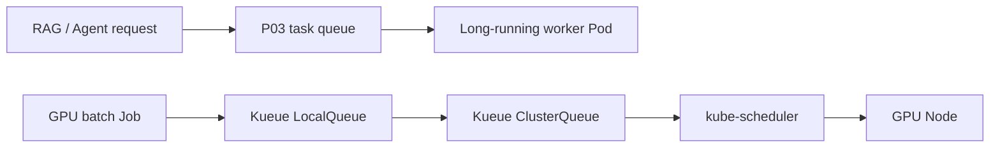

# E09-04 Kueue 概念实验

> 状态（2026-07-18）：`内容 content-reviewed / 实现 not-applicable / Reference unverified / 教学 partial / 归属 reference / 学习者 not-evaluated`。第一轮只做概念映射，不安装 Kueue，不创建“已调度成功”的虚假运行记录。

## 实验目的

区分三层不同问题：

```text
P03 Task Queue: 单个 RAG/Agent/InferenceTask 的业务排队
Kueue: Kubernetes batch workload 的准入、配额和排队
kube-scheduler: 已准入 Pod 到 Node 的资源放置
```

Kueue 不替代 P03 的 Redis/FIFO/SJF 队列，也不替代 kube-scheduler。

## 核心对象映射

| Kueue 概念 | 含义 | 与 P03/M05 的关系 |
|---|---|---|
| Workload | 需要资源准入的一组 Pod/Job | 比单个 P03 Task 粒度更粗 |
| LocalQueue | namespace 内提交入口 | 类似提交入口，但不是业务任务队列 |
| ClusterQueue | 跨 namespace 的配额与准入策略 | 可类比全局资源配额层 |
| ResourceFlavor | 不同资源类型/节点特征 | 可表达 GPU 型号、容量等资源差异 |
| cohort | ClusterQueue 间共享配额 | 对应资源借用关系，不等于任务抢占策略 |
| admission | 资源满足后允许 workload 运行 | 发生在 Pod 调度之前 |

## 概念推演

场景：研究组 A 和 B 都提交 GPU batch Job。

```text
Job -> LocalQueue
-> ClusterQueue 检查 quota
-> admitted Workload
-> Pod 创建/恢复调度
-> kube-scheduler 选择 Node
```

要求回答：

1. quota 不足时，等待发生在哪一层？
2. Workload 被准入后，谁决定 Pod 放到哪台 Node？
3. P03 内部的短请求优先或 predicted SJF 在哪一层？
4. 如果 P03 只有一个长期运行的 worker Deployment，Kueue 是否会为每个 HTTP Task 重新准入？

第 4 题的答案通常是否定的：Kueue 面向 Kubernetes workload，不会自动看到应用进程内部的每个任务。

## 最小设计产物

画出自己的两层图：



然后写一张边界表：

| 决策 | 所属层 | 依据 |
|---|---|---|
| 哪个 P03 Task 先执行 | P03/M05 | priority、预测时长、公平性 |
| 某个 GPU Job 是否准入 | Kueue | quota、flavor、cohort |
| Pod 放到哪个 Node | kube-scheduler | requests、affinity、taint/toleration |

## 将来真实实验的前置条件

- kind 集群已经验证。
- 使用与集群 Kubernetes 版本兼容的 Kueue 版本。
- 有明确的 Job workload，而不是只部署长期运行 API。
- 记录安装清单版本、CRD、quota 和完整清理命令。
- 实验后删除 Job、LocalQueue、ClusterQueue、ResourceFlavor 和 Kueue 安装资源。

版本和安装命令必须以 [Kueue 官方文档](https://kueue.sigs.k8s.io/docs/) 为准，不能把未来可能变化的命令固化成“已验证”。

## 学习者验收

- [ ] 能区分 P03 queue、Kueue admission 和 kube-scheduler placement。
- [ ] 能解释 Kueue 为什么不会自动调度进程内 HTTP Task。
- [ ] 能把 quota/flavor 映射到 AI workload 资源需求。
- [ ] 能说明真实安装前需要锁定哪些版本和清理对象。

## 边界

本页没有运行 Kueue，也没有证明任何调度性能改进；它只修复概念混淆并为后续实验定义可验证前提。
