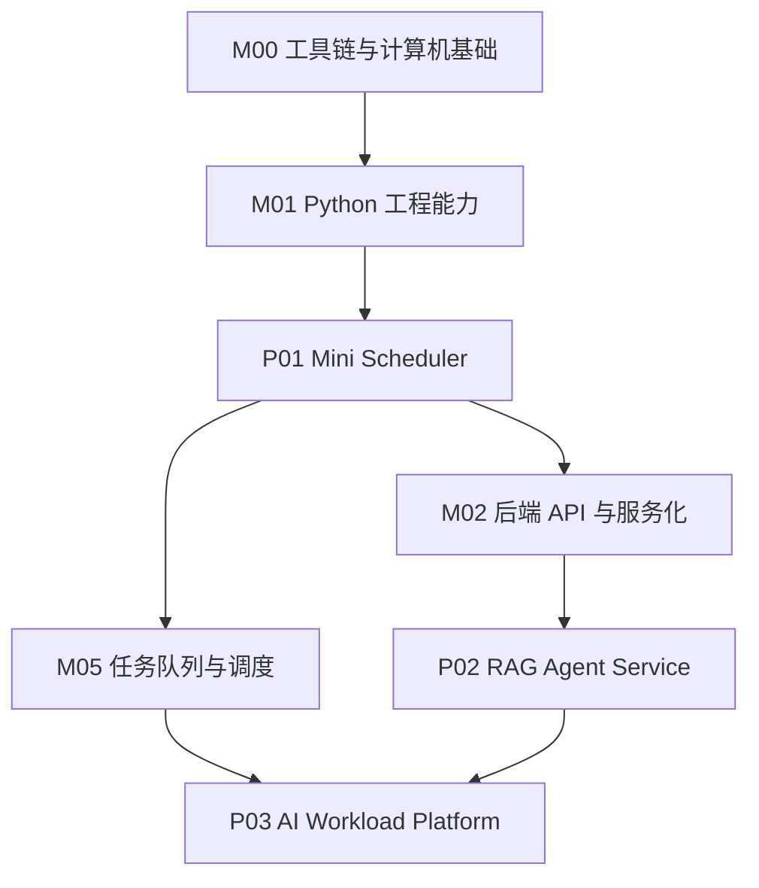
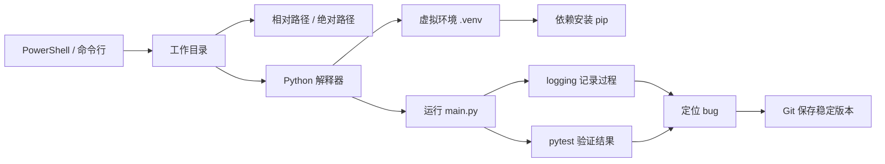
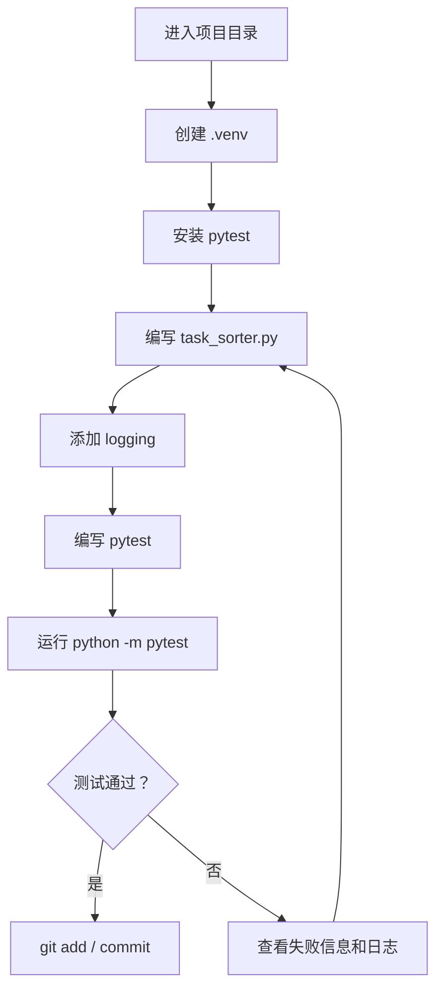

# M00 工具链与计算机基础完整学习讲义

## 0. 这份讲义怎么用

这不是资料清单，而是一份可以按顺序学习的入门讲义。目标不是把计算机基础全部学完，而是让你具备继续做 P01 Mini Scheduler、P02 RAG Agent Service 和后续 AI Infra 项目的最低工程控制力。

建议学习方式：

1. 先通读第 1-4 节，理解为什么要学这些工具。
2. 边读第 5-10 节，边在本地实际敲命令。
3. 每完成一节，去对应实验页记录结果。
4. 不要追求一次学完所有外部资料，只看讲义中指定的最小部分。

对应入口：

- 学习地图：[[10_学习模块/M00_工具链与计算机基础/M00_工具链与计算机基础_学习地图]]
- 资料索引：[[20_资料库/模块资料索引/M00_工具链与计算机基础_资料索引]]
- 当前实验：[[40_实验练习/E00_工具链基础实验/E00_工具链基础实验_索引]]
- 当前项目：[[50_项目产出/P01_Mini_Scheduler/P01_Mini_Scheduler 项目主页]]

---

## 1. 这个模块到底解决什么问题

你后面要做的是 AI Infra / RAG / Agent / 调度 / 云原生方向。听起来很高级，但所有高级系统最后都会落到非常朴素的问题：

- 我现在在哪个目录？
- 我运行的是哪个 Python？
- 依赖到底装到哪里了？
- 为什么代码在昨天能跑，今天不能跑？
- 这个 bug 是输入错了、路径错了、环境错了，还是逻辑错了？
- 我改坏了代码，能不能回到上一个稳定版本？
- 我怎么证明一个函数真的按预期工作？

M00 不是为了让你“会很多工具”，而是为了让你以后遇到问题时不慌。

如果 M00 没打牢，后面学习 FastAPI、RAG、Docker、Kubernetes 时，很容易出现这种状态：

```text
教程说运行这个命令
-> 我照着运行
-> 报错
-> 我不知道错在路径、环境、依赖、代码还是端口
-> 只能截图求助
```

M00 的目标是把这个过程变成：

```text
报错
-> 先看当前目录
-> 再看 Python 环境
-> 再看依赖
-> 再看日志
-> 再跑测试
-> 最后定位到具体原因
```

这就是工程学习的地基。

---

## 2. 本模块在整个路线中的位置



M00 不直接产出 AI 功能，但它决定你能不能独立完成后面的每一步。

对应关系：

| M00 能力 | 后续在哪里用 |
|---|---|
| 命令行和路径 | 创建项目、运行服务、进入目录、查日志 |
| Python 虚拟环境 | P01/P02/P03 分别管理依赖 |
| Git | 保存学习进度、回退错误修改、形成项目历史 |
| logging | 定位调度器、RAG、API 的运行问题 |
| pytest | 验证调度策略、API 逻辑、RAG 数据处理 |
| HTTP/JSON 基础 | 后续 FastAPI、RAG 服务、Agent 调用 |

---

## 3. 核心概念关系图



这个图可以理解成 M00 的学习主线：

1. 用命令行进入正确目录。
2. 在正确目录里用正确 Python。
3. 用虚拟环境隔离依赖。
4. 运行代码。
5. 用日志观察运行过程。
6. 用测试验证结果。
7. 用 Git 保存阶段成果。

---

## 4. 学术视角和工程视角

### 4.1 学术视角

从计算机系统角度看，M00 涉及这些基础概念：

- 文件系统：文件和目录如何组织。
- 进程执行环境：程序运行时依赖当前目录、环境变量和解释器。
- 版本控制：代码历史如何被记录和比较。
- 可复现性：别人能不能在同样环境下跑出同样结果。
- 软件质量保障：测试、日志、错误复现如何支撑可靠软件。

这些概念以后会扩展到：

- Docker 镜像为什么要固定依赖
- Kubernetes Pod 为什么有环境变量
- RAG 服务为什么要记录请求日志
- 调度实验为什么要固定 baseline 和变量

### 4.2 工程视角

从工程实践看，M00 解决的是每天都会遇到的问题：

| 场景 | 没有 M00 会怎样 | 有 M00 后应该怎样 |
|---|---|---|
| 运行项目 | 只会双击或复制命令 | 知道在哪个目录运行什么命令 |
| 安装依赖 | pip 装乱环境 | 用 `.venv` 隔离项目 |
| 调试 bug | 只看最后一行报错 | 按路径、环境、输入、日志逐步排查 |
| 修改代码 | 改坏后不知道怎么恢复 | Git 提交稳定版本 |
| 验证功能 | 肉眼看输出 | pytest 写成可重复测试 |

---

## 5. 第一核心：命令行、工作目录和路径

### 5.1 为什么要学命令行

命令行不是为了显得专业，而是因为工程项目通常不是一个文件，而是一组目录、配置、依赖、脚本和服务。

你以后会经常做这些事：

- 进入项目目录
- 创建虚拟环境
- 安装依赖
- 启动服务
- 运行测试
- 查看日志
- 提交 Git

这些动作都离不开命令行。

### 5.2 工作目录是什么

工作目录就是你当前命令行所在的位置。

在 PowerShell 里查看当前目录：

```powershell
Get-Location
```

列出当前目录文件：

```powershell
Get-ChildItem
```

进入目录：

```powershell
Set-Location <学习库根目录>
```

或者：

```powershell
cd <学习库根目录>
```

### 5.3 为什么路径会出错

很多初学者以为“文件存在”就应该能运行，但程序找文件时通常是从当前工作目录开始找。

例子：

```text
project/
  main.py
  data/
    tasks.json
```

如果你的代码写：

```python
open("data/tasks.json")
```

它的意思不是“从 main.py 所在位置找 data”，而是“从当前工作目录找 data”。

所以你在不同目录运行同一个 Python 文件，结果可能不同。

### 5.4 工程建议

一开始先养成三个习惯：

1. 运行代码前先看当前目录。
2. 所有项目都从项目根目录运行命令。
3. 报路径错误时，先不要改代码，先确认工作目录。

对应实验：

- [[40_实验练习/E00_工具链基础实验/E00-01 命令行创建 Python 项目]]

辅助资料：

- MIT Missing Semester Shell 讲义：https://missing.csail.mit.edu/2020/course-shell/
- MIT Missing Semester Shell 视频：https://www.youtube.com/watch?v=Z56Jmr9Z34Q

---

## 6. 第二核心：Python 解释器和虚拟环境

### 6.1 为什么同一台电脑会有多个 Python

你电脑上可能同时有：

- 系统自带 Python
- 你自己安装的 Python
- Anaconda 的 Python
- 某个项目 `.venv` 里的 Python
- VS Code 选中的 Python

如果你不确认当前运行的是哪个 Python，就会出现经典问题：

```text
我明明 pip install 了，为什么代码还是说 ModuleNotFoundError？
```

常见原因是：

```text
pip 装到了 A Python
代码运行的是 B Python
```

### 6.2 查看当前 Python

```powershell
python --version
```

查看 Python 位置：

```powershell
where python
```

更稳妥的做法是：

```powershell
python -c "import sys; print(sys.executable)"
```

### 6.3 什么是虚拟环境

虚拟环境就是给每个项目单独准备一套 Python 依赖。

没有虚拟环境时：

```text
所有项目共用一堆依赖
项目 A 升级了包
项目 B 可能被影响
```

有虚拟环境后：

```text
P01 使用自己的 .venv
P02 使用自己的 .venv
P03 使用自己的 .venv
互不干扰
```

### 6.4 创建虚拟环境

在项目根目录执行：

```powershell
python -m venv .venv
```

激活虚拟环境：

```powershell
.\.venv\Scripts\Activate.ps1
```

安装依赖时，建议使用：

```powershell
python -m pip install pytest
```

而不是直接：

```powershell
pip install pytest
```

原因是 `python -m pip` 更明确：用当前这个 Python 去调用 pip。

### 6.5 工程建议

每个项目都应该有：

```text
project/
  .venv/
  src/ 或 app/
  tests/
  README.md
  requirements.txt 或 pyproject.toml
```

当前阶段先不用纠结 `pyproject.toml`，先用最小可运行结构。

辅助资料：

- Python venv 官方文档：https://docs.python.org/3/library/venv.html

---

## 7. 第三核心：Git 不是备份工具，而是学习进度管理

### 7.1 为什么现在就要学 Git

很多人以为 Git 是团队协作才需要。其实自学阶段更需要 Git，因为你会不断试错。

没有 Git：

```text
今天代码能跑
我改了一堆
不能跑了
我不知道改坏了哪里
```

有 Git：

```text
能跑的时候提交一次
改坏后用 git diff 看差异
必要时回到稳定版本
```

### 7.2 最小 Git 流程

初始化仓库：

```powershell
git init
```

查看状态：

```powershell
git status
```

添加文件：

```powershell
git add .
```

提交：

```powershell
git commit -m "create task sorter skeleton"
```

查看提交历史：

```powershell
git log --oneline
```

查看改了什么：

```powershell
git diff
```

### 7.3 提交信息怎么写

不要写：

```text
update
fix
aaa
```

建议写：

```text
create task sorter skeleton
add pytest for priority sorting
fix duration sorting bug
```

好的提交信息应该说明这次改变解决了什么问题。

### 7.4 工程建议

每完成一个能跑的小成果，就提交一次。

适合提交的时机：

- 项目结构创建成功
- `python main.py` 能跑
- 一个测试通过
- 一个 bug 修复
- README 更新

对应实验：

- [[40_实验练习/E00_工具链基础实验/E00-02 Git 保存学习进度]]

辅助资料：

- Missing Semester Git 讲义：https://missing.csail.mit.edu/2020/version-control/
- Pro Git Book：https://git-scm.com/book/en/v2

---

## 8. 第四核心：logging 比 print 更适合工程项目

### 8.1 为什么不能只靠 print

`print` 在小脚本里能用，但项目稍微变复杂就会有问题：

- 不知道消息重要程度
- 不方便关闭或打开
- 不方便输出到文件
- 不方便区分正常流程和错误
- 不方便以后接入监控系统

`logging` 的好处是可以区分级别：

- `DEBUG`：调试细节
- `INFO`：正常运行信息
- `WARNING`：异常但还能继续
- `ERROR`：错误
- `CRITICAL`：严重错误

### 8.2 最小 logging 示例

```python
import logging

logging.basicConfig(
    level=logging.INFO,
    format="%(asctime)s %(levelname)s %(message)s",
)

tasks = [
    {"id": "t1", "priority": 2},
    {"id": "t2", "priority": 1},
]

logging.info("before sort: %s", tasks)
tasks = sorted(tasks, key=lambda task: task["priority"])
logging.info("after sort: %s", tasks)
```

### 8.3 在 P01 里 logging 应该记录什么

P01 Mini Scheduler 里，日志至少应该记录：

- 收到多少任务
- 当前使用什么调度策略
- 排序前任务顺序
- 排序后任务顺序
- worker 分配了哪个任务
- 每个任务等待了多久
- 哪个任务失败，为什么失败

示例：

```text
INFO scheduler=fifo task_count=10 worker_count=2
INFO before_order=t1,t2,t3,t4
INFO after_order=t1,t2,t3,t4
INFO assign worker=w1 task=t1
ERROR task=t3 reason=missing_duration
```

### 8.4 工程建议

日志不是写得越多越好。当前阶段只记录三类信息：

1. 输入是什么
2. 中间关键状态是什么
3. 输出或错误是什么

对应实验：

- [[40_实验练习/E00_工具链基础实验/E00-04 写一个带日志的小脚本]]

辅助资料：

- Python Logging HOWTO：https://docs.python.org/3/howto/logging.html
- Python logging 官方库文档：https://docs.python.org/3/library/logging.html

---

## 9. 第五核心：pytest 是最小工程自信

### 9.1 为什么要学测试

如果没有测试，你判断代码对不对通常靠肉眼：

```text
运行一下
看输出好像对
改一点
再看输出
```

问题是：

- 人会漏看
- 以后改代码容易破坏旧功能
- 你很难证明调度策略真的正确

测试的意义是把“我觉得对”变成“规则可重复验证”。

### 9.2 最小例子

假设你有一个排序函数：

```python
def sort_by_priority(tasks):
    return sorted(tasks, key=lambda task: task["priority"])
```

测试可以写成：

```python
from task_sorter import sort_by_priority


def test_sort_by_priority():
    tasks = [
        {"id": "t1", "priority": 3},
        {"id": "t2", "priority": 1},
        {"id": "t3", "priority": 2},
    ]

    result = sort_by_priority(tasks)

    assert [task["id"] for task in result] == ["t2", "t3", "t1"]
```

运行：

```powershell
python -m pytest
```

### 9.3 P01 里应该先测什么

不要一开始测所有东西。先测调度规则：

| 测试 | 验证什么 |
|---|---|
| FIFO | 先到的任务先执行 |
| Priority | 高优先级任务先执行 |
| SJF | duration 短的任务先执行 |
| 空任务列表 | 没任务时不崩 |
| 缺少字段 | 输入错误时能报清楚 |

### 9.4 工程建议

每个测试都应该对应一句业务规则。

例如：

```text
当使用 Priority 调度时，priority 数值更小的任务应该排在前面。
```

这样你以后写 README 或面试时，也能解释测试保护了什么规则。

对应实验：

- [[40_实验练习/E00_工具链基础实验/E00-05 为任务排序函数写 pytest]]
- [[40_实验练习/E01_Python基础练习/E01-03 pytest 测试调度器]]

辅助资料：

- pytest 官方文档：https://docs.pytest.org/
- pytest good practices：https://docs.pytest.org/en/7.1.x/explanation/goodpractices.html

---

## 10. HTTP 和 JSON：为后端 API 做准备

### 10.1 为什么 M00 也要碰 HTTP

后面你会做 FastAPI、RAG 服务、Agent 服务。这些服务的基本交互方式都是：

```text
客户端发送请求
服务端处理请求
服务端返回响应
```

HTTP 和 JSON 是理解后端服务的最小地基。

### 10.2 最小直觉

HTTP 请求包含：

- 方法：GET / POST / PUT / DELETE
- URL：请求地址
- headers：额外信息
- body：请求体，常见是 JSON

HTTP 响应包含：

- status code：状态码
- headers
- body：响应内容，常见是 JSON

### 10.3 用 httpx 做最小请求

```powershell
python -m pip install httpx
```

示例：

```python
import httpx

response = httpx.get("https://httpbin.org/get")

print(response.status_code)
print(response.json())
```

当前阶段你只需要理解：

- 200 表示请求成功
- 404 表示资源不存在
- 500 表示服务端错误
- JSON 可以转成 Python dict

对应实验：

- [[40_实验练习/E00_工具链基础实验/E00-03 用 httpx 请求一个 API]]

---

## 11. P01 Mini Scheduler 中的完整使用场景

现在把 M00 的所有能力串起来。

你要做一个 `task_sorter` 最小项目：

```text
task_sorter/
  .venv/
  task_sorter.py
  tests/
    test_task_sorter.py
  README.md
```

工作流应该是：



每一步都对应 M00 的一个知识点：

| 步骤 | 对应能力 |
|---|---|
| 进入目录 | Shell / 工作目录 |
| 创建 `.venv` | 虚拟环境 |
| 安装 pytest | 依赖管理 |
| 写代码 | Python 基础 |
| 加 logging | 调试和可观测性 |
| 写测试 | pytest |
| 提交 | Git |

---

## 12. 常见错误和排查顺序

### 12.1 `ModuleNotFoundError`

可能原因：

- 依赖没安装
- 安装到了别的 Python
- 当前虚拟环境没激活
- 项目结构导致 import 路径不对

排查顺序：

```powershell
python -c "import sys; print(sys.executable)"
python -m pip list
python -m pytest
```

### 12.2 找不到文件

可能原因：

- 当前工作目录不对
- 相对路径写错
- 文件名拼错
- 中文路径或空格没有处理好

排查顺序：

```powershell
Get-Location
Get-ChildItem
Get-ChildItem .\data
```

### 12.3 pytest 找不到测试

可能原因：

- 测试文件没有以 `test_` 开头
- 测试函数没有以 `test_` 开头
- 没在项目根目录运行
- import 路径不对

### 12.4 Git 不知道提交什么

先看：

```powershell
git status
git diff
```

不要盲目 `git add .`。先知道自己改了什么。

---

## 13. 推荐资料怎么用

| 资料 | 怎么学 | 当前是否必读 |
|---|---|---|
| MIT Missing Semester Shell | 看讲义前半部分，跟着做目录和命令练习 | 必读 |
| Missing Semester Git | 看 Git 基础和 mental model，不看高级分支流 | 必读 |
| Python venv docs | 只看创建和激活虚拟环境 | 必读 |
| Python Logging HOWTO | 只看 Basic Logging Tutorial | 必读 |
| pytest docs | 只看安装、运行、assert、测试发现 | 必读 |
| CS50P | 遇到 Python 基础不稳时补，不必全刷 | 选读 |
| Pro Git Book | Git 概念查阅，不从头读 | 查阅 |

视频辅助：

- Missing Semester Shell 视频：https://www.youtube.com/watch?v=Z56Jmr9Z34Q
- Missing Semester Git 视频：https://www.youtube.com/watch?v=2sjqTHE0zok
- CS50P Lecture 0：https://www.youtube.com/watch?v=JP7ITIXGpHk

---

## 14. 本模块最小学习路线

### 第 1 天：命令行和项目目录

目标：

- 能进入项目目录
- 能创建 `main.py`
- 能运行 `python main.py`

对应实验：

- [[40_实验练习/E00_工具链基础实验/E00-01 命令行创建 Python 项目]]

### 第 2 天：虚拟环境和依赖

目标：

- 能创建 `.venv`
- 能安装 pytest
- 能知道当前 Python 是哪个

### 第 3 天：Git 保存进度

目标：

- 能做一次 commit
- 能用 `git status` 和 `git diff` 看变化

对应实验：

- [[40_实验练习/E00_工具链基础实验/E00-02 Git 保存学习进度]]

### 第 4 天：logging 定位问题

目标：

- 能记录输入、关键状态和输出
- 能用日志定位一个小 bug

对应实验：

- [[40_实验练习/E00_工具链基础实验/E00-04 写一个带日志的小脚本]]

### 第 5 天：pytest 验证规则

目标：

- 给任务排序函数写 3 个测试
- 能看懂测试失败信息

对应实验：

- [[40_实验练习/E00_工具链基础实验/E00-05 为任务排序函数写 pytest]]

---

## 15. 学完检查

学完 M00 后，你应该能回答：

- 工作目录和代码文件所在目录一定一样吗？
- 为什么同一台电脑可能有多个 Python？
- 为什么建议用 `python -m pip`？
- 虚拟环境解决的是什么问题？
- `git status`、`git diff`、`git commit` 分别干什么？
- logging 和 print 的区别是什么？
- pytest 为什么比肉眼看输出可靠？
- `ModuleNotFoundError` 应该先查什么？
- 路径错误应该先查什么？

你还应该能独立完成：

- [ ] 创建一个 Python 项目目录
- [ ] 创建并激活 `.venv`
- [ ] 安装 pytest
- [ ] 写一个任务排序函数
- [ ] 写 3 个 pytest
- [ ] 加 logging
- [ ] 做一次 Git 提交
- [ ] 写一段实验记录

---

## 16. 本模块产出物

完成 M00 后，至少留下这些东西：

- 一个能运行的 `task_sorter` 最小项目
- 3-5 个 pytest
- 一次 Git 提交历史
- 一篇实验记录：[[40_实验练习/E00_工具链基础实验/E00-04 写一个带日志的小脚本]]
- 一张知识卡片：命令行工作目录
- 一张知识卡片：Python 虚拟环境
- 一张知识卡片：pytest 最小测试

---

## 17. 暂时不要深入的内容

这些内容有价值，但现在先不要钻：

- Linux 权限系统
- Shell 脚本自动化
- Git rebase / cherry-pick / submodule
- Python packaging 深水区
- Poetry / Hatch / uv 的复杂对比
- 操作系统完整课程
- 网络协议细节

当前阶段只需要达到：

```text
我能独立创建、运行、调试、测试、保存一个小 Python 工程。
```

这就是 M00 的合格线。
